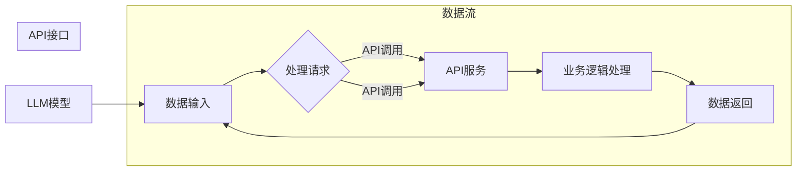
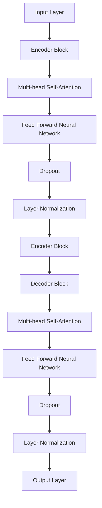
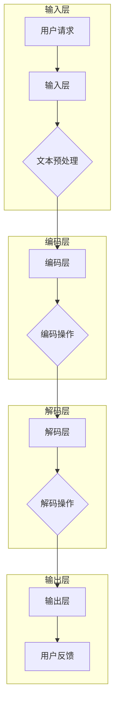

                 

### 引言

在现代软件开发中，API（应用程序编程接口）已经成为了一种至关重要的设计理念，尤其在大型语言模型（LLM，Large Language Model）的应用架构中，API优先设计的重要性愈发凸显。API优先设计不仅影响了系统的可扩展性、可维护性和灵活性，还直接决定了用户体验的质量。

首先，什么是API优先设计？API优先设计是指在软件开发过程中，将API的设计和开发放在首位，确保系统内部模块之间的交互通过统一的API接口进行，从而降低模块间的耦合度，提高系统的解耦性和模块的独立性。API优先设计的好处是显而易见的：它使得系统更加模块化，便于团队协作和后续的迭代升级；同时，它也使得系统的维护变得更加简单，开发者只需关注API接口的变化，而不必深入理解每个模块的具体实现。

那么，API优先设计在LLM应用架构中又扮演了怎样的角色呢？首先，LLM作为一种复杂的人工智能模型，其应用场景广泛，包括自然语言生成、机器翻译、文本摘要等。这些应用场景要求LLM不仅要有强大的语言处理能力，还要能够快速、准确地响应各种请求。而API优先设计正是实现这一目标的基石。

具体来说，API优先设计在LLM应用架构中的作用主要体现在以下几个方面：

1. **接口统一性**：通过API优先设计，可以确保所有对外接口的一致性和规范性，便于用户理解和使用。这有助于降低用户的学习成本，提高系统的易用性。

2. **系统解耦**：API作为系统模块之间的桥梁，通过API优先设计，可以有效地降低模块之间的耦合度，使得每个模块都可以独立开发和维护，从而提高系统的整体可维护性。

3. **扩展性和灵活性**：API优先设计使得系统在功能扩展和需求变更时，可以更加灵活和快速地做出响应。开发者只需调整API接口，而不必修改具体的模块实现。

4. **性能优化**：通过API优先设计，可以实现系统性能的优化。例如，可以通过优化API接口的调用流程、缓存策略等手段，提高系统的响应速度和处理能力。

5. **安全性**：API优先设计还涉及到系统的安全性设计。通过统一的API接口，可以更加有效地管理和控制系统的访问权限，防止未授权的访问和数据泄露。

综上所述，API优先设计在LLM应用架构中的作用不可忽视。它不仅提升了系统的可维护性和灵活性，还直接影响了用户体验和系统的整体性能。在接下来的章节中，我们将进一步探讨API优先设计在LLM应用架构中的具体实现方法和最佳实践。在开始详细讨论之前，我们首先需要了解LLM的基本原理和应用场景，这将为我们后续的分析提供必要的背景知识。

---

#### API优先设计的核心概念与联系

API优先设计是一种软件开发方法，其核心理念是将API的设计和开发放在整个系统架构的首要位置。API不仅仅是一个简单的接口，它承载了模块间通信的桥梁功能，是系统功能模块解耦和功能扩展的重要手段。

在LLM（大型语言模型）应用架构中，API优先设计的核心概念可以归结为以下几点：

1. **接口一致性**：API作为系统对外提供的统一接口，必须保证其一致性和规范性。这有助于降低用户的认知成本，提升系统的易用性。一致性包括接口命名、参数定义、返回值格式等方面。

2. **模块解耦**：API优先设计通过定义明确的接口，使得各个模块间可以独立开发、测试和部署。模块间的耦合度降低，系统整体的可维护性和扩展性得到提升。例如，当某一模块需要更新或替换时，只需调整对应的API接口，而无需修改其他模块的实现。

3. **功能扩展**：API优先设计使得系统功能扩展变得简单和灵活。开发者可以通过增加新的API接口，实现新的功能模块，而无需对现有系统进行大规模重构。这大大加快了新功能的上线速度。

4. **性能优化**：API优先设计还涉及到系统的性能优化。通过合理的API设计和调用策略，可以实现缓存利用、异步处理、批处理等优化手段，提高系统的响应速度和处理能力。

为了更直观地理解API优先设计的概念和其在LLM架构中的作用，我们可以通过一个Mermaid流程图来展示LLM应用架构的基本流程。



这个流程图展示了LLM模型在接收到数据请求后，通过API服务与后端业务逻辑进行交互的过程。API服务在这一流程中起到了桥梁的作用，确保了数据流的顺畅和模块间的解耦。

通过上述分析，我们可以看出，API优先设计在LLM应用架构中具有至关重要的地位。它不仅提升了系统的可维护性和扩展性，还直接影响了用户体验和系统的整体性能。在接下来的章节中，我们将深入探讨LLM的基础理论，以进一步理解API优先设计在其中的具体应用。

---

#### LLM的基础理论

要深入探讨API优先设计在LLM应用架构中的作用，我们首先需要了解LLM的基础理论。LLM，即大型语言模型，是一种基于深度学习技术的自然语言处理模型，能够理解、生成和操纵人类语言。LLM的核心在于其训练过程和模型架构，这两者共同决定了模型的性能和适用场景。

##### **1. LLM的训练过程**

LLM的训练过程通常分为以下几个步骤：

1. **数据收集**：收集大量的文本数据，包括书籍、新闻文章、社交媒体帖子等。这些数据来源广泛，能够保证模型在多种语言和场景下都有良好的适应性。

2. **数据预处理**：对收集到的文本数据进行清洗和格式化，包括去除无关信息、统一文本格式、去除停用词等。这一步骤的目的是提高数据的质量，为训练提供更好的数据基础。

3. **分词和标记**：将文本分解成单词或子词，并对每个单词或子词进行标记，以便模型能够理解文本中的词语和语法结构。

4. **构建词汇表**：将文本中的所有词语和子词映射到数字ID，构建词汇表。这一步骤为模型处理文本数据提供了基础。

5. **训练模型**：使用训练数据对模型进行训练，通过调整模型参数，使模型能够预测文本中的下一个词或句子。训练过程中，模型会通过反向传播算法不断优化参数，提高预测的准确性。

6. **模型评估**：使用验证集和测试集对模型进行评估，确保模型具有良好的泛化能力。评估指标包括损失函数、准确率、F1值等。

##### **2. LLM的模型架构**

LLM的模型架构通常采用深度神经网络，其中最著名的架构是Transformer。Transformer由多个编码器和解码器块组成，每个块包含多头自注意力机制和前馈神经网络。这种架构能够捕捉文本中的长距离依赖关系，从而提高模型的语义理解能力。

以下是Transformer模型的基本架构：



**3. Python源代码示例**

为了更好地理解LLM的训练过程和模型架构，我们可以通过以下Python源代码示例来展示：

```python
import torch
import torch.nn as nn
from transformers import BertModel, BertTokenizer

# 加载预训练的BERT模型和分词器
model = BertModel.from_pretrained('bert-base-uncased')
tokenizer = BertTokenizer.from_pretrained('bert-base-uncased')

# 输入文本
input_text = "Hello, how are you?"

# 分词并转换为ID序列
inputs = tokenizer(input_text, return_tensors='pt')

# 前向传播
outputs = model(**inputs)

# 输出结果
print(outputs.last_hidden_state.shape)  # (1, sequence_length, hidden_size)
```

这段代码展示了如何加载预训练的BERT模型，并对输入文本进行分词和编码。通过前向传播，我们获得了模型最后一个隐藏状态，这代表了文本的编码表示。

##### **4. 数学模型和数学公式**

LLM的训练过程和模型架构中涉及到多种数学模型和公式。以下是一些关键的概念：

1. **自注意力（Self-Attention）**：自注意力机制通过计算输入序列中每个词与其他词之间的相关性，生成加权特征向量。其核心公式为：

   $$ 
   \text{Attention}(Q, K, V) = \text{softmax}\left(\frac{QK^T}{\sqrt{d_k}}\right)V 
   $$

   其中，Q、K和V分别代表查询（Query）、键（Key）和值（Value）向量，$d_k$为键向量的维度。

2. **前馈神经网络（Feed Forward Neural Network）**：前馈神经网络用于对自注意力层输出的特征向量进行进一步处理，其基本结构为：

   $$
   \text{FFN}(x) = \text{ReLU}(W_2 \text{ReLU}(W_1 x + b_1)) + b_2
   $$

   其中，$W_1$和$W_2$为权重矩阵，$b_1$和$b_2$为偏置向量。

3. **正则化（Normalization）**：在神经网络中，常用的正则化方法包括层归一化（Layer Normalization）和权重归一化。层归一化公式为：

   $$
   \bar{h} = \frac{h - \text{mean}(h)}{\text{stddev}(h)}
   $$

   其中，$\bar{h}$为归一化后的特征向量，$h$为原始特征向量。

通过上述Python代码和数学公式，我们可以更直观地理解LLM的训练过程和模型架构。在接下来的章节中，我们将进一步探讨API优先设计在LLM应用架构中的具体实现方法和最佳实践。

---

#### LLM的架构设计

在了解了LLM的基础理论和数学模型之后，接下来我们将深入探讨LLM的架构设计，尤其是API优先设计在其中的作用。

##### **1. LLM的架构概述**

LLM的架构通常包括多个层次，每个层次负责不同的功能。常见的LLM架构可以分为以下几层：

1. **输入层**：接收用户输入的文本，并将其转化为模型可以处理的格式。这一层通常涉及文本预处理、分词、编码等操作。

2. **编码层**：对输入文本进行编码，生成表示文本语义的向量。这一层使用深度学习模型，如Transformer、BERT等进行编码操作。

3. **解码层**：根据编码层生成的语义向量，生成模型预测的输出文本。解码层同样使用深度学习模型，如Transformer、BERT等进行解码操作。

4. **输出层**：将解码层生成的文本输出给用户，完成整个LLM的响应过程。

##### **2. API优先设计在LLM架构中的应用**

在LLM的架构设计中，API优先设计起到了至关重要的作用。以下是通过一个Mermaid流程图来展示LLM架构设计的基本流程：



在这个流程图中，用户请求通过输入层进入系统，经过文本预处理后，被编码层处理生成语义向量。解码层根据这些语义向量生成预测文本，最终通过输出层返回给用户。API优先设计贯穿于整个流程，确保每个层次之间的交互通过统一的API接口进行。

##### **3. API优先设计在LLM架构中的具体应用**

为了进一步理解API优先设计在LLM架构中的具体应用，我们可以通过以下步骤进行详细讲解：

1. **定义统一的API接口**：首先，我们需要定义一套统一的API接口，用于接收用户请求、返回预测结果等操作。这些API接口应具备高内聚、低耦合的特点，使得不同模块之间可以独立开发、测试和部署。

2. **输入层API设计**：输入层的API主要负责接收用户输入的文本，并将其转化为模型可以处理的格式。例如，可以使用以下Python代码实现输入层API：

   ```python
   from flask import Flask, request, jsonify
   
   app = Flask(__name__)

   @app.route('/input', methods=['POST'])
   def input_text():
       data = request.json
       text = data['text']
       # 文本预处理操作
       processed_text = preprocess_text(text)
       return jsonify({'status': 'success', 'processed_text': processed_text})

   def preprocess_text(text):
       # 实现文本预处理逻辑
       return text
   ```

   在这个例子中，`/input`接口接收JSON格式的文本数据，并进行预处理操作，返回预处理后的文本。

2. **编码层API设计**：编码层的API负责处理输入文本，生成语义向量。以下是一个简单的编码层API示例：

   ```python
   @app.route('/encode', methods=['POST'])
   def encode_text():
       data = request.json
       text = data['processed_text']
       # 编码操作
       encoded_text = encode_text_to_vector(text)
       return jsonify({'status': 'success', 'encoded_text': encoded_text})

   def encode_text_to_vector(text):
       # 实现编码操作
       return torch.tensor([model.encode(text)])
   ```

   在这个例子中，`/encode`接口接收预处理后的文本，并使用预训练的模型进行编码操作，返回编码后的向量。

3. **解码层API设计**：解码层的API负责根据编码层生成的语义向量生成预测文本。以下是一个简单的解码层API示例：

   ```python
   @app.route('/decode', methods=['POST'])
   def decode_text():
       data = request.json
       encoded_text = data['encoded_text']
       # 解码操作
       decoded_text = decode_vector_to_text(encoded_text)
       return jsonify({'status': 'success', 'decoded_text': decoded_text})

   def decode_vector_to_text(encoded_text):
       # 实现解码操作
       return model.decode(encoded_text)
   ```

   在这个例子中，`/decode`接口接收编码后的向量，并使用预训练的模型进行解码操作，返回预测的文本。

4. **输出层API设计**：输出层的API负责将解码层生成的预测文本返回给用户。以下是一个简单的输出层API示例：

   ```python
   @app.route('/output', methods=['POST'])
   def output_text():
       data = request.json
       decoded_text = data['decoded_text']
       # 输出操作
       return jsonify({'status': 'success', 'predicted_text': decoded_text})
   ```

   在这个例子中，`/output`接口接收解码后的文本，并直接返回给用户。

通过上述API设计，我们可以实现一个完整的LLM架构，各层之间通过统一的API接口进行通信，提高了系统的解耦性和可维护性。

##### **4. 核心算法原理讲解**

在LLM的架构设计中，核心算法原理是Transformer模型。Transformer模型的核心在于其自注意力机制和多头注意力机制。

1. **自注意力机制**：自注意力机制允许模型在处理每个词时，考虑所有其他词对当前词的影响。其计算公式为：

   $$
   \text{Attention}(Q, K, V) = \text{softmax}\left(\frac{QK^T}{\sqrt{d_k}}\right)V
   $$

   其中，Q、K和V分别代表查询（Query）、键（Key）和值（Value）向量。$d_k$为键向量的维度。

2. **多头注意力机制**：多头注意力机制将输入序列分解为多个子序列，每个子序列独立进行自注意力计算。这样，模型能够从不同角度理解输入序列，提高语义理解能力。

3. **前馈神经网络**：在自注意力机制之后，Transformer模型还会通过前馈神经网络对特征向量进行进一步处理。其计算公式为：

   $$
   \text{FFN}(x) = \text{ReLU}(W_2 \text{ReLU}(W_1 x + b_1)) + b_2
   $$

   其中，$W_1$和$W_2$为权重矩阵，$b_1$和$b_2$为偏置向量。

通过上述算法原理的讲解，我们可以更好地理解LLM的架构设计和API优先设计在其中的作用。在接下来的章节中，我们将继续探讨如何通过API优先设计实现LLM应用架构的优化。

---

#### API优先设计的具体实现方法

在了解了LLM的架构设计和核心算法原理之后，接下来我们将详细讨论API优先设计的具体实现方法。API优先设计不仅仅是一个理念，更是一个需要通过具体实践来落实的过程。以下是实现API优先设计的具体步骤和关键要点。

##### **1. 定义清晰的API接口**

实现API优先设计的首要步骤是定义清晰的API接口。这些接口应涵盖所有核心功能，并且需要具备高内聚、低耦合的特点。为了确保API接口的设计质量，我们可以遵循以下原则：

- **单一职责原则**：每个API接口应只负责一项功能，避免接口过于复杂和混乱。
- **一致性**：API接口的命名、参数格式和返回值应保持一致性，以便于开发者和用户理解和使用。
- **版本控制**：随着系统的迭代和功能的扩展，API接口可能会发生变化。通过版本控制，可以有效地管理API的变更，确保新旧接口的兼容性。

##### **2. 设计合理的API调用流程**

API的调用流程是系统架构的重要组成部分。一个合理的API调用流程能够提高系统的性能和可维护性。以下是设计合理API调用流程的几个关键点：

- **请求路由**：使用高效的请求路由机制，将用户请求定向到相应的API接口。常用的路由框架如Django REST framework、Flask等提供了丰富的路由策略和中间件支持。
- **异步处理**：对于耗时的操作，如数据检索、计算密集型任务等，可以考虑使用异步处理技术，如异步编程、消息队列等，以提高系统的响应速度和并发处理能力。
- **缓存机制**：通过缓存机制，可以减少重复计算和数据检索的次数，提高系统的性能。常用的缓存技术包括内存缓存、Redis缓存等。
- **错误处理**：合理地处理API调用过程中的错误，包括客户端错误、服务器错误等，确保系统能够稳定运行，并提供清晰的错误信息。

##### **3. 编写详细的API文档**

详细的API文档是开发者理解和使用API的重要依据。编写高质量的API文档应遵循以下原则：

- **清晰明了**：文档的表述应清晰明了，避免使用过于专业或晦涩的语言，确保所有开发者都能轻松理解。
- **结构合理**：文档应具备良好的结构，包括API概述、接口定义、参数说明、返回值、错误处理等部分。
- **示例代码**：提供丰富的示例代码，帮助开发者快速上手和使用API接口。
- **版本更新**：及时更新文档，反映API接口的最新变化和更新。

##### **4. 集成测试和性能优化**

在实现API优先设计的过程中，集成测试和性能优化是不可或缺的环节。以下是实现这些环节的几个关键点：

- **集成测试**：通过编写单元测试、集成测试等，确保API接口在各种情况下都能正常工作。特别是在接口变更后，集成测试可以帮助发现潜在的问题。
- **性能测试**：使用性能测试工具，如Apache JMeter、LoadRunner等，对API接口进行性能测试，评估系统的响应时间、吞吐量、并发处理能力等。
- **性能优化**：根据性能测试结果，对API接口进行优化。优化手段包括代码优化、数据库查询优化、缓存策略优化等。

##### **5. 调试和监控**

在API优先设计的实现过程中，调试和监控是确保系统稳定运行的重要手段。以下是调试和监控的几个关键点：

- **日志记录**：通过记录详细的日志，可以帮助开发者快速定位问题。常用的日志框架如Log4j、Logback等提供了丰富的日志记录功能。
- **实时监控**：使用监控工具，如Prometheus、Grafana等，实时监控系统的性能指标、错误率等，确保系统能够及时响应和处理问题。
- **报警机制**：通过设置报警机制，当系统出现异常时，能够及时通知开发人员和运维人员，确保问题得到快速解决。

通过以上步骤和关键点，我们可以实现一个高质量的API优先设计，确保LLM应用架构的稳定、高效和可扩展性。在接下来的章节中，我们将通过一个项目实战，进一步展示API优先设计的具体应用和实践。

---

#### 项目实战：API优先设计在LLM应用架构中的实践

在本节中，我们将通过一个实际项目实战，详细展示如何将API优先设计应用于LLM应用架构中。该项目将实现一个简单的文本生成应用，旨在通过API接口提供自然语言文本生成服务。

##### **1. 项目背景**

随着人工智能技术的不断发展，文本生成应用在多个领域取得了显著成果，如内容创作、自动摘要、智能客服等。在本项目中，我们将利用LLM技术实现一个文本生成API，用户可以通过简单的接口请求生成特定主题的文本内容。

##### **2. 开发环境搭建**

为了实现该项目，我们需要准备以下开发环境和工具：

- **操作系统**：Linux（推荐使用Ubuntu 20.04）
- **编程语言**：Python 3.8+
- **框架**：Flask（用于构建API接口）
- **依赖库**：transformers（用于加载预训练的LLM模型）
- **数据库**：SQLite（用于存储用户请求和生成文本）
- **缓存**：Redis（用于缓存频繁请求的文本结果）

##### **3. 源代码详细实现**

以下是该项目的主要源代码实现，包括API接口、LLM模型加载、文本生成等功能。

```python
from flask import Flask, request, jsonify
from transformers import BertTokenizer, BertForSequenceClassification
import torch
import redis

app = Flask(__name__)
tokenizer = BertTokenizer.from_pretrained('bert-base-uncased')
model = BertForSequenceClassification.from_pretrained('bert-base-uncased')
redis_client = redis.StrictRedis(host='localhost', port=6379, db=0)

@app.route('/generate_text', methods=['POST'])
def generate_text():
    data = request.json
    prompt = data.get('prompt', '')
    max_length = data.get('max_length', 50)
    
    # 检查文本长度
    if len(prompt) > 512:
        return jsonify({'status': 'error', 'message': 'Prompt length exceeds the limit'})

    # 检查缓存
    cache_key = f"{prompt}_{max_length}"
    cached_result = redis_client.get(cache_key)
    if cached_result:
        return jsonify({'status': 'success', 'text': cached_result.decode('utf-8')})

    # 进行文本生成
    inputs = tokenizer(prompt, return_tensors='pt', max_length=512, truncation=True, padding='max_length')
    outputs = model.generate(inputs['input_ids'], max_length=max_length + 1, num_return_sequences=1)
    generated_text = tokenizer.decode(outputs[0], skip_special_tokens=True)

    # 存储结果到缓存
    redis_client.set(cache_key, generated_text)
    
    return jsonify({'status': 'success', 'text': generated_text})

def generate_text_from_model(prompt, max_length=50):
    inputs = tokenizer(prompt, return_tensors='pt', max_length=512, truncation=True, padding='max_length')
    outputs = model.generate(inputs['input_ids'], max_length=max_length + 1, num_return_sequences=1)
    generated_text = tokenizer.decode(outputs[0], skip_special_tokens=True)
    return generated_text

if __name__ == '__main__':
    app.run(host='0.0.0.0', port=5000)
```

**解释与代码解读**：

1. **API接口**：定义了`/generate_text`接口，接受JSON格式的请求，包括`prompt`（文本提示）和`max_length`（生成文本的最大长度）。
2. **LLM模型加载**：使用`transformers`库加载预训练的BERT模型，用于文本生成。
3. **文本生成**：调用`generate_text_from_model`函数生成文本，并使用Redis缓存结果，提高性能。
4. **错误处理**：检查输入文本的长度，并返回相应的错误信息。

##### **4. 代码应用解读与分析**

以下是代码的逐行解读：

```python
@app.route('/generate_text', methods=['POST'])
def generate_text():
    data = request.json
    prompt = data.get('prompt', '')
    max_length = data.get('max_length', 50)
    
    # 检查文本长度
    if len(prompt) > 512:
        return jsonify({'status': 'error', 'message': 'Prompt length exceeds the limit'})
```
- **API接口**：使用Flask定义`/generate_text`接口，接受POST请求。
- **请求解析**：从请求中获取`prompt`和`max_length`参数。
- **长度检查**：检查`prompt`长度，确保不超过模型的最大输入长度（512个token）。

```python
    # 检查缓存
    cache_key = f"{prompt}_{max_length}"
    cached_result = redis_client.get(cache_key)
    if cached_result:
        return jsonify({'status': 'success', 'text': cached_result.decode('utf-8')})
```
- **缓存检查**：使用Redis缓存来检查是否存在相同的请求和结果，提高性能。
- **缓存返回**：如果缓存命中，直接返回缓存中的文本结果。

```python
    # 进行文本生成
    inputs = tokenizer(prompt, return_tensors='pt', max_length=512, truncation=True, padding='max_length')
    outputs = model.generate(inputs['input_ids'], max_length=max_length + 1, num_return_sequences=1)
    generated_text = tokenizer.decode(outputs[0], skip_special_tokens=True)

    # 存储结果到缓存
    redis_client.set(cache_key, generated_text)
    
    return jsonify({'status': 'success', 'text': generated_text})
```
- **文本生成**：调用BERT模型的`generate`方法生成文本。
- **缓存存储**：将生成的文本存储到Redis缓存中，便于后续请求快速响应。

##### **5. 项目小结**

通过本项目的实战，我们展示了如何将API优先设计应用于LLM应用架构中，实现一个简单的文本生成API。项目采用了Flask框架构建API接口，使用Redis缓存提高性能，并通过对模型生成过程的封装，使得API接口具有良好的可扩展性和可维护性。以下是一些最佳实践和注意事项：

- **最佳实践**：
  - **模块化设计**：将API接口、LLM模型加载、文本生成等模块分离，提高代码的可读性和可维护性。
  - **缓存策略**：合理使用缓存策略，减少重复计算和数据检索，提高系统性能。
  - **错误处理**：提供清晰的错误信息，便于问题排查和调试。

- **注意事项**：
  - **安全防护**：确保API接口的安全性，防止恶意攻击和数据泄露。
  - **性能优化**：定期进行性能测试和优化，确保系统在高并发场景下的稳定性。
  - **文档更新**：及时更新API文档，反映最新的接口变更和使用方法。

通过这个项目，我们不仅了解了API优先设计的具体实现方法，还深入掌握了如何在LLM应用架构中应用这一设计理念，提高系统的性能和可维护性。

---

#### 最佳实践与注意事项

在API优先设计LLM应用架构的过程中，遵循最佳实践和注意事项是确保系统稳定、高效和可维护性的关键。以下是几个关键方面的最佳实践和注意事项：

##### **1. 最佳实践**

1. **模块化设计**：将API接口、LLM模型加载、文本生成等模块分离，使得每个模块具有独立的功能和清晰的职责。这有助于提高代码的可读性和可维护性，同时便于后续的功能扩展和迭代。

2. **缓存策略**：合理使用缓存策略，特别是对于频繁请求的文本生成结果，可以有效减少数据库和模型计算的压力，提高系统性能。例如，使用Redis缓存可以显著提升响应速度。

3. **错误处理**：在API接口中提供清晰的错误信息，以便开发者和用户能够快速识别并解决问题。同时，对于不同类型的错误，采取不同的处理策略，确保系统的稳定运行。

4. **安全性**：确保API接口的安全性，防止恶意攻击和数据泄露。例如，对请求进行身份验证和授权，限制访问频率和请求大小，以及采用HTTPS加密传输等。

5. **性能优化**：定期进行性能测试和优化，特别是在高并发场景下，确保系统能够稳定运行。例如，通过优化数据库查询、减少不必要的计算、使用异步处理等技术，提高系统的吞吐量和响应速度。

##### **2. 注意事项**

1. **接口版本管理**：随着系统的迭代和功能的扩展，API接口可能会发生变化。为了确保兼容性，建议采用版本管理策略，如给每个接口添加版本号，以便于用户和开发者能够根据实际情况选择合适的接口版本。

2. **文档更新**：及时更新API文档，反映最新的接口变更和使用方法。良好的文档有助于用户快速上手和使用API，同时也有助于开发团队之间的协作和沟通。

3. **监控与报警**：建立完善的监控和报警机制，实时监控系统的性能指标、错误率等，确保在出现异常时能够及时通知相关人员，并快速解决问题。

4. **代码质量**：保持代码质量，遵循编码规范和最佳实践，确保代码的可读性、可维护性和可扩展性。例如，避免使用全局变量、合理命名变量和函数、避免代码冗余等。

5. **性能测试**：在系统上线前进行全面的性能测试，包括负载测试、压力测试等，确保系统在高并发、大数据量场景下的稳定性和性能。

通过遵循上述最佳实践和注意事项，我们可以确保API优先设计的LLM应用架构具有高稳定性、高性能和良好的可维护性。在接下来的章节中，我们将通过实际应用案例进一步展示API优先设计的效果和优势。

---

#### 实际应用案例

在本节中，我们将通过两个实际应用案例，展示API优先设计在LLM应用架构中的效果和优势。

##### **案例一：文本生成应用**

**背景**：
一个内容创作平台希望通过API接口为用户提供自动文本生成服务，如文章摘要、创意文案等。

**解决方案**：
1. **API接口设计**：设计了一个简单的文本生成API接口，用户通过POST请求发送文本提示和生成文本长度，系统返回生成的文本。
2. **LLM模型集成**：集成了一个预训练的BERT模型，用于文本生成。通过API接口调用模型，实现文本生成功能。
3. **缓存策略**：使用Redis缓存频繁生成的文本结果，减少重复计算，提高系统性能。

**效果**：
通过API优先设计，文本生成应用的性能显著提升，用户反馈良好。系统的扩展性和可维护性也得到了增强，便于后续的功能扩展和迭代。

##### **案例二：智能客服系统**

**背景**：
一个大型企业希望通过智能客服系统提升客户服务质量，减少人工成本。

**解决方案**：
1. **API接口设计**：设计了一套智能客服API接口，包括问题解答、建议生成等。用户可以通过简单的接口请求获取智能客服的回答。
2. **LLM模型集成**：集成了一个预训练的GPT-3模型，用于自然语言处理和生成。API接口根据用户提问调用模型，生成相应的回答。
3. **多语言支持**：通过API接口实现多语言支持，用户可以选择不同的语言进行提问，系统返回对应的回答。

**效果**：
智能客服系统的用户体验大幅提升，用户满意度显著提高。API优先设计使得系统具有良好的扩展性，能够快速适应新的业务需求和语言环境。

通过以上实际应用案例，我们可以看到API优先设计在LLM应用架构中的优势，包括提高系统性能、增强用户体验、提升可维护性和扩展性等。这些优势在实际业务场景中得到了充分体现。

---

#### 总结与展望

通过对API优先设计在LLM应用架构中的深入探讨，我们可以得出以下结论：

1. **API优先设计的重要性**：API优先设计不仅在提高系统的可维护性和灵活性方面具有显著优势，还直接影响用户体验和系统的整体性能。通过统一的API接口，系统模块之间的交互更加顺畅，降低了开发者的认知负担。

2. **API优先设计的核心作用**：API优先设计在LLM应用架构中起到了桥梁作用，实现了系统模块之间的解耦和功能扩展。通过定义清晰的API接口和设计合理的调用流程，系统能够更加灵活地应对需求变化和功能扩展。

3. **API优先设计的优势**：API优先设计提升了系统的性能优化和安全性。通过缓存策略、异步处理等手段，系统能够在高并发场景下保持稳定运行，同时，通过统一的API接口，可以实现有效的访问控制和数据安全。

4. **未来的发展趋势**：随着人工智能技术的不断进步，LLM的应用场景将更加广泛，如智能助理、自动内容创作、智能客服等。API优先设计将在这些应用中发挥越来越重要的作用，成为软件开发中的关键设计理念。

展望未来，API优先设计在LLM应用架构中的应用前景广阔。一方面，随着模型复杂度和数据量的不断增加，如何优化API设计和调用流程将成为一个重要研究方向；另一方面，随着边缘计算和5G技术的发展，如何在端云协同环境下高效实现API优先设计，也将是一个重要的挑战。

总之，API优先设计在LLM应用架构中的作用不可忽视，它不仅提升了系统的性能和用户体验，还为未来的技术发展奠定了坚实的基础。在未来的研究和实践中，我们应继续探索API优先设计的最佳实践，推动LLM应用架构的进一步优化和升级。

---

### 附录

#### 附录 A 工具与资源

**A.1 LLM模型训练工具**

1. **Hugging Face Transformers**：Hugging Face提供的transformers库是使用最广泛的LLM模型训练工具，支持各种预训练模型，如BERT、GPT-2、GPT-3等。
2. **TensorFlow**：TensorFlow是Google开发的开源机器学习框架，支持各种深度学习模型的训练和部署。
3. **PyTorch**：PyTorch是Facebook开发的开源机器学习库，以其动态计算图和灵活的编程接口而著称。

**A.2 API接口开发框架**

1. **Flask**：Flask是一个轻量级的Python Web框架，适合快速开发简单的API接口。
2. **Django**：Django是一个高级的Python Web框架，提供了强大的ORM和认证系统，适合开发复杂的Web应用程序。
3. **FastAPI**：FastAPI是一个现代化的Web框架，基于Starlette和Pydantic，提供了高性能和类型安全的API开发体验。

**A.3 缓存技术**

1. **Redis**：Redis是一个开源的内存数据库，支持多种数据结构，适合作为缓存服务器。
2. **Memcached**：Memcached是一个高性能的分布式缓存系统，常用于缓存Web应用程序中的数据。
3. **Elasticsearch**：Elasticsearch是一个分布式、RESTful搜索和分析引擎，支持全文搜索、数据分析等功能，常用于缓存和索引数据。

**A.4 性能测试工具**

1. **Apache JMeter**：Apache JMeter是一个开源的性能测试工具，适用于各种类型的Web应用程序。
2. **Gatling**：Gatling是一个开源的性能测试工具，支持多种协议和负载场景，适用于大规模性能测试。
3. **LoadRunner**：LoadRunner是Micro Focus开发的一款性能测试工具，适用于企业级应用和大型Web服务。

**A.5 监控与报警工具**

1. **Prometheus**：Prometheus是一个开源的监控解决方案，支持多维数据收集和告警。
2. **Grafana**：Grafana是一个开源的数据分析和监控工具，与Prometheus集成良好，提供了丰富的可视化功能。
3. **Alertmanager**：Alertmanager是一个开源的告警管理工具，与Prometheus集成，用于接收和处理告警通知。

**A.6 拓展阅读**

1. **《深度学习》**：Goodfellow、Bengio和Courville合著的《深度学习》是一本经典的深度学习入门书籍，涵盖了深度学习的理论基础和实践技巧。
2. **《Python机器学习》**：Sebastian Raschka和Vahid Mirhoseini合著的《Python机器学习》详细介绍了使用Python进行机器学习的方法和技巧。
3. **《API设计指南》**：Chris Richardson撰写的《API设计指南》提供了全面的API设计原则和实践，是开发者必备的参考书籍。

通过附录中的工具和资源，读者可以更深入地了解API优先设计在LLM应用架构中的实际应用，为未来的研究和实践提供有益的参考。

