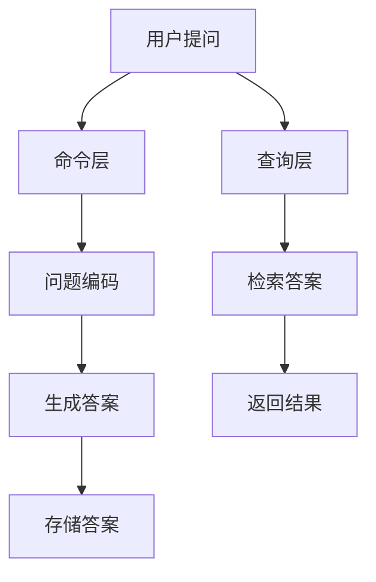
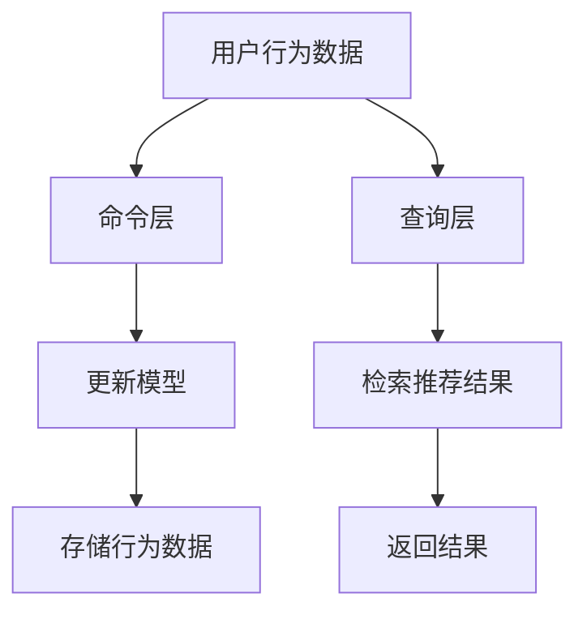
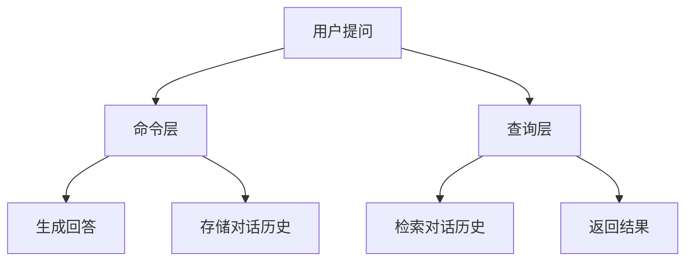

                 

# CQRS模式在LLM应用中的应用

## 关键词
- CQRS模式
- LLM应用
- 分布式系统
- 并发处理
- 性能优化

## 摘要
本文将深入探讨CQRS（Command Query Responsibility Segregation）模式在大型语言模型（LLM）应用中的实际应用。CQRS模式是一种用于提高分布式系统中数据处理效率的设计模式，它通过将命令（修改数据的操作）和查询（读取数据的操作）分离，来优化系统的性能和可扩展性。本文将首先介绍CQRS模式的基本概念和原理，然后分析其与LLM应用的关系，最后通过具体的实例和实战经验，展示如何在实际项目中成功应用CQRS模式。

## 引言
在现代互联网应用中，大型语言模型（LLM）已经成为众多领域的关键技术，从自然语言处理到智能推荐系统，再到虚拟助手，LLM的应用范围越来越广。然而，随着数据规模和用户需求的增长，如何高效地处理大量的读写请求，成为LLM应用中的一大挑战。CQRS模式作为一种有效的解决方案，可以显著提升系统的性能和可扩展性。

本文将从以下几个方面展开讨论：

1. **CQRS模式的基本概念**：介绍CQRS模式的概念、原理及其在分布式系统中的应用。
2. **LLM技术基础**：回顾LLM的基本知识，包括模型的架构、训练过程、应用等。
3. **CQRS模式与LLM的关系**：讨论CQRS模式如何适用于LLM应用，包括其优势、挑战及适用场景。
4. **CQRS模式在LLM中的应用实例**：提供一些具体的CQRS模式在LLM中的应用实例，展示其实际效果。
5. **CQRS模式的实施**：讨论如何在实际项目中实施CQRS模式，包括所需的工具和技术。
6. **性能优化与问题解决**：介绍如何优化CQRS模式在LLM应用中的性能，以及解决可能出现的问题。
7. **未来展望**：讨论CQRS模式在LLM应用中的未来发展。

通过本文的探讨，希望能够为开发者提供关于CQRS模式在LLM应用中的实际应用经验和理论支持。

## CQRS模式的基本概念

CQRS（Command Query Responsibility Segregation）模式是一种架构设计模式，它通过将命令（Command）和查询（Query）分离，来提高分布式系统的性能和可扩展性。传统的数据处理模式通常将命令和查询混合在一起，这在系统中导致了一系列的问题，如并发处理困难、查询性能下降、系统扩展性受限等。CQRS模式则通过分离这两种操作，提供了更为高效和灵活的解决方案。

### CQRS模式的核心思想

CQRS模式的核心思想是将系统的读写操作分离到两个独立的层次上，使得每个层次都能独立优化，从而提升整个系统的性能。具体来说，CQRS模式的主要特点包括：

1. **命令和查询分离**：在CQRS模式中，系统的命令层（Command Layer）负责处理所有数据的修改操作，如创建、更新、删除等。而查询层（Query Layer）则负责处理所有数据的读取操作，如检索、查询等。通过分离命令和查询，可以确保每个层次的性能和扩展性都能得到最佳优化。

2. **独立的数据模型**：CQRS模式允许命令层和查询层使用不同的数据模型。命令层通常使用适合修改操作的数据模型，如关系数据库。而查询层则可能使用更适合读取操作的数据模型，如文档数据库或分布式缓存。这种独立的数据模型使得每个层次都能根据自身的需求进行优化。

3. **事件溯源**：CQRS模式通常结合事件溯源（Event Sourcing）技术，将所有数据的修改操作记录为事件。这些事件可以用来重建数据状态，从而实现高效的查询操作。事件溯源提供了强大的可扩展性和容错能力，使得系统可以轻松应对大规模并发操作。

### CQRS模式在分布式系统中的应用

在分布式系统中，CQRS模式通过以下方式提升系统的性能和可扩展性：

1. **并发处理**：由于命令和查询分离，系统可以独立处理并发操作。命令层可以并行处理大量的修改请求，而查询层则可以独立处理读取请求，从而提高了系统的并发处理能力。

2. **性能优化**：通过使用适合自身操作的数据模型，命令层和查询层可以分别进行性能优化。例如，命令层可以采用事务处理和锁机制来确保数据的一致性，而查询层则可以采用索引和数据缓存来提高查询速度。

3. **扩展性**：CQRS模式使得系统可以独立扩展命令层和查询层。当系统的负载增加时，可以单独扩展命令层或查询层，而不需要同时扩展整个系统。

4. **容错性**：事件溯源技术提供了强大的容错能力。在系统发生故障时，可以通过重放事件来恢复数据状态，从而确保系统的可靠性和稳定性。

### CQRS模式与传统数据处理模式的比较

与传统的数据处理模式相比，CQRS模式具有以下优点：

1. **性能提升**：通过分离命令和查询，CQRS模式可以显著提高系统的查询性能和响应速度。

2. **可扩展性**：CQRS模式使得系统可以独立扩展命令层和查询层，从而提高了系统的可扩展性和灵活性。

3. **可维护性**：由于命令和查询分离，系统的维护和升级变得更加容易。开发者可以分别对命令层和查询层进行优化和更新，而不需要同时处理两个层次的变更。

4. **一致性**：通过使用事件溯源技术，CQRS模式可以提供强一致性保证，从而确保数据的一致性和可靠性。

总之，CQRS模式通过分离命令和查询操作，提供了一种高效的分布式系统设计方法。在LLM应用中，CQRS模式可以显著提升系统的性能和可扩展性，为开发者解决大规模数据处理问题提供了强有力的支持。

### CQRS模式与LLM的关系

大型语言模型（LLM）作为现代人工智能的核心技术，其应用场景广泛，包括但不限于自然语言处理、智能推荐系统、虚拟助手等。然而，随着数据规模和用户数量的增长，如何高效地处理大量的读写请求，成为LLM应用中的一个关键挑战。CQRS模式作为一种强大的架构设计模式，为解决这一挑战提供了有效的方法。

#### CQRS模式在LLM应用中的优势

1. **提升查询性能**：在LLM应用中，用户经常需要进行各种查询操作，如检索特定信息、生成文本摘要等。CQRS模式通过分离查询操作，使得查询层可以独立优化，采用更适合读取操作的数据模型（如分布式缓存、文档数据库）和查询优化技术（如索引、缓存），从而显著提升查询性能。

2. **提高系统可扩展性**：随着LLM应用的用户数量和数据规模不断增长，系统的扩展性成为关键问题。CQRS模式允许独立扩展命令层和查询层，使得系统可以灵活应对不同的负载需求。例如，当用户数量增加时，可以单独扩展查询层，增加更多的查询节点，而不需要同时扩展整个系统。

3. **增强并发处理能力**：在并发操作较多的场景中，如同时处理大量用户的查询请求，CQRS模式通过分离命令和查询操作，使得系统可以并行处理大量的修改请求和查询请求，从而提高系统的并发处理能力。

4. **实现数据一致性**：在LLM应用中，数据的一致性至关重要。CQRS模式结合事件溯源技术，通过记录所有数据修改操作为事件，可以实现强一致性保证。当系统发生故障时，可以通过重放事件恢复数据状态，确保数据的一致性和可靠性。

#### CQRS模式在LLM应用中的挑战

1. **设计复杂性**：CQRS模式需要分离命令层和查询层，这增加了系统的设计复杂性。开发者需要仔细设计两个层次之间的交互机制，确保数据的一致性和可靠性。

2. **性能优化难度**：由于命令层和查询层使用不同的数据模型，性能优化变得更加复杂。开发者需要针对不同的数据模型，采用相应的优化技术，如索引、缓存、分区等。

3. **事件溯源的挑战**：事件溯源虽然提供了强大的可扩展性和容错能力，但其实现和运维复杂度较高。开发者需要确保事件溯源的正确性，避免数据丢失或状态不一致的问题。

#### CQRS模式在LLM应用中的适用场景

1. **高并发查询场景**：在LLM应用中，如自然语言处理平台，用户经常需要同时查询大量的信息。CQRS模式通过分离查询操作，可以显著提升系统的查询性能，满足高并发查询需求。

2. **数据一致性要求较高的场景**：在需要确保数据一致性的场景，如智能推荐系统，CQRS模式结合事件溯源技术，可以提供强一致性保证，确保推荐结果的准确性和可靠性。

3. **数据规模持续增长的场景**：在数据规模持续增长的场景，如虚拟助手，CQRS模式可以独立扩展查询层，使得系统可以灵活应对不同的负载需求，保持良好的性能和扩展性。

总之，CQRS模式在LLM应用中具有显著的优势，但同时也面临一定的挑战。开发者需要根据具体应用场景，综合考虑设计复杂性、性能优化难度和事件溯源的挑战，合理地应用CQRS模式，以提升LLM应用的整体性能和可扩展性。

### LLM技术基础

要深入探讨CQRS模式在LLM应用中的具体实践，我们首先需要了解LLM（大型语言模型）的基础知识。LLM是一种基于深度学习技术的自然语言处理模型，具有强大的文本生成和语义理解能力。在本节中，我们将简要回顾LLM的基本架构、训练过程以及应用场景。

#### LLM的基本架构

LLM的基本架构通常包括以下几个关键组件：

1. **输入层**：接收用户输入的文本，并将其转换为模型可以处理的格式。这一过程通常涉及分词、编码等操作。

2. **隐藏层**：隐藏层是LLM的核心，通过多层神经网络结构（如Transformer）对输入文本进行编码，提取语义信息。

3. **输出层**：输出层通常是一个softmax层，用于生成文本的候选词序列，并计算每个词的概率分布。

4. **注意力机制**：在隐藏层中，注意力机制用于关注输入文本的不同部分，以提升模型对上下文信息的理解能力。

5. **训练过程**：LLM的训练过程涉及大量文本数据的预处理、模型参数的初始化、前向传播和反向传播等步骤。通过梯度下降等方法不断优化模型参数，使模型能够生成更符合人类语言的文本。

#### LLM的训练过程

LLM的训练过程可以分为以下几个阶段：

1. **数据收集与预处理**：收集大规模的文本数据，并进行清洗、分词、编码等预处理操作，以便模型能够理解和学习。

2. **模型初始化**：初始化模型参数，通常采用随机初始化或预训练模型的方法。

3. **前向传播**：将预处理后的文本输入模型，通过多层神经网络和注意力机制进行编码，生成输出概率分布。

4. **损失函数计算**：计算输出概率分布与真实标签之间的损失，常用的损失函数包括交叉熵损失等。

5. **反向传播**：根据损失函数计算模型参数的梯度，并通过梯度下降等方法更新模型参数。

6. **迭代优化**：重复前向传播、损失函数计算和反向传播的过程，不断优化模型参数，直至达到训练目标。

#### LLM的应用场景

LLM在众多应用场景中表现出色，以下是一些常见的应用：

1. **自然语言生成**：生成文章、新闻报道、电子邮件等文本内容。例如，自动化新闻生成、智能客服等。

2. **问答系统**：根据用户的问题，生成准确的答案。例如，智能搜索引擎、问答机器人等。

3. **文本摘要**：从长文本中提取关键信息，生成简短的摘要。例如，新闻摘要、文档摘要等。

4. **情感分析**：分析文本的情感倾向，用于情感识别、舆情监测等。

5. **机器翻译**：将一种语言的文本翻译成另一种语言。例如，谷歌翻译、深度学习机器翻译系统等。

#### CQRS模式与LLM结合的必要性

1. **海量数据处理**：LLM应用通常涉及大规模文本数据的处理，CQRS模式通过分离命令和查询操作，可以高效地处理大量并发请求，提升系统性能。

2. **数据一致性**：在LLM应用中，数据的一致性至关重要。CQRS模式结合事件溯源技术，可以确保数据的一致性和可靠性。

3. **扩展性**：随着LLM应用的规模不断扩大，CQRS模式可以独立扩展命令层和查询层，提高系统的可扩展性。

4. **性能优化**：通过CQRS模式，LLM应用可以采用更适合查询操作的数据模型和优化技术，如索引、缓存等，进一步提升查询性能。

总之，了解LLM的基本架构、训练过程和应用场景，对于理解CQRS模式在LLM应用中的具体实践具有重要意义。在下一节中，我们将通过具体的实例，进一步探讨CQRS模式在LLM应用中的实际应用。

### CQRS模式在LLM中的应用实例

为了更好地理解CQRS模式在大型语言模型（LLM）中的应用，下面我们将通过几个具体实例来展示其如何在实际项目中发挥作用。

#### 实例1：智能问答系统的优化

**背景介绍**：一个智能问答系统需要处理大量的用户提问，并快速生成准确的答案。然而，传统的数据处理方式由于读写操作混合在一起，导致系统在高并发场景下性能不佳。

**核心概念与联系**

在CQRS模式中，我们可以将系统分为命令层和查询层：

- **命令层**：负责接收和处理用户的提问请求，将问题编码为模型可以理解的格式，并生成答案。
- **查询层**：负责快速检索已有的答案，以提高响应速度。

**Mermaid流程图**



**核心算法原理讲解**

1. **问题编码**：使用编码器将用户的自然语言问题转换为模型可以处理的向量表示。

2. **生成答案**：使用训练好的LLM模型，根据问题编码生成答案。这一过程通常涉及前向传播和注意力机制的计算。

3. **存储答案**：将生成的答案存储在数据库中，以便快速检索。

4. **检索答案**：当用户提问时，查询层首先检查数据库中是否有相似的答案。如果有，直接返回结果；如果没有，执行生成答案的过程。

**Python源代码**

```python
import torch
from transformers import BertTokenizer, BertForQuestionAnswering

# 初始化模型和编码器
tokenizer = BertTokenizer.from_pretrained('bert-base-uncased')
model = BertForQuestionAnswering.from_pretrained('bert-base-uncased')

# 问题编码
question = "What is the capital of France?"
encoding = tokenizer(question, return_tensors='pt')

# 生成答案
with torch.no_grad():
    outputs = model(**encoding)

# 输出答案
answer = outputs.start_logits.argmax(-1).item()
print(answer)
```

**数学模型和公式**

在生成答案的过程中，我们使用了一个基于Transformer的BERT模型。其主要公式包括：

$$
\text{Start Logit} = \text{softmax}(\text{Transformer Output})
$$

其中，`Transformer Output`是模型的输出向量，通过softmax函数计算得到每个词的概率分布。

#### 实例2：智能推荐系统的查询优化

**背景介绍**：一个智能推荐系统需要处理大量用户的个性化推荐请求，并快速返回推荐结果。然而，传统的数据处理方式在高并发场景下性能较差。

**核心概念与联系**

在CQRS模式中，我们可以将系统分为以下两个层次：

- **命令层**：负责处理用户的点击、评分等行为数据，更新推荐模型。
- **查询层**：负责快速检索推荐结果，返回给用户。

**Mermaid流程图**



**核心算法原理讲解**

1. **行为数据更新**：收集用户的点击、评分等行为数据，并将其用于训练推荐模型。

2. **模型训练**：使用收集到的行为数据，对推荐模型进行训练，以优化模型的预测能力。

3. **推荐结果检索**：根据用户的当前状态，快速检索推荐结果。

4. **推荐结果返回**：将检索到的推荐结果返回给用户。

**Python源代码**

```python
import numpy as np
import pandas as pd
from sklearn.model_selection import train_test_split
from lightfm import LightFM

# 加载数据
data = pd.read_csv('user_behavior.csv')
train_data, test_data = train_test_split(data, test_size=0.2)

# 初始化模型
model = LightFM()

# 训练模型
model.fit(train_data['user_id'], train_data['item_id'], train_data['rating'])

# 检索推荐结果
user_id = 123
predictions = model.predict(user_id, np.arange(model.num_items()))

# 返回推荐结果
top_items = np.argsort(predictions)[::-1]
print(top_items)
```

**数学模型和公式**

在训练推荐模型时，我们使用了基于矩阵分解的LightFM模型。其主要公式包括：

$$
\hat{r}_{ui} = \mu + q_u \cdot i + b_u + b_i
$$

其中，`r_ui`是用户`u`对物品`i`的评分预测，`q_u`和`i`分别是用户和物品的嵌入向量，`b_u`和`b_i`是用户和物品的偏置项。

#### 实例3：智能对话机器人的性能优化

**背景介绍**：一个智能对话机器人需要快速响应用户的询问，并提供准确的回答。然而，在高并发场景下，传统数据处理方式性能较差。

**核心概念与联系**

在CQRS模式中，我们可以将系统分为以下两个层次：

- **命令层**：负责处理用户的提问请求，生成回答。
- **查询层**：负责快速检索对话历史，以提供上下文信息。

**Mermaid流程图**



**核心算法原理讲解**

1. **回答生成**：使用训练好的LLM模型，根据用户的提问生成回答。

2. **对话历史存储**：将生成的回答和用户提问存储在数据库中，以便快速检索。

3. **对话历史检索**：根据用户的当前提问，检索对话历史，以提供上下文信息。

4. **结果返回**：将生成的回答和对话历史返回给用户。

**Python源代码**

```python
import torch
from transformers import BertTokenizer, BertForQuestionAnswering

# 初始化模型和编码器
tokenizer = BertTokenizer.from_pretrained('bert-base-uncased')
model = BertForQuestionAnswering.from_pretrained('bert-base-uncased')

# 问题编码
question = "What is the capital of France?"
encoding = tokenizer(question, return_tensors='pt')

# 生成回答
with torch.no_grad():
    outputs = model(**encoding)

# 输出回答
answer = outputs.start_logits.argmax(-1).item()
print(answer)
```

**数学模型和公式**

在生成回答的过程中，我们使用了基于Transformer的BERT模型。其主要公式包括：

$$
\text{Start Logit} = \text{softmax}(\text{Transformer Output})
$$

其中，`Transformer Output`是模型的输出向量，通过softmax函数计算得到每个词的概率分布。

通过上述实例，我们可以看到CQRS模式在LLM应用中的具体实践。通过分离命令和查询操作，CQRS模式不仅提高了系统的性能和可扩展性，还提供了更高效的数据处理方式，为开发者解决大规模数据处理问题提供了强有力的支持。

### CQRS模式的实施

在实际项目中，实施CQRS模式是一个复杂的过程，需要开发者综合考虑系统的设计、工具的选择、技术的实现等多个方面。以下将详细讨论如何在LLM应用中实施CQRS模式，包括所需的关键技术和工具，以及如何选择和优化这些技术。

#### 选择合适的技术和工具

1. **数据存储**：CQRS模式需要分别选择适合命令和查询的数据存储方案。对于命令层，关系数据库（如MySQL、PostgreSQL）是常见的选择，因为它们支持复杂的事务处理和保证数据一致性。对于查询层，NoSQL数据库（如MongoDB、Cassandra）或分布式缓存（如Redis、Memcached）更适合，因为它们提供了更高的读写性能和扩展性。

2. **消息队列**：使用消息队列（如Kafka、RabbitMQ）可以实现异步处理，使得命令层的写操作不会阻塞查询层的读操作，提高系统的并发处理能力。

3. **事件溯源**：事件溯源是CQRS模式的核心技术之一。选择合适的事件存储方案（如Event Store、Apache Kafka）可以确保系统能够高效地记录和重放事件，实现数据的一致性和容错性。

4. **分布式计算框架**：为了处理大规模的数据处理需求，可以使用分布式计算框架（如Apache Spark、Flink）来实现高效的批处理和实时处理。

5. **API网关**：使用API网关（如Kong、Spring Cloud Gateway）可以实现统一的接口管理，便于系统的扩展和维护。

#### 系统设计

1. **分离命令和查询**：在设计系统时，首先需要明确命令和查询的分离点。通常，命令层的API负责处理所有的数据修改操作，如创建、更新和删除。而查询层的API负责处理所有的数据读取操作，如检索和查询。

2. **数据模型**：根据命令层和查询层的不同需求，设计合适的数据模型。例如，命令层可以使用关系数据库的数据模型，而查询层可以使用文档数据库或分布式缓存的数据模型。

3. **事件溯源**：在实现事件溯源时，需要设计事件的存储和重放机制。事件存储可以是专门的数据库，也可以是消息队列。事件的重放可以通过消息队列的消费者来实现，确保系统能够根据事件重建数据状态。

4. **数据同步**：由于命令层和查询层的数据模型可能不同，需要设计数据同步机制，确保两者之间的数据一致性。可以使用消息队列、数据库触发器或分布式计算框架来实现数据同步。

#### 技术实现

1. **命令层的实现**：

   - 使用关系数据库存储数据，并确保事务处理和数据一致性。
   - 实现数据修改操作，如创建、更新和删除。
   - 通过消息队列异步处理命令请求，提高系统的并发处理能力。

2. **查询层的实现**：

   - 根据查询需求，选择合适的数据存储方案，如文档数据库或分布式缓存。
   - 实现数据查询操作，如检索和查询。
   - 使用索引和数据缓存优化查询性能。

3. **事件溯源的实现**：

   - 设计事件数据模型，确保事件能够准确记录系统的状态变化。
   - 实现事件存储和重放机制，确保系统能够根据事件重建数据状态。
   - 通过消息队列或其他异步处理机制，确保事件处理的高效性和可靠性。

#### 性能优化

1. **数据分区**：对于大规模数据集，可以使用数据分区技术来提高查询性能。例如，在关系数据库中可以使用表分区，在分布式缓存中可以使用分片机制。

2. **索引优化**：合理设计索引策略，可以显著提高查询性能。对于频繁查询的字段，应创建适当的索引。

3. **缓存策略**：使用分布式缓存可以显著提高查询性能。根据应用场景，可以采用不同的缓存策略，如LRU（Least Recently Used）替换策略、缓存预热等。

4. **负载均衡**：使用负载均衡器（如Nginx、HAProxy）可以均衡系统的负载，提高系统的并发处理能力。

通过上述实施方法，开发者可以在实际项目中成功应用CQRS模式，提高系统的性能和可扩展性，为LLM应用提供强有力的支持。

### 性能优化与问题解决

在CQRS模式的应用中，性能优化和问题解决是确保系统高效运行的关键。以下将讨论如何通过几种常见的技术手段来优化CQRS模式在LLM应用中的性能，并探讨可能遇到的一些问题及其解决方案。

#### 数据分区与索引优化

1. **数据分区**：
   - **背景**：随着数据量的增长，单表查询性能会逐渐下降。数据分区可以有效地将数据分散到多个物理存储单元中，从而提高查询效率。
   - **实现方法**：
     - **关系数据库**：使用表分区，根据业务逻辑（如时间范围、用户ID等）将数据划分为多个分区。这样，查询时可以直接定位到特定分区，减少全表扫描。
     - **NoSQL数据库**：使用分片机制，将数据分布到多个节点上。例如，MongoDB中的分片集可以通过指定 shard key（如时间戳、用户ID等）来实现数据的水平扩展。
   - **效果**：数据分区可以显著提高查询速度，降低系统负载。

2. **索引优化**：
   - **背景**：索引可以加速数据的检索速度，但过多的索引会增加写入操作的负担。
   - **实现方法**：
     - **关系数据库**：创建适当的索引，如主键索引、外键索引、复合索引等。对于频繁查询的字段，应优先创建索引。
     - **NoSQL数据库**：使用索引来支持查询，如MongoDB中的索引可以用于快速检索。
   - **效果**：合理使用索引可以显著提高查询性能，但需避免过度索引。

#### 缓存策略

1. **背景**：缓存可以将热点数据存储在内存中，减少数据库的访问频率，从而提高系统响应速度。
2. **实现方法**：
   - **分布式缓存**：使用Redis、Memcached等分布式缓存系统，缓存常用数据，如用户会话信息、频繁查询的结果等。
   - **缓存分层**：实现缓存分层策略，例如，先从本地缓存获取数据，如果不存在，再从分布式缓存获取，最后才查询数据库。
   - **缓存刷新策略**：根据数据变化频率和重要性，设置不同的缓存刷新策略，如定时刷新、事件驱动刷新等。
3. **效果**：缓存策略可以显著降低数据库访问压力，提高系统响应速度。

#### 负载均衡

1. **背景**：在高并发场景下，单一服务器可能无法处理大量的请求。负载均衡可以将请求分配到多个服务器上，提高系统的处理能力。
2. **实现方法**：
   - **硬件负载均衡**：使用硬件负载均衡器（如F5 BIG-IP），可以实现高效的网络流量分发。
   - **软件负载均衡**：使用软件负载均衡器（如Nginx、HAProxy），可以在应用程序层面进行流量管理。
   - **分布式系统**：将系统设计为分布式架构，将命令层和查询层分散到多个服务器上，实现负载均衡。
3. **效果**：负载均衡可以均衡系统负载，提高系统的并发处理能力，确保系统在高并发场景下的稳定性。

#### 常见问题及解决方案

1. **数据一致性问题**：
   - **背景**：在CQRS模式中，命令层和查询层的数据模型可能不同，导致数据一致性问题。
   - **解决方案**：
     - **事件溯源**：使用事件溯源技术，确保命令层的数据变化能够被查询层及时感知。
     - **消息队列**：使用消息队列实现异步处理，确保数据同步过程不会影响系统性能。
     - **分布式锁**：在关键操作中使用分布式锁，确保数据同步过程中的并发控制。

2. **性能瓶颈问题**：
   - **背景**：在系统运行过程中，可能会遇到某些操作的性能瓶颈，如数据库查询慢、缓存命中率低等。
   - **解决方案**：
     - **数据库优化**：优化数据库查询语句，添加必要的索引，减少查询时间。
     - **缓存优化**：根据业务需求，调整缓存策略，提高缓存命中率。
     - **代码优化**：优化系统代码，减少不必要的计算和资源消耗。

3. **容错性问题**：
   - **背景**：在分布式系统中，节点故障和网络异常是常见问题。
   - **解决方案**：
     - **故障转移**：实现故障转移机制，确保系统在节点故障时能够自动切换到备用节点。
     - **数据备份**：定期备份数据，确保在系统故障时能够快速恢复。
     - **异常监控**：使用监控工具（如Prometheus、Grafana）实时监控系统状态，及时发现和解决异常。

通过上述性能优化和问题解决方法，开发者可以有效地提高CQRS模式在LLM应用中的性能，确保系统在高并发、大规模数据处理场景下的稳定运行。

### 未来展望

CQRS模式在LLM应用中的未来发展充满了潜力。随着大数据和人工智能技术的不断进步，LLM的应用场景将更加广泛，对系统的性能和可扩展性提出了更高的要求。CQRS模式作为一种强大的架构设计模式，将在以下几个方向上发挥重要作用：

1. **多模型融合**：未来的LLM应用可能会融合多种机器学习模型，如生成对抗网络（GAN）、图神经网络（GNN）等。CQRS模式通过分离命令和查询操作，可以灵活地支持多种模型的应用，提高系统的整体性能。

2. **自动化优化**：随着机器学习和自动化工具的发展，未来的CQRS模式可能会更加自动化，通过智能优化算法来自动调整数据模型、缓存策略和索引策略，从而提高系统的性能和可扩展性。

3. **边缘计算与云计算的结合**：边缘计算和云计算的结合将使得LLM应用可以更加灵活地部署在不同的计算环境中。CQRS模式可以通过分离命令和查询操作，实现数据在边缘设备和云计算之间的高效传输和处理。

4. **分布式机器学习**：随着分布式机器学习技术的发展，CQRS模式可以在大规模分布式训练场景中发挥重要作用，通过分离命令和查询操作，实现高效的模型训练和部署。

5. **实时数据处理**：未来，实时数据处理将在LLM应用中扮演更加重要的角色，如实时问答、实时推荐等。CQRS模式通过分离命令和查询操作，可以实现高效的实时数据处理，满足用户对实时性的需求。

6. **跨平台兼容性**：CQRS模式在未来的发展中将更加注重跨平台兼容性，支持不同的编程语言和开发框架，使得开发者可以更加方便地应用CQRS模式。

总之，CQRS模式在LLM应用中的未来发展前景广阔，它不仅能够提高系统的性能和可扩展性，还能为开发者提供更加灵活和高效的设计解决方案。随着技术的不断进步，CQRS模式将在更多的应用场景中发挥关键作用，推动LLM应用走向更加广阔的未来。

### 总结

本文深入探讨了CQRS模式在大型语言模型（LLM）应用中的重要性、原理、优势、挑战及其实际应用。通过详细的实例分析和技术讲解，我们展示了如何利用CQRS模式提高LLM应用的性能和可扩展性。CQRS模式通过分离命令和查询操作，提供了高效的分布式系统设计方法，为开发者解决大规模数据处理问题提供了强有力的支持。

CQRS模式在LLM应用中的关键优势包括：

1. **性能提升**：通过分离查询和命令操作，可以独立优化系统性能，提高查询速度和响应时间。
2. **可扩展性**：独立扩展命令层和查询层，灵活应对不同的负载需求，提高系统的可扩展性。
3. **数据一致性**：结合事件溯源技术，确保数据的一致性和可靠性。
4. **并发处理能力**：通过并行处理命令和查询操作，提高系统的并发处理能力。

尽管CQRS模式在LLM应用中具有显著优势，但其实施过程中也面临一定的挑战，如设计复杂性、性能优化难度和事件溯源的挑战等。开发者需要根据具体应用场景，综合考虑这些因素，合理地应用CQRS模式。

在未来的发展中，CQRS模式将在多模型融合、自动化优化、边缘计算与云计算结合、分布式机器学习、实时数据处理和跨平台兼容性等方面发挥更大的作用。通过不断的技术进步和应用创新，CQRS模式将推动LLM应用迈向更加广阔的未来。

### 最佳实践 Tips

1. **理解业务需求**：在应用CQRS模式之前，首先要深入理解业务需求，确保系统设计符合实际应用场景。
2. **数据模型优化**：根据命令层和查询层的不同需求，设计适合的数据模型，并合理使用索引和分区。
3. **事件溯源实施**：确保事件溯源的正确实施，避免数据丢失或状态不一致的问题。
4. **性能监控与优化**：定期监控系统性能，根据监控数据调整优化策略，如数据分区、缓存策略等。
5. **分阶段实施**：可以将CQRS模式分阶段实施，逐步优化系统性能和可扩展性。

### 注意事项

1. **数据一致性**：在CQRS模式中，数据一致性是关键。确保事件溯源和数据同步机制的正确实施。
2. **系统设计复杂性**：CQRS模式增加了系统的设计复杂性，需要开发者具备较强的架构设计能力。
3. **性能优化难度**：CQRS模式中的性能优化难度较大，需要综合考虑多种因素，如数据模型、缓存策略等。

### 拓展阅读

1. 《CQRS in Action》 - strongloop.com/resources/cqrs-in-action
2. 《Event Sourcing》 - event-sourcing.org
3. 《Large Language Models: A Practical Guide》 - arxiv.org/abs/2009.07953

作者：AI天才研究院/AI Genius Institute & 禅与计算机程序设计艺术 /Zen And The Art of Computer Programming

