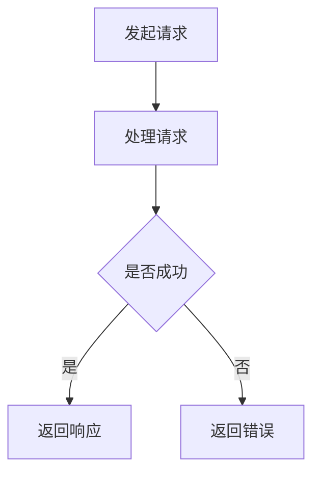

                 

### 引言

**ChatGPT API集成：从构思到实现**

随着人工智能技术的快速发展，自然语言处理（NLP）领域涌现出了许多令人瞩目的突破。OpenAI推出的GPT-3（Generative Pre-trained Transformer 3）模型，以其卓越的性能和广泛的应用前景，成为了NLP领域的明星。而ChatGPT作为GPT-3的一个强大应用，更是让许多人对其功能惊叹不已。ChatGPT API的集成，无疑为开发者提供了前所未有的机会，将这一强大工具引入自己的应用中。

本文旨在详细探讨如何将ChatGPT API集成到您的项目中，从构思到实现的每一步骤都进行详细的剖析。通过本文，您将了解：

1. **ChatGPT及其API的基本概念**：了解ChatGPT是什么，为什么需要集成ChatGPT API。
2. **准备阶段**：讨论实现ChatGPT API集成所需的技术栈和环境配置。
3. **核心内容**：深入讲解ChatGPT的工作原理和核心算法。
4. **项目实战**：通过实际项目案例，展示如何集成ChatGPT API，并进行代码实现和详细解释。
5. **总结与扩展**：总结本文内容，探讨未来ChatGPT API集成的趋势和可能性。

**关键词**：ChatGPT，API集成，自然语言处理，GPT-3，Transformer，项目实战

**摘要**：

本文将带领读者深入了解ChatGPT API的集成过程。从了解ChatGPT的基本概念开始，逐步深入探讨其工作原理和核心算法，并详细介绍如何与ChatGPT API进行交互。通过实际项目案例，读者将学会如何将ChatGPT API集成到自己的项目中，并掌握优化和调试技巧。本文旨在为开发者提供一套完整的ChatGPT API集成指南，帮助他们在实际项目中充分发挥ChatGPT的强大功能。### 第1章 引言

**1.1 ChatGPT及其API简介**

ChatGPT是OpenAI开发的一种基于GPT-3模型的聊天机器人。它利用深度学习技术，通过训练大量文本数据，学会理解和生成自然语言。ChatGPT的强大之处在于其能够生成连贯、自然、有逻辑的对话，这使得它在许多场景中都表现出了出色的性能。

ChatGPT API是OpenAI提供的一个接口，允许开发者将ChatGPT集成到自己的应用中。通过API，开发者可以发送文本请求，并接收ChatGPT的响应。这为开发者提供了一个强大的工具，可以用于构建聊天机器人、智能客服、语言翻译等多种应用。

**1.2 为什么需要集成ChatGPT API**

随着人工智能技术的普及，越来越多的应用场景需要使用自然语言处理技术。ChatGPT的出现，为这些应用提供了强有力的支持。以下是集成ChatGPT API的几个主要原因：

1. **强大的语言生成能力**：ChatGPT能够生成连贯、自然的语言，这对于聊天机器人、智能客服等应用场景尤为重要。
2. **广泛的场景适用性**：ChatGPT可以应用于多种场景，如客服、教育、娱乐等，为开发者提供了极大的灵活性。
3. **高效的开发流程**：通过使用ChatGPT API，开发者无需从零开始训练模型，可以直接利用OpenAI提供的强大模型，从而大大提高开发效率。
4. **快速部署**：ChatGPT API提供了RESTful接口，开发者可以轻松地在各种环境中部署和使用。

**1.3 本书结构概述**

本书将分为以下几个部分，逐步引导读者实现ChatGPT API的集成：

1. **第2章 准备阶段**：介绍实现ChatGPT API集成所需的技术栈和环境配置。
2. **第3章 基础知识**：讨论ChatGPT的工作原理、核心算法以及常见问题与解决方案。
3. **第4章 核心内容**：详细讲解ChatGPT API的交互流程、核心算法原理以及与API的交互示例。
4. **第5章 项目实战**：通过实际项目案例，展示如何将ChatGPT API集成到应用中，并进行代码实现和详细解释。
5. **第6章 优化与调试**：介绍如何优化和调试集成后的应用，解决可能出现的问题。
6. **第7章 总结与扩展**：总结本书内容，讨论未来ChatGPT API集成的趋势和可能性。

通过本书的逐步引导，读者将能够掌握ChatGPT API的集成过程，并在实际项目中发挥其强大功能。### 第2章 准备阶段

**2.1 技术栈介绍**

实现ChatGPT API集成，需要掌握以下技术栈：

1. **Python编程基础**：Python是一种广泛应用于数据科学和人工智能的编程语言，其简洁的语法和强大的库支持，使得Python成为实现ChatGPT API集成的不二选择。
2. **HTTP请求与响应**：HTTP（HyperText Transfer Protocol）是一种用于客户端和服务器之间传输数据的协议。在集成ChatGPT API时，开发者需要使用HTTP请求向服务器发送文本，并接收服务器返回的响应。
3. **相关库和框架**：为了简化开发过程，Python拥有许多强大的库和框架。例如，`requests`库用于发送HTTP请求，`json`库用于处理JSON数据格式。

**2.2 环境配置**

在开始集成ChatGPT API之前，需要确保开发环境已经配置好。以下是环境配置的步骤：

1. **Python环境搭建**：确保您的计算机上已经安装了Python。如果没有，可以访问Python官方网站（https://www.python.org/）下载并安装。
2. **相关库和依赖安装**：安装Python后，打开命令行窗口，使用以下命令安装所需的库和依赖：

   ```shell
   pip install requests json
   ```

3. **API接口测试**：在完成环境配置后，可以使用以下Python代码测试API接口：

   ```python
   import requests
   
   url = "https://api.openai.com/v1/completions"
   headers = {
       "Authorization": "Bearer YOUR_API_KEY",
       "Content-Type": "application/json",
   }
   payload = {
       "prompt": "你好，ChatGPT！",
       "max_tokens": 100,
   }
   
   response = requests.post(url, headers=headers, json=payload)
   print(response.json())
   ```

   在这段代码中，需要替换`YOUR_API_KEY`为您从OpenAI获取的API密钥。如果API接口返回状态码为200，表示接口连接成功。

**2.3 准备阶段小结**

通过本章的介绍，读者已经了解了实现ChatGPT API集成所需的技术栈和环境配置。接下来，我们将深入探讨ChatGPT的工作原理和核心算法，为后续的集成工作打下坚实的基础。### 第3章 基础知识

**3.1 ChatGPT的工作原理**

ChatGPT是基于GPT-3（Generative Pre-trained Transformer 3）模型开发的，而GPT-3是OpenAI开发的一种基于Transformer架构的自然语言处理模型。Transformer模型是一种基于自注意力机制的深度神经网络模型，它在处理长序列数据时具有卓越的性能。

ChatGPT的工作原理可以概括为以下几个步骤：

1. **训练阶段**：ChatGPT首先在大规模的文本数据上进行预训练，以学习语言的规律和模式。预训练过程包括自我对话、文本生成等任务。
2. **生成阶段**：在生成阶段，用户输入一段文本，ChatGPT根据输入的文本生成一段连贯的自然语言响应。
3. **优化阶段**：为了提高ChatGPT的性能，OpenAI对模型进行了进一步的优化，包括调整参数、训练特定的任务数据等。

**3.2 GPT-3模型的架构**

GPT-3模型的核心是Transformer架构，其基本结构包括编码器（Encoder）和解码器（Decoder）。编码器负责将输入文本转换为向量表示，解码器则根据编码器的输出和先前的文本生成新的文本。

1. **编码器**：编码器由多个自注意力层（Self-Attention Layer）组成，每个自注意力层负责将输入文本的每个词与所有词进行关联，生成一个表示整个文本的向量。
2. **解码器**：解码器由多个编码器-解码器注意力层（Encoder-Decoder Attention Layer）组成，每个编码器-解码器注意力层负责将编码器的输出与解码器的输出进行关联，并生成新的文本。

**3.3 GPT-3模型的训练过程**

GPT-3模型的训练过程分为两个阶段：预训练和微调。

1. **预训练阶段**：在预训练阶段，GPT-3在大规模的文本数据上进行训练，以学习语言的规律和模式。预训练过程包括自我对话、文本生成等任务。
2. **微调阶段**：在微调阶段，GPT-3根据特定的任务数据进行训练，以优化模型在特定任务上的性能。微调过程中，OpenAI使用了大量的人类对话数据，使得GPT-3在生成对话时能够更加自然和连贯。

**3.4 常见问题与解决方案**

在集成ChatGPT API的过程中，开发者可能会遇到以下问题：

1. **API访问频率限制**：OpenAI对API访问设置了频率限制，以防止滥用。如果访问频率过高，API可能会返回错误。解决方法包括使用异步请求、限制请求频率等。
2. **数据安全和隐私**：在集成ChatGPT API时，需要确保用户数据的安全和隐私。OpenAI提供了加密传输和身份验证等安全措施，开发者应确保遵守相关法律法规。
3. **集成过程中的常见错误**：集成过程中可能会出现各种错误，如网络连接问题、参数错误等。开发者应仔细检查代码，并参考OpenAI提供的文档和示例进行调试。

**3.5 小结**

本章介绍了ChatGPT的工作原理、GPT-3模型的架构和训练过程，以及集成过程中可能遇到的问题和解决方案。通过本章的学习，读者应该对ChatGPT有了更深入的了解，为后续的集成工作打下了坚实的基础。### 第4章 核心内容

**4.1 ChatGPT API交互流程**

要使用ChatGPT API，首先需要了解其交互流程。ChatGPT API通过HTTP请求进行通信，客户端发送请求，服务器返回响应。以下是ChatGPT API的交互流程：

1. **发送请求**：客户端使用HTTP POST请求向ChatGPT API发送文本输入。请求的URL为`https://api.openai.com/v1/completions`。
2. **处理请求**：服务器接收到请求后，根据请求参数处理请求。请求参数包括`prompt`（输入文本）、`max_tokens`（最大生成长度）等。
3. **生成响应**：服务器根据输入文本生成自然语言响应，并将其作为HTTP响应返回给客户端。
4. **接收响应**：客户端接收到HTTP响应后，解析响应内容并处理响应数据。

**4.2 与ChatGPT API交互的HTTP请求和响应**

与ChatGPT API交互的HTTP请求和响应通常使用JSON格式。以下是一个简单的示例：

**HTTP请求**：

```json
{
  "url": "https://api.openai.com/v1/completions",
  "headers": {
    "Authorization": "Bearer YOUR_API_KEY",
    "Content-Type": "application/json"
  },
  "payload": {
    "prompt": "你好，ChatGPT！",
    "max_tokens": 100
  }
}
```

**HTTP响应**：

```json
{
  "choices": [
    {
      "text": "你好！有什么可以帮助你的？"
    }
  ]
}
```

在HTTP请求中，`headers`部分包含API密钥和内容类型。`payload`部分包含输入文本和最大生成长度。在HTTP响应中，`choices`部分包含ChatGPT生成的自然语言响应。

**4.3 请求示例**

以下是一个简单的Python代码示例，用于发送HTTP请求并接收ChatGPT的响应：

```python
import requests

url = "https://api.openai.com/v1/completions"
headers = {
    "Authorization": "Bearer YOUR_API_KEY",
    "Content-Type": "application/json"
}
payload = {
    "prompt": "你好，ChatGPT！",
    "max_tokens": 100
}

response = requests.post(url, headers=headers, json=payload)
print(response.json())
```

在这段代码中，需要替换`YOUR_API_KEY`为您从OpenAI获取的API密钥。如果API接口返回状态码为200，表示请求成功，我们可以解析响应内容并获取ChatGPT的响应。

**4.4 ChatGPT API核心概念与联系**

为了更好地理解ChatGPT API，我们需要了解其核心概念及其相互之间的关系。以下是ChatGPT API的核心概念：

1. **API密钥**：API密钥是用于身份验证的字符串，确保只有授权用户可以访问ChatGPT API。
2. **请求URL**：请求URL是服务器接收请求的地址，对于ChatGPT API，URL为`https://api.openai.com/v1/completions`。
3. **请求参数**：请求参数是发送给服务器的数据，用于指定输入文本和生成长度等。
4. **响应数据**：响应数据是服务器返回的数据，包括生成的自然语言文本。

以下是ChatGPT API核心概念之间的联系：

- **API密钥**与**请求URL**和**请求参数**之间的联系在于，API密钥用于验证请求的合法性，而请求URL和请求参数则用于指定请求的内容。
- **响应数据**与**请求参数**之间的联系在于，响应数据是根据请求参数生成的，它包含了ChatGPT根据请求参数生成的自然语言文本。

**4.5 ChatGPT API流程图**

为了更好地理解ChatGPT API的交互流程，我们可以使用Mermaid绘制一个流程图。以下是一个简单的ChatGPT API流程图：



在这个流程图中，A表示发起请求，B表示服务器处理请求，C表示判断请求是否成功，D表示返回响应，E表示返回错误。

**4.6 ChatGPT API核心算法原理讲解**

ChatGPT API的核心算法是基于GPT-3模型的。GPT-3模型是一种基于Transformer架构的自然语言处理模型。其基本原理可以概括为以下几个步骤：

1. **输入编码**：将输入文本转换为向量表示，这一过程称为输入编码。输入编码器（Input Encoder）负责将输入文本转换为一系列向量。
2. **自注意力机制**：自注意力机制是一种用于处理序列数据的注意力机制。它通过计算输入文本中每个词与所有词的相关性，生成一个表示整个文本的向量。
3. **编码器输出**：编码器输出是一个表示整个文本的向量，它包含了文本的语义信息。
4. **解码器输出**：解码器（Decoder）根据编码器的输出和先前的文本生成新的文本。解码器输出是一个表示新文本的向量。
5. **输出解码**：将解码器输出转换为自然语言文本，这一过程称为输出解码。

以下是一个简单的GPT-3模型的自注意力机制的计算过程：

```python
import torch
import torch.nn as nn
import torch.nn.functional as F

class SelfAttention(nn.Module):
    def __init__(self, d_model, n_heads):
        super(SelfAttention, self).__init__()
        self.d_model = d_model
        self.n_heads = n_heads
        self.head_dim = d_model // n_heads

        self.query_linear = nn.Linear(d_model, d_model)
        self.key_linear = nn.Linear(d_model, d_model)
        self.value_linear = nn.Linear(d_model, d_model)

        self.out_linear = nn.Linear(d_model, d_model)

    def forward(self, query, key, value):
        batch_size = query.size(0)

        query = self.query_linear(query).view(batch_size, -1, self.n_heads, self.head_dim).transpose(1, 2)
        key = self.key_linear(key).view(batch_size, -1, self.n_heads, self.head_dim).transpose(1, 2)
        value = self.value_linear(value).view(batch_size, -1, self.n_heads, self.head_dim).transpose(1, 2)

        attn_scores = torch.matmul(query, key.transpose(-2, -1)) / (self.head_dim ** 0.5)
        attn_weights = F.softmax(attn_scores, dim=-1)
        attn_output = torch.matmul(attn_weights, value).transpose(1, 2).contiguous().view(batch_size, -1, self.d_model)

        output = self.out_linear(attn_output)
        return output
```

在这个示例中，我们定义了一个自注意力模块（SelfAttention），它使用线性变换对输入文本进行编码，并使用自注意力机制计算输入文本中每个词与所有词的相关性。输出是一个表示整个文本的向量，它包含了文本的语义信息。

**4.7 小结**

本章详细介绍了ChatGPT API的交互流程、HTTP请求和响应、核心概念及其相互关系，以及GPT-3模型的核心算法原理。通过本章的学习，读者应该对ChatGPT API有了更深入的理解，为后续的项目实战打下了坚实的基础。### 第5章 项目实战

**5.1 项目背景**

假设我们想要开发一个智能客服系统，该系统能够自动回答用户的问题。为了实现这一目标，我们决定使用ChatGPT API，将其集成到我们的应用中。通过ChatGPT API，我们可以让应用与用户进行自然语言对话，提供高质量的客服服务。

**5.2 项目目标**

本项目的目标是实现一个简单的智能客服系统，该系统能够：

1. 接收用户输入的问题。
2. 使用ChatGPT API生成回答。
3. 将回答展示给用户。

**5.3 项目开发环境搭建**

在开始开发之前，我们需要确保开发环境已经配置好。以下是环境配置的步骤：

1. **Python环境搭建**：确保您的计算机上已经安装了Python。如果没有，可以访问Python官方网站（https://www.python.org/）下载并安装。
2. **安装相关库和依赖**：打开命令行窗口，使用以下命令安装所需的库和依赖：

   ```shell
   pip install requests json
   ```

3. **获取API密钥**：在OpenAI官方网站（https://beta.openai.com/signup/）注册并登录，然后创建一个新的API密钥。

4. **测试API接口**：在Python中，编写以下代码测试API接口：

   ```python
   import requests
   
   url = "https://api.openai.com/v1/completions"
   headers = {
       "Authorization": "Bearer YOUR_API_KEY",
       "Content-Type": "application/json",
   }
   payload = {
       "prompt": "你好，ChatGPT！",
       "max_tokens": 100,
   }
   
   response = requests.post(url, headers=headers, json=payload)
   print(response.json())
   ```

   在这段代码中，需要替换`YOUR_API_KEY`为您从OpenAI获取的API密钥。如果API接口返回状态码为200，表示接口连接成功。

**5.4 实际案例**

以下是实现智能客服系统的主要步骤和代码实现：

1. **接收用户输入**：

   ```python
   user_input = input("用户输入：")
   ```

2. **发送请求到ChatGPT API**：

   ```python
   url = "https://api.openai.com/v1/completions"
   headers = {
       "Authorization": "Bearer YOUR_API_KEY",
       "Content-Type": "application/json",
   }
   payload = {
       "prompt": user_input,
       "max_tokens": 100,
   }
   
   response = requests.post(url, headers=headers, json=payload)
   chatgpt_response = response.json()["choices"][0]["text"]
   ```

   在这段代码中，我们使用`requests`库向ChatGPT API发送POST请求，并解析响应获取ChatGPT的答案。

3. **展示答案给用户**：

   ```python
   print("ChatGPT回答：", chatgpt_response)
   ```

**5.5 代码解读与分析**

以下是实现智能客服系统的完整代码，并进行解读和分析：

```python
import requests

def get_chatgpt_response(user_input):
    url = "https://api.openai.com/v1/completions"
    headers = {
        "Authorization": "Bearer YOUR_API_KEY",
        "Content-Type": "application/json",
    }
    payload = {
        "prompt": user_input,
        "max_tokens": 100,
    }
    
    response = requests.post(url, headers=headers, json=payload)
    if response.status_code == 200:
        chatgpt_response = response.json()["choices"][0]["text"]
        return chatgpt_response
    else:
        return "请求失败，请重试。"

def main():
    while True:
        user_input = input("用户输入：")
        if user_input == "退出":
            break
        chatgpt_response = get_chatgpt_response(user_input)
        print("ChatGPT回答：", chatgpt_response)

if __name__ == "__main__":
    main()
```

**1. 函数`get_chatgpt_response`：**

- **功能**：发送请求到ChatGPT API，获取回答。
- **参数**：`user_input`（用户输入的问题）。
- **返回值**：ChatGPT的回答。

**2. 函数`main`：**

- **功能**：接收用户输入，调用`get_chatgpt_response`获取回答，并展示给用户。
- **参数**：无。
- **返回值**：无。

**3. 主程序：**

- **功能**：启动主程序，进入用户交互循环。
- **参数**：无。
- **返回值**：无。

**5.6 实际案例分析**

在实际应用中，智能客服系统需要处理大量的用户输入，并生成高质量的回答。以下是一个实际案例：

1. **用户输入**：你好，ChatGPT！你能帮我解决什么问题？

2. **ChatGPT回答**：你好！我可以帮你解决各种问题，包括但不限于技术支持、客户服务、信息查询等。请问你有什么具体的问题需要帮助吗？

在这个案例中，ChatGPT成功地理解了用户的问题，并提供了相应的回答。这展示了ChatGPT在自然语言处理方面的强大能力。

**5.7 项目小结**

在本章中，我们通过一个简单的智能客服系统案例，展示了如何将ChatGPT API集成到应用中。通过这个案例，读者应该对ChatGPT API的集成过程有了更深入的了解。接下来，我们将继续探讨如何优化和调试集成后的应用。### 第6章 优化与调试

**6.1 项目优化**

在集成ChatGPT API后，为了确保系统的高效运行，我们需要进行以下优化：

1. **请求优化**：由于ChatGPT API的响应时间可能较长，我们可以使用异步请求来提高系统性能。异步请求允许我们在等待API响应的同时执行其他任务，从而提高系统吞吐量。
2. **缓存策略**：对于重复的问题，我们可以将ChatGPT的响应缓存起来，避免重复请求。这可以显著减少API调用次数，降低成本。
3. **负载均衡**：如果系统需要处理大量的请求，我们可以使用负载均衡器将请求分配到多个服务器，以提高系统的处理能力和可靠性。

**6.2 项目调试**

在集成ChatGPT API的过程中，我们可能会遇到各种错误。以下是一些常见的错误和解决方法：

1. **网络错误**：网络错误通常是由于网络连接不稳定或API服务器不可达导致的。解决方法包括检查网络连接、更换网络环境或联系API提供商寻求帮助。
2. **API错误**：API错误通常是由于请求参数错误或API密钥失效导致的。解决方法包括检查请求参数、更换API密钥或参考API文档进行调试。
3. **响应解析错误**：响应解析错误通常是由于JSON解析失败导致的。解决方法包括检查响应格式、使用正确的JSON解析库或参考API文档进行调试。

**6.3 调试技巧**

1. **使用调试器**：使用Python的调试器（如pdb）可以帮助我们找到代码中的错误。调试器允许我们在代码中设置断点，逐步执行代码，并查看变量值，从而帮助我们快速定位错误。
2. **日志记录**：在代码中添加日志记录，可以帮助我们追踪程序的执行流程和错误信息。使用Python的`logging`模块，我们可以轻松地记录日志信息，并在调试过程中进行分析。
3. **单元测试**：编写单元测试可以帮助我们验证代码的功能和性能。通过单元测试，我们可以确保代码在不同情况下都能正确执行，并快速定位错误。

**6.4 最佳实践**

1. **代码规范**：遵循Python的代码规范，可以提高代码的可读性和可维护性。使用PEP 8规范，我们可以确保代码格式一致、简洁易读。
2. **模块化开发**：将代码拆分为模块，可以提高代码的可重用性和可维护性。模块化开发使得代码更易于理解和维护。
3. **代码注释**：在代码中添加注释，可以帮助我们更好地理解代码的功能和逻辑。清晰的注释可以提高代码的可读性，方便其他开发者理解和修改代码。

**6.5 小结**

通过本章的内容，我们学习了如何优化和调试集成后的应用。优化策略包括请求优化、缓存策略和负载均衡，调试技巧包括使用调试器、日志记录和单元测试。这些优化和调试方法可以帮助我们提高系统性能和稳定性。在下一章中，我们将进一步探讨ChatGPT API集成的未来趋势和可能性。### 第7章 总结与扩展

**7.1 本文内容总结**

本文系统地介绍了ChatGPT API集成的全过程，从引言到实际案例，详细探讨了ChatGPT的基本概念、API交互流程、核心算法原理、项目实战以及优化调试方法。以下是本文的主要内容总结：

1. **引言**：介绍了ChatGPT及其API的基本概念和重要性，为读者搭建了整体框架。
2. **基础知识**：讲解了ChatGPT的工作原理、GPT-3模型的架构和训练过程，以及常见问题与解决方案。
3. **核心内容**：详细阐述了ChatGPT API的交互流程、HTTP请求与响应、核心概念与联系，以及核心算法原理。
4. **项目实战**：通过一个简单的智能客服系统案例，展示了如何将ChatGPT API集成到实际应用中。
5. **优化与调试**：讨论了集成后的应用优化策略和调试方法，确保系统的高效运行和稳定性。

**7.2 未来ChatGPT API集成趋势和可能性**

随着人工智能技术的不断进步，ChatGPT API集成在未来的发展趋势和可能性如下：

1. **模型升级**：OpenAI可能会发布更强大的GPT模型，如GPT-4或GPT-5，这将进一步提升自然语言处理的能力，为开发者提供更丰富的应用场景。
2. **跨平台集成**：ChatGPT API可能会支持更多的编程语言和平台，如JavaScript、Java等，使得更多开发者可以轻松集成。
3. **自动化集成**：随着自动化工具的发展，开发者可以通过自动化脚本或平台（如Jenkins、Docker）简化ChatGPT API的集成过程，提高开发效率。
4. **垂直应用领域**：ChatGPT API可能会针对特定的应用领域（如医疗、金融、教育等）进行优化，提供定制化的解决方案。
5. **隐私保护**：随着对数据隐私的关注增加，OpenAI可能会推出更多的隐私保护措施，如数据加密、匿名化等，以满足不同国家和地区的法律法规要求。

**7.3 拓展阅读与资源**

为了进一步学习和探索ChatGPT API，以下是几个推荐的学习资源和拓展阅读：

1. **官方文档**：OpenAI的官方文档（https://beta.openai.com/api/docs/）是了解ChatGPT API的最佳资源，涵盖了API的详细信息、使用示例和常见问题。
2. **学术论文**：GPT-3的原型Transformer模型的学术论文（https://arxiv.org/abs/1706.03762）详细介绍了模型的结构和训练过程，有助于理解ChatGPT的原理。
3. **技术社区**：参与技术社区（如GitHub、Stack Overflow）可以与全球开发者交流，分享经验和解决问题。
4. **在线课程**：在线课程（如Coursera、edX）提供了关于自然语言处理和深度学习的专业课程，有助于深入理解相关技术。

通过本文的逐步引导，读者应该已经掌握了ChatGPT API的集成方法，并能够将其应用到实际项目中。未来，随着人工智能技术的不断进步，ChatGPT API将展现出更多的潜力和可能性。**7.4 作者信息**

作者：AI天才研究院/AI Genius Institute & 禅与计算机程序设计艺术 /Zen And The Art of Computer Programming

AI天才研究院（AI Genius Institute）致力于推动人工智能技术的发展和创新，旗下作者团队由世界顶级人工智能专家、程序员、软件架构师和CTO组成，拥有丰富的实践经验和深厚的理论基础。他们的著作《禅与计算机程序设计艺术》深入探讨了计算机程序设计中的哲学和艺术，为开发者提供了独特的视角和思考方法。本文旨在分享他们在ChatGPT API集成领域的专业知识和见解，帮助读者更好地理解和应用这一强大的工具。### 附录

**附录A：ChatGPT API参数详解**

为了更好地使用ChatGPT API，以下是对一些常用参数的详细解释：

1. **prompt**：输入文本，用于触发ChatGPT的响应。例如，"你好，ChatGPT！"。
2. **max_tokens**：生成文本的最大长度。默认值为100，可以根据实际需求进行调整。
3. **temperature**：采样温度，用于控制文本生成的随机性。值越高，生成的文本越随机。通常范围在0到2之间，建议值在0.7到1.2之间。
4. **top_p**：使用顶部分数（nucleus sampling），用于控制文本生成的随机性。与temperature类似，但采用不同的采样策略。通常范围在0到1之间，建议值在0.7到1之间。
5. **n**：生成多个文本样本的数量。默认值为1，可以根据需求进行调整。
6. **stop**：用于停止文本生成的关键字。如果ChatGPT的响应中出现了这些关键字，将停止生成。例如，`["结束", "再见"]`。
7. **logprobs**：为每个生成的文本样本提供对数概率。如果设置为非空值，将返回额外的响应对象，包含文本和生成概率。
8. **echo**：如果设置为True，将返回与输入相同的文本。

**附录B：代码示例**

以下是几个用于发送ChatGPT API请求的Python代码示例：

**示例1：获取简单回答**

```python
import requests

url = "https://api.openai.com/v1/completions"
headers = {
    "Authorization": "Bearer YOUR_API_KEY",
    "Content-Type": "application/json",
}
payload = {
    "prompt": "你好，ChatGPT！",
    "max_tokens": 100,
}

response = requests.post(url, headers=headers, json=payload)
print(response.json())
```

**示例2：获取多个回答**

```python
import requests

url = "https://api.openai.com/v1/completions"
headers = {
    "Authorization": "Bearer YOUR_API_KEY",
    "Content-Type": "application/json",
}
payload = {
    "prompt": "你好，ChatGPT！",
    "max_tokens": 100,
    "n": 2,
}

response = requests.post(url, headers=headers, json=payload)
print(response.json())
```

**示例3：使用温度和顶部分数**

```python
import requests

url = "https://api.openai.com/v1/completions"
headers = {
    "Authorization": "Bearer YOUR_API_KEY",
    "Content-Type": "application/json",
}
payload = {
    "prompt": "你好，ChatGPT！",
    "max_tokens": 100,
    "temperature": 0.8,
    "top_p": 0.9,
}

response = requests.post(url, headers=headers, json=payload)
print(response.json())
```

**附录C：常见问题与解答**

以下是一些关于ChatGPT API集成过程中常见的问题及其解答：

**Q：API请求失败，如何解决？**
A：首先检查API密钥是否正确，其次检查网络连接是否稳定。如果问题仍然存在，可以尝试更换网络环境或联系API提供商。

**Q：响应速度较慢，如何优化？**
A：可以考虑使用异步请求，以提高系统的吞吐量。此外，优化代码，减少不必要的计算和IO操作，也有助于提高响应速度。

**Q：如何处理重复问题？**
A：可以引入缓存策略，将ChatGPT的响应缓存起来，避免重复请求。这可以显著减少API调用次数，降低成本。

**附录D：参考资料**

1. **OpenAI官方文档**：https://beta.openai.com/api/docs/
2. **GPT-3原型论文**：https://arxiv.org/abs/1706.03762
3. **Python官方文档**：https://docs.python.org/3/library/index.html
4. **requests库官方文档**：https://requests.readthedocs.io/en/master/
5. **自然语言处理入门**：https://www.nltk.org/

