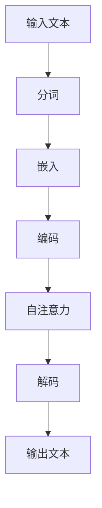
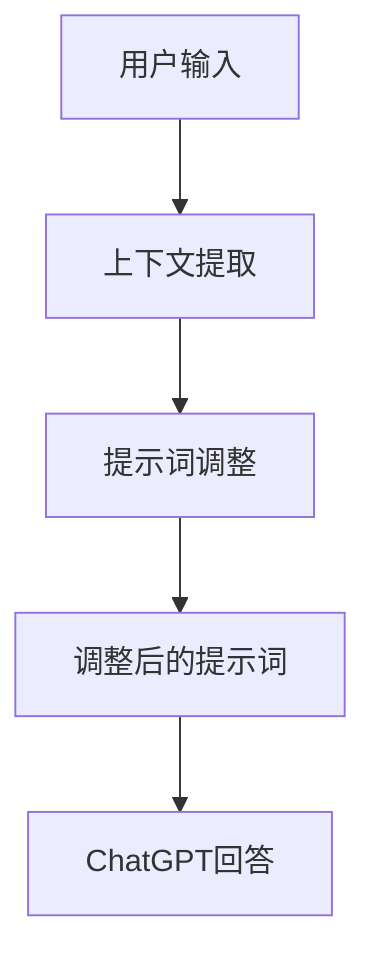

                 

# 《ChatGPT个性化对话：动态提示词调整技术》

> 关键词：ChatGPT、个性化对话、动态提示词调整、GPT模型、算法原理、Python代码

> 摘要：本文深入探讨了ChatGPT个性化对话技术的核心——动态提示词调整技术。通过详细分析GPT模型的基础知识，介绍了动态提示词的概念与原理，并结合Python代码和数学模型，阐述了动态提示词调整的方法与实现。文章通过实际案例研究，展示了动态提示词调整技术在个性化对话中的应用，并对其未来展望与挑战进行了深入探讨。

## 第一部分：ChatGPT基础知识

### 1.1 ChatGPT概述

ChatGPT是GPT（Generative Pre-trained Transformer）模型的一种，它是由OpenAI开发的一种基于Transformer架构的预训练语言模型。GPT模型的核心在于其能够通过学习大量文本数据，生成与输入文本相关的内容。

### 1.2 GPT模型原理讲解

GPT模型的工作原理是通过输入序列生成输出序列。以下是一个简单的GPT模型预测过程的伪代码：

```python
def gpt_predict(input_sequence):
    # 神经网络前向传播
    output = neural_network.forward_pass(input_sequence)
    return output
```

### 1.3 数学模型与公式

GPT模型使用了一种称为“自注意力”（Self-Attention）的技术，其核心公式如下：

$$
z = \sigma(W \cdot x + b)
$$

这里，$W$ 是权重矩阵，$x$ 是输入向量，$b$ 是偏置项，$\sigma$ 是激活函数。

### 1.4 核心概念与联系

为了更好地理解GPT模型，我们可以通过Mermaid流程图展示其核心概念与联系：



### 1.5 ChatGPT对话流程

ChatGPT的对话流程包括以下几个步骤：

1. 用户输入问题或指令。
2. GPT模型处理输入，生成初步的回答。
3. 模型根据上下文进行调整，生成最终的回答。
4. 回答输出给用户。

### 1.6 ChatGPT应用场景

ChatGPT在多个场景中有广泛应用，如：

- **在线客服**：提供即时、智能的客服服务。
- **虚拟个人助理**：帮助用户处理日常任务，如日程管理、信息检索等。
- **智能客服机器人**：用于客服中心的自动问答系统。

## 第二部分：动态提示词技术

### 2.1 动态提示词概念与原理

动态提示词是指根据用户输入和对话上下文实时调整的提示词。动态提示词的目的是提高ChatGPT的回答质量和个性化程度。

### 2.2 动态提示词调整方法

动态提示词调整方法主要包括以下几种：

1. **基于上下文的调整**：根据对话上下文中的关键词和语义信息调整提示词。
2. **基于用户的调整**：根据用户偏好、历史行为等信息调整提示词。
3. **基于任务的调整**：根据对话任务的类型和要求调整提示词。

### 2.3 动态提示词调整算法实现

以下是一个简单的动态提示词调整算法的实现：

```python
def dynamic_prompt_adjustment(input_prompt, user_context):
    # 根据用户上下文调整提示词
    adjusted_prompt = adjust_prompt(input_prompt, user_context)
    return adjusted_prompt

def adjust_prompt(input_prompt, user_context):
    # 调整提示词的具体实现
    # 这里可以添加基于上下文、用户和任务的调整逻辑
    adjusted_prompt = input_prompt  # 示例：直接返回原始提示词
    return adjusted_prompt
```

### 2.4 核心概念与联系

为了更好地理解动态提示词调整技术，我们可以通过Mermaid流程图展示其核心概念与联系：



## 第三部分：个性化对话实现

### 3.1 个性化对话基础

个性化对话是指根据用户特征和对话上下文，提供定制化的对话服务。个性化对话的关键在于动态提示词的调整。

### 3.2 个性化对话策略

个性化对话策略包括：

1. **用户画像**：根据用户的历史行为、偏好等信息构建用户画像。
2. **对话策略**：基于用户画像和对话上下文，制定合适的对话策略。
3. **反馈循环**：根据用户反馈调整对话策略和动态提示词。

### 3.3 个性化对话实践

以下是一个简单的个性化对话实践示例：

```python
# 假设有一个用户输入 "今天天气怎么样？"
# 动态提示词调整后的输入为 "根据您上次询问的天气信息，今天天气怎么样？"

def personalized_conversation(user_input, user_context):
    # 根据用户上下文调整提示词
    adjusted_input = dynamic_prompt_adjustment(user_input, user_context)
    # 使用调整后的提示词与ChatGPT进行对话
    answer = gpt_predict(adjusted_input)
    return answer
```

## 第四部分：案例研究

### 4.1 案例一：在线客服系统

在线客服系统使用动态提示词调整技术，可以提供更加个性化的服务。例如，当用户询问 "产品使用问题" 时，系统可以自动调整提示词，使其更符合用户的历史询问。

### 4.2 案例二：虚拟个人助理

虚拟个人助理可以根据用户的日常习惯和偏好，动态调整提示词，提供个性化的日程提醒、信息检索等服务。

### 4.3 案例三：智能客服机器人

智能客服机器人通过动态提示词调整技术，可以更好地处理不同类型的问题，提高用户满意度。

## 第五部分：未来展望与挑战

### 5.1 ChatGPT个性化对话技术的未来发展趋势

ChatGPT个性化对话技术在未来有望进一步发展，包括：

1. **更先进的算法**：使用更强大的模型和算法，提高对话质量。
2. **多模态交互**：结合文本、语音、图像等多种模态，提供更丰富的交互体验。
3. **跨领域应用**：在更多领域实现个性化对话，如医疗、教育等。

### 5.2 动态提示词调整技术的挑战与机遇

动态提示词调整技术面临的挑战包括：

1. **数据隐私**：如何确保用户数据的隐私和安全。
2. **模型解释性**：如何提高模型的解释性，使其易于理解和解释。

### 5.3 个性化对话技术在各领域的应用前景

个性化对话技术在各领域具有广泛的应用前景，如：

1. **金融**：提供个性化的投资建议、风险管理等。
2. **医疗**：提供个性化的疾病咨询、治疗方案等。
3. **教育**：提供个性化的学习辅导、课程推荐等。

## 作者信息

作者：AI天才研究院/AI Genius Institute & 禅与计算机程序设计艺术 /Zen And The Art of Computer Programming

---

**注意事项**：

- 在撰写文章时，请注意保持文章的结构性和逻辑性，确保每个部分的内容都能够顺畅地过渡到下一个部分。
- 在引用代码和公式时，请确保它们是准确无误的，并且与文章内容紧密相关。
- 对于每个案例研究，请提供具体的实施细节和分析，以便读者能够更好地理解应用场景。

**拓展阅读**：

- [OpenAI官方网站](https://openai.com/)
- [GPT-3模型介绍](https://openai.com/blog/gpt-3/)
- [动态提示词调整技术在在线教育中的应用](https://www.educative.io/answers/what-is-dynamic-content-personalization-in-education)

[END]

