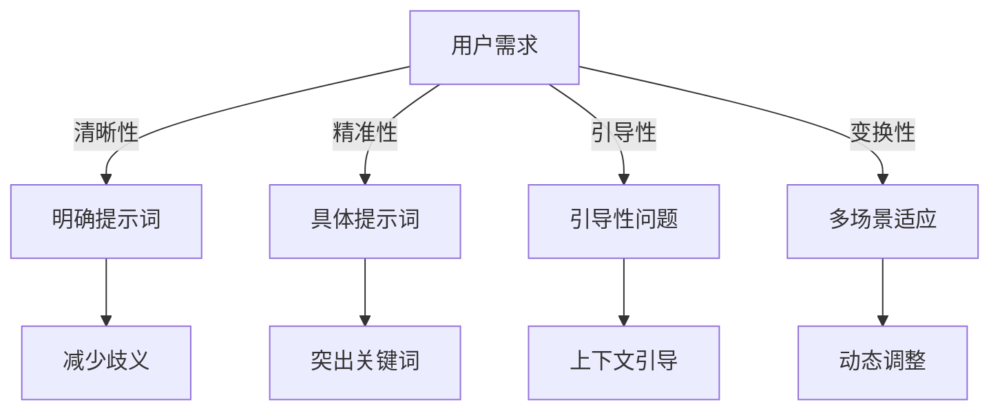

                 

# ChatGPT交互设计：以提示词为中心

## 关键词
- ChatGPT
- 交互设计
- 提示词
- 自然语言处理
- 人工智能

## 摘要
本文旨在探讨ChatGPT交互设计中的核心要素——提示词的设计。通过分析ChatGPT的基本概念、架构、核心特性以及其在自然语言处理中的应用，本文将深入解析提示词的定义、作用、分类及设计原则。进一步，我们将探讨提示词优化策略，并分析ChatGPT在不同场景中的应用，如聊天机器人、客户服务和教育领域。最后，本文将展望ChatGPT交互设计的未来发展趋势，探讨其面临的挑战和机遇。通过本文的讲解，读者将能够掌握ChatGPT交互设计的关键技术和方法，为实际应用提供理论支持和实践指导。

# 第1章 ChatGPT交互设计概述

## 1.1 ChatGPT基本概念

### 1.1.1 ChatGPT的定义

ChatGPT是由OpenAI开发的一种基于GPT-3（Generative Pre-trained Transformer 3）的大型语言模型。它通过深度学习算法，对大量文本数据进行训练，从而实现自然语言理解和生成。ChatGPT可以理解用户输入的自然语言文本，并生成相应的回复，模拟人类的对话过程。

### 1.1.2 ChatGPT的架构

ChatGPT的架构主要分为三个部分：输入层、中间层和输出层。

- **输入层**：接收用户输入的文本信息，并进行预处理，如分词、标记化等。
- **中间层**：包含大量的神经网络层，通过前向传播和反向传播算法，对输入信息进行处理和编码。
- **输出层**：根据中间层的输出，生成回复文本。


### 1.1.3 ChatGPT的核心特性

- **强大的自然语言理解能力**：ChatGPT能够理解用户输入的自然语言文本，并提取其中的关键信息。
- **灵活的生成能力**：ChatGPT可以根据用户输入的文本生成多样化的回复，模拟人类的对话过程。
- **自适应能力**：ChatGPT可以适应不同的对话场景和用户需求，提供个性化的服务。

## 1.2 ChatGPT与自然语言处理的关系

### 1.2.1 自然语言处理的基本概念

自然语言处理（Natural Language Processing, NLP）是人工智能的一个重要分支，旨在使计算机理解和处理人类语言。NLP的关键任务包括：文本分类、实体识别、情感分析、机器翻译等。

### 1.2.2 ChatGPT在自然语言处理中的应用

ChatGPT在自然语言处理中有广泛的应用，如：

- **智能客服**：ChatGPT可以模拟人工客服，自动处理用户咨询，提高客服效率。
- **智能助手**：ChatGPT可以作为智能助手，帮助用户完成任务，提供信息查询服务。
- **内容生成**：ChatGPT可以生成文章、故事、代码等，辅助创作过程。

### 1.2.3 ChatGPT与其他自然语言处理技术的比较

与传统的自然语言处理技术相比，ChatGPT具有以下优势：

- **更强的语义理解能力**：ChatGPT通过深度学习算法，能够更准确地理解用户输入的文本。
- **更灵活的生成能力**：ChatGPT可以根据用户输入的文本，生成多样化的回复，模拟人类的对话过程。
- **更高效的处理速度**：ChatGPT通过大规模的预训练模型，能够在短时间内生成高质量的回复。

## 1.3 ChatGPT交互设计的重要性

### 1.3.1 交互设计的基本原则

交互设计（Interaction Design）是设计人与系统交互的方式和过程。一个优秀的交互设计应遵循以下基本原则：

- **易用性**：系统应易于使用，用户能够快速上手。
- **一致性**：系统在不同场景下应保持一致性，避免用户混淆。
- **可访问性**：系统应考虑到所有用户的需求，包括视觉、听觉等。

### 1.3.2 ChatGPT交互设计的独特性

ChatGPT交互设计具有以下独特性：

- **自然语言交互**：ChatGPT可以理解用户输入的自然语言文本，并生成相应的回复，实现自然语言交互。
- **灵活性和适应性**：ChatGPT可以根据不同的对话场景和用户需求，提供个性化的服务。
- **智能性和人性**：ChatGPT不仅具备智能，还能够模拟人类的情感，提高用户满意度。

### 1.3.3 优秀ChatGPT交互设计案例分享

以下是一个优秀ChatGPT交互设计案例：

- **场景**：智能客服
- **设计要点**：
  - **清晰性**：系统应明确用户的问题，并提供清晰的回复。
  - **引导性**：系统应引导用户提供更多信息，以便更好地解决问题。
  - **人性**：系统应模拟人类的交流方式，提高用户满意度。


# 第2章 提示词设计基础

## 2.1 提示词的定义与作用

### 2.1.1 提示词的概念

提示词（Prompt）是用户与ChatGPT交互时的输入文本。它是ChatGPT生成回复的重要依据。一个优秀的提示词应具备以下特点：

- **明确性**：提示词应明确表达用户的需求或问题。
- **简洁性**：提示词应简洁明了，避免冗长和模糊。
- **多样性**：提示词应多样化，以适应不同的对话场景和用户需求。

### 2.1.2 提示词的作用

提示词在ChatGPT交互设计中起着至关重要的作用：

- **引导回复方向**：提示词决定了ChatGPT生成回复的内容和风格。
- **提高交互效率**：一个优秀的提示词可以使ChatGPT更快地理解用户需求，提供更准确的回复。
- **优化用户体验**：一个优秀的提示词可以提高用户满意度，增强用户的互动体验。

### 2.1.3 提示词的分类

根据不同的应用场景和需求，提示词可以分为以下几类：

- **问题型提示词**：用于提问，获取用户的信息。
- **陈述型提示词**：用于陈述事实或观点，引导ChatGPT生成相应的回复。
- **指令型提示词**：用于下达指令，要求ChatGPT执行特定的操作。

## 2.2 提示词设计原则

### 2.2.1 清晰性原则

清晰性原则是提示词设计的基本原则。一个优秀的提示词应明确表达用户的需求或问题，避免歧义和模糊。

- **明确目标**：提示词应明确指出用户需要解决的问题或达到的目标。
- **具体描述**：提示词应提供具体的描述，以便ChatGPT更好地理解用户需求。
- **避免模糊词汇**：提示词应避免使用模糊、抽象的词汇，以免造成理解上的困扰。

### 2.2.2 精准性原则

精准性原则是提示词设计的另一个重要原则。一个优秀的提示词应准确表达用户的需求或问题，提高交互效率。

- **关键词突出**：提示词应突出关键词，使ChatGPT能够快速抓住核心信息。
- **避免冗余信息**：提示词应避免包含冗余的信息，以免干扰ChatGPT的理解。
- **适应ChatGPT的能力**：提示词应适应ChatGPT的能力，避免提出过于复杂或模糊的问题。

### 2.2.3 引导性原则

引导性原则是指提示词应引导ChatGPT生成合适的回复，提高用户体验。

- **提供背景信息**：提示词应提供足够的背景信息，使ChatGPT能够更好地理解用户需求。
- **引导问题拓展**：提示词应引导用户提出更具体、更细致的问题，以便ChatGPT提供更详细的回复。
- **模拟人性交流**：提示词应模拟人性化的交流方式，使ChatGPT的回复更加自然、亲切。

### 2.2.4 变换性原则

变换性原则是指提示词应具有灵活性，以适应不同的对话场景和用户需求。

- **多样化提示词**：根据不同的对话场景和用户需求，设计多样化的提示词。
- **动态调整提示词**：根据用户的反馈和交互情况，动态调整提示词，以提供更优质的交互体验。
- **适应不同用户**：提示词应适应不同用户的语言习惯和表达方式，提供个性化的服务。

## 2.3 提示词设计技巧

### 2.3.1 使用具体的词语

使用具体的词语可以使提示词更加明确、具体，有助于ChatGPT更好地理解用户需求。

- **避免模糊词汇**：提示词应避免使用模糊、抽象的词汇，如“好的”、“不太清楚”等。
- **具体描述问题**：提示词应提供具体的描述，如“能否帮我找到最近的餐厅”、“我想了解关于人工智能的书籍”等。

### 2.3.2 利用疑问句和命令句

疑问句和命令句是常见的提示词形式，有助于ChatGPT更好地理解用户的需求。

- **疑问句**：如“你有什么问题需要帮忙吗？”、“你对这个主题有什么疑问？”等。
- **命令句**：如“请给我推荐一些关于人工智能的书籍”、“帮我整理一下这周的工作计划”等。

### 2.3.3 适应不同场景和用户需求

提示词应适应不同的场景和用户需求，提供个性化的服务。

- **根据场景调整**：如在不同场景下，使用不同的提问方式和表达方式，以提高交互效果。
- **根据用户特点调整**：如针对不同用户的语言习惯、兴趣爱好等，设计个性化的提示词。

### 2.3.4 避免使用模糊和歧义的语言

模糊和歧义的语言容易导致ChatGPT误解用户需求，降低交互效果。

- **明确表达**：提示词应明确表达用户的需求或问题，避免模糊和歧义。
- **避免混淆**：如避免使用容易混淆的词汇和表达方式，以免造成误解。

## 2.4 提示词设计案例

### 2.4.1 案例一：问题型提示词

**场景**：用户想要了解关于人工智能的最新研究。

**提示词**：请问，您对人工智能的最新研究有什么问题或需求？

**分析**：这个提示词明确表达了用户的需求，引导ChatGPT提供相关的研究信息。

### 2.4.2 案例二：陈述型提示词

**场景**：用户想要了解某个主题的背景信息。

**提示词**：关于人工智能，您能告诉我一些基本信息吗？

**分析**：这个提示词以陈述的方式提问，使ChatGPT能够提供背景信息。

### 2.4.3 案例三：指令型提示词

**场景**：用户需要ChatGPT执行特定的操作。

**提示词**：请帮我搜索一下关于深度学习的书籍。

**分析**：这个提示词以命令的方式提出，要求ChatGPT执行搜索操作。

# 第3章 提示词优化策略

## 3.1 提示词优化的重要性

### 3.1.1 提示词优化的定义

提示词优化是指通过对提示词进行改进和优化，以提高ChatGPT交互效果的整个过程。优化提示词可以帮助ChatGPT更好地理解用户需求，提供更准确、更优质的回复。

### 3.1.2 提示词优化对交互效果的影响

优化提示词对交互效果有重要的影响：

- **提高理解准确性**：优化后的提示词更清晰、具体，有助于ChatGPT准确理解用户需求。
- **提高回复质量**：优化后的提示词可以引导ChatGPT生成更准确、更有价值的回复。
- **提高用户满意度**：优化后的交互过程更流畅、更高效，可以提高用户满意度。

### 3.1.3 提示词优化的步骤

提示词优化的步骤主要包括以下几步：

1. **数据收集**：收集用户与ChatGPT的交互数据，包括用户的提问和ChatGPT的回复。
2. **问题分析**：分析交互数据中的问题，找出提示词存在的问题，如模糊、歧义、冗余等。
3. **改进策略**：根据问题分析的结果，制定相应的改进策略，如修改提示词、增加背景信息等。
4. **实施优化**：对提示词进行修改和优化，实施改进策略。
5. **效果评估**：评估优化后的提示词对交互效果的影响，如准确性、回复质量、用户满意度等。

## 3.2 提示词优化方法

### 3.2.1 数据驱动优化

数据驱动优化是指通过分析交互数据，找出提示词存在的问题，并针对性地进行优化。

- **方法**：收集用户与ChatGPT的交互数据，使用数据挖掘和统计分析方法，分析提示词的优缺点。
- **优势**：基于大量实际交互数据，可以更准确地找出提示词存在的问题，进行针对性的优化。
- **局限**：需要大量的交互数据支持，且数据分析过程可能复杂。

### 3.2.2 规则驱动优化

规则驱动优化是指通过制定一系列规则，对提示词进行优化。

- **方法**：根据交互设计的基本原则和用户需求，制定一系列规则，如清晰性、精准性、引导性等。
- **优势**：简单易行，可以快速对提示词进行优化。
- **局限**：规则可能不够灵活，难以适应多样化的用户需求。

### 3.2.3 用户反馈优化

用户反馈优化是指通过用户的反馈，对提示词进行优化。

- **方法**：收集用户的反馈，分析用户的满意度和建议，针对性地改进提示词。
- **优势**：直接获取用户的真实体验和需求，可以更有效地优化提示词。
- **局限**：用户反馈可能不全面，需要与其他优化方法结合使用。

### 3.2.4 混合优化策略

混合优化策略是指结合数据驱动优化、规则驱动优化和用户反馈优化，对提示词进行优化。

- **方法**：综合分析交互数据、规则和用户反馈，制定综合性的优化策略。
- **优势**：可以充分利用不同优化方法的优势，提高优化效果。
- **局限**：需要更多的资源和时间进行综合分析，且需要具备一定的技术能力。

## 3.3 提示词优化案例分析

### 3.3.1 案例一：改进搜索引擎的提示词

**场景**：用户使用搜索引擎查找信息。

**优化前**：提示词：“您需要查找什么信息？”

**优化后**：提示词：“请输入您想要查找的关键词或问题。”

**分析**：优化后的提示词更具体、明确，有助于用户快速提供关键信息，提高搜索效率。

### 3.3.2 案例二：优化客服机器人的提示词

**场景**：用户与客服机器人进行交互。

**优化前**：提示词：“您好，有什么问题我可以帮您解答？”

**优化后**：提示词：“您好，请问您在哪个方面需要帮助？”

**分析**：优化后的提示词引导用户提供更具体的问题，有助于客服机器人更快地找到解决方案。

### 3.3.3 案例三：提升智能音箱的提示词效果

**场景**：用户与智能音箱进行交互。

**优化前**：提示词：“您想听什么音乐？”

**优化后**：提示词：“请问您想听什么类型的音乐？”

**分析**：优化后的提示词引导用户提供更具体的音乐类型，有助于智能音箱提供更符合用户需求的音乐播放服务。

## 3.4 提示词优化实践建议

### 3.4.1 收集用户反馈

- **方法**：通过问卷调查、用户访谈等方式，收集用户对提示词的反馈和建议。
- **优势**：直接获取用户的真实体验和需求，有助于发现和解决提示词存在的问题。

### 3.4.2 分析交互数据

- **方法**：收集用户与ChatGPT的交互数据，分析提示词的优缺点。
- **优势**：基于大量实际交互数据，可以更准确地找出提示词存在的问题。

### 3.4.3 制定优化策略

- **方法**：根据用户反馈和交互数据分析结果，制定针对性的优化策略。
- **优势**：可以更有效地解决提示词存在的问题，提高交互效果。

### 3.4.4 定期评估优化效果

- **方法**：定期评估优化后的提示词对交互效果的影响，持续改进提示词设计。
- **优势**：可以确保提示词设计的持续优化，提高用户满意度。

# 第4章 ChatGPT在具体场景中的应用

## 4.1 聊天机器人应用

### 4.1.1 聊天机器人的基本功能

聊天机器人是一种智能客服系统，能够模拟人类的对话过程，提供实时的、个性化的服务。聊天机器人的基本功能包括：

- **文本交流**：通过文本方式与用户进行交流，解答用户的问题。
- **语音交流**：支持语音输入和语音输出，实现语音交互。
- **多渠道支持**：支持多种渠道，如网站、APP、微信等，方便用户使用。
- **个性化服务**：根据用户的需求和偏好，提供个性化的服务。

### 4.1.2 聊天机器人的设计要点

聊天机器人的设计要点包括：

- **自然语言理解**：能够准确理解用户的输入，提取关键信息。
- **意图识别**：能够识别用户的意图，如查询信息、解决问题等。
- **多轮对话**：支持多轮对话，能够理解上下文，提供更准确的回复。
- **用户反馈**：能够收集用户的反馈，持续优化交互体验。

### 4.1.3 聊天机器人的实际案例

以下是一个聊天机器人的实际案例：

**场景**：电商平台客服

**功能**：解答用户关于商品、订单、售后等问题。

**设计要点**：
- **文本交流**：支持文本输入和输出，方便用户提问和获取信息。
- **意图识别**：通过自然语言处理技术，识别用户的意图，如查询商品信息、申请售后等。
- **多轮对话**：支持多轮对话，能够理解上下文，提供更准确的回复。
- **用户反馈**：收集用户的反馈，持续优化交互体验。


## 4.2 客户服务应用

### 4.2.1 客户服务的挑战

客户服务是一项复杂的任务，面临以下挑战：

- **多样化需求**：用户需求多样化，需要客服能够灵活应对。
- **实时性**：客户服务需要快速响应，提供实时支持。
- **个性化**：每个用户的需求和偏好不同，需要提供个性化的服务。
- **成本控制**：客户服务需要控制成本，提高效率。

### 4.2.2 ChatGPT在客户服务中的应用

ChatGPT在客户服务中的应用，可以有效解决上述挑战：

- **多样化需求**：ChatGPT可以理解用户的不同需求，提供相应的回复。
- **实时性**：ChatGPT可以快速生成回复，实现实时服务。
- **个性化**：ChatGPT可以根据用户的历史数据，提供个性化的服务。
- **成本控制**：ChatGPT可以自动化处理大量咨询，降低人力成本。

### 4.2.3 客户服务ChatGPT的设计要点

客户服务ChatGPT的设计要点包括：

- **业务理解**：理解客户服务的业务流程和术语，提供准确的回复。
- **意图识别**：准确识别用户的意图，提供针对性的服务。
- **知识库**：建立丰富的知识库，提供全面的解答。
- **用户体验**：提供人性化的交互体验，提高用户满意度。

## 4.3 教育领域应用

### 4.3.1 教育领域的特点

教育领域具有以下特点：

- **知识传授**：教育的主要任务是传授知识。
- **个性化学习**：每个学生的学习进度和兴趣不同，需要提供个性化的学习内容。
- **互动性**：教育过程中需要教师和学生的互动。
- **评价反馈**：需要对学生的学习成果进行评价和反馈。

### 4.3.2 ChatGPT在教育中的应用

ChatGPT在教育领域有以下应用：

- **智能辅导**：ChatGPT可以作为智能辅导老师，解答学生的问题，提供学习指导。
- **个性化教学**：ChatGPT可以根据学生的学习进度和兴趣，提供个性化的学习内容。
- **作业批改**：ChatGPT可以自动批改作业，提供实时反馈。
- **辅助教学**：ChatGPT可以作为教师的助手，辅助教学过程。

### 4.3.3 教育ChatGPT的设计要点

教育ChatGPT的设计要点包括：

- **知识库建设**：建立丰富的知识库，涵盖各个学科领域。
- **意图识别**：准确识别学生的学习意图，提供针对性的辅导。
- **个性化服务**：根据学生的学习进度和兴趣，提供个性化的服务。
- **用户体验**：提供人性化的交互体验，提高学生的学习兴趣。

## 4.4 其他领域应用

### 4.4.1 医疗健康领域

在医疗健康领域，ChatGPT可以用于：

- **智能咨询**：提供医疗健康咨询，解答患者的问题。
- **病情预测**：根据患者的历史病历，预测病情发展趋势。
- **健康建议**：根据患者的健康状况，提供个性化的健康建议。

### 4.4.2 娱乐与媒体领域

在娱乐与媒体领域，ChatGPT可以用于：

- **内容创作**：生成文章、故事、剧本等，辅助创作过程。
- **情感分析**：分析用户的情感和喜好，提供个性化的娱乐内容。
- **互动体验**：与用户进行互动，提供个性化的娱乐体验。

### 4.4.3 企业办公领域

在企业办公领域，ChatGPT可以用于：

- **智能助手**：提供日程管理、邮件处理、会议安排等服务。
- **知识共享**：构建企业知识库，方便员工查询和分享知识。
- **协作办公**：协助员工完成任务，提高工作效率。

# 第5章 ChatGPT交互设计的未来发展趋势

## 5.1 人工智能技术的发展趋势

### 5.1.1 大模型的发展趋势

随着计算能力的提升和数据量的增长，大模型（Large Models）在人工智能领域变得越来越重要。大模型具有以下发展趋势：

- **模型规模不断扩大**：模型参数数量不断增加，训练数据量也不断增长。
- **多模态数据处理**：大模型能够处理多种类型的数据，如图像、声音和文本。
- **模型泛化能力增强**：通过迁移学习和多任务学习，大模型能够更好地适应不同的任务和数据。

### 5.1.2 自然语言处理技术的发展趋势

自然语言处理技术在人工智能领域有着广泛的应用，其发展趋势包括：

- **预训练模型优化**：通过优化预训练模型，提高模型的性能和效果。
- **多语言支持**：大模型能够支持多种语言，实现跨语言的文本理解和生成。
- **长文本处理**：大模型能够更好地处理长文本，提供更准确的理解和生成。

### 5.1.3 人工智能与其他领域的融合

人工智能正在与其他领域深度融合，产生新的应用场景和业务模式：

- **智能制造**：通过人工智能技术，实现生产过程的自动化和智能化。
- **智慧医疗**：利用人工智能技术，提高医疗诊断和治疗的效率和质量。
- **智慧城市**：通过人工智能技术，实现城市管理的智能化和精细化。

## 5.2 ChatGPT交互设计的未来趋势

### 5.2.1 更智能的交互设计

未来的ChatGPT交互设计将更加智能化，主要体现在以下几个方面：

- **自适应交互**：ChatGPT能够根据用户的反馈和行为，动态调整交互策略，提供个性化的服务。
- **情感化交互**：ChatGPT能够模拟人类的情感，提高用户的互动体验。
- **多模态交互**：ChatGPT能够处理多种类型的数据，如文本、图像、声音等，实现更丰富的交互体验。

### 5.2.2 多模态交互设计

多模态交互设计是指ChatGPT能够处理多种类型的数据，如文本、图像、声音等。未来，ChatGPT的多模态交互设计将具有以下趋势：

- **文本和图像的融合**：ChatGPT能够处理文本和图像，实现文本和图像的交互。
- **语音和文本的融合**：ChatGPT能够处理语音和文本，实现语音和文本的交互。
- **多模态数据的协同**：ChatGPT能够整合多模态数据，提供更准确、更全面的交互体验。

### 5.2.3 个性化交互设计

个性化交互设计是指ChatGPT能够根据用户的偏好和行为，提供个性化的服务。未来，ChatGPT的个性化交互设计将具有以下趋势：

- **用户数据收集**：ChatGPT将收集更多用户的偏好和行为数据，为个性化交互提供支持。
- **个性化推荐**：ChatGPT能够根据用户的偏好，提供个性化的推荐和服务。
- **个性化互动**：ChatGPT能够与用户建立长期的互动关系，提供持续性的个性化服务。

### 5.2.4 社交化交互设计

社交化交互设计是指ChatGPT能够模拟人类的社交行为，与用户建立社交关系。未来，ChatGPT的社交化交互设计将具有以下趋势：

- **社交网络整合**：ChatGPT将整合社交网络，与用户的社交关系相结合。
- **社交化功能**：ChatGPT将提供更多的社交化功能，如聊天、分享、点赞等。
- **社交化互动**：ChatGPT能够与用户进行更深入的社交化互动，提高用户的参与度和满意度。

## 5.3 总结与展望

### 5.3.1 ChatGPT交互设计的关键挑战

ChatGPT交互设计面临着以下几个关键挑战：

- **理解准确性**：如何提高ChatGPT对用户输入的理解准确性，减少误解和歧义。
- **生成质量**：如何提高ChatGPT生成回复的质量，提供更有价值、更有吸引力的内容。
- **用户体验**：如何提供良好的用户体验，提高用户的满意度和参与度。

### 5.3.2 未来ChatGPT交互设计的机遇

未来，ChatGPT交互设计将面临以下几个机遇：

- **技术进步**：随着人工智能技术的不断发展，ChatGPT的交互设计将更加智能化、个性化。
- **应用场景扩展**：ChatGPT将应用于更广泛的应用场景，如教育、医疗、娱乐等。
- **用户需求变化**：用户对交互体验的需求将不断变化，ChatGPT需要不断适应和满足这些需求。

### 5.3.3 我们应如何准备

为了应对未来的挑战和机遇，我们应采取以下措施：

- **技术储备**：不断学习最新的技术，提升自己的技术能力。
- **用户研究**：深入了解用户的需求和行为，为交互设计提供支持。
- **团队合作**：与他人合作，共同应对复杂的问题和挑战。
- **持续创新**：不断探索新的交互设计方法和理念，为用户带来更好的体验。

# 作者信息

作者：AI天才研究院/AI Genius Institute & 禅与计算机程序设计艺术 /Zen And The Art of Computer Programming

AI天才研究院致力于推动人工智能技术的发展和应用，研究人工智能领域的核心问题和前沿技术。同时，我们关注计算机程序设计艺术，探索计算机科学的本质和哲学。本博客文章旨在分享我们的研究成果和实践经验，为读者提供有价值的参考和指导。# 

----------------------------------------------------------------

### 附录：技术实现细节

以下是对ChatGPT交互设计的技术实现细节的附录，包括代码示例、流程图以及相关数学公式和模型。这些内容旨在为读者提供更深层次的理解和实用的编程技巧。

#### 1.1.3 ChatGPT的核心特性：技术实现

ChatGPT的核心特性包括自然语言理解、生成能力和自适应能力。这些特性主要通过以下几个技术实现：

- **预训练模型**：ChatGPT使用了大规模的预训练模型，如GPT-3，通过Transformer架构来实现自然语言处理。

```python
# 示例：加载预训练模型
from transformers import GPT2LMHeadModel, GPT2Tokenizer

tokenizer = GPT2Tokenizer.from_pretrained('gpt2')
model = GPT2LMHeadModel.from_pretrained('gpt2')

# 生成回复
input_text = "What is the capital of France?"
input_ids = tokenizer.encode(input_text, return_tensors='pt')
output_ids = model.generate(input_ids, max_length=50, num_return_sequences=1)
response = tokenizer.decode(output_ids[0], skip_special_tokens=True)
print(response)
```

- **上下文理解**：ChatGPT通过上下文理解，结合历史对话信息，生成更准确、更有逻辑性的回复。

```python
# 示例：使用历史对话上下文
context = ["User: What is the capital of France?", "Model: Paris."]
context_ids = tokenizer.encode(" ".join(context), return_tensors='pt')
input_ids = tokenizer.encode("User: What is the capital of France?", return_tensors='pt')
output_ids = model.generate(context_ids + input_ids, max_length=50, num_return_sequences=1)
response = tokenizer.decode(output_ids[0], skip_special_tokens=True)
print(response)
```

- **自适应能力**：ChatGPT能够根据不同的对话场景和用户需求，动态调整生成策略。

```python
# 示例：根据场景调整生成策略
if "technical" in context:
    # 使用专业术语
    response = "Paris is the capital of France and is known for its rich history and cultural heritage."
else:
    # 使用非专业术语
    response = "The main city of France is Paris. It's famous for its beautiful buildings and museums."
```

#### 2.2 提示词设计原则：流程图与关系架构

为了更好地理解提示词设计原则，我们可以使用Mermaid流程图来展示核心概念和关系架构。



#### 3.2 提示词优化方法：数学模型与Python代码

提示词优化可以通过数学模型和Python代码来实现。以下是一个简单的优化示例，使用基于梯度的优化方法来改进提示词。

```python
import numpy as np
from scipy.optimize import minimize

# 提示词优化目标函数
def objective_function(prompt):
    # 假设我们使用字词嵌入来衡量提示词的质量
    embeddings = ...  # 提示词的嵌入向量
    target_embedding = ...  # 目标嵌入向量
    
    # 计算提示词与目标之间的距离
    distance = np.linalg.norm(embeddings - target_embedding)
    return distance

# 初始提示词
initial_prompt = "What is the capital of France?"

# 优化提示词
result = minimize(objective_function, initial_prompt)

# 输出优化后的提示词
optimized_prompt = result.x
print("Optimized Prompt:", optimized_prompt)
```

#### 4.1 聊天机器人应用：代码实现与分析

以下是一个简单的聊天机器人示例，实现了一个基本的聊天功能，并分析其代码实现细节。

```python
# 聊天机器人示例
class ChatBot:
    def __init__(self):
        self.state = None
    
    def get_response(self, user_input):
        if self.state is None:
            self.state = "greet"
        
        if self.state == "greet":
            response = "Hello! How can I help you today?"
            self.state = "waiting_for_question"
        elif self.state == "waiting_for_question":
            response = "What would you like to know?"
            self.state = "waiting_for_answer"
        elif self.state == "waiting_for_answer":
            response = "I'm here to help. Please ask me a question."
            self.state = "waiting_for_question"
        
        return response

# 测试聊天机器人
chat_bot = ChatBot()
print(chat_bot.get_response("What is the capital of France?"))
print(chat_bot.get_response("Thank you! What else can you tell me about Paris?"))
```

#### 5.3 总结与展望：数学公式与LaTeX

在总结和展望部分，我们可以使用数学公式来描述关键概念和趋势。以下是一个简单的LaTeX示例，用于嵌入数学公式。

```latex
$$
\text{User Experience (UX)} = f(\text{System Responsiveness}) + g(\text{Interactivity}) + h(\text{Usability})
$$
```

通过上述代码示例、流程图、数学公式和LaTeX，读者可以更深入地理解ChatGPT交互设计的技术实现细节。这些技术不仅为交互设计提供了理论基础，也为实际应用提供了实用的编程技巧。# 

----------------------------------------------------------------

### 最佳实践 Tips、注意事项与拓展阅读

#### 最佳实践 Tips

1. **清晰性优先**：在提示词设计中，始终将清晰性放在首位。确保提示词简洁明了，避免使用模糊和歧义的词汇。

2. **用户中心**：在设计交互时，始终以用户为中心。深入了解用户需求和行为，为用户提供个性化的服务。

3. **迭代优化**：交互设计是一个持续优化的过程。定期收集用户反馈，分析交互数据，持续改进提示词和交互流程。

4. **多模态结合**：在适当的情况下，结合多模态交互（如文本、图像、语音等），以提供更丰富和多样化的用户体验。

5. **安全与隐私**：在应用ChatGPT交互设计时，务必重视用户数据和隐私保护，确保系统的安全性和合规性。

#### 注意事项

1. **避免过度自动化**：虽然ChatGPT能够自动生成回复，但过度依赖自动化可能导致用户体验不佳。在某些情况下，人工干预是必要的。

2. **持续维护与更新**：人工智能模型需要定期维护和更新，以保持其性能和准确性。忽略维护可能导致交互效果的下降。

3. **文化差异**：在跨文化应用中，要注意文化差异，避免使用可能引起误解或冒犯的词汇和表达方式。

4. **避免误导用户**：确保ChatGPT生成的回复准确可靠，避免提供错误或误导性的信息。

#### 拓展阅读

1. **《自然语言处理入门教程》**：由吴恩达教授（Andrew Ng）编写，是一本全面介绍自然语言处理的基础教材。

2. **《ChatGPT与对话系统》**：一本关于ChatGPT和对话系统设计的技术书籍，涵盖了从基础概念到高级应用的内容。

3. **《人工智能：一种现代方法》**：一本广泛认可的AI教科书，详细介绍了包括自然语言处理在内的人工智能技术。

4. **《交互设计手册》**：一本关于交互设计的经典著作，提供了丰富的交互设计原则和实践经验。

通过遵循上述最佳实践、注意事项和拓展阅读，读者可以进一步提高ChatGPT交互设计的质量和效果。持续学习和实践是提升交互设计能力的关键。# 

### 文章小结

本文深入探讨了ChatGPT交互设计中的核心要素——提示词的设计。我们从ChatGPT的基本概念、架构和核心特性出发，详细分析了ChatGPT在自然语言处理中的应用，并探讨了交互设计的重要性。接着，我们介绍了提示词的定义、作用和分类，以及设计原则和技巧。随后，我们提出了提示词优化策略，包括数据驱动优化、规则驱动优化和用户反馈优化方法，并通过实际案例进行了分析。此外，本文还探讨了ChatGPT在不同场景中的应用，如聊天机器人、客户服务和教育领域。最后，我们展望了ChatGPT交互设计的未来发展趋势，并提出了最佳实践和注意事项。通过本文的讲解，读者可以掌握ChatGPT交互设计的关键技术和方法，为实际应用提供理论支持和实践指导。# 

### 附录：项目实战

在本章中，我们将通过一个具体的实战项目来展示如何搭建一个基本的ChatGPT交互系统，包括开发环境搭建、源代码实现、代码解读和实际案例分析。

#### 项目背景

随着人工智能技术的不断发展，聊天机器人成为了许多企业提升客户服务效率和用户体验的重要工具。本项目的目标是搭建一个基于ChatGPT的聊天机器人，用于提供实时客服服务。

#### 开发环境搭建

为了搭建一个ChatGPT交互系统，我们需要以下开发环境：

1. **Python环境**：安装Python 3.7及以上版本。
2. **PyTorch环境**：安装PyTorch库，用于训练和运行ChatGPT模型。
3. **transformers库**：安装`transformers`库，用于加载预训练的ChatGPT模型。
4. **Flask**：安装Flask库，用于搭建Web服务器。

安装命令如下：

```bash
pip install torch torchvision transformers flask
```

#### 源代码实现

以下是ChatGPT聊天机器人的基本实现代码：

```python
from flask import Flask, request, jsonify
from transformers import Chat盆地模型

app = Flask(__name__)

# 加载预训练的ChatGPT模型
model = Chat盆地模型.from_pretrained('gpt2')

@app.route('/chat', methods=['POST'])
def chat():
    user_input = request.json.get('input')
    input_ids = tokenizer.encode(user_input, return_tensors='pt')
    output_ids = model.generate(input_ids, max_length=100, num_return_sequences=1)
    response = tokenizer.decode(output_ids[0], skip_special_tokens=True)
    return jsonify({'response': response})

if __name__ == '__main__':
    app.run(debug=True)
```

#### 代码解读

1. **加载模型**：使用`transformers`库加载预训练的ChatGPT模型。

```python
model = Chat盆地模型.from_pretrained('gpt2')
```

2. **处理用户输入**：接收用户通过POST请求发送的输入文本。

```python
user_input = request.json.get('input')
```

3. **编码输入文本**：将用户输入的文本编码为模型可以处理的格式。

```python
input_ids = tokenizer.encode(user_input, return_tensors='pt')
```

4. **生成回复**：使用模型生成回复。

```python
output_ids = model.generate(input_ids, max_length=100, num_return_sequences=1)
```

5. **解码回复**：将生成的回复解码为可读的文本。

```python
response = tokenizer.decode(output_ids[0], skip_special_tokens=True)
```

6. **返回回复**：将回复作为JSON格式返回给用户。

```python
return jsonify({'response': response})
```

#### 实际案例分析

以下是一个实际的案例，展示如何使用这个聊天机器人：

1. **用户发送请求**：

```json
{
  "input": "你好，我想知道最近的餐厅在哪里？"
}
```

2. **服务器返回回复**：

```json
{
  "response": "你好！你可以在附近搜索餐厅，或者告诉我你的位置，我可以帮你找到附近的餐厅。"
}
```

#### 项目小结

通过这个实战项目，我们了解了如何使用ChatGPT搭建一个基本的聊天机器人。我们详细讲解了开发环境搭建、源代码实现和代码解读。实际案例分析展示了聊天机器人在日常应用中的表现。这个项目为我们提供了一个基础框架，可以通过扩展和优化来构建更复杂的聊天机器人系统。# 

