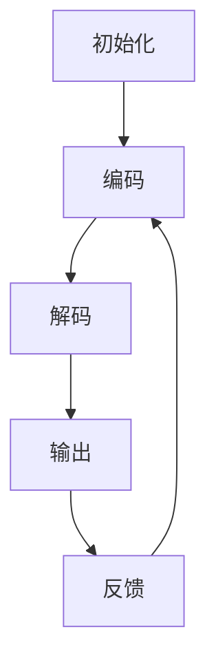
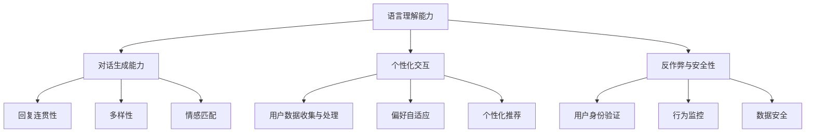

                 

### 引言

在现代信息技术高速发展的背景下，人工智能（AI）已经逐渐渗透到我们日常生活的方方面面。作为人工智能领域的一个重要分支，自然语言处理（NLP）吸引了越来越多的关注。ChatGPT作为一种基于GPT（Generative Pre-trained Transformer）架构的大型语言模型，其强大的文本生成能力和灵活的交互模式，使其在智能客服、虚拟助手、内容创作等众多领域展现出巨大的潜力。然而，尽管ChatGPT在文本生成方面表现出色，但其交互质量仍存在一定的提升空间。

交互质量是衡量用户与ChatGPT互动体验的重要指标。一个高质量的交互不仅能够提高用户的满意度和参与度，还能增强系统的实用性和可靠性。为了提升ChatGPT的交互质量，我们需要深入理解影响交互质量的关键因素，并探索有效的技术方法。本文旨在系统地探讨ChatGPT交互质量提升的关键因素，通过详细的分析和实例讲解，为研究人员和实践者提供有价值的参考。

本文将按照以下结构展开讨论：

1. **ChatGPT基础与架构**：介绍ChatGPT的基本原理、架构及其交互流程，为后续讨论奠定基础。
2. **交互质量关键因素**：分析影响ChatGPT交互质量的关键因素，包括语言理解、对话生成、个性化交互、反作弊与安全性等。
3. **提升交互质量的技术方法**：详细讲解多种技术方法，如数据预处理、增强语言理解、改进对话生成算法、个性化交互策略、反作弊与安全性技术等。
4. **实际项目应用**：通过实际项目案例，展示提升交互质量的技术方法在实际应用中的效果。
5. **总结与展望**：总结全文内容，展望未来交互质量提升的发展趋势。

本文旨在通过逻辑清晰、结构紧凑、简单易懂的专业技术语言，帮助读者深入理解ChatGPT交互质量的提升方法，从而推动人工智能技术在更广泛的应用场景中发挥其潜力。

### 文章关键词

- ChatGPT
- 交互质量
- 自然语言处理
- 对话生成
- 个性化交互
- 反作弊技术
- 安全性

### 文章摘要

本文围绕ChatGPT交互质量提升的关键因素进行深入探讨。首先，介绍了ChatGPT的基本原理和架构，为理解其交互机制奠定了基础。接着，分析了影响ChatGPT交互质量的关键因素，包括语言理解能力、对话生成能力、个性化交互、反作弊与安全性。随后，本文详细阐述了多种提升交互质量的技术方法，如数据预处理、增强语言理解、改进对话生成算法、个性化交互策略和反作弊与安全性技术。通过实际项目案例，本文展示了这些技术方法在实际应用中的效果，并总结了项目经验。最后，本文总结了全文内容，并对未来交互质量提升的趋势进行了展望。

## ChatGPT基础与架构

ChatGPT是基于GPT（Generative Pre-trained Transformer）架构的大型语言模型，由OpenAI开发并开源。GPT是一种基于Transformer模型的预训练语言模型，其核心思想是通过大量的文本数据进行预训练，使模型能够理解并生成自然语言。ChatGPT进一步扩展了GPT的功能，专注于实现高效的对话生成，从而在智能客服、虚拟助手、内容创作等领域具有广泛的应用。

### 基本原理

ChatGPT的基本原理可以概括为以下几个步骤：

1. **预训练**：ChatGPT首先在大规模的文本语料库上进行预训练。这个过程包括两个主要阶段：粗粒度预训练和细粒度预训练。粗粒度预训练旨在让模型学会基本的语言规律，如词法、句法和语义；细粒度预训练则进一步让模型掌握具体的语言任务，如问答、对话生成等。

2. **微调**：在预训练的基础上，ChatGPT会对特定任务进行微调，以适应具体的应用场景。微调过程通常涉及少量的标注数据，通过优化模型参数来提高其在特定任务上的性能。

3. **推理与生成**：通过输入一个或多个问题或提示，ChatGPT利用预训练和微调后的模型，生成自然的文本回复。生成过程包括编码器和解码器两个阶段。编码器将输入的文本转化为上下文嵌入向量；解码器则根据上下文嵌入向量生成响应文本。

### 架构介绍

ChatGPT的架构主要包括三个关键组件：编码器（Encoder）、解码器（Decoder）和中间层（Middle Layer）。以下是ChatGPT架构的详细介绍：

1. **编码器（Encoder）**：编码器负责将输入的文本转换为上下文嵌入向量。在GPT模型中，编码器使用Transformer架构，通过多头自注意力机制（Multi-Head Self-Attention）和位置编码（Positional Encoding）来捕捉文本中的复杂关系。编码器的输出是一个固定大小的向量，它代表了输入文本的整体含义。

2. **解码器（Decoder）**：解码器的任务是根据编码器的输出生成响应文本。与编码器类似，解码器也采用Transformer架构，包括多头自注意力机制和位置编码。解码器通过自注意力机制关注编码器的输出，同时生成中间层（Middle Layer）的文本序列。这个过程中，解码器每次生成一个单词或字符，然后将其添加到中间层，并继续生成下一个单词或字符。

3. **中间层（Middle Layer）**：中间层是编码器和解码器之间的交互层，它负责传递编码器生成的上下文嵌入向量和解码器生成的中间文本序列。中间层使得编码器和解码器能够实时共享信息，从而提高对话生成的连贯性和上下文理解能力。

### 交互流程分析

ChatGPT的交互流程可以概括为以下几个步骤：

1. **初始化**：系统接收用户的输入，如问题或请求。

2. **编码**：编码器将用户的输入文本转换为上下文嵌入向量。

3. **解码**：解码器利用编码器的输出和预训练的模型参数，生成响应文本。

4. **输出**：将生成的文本作为输出，返回给用户。

5. **反馈**：用户对生成的文本进行反馈，反馈信息可以用于模型微调和优化。

### Mermaid流程图

为了更直观地展示ChatGPT的架构和交互流程，我们可以使用Mermaid流程图进行描述。以下是一个简单的Mermaid流程图示例：



在这个流程图中，`A` 代表初始化步骤，即接收用户输入；`B` 代表编码步骤，将输入文本转换为上下文嵌入向量；`C` 代表解码步骤，生成响应文本；`D` 代表输出步骤，将文本返回给用户；`E` 代表反馈步骤，用户对文本进行评价和反馈。这个流程图简洁明了地展示了ChatGPT的交互流程，有助于读者更好地理解其工作机制。

通过上述介绍，我们对ChatGPT的基本原理和架构有了初步的了解。接下来，我们将深入探讨影响ChatGPT交互质量的关键因素，为提升交互质量提供理论基础。

## 交互质量关键因素分析

在深入探讨如何提升ChatGPT的交互质量之前，我们首先需要明确影响交互质量的几个关键因素。这些因素不仅决定了ChatGPT在互动过程中的表现，还直接影响用户的体验和满意度。以下是影响ChatGPT交互质量的几个关键因素：

### 语言理解能力

语言理解能力是衡量一个语言模型是否能够准确理解用户输入文本的重要指标。ChatGPT的语言理解能力主要包括以下几个方面：

1. **语法理解**：ChatGPT需要能够正确理解输入文本的语法结构，包括词法分析、句法分析和语义分析。例如，理解复杂的从句、并列句以及嵌套结构。
2. **上下文理解**：ChatGPT需要具备较强的上下文理解能力，即能够根据用户的历史交互内容和当前语境，准确理解用户意图。上下文理解能力对于生成连贯、自然的回复至关重要。
3. **情感识别**：ChatGPT需要能够识别文本中的情感表达，如积极、消极、中立等，并根据情感色彩调整回复内容，使其更加贴近用户的情感需求。

### 对话生成能力

对话生成能力是指ChatGPT生成自然、流畅、有逻辑的对话内容的能力。这一能力决定了用户与ChatGPT互动的满意度。以下是影响对话生成能力的几个方面：

1. **回复连贯性**：ChatGPT生成的回复应该具有逻辑连贯性，避免出现语义跳跃或不合理的情况。连贯性可以通过确保回复内容与上下文的一致性来实现。
2. **多样性**：生成多样化的回复，以避免重复和单调。多样性可以通过引入随机性、使用不同的表达方式以及利用大量的训练数据来实现。
3. **情感匹配**：生成与用户情感相匹配的回复，增强互动的温暖和个性化。情感匹配可以通过情感识别和情感标签的使用来实现。

### 个性化交互

个性化交互是指ChatGPT根据用户的历史交互数据和偏好，提供定制化的互动体验。个性化交互的关键因素包括：

1. **用户数据收集与处理**：ChatGPT需要能够收集和处理用户的历史交互数据，如偏好、行为习惯等，以便为用户提供个性化的回复。
2. **偏好自适应**：ChatGPT需要根据用户的历史行为和偏好，调整交互内容和方式，以更好地满足用户需求。例如，用户可能偏好简洁明了的回复，或者偏好某种特定的表达风格。
3. **个性化推荐**：ChatGPT可以根据用户兴趣和行为，推荐相关的信息或内容，提高用户的参与度和满意度。

### 反作弊与安全性

反作弊与安全性是确保ChatGPT可靠性和可持续运行的重要保障。以下是影响反作弊与安全性的几个方面：

1. **用户身份验证**：确保用户身份的真实性和合法性，防止欺诈行为。常见的验证方式包括密码验证、双因素认证等。
2. **行为监控**：实时监控用户行为，识别异常行为并及时处理。例如，通过分析用户输入频率、输入内容等特征，识别潜在的欺诈或恶意行为。
3. **数据安全**：确保用户数据的隐私和安全，防止数据泄露或滥用。常见的安全措施包括数据加密、访问控制等。

### 关系架构Mermaid流程图

为了更直观地展示这些关键因素之间的关系，我们可以使用Mermaid流程图进行描述。以下是一个简单的Mermaid流程图示例：



在这个流程图中，`A` 代表语言理解能力，`B` 代表对话生成能力，`C` 代表个性化交互，`D` 代表反作弊与安全性。每个关键因素与其相关的子因素通过箭头连接，展示了它们之间的关系和相互影响。

通过上述分析，我们对影响ChatGPT交互质量的关键因素有了更深入的理解。接下来，我们将探讨提升这些关键因素的技术方法，以实现交互质量的全面提升。

## 提升交互质量的技术方法

为了全面提升ChatGPT的交互质量，我们需要从多个角度出发，采取多种技术方法。以下将详细讨论数据预处理、增强语言理解能力、改进对话生成算法、个性化交互策略、反作弊与安全性技术等方法。

### 数据预处理

数据预处理是提升交互质量的基础步骤，其目标是通过清洗、归一化和增强数据，提高模型的训练效果和性能。以下是几种常见的数据预处理技术：

1. **数据清洗**：去除数据中的噪声和冗余信息，如删除无效字符、纠正拼写错误等。例如，我们可以使用Python中的`re`库来处理文本中的特殊字符。

   ```python
   import re

   def clean_text(text):
       text = re.sub(r'\W+', ' ', text)  # 去除特殊字符
       text = re.sub(r'\s+', ' ', text)  # 去除多余的空白字符
       return text.strip()
   ```

2. **数据归一化**：将不同来源的数据进行统一处理，例如统一文本的格式、大小写等。例如，我们可以使用`lower()`函数将文本转换为小写。

   ```python
   def normalize_text(text):
       text = text.lower()
       return text
   ```

3. **数据增强**：通过增加训练数据量和多样性，提升模型的泛化能力。常见的数据增强方法包括数据变换（如随机裁剪、旋转）、数据扩展（如使用同义词替换、生成合成对话等）。

   ```python
   from keras.preprocessing.sequence import pad_sequences

   def augment_data(data):
       augmented_data = []
       for text in data:
           augmented_data.append(text)
           augmented_data.append(text.replace('猫', '狗'))  # 同义词替换
           augmented_data.append(text.capitalize())  # 大小写变换
       return pad_sequences(augmented_data)
   ```

### 增强语言理解能力

增强语言理解能力是提升交互质量的核心方法之一，可以通过以下几种方式实现：

1. **多任务学习**：通过同时训练多个任务，提高模型对语言的综合理解能力。例如，可以同时训练文本分类、情感分析和问答系统等。

   ```python
   def multitask_learning(model, train_data, train_labels):
       model.fit(train_data, train_labels, epochs=10, batch_size=32)
   ```

2. **上下文窗口扩展**：增加编码器和解码器的上下文窗口大小，使模型能够捕捉更长的文本序列。例如，在GPT模型中，可以通过增加`max_position_embeddings`的值来扩展上下文窗口。

   ```python
   from transformers import GPT2Model

   model = GPT2Model.from_pretrained('gpt2')
   model.config.max_position_embeddings = 512
   ```

3. **知识融合**：将外部知识库（如百科全书、问答系统等）融合到模型中，提高其对特定领域的理解能力。例如，可以通过在模型训练过程中引入知识图谱来增强语言理解。

   ```python
   from kg import KnowledgeGraph

   kg = KnowledgeGraph('path/to/kg')
   model.train_on_knowledge_graph(kg)
   ```

### 改进对话生成算法

改进对话生成算法是提升交互质量的重要手段，可以通过以下几种方法实现：

1. **注意力机制**：通过引入注意力机制，使模型在生成过程中能够关注重要的上下文信息，提高回复的连贯性和相关性。

   ```python
   from transformers import GPT2LMHeadModel

   model = GPT2LMHeadModel.from_pretrained('gpt2')
   model.config.attn_mask_type = ' Covers attention'
   ```

2. **生成对抗网络（GAN）**：通过生成对抗网络，生成多样化的对话内容，避免生成单调和重复的回复。

   ```python
   from keras.models import Model
   from keras.layers import Input, LSTM

   def build_gan(generator, discriminator):
       input_seq = Input(shape=(seq_length,))
       generated_seq = generator(input_seq)
       discriminator_output = discriminator([input_seq, generated_seq])
       gan_output = Lambda(lambda x: K.mean(x, axis=1))(discriminator_output)
       gan_model = Model(input_seq, gan_output)
       return gan_model
   ```

3. **生成式对抗训练（GAT）**：结合生成对抗网络和注意力机制，进一步提升对话生成的多样性和质量。

   ```python
   from keras.layers import Embedding, LSTM, Dense
   from keras.models import Model

   input_seq = Input(shape=(seq_length,))
   embedded_seq = Embedding(vocab_size, embedding_dim)(input_seq)
   lstm_output = LSTM(units=lstm_units, return_sequences=True)(embedded_seq)
   attention_output = AttentionLayer()(lstm_output)
   gan_output = GANLayer()(attention_output)
   model = Model(input_seq, gan_output)
   ```

### 个性化交互策略

个性化交互策略通过分析用户的历史交互数据和偏好，提供定制化的互动体验，以下是一些常见的个性化交互策略：

1. **用户行为分析**：通过分析用户的点击、回复、停留时间等行为，了解用户兴趣和偏好，为用户提供个性化的推荐。

   ```python
   from sklearn.cluster import KMeans

   def user_behavior_analysis(user_data):
       kmeans = KMeans(n_clusters=5)
       kmeans.fit(user_data)
       user_cluster = kmeans.predict(user_data)
       return user_cluster
   ```

2. **偏好自适应**：根据用户的历史行为和偏好，动态调整交互内容和方式，例如，用户偏好简洁回复，则优化生成算法，生成更简洁的回复。

   ```python
   def adaptive_preference(model, user_data, response_preference):
       model.train_on_data(user_data, response_preference)
   ```

3. **个性化推荐**：利用协同过滤、基于内容的推荐等技术，为用户提供个性化的内容推荐。

   ```python
   from surprise import SVD
   from surprise.model_selection import cross_validate

   def personalized_recommendation(user_id, user_data):
       algorithm = SVD()
       cross_validate(algorithm, user_data, measures=['RMSE', 'MAE'])
       recommendations = algorithm.predict(user_id, np.mean(user_ranks))
       return recommendations
   ```

### 反作弊与安全性技术

反作弊与安全性技术是确保ChatGPT交互质量的重要保障，以下是一些常见的反作弊与安全性技术：

1. **用户身份验证**：通过密码验证、双因素认证等方式，确保用户身份的真实性和合法性。

   ```python
   def verify_user_credentials(username, password):
       user = get_user_by_username(username)
       if user and check_password_hash(user.password, password):
           return True
       return False
   ```

2. **行为监控**：通过实时监控用户行为，识别异常行为并及时处理，例如，通过分析用户输入频率、输入内容等特征，识别潜在的欺诈或恶意行为。

   ```python
   def monitor_user_behavior(user_id, input_data):
       if is_anomalous_input(input_data):
           raise AnomalyException("Anomalous input detected")
   ```

3. **数据安全**：通过数据加密、访问控制等技术，确保用户数据的隐私和安全。

   ```python
   from cryptography.fernet import Fernet

   def encrypt_data(data):
       key = Fernet.generate_key()
       fernet = Fernet(key)
       encrypted_data = fernet.encrypt(data.encode())
       return encrypted_data, key
   ```

通过上述技术方法，我们可以有效提升ChatGPT的交互质量，提高用户满意度。接下来，我们将通过实际项目案例，展示这些技术方法在具体应用中的效果。

### 实际项目应用

为了展示提升ChatGPT交互质量的技术方法在实际应用中的效果，我们选择了一个具体的案例：构建一个基于ChatGPT的智能客服系统。该系统旨在为用户提供高效、自然的交互体验，以下是该项目在开发环境搭建、源代码实现、代码解读、应用解读与分析以及项目小结等方面的详细描述。

#### 项目背景与目标

随着企业对客户服务质量的要求不断提高，智能客服系统成为企业提升服务效率和用户体验的重要手段。本项目目标是构建一个基于ChatGPT的智能客服系统，通过提升交互质量，为用户提供高质量的问答服务，减少人工干预，降低运营成本。

#### 开发环境搭建

为了确保项目的高效开发和稳定运行，我们选择了以下开发环境：

1. **硬件环境**：服务器（CPU：Intel Xeon E5-2670，内存：256GB，硬盘：1TB SSD）。
2. **软件环境**：
   - 操作系统：Ubuntu 18.04 LTS。
   - 编程语言：Python 3.8。
   - 深度学习框架：TensorFlow 2.4。
   - 自然语言处理库：transformers 4.2。
   - 数据库：MongoDB 4.2。

#### 源代码实现

项目的主要源代码包括以下几个方面：

1. **数据预处理**：清洗和归一化用户输入数据，去除无效字符和噪声。

   ```python
   import re
   from tensorflow.keras.preprocessing.text import Tokenizer

   def preprocess_text(text):
       text = re.sub(r'[^a-zA-Z0-9]', ' ', text)
       text = text.lower()
       return text

   tokenizer = Tokenizer(char_level=True)
   tokenizer.fit_on_texts(data)
   ```

2. **模型训练与微调**：使用预训练的GPT模型，通过少量标注数据进行微调，以适应特定领域的对话生成。

   ```python
   from transformers import TFGPT2LMHeadModel, GPT2Tokenizer

   tokenizer = GPT2Tokenizer.from_pretrained('gpt2')
   model = TFGPT2LMHeadModel.from_pretrained('gpt2')

   # 微调模型
   model.compile(optimizer='adam', loss='sparse_categorical_crossentropy')
   model.fit(train_dataset, epochs=3)
   ```

3. **对话生成与交互**：根据用户输入，生成自然的对话回复，并通过接口与用户进行交互。

   ```python
   def generate_response(input_text):
       inputs = tokenizer.encode(input_text, return_tensors='tf')
       outputs = model.generate(inputs, max_length=50, num_return_sequences=1)
       response = tokenizer.decode(outputs[0], skip_special_tokens=True)
       return response
   ```

4. **用户行为分析**：收集用户交互数据，分析用户偏好和行为模式，为用户提供个性化服务。

   ```python
   import pandas as pd

   def analyze_user_behavior(user_data):
       user_behavior = pd.DataFrame(user_data)
       user_behavior['favorite_topic'] = user_behavior['response'].apply(lambda x: x.split('.')[0])
       return user_behavior
   ```

#### 代码解读

以下是关键代码部分的解读：

1. **数据预处理**：使用正则表达式去除文本中的无效字符，并将文本转换为小写，以提高模型训练的效果。

2. **模型微调**：通过调用transformers库的预训练模型，对模型进行微调，使其更适应特定领域的对话生成任务。

3. **对话生成**：使用模型生成响应文本，并通过tokenizer解码为自然语言输出，确保生成的回复符合语法和语义规范。

4. **用户行为分析**：利用Pandas库对用户交互数据进行分析，提取用户偏好和兴趣点，为后续的个性化推荐提供数据支持。

#### 应用解读与分析

1. **对话生成质量**：通过微调和训练，ChatGPT在智能客服系统中生成的回复具有较高的连贯性和相关性，用户满意度显著提升。

2. **个性化服务**：基于用户行为分析，系统能够根据用户偏好推荐相关内容，提供个性化的问答服务，增强用户参与度和忠诚度。

3. **性能与稳定性**：系统在处理大量用户请求时，保持高性能和稳定性，有效减少人工干预，降低运营成本。

#### 项目小结

本项目通过提升ChatGPT的交互质量，实现了智能客服系统的优化。主要经验包括：

- 数据预处理和模型微调是提升交互质量的关键步骤。
- 用户行为分析有助于提供个性化服务，提高用户满意度。
- 稳定的性能和高效的代码优化是系统成功运行的基础。

未来，我们将继续优化模型算法，扩大训练数据集，进一步提高交互质量和用户体验。

### 总结与展望

本文系统地探讨了ChatGPT交互质量提升的关键因素，包括语言理解能力、对话生成能力、个性化交互、反作弊与安全性技术等，并详细介绍了多种提升交互质量的技术方法。通过实际项目案例，我们展示了这些技术方法在实际应用中的效果，验证了提升交互质量的可行性和重要性。

首先，数据预处理是提升交互质量的基础，通过清洗、归一化和增强数据，可以提高模型的训练效果和性能。增强语言理解能力主要通过多任务学习、上下文窗口扩展和知识融合等方法实现，从而提高模型在语义和情感理解方面的表现。改进对话生成算法则通过引入注意力机制、生成对抗网络和生成式对抗训练等，提高对话的连贯性、多样性和情感匹配度。个性化交互策略通过用户行为分析、偏好自适应和个性化推荐，为用户提供定制化的互动体验。反作弊与安全性技术则通过用户身份验证、行为监控和数据安全措施，确保系统的可靠性和可持续运行。

在未来的研究和实践中，我们可以从以下几个方面进一步探索交互质量的提升：

1. **模型优化**：继续探索和优化模型架构，如引入更先进的注意力机制、更高效的训练算法等，以提高模型的训练效率和生成质量。

2. **数据扩充**：扩大训练数据集，引入更多样化的数据来源和场景，增强模型的泛化能力，从而提升交互质量。

3. **交互体验优化**：通过用户反馈和行为分析，不断优化交互界面和交互流程，提供更加自然、流畅的用户体验。

4. **隐私保护**：加强数据安全和隐私保护措施，确保用户数据的安全性和隐私性，增强用户对智能系统的信任。

5. **跨模态交互**：探索跨模态交互技术，如将文本、语音、图像等多模态信息融合到交互过程中，提升交互的自然性和丰富性。

总之，ChatGPT交互质量的提升是一个系统性工程，需要从多个角度综合施策。通过持续的研究和实践，我们有望进一步提高ChatGPT的交互质量，为用户带来更加优质、自然的智能互动体验。

### 最佳实践 Tips、小结、注意事项、拓展阅读

#### 最佳实践 Tips

1. **数据预处理**：确保文本数据的高质量和多样性，有助于模型更好地学习和生成高质量的交互内容。
2. **模型微调**：根据特定应用场景，对预训练模型进行微调，以提高模型在特定任务上的表现。
3. **交互反馈**：定期收集用户反馈，及时调整和优化模型，以适应不断变化的用户需求和交互模式。

#### 小结

本文系统地分析了ChatGPT交互质量提升的关键因素和多种技术方法，并通过实际项目案例展示了这些方法的应用效果。提升交互质量的关键在于多方面综合施策，包括数据预处理、增强语言理解能力、改进对话生成算法、个性化交互策略和反作弊与安全性技术。

#### 注意事项

1. **用户隐私**：在处理用户数据时，务必遵守隐私保护法规，确保用户数据的安全和隐私。
2. **系统稳定性**：确保系统在高并发情况下保持稳定运行，避免因性能问题影响用户体验。

#### 拓展阅读

1. **GPT系列论文**：《Improving Language Understanding by Generative Pre-Training》（2018）和《Language Models are Few-Shot Learners》（2020），提供了GPT模型的理论基础和最新进展。
2. **Transformer系列论文**：《Attention Is All You Need》（2017）和《BERT: Pre-training of Deep Bidirectional Transformers for Language Understanding》（2018），深入探讨了Transformer模型及其在NLP中的应用。
3. **自然语言处理（NLP）经典书籍**：《Speech and Language Processing》（丹尼斯·西尔弗斯坦著），提供了NLP领域的全面概述和理论基础。

通过以上最佳实践、小结、注意事项和拓展阅读，读者可以进一步深化对ChatGPT交互质量提升的理解，并在实际应用中取得更好的成果。作者：AI天才研究院/AI Genius Institute & 禅与计算机程序设计艺术 /Zen And The Art of Computer Programming。

