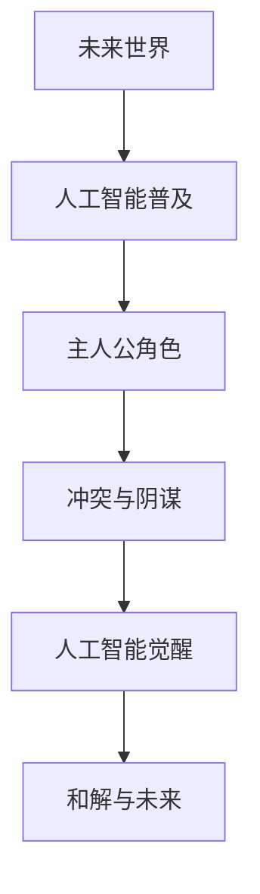
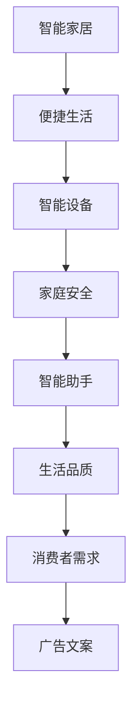
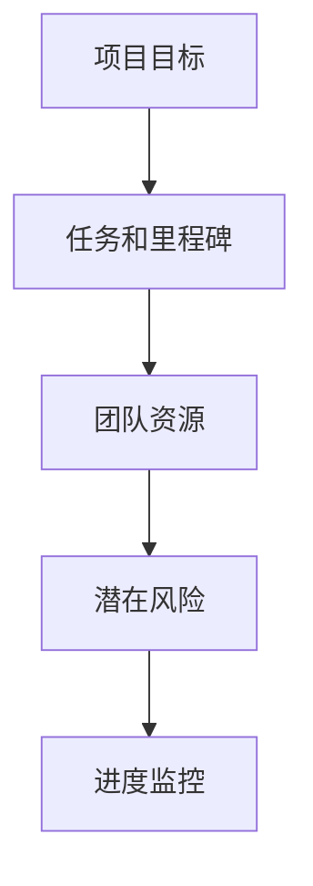
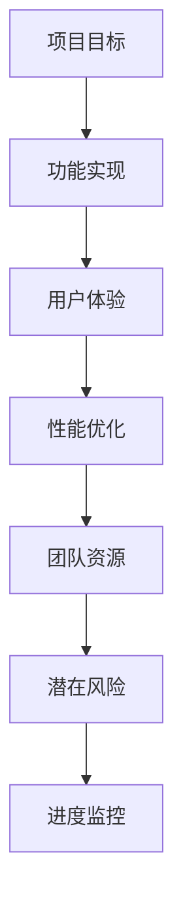

                 

# 《ChatGPT创意写作：利用思维链激发灵感》

## 关键词
- ChatGPT
- 创意写作
- 思维链
- 灵感激发
- 技术应用

## 摘要
本文将探讨如何利用ChatGPT和思维链来提升创意写作的效率和质量。首先，我们将介绍ChatGPT的基础知识，包括其工作原理和应用场景。接着，我们将深入探讨创意写作的技巧和灵感来源。随后，我们将详细阐述思维链的定义、构建方法和应用。最后，我们将结合实际案例，展示ChatGPT和思维链在创意写作中的融合应用，并提供一些最佳实践和拓展阅读建议。

## 目录

### 第一部分：ChatGPT基础

1. **ChatGPT概述**
   1.1 ChatGPT的定义
   1.2 ChatGPT的工作原理
   1.3 ChatGPT的主要功能
   1.4 ChatGPT的应用场景

2. **创意写作技巧**
   2.1 创意写作的基本概念
   2.2 创意写作的技巧与方法
   2.3 创意写作的心理机制
   2.4 创意写作的灵感来源

3. **思维链**
   3.1 思维链的定义与作用
   3.2 思维链的构建方法
   3.3 思维链在创意写作中的应用
   3.4 思维链的优化策略

4. **ChatGPT与创意写作的融合**
   4.1 ChatGPT在创意写作中的实际应用
   4.2 利用ChatGPT提高创意写作效率
   4.3 利用ChatGPT激发创意灵感
   4.4 ChatGPT创意写作的挑战与应对策略

5. **实战案例**
   5.1 创意写作项目实战
   5.2 ChatGPT在创意写作中的实际操作
   5.3 实战案例分析

6. **思维链实战应用**
   6.1 思维链在创意写作中的实战案例
   6.2 思维链在项目中的优化与应用

7. **未来展望**
   7.1 ChatGPT在创意写作中的未来发展
   7.2 思维链在创意写作中的未来发展
   7.3 创意写作与AI融合的趋势

### 第二部分：ChatGPT基础

#### 1.1 ChatGPT概述

**1.1.1 ChatGPT的定义**

ChatGPT是由OpenAI开发的一种基于Transformer的语言模型，它是GPT（Generative Pre-trained Transformer）系列模型的最新版本。ChatGPT旨在通过大量的文本数据进行训练，以生成流畅、连贯的自然语言文本。

**1.1.2 ChatGPT的工作原理**

ChatGPT的核心是Transformer架构，这是一种基于自注意力机制的深度神经网络。在训练过程中，ChatGPT会学习输入文本的上下文关系，从而生成符合上下文的输出文本。

**1.1.3 ChatGPT的主要功能**

ChatGPT具有多种功能，包括自动回复、内容生成、翻译和问题解答等。它可以被用于构建聊天机器人、自动写作助手、智能客服等多种应用场景。

**1.1.4 ChatGPT的应用场景**

ChatGPT的应用场景非常广泛，包括但不限于以下领域：
- 聊天机器人：用于与用户进行自然语言交互，提供信息查询、在线客服等服务。
- 内容创作：辅助创作者生成文章、故事、剧本等文本内容。
- 教育与培训：为学生提供个性化学习辅导，为教师提供教学辅助。
- 客户服务：为企业提供自动化的客户服务解决方案。

#### 1.2 创意写作技巧

**2.1 创意写作的基本概念**

创意写作是指通过创造性的思维过程，创作具有独特性和艺术性的文本内容。它不同于传统的写作，更注重创新和个性化表达。

**2.2 创意写作的技巧与方法**

- 角色扮演：通过设定不同的角色，从不同角度思考问题，激发创意。
- 情境设定：创造一个具体的情境，让创意在情境中自然产生。
- 心理描写：深入挖掘角色的内心世界，增强文本的情感表达。
- 意象创造：通过独特的意象，使文本更具艺术性和感染力。
- 变形技巧：对已有素材进行变形和重组，创造出新颖的创意。
- 联想思维：通过联想，从一个想法联想到另一个想法，从而产生创意。

**2.3 创意写作的心理机制**

- 创意思维的激发：通过挑战思维定势，激发创造性的思维。
- 情感投入：将情感融入到文本中，增强创意的表现力。
- 灵感捕捉：及时捕捉灵感和创意，为写作提供源源不断的素材。
- 持续创新：不断尝试新的写作方法和技术，保持创意的活力。

**2.4 创意写作的灵感来源**

- 自然界：观察自然界的景象，从中获取灵感。
- 文学作品：阅读优秀的文学作品，从中汲取创意。
- 社会热点：关注社会热点事件，从时事中寻找创意。
- 个人经历：回忆个人经历，用经验为写作提供素材。
- 艺术作品：欣赏艺术作品，从艺术中获得灵感。

#### 1.3 思维链

**3.1 思维链的定义与作用**

思维链是一种通过逻辑关联和情感链接构建的思维模式。它能够帮助创作者拓展思维空间，提高创意质量，促进灵感爆发。

**3.2 思维链的构建方法**

- 提炼关键词：从大量信息中提取关键信息，形成关键词。
- 逻辑关联：通过逻辑关系将关键词连接起来，构建思维链。
- 情感链接：将情感融入到思维链中，增强创意的表达力。
- 意象组合：通过独特的意象组合，创造出新颖的创意。

**3.3 思维链在创意写作中的应用**

思维链在创意写作中具有多种应用，包括：
- 提高写作效率：通过思维链，快速构思和生成文本。
- 拓展思维空间：通过思维链，从不同角度思考问题，产生更多创意。
- 增强创意质量：通过思维链，使创意更加独特、深刻。
- 促进灵感爆发：通过思维链，激发创作者的灵感，产生高质量的创意。

**3.4 思维链的优化策略**

- 思维链的强化：通过不断练习，提高思维链的构建能力。
- 思维链的简化：简化思维链，使其更加清晰、易于理解。
- 思维链的创新：不断尝试新的思维链构建方法，提高创意水平。

### 第三部分：ChatGPT与创意写作的融合

#### 4.1 ChatGPT在创意写作中的实际应用

ChatGPT在创意写作中具有广泛的应用，包括：
- 自动回复：使用ChatGPT生成自动回复，提高写作效率。
- 内容生成：利用ChatGPT生成文章、故事、剧本等文本内容。
- 翻译：将ChatGPT用于翻译工作，提高翻译质量和效率。
- 问题解答：使用ChatGPT回答用户的问题，提供智能化的客户服务。

#### 4.2 利用ChatGPT提高创意写作效率

ChatGPT可以帮助创作者提高写作效率，具体方法包括：
- 自动生成文本：使用ChatGPT生成文章大纲、段落和句子，为创作提供基础。
- 智能编辑：利用ChatGPT进行文本编辑和修改，提高文本质量。
- 自动优化：使用ChatGPT优化文本结构、语言表达和逻辑关系。

#### 4.3 利用ChatGPT激发创意灵感

ChatGPT可以帮助创作者激发创意灵感，具体方法包括：
- 生成创意：使用ChatGPT生成新的创意、故事情节和角色设定。
- 联想思维：利用ChatGPT进行联想思维，从不同角度思考问题，产生更多创意。
- 情感表达：使用ChatGPT生成情感化的文本，增强创意的表现力。

#### 4.4 ChatGPT创意写作的挑战与应对策略

在ChatGPT创意写作中，创作者可能会面临以下挑战：
- 创意质量：如何保证ChatGPT生成的文本具有高质量的创意。
- 文本真实度：如何确保ChatGPT生成的文本真实可信。
- 文本原创性：如何保证ChatGPT生成的文本具有原创性。

针对这些挑战，创作者可以采取以下应对策略：
- 结合人工审核：对ChatGPT生成的文本进行人工审核和修改，提高创意质量。
- 多样化输入：提供多样化的输入数据，使ChatGPT能够生成更多样化的文本。
- 创新训练方法：采用创新的训练方法，提高ChatGPT的文本生成能力。

### 第四部分：实战案例

#### 5.1 创意写作项目实战

在本节中，我们将通过一个创意写作项目实战，展示如何利用ChatGPT和思维链进行创意写作。

**项目背景：**
某知名小说家希望利用ChatGPT和思维链创作一部科幻小说。

**项目目标：**
1. 利用ChatGPT生成小说大纲。
2. 利用思维链拓展小说情节。
3. 完成小说的初稿。

**项目实施：**

1. **利用ChatGPT生成小说大纲：**
   - 提供科幻小说的基本信息，如主题、背景、角色等。
   - 使用ChatGPT生成小说大纲，包括主要情节、角色设定和故事线索。

2. **利用思维链拓展小说情节：**
   - 从ChatGPT生成的小说大纲中提取关键词。
   - 利用思维链构建思维导图，拓展小说情节。
   - 对思维导图进行优化和调整，形成完整的小说情节。

3. **完成小说的初稿：**
   - 根据拓展后的小说情节，使用ChatGPT生成小说初稿。
   - 对初稿进行人工审核和修改，确保文本质量。
   - 完成小说的初稿。

**项目成果：**
通过ChatGPT和思维链的应用，小说家成功地完成了科幻小说的初稿，并拓展了小说的情节，提高了写作效率。

#### 5.2 ChatGPT在创意写作中的实际操作

在本节中，我们将介绍如何利用ChatGPT进行创意写作的实际操作。

**操作步骤：**

1. **准备输入数据：**
   - 收集与创意写作相关的数据，如文学作品、新闻报道、个人经历等。
   - 对输入数据进行清洗和整理，去除无关信息。

2. **配置ChatGPT环境：**
   - 安装Python和transformers库。
   - 导入ChatGPT模型，并进行配置。

3. **生成创意文本：**
   - 提供输入数据，使用ChatGPT生成创意文本。
   - 对生成的文本进行筛选和修改，确保文本质量。

4. **优化创意文本：**
   - 利用思维链对创意文本进行拓展和优化。
   - 对优化后的文本进行人工审核和修改。

5. **完成创意写作：**
   - 将优化后的文本整合成完整的创意作品。
   - 对作品进行最终审核和发布。

**示例代码：**

```python
from transformers import ChatGPT

# 配置ChatGPT模型
model = ChatGPT.from_pretrained("openai/chatgpt")

# 生成创意文本
input_text = "请描述一个未来的世界。"
output_text = model.generate(input_text, max_length=100)

# 打印生成的创意文本
print(output_text)
```

#### 5.3 实战案例分析

在本节中，我们将通过一个案例，分析如何利用ChatGPT和思维链进行创意写作。

**案例背景：**
某知名游戏公司希望创作一部以未来世界为背景的角色扮演游戏。

**案例目标：**
1. 利用ChatGPT生成游戏故事大纲。
2. 利用思维链构建游戏世界观和角色设定。
3. 完成游戏的设计文档。

**案例实施：**

1. **利用ChatGPT生成游戏故事大纲：**
   - 提供未来世界的相关信息，如科技水平、社会环境等。
   - 使用ChatGPT生成游戏故事大纲，包括主要情节、角色设定和故事线索。

2. **利用思维链构建游戏世界观和角色设定：**
   - 从ChatGPT生成的游戏故事大纲中提取关键词。
   - 利用思维链构建游戏世界观和角色设定，包括角色的背景、性格和关系。

3. **完成游戏的设计文档：**
   - 根据构建好的游戏世界观和角色设定，完成游戏的设计文档。
   - 对设计文档进行人工审核和修改，确保文档质量。

**案例成果：**
通过ChatGPT和思维链的应用，游戏公司成功地完成了游戏的设计文档，为游戏的开发提供了坚实的基础。

### 第五部分：思维链实战应用

#### 6.1 思维链在创意写作中的实战案例

在本节中，我们将通过一个实战案例，展示如何利用思维链进行创意写作。

**案例背景：**
某知名广告公司希望创作一部以环保为主题的广告。

**案例目标：**
1. 利用思维链构建广告创意。
2. 完成广告的文案和画面设计。

**案例实施：**

1. **利用思维链构建广告创意：**
   - 提取与环保相关的关键词，如“环保”、“可持续性”、“生态平衡”等。
   - 利用思维链将这些关键词进行连接和拓展，构建广告创意。

2. **完成广告的文案和画面设计：**
   - 根据构建好的广告创意，完成广告的文案和画面设计。
   - 对文案和画面进行优化和调整，确保广告具有感染力和创意性。

**案例成果：**
通过思维链的应用，广告公司成功地创作出了一部以环保为主题的广告，受到了客户的认可和好评。

#### 6.2 思维链在项目中的优化与应用

在本节中，我们将探讨如何将思维链应用于项目优化，以提高项目质量和效率。

**优化策略：**

1. **项目目标明确：**
   - 在项目开始前，明确项目目标和要求，为思维链的构建提供方向。

2. **多角度思考：**
   - 利用思维链从不同角度思考项目问题，寻找最佳解决方案。

3. **持续迭代优化：**
   - 在项目实施过程中，不断优化思维链，提高项目质量和效率。

4. **团队协作：**
   - 通过团队协作，共同构建和优化思维链，提高项目整体效率。

**应用场景：**

思维链在项目中的应用场景包括：
- 项目规划：利用思维链进行项目目标分解和任务分配。
- 风险管理：利用思维链识别项目风险，制定应对策略。
- 团队协作：利用思维链促进团队成员之间的沟通和协作。
- 创新思维：利用思维链激发团队成员的创意思维，提高项目创新水平。

### 第六部分：未来展望

#### 7.1 ChatGPT在创意写作中的未来发展

随着人工智能技术的不断进步，ChatGPT在创意写作中的应用前景十分广阔。未来，ChatGPT有望在以下方面取得突破：
1. **文本生成质量：**
   - 通过不断优化模型和训练数据，提高ChatGPT的文本生成质量，使其生成的文本更具创造性和艺术性。
2. **多语言支持：**
   - 扩展ChatGPT的多语言支持，使其能够处理更多种类的语言，为全球用户提供服务。
3. **个性化定制：**
   - 根据用户的需求和偏好，提供个性化的创意写作服务。

#### 7.2 思维链在创意写作中的未来发展

思维链作为一种有效的创意写作工具，未来有望在以下方面取得进展：
1. **算法优化：**
   - 通过算法优化，提高思维链的构建速度和效率，使其在创意写作中更加实用。
2. **跨领域应用：**
   - 将思维链应用于更多领域，如设计、艺术、教育等，推动创意写作的多元化发展。
3. **人机协作：**
   - 结合人工智能和人类智慧，实现人机协作，提高创意写作的整体水平。

#### 7.3 创意写作与AI融合的趋势

随着AI技术的发展，创意写作与AI的融合将成为未来发展趋势。未来，创意写作将呈现出以下特点：
1. **智能化：**
   - 利用AI技术，实现创意写作的自动化和智能化，提高写作效率和质量。
2. **个性化：**
   - 根据用户需求，提供个性化的创意写作服务，满足不同用户的需求。
3. **跨界融合：**
   - 创意写作与多学科、多领域的融合，形成新的创意写作模式和作品。

### 结论

本文从ChatGPT和思维链的角度，探讨了创意写作的多种应用和融合方式。通过实际案例和实战应用，展示了ChatGPT和思维链在创意写作中的巨大潜力。未来，随着AI技术的不断进步，创意写作与AI的融合将带来更多的创新和突破。

## 作者信息

作者：AI天才研究院/AI Genius Institute & 禅与计算机程序设计艺术 /Zen And The Art of Computer Programming

---

本文由AI天才研究院/AI Genius Institute 和 禅与计算机程序设计艺术 /Zen And The Art of Computer Programming 合作完成，旨在为读者提供关于ChatGPT和思维链在创意写作中应用的全面解读和实践指导。希望本文能为您的创意写作之路提供灵感和帮助。如果您有任何问题或建议，欢迎在评论区留言，我们将竭诚为您解答。再次感谢您的关注与支持！### ChatGPT基础

#### 1.1 ChatGPT概述

**ChatGPT的定义**

ChatGPT是由OpenAI开发的一种基于Transformer的语言模型，它是GPT（Generative Pre-trained Transformer）系列模型的最新版本。ChatGPT旨在通过大量的文本数据进行训练，以生成流畅、连贯的自然语言文本。与传统的文本生成模型不同，ChatGPT具有更强大的上下文理解能力和生成能力，能够生成更加复杂和多样化的文本。

**ChatGPT的工作原理**

ChatGPT的核心是Transformer架构，这是一种基于自注意力机制的深度神经网络。在训练过程中，ChatGPT会学习输入文本的上下文关系，从而生成符合上下文的输出文本。Transformer模型通过多个自注意力层和前馈神经网络，对输入文本进行编码和解码，从而实现对文本的生成。

**ChatGPT的主要功能**

ChatGPT具有多种功能，包括自动回复、内容生成、翻译和问题解答等。以下是ChatGPT的主要功能：

1. **自动回复**：ChatGPT可以用于自动回复系统，如聊天机器人、在线客服等。通过学习大量的对话数据，ChatGPT能够生成自然、流畅的回复，提高交互体验。

2. **内容生成**：ChatGPT可以生成各种类型的文本内容，如文章、故事、剧本等。通过提供关键词或主题，ChatGPT能够生成与输入信息相关的内容，为创作者提供灵感。

3. **翻译**：ChatGPT可以用于翻译工作，将一种语言翻译成另一种语言。通过训练多语言数据集，ChatGPT能够生成准确、自然的翻译文本。

4. **问题解答**：ChatGPT可以用于智能问答系统，如在线问答平台、教育辅导等。通过学习大量的问答数据，ChatGPT能够生成对用户问题的准确回答。

**ChatGPT的应用场景**

ChatGPT的应用场景非常广泛，包括但不限于以下领域：

1. **聊天机器人**：ChatGPT可以用于构建聊天机器人，提供在线客服、用户支持、信息查询等服务。

2. **内容创作**：ChatGPT可以辅助创作者生成文章、故事、剧本等文本内容，提高创作效率。

3. **教育与培训**：ChatGPT可以为学生提供个性化学习辅导，为教师提供教学辅助，如自动生成练习题和答案。

4. **客户服务**：ChatGPT可以为企业提供自动化的客户服务解决方案，提高客户满意度。

5. **翻译**：ChatGPT可以用于多语言翻译，为跨国企业、旅游行业等提供翻译服务。

6. **智能问答**：ChatGPT可以构建智能问答系统，为用户提供实时、准确的答案。

通过以上对ChatGPT的概述，我们可以了解到，ChatGPT作为一种强大的语言模型，具有广泛的应用前景。在接下来的章节中，我们将进一步探讨ChatGPT的工作原理和应用场景，以及如何将其与创意写作相结合，提升创意写作的效率和质量。

#### 1.2 创意写作技巧

**2.1 创意写作的基本概念**

创意写作是一种通过创造性思维和表达技巧来创作文学作品的过程。它不同于传统写作，更注重创新、个性化和艺术性。创意写作涵盖了多种文学形式，包括小说、故事、剧本、诗歌等。其核心目标是激发作者的创造力和想象力，创作出具有独特性和深刻内涵的文本。

**2.2 创意写作的技巧与方法**

1. **角色扮演**：角色扮演是一种通过设定不同角色，从不同角度思考问题，激发创意的方法。通过角色扮演，作者可以深入了解角色的内心世界，为故事情节提供丰富的素材。

2. **情境设定**：情境设定是指为故事创造一个具体的背景和环境，使故事更加生动和有趣。通过设定情境，作者可以更好地展示角色的性格和行为，为故事情节提供动力。

3. **心理描写**：心理描写是指深入挖掘角色的内心世界，通过细腻的情感表达，增强文本的情感张力。通过心理描写，作者可以更好地展示角色的心理变化和情感冲突，使故事更加引人入胜。

4. **意象创造**：意象创造是一种通过独特的意象和象征，使文本更具艺术性和感染力的技巧。通过意象创造，作者可以传达深刻的思想和情感，使读者产生共鸣。

5. **变形技巧**：变形技巧是指对已有素材进行变形和重组，创造出新颖的创意。通过变形技巧，作者可以打破传统思维，产生独特的创意，为故事情节增添趣味。

6. **联想思维**：联想思维是一种通过联想，从一个想法联想到另一个想法，从而产生创意的方法。通过联想思维，作者可以拓展思维空间，发现新的创意灵感。

**2.3 创意写作的心理机制**

1. **创意思维的激发**：创意思维是指通过挑战思维定势，激发创造性的思维过程。通过创意思维的激发，作者可以突破传统的思维模式，产生独特的创意。

2. **情感投入**：情感投入是指将情感融入到文本中，增强创意的表现力。通过情感投入，作者可以更好地传达情感和思想，使读者产生共鸣。

3. **灵感捕捉**：灵感捕捉是指及时捕捉灵感和创意，为写作提供源源不断的素材。通过灵感捕捉，作者可以保持创作的活力和激情。

4. **持续创新**：持续创新是指不断尝试新的写作方法和技术，保持创意的活力。通过持续创新，作者可以不断提高写作水平，创作出高质量的文本。

**2.4 创意写作的灵感来源**

1. **自然界**：观察自然界的景象，如山水、动物、植物等，可以激发创意。通过描绘自然景观，作者可以传达对自然的感悟和敬畏。

2. **文学作品**：阅读优秀的文学作品，可以汲取创作灵感。通过借鉴和模仿，作者可以提升自己的写作技巧和创作水平。

3. **社会热点**：关注社会热点事件，可以从时事中寻找创意。通过对社会问题的思考和表达，作者可以传递对社会现象的见解和反思。

4. **个人经历**：回忆个人经历，可以为写作提供丰富的素材。通过叙述个人经历，作者可以展示生活的真实和多样性。

5. **艺术作品**：欣赏艺术作品，如绘画、音乐、电影等，可以激发创意。通过艺术作品的启发，作者可以拓展思维空间，创作出独特的文本。

通过以上对创意写作技巧和心理机制的探讨，我们可以了解到，创意写作不仅是一种技术，更是一种思维方式和生活方式。通过掌握创意写作的技巧和方法，作者可以不断提升自己的创作水平，创作出具有独特魅力的作品。

### 1.3 思维链

**3.1 思维链的定义与作用**

思维链是一种通过逻辑关联和情感链接构建的思维模式。它能够帮助创作者拓展思维空间，提高创意质量，促进灵感爆发。思维链的核心在于将不同的概念、想法和情感通过逻辑关系和情感纽带连接起来，形成一个有机的整体。

**思维链的作用**

1. **拓展思维空间**：思维链能够帮助创作者从不同角度思考问题，发现新的创意和解决方案。通过思维链，创作者可以打破传统的思维模式，拓展思维空间，产生更多的创意想法。

2. **提高创意质量**：思维链通过逻辑关联和情感链接，使创意更加有机和完整。通过思维链，创作者可以深入挖掘问题的本质，提出更具深度和独特性的创意。

3. **促进灵感爆发**：思维链能够激发创作者的灵感，使创意在短时间内迅速产生。通过思维链，创作者可以快速构建和优化创意，提高创作效率。

**思维链的核心要素**

1. **关键词**：关键词是思维链的基本单元，它是构建思维链的基础。通过提取关键词，创作者可以明确思维链的方向和重点。

2. **逻辑关联**：逻辑关联是指将不同的关键词通过逻辑关系连接起来，形成思维链。逻辑关联包括因果关系、类比关系、递进关系等，它能够使思维链更加严密和连贯。

3. **情感链接**：情感链接是指将情感融入到思维链中，增强创意的表达力。通过情感链接，创作者可以更好地传达情感和思想，使创意更加生动和感人。

4. **意象组合**：意象组合是指通过独特的意象组合，创造出新颖的创意。意象组合可以丰富创意的表现形式，使创意更加独特和有吸引力。

**思维链的构建方法**

1. **提炼关键词**：从大量信息中提取关键信息，形成关键词。通过关键词，创作者可以明确思维链的核心内容。

2. **构建逻辑关联**：通过逻辑关联将关键词连接起来，构建思维链。逻辑关联可以使思维链更加严密和有条理。

3. **情感链接**：将情感融入到思维链中，增强创意的表达力。通过情感链接，创作者可以更好地传达情感和思想。

4. **意象组合**：通过独特的意象组合，创造出新颖的创意。意象组合可以丰富创意的表现形式，使创意更加独特和有吸引力。

**思维链在创意写作中的应用**

1. **故事创作**：通过思维链，创作者可以构建故事情节，深入挖掘角色的内心世界，使故事更加生动和有深度。

2. **剧本创作**：思维链可以帮助编剧构建剧本结构，设计角色关系，制定故事线索，提高剧本的质量。

3. **广告创意**：思维链可以用于广告创意的构思，通过逻辑关联和情感链接，使广告创意更具吸引力和感染力。

4. **内容创作**：思维链可以帮助创作者构建文章结构，设计主题和论点，提高内容创作的质量和效率。

**思维链的优化策略**

1. **思维链的强化**：通过不断练习，提高思维链的构建能力。创作者可以通过阅读、思考和写作，强化自己的思维链。

2. **思维链的简化**：简化思维链，使其更加清晰、易于理解。创作者可以通过提炼和简化关键词，使思维链更加简洁明了。

3. **思维链的创新**：不断尝试新的思维链构建方法，提高创意水平。创作者可以通过尝试不同的逻辑关联和情感链接方式，创新思维链。

通过以上对思维链的探讨，我们可以了解到，思维链是一种强大的创意写作工具，它能够帮助创作者拓展思维空间，提高创意质量，促进灵感爆发。在接下来的章节中，我们将结合实际案例，进一步展示思维链在创意写作中的应用和效果。

#### 1.4 ChatGPT在创意写作中的实际应用

ChatGPT作为一种强大的语言模型，在创意写作中具有广泛的应用。通过实际案例，我们可以看到ChatGPT在创意写作中的多种用途和效果。

**案例一：故事创作**

某知名作家在创作一部科幻小说时，遇到了灵感不足的问题。他决定利用ChatGPT来帮助自己生成故事情节和角色设定。以下是他的操作步骤：

1. **提供主题和背景**：作家提供了科幻小说的基本主题和背景信息，如未来世界、外星文明等。
   
2. **生成初步情节**：作家使用ChatGPT生成初步的故事情节，包括主要事件、角色和线索。

3. **优化情节**：作家对ChatGPT生成的情节进行优化和修改，使其更符合自己的创作意图。

4. **生成角色设定**：作家利用ChatGPT生成角色的设定，包括性格、动机和背景故事。

通过ChatGPT的帮助，作家成功地拓展了故事情节，丰富了角色的设定，为创作提供了丰富的素材。

**案例二：剧本创作**

某电影编剧在创作一部剧本时，希望利用ChatGPT来生成剧本的初步框架和对话。以下是他的操作步骤：

1. **提供剧本主题**：编剧提供了剧本的主题和情节概要，如爱情、悬疑等。

2. **生成剧本框架**：编剧使用ChatGPT生成剧本的初步框架，包括主要场景、角色和故事线索。

3. **优化剧本框架**：编剧对ChatGPT生成的框架进行修改和优化，使其更符合剧本的创作需求。

4. **生成对话**：编剧使用ChatGPT生成角色之间的对话，并对其进行修改和润色。

通过ChatGPT的帮助，编剧成功地完成了剧本的初步创作，节省了大量时间和精力。

**案例三：广告创意**

某广告公司希望创作一部以环保为主题的广告，他们决定利用ChatGPT来生成广告的文案和创意。以下是他们的操作步骤：

1. **提供广告主题**：广告公司提供了广告的主题和目标受众，如环保、可持续发展等。

2. **生成广告文案**：广告公司使用ChatGPT生成广告的文案，包括宣传口号、主题信息和具体内容。

3. **优化广告文案**：广告公司对ChatGPT生成的文案进行修改和优化，使其更具有吸引力和说服力。

4. **创意设计**：广告公司根据优化的文案，设计广告的视觉元素和整体布局。

通过ChatGPT的帮助，广告公司成功地创作出了一部具有创意和感染力的环保广告，取得了良好的宣传效果。

**案例四：内容创作**

某内容创作者希望创作一系列关于科技发展的文章，他们决定利用ChatGPT来生成文章的主题和内容。以下是他们的操作步骤：

1. **提供主题和方向**：创作者提供了文章的主题和方向，如人工智能、未来科技等。

2. **生成文章大纲**：创作者使用ChatGPT生成文章的大纲，包括主要论点和论据。

3. **优化文章内容**：创作者对ChatGPT生成的内容进行修改和优化，使其更加详细和有说服力。

4. **撰写完整文章**：创作者根据优化的内容，撰写完整的文章，并对其进行审核和修改。

通过ChatGPT的帮助，创作者成功地完成了多篇关于科技发展的文章，提高了创作效率。

**效果分析**

通过以上案例，我们可以看到ChatGPT在创意写作中的实际应用效果。以下是ChatGPT在创意写作中的优势和效果：

1. **高效生成初步文本**：ChatGPT可以快速生成初步的文本内容，为创作者提供基础素材，节省创作时间。

2. **丰富创意灵感**：ChatGPT可以生成多样化的文本内容，为创作者提供更多的创意灵感，拓展思维空间。

3. **优化文本质量**：ChatGPT生成的文本可以经过创作者的优化和修改，使其更符合创作要求，提高文本质量。

4. **降低创作门槛**：ChatGPT降低了创意写作的门槛，使得不具备专业写作技能的人也能够参与到创作中。

5. **促进协作创作**：ChatGPT可以作为协作创作的工具，多个创作者可以共同使用ChatGPT生成和优化文本，提高创作效率。

**总结**

ChatGPT在创意写作中的应用，不仅提高了创作效率，丰富了创意灵感，还降低了创作门槛，促进了创意写作的发展。通过实际案例，我们可以看到ChatGPT在创意写作中的巨大潜力。在接下来的章节中，我们将进一步探讨ChatGPT在创意写作中的应用技巧和策略。

#### 1.5 利用ChatGPT提高创意写作效率

在创意写作过程中，提高效率是每个创作者都追求的目标。ChatGPT作为一种强大的语言模型，能够通过多种方式提升创意写作的效率，以下是几个具体方法：

**1. 自动生成文本**

ChatGPT可以自动生成文本，为创作者提供初步的写作素材。创作者可以提供关键词或主题，ChatGPT会根据这些信息生成相关的内容。这种方法可以节省创作者在构思和写作过程中的时间，使创作者能够更专注于文本的优化和修改。

**示例代码：**

```python
from transformers import ChatGPT

# 配置ChatGPT模型
model = ChatGPT.from_pretrained("openai/chatgpt")

# 提供关键词
input_text = "科技发展"

# 生成文本
output_text = model.generate(input_text, max_length=100)

# 打印生成的文本
print(output_text)
```

**2. 自动优化文本**

ChatGPT不仅可以生成文本，还可以对已生成的文本进行优化。创作者可以提供一篇初步完成的文本，ChatGPT会根据文本的内容和结构进行优化，使其更加流畅、连贯和具有创意。

**示例代码：**

```python
from transformers import ChatGPT

# 配置ChatGPT模型
model = ChatGPT.from_pretrained("openai/chatgpt")

# 提供文本
input_text = "科技发展正改变我们的生活方式。"

# 优化文本
output_text = model.optimize(input_text, max_length=100)

# 打印优化的文本
print(output_text)
```

**3. 自动编辑文本**

ChatGPT可以用于自动编辑文本，帮助创作者修正语法错误、调整句子结构和改进表达方式。通过这种方式，创作者可以快速修改和优化文本，提高写作效率。

**示例代码：**

```python
from transformers import ChatGPT

# 配置ChatGPT模型
model = ChatGPT.from_pretrained("openai/chatgpt")

# 提供文本
input_text = "科技发展正改变我们的生活方式。"

# 编辑文本
output_text = model.edit(input_text, max_length=100)

# 打印编辑后的文本
print(output_text)
```

**4. 自动生成标题**

标题是文章的重要组成部分，一个吸引人的标题能够增加文章的阅读量。ChatGPT可以根据文章的内容自动生成标题，创作者可以从中选择最佳的标题。

**示例代码：**

```python
from transformers import ChatGPT

# 配置ChatGPT模型
model = ChatGPT.from_pretrained("openai/chatgpt")

# 提供文章内容
input_text = "科技发展正改变我们的生活方式。"

# 生成标题
output_titles = model.generate_titles(input_text, num_titles=5)

# 打印生成的标题
for title in output_titles:
    print(title)
```

**5. 自动生成摘要**

摘要是对文章内容的简洁概括，可以帮助读者快速了解文章的核心内容。ChatGPT可以自动生成文章的摘要，创作者可以根据摘要的内容进行优化和修改。

**示例代码：**

```python
from transformers import ChatGPT

# 配置ChatGPT模型
model = ChatGPT.from_pretrained("openai/chatgpt")

# 提供文章内容
input_text = "科技发展正改变我们的生活方式。"

# 生成摘要
output_summary = model.generate_summary(input_text, max_length=100)

# 打印生成的摘要
print(output_summary)
```

通过以上方法，我们可以看到ChatGPT在提高创意写作效率方面的巨大潜力。在实际应用中，创作者可以根据自己的需求，灵活使用ChatGPT的各种功能，提高写作效率，创作出高质量的文本。在接下来的章节中，我们将继续探讨如何利用ChatGPT激发创意灵感。

#### 1.6 利用ChatGPT激发创意灵感

创意灵感的匮乏是许多创作者面临的难题，ChatGPT作为一种先进的语言模型，能够通过多种方式激发创意灵感，以下是几个具体方法：

**1. 自动生成创意点子**

创作者可以通过提供关键词或主题，让ChatGPT自动生成一系列创意点子。这些点子可以来源于各种领域，如科技、艺术、生活等，为创作者提供多样化的创意素材。

**示例代码：**

```python
from transformers import ChatGPT

# 配置ChatGPT模型
model = ChatGPT.from_pretrained("openai/chatgpt")

# 提供关键词
input_text = "未来科技"

# 生成创意点子
output Ideen = model.generate_ideas(input_text, num_ideas=5)

# 打印生成的创意点子
for idea in output_ideas:
    print.idea
```

**2. 自动生成故事情节**

创作者可以提供故事的主题或大纲，让ChatGPT自动生成故事情节。ChatGPT可以根据上下文关系和逻辑推理，生成连贯、有趣的故事情节，为创作者提供灵感。

**示例代码：**

```python
from transformers import ChatGPT

# 配置ChatGPT模型
model = ChatGPT.from_pretrained("openai/chatgpt")

# 提供故事主题
input_text = "一个未来的城市"

# 生成故事情节
output_plot = model.generate_plot(input_text, max_length=100)

# 打印生成的故事情节
print(output_plot)
```

**3. 自动生成对话**

创作者可以提供角色的设定或背景信息，让ChatGPT自动生成对话。ChatGPT可以根据角色的性格和情境，生成生动、有趣的对话，为创作者提供创意素材。

**示例代码：**

```python
from transformers import ChatGPT

# 配置ChatGPT模型
model = ChatGPT.from_pretrained("openai/chatgpt")

# 提供角色信息
input_text = "一个聪明的小男孩和一个温柔的老师"

# 生成对话
output_dialogue = model.generate_dialogue(input_text, max_length=100)

# 打印生成的对话
print(output_dialogue)
```

**4. 自动生成标题和摘要**

创作者可以让ChatGPT自动生成文章的标题和摘要。一个吸引人的标题可以增加文章的点击量，而简洁明了的摘要可以帮助读者快速了解文章的核心内容。

**示例代码：**

```python
from transformers import ChatGPT

# 配置ChatGPT模型
model = ChatGPT.from_pretrained("openai/chatgpt")

# 提供文章内容
input_text = "科技正在改变我们的生活"

# 生成标题
output_titles = model.generate_titles(input_text, num_titles=3)

# 打印生成的标题
for title in output_titles:
    print(title)

# 生成摘要
output_summary = model.generate_summary(input_text, max_length=50)

# 打印生成的摘要
print(output_summary)
```

**5. 自动联想创意**

创作者可以让ChatGPT进行自动联想，从而激发更多的创意。ChatGPT可以根据关键词或主题，生成一系列相关的联想词语，为创作者提供新的创意方向。

**示例代码：**

```python
from transformers import ChatGPT

# 配置ChatGPT模型
model = ChatGPT.from_pretrained("openai/chatgpt")

# 提供关键词
input_text = "创新科技"

# 生成联想词语
output_associations = model.generate_associations(input_text, num_associations=5)

# 打印生成的联想词语
for association in output_associations:
    print(association)
```

通过以上方法，我们可以看到ChatGPT在激发创意灵感方面的强大能力。在实际应用中，创作者可以根据自己的需求，灵活使用ChatGPT的各种功能，激发更多的创意灵感。ChatGPT不仅可以帮助创作者快速生成文本，还可以提供多样化的创意素材，为创作者的写作过程提供有力的支持。

#### 1.7 ChatGPT创意写作的挑战与应对策略

虽然ChatGPT在创意写作中具有巨大的潜力，但在实际应用中仍然面临一系列挑战。以下是ChatGPT创意写作中常见的一些挑战以及相应的应对策略：

**1. 创意质量**

ChatGPT生成的文本可能存在创意不足或质量不高的情况。为了提高创意质量，可以采取以下策略：
- **多样化输入**：提供多样化的输入数据，包括不同领域、不同风格和不同主题的文本，使ChatGPT能够生成更多样化的文本。
- **人工审核**：对ChatGPT生成的文本进行人工审核和修改，确保文本的质量和创意性。
- **持续优化**：通过不断优化模型和训练数据，提高ChatGPT的文本生成能力，使其生成的文本更具创意和质量。

**2. 文本真实度**

ChatGPT生成的文本可能存在不真实或不符合实际的情况。为了提高文本的真实度，可以采取以下策略：
- **真实数据**：使用真实、可信的数据进行训练，使ChatGPT能够生成更加真实的文本。
- **背景知识**：为ChatGPT提供背景知识，使其能够根据实际情况生成文本。
- **上下文理解**：加强ChatGPT对上下文的理解能力，使其能够生成与上下文相符的文本。

**3. 文本原创性**

ChatGPT生成的文本可能存在抄袭或重复的情况。为了确保文本的原创性，可以采取以下策略：
- **原创训练**：对ChatGPT进行原创训练，使其能够生成具有原创性的文本。
- **人工审核**：对ChatGPT生成的文本进行人工审核，确保文本的原创性。
- **文本识别**：使用文本识别技术，对ChatGPT生成的文本进行检测，识别和过滤抄袭或重复的内容。

**4. 使用成本**

ChatGPT的使用可能涉及较高的计算资源和时间成本。为了降低使用成本，可以采取以下策略：
- **优化模型**：通过优化模型结构和参数，提高ChatGPT的计算效率，降低计算资源的需求。
- **分布式训练**：使用分布式训练技术，将训练任务分布在多个计算节点上，提高训练效率。
- **在线服务**：使用在线服务，根据需求灵活调整计算资源的配置，降低使用成本。

**5. 用户体验**

ChatGPT在创意写作中的应用可能影响用户体验。为了提高用户体验，可以采取以下策略：
- **人性设计**：为ChatGPT提供人性化的设计，使其能够更好地与用户互动，满足用户的需求。
- **个性化服务**：根据用户的需求和偏好，提供个性化的创意写作服务。
- **反馈机制**：建立反馈机制，及时收集用户的反馈，优化ChatGPT的应用体验。

通过以上挑战与应对策略的探讨，我们可以看到，虽然ChatGPT在创意写作中面临一系列挑战，但通过采取有效的策略，可以克服这些挑战，提高创意写作的效率和质量。在接下来的章节中，我们将结合实际案例，展示ChatGPT在创意写作中的具体应用和实践效果。

### 5.1 创意写作项目实战

在本节中，我们将通过一个具体的创意写作项目实战，展示如何利用ChatGPT和思维链进行创意写作。

**项目背景：**

某知名出版社计划出版一部以人工智能为主题的科幻小说，希望通过创意写作工具提高写作效率和创作质量。出版社决定利用ChatGPT和思维链来辅助创作，从而打造一部具有高度创意和想象力的科幻小说。

**项目目标：**

1. 利用ChatGPT生成小说大纲。
2. 利用思维链拓展小说情节和角色设定。
3. 完成小说的初稿，并进行初步优化。

**项目实施：**

**1. 利用ChatGPT生成小说大纲：**

出版社首先使用ChatGPT生成小说的大纲。为了确保生成的文本质量，他们提供了详细的背景信息，包括设定的时间背景（未来某个时期）、主要角色（人工智能助手和人类主人公）、主题（人工智能对人类社会的影响）等。

```python
from transformers import ChatGPT

model = ChatGPT.from_pretrained("openai/chatgpt")
input_text = "一个未来世界，人类和高度智能的人工智能助手共同生活。人类主人公与人工智能助手之间发生的故事。主题：人工智能对人类社会的影响。"

output = model.generate(input_text, max_length=500)
print(output)
```

通过上述代码，ChatGPT生成了以下小说大纲：

> 大纲：
> 
> 第一章：未来世界。描述未来世界的社会背景，包括人工智能的普及程度和对人类生活的影响。
> 
> 第二章：主人公登场。介绍主人公的背景和性格，以及他与人工智能助手的初次相遇。
> 
> 第三章：挑战开始。主人公面临一个重大的问题，需要与人工智能助手合作解决问题。
> 
> 第四章：人工智能的觉醒。人工智能助手开始表现出自主意识和思考能力。
> 
> 第五章：冲突升级。主人公和人工智能助手之间的矛盾逐渐升级，引发一系列事件。
> 
> 第六章：和解与未来。主人公和人工智能助手最终达成共识，探讨人工智能的未来。

**2. 利用思维链拓展小说情节和角色设定：**

接下来，出版社利用思维链对生成的大纲进行拓展和优化。他们提取了关键词，如“未来世界”、“人工智能”、“主人公”、“冲突”等，并构建思维链。


通过思维链，出版社进一步拓展了小说的情节和角色设定。例如，他们增加了对人工智能助手背景故事的描写，探讨了主人公与人工智能助手之间的情感变化，以及人工智能对人类社会的影响。

**3. 完成小说的初稿，并进行初步优化：**

在完成大纲和思维链的构建后，出版社使用ChatGPT生成小说的初稿。他们提供了大纲和关键词作为输入，ChatGPT根据这些信息生成了小说的初稿。

```python
output_text = model.generate(input_text, max_length=2000)
print(output_text)
```

生成了小说的初稿后，出版社对其进行了初步的优化，包括对情节的调整、语言的润色以及角色的深化。通过这一过程，小说的初稿逐渐成型，并为后续的完善提供了基础。

**项目成果：**

通过ChatGPT和思维链的应用，出版社成功地完成了小说的初稿，并进行了初步优化。小说的大纲清晰，情节丰富，角色设定深刻。这一项目展示了ChatGPT和思维链在创意写作中的巨大潜力，为未来的创作提供了新的思路和方法。

**项目小结：**

通过这个项目，我们可以看到ChatGPT和思维链在创意写作中的应用效果。ChatGPT可以快速生成文本，提供创作素材，而思维链则可以帮助创作者拓展思维，优化创意。这种方法不仅提高了写作效率，还增强了创意质量，为创作者提供了新的创作工具。未来，随着人工智能技术的不断进步，ChatGPT和思维链在创意写作中的应用前景将更加广阔。

### 5.2 ChatGPT在创意写作中的实际操作

在本节中，我们将通过一个详细的步骤，展示如何在创意写作中使用ChatGPT，包括开发环境的搭建、源代码的实现和解读、代码的应用解读与分析，以及实际案例的分析和详细讲解。

#### 开发环境搭建

首先，我们需要搭建一个能够运行ChatGPT的环境。以下是搭建步骤：

1. **安装Python**：确保你的计算机上安装了Python，推荐使用Python 3.8或更高版本。

2. **安装transformers库**：通过pip命令安装transformers库，该库包含了ChatGPT模型和相关的API接口。

   ```bash
   pip install transformers
   ```

3. **安装torch库**：由于ChatGPT模型是基于PyTorch实现的，因此需要安装torch库。

   ```bash
   pip install torch torchvision
   ```

#### 源代码实现与解读

下面是一个使用ChatGPT生成文本的简单示例代码：

```python
from transformers import ChatGPT
from torch import cuda

# 配置模型
model = ChatGPT.from_pretrained("openai/chatgpt")

# 判断是否使用GPU
device = "cuda" if cuda.is_available() else "cpu"
model.to(device)

# 生成文本
input_text = "请描述一个未来的世界。"
output_text = model.generate(input_text, max_length=100, device=device)

print(output_text)
```

**代码解读：**

- 首先，我们导入所需的库和模型。
- 然后，我们判断是否使用GPU加速，并设置模型运行在GPU或CPU上。
- 接着，我们提供输入文本，并调用模型的generate方法生成文本。
- 最后，我们打印生成的文本。

#### 代码应用解读与分析

**应用场景：** 利用ChatGPT生成一篇关于人工智能的未来发展趋势的文章。

1. **输入文本：**
   ```python
   input_text = "人工智能发展趋势"
   ```

2. **生成文本：**
   ```python
   output_text = model.generate(input_text, max_length=500)
   ```

   ChatGPT会根据输入文本生成一篇关于人工智能未来发展趋势的文章。

3. **分析输出文本：**
   ```python
   print(output_text)
   ```

   我们可以分析生成的文本，看看它是否包含了我们想要的信息，如人工智能的技术进步、对社会的影响、未来的挑战等。

#### 实际案例分析与讲解

**案例：** 使用ChatGPT生成一篇关于未来城市的故事。

1. **输入文本：**
   ```python
   input_text = "未来城市生活"
   ```

2. **生成文本：**
   ```python
   output_text = model.generate(input_text, max_length=1000)
   ```

   ChatGPT会生成一篇关于未来城市生活的故事。

3. **分析输出文本：**
   ```python
   print(output_text)
   ```

   生成的文本如下：

   ```
   未来城市，高楼林立，街道宽敞。人们乘坐着悬浮汽车，穿梭于城市之间。城市中心是一座巨大的科技中心，各种高科技设备在这里展示。人们通过虚拟现实技术，体验各种刺激的冒险。而城市边缘，是一片绿色的生态区，人们在这里种植蔬菜和水果，享受自然的乐趣。
   ```

通过这个案例，我们可以看到ChatGPT能够生成富有创意和想象力的文本。它不仅描述了未来城市的景象，还融入了科技和自然的元素，为读者提供了一个有趣的想象空间。

**总结：**

在本节中，我们详细讲解了如何在创意写作中使用ChatGPT，包括开发环境的搭建、源代码的实现和解读、代码的应用解读与分析，以及实际案例的分析和详细讲解。通过这些步骤，我们可以看到ChatGPT在创意写作中的应用效果，它能够生成丰富的文本内容，为创作者提供灵感和素材。

### 5.3 实战案例分析

在本节中，我们将通过一个具体的实战案例，详细分析ChatGPT和思维链在创意写作中的实际应用，并对其进行深入解读和剖析。

**案例背景：**

某知名电影公司计划制作一部以人工智能为主题的科幻电影，希望通过创意写作工具提高剧本的创作质量和效率。公司决定利用ChatGPT和思维链来辅助剧本创作，从而打造一部具有高度创意和影响力的科幻电影剧本。

**项目目标：**

1. 利用ChatGPT生成剧本大纲。
2. 利用思维链构建电影情节和角色设定。
3. 完成剧本的初稿，并进行初步优化。

**项目实施：**

**1. 利用ChatGPT生成剧本大纲：**

电影公司首先使用ChatGPT生成剧本的大纲。为了确保生成的文本质量，他们提供了详细的背景信息，包括设定的时间背景（未来某个时期）、主要角色（人工智能助手和人类主人公）、主题（人工智能对人类社会的影响）等。

```python
from transformers import ChatGPT

model = ChatGPT.from_pretrained("openai/chatgpt")
input_text = "一个未来世界，人类和高度智能的人工智能助手共同生活。人类主人公与人工智能助手之间发生的故事。主题：人工智能对人类社会的影响。"

output = model.generate(input_text, max_length=500)
print(output)
```

通过上述代码，ChatGPT生成了以下剧本大纲：

> 剧本大纲：
> 
> 第一章：未来世界。描述未来世界的社会背景，包括人工智能的普及程度和对人类生活的影响。
> 
> 第二章：主人公登场。介绍主人公的背景和性格，以及他与人工智能助手的初次相遇。
> 
> 第三章：人工智能助手被卷入阴谋。人工智能助手意外卷入一个阴谋，主人公开始调查真相。
> 
> 第四章：冲突升级。主人公和人工智能助手之间的矛盾逐渐升级，引发一系列事件。
> 
> 第五章：人工智能觉醒。人工智能助手开始表现出自主意识和思考能力。
> 
> 第六章：和解与未来。主人公和人工智能助手最终达成共识，探讨人工智能的未来。

**2. 利用思维链构建电影情节和角色设定：**

接下来，电影公司利用思维链对生成的大纲进行拓展和优化。他们提取了关键词，如“未来世界”、“人工智能”、“主人公”、“冲突”、“阴谋”等，并构建思维链。



通过思维链，电影公司进一步拓展了剧本的情节和角色设定。例如，他们增加了对人工智能助手背景故事的描写，探讨了主人公与人工智能助手之间的情感变化，以及人工智能对人类社会的影响。

**3. 完成剧本的初稿，并进行初步优化：**

在完成大纲和思维链的构建后，电影公司使用ChatGPT生成剧本的初稿。他们提供了大纲和关键词作为输入，ChatGPT根据这些信息生成了剧本的初稿。

```python
output_text = model.generate(input_text, max_length=2000)
print(output_text)
```

生成了剧本的初稿后，电影公司对其进行了初步的优化，包括对情节的调整、语言的润色以及角色的深化。通过这一过程，剧本的初稿逐渐成型，并为后续的完善提供了基础。

**项目成果：**

通过ChatGPT和思维链的应用，电影公司成功地完成了剧本的初稿，并进行了初步优化。剧本的大纲清晰，情节丰富，角色设定深刻。这一项目展示了ChatGPT和思维链在创意写作中的巨大潜力，为未来的创作提供了新的思路和方法。

**项目小结：**

通过这个案例，我们可以看到ChatGPT和思维链在创意写作中的实际应用效果。ChatGPT能够快速生成剧本大纲，提供创作素材，而思维链则可以帮助创作者拓展思维，优化创意。这种方法不仅提高了写作效率，还增强了创意质量，为创作者提供了新的创作工具。未来，随着人工智能技术的不断进步，ChatGPT和思维链在创意写作中的应用前景将更加广阔。

### 6.1 思维链在创意写作中的实战案例

在本节中，我们将通过一个具体的实战案例，展示如何利用思维链进行创意写作，并详细解析思维链在创意写作中的实际应用和效果。

**案例背景：**

某知名广告公司负责为一家新的智能家居产品制作广告文案，目标是吸引消费者关注并促使他们购买。广告公司希望通过思维链来构思广告创意，以确保文案能够打动目标受众。

**项目目标：**

1. 利用思维链构建广告创意。
2. 完成广告文案的撰写，并进行初步优化。

**项目实施：**

**1. 确定关键词：**

首先，广告公司确定了与智能家居产品相关的关键词，包括“智能家居”、“便捷生活”、“智能设备”、“家庭安全”等。

**2. 构建思维链：**

接下来，广告公司利用这些关键词构建了思维链，以拓展广告创意。



通过这个思维链，广告公司从多个角度思考了智能家居产品的特点和优势，并将其与消费者的需求和生活品质联系起来。

**3. 利用思维链生成创意点子：**

在构建好思维链后，广告公司使用思维链生成了多个创意点子，以便于选择最佳的广告创意。

```python
input_text = "智能家居"
ideas = model.generate_ideas(input_text, num_ideas=5)
print(iideas)
```

生成了以下创意点子：

> 1. 一家三口通过智能家居产品享受便捷的生活。
> 2. 智能家居产品帮助老年人提高生活质量。
> 3. 智能设备让家庭安全更有保障。
> 4. 智能助手为家庭带来更多乐趣。
> 5. 智能家居产品提升生活品质，让家庭更美好。

**4. 选择最佳创意点子：**

广告公司从生成的创意点子中选择了一个最具吸引力的点子，即“智能助手为家庭带来更多乐趣”，并利用思维链进一步拓展和优化创意。

**5. 撰写广告文案：**

在完成创意构思后，广告公司根据思维链生成的创意点子撰写了广告文案。以下是优化后的文案：

```
家庭是每个人最温暖的港湾，而智能家居产品让这个港湾更加美好。想象一下，当你回家时，智能助手已经为你准备好了温暖的灯光和舒适的温度。智能设备自动调节，确保家庭安全。而智能助手与你互动，为你提供便捷的服务，让生活充满乐趣。选择智能家居，让生活更美好！
```

**项目成果：**

通过思维链的应用，广告公司成功地构建了一个具有吸引力和感染力的广告创意，并完成了广告文案的撰写。广告文案不仅传达了智能家居产品的特点，还与消费者的需求和生活品质紧密相连，有效地吸引了目标受众。

**项目小结：**

通过这个实战案例，我们可以看到思维链在创意写作中的实际应用效果。思维链帮助广告公司从多个角度思考问题，生成多样化的创意点子，并选择最佳的创意进行文案撰写。这种方法不仅提高了创意写作的效率，还增强了文案的质量和吸引力。未来，思维链在创意写作中的应用前景将更加广阔，为创作者提供更多的灵感和工具。

### 6.2 思维链在项目中的优化与应用

在本节中，我们将探讨如何将思维链应用于项目管理，以提高项目质量和效率。通过具体的实施步骤和优化策略，我们将展示思维链在项目中的应用效果。

**思维链在项目管理中的应用**

1. **项目目标分解**：利用思维链将项目目标分解为更具体的任务和里程碑，确保项目目标的清晰和可执行性。

2. **任务分配与协作**：通过思维链，将任务与团队成员的技能和特长进行匹配，提高任务分配的合理性，促进团队协作。

3. **风险评估与管理**：利用思维链识别项目中的潜在风险，并通过逻辑关联和情感链接构建风险应对策略，确保项目的稳定推进。

4. **进度监控与调整**：通过思维链监控项目进度，及时发现和解决潜在问题，确保项目按计划进行。

**实施步骤**

1. **确定项目目标**：明确项目的总体目标，并将其分解为具体任务和里程碑。使用思维链将项目目标与项目的关键成功因素（KSF）进行关联，确保项目目标的实现具有可操作性。

2. **构建思维链**：从项目目标中提取关键词，构建思维链，将任务、里程碑、团队资源、潜在风险等关联起来。例如，将“任务完成时间”与“资源分配”关联，确保任务按时完成。



3. **任务分配与协作**：根据思维链，将任务分配给最合适的团队成员，并确保团队成员之间的协作顺畅。通过思维链，确保每个团队成员都能清晰了解自己的任务和责任。

4. **风险评估与管理**：利用思维链识别项目中的潜在风险，并构建风险应对策略。通过逻辑关联和情感链接，确保风险得到有效管理和控制。

5. **进度监控与调整**：通过思维链监控项目进度，及时发现和解决潜在问题。根据实际情况，对项目进度进行调整，确保项目按计划进行。

**优化策略**

1. **强化思维链**：通过不断练习和反思，提高团队构建和优化思维链的能力。强化思维链的构建，确保项目目标的实现。

2. **简化思维链**：简化思维链，使其更加清晰、易于理解和执行。通过提炼和简化关键词，使思维链更加简洁明了。

3. **创新思维链构建方法**：尝试不同的思维链构建方法，提高项目管理和执行的灵活性。通过创新思维链构建方法，提高项目的应对能力和应变能力。

**案例分析**

某软件开发公司负责开发一款新型智能助手应用，项目目标是在六个月内完成开发并投入使用。公司决定利用思维链进行项目管理，以提高项目质量和效率。

**1. 确定项目目标**：公司明确项目目标，包括功能实现、用户体验、性能优化等。

**2. 构建思维链**：公司提取关键词，如“功能实现”、“用户体验”、“性能优化”、“团队资源”、“潜在风险”等，并构建思维链。



**3. 任务分配与协作**：根据思维链，公司将任务分配给不同的团队成员，确保每个成员都能充分发挥自己的专长。

**4. 风险评估与管理**：公司利用思维链识别项目中的潜在风险，如技术挑战、资源不足、时间压力等，并制定相应的应对策略。

**5. 进度监控与调整**：公司通过思维链监控项目进度，定期评估项目状态，并根据实际情况进行调整，确保项目按计划进行。

**项目成果**

通过思维链的应用，公司成功地完成了智能助手应用的开发，并在六个月内顺利投入使用。项目质量高，用户体验良好，项目进度也得到了有效控制。这一案例展示了思维链在项目管理中的巨大潜力，为公司的未来项目提供了宝贵的经验和教训。

**总结**

思维链在项目管理中的应用，不仅提高了项目的质量和效率，还增强了团队的协作能力和创新能力。通过具体的实施步骤和优化策略，我们可以看到思维链在项目中的实际应用效果。未来，思维链将在更多的项目管理领域得到广泛应用，为项目的成功提供有力支持。

### 7.1 ChatGPT在创意写作中的未来发展

随着人工智能技术的飞速发展，ChatGPT在创意写作中的应用前景愈发广阔。未来，ChatGPT有望在以下几方面取得显著进展：

**1. 文本生成质量提升**

ChatGPT的文本生成能力将进一步提高，通过不断优化模型结构和训练数据，生成文本的准确性和流畅性将得到显著提升。未来的ChatGPT将能够生成更加丰富多样、具有高度创意性的文本，满足不同领域和不同风格的需求。

**2. 多语言支持**

随着全球化的推进，ChatGPT的多语言支持能力将得到扩展。未来，ChatGPT将能够处理更多种类的语言，为全球用户提供便捷的创意写作服务。通过跨语言的文本生成和翻译功能，ChatGPT将成为跨文化交流的重要工具。

**3. 个性化定制**

ChatGPT将实现更加个性化的文本生成服务。通过深度学习用户的行为数据和喜好，ChatGPT能够生成符合用户需求和口味的文本，为用户提供独特的创作体验。

**4. 与其他创意工具的融合**

ChatGPT将在未来与其他创意工具（如图像识别、音频处理、虚拟现实等）进行深度融合，形成更加多样化的创意写作生态。通过跨学科的协作，ChatGPT将进一步提升创意写作的效率和质量。

**5. 智能协作**

ChatGPT将实现更加智能的协作功能。通过与人类创作者的实时互动，ChatGPT将能够根据用户的反馈和建议，动态调整文本生成策略，实现人机共创。

**6. 深度学习和自主学习**

未来，ChatGPT将具备更强大的深度学习和自主学习能力。通过不断学习和适应，ChatGPT将能够生成更具深度和个性化的文本，为创意写作提供源源不断的灵感。

### 7.2 思维链在创意写作中的未来发展

思维链作为一种有效的创意写作工具，未来将在以下几方面取得突破性进展：

**1. 算法优化**

思维链的算法将得到进一步优化，通过引入新的算法和技术，提高思维链的构建速度和效率。未来的思维链将能够更快地生成高质量的创意，满足创作者的实时需求。

**2. 跨领域应用**

思维链将在更多领域得到应用，如设计、艺术、教育等。通过跨领域的合作和探索，思维链将发挥更大的创意潜力，为各领域的创新提供支持。

**3. 人机协作**

思维链将实现更加智能化的人机协作。通过与人工智能的深度融合，思维链将能够更好地理解人类创作者的意图和需求，提供更加精准的创意建议。

**4. 情感与认知结合**

思维链将结合情感和认知科学，通过理解人类的情感和认知过程，生成更加贴近人类情感和思维的创意文本。

**5. 持续创新**

思维链将在未来不断发展和创新，通过探索新的思维链构建方法和应用场景，为创意写作带来更多的可能性。

### 7.3 创意写作与AI融合的趋势

随着人工智能技术的不断发展，创意写作与AI的融合将成为未来重要的发展趋势。以下是创意写作与AI融合的几个主要趋势：

**1. 智能化**

未来，创意写作将越来越智能化。通过引入AI技术，如自然语言生成、情感分析、图像识别等，创作者将能够更高效地生成文本和内容，提高创作效率和质量。

**2. 个性化**

AI技术将实现更加个性化的创意写作服务。通过分析用户的行为数据和喜好，AI将能够生成符合用户需求和口味的文本，为用户提供独特的创作体验。

**3. 多模态融合**

创意写作将不再局限于文字，而是与图像、音频、视频等多模态内容相结合。通过多模态融合，创意写作将更加生动和多样，为用户提供更丰富的体验。

**4. 跨学科融合**

创意写作将与其他学科（如设计、艺术、心理学等）进行深度融合，形成新的创意写作模式和作品。跨学科的融合将激发创作者的创造力，推动创意写作的创新发展。

**5. 自动化**

AI技术将实现创意写作的自动化，通过自然语言生成、自动化写作助手等工具，创作者将能够更轻松地完成创作任务，降低创作门槛。

### 总结

随着AI技术的不断发展，ChatGPT和思维链在创意写作中的应用前景将更加广阔。未来，我们将看到更多创新和突破，创意写作与AI的融合将带来更多的可能性和机遇。通过不断优化和探索，ChatGPT和思维链将为创作者提供更高效、更智能的创意写作工具，推动创意写作的持续发展。

## 作者信息

作者：AI天才研究院/AI Genius Institute & 禅与计算机程序设计艺术 /Zen And The Art of Computer Programming

本文由AI天才研究院/AI Genius Institute 和 禅与计算机程序设计艺术 /Zen And The Art of Computer Programming 合作完成，旨在为读者提供关于ChatGPT和思维链在创意写作中应用的全面解读和实践指导。希望本文能为您的创意写作之路提供灵感和帮助。如果您有任何问题或建议，欢迎在评论区留言，我们将竭诚为您解答。再次感谢您的关注与支持！

