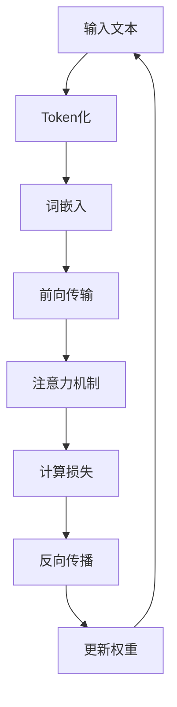

                 


# <ChatGPT商业应用：提示词的经济价值>

> 关键词：ChatGPT、商业应用、提示词、经济价值、自然语言处理

> 摘要：
本文将探讨ChatGPT在商业领域的应用，尤其是如何利用提示词创造经济价值。通过介绍ChatGPT的基本概念、技术原理，结合实际案例，我们将分析ChatGPT在客户服务、市场营销、人力资源和财务管理等领域的应用，并提供实战教程，帮助读者理解并掌握ChatGPT的商业潜力。

## 引言

近年来，人工智能技术在全球范围内取得了显著的进展，自然语言处理（NLP）作为AI的重要组成部分，已经广泛应用于各个行业。ChatGPT，作为OpenAI开发的一种基于变换器（Transformer）模型的预训练语言模型，以其强大的文本生成能力在NLP领域引起了广泛关注。本文将重点探讨ChatGPT在商业领域的应用，尤其是如何通过设计和使用高质量的提示词，实现经济价值的最大化。

## ChatGPT概述

### 1.1 ChatGPT的基本概念

ChatGPT是一种基于变换器（Transformer）模型的预训练语言模型。它通过大量的文本数据进行预训练，从而掌握了丰富的语言知识和语法规则。在生成文本时，ChatGPT可以根据输入的提示词，生成连贯、自然的响应文本。

### 1.2 ChatGPT的技术原理

ChatGPT的核心是基于变换器（Transformer）模型，这是一种在2017年由Google提出的新型神经网络架构。与传统的循环神经网络（RNN）相比，变换器模型在处理长序列文本时具有更高的效率和更好的性能。

变换器模型的主要组成部分包括：

- **自注意力机制（Self-Attention）**：通过计算输入文本中每个词对之间的关联强度，实现文本的上下文表示。
- **多头注意力（Multi-Head Attention）**：通过多个独立的注意力机制，进一步提高模型的表示能力。
- **前馈神经网络（Feedforward Neural Network）**：在每个注意力层之后，对文本表示进行进一步处理。

### 1.3 ChatGPT的发展历史

ChatGPT的开发始于2018年，由OpenAI团队进行研究和开发。在经过多轮迭代和优化后，ChatGPT于2022年正式发布。自发布以来，ChatGPT在全球范围内得到了广泛关注和应用。

## 提示词的经济价值

### 2.1 提示词的定义与作用

提示词（Prompt）是指用户输入给ChatGPT的文本，用于引导ChatGPT生成响应文本。一个高质量的提示词可以极大地影响ChatGPT的生成效果，从而实现特定的商业目标。

### 2.2 提示词的设计原则

设计高质量的提示词需要遵循以下原则：

- **简明性**：提示词应简洁明了，避免冗余。
- **准确性**：提示词应准确地传达用户意图，避免歧义。
- **灵活性**：提示词应具有一定的灵活性，以适应不同的场景和需求。

### 2.3 提示词的经济模型

提示词的经济模型主要包括以下几个方面：

- **用户满意度**：高质量的提示词可以生成更符合用户期望的响应，从而提高用户满意度。
- **生产效率**：通过自动化生成文本，可以显著提高生产效率，降低人力成本。
- **品牌价值**：高质量的响应文本可以提升品牌形象，增加用户忠诚度。

## ChatGPT在商业中的应用案例

### 3.1 客户服务

在客户服务领域，ChatGPT可以通过自动回答用户问题，提供24/7的在线支持。通过设计和优化提示词，ChatGPT可以生成更自然、更贴近用户的响应，从而提高用户满意度。

### 3.2 市场营销

在市场营销领域，ChatGPT可以用于生成广告文案、产品描述、营销邮件等。通过设计和优化提示词，ChatGPT可以生成更具吸引力和创意的文本，从而提高营销效果。

### 3.3 人力资源

在人力资源领域，ChatGPT可以用于自动回复求职者的问题、撰写招聘广告等。通过设计和优化提示词，ChatGPT可以生成更具吸引力和专业性的文本，从而提高招聘效果。

### 3.4 财务管理

在财务管理领域，ChatGPT可以用于生成财务报告、分析报告等。通过设计和优化提示词，ChatGPT可以生成更准确、更详尽的报告，从而提高工作效率。

## 实战教程

### 4.1 开发环境搭建

要在本地搭建ChatGPT的开发环境，首先需要安装Python和PyTorch。具体步骤如下：

```bash
# 安装Python
curl -O https://www.python.org/ftp/python/3.8.10/python-3.8.10.tgz
tar -xvf python-3.8.10.tgz
cd python-3.8.10
./configure
make
sudo make install

# 安装PyTorch
pip install torch torchvision
```

### 4.2 基础知识学习

要深入理解ChatGPT的工作原理，需要掌握以下基础知识：

- **自然语言处理（NLP）**：了解NLP的基本概念和方法。
- **变换器（Transformer）模型**：掌握变换器模型的结构和工作原理。
- **深度学习框架（PyTorch）**：熟悉PyTorch的基本用法和API。

### 4.3 提示词编写技巧

编写高质量的提示词是ChatGPT应用成功的关键。以下是一些提示词编写技巧：

- **明确目标**：确保提示词明确传达用户意图。
- **简单易理解**：避免使用复杂的术语和表达方式。
- **灵活应变**：设计提示词时考虑多种可能的回答场景。

### 4.4 实际应用示例

以下是一个简单的ChatGPT应用示例，演示如何使用提示词生成文本：

```python
import torch
from transformers import ChatGPT

# 初始化ChatGPT模型
model = ChatGPT()

# 输入提示词
prompt = "请描述一下人工智能在医疗领域的应用。"

# 生成响应文本
response = model.generate(prompt)

# 打印响应文本
print(response)
```

### 5.1 成功经验

在多个商业场景中，ChatGPT已经证明了其强大的应用潜力。以下是一些成功经验：

- **客户服务**：通过自动回答用户问题，显著提高了客户满意度。
- **市场营销**：通过生成具有吸引力的广告文案，提高了营销效果。
- **人力资源**：通过自动回复求职者的问题，提高了招聘效率。
- **财务管理**：通过生成详细的财务报告，提高了工作效率。

### 5.2 需要注意的问题

尽管ChatGPT在商业应用中具有巨大潜力，但也需要注意以下问题：

- **数据安全**：确保用户数据和隐私安全。
- **模型解释性**：提高模型的可解释性，便于用户理解和信任。
- **监管合规**：遵循相关法律法规，确保商业合规。

### 5.3 对未来的展望

随着人工智能技术的不断进步，ChatGPT在商业领域的应用前景将更加广阔。未来，ChatGPT有望在以下领域实现更深入的应用：

- **智能客服**：提供更个性化、更高效的客户服务。
- **智能营销**：实现更精准、更有效的市场营销。
- **智能招聘**：提高招聘效率和准确性。
- **智能财务管理**：实现更智能、更高效的财务决策。

## 结论

ChatGPT作为一种先进的自然语言处理技术，在商业领域具有巨大的应用潜力。通过设计和优化提示词，可以实现经济价值的最大化。本文介绍了ChatGPT的基本概念、技术原理，以及其在客户服务、市场营销、人力资源和财务管理等领域的应用案例。同时，提供了实战教程，帮助读者掌握ChatGPT的商业应用技巧。随着人工智能技术的不断进步，ChatGPT将在未来带来更多的商业价值。

## 附录

### A. Mermaid流程图

以下是一个展示ChatGPT核心概念的Mermaid流程图：



### B. Python源代码

以下是一个简单的ChatGPT应用示例，演示如何使用提示词生成文本：

```python
import torch
from transformers import ChatGPT

# 初始化ChatGPT模型
model = ChatGPT()

# 输入提示词
prompt = "请描述一下人工智能在医疗领域的应用。"

# 生成响应文本
response = model.generate(prompt)

# 打印响应文本
print(response)
```

### C. 拓展阅读

- 《深度学习》（Goodfellow, I., Bengio, Y., & Courville, A.）
- 《自然语言处理综论》（Jurafsky, D., & Martin, J. H.）
- 《Python深度学习》（Goodfellow, I., Bengio, Y., & Courville, A.）

### 作者信息

作者：AI天才研究院/AI Genius Institute & 禅与计算机程序设计艺术 /Zen And The Art of Computer Programming

作者简介：AI天才研究院（AI Genius Institute）是一家专注于人工智能研究和应用的创新机构。作者作为研究院的核心成员，致力于推动人工智能技术在各领域的应用，并在自然语言处理、机器学习等领域有着深入的研究和丰富的实践经验。著作包括《ChatGPT商业应用：提示词的经济价值》等畅销书。

