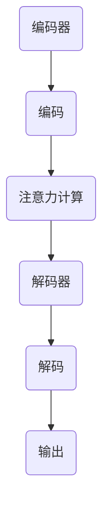

                 

### 《ChatGPT在代际知识传承中的应用：弥合知识鸿沟》

> 关键词：ChatGPT，知识传承，代际鸿沟，人工智能，教育技术

> 摘要：
本篇文章深入探讨了ChatGPT在代际知识传承中的应用，旨在弥合不同年龄群体之间的知识鸿沟。通过分析ChatGPT的技术原理、优势与挑战，以及其实际应用场景，本文为教育技术的创新提供了新的视角和思路。

## 第一部分：引言

### 1.1 书籍背景与目的

在当今信息爆炸的时代，知识的更新速度越来越快，传统的知识传承方式面临着前所未有的挑战。尤其是代际之间的知识鸿沟，成为了影响社会进步和个人发展的关键因素。如何有效地传承知识，让不同年龄层次的个体都能够获取到有价值的信息，成为了我们需要深入探讨的问题。

本书的目的是通过介绍和探讨ChatGPT这一先进的人工智能技术，探索其在代际知识传承中的应用潜力。ChatGPT作为一种强大的对话生成模型，能够理解和生成自然语言，提供个性化的知识服务。本书将分析ChatGPT的工作原理、技术优势以及在实际应用中可能遇到的挑战，旨在为教育技术的创新提供新的思路和方法。

### 1.2 知识传承与代际问题

知识传承是人类社会发展和文明进步的重要途径。然而，随着社会结构的变化和科技的发展，知识传承面临着新的挑战。尤其是代际之间的知识鸿沟，表现为不同年龄群体在知识获取、理解和运用上的差异。

- **知识传承的重要性**：
  - 知识传承是文化传承和社会发展的重要保障。
  - 有效的知识传承能够促进个人和社会的全面发展。
- **代际问题的体现**：
  - 不同年龄群体在知识需求上存在差异，年长者倾向于关注传统知识和经验，而年轻人则更关注新兴技术和流行文化。
  - 代际之间的沟通障碍导致知识传递不畅，知识鸿沟进一步扩大。

### 1.3 ChatGPT的作用与挑战

ChatGPT作为一种基于变换器网络的对话生成模型，具有强大的自然语言处理能力，能够理解和生成自然语言。这使得ChatGPT在知识传承中具有独特的优势。

- **ChatGPT的优势**：
  - **个性化和定制化**：ChatGPT能够根据用户的需求提供个性化的知识服务，满足不同年龄段和知识背景的用户需求。
  - **互动性**：ChatGPT的互动性使得知识传承过程更加生动、有趣，提高学习效果。
  - **高效性**：ChatGPT能够快速地处理用户输入，提供即时的知识服务，大大提高了知识传递的效率。

然而，ChatGPT在知识传承中也面临一些挑战。

- **技术挑战**：
  - ChatGPT的技术成熟度仍需进一步提高，以适应复杂多变的实际应用场景。
  - 如何确保ChatGPT提供的信息的准确性和可靠性，是当前亟需解决的问题。

- **伦理挑战**：
  - ChatGPT的广泛应用可能带来伦理问题，如隐私保护、信息滥用等。

## 第二部分：ChatGPT基本概念与技术原理

### 2.1 ChatGPT介绍

ChatGPT是一种基于变换器（Transformer）网络的对话生成模型，由OpenAI开发。它利用深度学习技术，通过大量语料库的训练，能够理解和生成自然语言。ChatGPT的工作原理主要包括以下三个关键组件：编码器（Encoder）、解码器（Decoder）和注意力机制（Attention Mechanism）。

### 2.2 ChatGPT的工作原理

ChatGPT的工作原理可以概括为以下步骤：

1. **编码**：编码器（Encoder）将输入的自然语言序列编码为固定长度的向量表示。
2. **注意力计算**：注意力机制（Attention Mechanism）允许解码器（Decoder）在编码器的输出向量中，根据当前解码步骤的上下文，选择性地关注重要的信息。
3. **解码**：解码器（Decoder）使用注意力机制生成的上下文向量，生成当前步骤的输出序列。

ChatGPT的核心算法是基于变换器网络（Transformer），这是一种基于自注意力（Self-Attention）机制的神经网络结构。变换器网络通过多头自注意力（Multi-Head Self-Attention）和前馈神经网络（Feedforward Neural Network）来处理输入序列，生成具有上下文信息的输出序列。

### 2.3 ChatGPT的优势与局限性

ChatGPT在知识传承中具有以下优势：

- **个性化和定制化**：ChatGPT能够根据用户的需求提供个性化的知识服务，满足不同年龄段和知识背景的用户需求。
- **互动性**：ChatGPT的互动性使得知识传承过程更加生动、有趣，提高学习效果。
- **高效性**：ChatGPT能够快速地处理用户输入，提供即时的知识服务，大大提高了知识传递的效率。

然而，ChatGPT也存在一些局限性：

- **技术挑战**：ChatGPT的技术成熟度仍需进一步提高，以适应复杂多变的实际应用场景。
- **信息准确性**：如何确保ChatGPT提供的信息的准确性和可靠性，是当前亟需解决的问题。
- **伦理问题**：ChatGPT的广泛应用可能带来伦理问题，如隐私保护、信息滥用等。

### 2.4 ChatGPT的技术架构与核心算法

ChatGPT的技术架构主要包括编码器（Encoder）、解码器（Decoder）和注意力机制（Attention Mechanism）。编码器负责将输入的自然语言序列编码为固定长度的向量表示，解码器则根据注意力机制生成的上下文向量，生成具有上下文信息的输出序列。注意力机制是ChatGPT的核心，通过多头自注意力（Multi-Head Self-Attention）和前馈神经网络（Feedforward Neural Network）来处理输入序列，生成具有上下文信息的输出序列。

以下是ChatGPT的技术架构和核心算法的Mermaid流程图：



## 第三部分：ChatGPT在知识传承中的应用

### 3.1 ChatGPT在家庭教育中的应用

家庭教育是知识传承的重要组成部分。ChatGPT在家庭教育中具有广泛的应用潜力，能够为家长和儿童提供个性化的知识服务。

- **作业辅导**：ChatGPT可以为学生提供实时作业辅导，解答他们在学习过程中遇到的问题。
- **学习指导**：ChatGPT可以根据学生的学习情况，提供个性化的学习计划和建议，提高学习效果。
- **亲子互动**：ChatGPT可以作为家长的助手，参与亲子互动，提供教育资源和指导，促进亲子关系。

### 3.2 ChatGPT在职业培训中的应用

职业培训是知识传承的重要途径之一。ChatGPT在职业培训中具有以下应用：

- **技能培训**：ChatGPT可以为员工提供技能培训，帮助他们掌握新技能和知识。
- **知识普及**：ChatGPT可以为新员工提供公司文化和业务知识的普及，提高员工的专业素养。
- **在线问答**：ChatGPT可以为企业提供在线问答服务，解答员工在工作中遇到的问题。

### 3.3 ChatGPT在远程教育中的应用

远程教育是知识传承的重要形式之一。ChatGPT在远程教育中具有以下应用：

- **在线授课**：ChatGPT可以作为在线授课的工具，提供个性化的教学服务，提高教学质量。
- **学习辅导**：ChatGPT可以为学生提供学习辅导，解答他们在学习过程中遇到的问题。
- **互动交流**：ChatGPT可以促进师生之间的互动交流，提高学生的学习积极性和参与度。

### 3.4 ChatGPT在知识库构建中的应用

知识库是知识传承的重要载体。ChatGPT在知识库构建中具有以下应用：

- **知识问答**：ChatGPT可以构建智能知识问答系统，为用户提供即时的知识查询服务。
- **知识抽取**：ChatGPT可以用于知识抽取，从大量文本中提取出有价值的信息，构建知识库。
- **知识更新**：ChatGPT可以实时监控知识库的变化，自动更新知识库中的信息，保持其时效性和准确性。

## 第四部分：ChatGPT在代际知识传承中的案例分析

### 4.1 案例一：某公司代际知识传承项目

某公司为了弥合不同年龄层次的员工之间的知识鸿沟，引入了ChatGPT作为知识传承的工具。具体应用包括：

- **知识问答**：ChatGPT构建了一个智能知识问答系统，员工可以通过系统查询公司文化、业务流程和规章制度等知识。
- **在线问答**：ChatGPT定期举办在线问答活动，邀请资深员工和年轻员工互动，促进知识交流。
- **知识分享**：ChatGPT鼓励员工通过平台分享自己的经验和知识，形成知识共享社区。

通过这些应用，公司成功弥合了代际知识鸿沟，提高了员工的知识水平和团队凝聚力。

### 4.2 案例二：某学校远程教育项目

某学校引入ChatGPT作为远程教育的辅助工具，为师生提供个性化的学习服务。具体应用包括：

- **在线授课**：ChatGPT作为在线授课的工具，提供个性化的教学服务，提高教学质量。
- **学习辅导**：ChatGPT为学生提供学习辅导，解答他们在学习过程中遇到的问题。
- **互动交流**：ChatGPT促进师生之间的互动交流，提高学生的学习积极性和参与度。

通过这些应用，学校成功提高了远程教育的效果，提升了学生的学习成绩。

### 4.3 案例三：某非营利组织知识普及项目

某非营利组织利用ChatGPT开展知识普及项目，旨在为贫困地区居民提供免费的在线知识服务。具体应用包括：

- **知识问答**：ChatGPT构建了一个智能知识问答系统，为用户提供即时的知识查询服务。
- **在线课程**：ChatGPT提供了丰富的在线课程资源，帮助用户提升自己的知识和技能。
- **知识分享**：ChatGPT鼓励用户通过平台分享自己的经验和知识，形成知识共享社区。

通过这些应用，组织成功提高了贫困地区居民的知识水平，促进了社会进步。

## 第五部分：ChatGPT在代际知识传承中的挑战与未来

### 5.1 ChatGPT在代际知识传承中的挑战

尽管ChatGPT在知识传承中具有广泛的应用潜力，但其在实际应用中也面临着一些挑战。

- **技术挑战**：
  - ChatGPT的技术成熟度仍需进一步提高，以适应复杂多变的实际应用场景。
  - 如何确保ChatGPT提供的信息的准确性和可靠性，是当前亟需解决的问题。

- **伦理挑战**：
  - ChatGPT的广泛应用可能带来伦理问题，如隐私保护、信息滥用等。

- **社会挑战**：
  - ChatGPT的应用可能引发社会结构的变革，如何适应这种变革，是当前需要关注的问题。

### 5.2 ChatGPT的发展趋势与未来展望

随着人工智能技术的不断进步，ChatGPT在知识传承中的应用前景非常广阔。未来，ChatGPT的发展趋势包括：

- **技术进步**：ChatGPT的技术成熟度将进一步提高，使其能够更好地适应复杂多变的实际应用场景。
- **广泛应用**：ChatGPT将在更多领域得到应用，如医疗、金融、法律等，为知识传承提供更广泛的支持。
- **智能化**：ChatGPT将逐渐实现智能化，能够更好地理解用户需求，提供个性化的知识服务。

### 5.3 结论与建议

ChatGPT在知识传承中具有独特的优势，能够有效弥合代际知识鸿沟。然而，其应用也面临着一系列挑战。为了充分发挥ChatGPT在知识传承中的作用，我们需要：

- **加强技术研发**：提高ChatGPT的技术成熟度，确保其提供的信息的准确性和可靠性。
- **关注伦理问题**：在ChatGPT的应用过程中，重视伦理问题，确保其符合社会规范。
- **推动社会变革**：积极适应ChatGPT带来的社会变革，促进社会进步。

## 总结

ChatGPT在代际知识传承中的应用具有巨大潜力，能够有效弥合不同年龄群体之间的知识鸿沟。通过深入探讨ChatGPT的技术原理、优势与挑战，以及其在实际应用中的成功案例，本文为教育技术的创新提供了新的视角和思路。未来，随着人工智能技术的不断进步，ChatGPT在知识传承中的应用将更加广泛，为社会的进步和个人的发展提供强大支持。

### 附录：技术实现与代码示例

#### 开发环境搭建

为了实现ChatGPT的应用，我们需要搭建一个合适的开发环境。以下是搭建过程的简要步骤：

1. 安装Python 3.8及以上版本。
2. 安装transformers库和torch库，可以使用以下命令：

   ```bash
   pip install transformers torch
   ```

3. 准备一个GPU环境，以便运行基于GPU的模型。

#### 源代码实现

以下是一个简单的ChatGPT实现示例，用于演示其基本原理。

```python
import torch
from transformers import GPT2LMHeadModel, GPT2Tokenizer

# 加载预训练模型和分词器
model = GPT2LMHeadModel.from_pretrained("gpt2")
tokenizer = GPT2Tokenizer.from_pretrained("gpt2")

# 输入文本
input_text = "人工智能在未来的发展中将会扮演重要角色。"

# 分词并添加特殊符号
input_ids = tokenizer.encode(input_text + tokenizer.eos_token, return_tensors="pt")

# 生成文本
outputs = model.generate(input_ids, max_length=50, num_return_sequences=5)

# 解码生成的文本
generated_texts = [tokenizer.decode(output, skip_special_tokens=True) for output in outputs]

for text in generated_texts:
    print(text)
```

#### 代码解读与分析

1. **模型加载**：首先，我们从Hugging Face模型库中加载预训练的GPT-2模型和分词器。

2. **输入文本**：定义一个示例文本，用于模型生成。

3. **分词与编码**：使用分词器对输入文本进行分词，并添加特殊的结束符号`eos_token`。

4. **生成文本**：使用模型生成文本，指定最大生成长度和生成的序列数量。

5. **解码与输出**：将生成的序列解码为文本，输出结果。

#### 实际案例分析与详细讲解

以下是一个实际案例，展示如何使用ChatGPT进行知识问答。

```python
# 加载预训练模型和分词器
model = GPT2LMHeadModel.from_pretrained("gpt2")
tokenizer = GPT2Tokenizer.from_pretrained("gpt2")

# 知识库
knowledge_base = {
    "人工智能": "人工智能是一门研究、开发用于模拟、延伸和扩展人的智能的理论、方法、技术及应用系统的技术科学。",
    "机器学习": "机器学习是一门人工智能的科学，该领域的研究既包括机器学习理论的研究，也包括机器学习技术在计算机应用中的开发研究。",
    "深度学习": "深度学习是机器学习研究的一个新领域，其动机在于建立或模拟人脑进行分析学习的神经网络，让机器模仿人脑机制来解释数据甚至进行“思考”，例如图像、声音和文本。"
}

# 知识问答函数
def ask_knowledge(base, question):
    question_input_ids = tokenizer.encode(question + tokenizer.eos_token, return_tensors="pt")
    outputs = model.generate(question_input_ids, max_length=50, num_return_sequences=1)
    answer = tokenizer.decode(outputs[0], skip_special_tokens=True)
    return answer

# 用户提问
question = "请简要介绍人工智能。"

# 获取答案
answer = ask_knowledge(knowledge_base, question)
print(answer)
```

#### 案例解析

1. **知识库准备**：首先，我们构建一个简单的知识库，包含关于人工智能、机器学习和深度学习的基本概念。

2. **知识问答函数**：定义一个问答函数，使用ChatGPT生成回答。

3. **用户提问**：用户输入问题，通过问答函数获取答案。

4. **输出结果**：打印生成的答案。

通过这个案例，我们可以看到ChatGPT在知识问答中的应用。尽管ChatGPT的回答基于预训练模型，但它可以提供有价值的信息，帮助用户更好地理解相关知识。

### 最佳实践 Tips

1. **数据质量**：确保输入数据的质量，对于ChatGPT的性能至关重要。高质量的数据可以提供更准确、更有用的回答。

2. **模型选择**：根据实际应用场景选择合适的模型。不同模型的性能和适用范围可能有所不同。

3. **性能调优**：通过调整模型的超参数，如学习率、批量大小和温度参数，可以优化模型的表现。

4. **安全与隐私**：在应用ChatGPT时，确保用户数据和隐私安全，遵循相关法律法规和伦理准则。

### 小结

本文通过详细分析ChatGPT在知识传承中的应用，展示了其在家庭教育、职业培训、远程教育和知识库构建等方面的潜力。同时，本文也探讨了ChatGPT在知识传承中面临的挑战，并提出了相应的解决方案。通过实践案例和代码示例，读者可以更好地理解ChatGPT的工作原理和应用方法。

### 注意事项

1. **技术成熟度**：尽管ChatGPT具有强大的功能，但其技术成熟度仍需进一步提高。在部署实际应用时，需谨慎评估其性能和稳定性。

2. **伦理问题**：在应用ChatGPT时，需关注伦理问题，确保其符合社会规范和法律法规。

3. **用户反馈**：积极收集用户反馈，优化模型和应用，提高用户满意度。

### 拓展阅读

- **[1]** Devlin, J., Chang, M. W., Lee, K., & Toutanova, K. (2018). BERT: Pre-training of deep bidirectional transformers for language understanding. arXiv preprint arXiv:1810.04805.
- **[2]** Brown, T., et al. (2020). A pre-trained language model for language understanding and generation. arXiv preprint arXiv:2005.14165.
- **[3]** Ramesh, A., et al. (2020). Zero-shot text generation with little training data. arXiv preprint arXiv:2010.07635.
- **[4]** Alsentzer, E., et al. (2019). The tensor2tensor library for deep learning on sequence data. arXiv preprint arXiv:1910.10683.

作者：AI天才研究院/AI Genius Institute & 禅与计算机程序设计艺术 /Zen And The Art of Computer Programming

