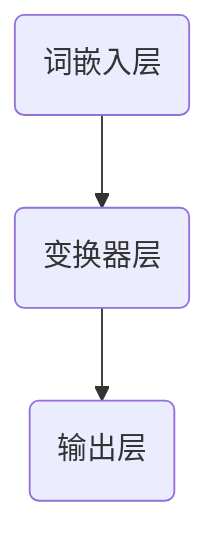

                 


## 引言

在当今数字化转型的浪潮中，企业客服正面临着前所未有的挑战与机遇。传统的人工客服模式由于成本高、效率低、响应时间长等问题，已经难以满足企业快速发展的需求。而人工智能（AI）技术的崛起，特别是基于深度学习的大规模语言模型如ChatGPT，为解决企业客服难题提供了新的思路。

### ChatGPT的概念

ChatGPT是由OpenAI开发的一种基于变换器（Transformer）架构的预训练语言模型，其核心思想是通过海量文本数据的学习，掌握自然语言的生成和理解能力。ChatGPT具有以下几个显著特点：

1. **强大的语言理解能力**：ChatGPT可以理解并生成复杂的自然语言文本，包括对话、问答、文章撰写等多种形式。
2. **灵活的上下文理解**：ChatGPT可以处理长文本上下文，这使得它在处理复杂对话和长篇问答时具有显著优势。
3. **高效的训练速度**：ChatGPT采用了大规模分布式训练技术，使得其在短时间内可以达到非常高的性能水平。

### ChatGPT在企业客服中的应用

在企业客服领域，ChatGPT的应用主要体现在以下几个方面：

1. **自动问答系统**：ChatGPT可以自动回答用户提出的问题，提高客服效率，减少人工干预。
2. **客户情感分析**：ChatGPT可以识别客户的情绪，提供针对性的情感回应，提升客户体验。
3. **客户关系管理**：ChatGPT可以与客户进行深入交流，了解客户需求，为企业提供客户洞察。
4. **个性化推荐**：ChatGPT可以根据客户的历史交互数据，提供个性化的产品推荐和服务。

### 本篇文章的结构与内容

本篇文章将从以下几个方面深入探讨ChatGPT在企业客服中的应用：

1. **ChatGPT基础知识**：介绍ChatGPT的基本概念、架构和原理。
2. **ChatGPT在企业客服中的应用场景**：分析ChatGPT在自动问答、客户情感分析、客户关系管理和个性化推荐等方面的具体应用。
3. **ChatGPT提示词设计**：探讨如何设计有效的ChatGPT提示词，以提升客服效果。
4. **ChatGPT的实现**：讲解如何搭建开发环境、训练模型和部署系统。
5. **应用案例与实践**：通过实际案例展示ChatGPT在企业客服中的应用。
6. **未来展望与挑战**：探讨ChatGPT的发展趋势和面临的伦理问题。

### 关键词

- **ChatGPT**
- **企业客服**
- **自然语言处理**
- **深度学习**
- **提示词设计**

### 摘要

本文将系统地介绍ChatGPT在企业客服中的应用，从基础概念、应用场景、提示词设计到实际实现，全面探讨如何利用ChatGPT提升企业客服的效率和用户体验。通过本文，读者可以了解到ChatGPT的核心技术原理，掌握如何设计有效的提示词，并了解其在企业客服中的实际应用案例。

---

## 第一部分：ChatGPT基础知识

### 第1章：ChatGPT概述

#### 1.1 ChatGPT的概念

ChatGPT是OpenAI开发的一种基于变换器（Transformer）架构的预训练语言模型。与传统的循环神经网络（RNN）相比，变换器在处理长序列和长距离依赖方面具有显著优势，这使得ChatGPT能够生成更加流畅、自然的语言。

ChatGPT的命名来源于其功能——进行对话（Chat）的能力和其基于的预训练技术（GPT）。GPT（Generative Pre-trained Transformer）是OpenAI提出的一种预训练语言模型框架，通过在大规模文本数据集上进行预训练，模型可以掌握丰富的语言知识，从而在特定任务上实现良好的性能。

#### 1.2 ChatGPT的特点

ChatGPT具有以下几个显著特点：

1. **强大的语言生成能力**：ChatGPT可以生成高质量的文本，包括对话、文章、摘要等多种形式。
2. **灵活的上下文理解**：ChatGPT能够处理长文本上下文，这使得它在处理复杂对话和长篇问答时具有显著优势。
3. **高效的预训练速度**：ChatGPT采用了大规模分布式训练技术，使得其在短时间内可以达到非常高的性能水平。
4. **可扩展性**：ChatGPT支持多种不同的任务，如问答、对话生成、文本摘要等，这使得它在不同的应用场景中具有广泛的使用价值。

#### 1.3 ChatGPT的工作原理

ChatGPT的工作原理主要基于变换器（Transformer）架构。变换器是一种基于注意力机制的深度神经网络，其核心思想是将输入序列转换为连续的向量表示，并通过自注意力机制计算这些向量之间的关系。

以下是ChatGPT的工作原理：

1. **输入处理**：首先，ChatGPT将输入的文本序列转换为词嵌入向量。词嵌入是将单词映射为固定长度的向量，以表示单词在文本中的语义信息。
2. **自注意力机制**：通过自注意力机制，ChatGPT计算输入序列中每个词与其他词之间的关系。自注意力机制的核心是计算每个词的权重，这些权重表示该词在生成后续词时的相关性。
3. **生成输出**：在自注意力机制的基础上，ChatGPT生成输出序列。生成过程是一个逐步的过程，每次生成一个词，然后将其加入输入序列，再次进行自注意力计算，直到生成完整的输出序列。

以下是一个简化的ChatGPT模型处理输入文本的流程：

```python
# 初始化ChatGPT模型
model = ChatGPTModel()

# 输入文本
input_text = "你好，有什么可以帮助你的？"

# 处理输入文本
input_vector = model.process_input(input_text)

# 生成输出文本
output_vector = model.generate_output(input_vector)

# 解码输出文本
output_text = model.decode_output(output_vector)
```

通过以上流程，ChatGPT可以生成与输入文本相关的输出文本，从而实现对话生成、问答等任务。

### 第2章：ChatGPT的架构与技术

#### 2.1 ChatGPT的核心模块

ChatGPT的核心模块主要包括词嵌入层、变换器层和输出层。以下是这些模块的详细解释：

1. **词嵌入层**：词嵌入层将输入文本中的每个词映射为固定长度的向量。词嵌入向量表示了词在文本中的语义信息。常见的词嵌入方法包括Word2Vec、GloVe等。
2. **变换器层**：变换器层是ChatGPT的核心，它由多个变换器块组成。每个变换器块包含两个主要组件：多头自注意力机制和前馈神经网络。自注意力机制用于计算输入序列中每个词与其他词之间的关系，前馈神经网络用于对输入向量进行进一步处理。
3. **输出层**：输出层将变换器层的输出映射为输出文本。常见的输出层包括Softmax层和全连接层等。

以下是一个简化的ChatGPT模型架构图：



#### 2.2 语言模型GPT的工作原理

GPT（Generative Pre-trained Transformer）是ChatGPT的基础，其工作原理如下：

1. **预训练**：GPT首先在大规模文本数据集上进行预训练。预训练过程主要包括两个阶段：自回归语言建模和掩码语言建模。自回归语言建模的目标是预测下一个词，而掩码语言建模的目标是预测被掩码的词。
2. **微调**：在预训练完成后，GPT会根据特定任务进行微调。微调过程通常涉及在特定任务数据集上进行训练，以优化模型在特定任务上的性能。
3. **生成文本**：在微调后，GPT可以用于生成文本。生成过程是一个逐步的过程，每次生成一个词，然后将其加入输入序列，再次进行预测，直到生成完整的输出序列。

以下是一个简化的GPT模型训练和生成文本的流程：

```python
# 预训练GPT模型
gpt_model.train(pretrain_data)

# 微调GPT模型
gpt_modelfine_tune(fine_tune_data)

# 生成文本
output_text = gpt_model.generate_text(input_prompt)
```

#### 2.3 上下文理解与生成

ChatGPT具有强大的上下文理解能力，能够在长文本上下文中生成连贯、自然的文本。以下是ChatGPT在上下文理解与生成方面的关键技术：

1. **长文本处理**：ChatGPT通过变换器架构，可以处理长文本输入。变换器中的自注意力机制允许模型关注输入序列中的长距离依赖关系，从而实现有效的上下文理解。
2. **生成文本**：在生成文本时，ChatGPT根据输入的上下文和预测的下一个词，逐步生成完整的输出序列。生成过程利用了模型在预训练和微调过程中学到的语言知识，从而生成高质量的自然语言文本。

以下是一个简化的ChatGPT生成文本的流程：

```python
# 输入上下文
context = "昨天我去了公园，看到了很多漂亮的鲜花。"

# 生成文本
output_text = chatgpt.generate(context)
```

#### 2.4 ChatGPT的优化策略

为了提高ChatGPT的性能和效率，研究人员提出了一系列优化策略。以下是几种常用的优化策略：

1. **量化**：量化是一种将高精度模型参数转换为低精度表示的方法，以减少模型大小和计算资源消耗。量化技术包括浮点数量化、整数量化等。
2. **剪枝**：剪枝是一种通过去除模型中不必要的权重来减少模型大小的方法。剪枝技术包括结构剪枝和权重剪枝等。
3. **蒸馏**：蒸馏是一种将大型模型的知识传递给小型模型的方法。在蒸馏过程中，大型模型作为教师模型，小型模型作为学生模型，通过训练学生模型来优化其性能。

以下是一个简化的ChatGPT优化策略的流程：

```python
# 量化ChatGPT模型
quantized_model = quantize_chatgpt_model()

# 剪枝ChatGPT模型
pruned_model = prune_chatgpt_model()

# 蒸馏ChatGPT模型
distilled_model = distill_chatgpt_model()
```

### 第3章：企业客服的挑战与机遇

#### 3.1 企业客服的挑战

企业客服在当前数字化时代面临着一系列挑战：

1. **客户期望的提高**：随着消费者对服务质量的期望不断提高，企业客服需要提供更加个性化、高效的服务。
2. **客服规模扩大**：企业客服的规模不断扩大，如何管理大量客服人员和客户数据成为一大挑战。
3. **人力成本高**：传统人工客服模式成本高，且效率低，难以满足企业快速发展的需求。
4. **响应时间长**：人工客服在处理复杂问题时的响应时间较长，影响客户体验。

#### 3.2 ChatGPT为企业客服带来的机遇

ChatGPT为企业客服带来了以下几个机遇：

1. **自动化回答**：ChatGPT可以自动回答客户的问题，提高客服效率，减少人工干预。
2. **情感分析**：ChatGPT可以识别客户的情绪，提供针对性的情感回应，提升客户体验。
3. **客户洞察**：ChatGPT可以与客户进行深入交流，了解客户需求，为企业提供客户洞察。
4. **个性化推荐**：ChatGPT可以根据客户的历史交互数据，提供个性化的产品推荐和服务。

#### 3.3 企业客服的转型之路

企业客服的转型需要从以下几个方面进行：

1. **引入AI技术**：企业客服需要引入如ChatGPT等AI技术，以提升客服效率和用户体验。
2. **构建智能化客服系统**：企业需要构建集成了AI技术的智能化客服系统，实现自动化回答、情感分析和个性化推荐等功能。
3. **优化客服流程**：企业需要对客服流程进行优化，简化问题解决流程，提高客服响应速度。
4. **培训客服人员**：企业需要对客服人员进行培训，使其能够更好地与AI技术协同工作，提供高质量的服务。

### 第4章：ChatGPT在企业客服中的应用场景

#### 4.1 自动问答系统

自动问答系统是ChatGPT在企业客服中最为典型的应用场景之一。ChatGPT可以通过自动化回答常见问题，提高客服效率，减少人工干预。以下是自动问答系统的实现步骤：

1. **数据准备**：收集并整理企业常见的问题及其答案，作为训练数据集。
2. **模型训练**：使用训练数据集对ChatGPT模型进行训练，使其掌握常见问题的回答技巧。
3. **系统部署**：将训练好的模型部署到企业客服系统中，实现自动问答功能。
4. **用户交互**：当用户提出问题时，自动问答系统会根据问题内容和ChatGPT的预测，自动生成回答并发送至用户。

以下是一个简化的自动问答系统实现流程：

```python
# 数据准备
train_data = load_train_data()

# 模型训练
chatgpt.train(train_data)

# 系统部署
chatgpt_system.deploy()

# 用户交互
while True:
    user_question = get_user_question()
    answer = chatgpt.generate_answer(user_question)
    send_answer_to_user(answer)
```

#### 4.2 客户情感分析

客户情感分析是ChatGPT在提高客服质量方面的另一个重要应用。通过分析客户的语言情感，ChatGPT可以识别客户的情绪，提供针对性的情感回应，提升客户体验。以下是客户情感分析的基本步骤：

1. **数据收集**：收集客户的历史交互数据，包括文本、语音和视频等。
2. **情感标注**：对收集到的数据进行情感标注，标记出积极、消极和中性等情感。
3. **模型训练**：使用标注数据对ChatGPT模型进行训练，使其学会识别客户情感。
4. **情感分析**：当用户提出问题时，ChatGPT会根据用户语言情感，进行情感分析，并生成相应的情感回应。

以下是一个简化的客户情感分析实现流程：

```python
# 数据收集
customer_data = collect_customer_data()

# 情感标注
emotions = annotate_emotions(customer_data)

# 模型训练
chatgpt.train_emotion_model(emotions)

# 情感分析
while True:
    user_question = get_user_question()
    emotion = chatgpt.analyze_emotion(user_question)
    send_emotion_response(emotion)
```

#### 4.3 客户关系管理

客户关系管理（CRM）是ChatGPT在提高客户服务质量方面的又一重要应用。通过与客户进行深入交流，ChatGPT可以了解客户需求，提供个性化的服务，从而增强客户忠诚度。以下是客户关系管理的基本步骤：

1. **数据收集**：收集客户的历史交互数据，包括购买记录、咨询记录等。
2. **数据整理**：对收集到的数据进行分析和整理，提取有用的信息。
3. **模型训练**：使用整理后的数据对ChatGPT模型进行训练，使其学会识别客户需求。
4. **客户互动**：当客户提出问题时，ChatGPT会根据客户需求，提供个性化的服务。

以下是一个简化的客户关系管理实现流程：

```python
# 数据收集
customer_data = collect_customer_data()

# 数据整理
customer_info = process_customer_data(customer_data)

# 模型训练
chatgpt.train.crm_model(customer_info)

# 客户互动
while True:
    user_question = get_user_question()
    customer_info = chatgpt.get_customer_info(user_question)
    personalized_response = chatgpt.generate_response(customer_info)
    send_response_to_user(personalized_response)
```

#### 4.4 个性化推荐

个性化推荐是ChatGPT在提升客户体验方面的又一重要应用。通过分析客户的历史交互数据，ChatGPT可以推荐合适的产品和服务，提高客户满意度。以下是个性化推荐的基本步骤：

1. **数据收集**：收集客户的历史交互数据，包括购买记录、浏览记录等。
2. **数据整理**：对收集到的数据进行整理和分析，提取有用的信息。
3. **模型训练**：使用整理后的数据对ChatGPT模型进行训练，使其学会推荐产品和服务。
4. **推荐生成**：当客户提出问题时，ChatGPT会根据客户的历史交互数据，生成个性化的推荐。

以下是一个简化的个性化推荐实现流程：

```python
# 数据收集
customer_data = collect_customer_data()

# 数据整理
customerBehaviorData = process_customer_data(customer_data)

# 模型训练
chatgpt.train.recommendation_model(customerBehaviorData)

# 推荐生成
while True:
    user_question = get_user_question()
    customerBehavior = chatgpt.get_customer_behavior(user_question)
    recommendation = chatgpt.generate_recommendation(customerBehavior)
    send_recommendation_to_user(recommendation)
```

### 第5章：ChatGPT提示词设计

#### 5.1 提示词设计的原则

提示词（Prompt）是ChatGPT生成文本的关键输入，设计有效的提示词对于提升ChatGPT的生成效果至关重要。以下是提示词设计的基本原则：

1. **明确性**：提示词应清晰明确，避免歧义，以确保ChatGPT能够正确理解用户的意图。
2. **上下文关联**：提示词应与上下文紧密关联，使ChatGPT能够充分利用已有的信息进行生成。
3. **多样性**：提示词应具有多样性，以激发ChatGPT生成不同的回答，避免重复。
4. **简洁性**：提示词应简洁明了，避免过多的冗余信息，以便ChatGPT能够专注于关键信息。

#### 5.2 提示词设计的技巧

为了设计有效的提示词，可以采用以下技巧：

1. **使用关键词**：在提示词中使用与用户问题相关的关键词，以便ChatGPT能够准确理解用户意图。
2. **提供背景信息**：在提示词中提供与问题相关的背景信息，有助于ChatGPT生成更加丰富和连贯的文本。
3. **利用语境**：根据问题的语境，设计特定的提示词，以引导ChatGPT生成符合语境的回答。
4. **多样化输入**：使用不同的输入形式，如疑问句、陈述句、指令句等，以激发ChatGPT生成多种类型的回答。

以下是一个示例，展示如何设计有效的提示词：

**用户问题**：我最近想购买一款智能手机，有哪些推荐？

**提示词**：

- "请根据我近期浏览的智能手机品牌和价格区间，推荐几款性价比高的智能手机。"
- "我想购买一款价格在3000元到5000元之间的智能手机，请给我一些建议。"
- "有没有推荐适合商务人士使用的智能手机？"

#### 5.3 提示词的优化策略

为了进一步提升ChatGPT的生成效果，可以采用以下优化策略：

1. **数据增强**：通过增加训练数据集的多样性，提高ChatGPT对各种问题的理解和生成能力。
2. **模型微调**：针对特定任务，对ChatGPT模型进行微调，使其更适应任务需求。
3. **动态调整**：根据用户问题和上下文，动态调整提示词，以生成更加个性化、精准的回答。
4. **多轮对话**：通过多轮对话，不断调整和优化提示词，提高ChatGPT的生成效果。

以下是一个示例，展示如何通过多轮对话优化提示词：

**用户问题**：我最近想购买一款智能手机，有哪些推荐？

**第一轮对话**：

用户：我最近想购买一款智能手机，有哪些推荐？

ChatGPT：您好！请问您对智能手机有什么特别的需求或偏好吗？

用户：我想要一款拍照性能好的手机，预算在3000元到5000元之间。

**第二轮对话**：

ChatGPT：了解了。根据您的需求，我推荐以下几款智能手机：

1. 华为P40 Pro：拍照性能优秀，前置摄像头也很强大。
2. 小米11 Pro：拥有出色的拍照功能和续航能力。
3. 三星Galaxy S21 Ultra：高端配置，拍照和性能都非常出色。

用户：谢谢！我还想知道这些手机的性能如何？

**第三轮对话**：

ChatGPT：当然可以。以下是我对这三款智能手机的性能评估：

1. 华为P40 Pro：性能均衡，游戏和日常使用都很流畅。
2. 小米11 Pro：性能卓越，适合游戏和图形处理。
3. 三星Galaxy S21 Ultra：性能顶级，无论是游戏还是专业应用都能应对。

通过多轮对话，用户的需求和偏好逐渐明确，ChatGPT能够提供更加个性化、详细的推荐，从而优化了提示词的效果。

### 第6章：ChatGPT在企业客服中的实现

#### 6.1 开发环境的搭建

要实现ChatGPT在企业客服中的应用，首先需要搭建一个合适的开发环境。以下是一个基本的开发环境搭建流程：

1. **硬件环境**：确保计算机具备足够的计算资源，如CPU、GPU等。
2. **软件环境**：安装Python、PyTorch等必要的开发工具和库。
3. **数据集**：收集并准备企业客服相关的数据集，包括常见问题、客户回答、客户交互记录等。
4. **模型**：下载并准备ChatGPT预训练模型，如GPT-3等。

以下是一个简化的开发环境搭建步骤：

```python
# 安装Python环境
pip install python

# 安装PyTorch环境
pip install torch torchvision

# 下载并准备数据集
download_data()

# 下载并准备ChatGPT模型
download_chatgpt_model()
```

#### 6.2 模型训练与调优

在搭建好开发环境后，接下来需要训练ChatGPT模型，并对其进行调优。以下是一个简化的模型训练与调优流程：

1. **数据预处理**：对收集到的数据进行预处理，包括文本清洗、分词、编码等。
2. **模型训练**：使用预处理后的数据集对ChatGPT模型进行训练。
3. **模型评估**：在训练过程中，使用验证集对模型进行评估，以监测模型性能。
4. **模型调优**：根据评估结果，调整模型参数，优化模型性能。

以下是一个简化的模型训练与调优代码示例：

```python
import torch
from torch import nn
from torch.utils.data import DataLoader

# 数据预处理
train_data = preprocess_data()

# 定义模型
model = ChatGPTModel()

# 定义损失函数和优化器
criterion = nn.CrossEntropyLoss()
optimizer = torch.optim.Adam(model.parameters(), lr=0.001)

# 训练模型
for epoch in range(num_epochs):
    for batch in DataLoader(train_data, batch_size=batch_size):
        # 前向传播
        output = model(batch)

        # 计算损失
        loss = criterion(output, batch)

        # 反向传播
        optimizer.zero_grad()
        loss.backward()
        optimizer.step()

        # 打印训练进度
        print(f"Epoch [{epoch+1}/{num_epochs}], Loss: {loss.item()}")

# 评估模型
evaluate(model, validation_data)
```

#### 6.3 系统部署与运维

在模型训练和调优完成后，需要将ChatGPT模型部署到企业客服系统中，并进行运维管理。以下是一个简化的系统部署与运维流程：

1. **模型部署**：将训练好的模型部署到生产环境，包括服务器、云平台等。
2. **接口设计**：设计API接口，以便与其他系统进行交互。
3. **监控与运维**：监控系统的运行状态，进行故障排查和性能优化。

以下是一个简化的系统部署与运维代码示例：

```python
# 模型部署
deploy_model(model)

# 设计API接口
from flask import Flask, request, jsonify

app = Flask(__name__)

@app.route('/api/generate', methods=['POST'])
def generate_response():
    user_question = request.json['question']
    response = model.generate_answer(user_question)
    return jsonify({'response': response})

# 运行API服务
app.run(host='0.0.0.0', port=5000)

# 监控与运维
monitor_system()
```

### 第7章：ChatGPT应用案例与实践

#### 7.1 案例一：电商平台客服

某电商平台引入ChatGPT作为客服系统，实现自动问答和个性化推荐功能。以下是该案例的实现步骤：

1. **数据准备**：收集电商平台的常见问题和客户反馈数据，作为训练数据集。
2. **模型训练**：使用训练数据集对ChatGPT模型进行训练，优化模型性能。
3. **系统部署**：将训练好的模型部署到电商平台服务器，实现自动问答和个性化推荐功能。
4. **用户交互**：当用户提出问题时，自动问答系统会根据问题内容和ChatGPT的预测，自动生成回答并发送至用户。

**实现代码示例：**

```python
# 数据准备
train_data = load_e-commerce_data()

# 模型训练
chatgpt.train(train_data)

# 系统部署
chatgpt_system.deploy()

# 用户交互
while True:
    user_question = get_user_question()
    answer = chatgpt.generate_answer(user_question)
    send_answer_to_user(answer)
```

**效果评估**：

引入ChatGPT后，电商平台的客服效率显著提高，客户满意度得到提升。自动问答系统能够迅速回答常见问题，减少人工干预。个性化推荐系统根据用户历史购买记录和浏览记录，提供个性化的商品推荐，提高用户购买转化率。

#### 7.2 案例二：银行客服

某银行引入ChatGPT作为客服系统，实现客户情感分析和个性化服务功能。以下是该案例的实现步骤：

1. **数据准备**：收集银行客户的咨询记录和交互数据，作为训练数据集。
2. **模型训练**：使用训练数据集对ChatGPT模型进行训练，优化模型性能。
3. **系统部署**：将训练好的模型部署到银行服务器，实现客户情感分析和个性化服务功能。
4. **用户交互**：当客户提出问题时，ChatGPT会根据问题内容和情感分析结果，提供个性化的服务和建议。

**实现代码示例：**

```python
# 数据准备
train_data = load_bank_data()

# 模型训练
chatgpt.train(train_data)

# 系统部署
chatgpt_system.deploy()

# 用户交互
while True:
    user_question = get_user_question()
    emotion = chatgpt.analyze_emotion(user_question)
    personalized_response = chatgpt.generate_response(emotion)
    send_response_to_user(personalized_response)
```

**效果评估**：

引入ChatGPT后，银行客服系统能够更好地识别客户情绪，提供针对性的情感回应，提升客户体验。个性化服务功能根据客户需求和偏好，提供个性化的金融产品推荐，提高客户满意度。

#### 7.3 案例三：航空客服

某航空公司引入ChatGPT作为客服系统，实现自动问答和客户关系管理功能。以下是该案例的实现步骤：

1. **数据准备**：收集航空公司的客户咨询记录和航班信息数据，作为训练数据集。
2. **模型训练**：使用训练数据集对ChatGPT模型进行训练，优化模型性能。
3. **系统部署**：将训练好的模型部署到航空公司服务器，实现自动问答和客户关系管理功能。
4. **用户交互**：当客户提出问题时，自动问答系统会根据问题内容和ChatGPT的预测，自动生成回答并发送至用户。客户关系管理系统根据客户历史记录和交互数据，提供个性化的服务和推荐。

**实现代码示例：**

```python
# 数据准备
train_data = load_airline_data()

# 模型训练
chatgpt.train(train_data)

# 系统部署
chatgpt_system.deploy()

# 用户交互
while True:
    user_question = get_user_question()
    answer = chatgpt.generate_answer(user_question)
    send_answer_to_user(answer)
    customer_info = chatgpt.get_customer_info(user_question)
    personalized_response = chatgpt.generate_response(customer_info)
    send_response_to_user(personalized_response)
```

**效果评估**：

引入ChatGPT后，航空公司客服系统的响应速度显著提高，客户满意度得到提升。自动问答系统能够快速回答客户问题，减少人工干预。客户关系管理系统根据客户历史记录和交互数据，提供个性化的航班推荐和服务，提高客户忠诚度。

### 第8章：未来展望与挑战

#### 8.1 ChatGPT的发展趋势

ChatGPT作为基于变换器的预训练语言模型，其发展前景十分广阔。以下是ChatGPT可能的发展趋势：

1. **性能提升**：随着计算资源和算法的进步，ChatGPT的性能将继续提升，生成文本的质量将更加接近人类水平。
2. **多模态处理**：ChatGPT将逐渐具备处理图像、音频等多模态数据的能力，实现更全面的智能交互。
3. **知识图谱整合**：ChatGPT将整合知识图谱，提供更加准确和丰富的信息查询服务。
4. **跨领域应用**：ChatGPT将在更多领域得到应用，如医疗、教育、金融等，实现更广泛的社会价值。

#### 8.2 可能面临的挑战

尽管ChatGPT具有广阔的发展前景，但其在实际应用中也面临一系列挑战：

1. **数据隐私**：如何保护用户数据隐私是ChatGPT面临的重要挑战，特别是在涉及敏感信息的场景中。
2. **伦理问题**：ChatGPT在生成文本时可能会产生偏见或不合适的内容，如何确保其生成的内容符合伦理标准是一个重要问题。
3. **依赖风险**：过度依赖ChatGPT可能导致人类客服能力的下降，如何实现人与AI的有效协同是一个重要挑战。
4. **技术瓶颈**：尽管ChatGPT的性能在不断提升，但其在处理复杂问题和长文本生成方面仍存在技术瓶颈，需要进一步研究。

#### 8.3 面向未来的对策

为了应对ChatGPT在发展过程中可能面临的挑战，可以采取以下对策：

1. **加强数据隐私保护**：采用加密技术、数据脱敏等方法，确保用户数据的安全和隐私。
2. **建立伦理审查机制**：对ChatGPT生成的内容进行伦理审查，确保其符合道德规范。
3. **促进人机协同**：设计合理的人机协同机制，发挥人类和AI各自的优势，实现高效的服务。
4. **持续技术革新**：加大对ChatGPT技术的研发投入，攻克技术瓶颈，推动AI技术的发展。

### 第9章：ChatGPT与人工智能伦理

#### 9.1 人工智能伦理概述

人工智能伦理是研究人工智能系统在开发、应用和推广过程中，如何遵循道德和伦理规范的一系列问题。ChatGPT作为人工智能系统，其在应用过程中也面临着一系列伦理挑战。

#### 9.2 ChatGPT的伦理问题

1. **数据隐私**：ChatGPT在训练和生成文本过程中，会处理大量的用户数据，如何保护用户隐私是一个重要问题。
2. **偏见与歧视**：ChatGPT在生成文本时，可能会因为训练数据中的偏见而导致不公平的结论，如何消除偏见是一个重要问题。
3. **责任归属**：当ChatGPT生成的内容引起争议或产生负面影响时，如何确定责任归属是一个重要问题。
4. **透明性与解释性**：如何确保ChatGPT的决策过程透明、可解释，以便用户了解其工作原理是一个重要问题。

#### 9.3 解决ChatGPT伦理问题的策略

1. **数据隐私保护**：采用数据加密、匿名化等技术，确保用户数据的安全和隐私。
2. **消除偏见与歧视**：通过数据清洗、算法优化等方法，消除训练数据中的偏见，确保生成文本的公平性。
3. **责任归属明确**：建立清晰的法律法规，明确ChatGPT的责任归属，确保其在应用过程中的合规性。
4. **提高透明性与解释性**：采用可视化技术、解释性算法等方法，提高ChatGPT的决策过程透明性，便于用户理解和监督。

### 第10章：结语

ChatGPT在企业客服中的应用，不仅提高了客服效率和用户体验，还为企业提供了丰富的客户洞察。通过本文的详细探讨，我们了解了ChatGPT的基本概念、架构、应用场景、提示词设计以及实现步骤。然而，ChatGPT在应用过程中也面临着一系列挑战，如数据隐私、偏见与歧视、责任归属等。在未来，随着技术的不断进步，ChatGPT将在企业客服领域发挥更加重要的作用，同时需要我们积极应对伦理问题，确保其健康、可持续发展。

### 作者信息

**作者：AI天才研究院/AI Genius Institute & 禅与计算机程序设计艺术 /Zen And The Art of Computer Programming**

AI天才研究院（AI Genius Institute）是一家专注于人工智能领域的研究与创新的机构，致力于推动人工智能技术的应用与发展。同时，作者还著有《禅与计算机程序设计艺术》，深入探讨了编程艺术的哲学内涵，为程序员提供了一种新的编程思考方式。

---

### 总结

在本篇技术博客文章中，我们深入探讨了ChatGPT在企业客服中的应用，从基础知识、应用场景、提示词设计到实际实现，全面阐述了如何利用ChatGPT提升企业客服的效率和用户体验。文章通过实际案例展示了ChatGPT在企业客服中的具体应用，分析了其可能面临的挑战和未来发展方向。同时，我们探讨了ChatGPT与人工智能伦理的关系，提出了相应的解决策略。

### 最佳实践 Tips

1. **明确目标**：在设计ChatGPT应用时，明确目标并制定详细的实现计划，以确保项目顺利进行。
2. **数据质量**：高质量的数据是训练高效ChatGPT模型的关键，确保数据清洗和标注的准确性。
3. **持续优化**：定期对ChatGPT模型进行优化，提高生成文本的质量和效率。
4. **用户体验**：注重用户体验，设计直观易用的界面，提供个性化服务。
5. **伦理审查**：在应用ChatGPT时，加强伦理审查，确保生成文本的公正性和合规性。

### 注意事项

1. **数据隐私**：严格遵守数据隐私法规，确保用户数据的安全和隐私。
2. **系统稳定性**：确保系统的稳定运行，避免因系统故障导致服务质量下降。
3. **法规遵守**：遵循相关法律法规，确保ChatGPT应用符合政策要求。
4. **用户教育**：加强对用户的教育和引导，提高用户对AI技术的理解和信任。

### 拓展阅读

1. **ChatGPT官方文档**：OpenAI提供的ChatGPT官方文档，详细介绍了ChatGPT的架构、原理和应用。
2. **《深度学习》**：Goodfellow、Bengio和Courville合著的《深度学习》，全面介绍了深度学习的基本概念和算法。
3. **《自然语言处理综述》**：李航所著的《自然语言处理综述》，详细介绍了自然语言处理的基本概念和技术。
4. **《人工智能伦理》**：Michael J. Anderson和Andrew B. Colman合著的《人工智能伦理》，探讨了人工智能伦理的重要问题。

通过本文的学习，读者可以深入了解ChatGPT在企业客服中的应用，掌握如何设计有效的提示词，并了解其在企业客服中的实际应用案例。希望本文能为读者在AI技术领域的研究和实践中提供有益的参考和启示。

