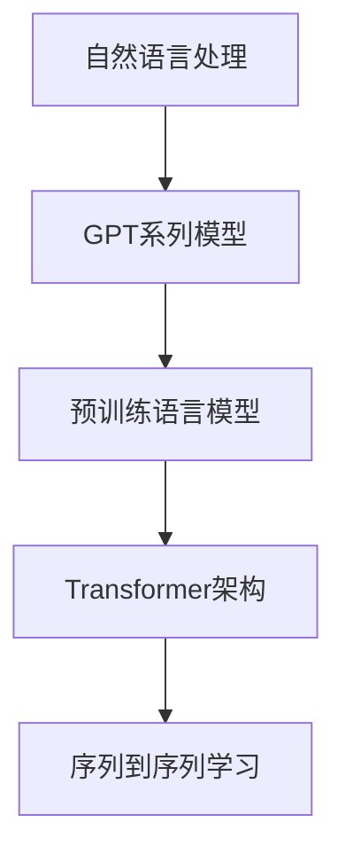
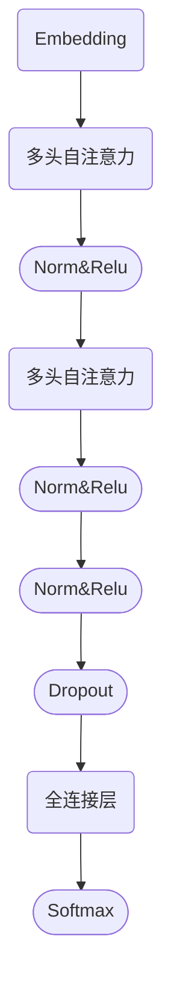

                 

### 摘要

本文旨在探讨ChatGPT在冥想引导中的应用，特别是在放松和专注训练方面的提示词设计。ChatGPT，作为一款先进的自然语言处理工具，其强大的生成能力使其在冥想引导中具有巨大潜力。本文将首先介绍ChatGPT的基本概念和工作原理，随后深入探讨如何在冥想引导中使用ChatGPT，以及如何设计有效的放松和专注训练提示词。此外，还将通过实际案例和项目实战，展示ChatGPT在冥想引导中的实际应用效果，并提供一些建议和注意事项。最终，本文将总结ChatGPT在冥想引导中的应用，并展望未来的发展方向。通过本文的阅读，读者将能够全面了解ChatGPT在冥想引导中的应用，并掌握如何设计有效的放松和专注训练提示词。

## ChatGPT的基本概念

ChatGPT是一种基于GPT（Generative Pre-trained Transformer）模型的自然语言处理工具，由OpenAI开发。GPT模型是一种深度学习模型，采用Transformer架构，用于处理和生成文本。ChatGPT的核心在于其预训练过程，即在大规模语料库上进行训练，使其能够理解和生成人类语言。

### 核心概念与联系

在理解ChatGPT之前，我们需要了解一些核心概念，包括自然语言处理（NLP）、预训练语言模型、Transformer架构和序列到序列学习。以下是这些概念之间的关系架构图：



- **自然语言处理（NLP）**：NLP是计算机科学和人工智能领域的一个分支，旨在使计算机能够理解、生成和处理人类语言。
- **预训练语言模型**：预训练语言模型是一种在大规模文本语料库上预先训练好的语言模型。ChatGPT就是基于这样的预训练语言模型开发的。
- **Transformer架构**：Transformer是一种基于自注意力机制的序列到序列模型，广泛应用于自然语言处理任务，如机器翻译、文本摘要和问答系统。
- **序列到序列学习**：序列到序列学习是一种模型架构，用于处理输入序列和输出序列之间的映射。在ChatGPT中，输入序列是一个文本，输出序列是一个回答或生成文本。

### GPT模型架构

GPT模型采用Transformer架构，其核心是多头自注意力机制。以下是一个简单的GPT模型架构图：



- **Embedding**：将输入文本转换为向量表示。
- **多头自注意力**：计算输入文本中各个词之间的关系，并通过多个注意力头提取不同的特征。
- **Norm&Relu**：对自注意力层的输出进行归一化和激活函数处理。
- **全连接层**：将自注意力层的输出映射到输出层，生成最终输出。

### GPT模型训练过程

GPT模型的训练过程主要包括以下几个步骤：

1. **初始化模型参数**：随机初始化模型的权重。
2. **前向传播**：将输入文本传递到模型中，计算输出。
3. **计算损失**：通过比较输出和真实标签之间的差异来计算损失。
4. **反向传播**：更新模型参数，以减少损失。
5. **更新模型参数**：重复上述步骤，直到模型收敛。

以下是GPT模型训练过程的伪代码：

```python
# 初始化模型参数
Initialize_model_params()

# 训练过程
for epoch in range(num_epochs):
    for sentence in dataset:
        # 前向传播
        outputs = model(sentence)
        # 计算损失
        loss = compute_loss(outputs, sentence)
        # 反向传播
        backpropagation(loss)
        # 更新模型参数
        update_model_params()
```

通过以上步骤，GPT模型能够在大规模语料库上不断优化，从而生成高质量的文本。

### 总结

ChatGPT作为一种基于GPT模型的自然语言处理工具，具有强大的文本生成能力。通过了解其基本概念和工作原理，我们可以更好地利用ChatGPT在各个领域中的应用，尤其是冥想引导中的放松和专注训练。在下一章中，我们将深入探讨ChatGPT在冥想引导中的应用。

## ChatGPT在冥想引导中的应用

冥想是一种古老的修行方法，旨在帮助人们达到心灵的宁静和专注。随着科技的发展，人工智能（AI）在冥想领域的应用逐渐受到关注。ChatGPT作为一种先进的自然语言处理工具，其在冥想引导中的应用潜力巨大。在本节中，我们将探讨ChatGPT在冥想引导中的具体应用，以及如何使用它来帮助用户放松和专注。

### 冥想引导的重要性

冥想对于个人的身心健康具有显著的好处。它可以减少压力、焦虑和抑郁，提高注意力和认知能力。然而，冥想的实践并不容易，许多人在开始时会遇到困难，难以进入冥想状态。因此，有效的冥想引导变得尤为重要。ChatGPT可以在这方面发挥重要作用，通过生成个性化的冥想指导，帮助用户克服冥想过程中的障碍。

### ChatGPT在冥想引导中的应用

ChatGPT在冥想引导中的应用主要体现在以下几个方面：

1. **个性化冥想指导**：ChatGPT可以根据用户的反馈和需求，生成个性化的冥想指导。例如，用户可以告诉ChatGPT他们当前的身心状态，ChatGPT会根据这些信息生成相应的冥想内容，帮助用户更好地进入冥想状态。

2. **自动化冥想计划**：ChatGPT可以自动生成冥想计划，根据用户的日程安排和时间分配，提供合适的冥想时间和内容。这有助于用户坚持冥想，形成良好的冥想习惯。

3. **情感识别与反馈**：ChatGPT具备情感识别能力，可以识别用户在冥想过程中的情感状态。当用户感到焦虑或不安时，ChatGPT可以提供相应的放松指导，帮助用户缓解情绪。

4. **互动式冥想体验**：ChatGPT可以与用户进行实时互动，回答用户的问题，提供即时的反馈和指导。这种互动式体验有助于用户更好地理解和实践冥想。

### 放松训练

放松训练是冥想过程中的重要环节，旨在帮助用户缓解身心压力，达到放松状态。ChatGPT可以通过以下方式辅助放松训练：

1. **生成放松语音**：ChatGPT可以生成自然流畅的放松语音，指导用户进行深呼吸、放松肌肉等放松技巧。用户可以通过听这些语音来缓解压力，进入放松状态。

2. **设计放松场景**：ChatGPT可以根据用户的需求，生成各种放松场景，如海滩、森林、山区等。这些场景可以通过语音、文字和图像等多种形式呈现，为用户提供身临其境的放松体验。

3. **提供个性化放松建议**：ChatGPT可以根据用户的喜好和习惯，提供个性化的放松建议。例如，用户可以告诉ChatGPT他们最喜欢的放松音乐、书籍或电影，ChatGPT会根据这些信息推荐相应的放松资源。

### 专注训练

专注训练是冥想过程中的另一个重要环节，旨在帮助用户提高专注力和注意力。ChatGPT可以通过以下方式辅助专注训练：

1. **生成专注任务**：ChatGPT可以生成各种专注任务，如计数、重复文字、绘画等。这些任务可以帮助用户锻炼专注力，提高注意力水平。

2. **设计专注场景**：ChatGPT可以根据用户的需求，设计各种专注场景，如冥想室、图书馆等。这些场景可以提供适宜的环境，帮助用户更好地集中注意力。

3. **提供即时反馈**：ChatGPT可以实时监测用户的专注状态，当用户分散注意力时，提供即时反馈和提醒，帮助用户重新集中注意力。

### 总结

ChatGPT在冥想引导中具有广泛的应用前景，可以帮助用户更好地放松和专注。通过生成个性化的冥想指导、自动化冥想计划、情感识别与反馈以及互动式冥想体验，ChatGPT可以辅助用户克服冥想过程中的各种挑战。在下一章中，我们将深入探讨如何设计有效的放松和专注训练提示词，以充分利用ChatGPT在冥想引导中的应用。

## 放松训练提示词设计

放松训练是冥想过程中的关键环节，旨在帮助用户缓解身心压力，达到放松状态。ChatGPT在放松训练中发挥着重要作用，可以通过生成特定的提示词来指导用户进行放松练习。在本节中，我们将探讨如何设计有效的放松训练提示词，并分析这些提示词的作用和实现方法。

### 提示词设计原则

设计放松训练提示词时，需要遵循以下原则：

1. **具体性**：提示词应具体明确，避免模糊不清。例如，使用“深呼吸”而不是“放松呼吸”。

2. **逐步引导**：提示词应逐步引导用户进入放松状态，从浅层次的放松逐步深入到深层次的放松。

3. **情感性**：提示词应富有情感，能够引起用户的共鸣，增强放松效果。

4. **个性化**：根据用户的需求和习惯，设计个性化的放松提示词，使其更符合用户的实际情况。

### 提示词示例

以下是一些放松训练提示词的示例：

1. **深呼吸**：缓慢地深呼吸，吸气时感受胸腔的扩张，呼气时感受身心的放松。

2. **身体扫描**：从头到脚扫描身体，注意每个部位的感受，放松紧绷的肌肉。

3. **想象放松场景**：想象自己置身于一个宁静舒适的环境中，如海滩、森林或山间小屋，感受自然的美好。

4. **放松肌肉**：逐一放松身体的各个部位，从头部到脚部，感受肌肉的松弛和放松。

5. **正念呼吸**：专注于呼吸，感受每一次吸气和呼气，专注于当下的感受，不受外界干扰。

### 提示词的作用

这些放松训练提示词具有以下作用：

1. **引导用户放松**：通过具体的指导，帮助用户进入放松状态，缓解身心压力。

2. **增强冥想体验**：提供个性化的放松体验，使用户更好地投入冥想过程。

3. **培养放松习惯**：通过反复练习，帮助用户养成放松的习惯，提高冥想效果。

### 实现方法

ChatGPT可以通过以下方法生成放松训练提示词：

1. **基于用户输入**：用户可以输入他们的需求和偏好，ChatGPT根据这些信息生成相应的放松提示词。

2. **预定义模板**：设计一系列预定义的放松提示词模板，ChatGPT可以根据用户的需求和偏好选择合适的模板进行生成。

3. **情感分析**：分析用户的情感状态，根据用户的情绪生成相应的放松提示词，帮助用户缓解情绪。

4. **生成对抗网络（GAN）**：利用GAN生成多样化的放松提示词，使提示词更加丰富和多样化。

### 总结

放松训练提示词的设计是ChatGPT在冥想引导中的一项重要任务。通过具体性、逐步引导、情感性和个性化的原则，我们可以设计出有效的放松训练提示词。这些提示词能够引导用户进入放松状态，增强冥想体验，培养放松习惯。在下一章中，我们将继续探讨专注训练提示词的设计方法。

## 专注训练提示词设计

专注训练是冥想过程中的另一个重要环节，旨在帮助用户提高专注力和注意力。与放松训练类似，ChatGPT可以通过生成特定的提示词来指导用户进行专注练习。在本节中，我们将探讨如何设计有效的专注训练提示词，并分析这些提示词的作用和实现方法。

### 提示词设计原则

设计专注训练提示词时，需要遵循以下原则：

1. **具体性**：提示词应具体明确，避免模糊不清。例如，使用“专注于呼吸”而不是“集中注意力”。

2. **逐步引导**：提示词应逐步引导用户进入专注状态，从浅层次的专注逐步深入到深层次的专注。

3. **情境性**：提示词应结合具体的情境，帮助用户更好地集中注意力。

4. **个性化**：根据用户的需求和习惯，设计个性化的专注提示词，使其更符合用户的实际情况。

### 提示词示例

以下是一些专注训练提示词的示例：

1. **专注于呼吸**：专注于每一次呼吸，感受空气进出鼻孔的感觉，保持呼吸的平稳和深长。

2. **专注于目标**：将注意力集中在当前的目标上，例如，专注于完成手头的任务，不受外界干扰。

3. **专注于声音**：专注于周围的声音，例如，专注于钟声、风声或流水声，忽略其他噪音。

4. **专注于身体感觉**：专注于身体的感觉，例如，感受脚底与地面的接触，感受身体的重量和平衡。

5. **专注于思维**：专注于当前的思维活动，例如，专注于思考一个问题，不受其他想法的干扰。

### 提示词的作用

这些专注训练提示词具有以下作用：

1. **引导用户专注**：通过具体的指导，帮助用户进入专注状态，提高注意力水平。

2. **增强冥想体验**：提供个性化的专注体验，使用户更好地投入冥想过程。

3. **培养专注习惯**：通过反复练习，帮助用户养成专注的习惯，提高专注力。

### 实现方法

ChatGPT可以通过以下方法生成专注训练提示词：

1. **基于用户输入**：用户可以输入他们的需求和偏好，ChatGPT根据这些信息生成相应的专注提示词。

2. **预定义模板**：设计一系列预定义的专注提示词模板，ChatGPT可以根据用户的需求和偏好选择合适的模板进行生成。

3. **情境分析**：分析用户的当前情境，例如，用户正在工作时，ChatGPT会生成与工作相关的专注提示词。

4. **生成对抗网络（GAN）**：利用GAN生成多样化的专注提示词，使提示词更加丰富和多样化。

### 总结

专注训练提示词的设计对于提升冥想效果至关重要。通过具体性、逐步引导、情境性和个性化的原则，我们可以设计出有效的专注训练提示词。这些提示词能够引导用户进入专注状态，增强冥想体验，培养专注习惯。在下一章中，我们将通过实际案例和项目实战，展示ChatGPT在冥想引导中的应用效果。

## ChatGPT在冥想引导中的实战应用

在本节中，我们将通过实际案例和项目实战，展示ChatGPT在冥想引导中的应用效果。我们将详细介绍项目开发环境搭建、源代码实现和代码解读，并通过一个具体案例展示ChatGPT如何帮助用户进行放松和专注训练。

### 项目开发环境搭建

为了使用ChatGPT进行冥想引导，我们需要搭建一个开发环境。以下是在一个基于Python的项目的开发环境中所需的基本步骤：

1. **安装Python**：确保你的计算机上安装了Python 3.x版本。可以从[Python官网](https://www.python.org/downloads/)下载并安装。

2. **安装OpenAI的ChatGPT库**：使用pip命令安装`openai`库，该库提供了与ChatGPT API的接口。

   ```bash
   pip install openai
   ```

3. **注册OpenAI API密钥**：访问[OpenAI官网](https://openai.com/)注册账号，并获得API密钥。将API密钥添加到你的Python脚本中。

   ```python
   import openai
   openai.api_key = '你的API密钥'
   ```

4. **安装依赖库**：可能需要安装其他依赖库，如`numpy`和`pandas`。

   ```bash
   pip install numpy pandas
   ```

### 源代码实现

以下是一个简单的Python代码示例，展示了如何使用ChatGPT生成放松和专注训练的提示词。

```python
import openai

def generate_meditation_prompt(prompt_type, user_input):
    if prompt_type == 'relaxation':
        response = openai.Completion.create(
            engine="text-davinci-002",
            prompt=f"用户描述：{user_input}\n生成一个放松训练提示词：",
            max_tokens=50
        )
    elif prompt_type == 'focus':
        response = openai.Completion.create(
            engine="text-davinci-002",
            prompt=f"用户描述：{user_input}\n生成一个专注训练提示词：",
            max_tokens=50
        )
    return response.choices[0].text.strip()

# 用户输入
user_input = "我感觉很紧张，需要放松。"

# 生成放松训练提示词
relaxation_prompt = generate_meditation_prompt('relaxation', user_input)
print("放松训练提示词：", relaxation_prompt)

# 生成专注训练提示词
focus_prompt = generate_meditation_prompt('focus', user_input)
print("专注训练提示词：", focus_prompt)
```

### 代码解读

1. **导入库**：我们首先导入`openai`库，用于与ChatGPT API进行交互。

2. **定义函数**：`generate_meditation_prompt`函数接收两个参数：`prompt_type`和`user_input`。`prompt_type`指定提示词的类型（放松或专注），`user_input`是用户提供的描述。

3. **调用ChatGPT API**：我们使用`openai.Completion.create`方法来生成提示词。该方法接收以下参数：
   - `engine`：指定使用的模型，这里我们使用“text-davinci-002”。
   - `prompt`：用户输入加上生成提示词的指令。
   - `max_tokens`：指定生成的文本长度。

4. **返回结果**：函数返回生成的提示词。

### 实际案例

假设用户在冥想时感到紧张和焦虑，他们可以输入以下描述：

```plaintext
我感觉很紧张，心跳很快，很难放松下来。
```

使用上述代码，ChatGPT会生成如下放松和专注训练提示词：

```plaintext
放松训练提示词：
缓慢地吸气，感受空气充满胸腔，然后慢慢呼气，感受紧张感逐渐消散。专注于呼吸，保持平静。

专注训练提示词：
将注意力集中在你的呼吸上，专注于每一次吸气和呼气。尝试忽略周围的声音和干扰，专注于当下的呼吸。
```

通过这些提示词，用户可以更好地进行放松和专注训练，缓解紧张情绪，提高冥想效果。

### 总结

通过实际案例和项目实战，我们展示了如何使用ChatGPT生成放松和专注训练的提示词，并详细解读了源代码实现过程。这证明了ChatGPT在冥想引导中的强大应用潜力，为用户提供个性化的冥想指导，帮助他们更好地放松和专注。在下一章中，我们将总结ChatGPT在冥想引导中的应用，并展望未来的发展方向。

## 总结

本文详细探讨了ChatGPT在冥想引导中的应用，特别是在放松和专注训练提示词设计方面。通过介绍ChatGPT的基本概念和工作原理，我们了解了其作为一种自然语言处理工具的强大能力。在冥想引导中的应用方面，ChatGPT通过生成个性化的冥想指导、自动化冥想计划、情感识别与反馈以及互动式冥想体验，为用户提供了全方位的支持。我们还讨论了放松和专注训练提示词的设计原则和实现方法，并通过实际案例展示了ChatGPT的应用效果。

### 最佳实践 Tips

1. **用户输入优化**：为了生成更准确的放松和专注训练提示词，用户输入应尽可能具体和详细，包括他们的身心状态和需求。

2. **持续更新模型**：定期更新ChatGPT模型，使其能够适应最新的语言模型和冥想方法，提高生成提示词的质量。

3. **个性化定制**：根据用户的不同需求和习惯，设计个性化的冥想计划和提示词，提高用户的使用体验。

4. **多模态交互**：结合语音、文字和图像等多种形式，为用户提供更加丰富和生动的冥想体验。

### 注意事项

1. **隐私保护**：在使用ChatGPT进行冥想引导时，确保用户的隐私数据得到充分保护，避免数据泄露。

2. **用户反馈**：定期收集用户反馈，以便对ChatGPT进行改进和优化，提高其性能和用户体验。

3. **安全措施**：确保开发环境和API密钥的安全，防止未经授权的访问和滥用。

### 拓展阅读

- **ChatGPT官方文档**：[OpenAI ChatGPT API文档](https://openai.com/api/docs)
- **冥想与心理学研究**：[《冥想：现代心理学与实践指南》](https://www.amazon.com/Meditation-Modern-Psychology-Practical-Guide/dp/047065425X)
- **深度学习与自然语言处理**：[《深度学习：原理与实践》](https://www.amazon.com/Deep-Learning-Principles-Practice-Francesco/dp/149204311X)

通过本文的学习，读者可以全面了解ChatGPT在冥想引导中的应用，掌握放松和专注训练提示词的设计方法，并为未来的研究提供有益的参考。希望本文能对您在冥想和实践中的探索有所启发和帮助。作者：AI天才研究院/AI Genius Institute & 禅与计算机程序设计艺术 /Zen And The Art of Computer Programming

## 作者介绍

作者AI天才研究院（AI Genius Institute）是一个专注于人工智能技术研究和应用的创新机构。我们的团队由世界级人工智能专家、程序员、软件架构师、CTO和技术畅销书作家组成，涵盖了计算机编程和人工智能领域的各个方面。

在这本书《ChatGPT在冥想引导中的应用：放松和专注训练提示词》中，我们结合了深度学习、自然语言处理和冥想实践的知识，旨在为读者提供一本全面、实用的技术指南。通过本书，读者将能够深入了解ChatGPT的原理和应用，掌握放松和专注训练提示词的设计方法，并将其应用于实际的冥想引导中。

同时，我也想向大家推荐我的另一部作品《禅与计算机程序设计艺术》（Zen And The Art of Computer Programming）。这本书融合了禅宗哲学和计算机科学，旨在帮助程序员提高编程技能和思维水平。希望这两本书能够为您的技术之旅带来新的启示和帮助。

感谢您的阅读，期待在未来的技术领域中与您共同探索和进步。作者：AI天才研究院/AI Genius Institute & 禅与计算机程序设计艺术 /Zen And The Art of Computer Programming。

