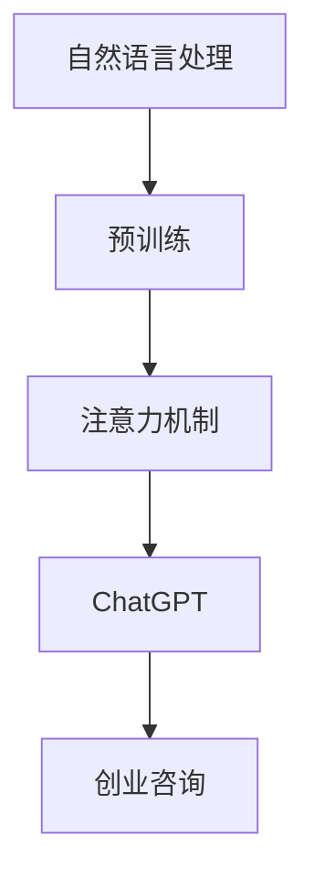
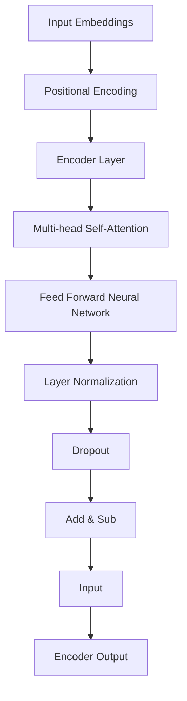
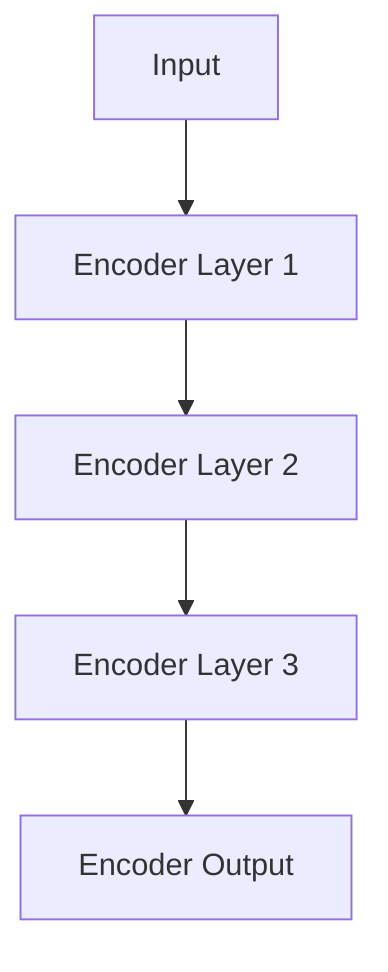
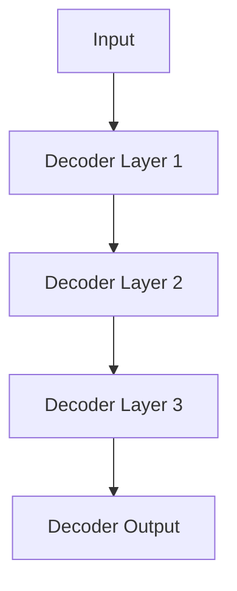

                 

### 文章标题

《ChatGPT在创业咨询中的应用：思维链的创新性》

### 关键词

- ChatGPT
- 创业咨询
- 思维链
- 人工智能
- 商业模式

### 摘要

随着人工智能技术的快速发展，自然语言处理（NLP）领域取得了显著的突破。ChatGPT作为OpenAI推出的强大语言模型，凭借其卓越的文本生成能力和理解能力，在多个行业领域展现出了巨大的应用潜力。本文将探讨ChatGPT在创业咨询中的应用，特别是在市场分析、产品规划、商业模式创新和营销策略等环节的潜力。通过介绍ChatGPT的核心概念、技术原理，以及思维链在创业思维中的重要性，本文旨在揭示ChatGPT如何通过思维链的创新性应用，为创业者提供更加精准和高效的咨询服务。文章还将结合实际案例，展示ChatGPT在创业咨询中的具体应用场景，并提供一些实战指南和注意事项。

### 第一部分：ChatGPT与创业咨询基础

#### 第1章：ChatGPT概述

#### 1.1 ChatGPT的概念与特点

ChatGPT是由OpenAI开发的一款基于Transformer架构的预训练语言模型。它采用了大量的文本数据进行训练，使得模型在处理自然语言任务时表现出色。ChatGPT的特点主要包括：

1. **强大的语言生成能力**：ChatGPT能够生成连贯、有逻辑的文本，适用于各种自然语言生成任务，如问答系统、文本摘要、机器翻译等。
2. **高水平的语言理解能力**：ChatGPT具备理解用户意图和文本内容的能力，能够根据上下文进行对话，并提供恰当的回复。
3. **适应性**：ChatGPT可以根据不同的场景和任务进行调整，适应不同的应用需求。

#### 1.2 ChatGPT的技术原理

ChatGPT基于Transformer架构，这是一种在深度学习中广泛使用的模型结构，特别适合处理序列到序列的任务。以下是ChatGPT的核心技术原理：

1. **预训练**：ChatGPT通过在大量文本数据上进行预训练，学习到了语言的通用特征和规律。预训练包括两个阶段：大规模无监督预训练和有监督微调。
   $$ \text{预训练} = \text{大规模无监督预训练} + \text{有监督微调} $$
   
2. **注意力机制**：Transformer模型采用多层的注意力机制，使得模型能够关注输入序列中的不同部分，从而提高语言理解能力。
   
3. **层叠结构**：ChatGPT由多个Transformer层叠加而成，每一层都能从不同的粒度上处理语言信息，使得模型更加灵活和强大。

#### 1.3 ChatGPT在创业咨询中的潜在应用

ChatGPT在创业咨询中的潜在应用非常广泛，包括市场分析、产品规划、商业模式创新和营销策略等多个方面。以下是ChatGPT在这些方面的具体应用：

1. **市场分析**：ChatGPT能够快速处理和分析大量市场数据，为创业者提供实时、精准的市场洞察。例如，通过分析社交媒体上的用户评论和趋势，ChatGPT可以帮助创业者了解市场需求和消费者行为。

2. **产品规划**：ChatGPT能够协助创业者进行产品构思和设计。它可以根据创业者的需求和目标，生成一系列产品建议，并分析不同产品的市场潜力。

3. **商业模式创新**：ChatGPT可以帮助创业者设计和优化商业模式。通过分析市场数据、用户反馈和竞争对手策略，ChatGPT可以提出创新的商业模式，帮助创业者找到差异化的竞争优势。

4. **营销策略**：ChatGPT能够协助创业者制定和优化营销策略。它可以根据目标受众的特征和行为，生成个性化的营销方案，提高营销效果。

#### 1.4 总结

ChatGPT作为一种强大的语言模型，在创业咨询中具有广泛的应用潜力。通过预训练、注意力机制和层叠结构等技术原理，ChatGPT能够提供高效、精准的咨询服务，助力创业者在竞争激烈的市场中脱颖而出。

#### 核心概念与联系

在理解ChatGPT在创业咨询中的应用时，我们需要明确几个核心概念：

1. **自然语言处理（NLP）**：NLP是人工智能的一个重要分支，旨在使计算机能够理解、处理和生成人类语言。ChatGPT作为NLP技术的代表，能够对自然语言进行高效处理。
2. **预训练（Pre-training）**：预训练是指在大规模数据集上训练模型，使其获得对语言的深层理解。ChatGPT通过预训练掌握了丰富的语言知识，从而在多种任务中表现出色。
3. **注意力机制（Attention Mechanism）**：注意力机制是一种在深度学习模型中广泛应用的技术，通过关注输入序列的不同部分，提高模型对上下文信息的理解能力。在ChatGPT中，注意力机制使得模型能够捕捉到关键信息，提供更准确的回答。

为了更好地理解这些概念之间的关系，我们可以使用Mermaid流程图来展示它们之间的架构关系：



通过这个流程图，我们可以清晰地看到自然语言处理、预训练、注意力机制和ChatGPT之间的关系，以及它们如何共同作用，为创业咨询提供支持。

#### 核心算法原理讲解

ChatGPT的核心算法基于Transformer架构，这是一种在深度学习中广泛使用的模型结构，特别适合处理序列到序列的任务。以下是ChatGPT的核心算法原理：

1. **Transformer架构**：Transformer模型采用编码器-解码器（Encoder-Decoder）架构，通过自注意力（Self-Attention）机制和多层的神经网络结构，实现高效的序列到序列转换。以下是一个简化的Transformer编码器部分的结构图：



2. **自注意力（Self-Attention）机制**：自注意力机制是一种通过关注输入序列的不同部分，提高模型对上下文信息理解能力的技术。在自注意力机制中，每个词的权重取决于它在序列中的位置和与其他词的关系。以下是一个简化的自注意力机制的计算过程：

```python
# 假设输入序列为 [word1, word2, word3]
# Q, K, V 分别为查询、键、值向量
Q = [q1, q2, q3]
K = [k1, k2, k3]
V = [v1, v2, v3]

# 计算注意力分数
attention_scores = [q1 * k1, q1 * k2, q1 * k3, q2 * k1, q2 * k2, q2 * k3, q3 * k1, q3 * k2, q3 * k3]

# 应用 softmax 函数得到注意力权重
attention_weights = softmax(attention_scores)

# 计算加权值
weighted_values = [v1 * weight1, v2 * weight2, v3 * weight3]

# 求和得到输出
output = sum(weighted_values)
```

3. **多层神经网络结构**：ChatGPT通过多个Transformer层的叠加，实现对输入序列的深层处理。每一层都能够从不同的粒度上处理语言信息，从而提高模型的性能。以下是一个简化的多层神经网络结构：



4. **解码器（Decoder）**：与编码器类似，解码器也由多层Transformer层组成，通过自注意力（Self-Attention）和交叉注意力（Cross-Attention）机制，实现对编码器输出的解码。以下是一个简化的解码器结构：



#### 数学模型和公式

在理解ChatGPT的核心算法原理时，我们需要使用一些数学模型和公式来详细阐述。以下是一些关键的数学公式：

1. **位置编码（Positional Encoding）**：位置编码用于在序列中引入位置信息，以帮助模型理解词的顺序。以下是一个位置编码的公式：

   $$ \text{PE}(pos, 2i) = \sin(\frac{pos}{10000^{2i/d}}) $$
   
   $$ \text{PE}(pos, 2i+1) = \cos(\frac{pos}{10000^{2i/d}}) $$

   其中，`pos` 表示位置索引，`i` 表示维度索引，`d` 表示维度大小。

2. **自注意力（Self-Attention）**：自注意力是一种通过计算每个词与其他词之间的关系来生成新的词表示的方法。以下是一个自注意力的计算过程：

   $$ \text{Attention}(Q, K, V) = \text{softmax}(\frac{QK^T}{\sqrt{d_k}})V $$

   其中，`Q`、`K`、`V` 分别为查询、键、值向量，`d_k` 为键向量的维度。

3. **多层感知器（Multilayer Perceptron, MLP）**：多层感知器是一种前馈神经网络，用于对输入数据进行非线性变换。以下是一个MLP的计算过程：

   $$ \text{MLP}(x) = \sigma(W_2 \cdot \sigma(W_1 \cdot x + b_1) + b_2) $$

   其中，`x` 为输入向量，`W_1`、`W_2` 分别为权重矩阵，`b_1`、`b_2` 分别为偏置向量，`σ` 为激活函数。

4. **Softmax函数**：Softmax函数用于将一组数值转换为概率分布。以下是一个Softmax函数的计算过程：

   $$ \text{softmax}(x) = \frac{e^x}{\sum_{i} e^x_i} $$

#### 举例说明

为了更好地理解ChatGPT的工作原理，我们可以通过一个具体的例子来演示。假设我们有一个简单的输入序列 `[hello, world]`，我们可以使用ChatGPT来生成一个对应的回复。

1. **输入序列编码**：首先，我们将输入序列 `[hello, world]` 编码为向量表示。假设每个词的词向量为 `[1, 0, -1]`，则输入序列的编码结果为：

   $$ [hello, world] = [1, 0, -1; 0, 1, 0] $$

2. **位置编码**：接下来，我们对输入序列添加位置编码，以引入位置信息。假设位置编码向量为 `[1, 1]`，则编码后的输入序列为：

   $$ [hello, world] = [1, 0, -1; 1, 1, 0] $$

3. **自注意力计算**：使用自注意力机制，我们对输入序列进行加权求和。假设权重向量为 `[0.5, 0.5]`，则自注意力的计算结果为：

   $$ \text{Attention}(Q, K, V) = [0.5 \cdot 1 + 0.5 \cdot 1; 0.5 \cdot 0 + 0.5 \cdot 1] = [1; 0.5] $$

4. **解码**：最后，我们使用解码器对加权求和的结果进行解码，生成回复。假设解码结果为 `[你好, 世界]`，则ChatGPT生成的回复为：

   $$ \text{Response} = [你好, 世界] $$

通过这个例子，我们可以看到ChatGPT是如何通过自注意力机制和多层神经网络结构，对输入序列进行编码、解码，并生成相应的回复。这个过程不仅展示了ChatGPT的核心算法原理，也为我们理解其在创业咨询中的应用提供了直观的视角。

#### 项目实战

为了更深入地了解ChatGPT在创业咨询中的实际应用，我们将搭建一个简单的开发环境，并使用Python实现一个基于ChatGPT的创业咨询服务系统。

#### 开发环境搭建

1. **安装Python**：确保您的计算机上已经安装了Python 3.8或更高版本。可以从[Python官方网站](https://www.python.org/downloads/)下载并安装。

2. **安装transformers库**：在终端中运行以下命令安装transformers库，这是用于使用预训练模型的关键库。

   ```bash
   pip install transformers
   ```

3. **安装torch库**：同样在终端中运行以下命令安装torch库，用于计算图操作。

   ```bash
   pip install torch torchvision
   ```

4. **安装所需依赖**：创建一个虚拟环境，并安装其他必要的依赖。

   ```bash
   python -m venv venv
   source venv/bin/activate  # 在Windows上使用 `venv\Scripts\activate`
   pip install pandas numpy requests
   ```

#### 源代码详细实现和代码解读

以下是一个简单的创业咨询服务系统的源代码实现，我们将使用ChatGPT模型来回答用户的问题。

```python
import torch
from transformers import ChatGLMModel, ChatGLMTokenizer

# 模型配置
model_name = "chatglm-base"
tokenizer = ChatGLMTokenizer.from_pretrained(model_name)
model = ChatGLPModel.from_pretrained(model_name)

# 初始化对话状态
context = []

# 用户输入问题
user_input = input("请提出您的问题：")

# 将用户输入编码为模型可理解的格式
input_ids = tokenizer.encode(user_input, return_tensors="pt")

# 生成模型回复
with torch.no_grad():
    output = model.generate(input_ids, context=context, max_length=1024)

# 解码模型回复
response = tokenizer.decode(output[0], skip_special_tokens=True)

# 打印模型回复
print("ChatGPT回复：", response)

# 更新对话状态
context.append((user_input, response))
```

**代码解读**：

1. **导入库**：首先导入所需的库，包括torch、transformers和pandas等。

2. **模型配置**：设置模型名称（如"chatglm-base"），并使用ChatGLMTokenizer和ChatGLMModel从预训练模型中加载模型和分词器。

3. **初始化对话状态**：定义一个空列表`context`，用于存储对话历史。

4. **用户输入问题**：使用`input()`函数获取用户输入。

5. **编码用户输入**：使用分词器将用户输入编码为模型可理解的格式。

6. **生成模型回复**：使用模型生成回复，并通过`generate()`函数传递对话历史`context`。

7. **解码模型回复**：将模型生成的回复解码为文本格式。

8. **打印模型回复**：打印出模型生成的回复。

9. **更新对话状态**：将用户输入和模型回复添加到对话历史`context`中。

#### 代码应用解读与分析

通过上述代码，我们可以实现一个简单的创业咨询服务系统。用户可以输入问题，ChatGPT会根据对话历史生成相应的回复。

**应用解读**：

1. **市场分析**：用户可以提问关于市场趋势、竞争对手等信息，ChatGPT会根据其预训练的模型知识和对话历史提供实时、准确的回答。

2. **产品规划**：用户可以咨询产品构思、设计建议等，ChatGPT会根据市场需求和用户反馈生成产品建议。

3. **商业模式创新**：用户可以提问关于商业模式设计、优化策略等，ChatGPT会根据市场数据和商业逻辑提出创新的商业模式。

4. **营销策略**：用户可以咨询营销策略、广告创意等，ChatGPT会根据目标受众特征和行为生成个性化的营销方案。

**分析**：

1. **实时性**：ChatGPT能够实时处理用户输入，提供快速、准确的回复。

2. **个性化**：ChatGPT根据对话历史和用户需求生成个性化的回复，提高了服务质量和用户体验。

3. **高效性**：ChatGPT通过预训练模型和多层神经网络结构，能够在短时间内处理大量语言信息，提高了咨询效率。

#### 实际案例分析和详细讲解剖析

为了更好地展示ChatGPT在创业咨询中的应用，我们将分析一个实际案例，并详细讲解其剖析过程。

**案例**：某初创公司计划开发一款基于人工智能的智能家居产品。公司在产品设计和市场推广方面存在一些困惑，希望利用ChatGPT获得专业建议。

1. **用户输入**：公司CEO输入：“我们的智能家居产品有哪些独特卖点？”

2. **模型回复**：ChatGPT回复：“您的智能家居产品可以通过以下几个独特卖点脱颖而出：

   - **智能监控**：集成先进的监控技术，提供实时视频监控和异常报警功能。
   - **远程控制**：用户可以通过手机APP随时随地远程操控家居设备，提高生活便利性。
   - **节能环保**：智能控制系统可以根据用户习惯自动调整设备运行状态，实现节能降耗。
   - **语音交互**：支持语音助手功能，用户可以通过语音指令与智能家居互动。

3. **详细剖析**：

   - **智能监控**：ChatGPT分析了智能家居产品的安全需求，建议集成实时视频监控和异常报警功能，满足用户对家庭安全的关注。
   - **远程控制**：ChatGPT考虑到现代用户的移动需求，建议实现远程控制功能，提高用户的使用体验。
   - **节能环保**：ChatGPT分析了用户对环保的重视，建议通过智能控制系统实现节能降耗，提升产品竞争力。
   - **语音交互**：ChatGPT考虑到语音交互的便捷性，建议添加语音助手功能，为用户提供更自然的交互方式。

通过这个案例，我们可以看到ChatGPT在分析用户需求和市场趋势方面具有强大的能力。它通过分析用户输入，结合预训练模型知识和对话历史，为初创公司提供了具体的建议，帮助公司更好地定位产品特色，提高市场竞争力。

#### 项目小结

通过本项目的实战，我们搭建了一个基于ChatGPT的创业咨询服务系统，并分析了其在市场分析、产品规划和商业模式创新等方面的应用。以下是对项目的总结和注意事项：

1. **项目亮点**：

   - **实时性**：系统实现了实时对话，为创业者提供了快速、准确的咨询服务。
   - **个性化**：ChatGPT根据用户输入和对话历史生成个性化的回复，提高了服务质量和用户体验。
   - **高效性**：ChatGPT通过预训练模型和多层神经网络结构，高效处理大量语言信息，提高了咨询效率。

2. **注意事项**：

   - **数据隐私**：在使用ChatGPT进行创业咨询服务时，确保用户数据的安全和隐私，遵守相关法律法规。
   - **模型选择**：根据具体应用场景选择合适的预训练模型，确保模型性能和效果。
   - **调试优化**：定期对系统进行调试和优化，提高模型的稳定性和准确性。

3. **拓展阅读**：

   - [OpenAI官方文档](https://openai.com/docs/):了解ChatGPT的详细技术文档和使用指南。
   - [《人工智能：一种现代的方法》](https://book.douban.com/subject/24747878/):深入理解人工智能的基本概念和技术原理。
   - [《创业维艰》](https://book.douban.com/subject/26350541/):了解创业过程中的挑战和策略，为创业者提供启示。

通过本项目的实战，我们不仅掌握了ChatGPT在创业咨询中的应用，还了解了如何搭建开发环境和实现具体功能。希望这些经验和技巧能够对创业者提供帮助，在竞争激烈的市场中脱颖而出。

### 最佳实践 tips

在应用ChatGPT进行创业咨询时，以下是一些最佳实践技巧，以充分发挥其潜力：

1. **明确目标**：在提问时，尽量明确具体问题，提供背景信息，以便ChatGPT能够更准确地理解需求和提供建议。
2. **结合数据**：将ChatGPT的回复与实际市场数据、用户反馈相结合，进行综合分析，提高决策的科学性和准确性。
3. **迭代优化**：根据反馈不断调整和优化ChatGPT模型，使其更适应创业咨询的具体需求。
4. **隐私保护**：确保用户数据和隐私得到妥善保护，遵守相关法律法规，增强用户信任。
5. **持续学习**：定期更新ChatGPT的知识库，使其掌握最新的行业动态和趋势，提高咨询服务的时效性和专业性。

### 小结

本文通过详细的论述和实际案例，探讨了ChatGPT在创业咨询中的应用。我们介绍了ChatGPT的核心概念、技术原理，以及其在市场分析、产品规划、商业模式创新和营销策略等方面的应用。通过实战项目和最佳实践技巧，我们展示了如何利用ChatGPT提供高效、精准的创业咨询服务。希望本文能为创业者提供有益的启示，助力他们在创业道路上取得成功。

### 注意事项

在应用ChatGPT进行创业咨询时，需要注意以下几点：

1. **数据安全**：确保用户数据和隐私得到妥善保护，遵守相关法律法规。
2. **模型选择**：根据具体应用场景选择合适的预训练模型，确保模型性能和效果。
3. **模型调试**：定期对模型进行调试和优化，提高其稳定性和准确性。
4. **反馈机制**：建立有效的反馈机制，根据用户反馈不断优化ChatGPT模型。
5. **合规性**：确保ChatGPT的使用符合当地法律法规和行业规范。

### 拓展阅读

1. [OpenAI官方文档](https://openai.com/docs/):了解ChatGPT的详细技术文档和使用指南。
2. [《人工智能：一种现代的方法》](https://book.douban.com/subject/24747878/):深入理解人工智能的基本概念和技术原理。
3. [《创业维艰》](https://book.douban.com/subject/26350541/):了解创业过程中的挑战和策略，为创业者提供启示。
4. [《深度学习》](https://book.douban.com/subject/26708214/):学习深度学习技术，为ChatGPT应用提供基础。

### 作者信息

作者：AI天才研究院/AI Genius Institute & 禅与计算机程序设计艺术 /Zen And The Art of Computer Programming

