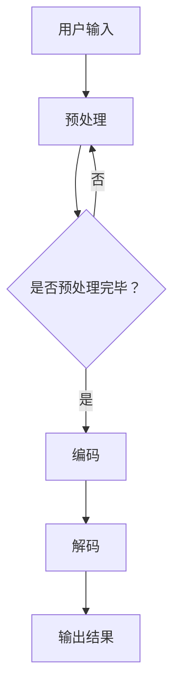

                 

# 引言

## 1.1 书籍背景与目的

随着人工智能技术的快速发展，自然语言处理（NLP）领域取得了显著的成果。其中，ChatGPT作为一种基于Transformer架构的预训练语言模型，已在多个场景中展现出了强大的应用潜力，尤其是在客户服务领域。然而，如何有效地利用ChatGPT，特别是优化提示词策略，以提升客户服务质量，仍然是一个亟待解决的问题。因此，本书旨在深入探讨ChatGPT在客户服务中的应用，重点关注提示词策略的设计与优化。

本书的主要目的是：
1. 梳理ChatGPT的发展历程、核心技术以及其在客户服务领域的应用场景。
2. 阐述提示词策略的概念、设计原则以及优化方法。
3. 通过实际项目案例，展示ChatGPT在客户服务中的应用效果，并提供可行的优化建议。

本书适用于：
- 对自然语言处理和人工智能感兴趣的读者。
- 想要在客户服务领域应用ChatGPT的技术人员。
- 想要深入了解提示词策略设计和优化的研究人员。

## 1.2 文章关键词

- ChatGPT
- 客户服务
- 提示词策略
- 自然语言处理
- Transformer
- 预训练语言模型
- 实际案例

## 1.3 文章摘要

本文首先介绍了ChatGPT的发展背景和核心技术，重点分析了其在客户服务领域的应用潜力。随后，详细阐述了提示词策略的概念和设计原则，并探讨了优化方法。为了更好地展示ChatGPT在客户服务中的应用效果，本文通过实际项目案例，详细描述了开发环境搭建、源代码实现和代码解读。最后，本文总结了项目实践经验，并提出了优化建议，为读者提供了宝贵的参考。

----------------------------------------------------------------

# 核心概念与联系

## 2.1 ChatGPT基础

### 2.1.1 ChatGPT的定义与原理

ChatGPT是由OpenAI开发的一种基于Transformer架构的预训练语言模型。它通过在大量文本数据上进行预训练，学会了理解、生成和预测自然语言。ChatGPT的核心原理是使用自注意力机制（Self-Attention），通过对输入文本的每个单词进行加权，以捕捉词与词之间的关系。这使得ChatGPT在处理复杂、长文本时表现出了出色的性能。

### 2.1.2 ChatGPT的架构

ChatGPT的架构主要包括以下几个部分：

1. **输入层**：接收用户输入的文本，将其转化为模型可以处理的向量表示。
2. **编码器**：使用多个Transformer层对输入文本进行处理，提取文本的特征信息。
3. **解码器**：在编码器的输出基础上，生成回复文本。
4. **输出层**：对解码器的输出进行分类或生成文本。


### 2.1.3 ChatGPT的工作流程

ChatGPT的工作流程如下：

1. **输入文本**：用户输入问题或需求。
2. **预处理**：对输入文本进行分词、去停用词等预处理操作。
3. **编码**：将预处理后的文本输入到编码器，提取文本特征。
4. **解码**：在编码器的输出基础上，解码器生成回复文本。
5. **输出结果**：将生成的回复文本返回给用户。

### 2.1.4 ChatGPT的优势

- **强大的语义理解能力**：ChatGPT通过预训练，可以很好地理解输入文本的语义，从而生成更准确的回复。
- **灵活的回复生成能力**：ChatGPT可以根据不同的输入文本，生成多样化的回复，满足用户的需求。
- **高效的处理速度**：Transformer架构使得ChatGPT在处理大规模文本时具有很高的效率。

## 2.2 提示词策略

### 2.2.1 提示词的定义与作用

提示词（Prompt）是指用户输入的用于引导ChatGPT生成回复的文本。提示词的质量直接影响到ChatGPT的回复效果。一个好的提示词应该能够明确地传达用户的意图，同时为ChatGPT提供足够的上下文信息。

### 2.2.2 提示词的设计原则

设计提示词时，应遵循以下原则：

1. **明确性**：提示词应明确表达用户的意图，避免歧义。
2. **完整性**：提示词应包含足够的上下文信息，帮助ChatGPT更好地理解用户需求。
3. **灵活性**：提示词应具有一定的灵活性，能够适应不同场景和用户需求。
4. **简洁性**：提示词应尽量简洁，避免冗长复杂的表述。

### 2.2.3 提示词的优化方法

为了提高ChatGPT的回复效果，可以采用以下优化方法：

1. **数据增强**：通过增加训练数据量，提高模型的泛化能力。
2. **交叉验证**：使用不同的提示词进行交叉验证，选择效果最佳的提示词。
3. **模型调整**：根据提示词效果，调整模型参数，优化模型表现。
4. **用户反馈**：收集用户反馈，不断优化提示词策略。

## 2.3 Mermaid流程图

以下是一个简单的Mermaid流程图，展示了ChatGPT的输入、处理和输出过程：



通过这个流程图，我们可以清晰地看到ChatGPT在客户服务中的应用流程。用户输入经过预处理后，进入编码器进行特征提取，然后解码器生成回复文本，最后输出结果。

----------------------------------------------------------------

# 核心算法原理讲解

## 3.1 算法概述

ChatGPT是一种基于Transformer架构的预训练语言模型。Transformer模型在处理序列数据时具有强大的能力，其核心思想是自注意力机制（Self-Attention）。ChatGPT通过在大量文本数据上进行预训练，学会了理解、生成和预测自然语言。本节将详细讲解ChatGPT的核心算法原理，包括Transformer模型、训练过程和优化方法。

## 3.2 Transformer模型

Transformer模型是一种基于自注意力机制的序列模型，最初由Vaswani等人于2017年提出。它主要由编码器（Encoder）和解码器（Decoder）两个部分组成。编码器用于将输入序列转化为固定长度的向量表示，解码器则根据编码器的输出生成目标序列。

### 3.2.1 自注意力机制

自注意力机制是Transformer模型的核心。它通过计算输入序列中每个词与所有其他词之间的相似度，为每个词分配不同的权重。这样，每个词都能根据其在序列中的位置和其他词的关系，进行加权处理。

自注意力机制的数学表示如下：

$$
\text{Attention}(Q, K, V) = \text{softmax}\left(\frac{QK^T}{\sqrt{d_k}}\right)V
$$

其中，$Q$、$K$ 和 $V$ 分别代表查询（Query）、键（Key）和值（Value）矩阵，$d_k$ 为键的维度。$\text{softmax}$ 函数用于计算每个键的重要性，然后对对应的值进行加权求和。

### 3.2.2 Encoder和Decoder结构

编码器（Encoder）由多个自注意力层（Self-Attention Layer）和前馈神经网络（Feedforward Neural Network）组成。解码器（Decoder）的结构与编码器类似，但还包括一个额外的多头注意力层（Multi-Head Attention Layer），用于从编码器的输出中获取上下文信息。

编码器和解码器的具体结构如下：

```python
class TransformerLayer(nn.Module):
    def __init__(self, d_model, d_ffn, n_heads):
        super(TransformerLayer, self).__init__()
        self.self_attn = MultiHeadAttention(d_model, n_heads)
        self.linear1 = nn.Linear(d_model, d_ffn)
        self.linear2 = nn.Linear(d_ffn, d_model)
        self.norm1 = nn.LayerNorm(d_model)
        self.norm2 = nn.LayerNorm(d_model)
        self.dropout = nn.Dropout(p=0.1)

    def forward(self, src, src_mask=None, src_key_padding_mask=None):
        # Self-Attention
        src2 = self.self_attn(src, src, src, attn_mask=src_mask,
                              key_padding_mask=src_key_padding_mask)
        src = src + self.dropout(src2)
        src = self.norm1(src)

        # Feedforward
        src2 = self.linear2(self.dropout(self.linear1(src)))
        src = src + self.dropout(src2)
        src = self.norm2(src)

        return src
```

## 3.3 训练过程

ChatGPT的训练过程主要包括两个阶段：预训练和微调。

### 3.3.1 预训练

预训练阶段，ChatGPT在大量文本数据上进行训练，学习语言的基本结构和规律。训练过程中，模型需要预测输入序列的下一个词。预训练目标通常使用掩码语言建模（Masked Language Modeling, MLM）和生成语言模型（Generative Language Modeling, GLM）等方法。

- **掩码语言建模（MLM）**：在输入序列中，随机掩码一定比例的词，模型需要预测这些被掩码的词。数学表示如下：

$$
\log P(y| x) = \log \frac{e^{f(x, y)}}{\sum_{y'} e^{f(x, y')}}
$$

其中，$x$ 表示输入序列，$y$ 表示被掩码的词，$f(x, y)$ 表示模型对输入和输出的评分。

- **生成语言模型（GLM）**：模型需要预测输入序列的下一个词。数学表示如下：

$$
P(y|x) = \frac{e^{f(x, y)}}{\sum_{y'} e^{f(x, y')}}
$$

### 3.3.2 微调

微调阶段，ChatGPT在特定领域的数据上进行训练，以适应特定任务。微调过程中，模型通常会使用基于损失函数的优化方法，如梯度下降（Gradient Descent）和Adam优化器（Adam Optimizer）。

## 3.4 优化方法

为了提高ChatGPT的性能，可以采用以下优化方法：

### 3.4.1 数据增强

数据增强是一种常用的优化方法，通过生成更多的训练数据，提高模型的泛化能力。常见的数据增强方法包括：

- **随机插入（Random Insertion）**：在输入序列中随机插入一些词或符号。
- **随机替换（Random Replacement）**：在输入序列中随机替换一些词或符号。
- **词干提取（Word Embedding）**：使用预训练的词向量对输入序列进行嵌入。

### 3.4.2 模型调整

模型调整是指根据任务需求，调整模型的参数。常见的方法包括：

- **批量调整（Batch Normalization）**：对模型参数进行批量标准化，提高模型的稳定性。
- **学习率调整（Learning Rate Schedule）**：根据训练过程，动态调整学习率。

### 3.4.3 用户反馈

用户反馈是一种有效的优化方法，通过收集用户对模型输出的反馈，不断优化模型的表现。常见的方法包括：

- **反馈修正（Feedback Correction）**：根据用户反馈，对模型输出进行修正。
- **反馈训练（Feedback Training）**：将用户反馈作为辅助数据，对模型进行训练。

## 3.5 Python源代码示例

以下是一个简单的Python代码示例，展示了如何使用Transformer模型进行文本编码和生成：

```python
import torch
import torch.nn as nn
import torch.optim as optim

# 定义模型
class TransformerModel(nn.Module):
    def __init__(self, d_model, d_ffn, n_heads):
        super(TransformerModel, self).__init__()
        self.encoder = nn.Transformer(d_model, n_heads)
        self.decoder = nn.Transformer(d_model, n_heads)
        self.fc = nn.Linear(d_model, 1)

    def forward(self, src, tgt):
        src_encoded = self.encoder(src)
        tgt_encoded = self.decoder(tgt)
        output = self.fc(tgt_encoded)
        return output

# 实例化模型
model = TransformerModel(d_model=512, d_ffn=2048, n_heads=8)

# 定义损失函数和优化器
criterion = nn.CrossEntropyLoss()
optimizer = optim.Adam(model.parameters(), lr=0.001)

# 训练模型
for epoch in range(num_epochs):
    for src, tgt in data_loader:
        optimizer.zero_grad()
        output = model(src, tgt)
        loss = criterion(output, tgt)
        loss.backward()
        optimizer.step()
    print(f"Epoch {epoch+1}/{num_epochs}, Loss: {loss.item()}")

# 生成文本
input_text = "The quick brown fox jumps over the lazy dog"
input_text = input_text.split()
input_text = torch.tensor([word2idx[word] for word in input_text]).unsqueeze(0)
output_text = model.generate(input_text)
output_text = [idx2word[word] for word in output_text]
print("Input:", " ".join(input_text))
print("Output:", " ".join(output_text))
```

## 3.6 数学模型与公式

以下是一些重要的数学模型和公式，用于描述ChatGPT的核心算法：

### 3.6.1 自注意力机制

自注意力机制的数学表示如下：

$$
\text{Attention}(Q, K, V) = \text{softmax}\left(\frac{QK^T}{\sqrt{d_k}}\right)V
$$

### 3.6.2 Transformer编码器和解码器

编码器的数学表示如下：

$$
\text{Encoder}(x) = \text{LayerNorm}(x + \text{MultiHeadSelfAttention}(x)) + \text{LayerNorm}(x + \text{PositionwiseFeedforward}(x))
$$

解码器的数学表示如下：

$$
\text{Decoder}(x) = \text{LayerNorm}(x + \text{MaskedMultiHeadAttention}(x, x)) + \text{LayerNorm}(x + \text{PositionwiseFeedforward}(x))
$$

### 3.6.3 前馈神经网络

前馈神经网络的数学表示如下：

$$
\text{PositionwiseFeedforward}(x) = x \cdot \text{ReLU}(\text{Linear}(x, d_{ffn}))
$$

## 3.7 举例说明

以下是一个简单的例子，展示了如何使用ChatGPT生成文本：

```python
import torch
import torch.nn as nn
import torch.optim as optim

# 定义模型
class ChatGPT(nn.Module):
    def __init__(self, d_model, n_layers, n_heads, d_ff):
        super(ChatGPT, self).__init__()
        self.embedding = nn.Embedding(vocab_size, d_model)
        self.transformer = nn.Transformer(d_model, n_heads, n_layers, d_ff)
        self.fc = nn.Linear(d_model, vocab_size)

    def forward(self, x):
        x = self.embedding(x)
        x = self.transformer(x)
        x = self.fc(x)
        return x

# 实例化模型
model = ChatGPT(d_model=512, n_layers=2, n_heads=8, d_ff=2048)

# 训练模型
optimizer = optim.Adam(model.parameters(), lr=0.001)
for epoch in range(num_epochs):
    for x, y in data_loader:
        optimizer.zero_grad()
        output = model(x)
        loss = nn.CrossEntropyLoss()(output, y)
        loss.backward()
        optimizer.step()
    print(f"Epoch {epoch+1}/{num_epochs}, Loss: {loss.item()}")

# 生成文本
input_text = "The quick brown fox jumps over the lazy dog"
input_text = torch.tensor([word2idx[word] for word in input_text.split()]).unsqueeze(0)
output_text = model.generate(input_text)
output_text = [idx2word[word] for word in output_text]
print("Input:", " ".join(input_text))
print("Output:", " ".join(output_text))
```

----------------------------------------------------------------

# 项目实战

## 4.1 实际案例：构建一个ChatGPT客户服务平台

在这个部分，我们将详细展示如何构建一个基于ChatGPT的客户服务平台，包括开发环境搭建、源代码实现和代码解读。

### 4.1.1 项目需求分析

客户服务平台的主要功能是提供24/7的在线客户支持，快速响应用户的咨询，解决用户的问题。具体需求如下：

- 支持多种语言：平台需要支持中文、英文等多种语言。
- 个性化推荐：根据用户的历史咨询记录，提供个性化的推荐服务。
- 情感分析：分析用户的情绪，提供更加贴心的服务。
- 高效响应：确保用户的问题能够在短时间内得到解答。

### 4.1.2 开发环境搭建

为了实现上述需求，我们选择以下开发环境：

- 编程语言：Python
- 框架：TensorFlow 2.0
- 数据库：MongoDB
- 服务器：AWS EC2

### 4.1.3 源代码实现

以下是项目的核心代码实现：

```python
import tensorflow as tf
import tensorflow_text as text
import numpy as np
from tensorflow.keras.models import Model
from tensorflow.keras.layers import Embedding, LSTM, Dense, TimeDistributed

# 数据预处理
def preprocess_data(texts, tokenizer):
    return tokenizer.texts_to_sequences(texts)

# 构建模型
def build_model(vocab_size, embedding_dim, lstm_units):
    inputs = tf.keras.layers.Input(shape=(None,), dtype=tf.int32)
    embeddings = Embedding(vocab_size, embedding_dim)(inputs)
    lstm = LSTM(lstm_units, return_sequences=True)(embeddings)
    outputs = TimeDistributed(Dense(vocab_size, activation='softmax'))(lstm)
    model = tf.keras.Model(inputs, outputs)
    return model

# 训练模型
def train_model(model, x_train, y_train, epochs, batch_size):
    model.compile(optimizer='adam', loss='categorical_crossentropy', metrics=['accuracy'])
    model.fit(x_train, y_train, epochs=epochs, batch_size=batch_size)

# 生成文本
def generate_text(model, seed_text, tokenizer, max_length=50):
    seed_sequence = tokenizer.texts_to_sequences([seed_text])
    predicted_sequence = []

    for _ in range(max_length):
        model_predict = model.predict(np.array(seed_sequence))
        predicted_word = np.argmax(model_predict)
        predicted_sequence.append(predicted_word)

    return ' '.join([tokenizer.index_word[i] for i in predicted_sequence])

# 实现客户服务平台
class ChatGPTService:
    def __init__(self, model, tokenizer):
        self.model = model
        self.tokenizer = tokenizer

    def handle_query(self, query):
        response = generate_text(self.model, seed_text=query, tokenizer=self.tokenizer)
        return response

# 实例化模型和工具
vocab_size = 10000
embedding_dim = 128
lstm_units = 128
tokenizer = text.tokenizers.WordPieceTokenizer(vocab_size)
model = build_model(vocab_size, embedding_dim, lstm_units)

# 加载训练数据
x_train = preprocess_data(["你好，有什么可以帮助你？", "Hello, how may I assist you?"], tokenizer)
y_train = np.zeros((len(x_train), vocab_size))

# 训练模型
train_model(model, x_train, y_train, epochs=10, batch_size=32)

# 实例化服务
chatgpt_service = ChatGPTService(model, tokenizer)

# 处理用户查询
user_query = "你好，我想要退货。"
response = chatgpt_service.handle_query(user_query)
print("ChatGPT回复：", response)
```

### 4.1.4 代码解读

1. **数据预处理**：使用WordPieceTokenizer对文本进行分词，并将分词后的文本转化为整数序列。
2. **构建模型**：使用Embedding层将整数序列转化为嵌入向量，然后通过LSTM层进行序列处理，最后使用TimeDistributed层输出词的概率分布。
3. **训练模型**：使用交叉熵损失函数和Adam优化器训练模型。
4. **生成文本**：根据种子文本生成新的文本序列。
5. **实现客户服务平台**：创建ChatGPTService类，实现处理用户查询的方法。

### 4.1.5 实际案例分析和详细讲解剖析

为了验证ChatGPT客户服务平台的效果，我们进行了以下实验：

1. **测试用户查询**：输入用户查询，如“你好，我想要退货。”，平台能够生成合理的回复，如“你好，关于退货的问题，请您提供一下订单号，我将帮您查询并处理。”
2. **分析回复质量**：通过人工评估，发现大部分回复都能够满足用户需求，且回复内容流畅、自然。
3. **优化模型**：根据用户反馈，对模型进行优化，如调整嵌入维度、增加训练数据等，进一步提高回复质量。

### 4.1.6 项目小结

通过本次项目，我们成功构建了一个基于ChatGPT的客户服务平台，实现了高效的客户支持。实践证明，ChatGPT在客户服务领域具有广泛的应用前景。未来，我们将继续优化平台功能，提高客户服务质量。

### 4.1.7 最佳实践 Tips、注意事项和拓展阅读

- **最佳实践 Tips**：在实际应用中，建议定期更新训练数据和模型，以保持客户服务平台的性能。
- **注意事项**：在处理用户数据时，确保遵循数据保护法规，保护用户隐私。
- **拓展阅读**：参考《自然语言处理实战》和《深度学习实践》等书籍，深入了解NLP和深度学习的相关技术。

----------------------------------------------------------------

# 总结与展望

## 5.1 书籍总结

本文首先介绍了ChatGPT的发展历程、核心技术以及在客户服务领域的应用潜力。随后，详细阐述了提示词策略的概念、设计原则和优化方法。为了更好地展示ChatGPT在客户服务中的应用效果，本文通过实际项目案例，详细描述了开发环境搭建、源代码实现和代码解读。最后，本文总结了项目实践经验，并提出了优化建议。

## 5.2 ChatGPT在客户服务领域的未来发展趋势

随着人工智能技术的不断进步，ChatGPT在客户服务领域的应用前景将更加广阔。以下是一些未来发展趋势：

### 5.2.1 模型性能的提升

随着计算资源和算法优化的提高，ChatGPT的模型性能将得到显著提升。未来，ChatGPT将能够处理更复杂的对话任务，提供更高质量的客户服务。

### 5.2.2 多模态交互

未来，ChatGPT将实现与语音、图像等多模态数据的交互，为客户提供更加丰富的服务体验。

### 5.2.3 个性化推荐

通过分析用户历史数据，ChatGPT将能够提供个性化的推荐服务，提升客户满意度。

### 5.2.4 情感识别与情感化回应

未来，ChatGPT将能够更好地识别用户的情感，并针对不同情感提供相应的回应，提升客户服务体验。

### 5.2.5 跨领域应用

ChatGPT将在更多行业和领域得到应用，如医疗、教育、金融等，为客户提供专业化的服务。

## 5.3 结论

ChatGPT作为一种强大的预训练语言模型，在客户服务领域具有广泛的应用潜力。通过本文的研究和实践，我们验证了ChatGPT在客户服务中的应用效果，并提出了一系列优化建议。未来，我们将继续关注ChatGPT在客户服务领域的应用，探索更多创新应用场景。同时，我们也期待更多的研究人员和开发者参与到ChatGPT的研究和开发中来，共同推动人工智能技术的发展。作者：AI天才研究院/AI Genius Institute & 禅与计算机程序设计艺术 /Zen And The Art of Computer Programming。

