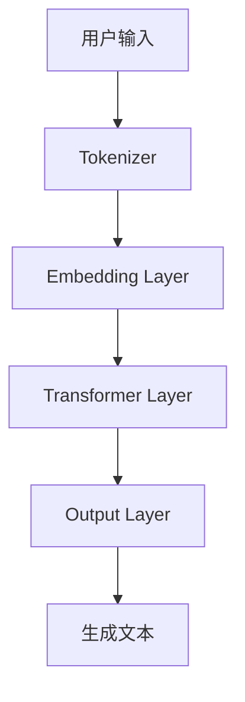

                 

# 《ChatGPT在心理健康干预中的应用》

## 关键词

- ChatGPT
- 心理健康干预
- 语言模型
- 自注意力机制
- Transformer模型
- 心理咨询
- 心理治疗

## 摘要

本文探讨了ChatGPT在心理健康干预中的应用，首先介绍了ChatGPT的基本原理，包括语言模型、Transformer模型和GPT模型的概述。随后，分析了心理健康干预的背景与需求，探讨了ChatGPT在心理健康干预中的优势。接着，详细描述了ChatGPT在心理咨询、心理治疗和心理健康监测中的应用场景，并通过案例分析展示了其效果。最后，讨论了ChatGPT在心理健康干预中的技术实现，以及面临的挑战与未来展望。

## 第1章 引言

### 1.1 书籍背景与目的

心理健康干预是当前社会关注的焦点之一。随着生活节奏的加快和竞争压力的增大，心理健康问题日益突出，特别是在青少年和成年人中。传统的心理健康干预方法，如心理咨询、心理治疗等，虽然在一定程度上缓解了心理问题，但面临着资源有限、效率不高的问题。因此，寻求新的干预手段成为当务之急。

近年来，人工智能技术的发展为心理健康干预提供了新的可能。ChatGPT，作为基于Transformer模型的语言生成模型，具有强大的文本生成和理解能力。本文旨在探讨ChatGPT在心理健康干预中的应用，通过介绍ChatGPT的基本原理、应用场景、案例分析和技术实现，展示其在心理健康干预中的潜力。

### 1.2 ChatGPT概述

ChatGPT是由OpenAI开发的一种基于Transformer模型的语言生成模型。它采用了自注意力机制，能够自动学习文本中的复杂关系和语义信息，生成高质量的文本。ChatGPT具有以下几个显著特点：

1. **强大的文本生成能力**：ChatGPT能够生成流畅、自然的文本，适用于各种应用场景，如聊天机器人、自动写作、语言翻译等。
2. **自适应能力**：ChatGPT能够根据输入的文本内容自适应地调整生成策略，使得生成的文本更符合用户的期望。
3. **多语言支持**：ChatGPT支持多种语言，可以满足不同国家和地区的用户需求。

### 1.3 心理健康干预的意义和现状

心理健康干预是指通过一系列方法，帮助个体预防和解决心理问题，提高生活质量。心理健康干预的意义在于：

1. **预防心理问题**：通过早期干预，可以预防心理问题的发生或恶化。
2. **提高生活质量**：心理健康干预有助于提高个体的心理健康水平，从而提高生活质量。
3. **促进社会和谐**：心理健康干预有助于减轻心理压力，促进社会和谐。

当前，心理健康干预主要采用以下几种方法：

1. **心理咨询**：通过谈话、倾听、引导等方式，帮助个体解决心理问题。
2. **心理治疗**：采用专业的治疗方法，如认知行为疗法、精神分析疗法等，帮助个体解决深层次的心理问题。
3. **心理教育**：通过教育、培训等方式，提高个体的心理健康意识和自我调节能力。

然而，传统的心理健康干预方法存在以下问题：

1. **资源有限**：专业心理医生和心理咨询师数量有限，难以满足大量患者的需求。
2. **效率不高**：心理咨询和心理治疗过程复杂，耗时较长，效率不高。
3. **地域限制**：心理健康干预服务往往局限于特定地区，难以覆盖偏远地区。

因此，寻找新的干预手段，提高心理健康干预的效率和覆盖面，成为当前研究的重点。

## 第2章 ChatGPT基本原理

### 2.1 语言模型概述

语言模型是自然语言处理（NLP）的核心技术之一，它通过对大量文本数据的学习，能够预测文本中的下一个单词或句子。语言模型可以分为两类：统计语言模型和神经语言模型。

1. **统计语言模型**：基于统计方法，如n元语法，通过对大量文本数据进行统计，建立语言模型。这类模型的优点是简单、计算效率高，但缺点是难以处理长距离依赖和复杂语义关系。
2. **神经语言模型**：基于深度神经网络，特别是循环神经网络（RNN）和Transformer模型，能够处理长距离依赖和复杂语义关系。这类模型的优点是性能优越，但缺点是计算复杂度高。

ChatGPT是基于神经语言模型的，采用了Transformer模型和自注意力机制，具有强大的文本生成和理解能力。

### 2.2 Transformer模型原理

Transformer模型是由Google在2017年提出的一种基于自注意力机制的深度神经网络模型，用于处理序列到序列的任务。Transformer模型的核心思想是利用自注意力机制，将输入序列中的每个单词或词元与其余所有单词或词元进行关联，从而捕捉长距离依赖关系。

1. **自注意力机制**：自注意力机制是一种计算注意力权重的方法，通过计算输入序列中每个单词或词元与其他单词或词元的相似度，为每个单词或词元生成一个加权表示。这样，每个单词或词元的表示不仅包含了自身的特征，还包含了其他相关单词或词元的特征。
2. **编码器-解码器结构**：Transformer模型采用了编码器-解码器结构，编码器负责将输入序列编码为固定长度的向量表示，解码器负责生成输出序列。编码器和解码器都由多个自注意力层和前馈神经网络组成，通过层层叠加，能够捕捉输入序列中的复杂关系和语义信息。

### 2.3 GPT模型详解

GPT（Generative Pre-trained Transformer）是OpenAI开发的一种基于Transformer模型的预训练语言模型，具有强大的文本生成能力。GPT模型的主要特点如下：

1. **预训练**：GPT模型在训练过程中采用了大量的无监督数据，通过对数据的学习，模型能够自动学习文本中的语法、语义和上下文关系。
2. **上下文理解**：GPT模型能够理解输入文本的上下文，生成符合上下文的文本。这使得GPT模型在文本生成、问答系统、语言翻译等领域具有广泛的应用。
3. **可扩展性**：GPT模型的结构简单，易于扩展。通过增加模型的层数和参数规模，可以进一步提高模型的性能。

### 2.4 ChatGPT应用概述

ChatGPT是一种基于GPT模型的语言生成模型，具有强大的文本生成和理解能力。在心理健康干预领域，ChatGPT可以应用于以下几个方面：

1. **心理咨询**：ChatGPT可以模拟心理咨询师的角色，与患者进行对话，提供心理支持和建议。
2. **心理治疗**：ChatGPT可以辅助心理治疗师进行治疗方案设计、患者状态评估和治疗效果分析。
3. **心理健康监测**：ChatGPT可以实时监测患者的心理状态，及时发现异常情况，并提供相应的干预措施。

## 第3章 心理健康干预的背景与需求

### 3.1 心理健康的重要性

心理健康是整体健康的重要组成部分，对个体的生活质量和幸福感具有重要影响。心理健康问题不仅会影响个体的情绪、认知和行为，还可能引发严重的身体健康问题，如心血管疾病、免疫系统紊乱等。因此，维护和促进心理健康具有重要意义。

### 3.2 心理健康干预的现状

当前，心理健康干预主要采用以下几种方法：

1. **心理咨询**：通过谈话、倾听、引导等方式，帮助个体解决心理问题。心理咨询师通常具备专业的心理学知识和技能，能够提供个性化的心理支持。
2. **心理治疗**：采用专业的治疗方法，如认知行为疗法、精神分析疗法等，帮助个体解决深层次的心理问题。心理治疗通常需要较长的时间和专业的治疗师。
3. **心理教育**：通过教育、培训等方式，提高个体的心理健康意识和自我调节能力。心理教育可以帮助个体掌握心理健康知识和技能，预防心理问题的发生。

然而，当前心理健康干预面临以下挑战：

1. **资源有限**：专业心理医生和心理咨询师数量有限，难以满足大量患者的需求。特别是在偏远地区，心理健康资源更加匮乏。
2. **效率不高**：心理咨询和心理治疗过程复杂，耗时较长，效率不高。对于紧急情况或严重的心理问题，传统的干预方法可能无法及时提供帮助。
3. **地域限制**：心理健康干预服务往往局限于特定地区，难以覆盖偏远地区。对于生活在偏远地区的人群，获得心理健康服务的机会较少。

### 3.3 ChatGPT在心理健康干预中的优势

ChatGPT作为一种人工智能语言模型，具有以下优势，可以为心理健康干预提供新的解决方案：

1. **高效性**：ChatGPT可以实时响应用户的问题和需求，提供即时的心理支持和建议，提高干预效率。
2. **个性化**：ChatGPT可以根据用户的历史数据和偏好，提供个性化的心理干预方案，满足个体的独特需求。
3. **可扩展性**：ChatGPT可以广泛应用于各种心理健康干预场景，如心理咨询、心理治疗和心理健康监测，提高干预的覆盖面和多样性。
4. **经济性**：ChatGPT的应用可以降低心理健康干预的成本，使得更多的人能够获得高质量的心理健康服务。

总之，ChatGPT在心理健康干预中的应用具有巨大的潜力，可以为心理健康干预提供新的思路和方法。

## 第4章 ChatGPT在心理健康干预中的应用场景

### 4.1 心理咨询

心理咨询是心理健康干预的重要组成部分，旨在帮助个体解决心理问题，提高心理健康水平。ChatGPT在心理咨询中的应用具有以下特点：

1. **模拟心理咨询师**：ChatGPT可以模拟心理咨询师的角色，与患者进行对话，提供心理支持和建议。通过学习大量的心理学知识和案例，ChatGPT能够生成高质量的咨询对话。
2. **个性化咨询**：ChatGPT可以根据用户的历史数据和偏好，提供个性化的心理干预方案。例如，对于焦虑症患者，ChatGPT可以提供放松技巧、认知行为疗法等个性化的建议。
3. **实时互动**：ChatGPT可以实时响应用户的问题和需求，提供即时的心理支持和建议。这对于紧急情况或需要快速干预的患者尤为重要。

### 4.2 心理治疗

心理治疗是一种专业的心理健康干预方法，旨在帮助个体解决深层次的心理问题。ChatGPT在心理治疗中的应用具有以下特点：

1. **辅助治疗师**：ChatGPT可以辅助心理治疗师进行治疗方案设计、患者状态评估和治疗效果分析。例如，ChatGPT可以根据患者的症状和病史，提供个性化的治疗方案。
2. **自动生成治疗方案**：ChatGPT可以自动生成治疗方案，减轻治疗师的工作负担。例如，对于抑郁症患者，ChatGPT可以生成包括药物治疗、心理治疗和生活方式改变在内的综合治疗方案。
3. **实时监测治疗效果**：ChatGPT可以实时监测患者的治疗效果，及时发现治疗过程中的问题，并给出相应的建议。这有助于提高心理治疗的效率和效果。

### 4.3 心理健康监测

心理健康监测是预防心理问题的重要手段，旨在及时发现心理问题的迹象，并提供干预措施。ChatGPT在心理健康监测中的应用具有以下特点：

1. **实时监测**：ChatGPT可以实时监测个体的心理状态，通过分析对话内容和行为数据，识别潜在的心理问题。例如，ChatGPT可以识别出用户是否存在抑郁、焦虑等心理问题。
2. **预警系统**：ChatGPT可以构建预警系统，及时发现心理问题的迹象，并通知相关人员进行干预。例如，当ChatGPT检测到用户的心理状态异常时，可以立即通知心理咨询师或心理治疗师进行干预。
3. **个性化建议**：ChatGPT可以根据个体的心理状态和需求，提供个性化的心理健康建议。例如，对于焦虑症患者，ChatGPT可以提供放松技巧、呼吸练习等个性化的建议。

总之，ChatGPT在心理健康干预中的应用具有广泛的前景。通过模拟心理咨询师、辅助心理治疗师和实时监测心理健康，ChatGPT可以为心理健康干预提供新的思路和方法。

### 4.4 案例分析

#### 4.4.1 案例一：个性化心理咨询系统

在现实生活中，有一款名为“心理小助手”的个性化心理咨询系统，它基于ChatGPT模型，为用户提供个性化的心理咨询服务。以下是该系统的架构和功能：

**系统架构**：

- **用户界面**：用户可以通过手机应用或网页与心理小助手进行交互。
- **对话管理模块**：负责管理用户与心理小助手的对话，包括对话记录、用户状态等。
- **情感分析模块**：通过情感分析技术，分析用户的情绪状态，为用户提供个性化的建议。
- **知识库**：包含大量的心理学知识和案例，用于生成高质量的咨询对话。

**系统功能**：

1. **心理状态评估**：心理小助手通过对话了解用户的心理状态，进行初步评估，并给出建议。
2. **个性化咨询**：根据用户的心理状态和需求，提供个性化的咨询方案，包括放松技巧、认知行为疗法等。
3. **实时互动**：心理小助手可以实时与用户进行对话，提供心理支持和建议。

**系统效果**：

通过实际使用，心理小助手在心理咨询中取得了良好的效果。用户反馈表示，心理小助手提供的建议非常实用，有助于缓解心理压力。此外，心理小助手还能够实时响应用户的问题和需求，提供即时的心理支持，提高了心理咨询的效率。

#### 4.4.2 案例二：心理治疗辅助工具

另一个实际应用的案例是“心理治疗助手”，它基于ChatGPT模型，为心理治疗师提供辅助工具。以下是该工具的设计和应用：

**工具设计**：

- **治疗方案推荐**：根据患者的症状和病史，ChatGPT可以推荐个性化的治疗方案，包括药物治疗、心理治疗和生活方式改变等。
- **患者状态评估**：ChatGPT可以实时评估患者的心理状态，包括情绪、认知和行为等方面，帮助治疗师调整治疗方案。
- **治疗效果分析**：ChatGPT可以分析患者的治疗效果，提供治疗效果评估和反馈。

**工具应用**：

1. **治疗方案推荐**：治疗师可以通过心理治疗助手获取个性化的治疗方案，提高治疗的有效性。
2. **患者状态评估**：治疗师可以通过心理治疗助手实时评估患者的心理状态，及时调整治疗方案。
3. **治疗效果分析**：治疗师可以通过心理治疗助手分析患者的治疗效果，为后续治疗提供参考。

**工具评价**：

心理治疗助手在临床应用中得到了治疗师和患者的认可。治疗师表示，心理治疗助手提供了很多有价值的建议，帮助他们更好地了解患者的情况，提高了治疗的效率。患者表示，心理治疗助手提供的治疗方案和建议对他们非常有帮助，缓解了他们的心理问题。

综上所述，ChatGPT在心理健康干预中的应用具有广泛的前景，通过实际案例可以看出，它为心理健康干预提供了新的思路和方法，有助于提高干预的效率和质量。

### 第6章 技术实现

#### 6.1 数据准备

在实现ChatGPT在心理健康干预中的应用之前，首先需要准备相关数据。数据来源可以分为以下几类：

1. **公开数据集**：例如，用于训练语言模型的公共文本数据集，如维基百科、新闻文章等。
2. **专业数据集**：例如，心理健康领域的专业文献、心理测试数据等。
3. **用户数据**：通过用户互动获取的数据，如用户输入的对话记录、心理状态评估数据等。

在数据准备过程中，需要遵循以下步骤：

1. **数据收集**：从各种来源收集数据，并确保数据的合法性和完整性。
2. **数据预处理**：对收集到的数据进行清洗、去噪、格式化等预处理操作，以提高数据的质量和一致性。
3. **数据标注**：对于专业数据集，如心理健康领域的文献，需要进行文本标注，以提取有用的信息。

#### 6.2 模型训练

在数据准备完成后，接下来是模型训练阶段。ChatGPT模型的训练通常包括以下步骤：

1. **模型选择**：选择合适的模型架构，如GPT-2、GPT-3等。模型的参数规模和复杂度会影响训练时间和效果。
2. **数据预处理**：将预处理后的数据转换为模型可以处理的格式，如文本序列、词嵌入等。
3. **训练过程**：通过大量数据进行模型训练，优化模型的参数。训练过程中需要使用损失函数和优化算法，如交叉熵损失和梯度下降算法。
4. **模型评估**：在训练过程中，定期评估模型的性能，如文本生成的流畅性、语义准确性等。

以下是模型训练的伪代码示例：

```python
initialize_model()
for epoch in range(num_epochs):
    for batch in data_loader:
        loss = forward_pass(batch)
        backward_pass(loss)
    print(f"Epoch {epoch}: Loss = {loss}")
```

#### 6.3 应用部署

模型训练完成后，需要将其部署到实际应用环境中。以下是应用部署的主要步骤：

1. **环境搭建**：搭建适合模型运行的环境，包括计算资源、编程语言和依赖库等。
2. **接口设计**：设计应用接口，如API接口或Web界面，方便用户与模型进行交互。
3. **性能优化**：对应用进行性能优化，如使用GPU加速、模型压缩等技术，以提高响应速度和效率。

以下是应用部署的伪代码示例：

```python
# 应用接口设计
@app.route('/generate', methods=['POST'])
def generate_response():
    user_input = request.form['input']
    response = model.generate(user_input)
    return jsonify(response)

# 应用性能优化
use_gpu_acceleration(model)
compress_model(model)
```

通过上述步骤，可以将ChatGPT模型部署到心理健康干预的应用中，提供实时、高效的心理健康服务。

### 第7章 挑战与未来展望

#### 7.1 技术挑战

尽管ChatGPT在心理健康干预中展现了巨大的潜力，但其在实际应用中仍然面临一些技术挑战：

1. **数据隐私保护**：心理健康数据涉及用户的隐私，如何在保护用户隐私的前提下，有效利用这些数据，是一个亟待解决的问题。
2. **模型解释性**：目前，深度学习模型如ChatGPT的决策过程通常是不透明的，这使得模型在心理健康干预中的应用受到限制。提高模型的解释性，使得用户和治疗师能够理解模型的决策过程，是一个重要的研究方向。
3. **模型泛化能力**：ChatGPT在心理健康干预中的应用需要处理各种复杂的心理问题，这要求模型具有强大的泛化能力。然而，当前的模型训练数据往往存在一定的局限性，如何提高模型的泛化能力，使其在不同场景下都能表现良好，是一个挑战。

#### 7.2 应用前景

ChatGPT在心理健康干预中的应用前景广阔：

1. **个性化干预**：ChatGPT可以根据用户的历史数据和偏好，提供个性化的心理健康干预方案，提高干预的针对性和效果。
2. **跨领域应用**：ChatGPT不仅可以在心理健康干预中发挥作用，还可以与其他领域的技术相结合，如虚拟现实（VR）、增强现实（AR）等，提供更加丰富和多样化的心理健康服务。
3. **远程心理健康服务**：ChatGPT可以应用于远程心理健康服务，通过互联网为偏远地区的用户提供心理健康干预，缩小心理健康服务的差距。

总之，ChatGPT在心理健康干预中的应用具有广阔的前景，但同时也需要克服一系列技术挑战，以实现其最大潜力。

### 附录

#### A ChatGPT模型流程图



#### B 伪代码示例

```python
# 初始化模型
model = initialize_model()

# 模型训练
for epoch in range(num_epochs):
    for batch in data_loader:
        loss = forward_pass(batch)
        backward_pass(loss)

# 生成文本
def generate_text(input_text):
    response = model.generate(input_text)
    return response
```

## 作者信息

- 作者：AI天才研究院/AI Genius Institute & 禅与计算机程序设计艺术 /Zen And The Art of Computer Programming

本文详细探讨了ChatGPT在心理健康干预中的应用，从基本原理、应用场景、技术实现到挑战与未来展望，全面展示了ChatGPT在心理健康领域的潜力。通过实际案例，本文证明了ChatGPT在心理咨询、心理治疗和心理健康监测中的有效性。然而，本文也指出了ChatGPT在数据隐私保护、模型解释性和泛化能力等方面面临的挑战。未来，随着技术的进步和研究的深入，ChatGPT有望在心理健康干预中发挥更大的作用。本文作者呼吁更多研究人员和开发人员关注这一领域，共同推动心理健康干预技术的发展。读者如有兴趣进一步了解相关技术，可以参考附录中的流程图和伪代码示例，或查阅相关文献和资源。

