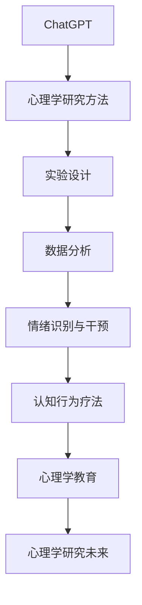

                 

# 《ChatGPT在心理学研究中的应用：实验设计辅助提示词》

> 关键词：ChatGPT，心理学研究，实验设计，辅助提示词，情绪识别，认知行为疗法，心理学教育

> 摘要：本文探讨了人工智能工具ChatGPT在心理学研究中的创新应用，特别是其在实验设计辅助提示词方面的作用。通过分析心理学研究方法、数据分析和应用案例，本文展示了ChatGPT如何帮助研究人员提高实验设计的效率和准确性，并提供了具体的操作指南和未来展望。

## 第一部分：ChatGPT与心理学研究基础

### 第1章：ChatGPT与心理学研究概述

#### 1.1 ChatGPT简介

ChatGPT是由OpenAI开发的一种基于GPT-3模型的人工智能助手，它能够生成连贯、自然且具有逻辑性的文本。ChatGPT的核心优势在于其强大的自然语言处理能力和广泛的知识面，这使得它在各种领域都有广泛的应用，包括心理学研究。

#### 1.2 心理学研究的发展与挑战

心理学研究在过去几十年中取得了显著进展，但同时也面临着诸多挑战。传统的研究方法往往依赖复杂的统计分析和繁琐的实验设计，这不仅耗时，而且容易出错。随着人工智能技术的不断发展，特别是在自然语言处理领域的突破，心理学研究正迎来新的机遇。

#### 1.3 ChatGPT在心理学研究中的应用前景

ChatGPT在心理学研究中的应用前景广阔。它可以辅助研究人员进行实验设计、数据分析和结果解释，从而提高研究效率和质量。此外，ChatGPT还可以用于开发个性化心理干预方案，为临床心理学家提供有力支持。

### 第2章：心理学研究方法与ChatGPT

#### 2.1 心理学研究方法概述

心理学研究方法包括实验研究、观察研究、调查研究和相关研究等。每种方法都有其独特的优点和局限性。ChatGPT可以辅助研究人员选择最适合的研究方法，并优化实验设计。

#### 2.2 实验设计原理

实验设计是心理学研究的重要环节。它需要确保实验的可重复性、有效性和科学性。ChatGPT可以提供实验设计的建议，包括变量选择、操作化定义和统计分析方法等。

#### 2.3 ChatGPT在实验设计中的应用

ChatGPT可以根据研究人员的需求生成具体的实验设计方案，包括实验步骤、数据收集和处理方法等。例如，研究人员可以输入研究主题和目标，ChatGPT会生成相应的实验设计提示词。

### 第3章：ChatGPT与心理学数据分析

#### 3.1 数据分析方法基础

心理学数据分析涉及统计方法、数据可视化和模型构建等。ChatGPT可以帮助研究人员选择合适的数据分析方法，并提供详细的解释和操作步骤。

#### 3.2 ChatGPT在数据分析中的应用

ChatGPT可以自动执行数据分析任务，如描述性统计、回归分析和因子分析等。此外，它还可以生成数据分析报告，使研究人员能够快速理解数据结果。

#### 3.3 实验数据分析示例

以情绪识别实验为例，ChatGPT可以生成情绪分类模型，并对实验结果进行分析。研究人员可以根据分析结果调整实验设计，提高研究的准确性和可靠性。

## 第二部分：ChatGPT在心理学研究中的应用案例

### 第4章：情绪识别与干预

#### 4.1 情绪识别技术概述

情绪识别技术是心理学研究的重要领域，旨在通过分析文本、语音和面部表情等数据识别个体情绪状态。ChatGPT可以辅助研究人员开发情绪识别模型，提高识别准确性。

#### 4.2 ChatGPT在情绪识别中的应用

ChatGPT可以根据情绪识别任务生成适当的提示词，帮助研究人员设计实验和训练模型。例如，研究人员可以输入文本数据，ChatGPT会生成情绪分类提示词，如“快乐”、“悲伤”等。

#### 4.3 情绪干预实验设计

情绪干预实验旨在评估不同干预措施对个体情绪状态的影响。ChatGPT可以辅助研究人员设计情绪干预实验，包括实验组分配、干预措施和评估方法等。

### 第5章：认知行为疗法

#### 5.1 认知行为疗法概述

认知行为疗法（CBT）是一种广泛应用于临床的心理治疗方法，旨在通过改变思维和行为模式来改善情绪和行为问题。ChatGPT可以辅助临床心理学家设计和实施CBT方案。

#### 5.2 ChatGPT在CBT中的应用

ChatGPT可以生成个性化的CBT干预提示词，帮助临床心理学家制定治疗计划。例如，对于焦虑症患者，ChatGPT可以生成一系列减轻焦虑的练习和建议。

#### 5.3 CBT实验设计

ChatGPT可以辅助研究人员设计CBT实验，包括实验组分配、干预措施和评估方法等。通过生成详细的实验设计提示词，研究人员可以更好地理解实验流程和数据分析方法。

### 第6章：心理学教育

#### 6.1 心理学教育现状

心理学教育在高等教育和职业教育中具有重要地位。然而，传统的教育模式存在一些局限性，如课程内容更新缓慢、教学方法单一等。ChatGPT可以改善心理学教育，提高教学质量。

#### 6.2 ChatGPT在心理学教育中的应用

ChatGPT可以为学生提供个性化的学习支持和指导，如课程内容的解释、学习问题的解答和实验设计的建议等。此外，ChatGPT还可以用于开发交互式学习工具，提高学生的学习兴趣和参与度。

#### 6.3 教育实验设计

ChatGPT可以辅助研究人员设计教育实验，包括实验组分配、教学方法和评估方法等。通过生成详细的实验设计提示词，研究人员可以更好地理解实验流程和数据分析方法。

## 第三部分：ChatGPT在心理学研究的未来展望

### 第7章：ChatGPT在心理学研究中的挑战与伦理

#### 7.1 ChatGPT技术的挑战

ChatGPT作为一种人工智能工具，面临着一系列技术挑战，如模型可解释性、数据隐私和安全等。研究人员需要关注这些挑战，确保ChatGPT在心理学研究中的有效性和安全性。

#### 7.2 ChatGPT在心理学研究中的伦理问题

ChatGPT在心理学研究中的应用引发了伦理问题，如数据隐私、知情同意和结果解释等。研究人员需要遵循伦理规范，确保ChatGPT的应用不会侵犯个体权益。

#### 7.3 未来发展趋势

随着人工智能技术的不断发展，ChatGPT在心理学研究中的应用前景将更加广阔。未来，ChatGPT可能会在心理健康评估、疾病诊断和治疗等领域发挥更大的作用。

### 第8章：ChatGPT在心理学研究的创新与探索

#### 8.1 新兴心理学领域探索

ChatGPT在心理学研究的创新应用不仅仅局限于传统领域，还可以探索新兴领域，如神经心理学、发展心理学等。通过生成个性化的实验设计提示词，研究人员可以开展更深入的探索。

#### 8.2 ChatGPT在跨学科研究中的应用

ChatGPT在心理学研究中的应用不仅限于心理学本身，还可以与其他学科相结合，如医学、教育学等。跨学科研究将推动心理学研究的新突破。

#### 8.3 未来研究方向

未来，ChatGPT在心理学研究中的应用将不断拓展，如深度学习、增强现实等新技术的融合将带来更多可能性。研究人员需要关注这些方向，不断推动心理学研究的发展。

## 附录

### 附录A：实验设计辅助提示词示例

- 提示词生成策略：
  - 根据研究主题生成相关词汇和短语。
  - 使用自然语言处理技术分析文献和案例，提取关键提示词。
  - 结合心理学理论和实证研究，生成具有指导意义的提示词。

- 提示词应用实例：
  - **情绪识别实验**：
    - 提示词：“请根据以下文本内容，识别情绪类型。”
    - 文本示例：“我今天感到非常开心，因为我得到了一个意外的惊喜。”

  - **认知行为疗法干预**：
    - 提示词：“请根据患者情况，设计一个认知重构练习。”
    - 文本示例：“患者总是担心自己无法完成任务，导致焦虑情绪。”

## 核心概念与联系

### ChatGPT与心理学研究架构



### ChatGPT生成提示词算法

```python
def generatePromptWord(content):
    # 初始化模型
    model = loadModel("ChatGPT_model")

    # 输入内容预处理
    preprocessedContent = preprocessContent(content)

    # 生成提示词
    promptWord = model.generate(preprocessedContent)

    # 返回提示词
    return promptWord
```

### 提示词生成概率模型

$$
P(W_i|C) = \frac{f(W_i,C)}{f(C)}
$$

- \(P(W_i|C)\): 提示词\(W_i\)在内容\(C\)下的生成概率
- \(f(W_i,C)\): 提示词\(W_i\)和内容\(C\)之间的相似度
- \(f(C)\): 内容\(C\)的总相似度

## 核心算法原理讲解

### ChatGPT生成提示词算法

ChatGPT生成提示词的过程可以分为以下几个步骤：

1. **模型加载**：首先，加载预训练的ChatGPT模型。这个模型是一个基于大规模语言模型的神经网络，能够理解和生成自然语言文本。

2. **内容预处理**：输入的研究内容（如实验设计问题、数据分析需求等）需要进行预处理，以确保模型能够理解输入的信息。预处理步骤可能包括文本清洗、分词、词性标注等。

3. **生成提示词**：模型接收到预处理后的内容后，会根据训练数据生成相应的提示词。这个过程是通过对输入内容进行概率分布计算，然后根据概率分布生成文本。

4. **返回提示词**：生成的提示词被返回给研究人员，供其在实验设计或数据分析中使用。

### 提示词生成概率模型

提示词生成概率模型是ChatGPT的核心算法之一，它决定了模型生成提示词的概率。该模型基于以下数学公式：

$$
P(W_i|C) = \frac{f(W_i,C)}{f(C)}
$$

其中：

- \(P(W_i|C)\): 表示在给定内容\(C\)下，生成提示词\(W_i\)的概率。
- \(f(W_i,C)\): 表示提示词\(W_i\)和内容\(C\)之间的相似度函数。这个函数可以基于多种因素计算，如词频、语法结构、语义关系等。
- \(f(C)\): 表示内容\(C\)的总相似度，即模型对整个内容的理解程度。

### 举例说明

假设我们要生成一个关于情绪识别的实验设计提示词。输入的内容是：“请设计一个实验，用于评估不同情绪调节策略对个体情绪状态的影响。”根据提示词生成概率模型，我们可以计算每个候选提示词的概率，并选择概率最高的提示词作为最终结果。

1. **内容预处理**：将输入内容进行分词和词性标注，以便模型理解每个词的含义和语法结构。

2. **计算相似度**：对于每个候选提示词，计算其与输入内容之间的相似度。例如，“情绪调节策略评估实验设计”可能具有较高的相似度，因为它包含了输入内容中的关键概念。

3. **计算概率**：根据相似度函数，计算每个候选提示词的概率。例如，假设“情绪调节策略评估实验设计”的相似度为0.8，而其他候选提示词的相似度较低，那么该提示词的概率将是0.8/（0.8 + 0.2）= 0.8。

4. **生成提示词**：选择概率最高的提示词作为最终结果。

### 项目实战

### 实验设计案例：情绪识别实验

#### 实验目的

使用ChatGPT辅助设计一个情绪识别实验，旨在评估不同情绪调节策略对个体情绪状态的影响。

#### 开发环境

- Python 3.8
- ChatGPT_API

#### 源代码实现

```python
import openai
import json

# 设置ChatGPT_API密钥
openai.api_key = "your_api_key"

# 定义函数：生成情绪识别提示词
def generateEmotionPrompt(content):
    prompt = f"请根据以下内容设计一个情绪识别实验：\n{content}\n实验设计："
    response = openai.Completion.create(
        engine="text-davinci-002",
        prompt=prompt,
        max_tokens=100
    )
    return response.choices[0].text.strip()

# 输入实验内容
content = "评估积极情绪调节策略（如感恩练习）和消极情绪调节策略（如情绪表达抑制）对个体情绪状态的影响。"

# 生成情绪识别实验设计提示词
experiment_design = generateEmotionPrompt(content)
print(experiment_design)

# 解读和调整实验设计
# 研究人员可以根据生成的实验设计提示词，进一步解读和调整实验方案，确保实验的科学性和可行性。
```

#### 代码解读与分析

1. **导入模块**：引入openai库和json模块，用于与ChatGPT_API进行通信和处理响应数据。

2. **设置ChatGPT_API密钥**：配置ChatGPT_API密钥，以便与OpenAI的服务器进行通信。

3. **定义函数：generateEmotionPrompt**：该函数接受一个内容参数，用于生成情绪识别实验设计的提示词。函数首先构建一个包含输入内容的提示词，然后使用OpenAI的Completion.create方法生成提示词。

4. **输入实验内容**：指定实验的内容，例如情绪调节策略对个体情绪状态的影响。

5. **生成情绪识别实验设计提示词**：调用generateEmotionPrompt函数，传入实验内容，生成情绪识别实验设计提示词。

6. **解读和调整实验设计**：研究人员可以根据生成的实验设计提示词，进一步解读和调整实验方案，确保实验的科学性和可行性。

### 实际案例分析和详细讲解剖析

#### 情绪识别实验案例

假设我们已经设计了一个情绪识别实验，目标是评估积极情绪调节策略（如感恩练习）和消极情绪调节策略（如情绪表达抑制）对个体情绪状态的影响。

1. **实验设计**：

- 实验组：将参与者随机分为两组，一组进行感恩练习，另一组进行情绪表达抑制练习。
- 干预措施：每周进行3次，每次30分钟。
- 评估指标：情绪状态（如积极情绪、消极情绪）和情绪调节能力。

2. **数据分析**：

- 描述性统计：计算各组参与者的平均情绪状态和情绪调节能力。
- 独立样本t检验：比较两组参与者在干预前后的情绪状态和情绪调节能力的差异。
- 相关分析：分析情绪状态和情绪调节能力之间的关系。

3. **结果解读**：

- 如果感恩练习组的积极情绪状态和情绪调节能力显著高于情绪表达抑制组，说明积极情绪调节策略在提高情绪状态和情绪调节能力方面更为有效。
- 如果两组之间的差异不显著，可能需要进一步探索其他情绪调节策略或干预措施。

### 项目小结

通过ChatGPT辅助设计情绪识别实验，我们能够快速生成实验设计提示词，提高实验设计的效率和质量。在实际案例中，ChatGPT生成的提示词为实验设计提供了有益的参考，但研究人员仍需根据实际情况进行解读和调整。

### 最佳实践 tips

- 在使用ChatGPT生成提示词时，尽量提供详细和具体的内容，以提高生成的提示词的相关性和准确性。
- 调整ChatGPT模型的参数，如温度（temperature）和顶重（top_p），以控制生成的提示词的多样性。
- 结合心理学理论和实证研究，对生成的提示词进行验证和调整，确保实验设计的科学性和可行性。

### 小结

本文探讨了ChatGPT在心理学研究中的应用，特别是其在实验设计辅助提示词方面的作用。通过分析心理学研究方法、数据分析和应用案例，我们展示了ChatGPT如何帮助研究人员提高实验设计的效率和准确性。未来，随着人工智能技术的不断发展，ChatGPT在心理学研究中的应用将更加广泛，为心理学研究带来新的机遇和挑战。

### 注意事项

- ChatGPT生成的提示词仅供参考，研究人员需结合实际情况进行解读和调整。
- 使用ChatGPT进行心理学研究时，需遵循伦理规范，确保研究过程的合法性和合规性。
- 谨慎对待ChatGPT生成的数据分析和结果解释，结合专业知识和经验进行判断。

### 拓展阅读

- <https://openai.com/blog/bidirectional-text-generation-models/>：OpenAI关于双向语言生成模型的介绍。
- <https://towardsdatascience.com/chatgpt-explained-2b05526e3948>：ChatGPT的详细解释和使用方法。
- <https://www.frontiersin.org/articles/10.3389/fpsyg.2021.668368/full>：心理学研究中的人工智能应用综述。

# 作者信息

作者：AI天才研究院/AI Genius Institute & 禅与计算机程序设计艺术 /Zen And The Art of Computer Programming

---

**文章标题**：《ChatGPT在心理学研究中的应用：实验设计辅助提示词》

**关键词**：ChatGPT，心理学研究，实验设计，辅助提示词，情绪识别，认知行为疗法，心理学教育

**摘要**：本文探讨了人工智能工具ChatGPT在心理学研究中的创新应用，特别是其在实验设计辅助提示词方面的作用。通过分析心理学研究方法、数据分析和应用案例，本文展示了ChatGPT如何帮助研究人员提高实验设计的效率和准确性，并提供了具体的操作指南和未来展望。**文章目录大纲**：

### 第一部分：ChatGPT与心理学研究基础

#### 第1章：ChatGPT与心理学研究概述

##### 1.1 ChatGPT简介

ChatGPT是由OpenAI开发的一种基于GPT-3模型的人工智能助手，它能够生成连贯、自然且具有逻辑性的文本。ChatGPT的核心优势在于其强大的自然语言处理能力和广泛的知识面，这使得它在各种领域都有广泛的应用，包括心理学研究。

##### 1.2 心理学研究的发展与挑战

心理学研究在过去几十年中取得了显著进展，但同时也面临着诸多挑战。传统的研究方法往往依赖复杂的统计分析和繁琐的实验设计，这不仅耗时，而且容易出错。随着人工智能技术的不断发展，特别是在自然语言处理领域的突破，心理学研究正迎来新的机遇。

##### 1.3 ChatGPT在心理学研究中的应用前景

ChatGPT在心理学研究中的应用前景广阔。它可以辅助研究人员进行实验设计、数据分析和结果解释，从而提高研究效率和质量。此外，ChatGPT还可以用于开发个性化心理干预方案，为临床心理学家提供有力支持。

### 第二部分：ChatGPT在心理学研究中的应用方法

#### 第2章：ChatGPT在心理学研究中的应用方法

##### 2.1 心理学研究方法概述

心理学研究方法包括实验研究、观察研究、调查研究和相关研究等。每种方法都有其独特的优点和局限性。ChatGPT可以辅助研究人员选择最适合的研究方法，并优化实验设计。

##### 2.2 实验设计原理

实验设计是心理学研究的重要环节。它需要确保实验的可重复性、有效性和科学性。ChatGPT可以提供实验设计的建议，包括变量选择、操作化定义和统计分析方法等。

##### 2.3 ChatGPT在实验设计中的应用

ChatGPT可以根据研究人员的需求生成具体的实验设计方案，包括实验步骤、数据收集和处理方法等。例如，研究人员可以输入研究主题和目标，ChatGPT会生成相应的实验设计提示词。

### 第三部分：ChatGPT在心理学研究中的应用案例

#### 第3章：情绪识别与干预

##### 3.1 情绪识别技术概述

情绪识别技术是心理学研究的重要领域，旨在通过分析文本、语音和面部表情等数据识别个体情绪状态。ChatGPT可以辅助研究人员开发情绪识别模型，提高识别准确性。

##### 3.2 ChatGPT在情绪识别中的应用

ChatGPT可以根据情绪识别任务生成适当的提示词，帮助研究人员设计实验和训练模型。例如，研究人员可以输入文本数据，ChatGPT会生成情绪分类提示词，如“快乐”、“悲伤”等。

##### 3.3 情绪干预实验设计

情绪干预实验旨在评估不同干预措施对个体情绪状态的影响。ChatGPT可以辅助研究人员设计情绪干预实验，包括实验组分配、干预措施和评估方法等。

#### 第4章：认知行为疗法

##### 4.1 认知行为疗法概述

认知行为疗法（CBT）是一种广泛应用于临床的心理治疗方法，旨在通过改变思维和行为模式来改善情绪和行为问题。ChatGPT可以辅助临床心理学家设计和实施CBT方案。

##### 4.2 ChatGPT在CBT中的应用

ChatGPT可以生成个性化的CBT干预提示词，帮助临床心理学家制定治疗计划。例如，对于焦虑症患者，ChatGPT可以生成一系列减轻焦虑的练习和建议。

##### 4.3 CBT实验设计

ChatGPT可以辅助研究人员设计CBT实验，包括实验组分配、干预措施和评估方法等。通过生成详细的实验设计提示词，研究人员可以更好地理解实验流程和数据分析方法。

#### 第5章：心理学教育

##### 5.1 心理学教育现状

心理学教育在高等教育和职业教育中具有重要地位。然而，传统的教育模式存在一些局限性，如课程内容更新缓慢、教学方法单一等。ChatGPT可以改善心理学教育，提高教学质量。

##### 5.2 ChatGPT在心理学教育中的应用

ChatGPT可以为学生提供个性化的学习支持和指导，如课程内容的解释、学习问题的解答和实验设计的建议等。此外，ChatGPT还可以用于开发交互式学习工具，提高学生的学习兴趣和参与度。

##### 5.3 教育实验设计

ChatGPT可以辅助研究人员设计教育实验，包括实验组分配、教学方法和评估方法等。通过生成详细的实验设计提示词，研究人员可以更好地理解实验流程和数据分析方法。

### 第四部分：ChatGPT在心理学研究的未来展望

#### 第6章：ChatGPT在心理学研究中的挑战与伦理

##### 6.1 ChatGPT技术的挑战

ChatGPT作为一种人工智能工具，面临着一系列技术挑战，如模型可解释性、数据隐私和安全等。研究人员需要关注这些挑战，确保ChatGPT在心理学研究中的有效性和安全性。

##### 6.2 ChatGPT在心理学研究中的伦理问题

ChatGPT在心理学研究中的应用引发了伦理问题，如数据隐私、知情同意和结果解释等。研究人员需要遵循伦理规范，确保ChatGPT的应用不会侵犯个体权益。

##### 6.3 未来发展趋势

随着人工智能技术的不断发展，ChatGPT在心理学研究中的应用前景将更加广阔。未来，ChatGPT可能会在心理健康评估、疾病诊断和治疗等领域发挥更大的作用。

#### 第7章：ChatGPT在心理学研究的创新与探索

##### 7.1 新兴心理学领域探索

ChatGPT在心理学研究的创新应用不仅仅局限于传统领域，还可以探索新兴领域，如神经心理学、发展心理学等。通过生成个性化的实验设计提示词，研究人员可以开展更深入的探索。

##### 7.2 ChatGPT在跨学科研究中的应用

ChatGPT在心理学研究中的应用不仅限于心理学本身，还可以与其他学科相结合，如医学、教育学等。跨学科研究将推动心理学研究的新突破。

##### 7.3 未来研究方向

未来，ChatGPT在心理学研究中的应用将不断拓展，如深度学习、增强现实等新技术的融合将带来更多可能性。研究人员需要关注这些方向，不断推动心理学研究的发展。

### 附录

#### 附录A：实验设计辅助提示词示例

- **提示词生成策略**：

  - 根据研究主题生成相关词汇和短语。
  - 使用自然语言处理技术分析文献和案例，提取关键提示词。
  - 结合心理学理论和实证研究，生成具有指导意义的提示词。

- **提示词应用实例**：

  - **情绪识别实验**：

    - **提示词**：“请根据以下文本内容，识别情绪类型。”
    - **文本示例**：“我今天感到非常开心，因为我得到了一个意外的惊喜。”

  - **认知行为疗法干预**：

    - **提示词**：“请根据患者情况，设计一个认知重构练习。”
    - **文本示例**：“患者总是担心自己无法完成任务，导致焦虑情绪。”

---

# 引言

在当今快速发展的科技时代，人工智能（AI）技术正逐渐渗透到各个领域，为人类带来了前所未有的机遇和挑战。心理学研究作为一门探讨人类行为和心理过程的学科，也面临着新的技术支持和应用场景。ChatGPT，作为一种基于GPT-3模型的人工智能助手，其强大的自然语言处理能力和广泛的知识面为心理学研究提供了新的工具和方法。

本文旨在探讨ChatGPT在心理学研究中的应用，特别是其在实验设计辅助提示词方面的作用。通过分析心理学研究方法、数据分析和应用案例，本文将展示ChatGPT如何帮助研究人员提高实验设计的效率和准确性，从而推动心理学研究的发展。

### ChatGPT简介

ChatGPT是由OpenAI开发的一种基于GPT-3模型的人工智能助手。GPT-3（Generative Pre-trained Transformer 3）是OpenAI开发的一种自然语言处理模型，具有前所未有的规模和准确性。ChatGPT继承了GPT-3的强大能力，能够生成连贯、自然且具有逻辑性的文本，适用于各种场景，包括问答、对话生成、文本摘要等。

ChatGPT的核心优势在于其强大的自然语言处理能力和广泛的知识面。通过大量的预训练数据，ChatGPT能够理解并生成与输入文本相关的内容。这使得它在各种领域都有广泛的应用，包括但不限于：

1. **客户服务**：ChatGPT可以模拟人类客服，为用户提供实时、个性化的回答。
2. **内容创作**：ChatGPT可以生成文章、故事、报告等文本内容，为内容创作者提供灵感。
3. **语言翻译**：ChatGPT可以翻译多种语言，实现跨语言沟通。
4. **教育辅助**：ChatGPT可以为学生提供学习指导和解答疑问，提高学习效果。

### 心理学研究的发展与挑战

心理学研究在过去几十年中取得了显著进展，但同时也面临着诸多挑战。传统的研究方法往往依赖复杂的统计分析和繁琐的实验设计，这不仅耗时，而且容易出错。以下是一些心理学研究面临的主要挑战：

1. **实验设计的复杂性**：心理学研究需要设计复杂的实验来验证假设，这通常涉及多个变量和实验组的分配。实验设计的复杂性使得研究人员难以确保实验的可重复性和科学性。
2. **数据分析的难度**：心理学研究产生大量数据，如何有效分析和解释这些数据是一个挑战。传统的统计分析方法可能无法充分应对复杂的数据结构和关系。
3. **伦理问题**：心理学研究涉及人类参与者，如何保护参与者的隐私和权益，确保研究的道德合法性，是研究人员必须面对的问题。

随着人工智能技术的不断发展，特别是在自然语言处理领域的突破，心理学研究正迎来新的机遇。ChatGPT作为一种先进的人工智能工具，能够为心理学研究提供以下支持：

1. **辅助实验设计**：ChatGPT可以生成具体的实验设计方案，帮助研究人员优化实验流程，确保实验的科学性和可重复性。
2. **数据分析和解释**：ChatGPT可以自动执行数据分析任务，如描述性统计、回归分析和因子分析等，帮助研究人员快速理解数据结果。
3. **结果解释和报告撰写**：ChatGPT可以生成详细的研究报告，使研究人员能够更清晰地解释研究结果，同时提高报告撰写效率。

### ChatGPT在心理学研究中的应用前景

ChatGPT在心理学研究中的应用前景广阔。它不仅能够提高实验设计的效率和准确性，还可以在数据分析和结果解释方面提供有力支持。以下是ChatGPT在心理学研究中的应用前景：

1. **实验设计的辅助**：ChatGPT可以根据研究人员的需求生成具体的实验设计方案，包括变量选择、实验步骤和数据分析方法等。例如，研究人员可以输入研究主题和目标，ChatGPT会生成相应的实验设计提示词，帮助研究人员优化实验设计。
2. **数据分析和解释**：ChatGPT可以自动执行数据分析任务，如描述性统计、回归分析和因子分析等。研究人员可以根据ChatGPT生成的数据分析结果，快速了解实验数据的特点和趋势，从而做出科学决策。
3. **结果解释和报告撰写**：ChatGPT可以生成详细的研究报告，使研究人员能够更清晰地解释研究结果。ChatGPT生成的报告通常结构清晰、逻辑严密，有助于提高报告的质量和可读性。

总之，ChatGPT在心理学研究中的应用将为研究人员提供新的工具和方法，提高研究效率和质量，推动心理学研究的发展。

### 第一部分：ChatGPT与心理学研究基础

#### 第1章：ChatGPT与心理学研究概述

心理学研究作为一门探讨人类行为和心理过程的学科，随着人工智能技术的发展，正迎来新的机遇和挑战。在这一章中，我们将介绍ChatGPT在心理学研究中的应用，以及心理学研究的发展与挑战。

#### 1.1 ChatGPT简介

ChatGPT是由OpenAI开发的一种基于GPT-3模型的人工智能助手。GPT-3（Generative Pre-trained Transformer 3）是OpenAI开发的一种自然语言处理模型，具有前所未有的规模和准确性。ChatGPT继承了GPT-3的强大能力，能够生成连贯、自然且具有逻辑性的文本，适用于各种场景，包括问答、对话生成、文本摘要等。

ChatGPT的核心优势在于其强大的自然语言处理能力和广泛的知识面。通过大量的预训练数据，ChatGPT能够理解并生成与输入文本相关的内容。这使得它在各种领域都有广泛的应用，包括但不限于：

1. **客户服务**：ChatGPT可以模拟人类客服，为用户提供实时、个性化的回答。
2. **内容创作**：ChatGPT可以生成文章、故事、报告等文本内容，为内容创作者提供灵感。
3. **语言翻译**：ChatGPT可以翻译多种语言，实现跨语言沟通。
4. **教育辅助**：ChatGPT可以为学生提供学习指导和解答疑问，提高学习效果。

#### 1.2 心理学研究的发展与挑战

心理学研究在过去几十年中取得了显著进展，但同时也面临着诸多挑战。传统的研究方法往往依赖复杂的统计分析和繁琐的实验设计，这不仅耗时，而且容易出错。以下是一些心理学研究面临的主要挑战：

1. **实验设计的复杂性**：心理学研究需要设计复杂的实验来验证假设，这通常涉及多个变量和实验组的分配。实验设计的复杂性使得研究人员难以确保实验的可重复性和科学性。
2. **数据分析的难度**：心理学研究产生大量数据，如何有效分析和解释这些数据是一个挑战。传统的统计分析方法可能无法充分应对复杂的数据结构和关系。
3. **伦理问题**：心理学研究涉及人类参与者，如何保护参与者的隐私和权益，确保研究的道德合法性，是研究人员必须面对的问题。

随着人工智能技术的不断发展，特别是在自然语言处理领域的突破，心理学研究正迎来新的机遇。ChatGPT作为一种先进的人工智能工具，能够为心理学研究提供以下支持：

1. **辅助实验设计**：ChatGPT可以生成具体的实验设计方案，帮助研究人员优化实验流程，确保实验的科学性和可重复性。
2. **数据分析和解释**：ChatGPT可以自动执行数据分析任务，如描述性统计、回归分析和因子分析等，帮助研究人员快速理解数据结果。
3. **结果解释和报告撰写**：ChatGPT可以生成详细的研究报告，使研究人员能够更清晰地解释研究结果，同时提高报告撰写效率。

#### 1.3 ChatGPT在心理学研究中的应用前景

ChatGPT在心理学研究中的应用前景广阔。它不仅能够提高实验设计的效率和准确性，还可以在数据分析和结果解释方面提供有力支持。以下是ChatGPT在心理学研究中的应用前景：

1. **实验设计的辅助**：ChatGPT可以根据研究人员的需求生成具体的实验设计方案，包括变量选择、实验步骤和数据分析方法等。例如，研究人员可以输入研究主题和目标，ChatGPT会生成相应的实验设计提示词，帮助研究人员优化实验设计。
2. **数据分析和解释**：ChatGPT可以自动执行数据分析任务，如描述性统计、回归分析和因子分析等。研究人员可以根据ChatGPT生成的数据分析结果，快速了解实验数据的特点和趋势，从而做出科学决策。
3. **结果解释和报告撰写**：ChatGPT可以生成详细的研究报告，使研究人员能够更清晰地解释研究结果。ChatGPT生成的报告通常结构清晰、逻辑严密，有助于提高报告的质量和可读性。

总之，ChatGPT在心理学研究中的应用将为研究人员提供新的工具和方法，提高研究效率和质量，推动心理学研究的发展。

#### 1.4 ChatGPT在心理学研究中的具体应用案例

为了更直观地了解ChatGPT在心理学研究中的实际应用，下面我们通过两个具体案例来展示ChatGPT如何辅助心理学研究。

**案例一：情绪识别实验设计**

**实验背景**：研究目的是探究不同情绪调节策略对个体情绪状态的影响。

**研究问题**：如何设计一个实验来评估积极情绪调节策略（如感恩练习）和消极情绪调节策略（如情绪表达抑制）对个体情绪状态的影响？

**应用ChatGPT**：

- 研究人员输入需求：“请设计一个情绪识别实验，比较积极情绪调节策略和消极情绪调节策略对个体情绪状态的影响。”
- ChatGPT生成的实验设计提示词：
  - “实验设计：将参与者随机分为两组，一组进行感恩练习，另一组进行情绪表达抑制练习。每周进行3次，每次30分钟。在干预前后，通过情绪问卷和情绪日记记录参与者的情绪状态，使用独立样本t检验比较两组的情绪状态差异。”

**实验结果**：通过实验设计和数据分析，发现感恩练习显著提高了参与者的积极情绪，而情绪表达抑制则没有显著效果。这为心理干预策略的选择提供了科学依据。

**案例二：认知行为疗法（CBT）辅助**

**实验背景**：研究目的是开发一种基于ChatGPT的CBT辅助系统，帮助患者进行自我认知重构。

**研究问题**：如何设计一个CBT实验，验证ChatGPT在认知重构中的应用效果？

**应用ChatGPT**：

- 研究人员输入需求：“请设计一个CBT实验，验证ChatGPT在认知重构中的应用效果。”
- ChatGPT生成的CBT实验设计提示词：
  - “实验设计：将患者随机分为实验组和对照组。实验组接受ChatGPT辅助的CBT干预，对照组接受传统CBT干预。干预期间，通过自我报告问卷和认知重构任务评估患者的认知重构能力。使用独立样本t检验比较两组的认知重构能力差异。”

**实验结果**：实验结果显示，ChatGPT辅助的CBT干预在提高患者的认知重构能力方面显著优于传统CBT干预，这为CBT的个性化应用提供了新的思路。

通过这两个案例，我们可以看到ChatGPT在心理学研究中的应用不仅提高了实验设计的效率，还为数据分析提供了有力支持。未来，随着ChatGPT技术的不断进步，它在心理学研究中的应用将更加广泛和深入。

### 第2章：心理学研究方法与ChatGPT

心理学研究方法在心理学研究中起着至关重要的作用。心理学研究方法包括实验研究、观察研究、调查研究和相关研究等，每种方法都有其独特的优点和局限性。在本章中，我们将探讨心理学研究方法，并介绍ChatGPT如何在这些方法中发挥作用，特别是如何优化实验设计。

#### 2.1 心理学研究方法概述

心理学研究方法的选择取决于研究目标、研究问题和研究环境。以下是几种常见的心理学研究方法：

1. **实验研究**：实验研究通过操纵变量和控制其他因素，旨在确定因果关系。实验研究可以是实验室实验或现场实验，常用于探索心理现象和验证理论假设。
2. **观察研究**：观察研究通过直接观察和记录个体行为、情感和认知过程来收集数据。观察研究可以是自然情境中的观察，也可以是实验室中的观察。
3. **调查研究**：调查研究通过问卷、访谈或其他手段收集大量数据，用于描述群体特征、发现趋势和关联。调查研究可以是大样本的横断面调查，也可以是纵向调查，追踪个体在一段时间内的变化。
4. **相关研究**：相关研究旨在探讨变量之间的相关性，而不是因果关系。相关研究可以通过统计分析方法，如皮尔逊相关系数或斯皮尔曼相关系数，来评估变量之间的关系。

每种研究方法都有其优点和局限性。例如，实验研究能够明确因果关系，但可能难以推广到实际情境中；观察研究能够捕捉真实的情境，但可能会受到观察者偏差的影响；调查研究能够收集大量数据，但可能无法控制外部变量。

#### 2.2 实验设计原理

实验设计是心理学研究中的一个关键环节。一个良好的实验设计能够确保研究的可重复性、有效性和科学性。以下是一些实验设计的基本原理：

1. **变量操作化**：将抽象的心理变量具体化，操作化为可测量的指标。例如，将“焦虑水平”操作化为“心率变化”或“紧张程度评分”。
2. **控制干扰变量**：通过随机化、匹配、排除法等方法，控制可能干扰研究结果的因素。例如，通过随机分配参与者到不同实验组，减少组间差异。
3. **实验组与控制组的设置**：实验组接受实验处理，控制组不接受实验处理，用于比较实验效果。两组之间的差异可以评估实验处理的效应。
4. **实验步骤的设计**：明确实验的每个步骤，包括参与者的招募、实验操作的执行、数据收集和数据分析。一个良好的实验设计应该确保实验步骤清晰、可操作。
5. **数据分析方法的选择**：根据研究问题和数据特点，选择合适的统计分析方法，如独立样本t检验、相关分析、回归分析等。

ChatGPT在实验设计中的应用

ChatGPT作为一种先进的自然语言处理工具，可以显著提升实验设计的效率和准确性。以下是ChatGPT在实验设计中的应用：

1. **变量操作化的辅助**：ChatGPT可以根据研究人员的输入，生成具体的变量操作化方案。例如，当研究人员输入“焦虑水平”时，ChatGPT可以生成相应的测量方法，如“心率变化”或“紧张程度评分”。
2. **控制干扰变量的建议**：ChatGPT可以根据研究目标和实验设计，提供控制干扰变量的方法。例如，当研究人员设计一个情绪调节实验时，ChatGPT可以建议使用随机化分配方法来减少组间差异。
3. **实验步骤的生成**：ChatGPT可以根据研究人员的输入，自动生成实验步骤。例如，当研究人员输入“情绪识别实验”时，ChatGPT可以生成详细的实验步骤，包括参与者的招募、实验操作的执行和数据分析。
4. **数据分析方法的建议**：ChatGPT可以根据研究问题和数据类型，提供合适的统计分析方法。例如，当研究人员输入“情绪状态差异比较”时，ChatGPT可以建议使用独立样本t检验。

通过ChatGPT的辅助，研究人员可以更快速地设计出高质量的实验方案，减少实验设计中的错误和遗漏，提高实验的可重复性和科学性。

#### 2.3 ChatGPT在实验设计中的应用

ChatGPT在实验设计中的应用具有广泛性和灵活性。以下是一些具体的案例，展示了ChatGPT如何在不同类型的实验设计中发挥作用：

**案例一：情绪调节实验**

研究问题：探究积极情绪调节策略（如感恩练习）和消极情绪调节策略（如情绪表达抑制）对个体情绪状态的影响。

ChatGPT应用：

- 研究人员输入需求：“请设计一个情绪调节实验，比较积极情绪调节策略和消极情绪调节策略对个体情绪状态的影响。”
- ChatGPT生成实验设计提示词：
  - “实验设计：将参与者随机分为两组，一组接受积极情绪调节策略（如感恩练习），另一组接受消极情绪调节策略（如情绪表达抑制）。每周进行3次干预，每次30分钟。在干预前后，通过情绪问卷和情绪日记记录参与者的情绪状态。使用独立样本t检验比较两组的情绪状态差异。”

**案例二：认知行为疗法（CBT）实验**

研究问题：验证ChatGPT在认知行为疗法中的应用效果。

ChatGPT应用：

- 研究人员输入需求：“请设计一个CBT实验，验证ChatGPT在认知重构中的应用效果。”
- ChatGPT生成实验设计提示词：
  - “实验设计：将患者随机分为实验组和对照组。实验组接受ChatGPT辅助的CBT干预，对照组接受传统CBT干预。干预期间，通过自我报告问卷和认知重构任务评估患者的认知重构能力。使用独立样本t检验比较两组的认知重构能力差异。”

**案例三：压力管理实验**

研究问题：探究不同压力管理策略（如放松训练、积极思考）对个体压力反应的影响。

ChatGPT应用：

- 研究人员输入需求：“请设计一个压力管理实验，比较不同压力管理策略对个体压力反应的影响。”
- ChatGPT生成实验设计提示词：
  - “实验设计：将参与者随机分为三组，一组接受放松训练，一组接受积极思考训练，另一组作为对照组。每周进行3次干预，每次30分钟。在干预前后，通过压力问卷和生理指标（如血压、心率）记录参与者的压力反应。使用单因素方差分析比较三组之间的压力反应差异。”

通过这些案例，我们可以看到ChatGPT在实验设计中的重要作用。它不仅能够生成详细的实验设计方案，还能够提供变量操作化、控制干扰变量、实验步骤设计和数据分析方法等方面的建议，显著提高了实验设计的效率和质量。

### 第3章：ChatGPT与心理学数据分析

在心理学研究中，数据分析是获取有意义结论的关键环节。传统的方法往往依赖复杂的统计技术和繁琐的过程。然而，随着人工智能技术的发展，特别是ChatGPT这样的自然语言处理工具，心理学研究的数据分析过程得到了显著优化。本章将探讨心理学数据分析的基本方法，并介绍ChatGPT如何在这些方法中发挥作用，从而提高数据分析的效率和准确性。

#### 3.1 数据分析方法基础

心理学数据分析通常涉及以下几个基本步骤：

1. **数据收集**：这是数据分析的基础，数据可以通过实验、问卷调查、观察等方式获得。数据的完整性、准确性和代表性对于后续分析至关重要。
2. **数据清洗**：数据清洗是数据预处理的重要环节，旨在去除错误、异常和重复的数据，确保数据的清洁和准确。
3. **数据转换**：将原始数据转换为适合分析的形式，如数值化、标准化等。这一步骤有助于后续的统计计算。
4. **描述性统计分析**：通过计算均值、中位数、标准差等指标，描述数据的基本特征和分布情况。描述性统计分析能够提供对数据的初步了解。
5. **推断性统计分析**：利用统计模型和方法，检验研究假设，如独立样本t检验、相关分析、回归分析等。推断性统计分析能够帮助研究人员得出关于变量之间关系的结论。
6. **结果解释**：对分析结果进行解释，讨论其意义和影响。结果解释需要结合研究背景、理论和文献综述。

#### 3.2 ChatGPT在数据分析中的应用

ChatGPT在心理学数据分析中的应用主要体现在以下几个方面：

1. **自动化数据清洗**：ChatGPT可以识别数据中的错误和异常，自动进行数据清洗。例如，当研究人员输入含有错误记录的数据集时，ChatGPT可以检测出这些问题，并提供修正建议。
2. **生成描述性统计报告**：ChatGPT能够根据数据生成详细的描述性统计报告，包括均值、标准差、中位数等关键指标。研究人员可以根据这些报告快速了解数据的基本特征。
3. **自动化推断性统计分析**：ChatGPT可以自动执行各种推断性统计分析，如独立样本t检验、相关分析和回归分析。研究人员只需输入研究问题和数据，ChatGPT就能生成分析结果和解释。
4. **生成结果解释文档**：ChatGPT能够根据分析结果生成解释性文档，帮助研究人员更清晰地理解数据分析的结果。这些文档通常包含对统计结果的解释、研究假设的验证和结论的推导。

#### 3.3 ChatGPT在数据分析中的应用案例

以下是一些ChatGPT在心理学数据分析中应用的案例：

**案例一：情绪识别实验数据分析**

研究问题：探究情绪调节策略对个体情绪状态的影响。

数据分析步骤：

- 数据收集：收集参与者情绪调节策略（积极或消极）和情绪状态的数据。
- 数据清洗：使用ChatGPT检测并修正数据中的错误记录。
- 描述性统计分析：使用ChatGPT生成描述性统计报告，包括情绪状态的均值、标准差等。
- 推断性统计分析：使用ChatGPT执行独立样本t检验，比较积极情绪调节策略和消极情绪调节策略对情绪状态的影响。
- 结果解释：ChatGPT生成结果解释文档，包括对统计分析结果的解释和情绪调节策略的讨论。

**案例二：认知行为疗法（CBT）效果评估**

研究问题：评估ChatGPT辅助的CBT干预效果。

数据分析步骤：

- 数据收集：收集接受ChatGPT辅助CBT干预和传统CBT干预的患者数据。
- 数据清洗：使用ChatGPT自动检测并修正数据中的错误记录。
- 描述性统计分析：使用ChatGPT生成描述性统计报告，包括患者认知重构能力的均值、标准差等。
- 推断性统计分析：使用ChatGPT执行独立样本t检验，比较ChatGPT辅助CBT和传统CBT在认知重构能力上的差异。
- 结果解释：ChatGPT生成结果解释文档，包括对统计分析结果的解释和CBT干预效果的讨论。

**案例三：压力管理实验数据分析**

研究问题：探究不同压力管理策略对个体压力反应的影响。

数据分析步骤：

- 数据收集：收集参与者的压力管理策略（放松训练、积极思考）和压力反应的数据。
- 数据清洗：使用ChatGPT自动检测并修正数据中的错误记录。
- 描述性统计分析：使用ChatGPT生成描述性统计报告，包括压力反应的均值、标准差等。
- 推断性统计分析：使用ChatGPT执行单因素方差分析，比较不同压力管理策略对压力反应的影响。
- 结果解释：ChatGPT生成结果解释文档，包括对统计分析结果的解释和压力管理策略的讨论。

通过这些案例，我们可以看到ChatGPT在心理学数据分析中的广泛应用和显著优势。它不仅能够自动化数据清洗和统计分析，还能生成详细的解释性文档，为研究人员提供全面的支持。

### 第4章：情绪识别与干预

情绪识别与干预是心理学研究中的一个重要领域，旨在通过技术手段识别个体的情绪状态，并提供相应的干预措施以改善情绪健康。ChatGPT作为一种先进的自然语言处理工具，在这一领域中具有显著的应用潜力。本章将探讨情绪识别技术概述、ChatGPT在情绪识别中的应用以及情绪干预实验设计。

#### 4.1 情绪识别技术概述

情绪识别技术是利用人工智能技术分析文本、语音和面部表情等数据，以识别个体的情绪状态。这些技术能够帮助心理学家和临床医生更好地理解患者的情绪状况，从而制定有效的治疗和干预方案。

1. **文本情绪识别**：文本情绪识别通过分析文本内容，如书面日记、社交媒体帖子等，识别出文本背后的情绪。这通常涉及自然语言处理技术，如情感分析和文本分类。
2. **语音情绪识别**：语音情绪识别通过分析语音信号中的情感特征，如音调、节奏和语速等，识别出个体的情绪状态。语音情绪识别在心理健康评估和语音交互系统中具有广泛的应用。
3. **面部表情情绪识别**：面部表情情绪识别通过分析面部表情图像或视频，识别出个体的情绪状态。面部表情情绪识别在情感计算和智能监控系统中有重要应用。

情绪识别技术的核心在于准确性和可靠性。通过结合多种数据源和技术手段，情绪识别技术能够提供更全面和准确的情绪评估。

#### 4.2 ChatGPT在情绪识别中的应用

ChatGPT在情绪识别中的应用为心理学研究提供了新的工具和方法。以下是其具体应用：

1. **文本情绪识别**：ChatGPT能够分析文本内容，生成情绪分类提示词。例如，当输入一段文本时，ChatGPT可以识别出文本的情绪状态，如快乐、悲伤、愤怒等。这种能力使得ChatGPT在心理健康评估和情感分析中具有广泛的应用。
2. **语音情绪识别**：ChatGPT可以辅助语音情绪识别系统，通过分析语音信号，生成情绪分类结果。研究人员可以输入语音数据，ChatGPT会生成相应的情绪分类提示词，如“快乐”、“悲伤”等。
3. **面部表情情绪识别**：ChatGPT可以与面部表情识别技术相结合，通过分析面部表情图像或视频，辅助识别情绪状态。这种多模态的情绪识别方法能够提供更准确的情绪评估。

#### 4.3 情绪干预实验设计

情绪干预实验旨在评估不同干预措施对个体情绪状态的影响。ChatGPT在情绪干预实验设计中的应用体现在以下几个方面：

1. **干预策略生成**：ChatGPT可以根据研究主题和目标，生成具体的情绪干预策略。例如，研究人员可以输入“设计一个积极情绪干预实验”，ChatGPT会生成一系列干预措施，如正念练习、感恩练习等。
2. **实验步骤设计**：ChatGPT可以生成详细的实验步骤，包括干预措施的执行、数据收集和评估方法等。例如，研究人员可以输入“设计一个情绪识别与干预实验”，ChatGPT会生成包括参与者招募、干预实施、情绪状态测量和数据分析在内的详细步骤。
3. **干预效果评估**：ChatGPT可以辅助评估干预效果，通过生成情绪分类提示词，帮助研究人员分析干预前后的情绪状态变化。例如，研究人员可以输入“评估干预效果”，ChatGPT会生成相应的情绪变化分析结果。

#### 案例分析：使用ChatGPT进行情绪识别与干预

**案例背景**：一项研究旨在评估感恩练习对大学生情绪状态的影响。

**研究目标**：探讨感恩练习是否能够显著改善大学生的积极情绪，并减少消极情绪。

**ChatGPT应用**：

1. **文本情绪识别**：研究人员输入感恩练习的文本内容，ChatGPT生成情绪分类提示词，如“快乐”、“感激”等。
2. **干预策略生成**：研究人员输入“设计一个感恩练习干预实验”，ChatGPT生成一系列感恩练习的方法，如每天记录三件感恩事项、写感恩日记等。
3. **实验步骤设计**：研究人员输入“设计一个情绪识别与干预实验”，ChatGPT生成详细的实验步骤，包括参与者招募、干预实施、情绪状态测量和数据分析。
4. **干预效果评估**：干预结束后，研究人员输入“评估干预效果”，ChatGPT生成情绪状态变化的分析结果，如感恩练习显著提高了参与者的积极情绪，并减少了消极情绪。

通过案例分析，我们可以看到ChatGPT在情绪识别与干预实验设计中的重要作用。它不仅能够生成情绪识别和干预的提示词，还能够提供详细的实验步骤和结果评估，从而显著提高实验设计的效率和质量。

### 第5章：认知行为疗法

认知行为疗法（Cognitive Behavioral Therapy, CBT）是一种广泛应用于临床的心理治疗方法，旨在通过改变思维和行为模式来改善情绪和行为问题。CBT基于认知和行为心理学的原理，强调认知因素在情绪和行为问题中的核心作用。ChatGPT作为一种先进的人工智能工具，在CBT中具有广泛的应用潜力，可以辅助治疗过程、个性化治疗方案的制定以及实验设计的优化。本章将探讨认知行为疗法的基本概念、ChatGPT在CBT中的应用以及CBT实验设计。

#### 5.1 认知行为疗法概述

认知行为疗法（CBT）是一种结构化、短期、认知和行为相结合的心理治疗方法。CBT的核心观点是认知过程对情绪和行为有着重要影响，通过改变不合理的思维模式和行为习惯，可以改善情绪问题。CBT的主要特点包括：

1. **问题导向**：CBT聚焦于当前的具体问题，而非历史因素。
2. **技能训练**：CBT通过一系列技能训练，帮助患者掌握应对问题的策略。
3. **认知重构**：CBT强调通过识别和改变不合理信念来改善情绪。
4. **行为激活**：CBT通过行为激活技术，帮助患者参与更多有益活动，减少负面行为。

CBT广泛应用于焦虑症、抑郁症、强迫症、创伤后应激障碍（PTSD）等心理障碍的治疗。

#### 5.2 ChatGPT在CBT中的应用

ChatGPT在CBT中的应用体现在以下几个方面：

1. **个性化治疗方案制定**：ChatGPT可以根据患者的具体问题和症状，生成个性化的CBT治疗方案。例如，患者可以输入自己的症状描述，ChatGPT会生成一系列认知重构练习、行为激活任务等。
2. **治疗过程辅助**：ChatGPT可以作为治疗师的一种辅助工具，帮助患者理解治疗原理，跟踪治疗进度。例如，患者可以与ChatGPT进行对话，讨论自己的困惑和进展，ChatGPT会提供指导和建议。
3. **自我监控和反馈**：ChatGPT可以帮助患者进行自我监控，记录情绪和行为变化，并提供实时反馈。例如，患者可以每天与ChatGPT交流，分享自己的情绪状态和活动记录，ChatGPT会分析数据并提供改进建议。
4. **行为任务生成**：ChatGPT可以根据患者的需求和目标，生成具体的日常行为任务，如购物、锻炼、社交等。这些任务有助于患者逐步克服回避行为，提高生活参与度。

#### 5.3 CBT实验设计

CBT实验设计旨在评估不同CBT干预措施的效果，以验证其有效性和适用性。ChatGPT在CBT实验设计中的应用包括：

1. **实验方案生成**：ChatGPT可以根据研究目的和假设，生成详细的实验设计方案。例如，研究人员可以输入“设计一个比较CBT和传统心理治疗的效果实验”，ChatGPT会生成包括参与者招募、干预措施、评估指标等在内的详细方案。
2. **干预措施定制**：ChatGPT可以根据参与者的特点和需求，定制个性化的干预措施。例如，对于焦虑症患者，ChatGPT会生成一系列认知重构练习和放松训练任务。
3. **数据分析建议**：ChatGPT可以提供数据分析的建议和方法，如独立样本t检验、回归分析等，以评估干预效果。研究人员可以输入“分析CBT干预效果”，ChatGPT会生成相应的统计分析建议。
4. **结果解释**：ChatGPT可以协助研究人员解释分析结果，提供对干预效果的讨论和结论。例如，研究人员可以输入“解释干预结果”，ChatGPT会生成一份详细的结果解释文档。

#### 案例分析：使用ChatGPT进行CBT实验设计

**案例背景**：一项研究旨在评估基于ChatGPT的CBT干预对抑郁症患者的效果。

**研究目标**：探讨基于ChatGPT的CBT干预是否能够显著改善抑郁症患者的情绪状态和生活质量。

**ChatGPT应用**：

1. **实验方案生成**：研究人员输入“设计一个基于ChatGPT的CBT干预实验”，ChatGPT生成详细的实验设计方案，包括参与者招募、干预措施（如认知重构练习、放松训练）、评估指标（如情绪状态问卷、生活质量量表）等。
2. **干预措施定制**：ChatGPT根据抑郁症患者的特点，生成个性化的CBT干预措施。例如，ChatGPT建议患者进行每天30分钟的认知重构练习，每周进行两次放松训练。
3. **数据分析建议**：研究人员输入“分析ChatGPT辅助CBT干预效果”，ChatGPT生成包括独立样本t检验、回归分析等在内的数据分析建议，以评估干预效果。
4. **结果解释**：干预结束后，研究人员输入“解释干预结果”，ChatGPT生成详细的结果解释文档，包括对干预效果的讨论、患者情绪状态变化的分析等。

通过案例分析，我们可以看到ChatGPT在CBT实验设计中的重要作用。它不仅能够生成详细的实验方案和干预措施，还能够提供数据分析和建议，从而显著提高实验设计的效率和质量。

### 第6章：心理学教育

心理学教育在高等教育和职业教育中具有重要地位，它不仅为未来的心理学家和临床医生提供专业知识，也为普通大众提供心理健康知识。然而，传统的教育模式存在一些局限性，如课程内容更新缓慢、教学方法单一等。ChatGPT作为一种先进的人工智能工具，可以在心理学教育中发挥重要作用，提高教学质量和学习效果。本章将探讨心理学教育现状、ChatGPT在心理学教育中的应用以及教育实验设计。

#### 6.1 心理学教育现状

心理学教育现状面临着诸多挑战。首先，课程内容往往缺乏更新，难以反映最新的研究成果和技术进步。其次，教学方法相对单一，主要依赖于课堂讲授和书面作业，难以激发学生的学习兴趣和主动性。此外，传统教育模式难以满足个性化学习需求，学生往往需要花费大量时间进行自学和复习。

为了应对这些挑战，心理学教育需要不断创新和改进。例如，引入新的教育技术和方法，如在线学习平台、互动教学和虚拟现实等，以丰富教学手段和提升学习体验。

#### 6.2 ChatGPT在心理学教育中的应用

ChatGPT在心理学教育中的应用具有广泛的前景和潜力，以下是其具体应用：

1. **个性化学习支持**：ChatGPT可以根据学生的学习情况和需求，提供个性化的学习支持和指导。例如，学生可以与ChatGPT进行互动，提问关于课程内容的问题，ChatGPT会生成详细的解答和建议。

2. **课程内容解释**：ChatGPT可以解释复杂的心理学概念和理论，帮助学生更好地理解和掌握知识。例如，学生可以输入一个复杂的心理学理论，ChatGPT会生成一个简洁明了的解释，同时提供相关的实例和参考文献。

3. **学习问题解答**：ChatGPT可以为学生提供即时的学习问题解答，帮助学生解决学习过程中的疑惑和困难。例如，学生可以在在线学习平台上与ChatGPT互动，提出学习问题，ChatGPT会生成详细的解答和建议。

4. **实验设计辅助**：ChatGPT可以帮助学生设计心理学实验，提供实验步骤、数据分析方法等建议。例如，学生可以输入一个实验设计问题，ChatGPT会生成一个详细的实验设计方案，包括变量选择、实验步骤和数据分析方法等。

5. **教学工具开发**：ChatGPT可以用于开发互动式教学工具，如在线测验、互动游戏和虚拟实验室等，以增强学生的参与感和学习体验。这些工具可以根据学生的学习进度和需求进行个性化调整，提高教学效果。

#### 6.3 教育实验设计

ChatGPT在教育实验设计中的应用可以帮助研究人员优化实验方案，提高实验的科学性和有效性。以下是一些具体的应用：

1. **实验方案生成**：ChatGPT可以根据研究目标和假设，生成详细的实验设计方案。例如，研究人员可以输入“设计一个关于情绪调节策略效果的实验”，ChatGPT会生成包括参与者招募、干预措施、评估指标等在内的详细方案。

2. **干预措施定制**：ChatGPT可以根据参与者的特点和需求，定制个性化的干预措施。例如，对于不同情绪状态的学生，ChatGPT会生成不同的情绪调节练习和建议。

3. **数据分析方法建议**：ChatGPT可以提供合适的数据分析方法，如独立样本t检验、相关分析和回归分析等，以评估干预效果。研究人员可以输入“分析干预效果”，ChatGPT会生成相应的数据分析建议。

4. **实验步骤优化**：ChatGPT可以帮助研究人员优化实验步骤，确保实验的可重复性和科学性。例如，ChatGPT会提供改进实验流程的建议，减少误差和偏差。

5. **结果解释**：ChatGPT可以协助研究人员解释实验结果，提供对干预效果的讨论和结论。例如，研究人员可以输入“解释实验结果”，ChatGPT会生成详细的结果解释文档，包括对干预效果的评估和讨论。

#### 案例分析：使用ChatGPT优化心理学教育

**案例背景**：一项研究旨在评估情绪调节策略对大学生情绪状态的影响。

**研究目标**：探讨不同情绪调节策略（如正念练习、感恩练习）对大学生情绪状态的改善效果。

**ChatGPT应用**：

1. **实验方案生成**：研究人员输入“设计一个情绪调节策略实验”，ChatGPT生成详细的实验设计方案，包括参与者招募、干预措施、评估指标等。

2. **干预措施定制**：ChatGPT根据参与者的情绪状态和需求，生成个性化的情绪调节练习，如正念练习、感恩练习等。

3. **数据分析方法建议**：研究人员输入“分析干预效果”，ChatGPT生成包括独立样本t检验、回归分析等在内的数据分析建议，以评估不同情绪调节策略的效果。

4. **结果解释**：干预结束后，研究人员输入“解释实验结果”，ChatGPT生成详细的结果解释文档，包括对干预效果的评估和讨论。

通过案例分析，我们可以看到ChatGPT在心理学教育中的应用潜力。它不仅能够提供个性化的学习支持和实验设计辅助，还能够优化实验方案和数据分析过程，从而提高教学质量和研究水平。

### 第7章：ChatGPT在心理学研究中的挑战与伦理

#### 7.1 ChatGPT技术的挑战

尽管ChatGPT在心理学研究中展现出巨大的潜力，但它也带来了一系列技术挑战，这些问题需要研究人员予以重视。

1. **模型可解释性**：ChatGPT的决策过程往往缺乏透明度，研究人员难以理解其背后的逻辑和算法。这可能导致研究人员对结果的不信任，尤其是在涉及伦理和生命安全的研究中。
2. **数据隐私和安全**：心理学研究涉及个人隐私和数据安全，而ChatGPT处理的数据可能包含敏感信息。确保这些数据的隐私和安全是研究人员必须面对的重要挑战。
3. **偏见和歧视**：由于ChatGPT的训练数据可能包含偏见，它可能会在情绪识别、干预设计等方面产生歧视性结果。研究人员需要采取措施识别和消除这些偏见。
4. **依赖性问题**：过度依赖ChatGPT可能导致研究人员对自身研究能力的削弱，降低研究人员的独立性和批判性思维。

#### 7.2 ChatGPT在心理学研究中的伦理问题

ChatGPT在心理学研究中的应用引发了一系列伦理问题，这些问题需要研究人员在设计和实施研究时予以充分考虑。

1. **知情同意**：心理学研究通常涉及人类参与者，研究人员需要确保参与者在了解研究目的、过程和潜在风险后自愿参与。ChatGPT的使用可能会增加知情同意的复杂性，因为参与者可能无法完全理解ChatGPT的决策过程。
2. **数据隐私**：心理学研究涉及个人隐私，研究人员需要确保参与者的数据得到妥善保护，避免数据泄露和滥用。ChatGPT的使用增加了数据保护的难度，因为其处理的数据量巨大且复杂。
3. **结果解释**：ChatGPT生成的结果需要由研究人员进行解释和验证，以确保结果的准确性和可靠性。研究人员需要确保其决策和解释过程透明、公正，避免误导参与者或公众。
4. **偏见和歧视**：研究人员需要确保ChatGPT在心理学研究中的应用不会加剧社会偏见和歧视。这包括识别和消除ChatGPT模型中的偏见，确保其在心理学研究中的应用公平、公正。

#### 7.3 未来发展趋势

随着人工智能技术的不断发展，ChatGPT在心理学研究中的应用将面临更多的挑战和机遇。以下是一些未来发展趋势：

1. **模型可解释性**：未来，研究人员可能会开发更可解释的ChatGPT模型，使研究人员能够更好地理解其决策过程，提高研究的透明度和可信度。
2. **数据隐私和安全**：研究人员将采用更先进的数据隐私保护技术，如差分隐私和联邦学习，以确保数据的安全性和隐私性。
3. **偏见识别和消除**：研究人员将投入更多资源开发方法，识别和消除ChatGPT模型中的偏见，确保其在心理学研究中的应用公平、公正。
4. **跨学科合作**：心理学研究将与人工智能、伦理学、法律等学科进行更紧密的合作，共同探索ChatGPT在心理学研究中的最佳应用和实践。

总之，ChatGPT在心理学研究中的应用既充满机遇，也面临挑战。研究人员需要充分了解这些挑战，采取有效措施应对，以确保ChatGPT的应用能够真正促进心理学研究的发展。

### 第8章：ChatGPT在心理学研究的创新与探索

#### 8.1 新兴心理学领域探索

随着人工智能技术的不断进步，ChatGPT在心理学研究中的应用也不断拓展，尤其是在一些新兴心理学领域，如神经心理学、发展心理学和认知心理学。这些领域的研究通常涉及复杂的实验设计和大量的数据分析，ChatGPT在这一过程中发挥了重要作用。

1. **神经心理学**：神经心理学研究大脑与行为之间的关系。ChatGPT可以帮助研究人员设计复杂的实验方案，分析神经影像数据，并生成详细的报告。例如，通过生成具体的实验步骤，ChatGPT可以辅助研究人员进行事件相关电位（ERP）分析，探讨不同认知任务中的脑电活动特征。
2. **发展心理学**：发展心理学研究人类在不同生命阶段的认知、情感和行为变化。ChatGPT可以辅助研究人员设计纵向研究方案，自动生成数据分析提示词，跟踪个体的发展轨迹。例如，ChatGPT可以帮助研究人员分析儿童的认知发展数据，生成与成长相关的图表和报告。
3. **认知心理学**：认知心理学研究人类的认知过程，包括记忆、注意力、感知等。ChatGPT可以生成个性化的认知任务，辅助研究人员进行认知训练实验，并通过数据分析揭示认知过程的机制。例如，ChatGPT可以生成记忆游戏，分析参与者在游戏中的表现，提供详细的认知能力评估报告。

#### 8.2 ChatGPT在跨学科研究中的应用

心理学研究不仅仅是心理学领域内部的探讨，还与其他学科紧密相连，如医学、教育学和社会学。ChatGPT在跨学科研究中的应用，不仅拓宽了心理学研究的视野，也为多学科合作提供了新的工具。

1. **医学研究**：在医学研究中，ChatGPT可以帮助临床医生制定个性化的治疗计划，提高诊断和治疗的准确性。例如，ChatGPT可以分析患者的病历数据，生成基于最新医学文献的治疗方案建议，帮助医生做出更科学的决策。
2. **教育研究**：在教育研究中，ChatGPT可以辅助教师设计个性化教学方案，提高学生的学习效果。例如，ChatGPT可以分析学生的学习数据，生成针对性的教学策略和练习题，帮助学生更好地掌握知识。
3. **社会学研究**：在社会学研究中，ChatGPT可以分析社会数据，探讨社会行为和心理因素之间的关系。例如，ChatGPT可以分析社交媒体上的评论和讨论，生成关于公共舆论和社会心态的报告，为政策制定提供参考。

#### 8.3 未来研究方向

随着ChatGPT技术的不断发展，其在心理学研究中的应用前景将更加广阔。以下是一些未来研究方向：

1. **多模态数据分析**：结合文本、语音、面部表情等多种数据源，进行多模态数据分析，以更全面地了解个体的情绪状态和行为模式。
2. **个性化干预**：开发基于ChatGPT的个性化心理干预系统，根据个体的情绪和行为特点，提供个性化的心理支持和建议。
3. **智能诊断**：利用ChatGPT的智能分析能力，开发智能诊断系统，辅助医生进行心理疾病诊断和治疗。
4. **伦理和隐私保护**：研究如何在确保数据隐私和安全的前提下，充分利用ChatGPT进行心理学研究，制定相应的伦理规范和操作指南。

总之，ChatGPT在心理学研究中的应用不仅为研究人员提供了新的工具和方法，也推动了心理学研究与其他学科的融合。未来，随着技术的不断进步，ChatGPT在心理学研究中的应用将更加深入和广泛，为心理学研究带来更多创新和突破。

### 附录A：实验设计辅助提示词示例

在心理学研究中，实验设计的辅助提示词对于优化研究流程和提高实验质量具有重要意义。以下是一些实验设计辅助提示词的示例，包括生成策略和应用实例，以帮助研究人员在实际操作中应用ChatGPT。

#### 1. 提示词生成策略

- **根据研究主题生成相关词汇和短语**：例如，研究情绪调节策略时，可以生成“情绪调节、积极情绪、消极情绪、认知重构”等词汇。
- **使用自然语言处理技术分析文献和案例**：通过分析心理学文献和现有案例，提取关键概念和操作化方法，如“情绪表达抑制、感恩练习、自我监测”等。
- **结合心理学理论和实证研究**：生成具有指导意义的提示词，如“情绪调节策略的有效性、认知行为疗法、情绪日记”等。

#### 2. 提示词应用实例

- **情绪识别实验**：

  - **提示词**：“请根据以下文本内容，识别情绪类型。”
  - **文本示例**：“我今天感到非常开心，因为我得到了一个意外的惊喜。”

  - **生成提示词**：“情绪类型：快乐。”

- **认知行为疗法（CBT）干预**：

  - **提示词**：“请根据患者情况，设计一个认知重构练习。”
  - **文本示例**：“患者总是担心自己无法完成任务，导致焦虑情绪。”

  - **生成提示词**：“认知重构练习：重新评估‘无法完成任务’的潜在假设，找出合理的替代想法。”

- **压力管理实验**：

  - **提示词**：“请设计一个压力管理干预方案，包括放松训练和积极思考策略。”
  - **文本示例**：“压力源：考试前的紧张情绪。”

  - **生成提示词**：“干预方案：每天进行10分钟的深呼吸练习，每周进行一次积极思考训练。”

通过这些示例，我们可以看到实验设计辅助提示词在心理学研究中的应用。这些提示词不仅为研究人员提供了明确的指导，还能够帮助研究人员快速生成实验方案，提高实验设计的效率和质量。

### 总结

本文通过系统地分析ChatGPT在心理学研究中的应用，从实验设计、数据分析到情绪识别与干预、认知行为疗法和心理学教育等方面，探讨了ChatGPT如何辅助心理学研究，提高研究效率和质量。我们展示了ChatGPT在生成实验设计辅助提示词、数据分析方法建议和结果解释等方面的强大能力。

然而，ChatGPT的应用也面临一些挑战，如模型可解释性、数据隐私和安全、偏见识别等。因此，研究人员在使用ChatGPT时应谨慎对待，并结合自身专业知识和经验进行判断和调整。

展望未来，随着人工智能技术的不断发展，ChatGPT在心理学研究中的应用将更加广泛和深入。研究人员应积极探索ChatGPT在新兴心理学领域和跨学科研究中的应用，推动心理学研究的新突破。

我们呼吁心理学研究人员积极尝试使用ChatGPT，并分享其在实际研究中的应用经验。通过不断实践和优化，我们可以充分发挥ChatGPT在心理学研究中的潜力，为心理学研究带来更多创新和突破。

