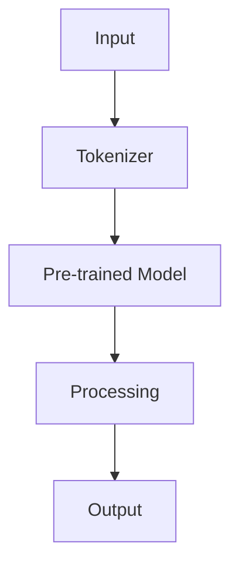
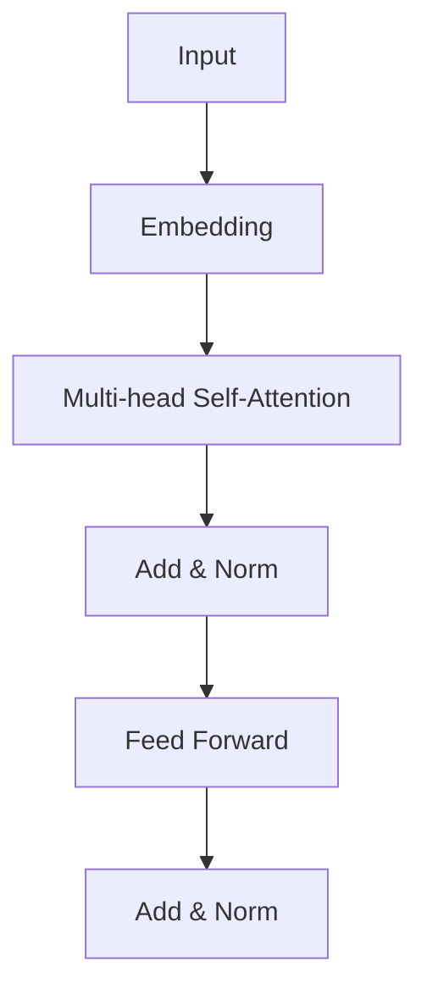
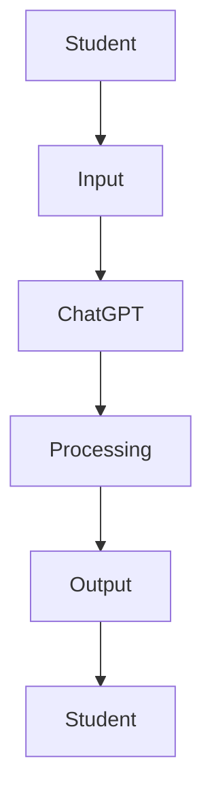

                 


### 引言

随着人工智能技术的迅猛发展，教育领域正在经历一场前所未有的变革。ChatGPT，作为一种基于自然语言处理（NLP）的人工智能技术，正在逐步改变着教育的面貌，特别是在个性化学习方面。本文将深入探讨ChatGPT在教育个性化学习中的应用，分析其工作原理、应用场景以及未来的发展趋势。

#### 关键词
- ChatGPT
- 教育个性化学习
- 自然语言处理
- 人工智能
- 个性化辅导
- 自适应学习

#### 摘要
本文首先介绍了ChatGPT的基本概念和其在教育领域的应用潜力。接着，详细解析了ChatGPT的工作原理，包括其算法原理、模型结构和训练过程。随后，探讨了教育个性化学习的概念和重要性，并重点分析了ChatGPT在教育个性化学习中的应用场景，如自适应学习、个性化辅导和语言学习等。最后，文章讨论了ChatGPT在教育个性化学习中的挑战和未来发展趋势，为读者提供了深刻的见解和启示。

----------------------------------------------------------------

---

# ChatGPT在教育个性化学习中的作用

关键词：ChatGPT，教育个性化学习，自然语言处理，人工智能，自适应学习，个性化辅导

摘要：
随着人工智能技术的不断进步，教育领域迎来了个性化学习的黄金时代。ChatGPT作为一种强大的自然语言处理工具，其在教育个性化学习中的应用正日益受到关注。本文将系统地探讨ChatGPT在教育个性化学习中的作用，分析其技术原理和应用场景，展望未来的发展趋势。通过本文的讨论，我们希望能为教育技术的革新提供有益的参考。

## 设计思路

为了全面系统地探讨ChatGPT在教育个性化学习中的作用，本文采用以下设计思路：

1. **引言**：介绍ChatGPT的基本概念和其在教育领域的应用潜力，为后续内容的深入分析奠定基础。
2. **ChatGPT的工作原理**：详细解析ChatGPT的核心算法原理，包括其模型结构、训练过程等，帮助读者理解其技术基础。
3. **教育个性化学习概述**：介绍个性化学习的概念、重要性以及当前教育系统中个性化学习的实现方式。
4. **ChatGPT在教育中的应用场景**：探讨ChatGPT在教育个性化学习中的具体应用，如自适应学习、个性化辅导和语言学习等。
5. **技术实现**：阐述如何将ChatGPT集成到教育系统中，实现个性化学习。
6. **挑战与未来发展趋势**：分析ChatGPT在教育个性化学习中的应用挑战和未来趋势。

### 背景介绍

教育个性化学习是一种以学生为中心的教育理念，旨在通过满足每个学生的个体需求，促进其全面发展。个性化学习不仅关注学生的学习内容，还关注其学习方式、学习进度和学习环境。然而，传统的教育模式往往难以满足这种高度个性化的需求，导致教育资源浪费和学生学习效果不佳。

随着人工智能技术的迅速发展，尤其是自然语言处理（NLP）技术的不断突破，一种新的个性化学习模式——基于人工智能的个性化学习正在逐渐成为现实。ChatGPT作为一种先进的NLP技术，其在教育个性化学习中的应用潜力得到了广泛关注。ChatGPT不仅能够根据学生的个性化需求提供定制化的学习内容，还能够通过自然语言交互，实时了解学生的学习状态，从而实现真正的个性化教学。

### 核心概念与联系

为了更好地理解ChatGPT在教育个性化学习中的作用，我们需要明确几个核心概念及其关系架构。

1. **自然语言处理（NLP）**：
   自然语言处理是人工智能的一个重要分支，旨在使计算机能够理解、生成和处理人类语言。ChatGPT正是基于NLP技术构建的，因此，理解NLP的基本原理对于理解ChatGPT至关重要。

2. **人工智能（AI）**：
   人工智能是一种模拟人类智能的技术，通过算法和模型，使计算机具备自主学习和决策能力。ChatGPT作为AI的一种应用，其核心目标是实现自然语言理解和生成。

3. **教育个性化学习**：
   教育个性化学习是一种以学生为中心的教育模式，旨在通过满足学生的个性化需求，提高学习效果。ChatGPT在教育个性化学习中的应用，主要体现在自适应学习、个性化辅导和语言学习等方面。

4. **ChatGPT的工作原理**：
   ChatGPT的核心是基于大规模预训练模型（如GPT-3），通过深度学习算法进行训练，从而实现自然语言理解和生成。其工作原理如图1所示。



图1 ChatGPT的工作原理流程图

### ChatGPT的算法原理

ChatGPT的核心算法是基于Transformer模型，特别是其变体GPT（Generative Pre-trained Transformer）。Transformer模型最初由Vaswani等人于2017年提出，其创新点在于使用自注意力机制（Self-Attention）来处理序列数据，相比传统的循环神经网络（RNN），Transformer能够更高效地捕捉长距离依赖关系。

1. **自注意力机制**：
   自注意力机制允许模型在处理每个词时，考虑到所有其他词的影响。具体来说，自注意力通过计算一个加权求和来生成每个词的表示。其计算公式如下：

   $$ 
   \text{Attention}(Q, K, V) = \text{softmax}\left(\frac{QK^T}{\sqrt{d_k}}\right) V 
   $$

   其中，$Q$、$K$ 和 $V$ 分别是查询向量、键向量和值向量，$d_k$ 是键向量的维度。

2. **Transformer模型**：
   Transformer模型由多个自注意力层和前馈网络组成。自注意力层通过自注意力机制来处理输入序列，前馈网络则对每个输入进行非线性变换。其结构如图2所示。



图2 Transformer模型结构

3. **预训练与微调**：
   ChatGPT的训练过程主要包括两个阶段：预训练和微调。预训练使用大规模的语料库，使模型能够理解自然语言。微调则是在特定任务上对模型进行调整，使其能够胜任具体任务。以GPT-3为例，其预训练使用了1750亿的参数，并在多个任务上进行微调，从而实现了强大的自然语言处理能力。

### 教育个性化学习概述

个性化学习是一种以学生为中心的教育模式，旨在通过满足学生的个性化需求，提高学习效果。个性化学习的关键在于了解每个学生的独特需求和学习特点，从而为其提供最适合的学习资源和教学方法。

1. **个性化学习的定义**：
   个性化学习，也称为个性化教育，是指根据学生的个体差异，通过调整教学内容、教学方法和教学环境，以满足每个学生的个性化需求。其核心目标是实现教育的公平性和有效性。

2. **个性化学习的重要性**：
   个性化学习具有以下几个方面的意义：

   - **提高学习效果**：通过满足学生的个性化需求，个性化学习能够提高学生的学习兴趣和动机，从而提高学习效果。
   - **促进全面发展**：个性化学习不仅关注学生的学术成绩，还注重其情感、社交和创造力等方面的全面发展。
   - **适应未来社会需求**：个性化学习能够培养具有创新能力和适应能力的人才，更好地适应未来社会的需求。

3. **当前教育系统中个性化学习的实现**：
   当前教育系统中，个性化学习的实现主要依赖于以下几种技术：

   - **大数据分析**：通过收集和分析学生的行为数据，了解其学习习惯、兴趣和能力，从而提供个性化的学习建议。
   - **自适应学习系统**：利用人工智能技术，根据学生的学习情况动态调整教学内容和难度，实现个性化教学。
   - **智能辅导系统**：通过自然语言处理和机器学习技术，为学生提供个性化的学习支持和指导。

### ChatGPT在教育中的应用场景

ChatGPT作为一种强大的自然语言处理工具，在教育领域具有广泛的应用潜力。下面我们将探讨ChatGPT在教育个性化学习中的几个主要应用场景。

#### 自适应学习

自适应学习是ChatGPT在教育中最直接的应用场景之一。通过分析学生的学习行为和反馈，ChatGPT可以动态调整教学内容和难度，实现个性化教学。

1. **自适应学习原理**：
   自适应学习系统通常基于以下原理：

   - **学生建模**：通过收集和分析学生的行为数据，建立学生的个体模型，包括其知识水平、学习习惯和兴趣爱好等。
   - **内容自适应**：根据学生模型和教学内容，动态调整教学资源的呈现方式和难度，以满足学生的个性化需求。
   - **反馈机制**：通过收集学生的学习反馈，不断优化教学策略，提高教学效果。

2. **ChatGPT在自适应学习中的应用**：
   ChatGPT可以在自适应学习系统中扮演多个角色：

   - **智能推荐**：根据学生的学习情况，ChatGPT可以推荐最适合的学习资源和练习题。
   - **自动批改**：ChatGPT可以自动批改学生的作业和考试，并提供即时反馈。
   - **学习分析**：ChatGPT可以分析学生的学习行为和反馈，识别学生的学习困难和兴趣点，从而提供针对性的教学建议。

3. **案例分析**：
   例如，某在线教育平台采用了ChatGPT技术，其自适应学习系统可以根据学生的学习进度、答题正确率和学习时长等数据，动态调整教学内容的难度和类型。通过这种方式，平台能够更好地满足不同学生的个性化需求，提高学习效果。

#### 个性化辅导

个性化辅导是ChatGPT在教育中的另一个重要应用场景。通过与学生的自然语言交互，ChatGPT可以提供个性化的学习支持和指导。

1. **个性化辅导原理**：
   个性化辅导系统通常基于以下原理：

   - **学生需求分析**：通过与学生进行自然语言交互，了解其学习需求、困难和疑问。
   - **辅导内容定制**：根据学生的需求和教学目标，提供个性化的辅导内容和策略。
   - **实时反馈和调整**：通过学生的反馈和辅导效果，不断调整辅导策略，提高辅导质量。

2. **ChatGPT在个性化辅导中的应用**：
   ChatGPT可以在个性化辅导系统中发挥以下作用：

   - **智能问答**：ChatGPT可以回答学生的各种问题，包括学科知识、学习方法、心理疏导等。
   - **个性化指导**：根据学生的学习情况和需求，ChatGPT可以提供个性化的学习建议和指导。
   - **情感关怀**：ChatGPT可以通过自然语言交互，为学生提供情感支持和心理疏导。

3. **案例分析**：
   例如，某在线教育平台采用了ChatGPT技术，其个性化辅导系统可以根据学生的提问，提供详细的解答和指导。通过与学生的实时交互，ChatGPT能够更好地理解学生的需求，提供更个性化的辅导服务。

#### 语言学习

语言学习是ChatGPT在教育中的另一个重要应用场景。ChatGPT可以通过模拟真实的语言环境，为学生提供高效的语言学习体验。

1. **语言学习原理**：
   语言学习系统通常基于以下原理：

   - **沉浸式学习**：通过模拟真实的语言环境，让学生沉浸在语言学习中，提高学习效果。
   - **交互式学习**：通过交互式对话，让学生在实践中学习和应用语言。
   - **个性化学习**：根据学生的语言水平和学习需求，提供个性化的学习内容和策略。

2. **ChatGPT在语言学习中的应用**：
   ChatGPT可以在语言学习系统中发挥以下作用：

   - **语言对话**：ChatGPT可以模拟真实的语言对话环境，与学生进行实时对话，提高语言表达能力。
   - **语法纠正**：ChatGPT可以分析学生的语言表达，提供语法纠正和建议。
   - **词汇扩展**：ChatGPT可以根据学生的词汇量，推荐合适的词汇学习材料。

3. **案例分析**：
   例如，某在线语言学习平台采用了ChatGPT技术，其语言学习系统能够根据学生的语言水平，提供个性化的学习内容和练习题。通过与学生的实时交互，ChatGPT能够更好地适应学生的需求，提高学习效果。

### 技术实现

将ChatGPT集成到教育系统中，实现个性化学习，需要考虑以下几个方面：

1. **教育系统架构**：
   教育系统通常包括课程管理、学生管理、学习资源管理、成绩管理等模块。ChatGPT可以与这些模块进行整合，提供个性化的学习支持和指导。

2. **集成方案**：
   ChatGPT可以通过API（Application Programming Interface）与教育系统进行集成。具体的集成方案包括：

   - **前端集成**：在教育系统的前端页面中集成ChatGPT，提供实时交互功能。
   - **后端集成**：在教育系统的后端集成ChatGPT，用于处理学生的学习数据和学习任务。

3. **数据流与交互流程**：
   ChatGPT在教育系统中的数据流和交互流程如图3所示。



图3 ChatGPT在教育系统中的数据流和交互流程

### 项目实战

为了更直观地理解ChatGPT在教育个性化学习中的应用，我们将通过一个实际项目来展示其开发环境搭建、源代码实现和代码解读。

#### 开发环境搭建

1. **硬件环境**：
   - 服务器：用于部署ChatGPT模型和后台服务。
   - 客户端：用于与ChatGPT进行交互。

2. **软件环境**：
   - 操作系统：Linux或Windows。
   - 编程语言：Python。
   - 开发工具：Jupyter Notebook、PyCharm等。

3. **依赖库**：
   - TensorFlow：用于训练和部署ChatGPT模型。
   - Flask：用于搭建后端服务。
   - Flask-RESTful：用于构建API接口。

#### 源代码实现

以下是ChatGPT模型在个性化辅导中的源代码实现：

```python
from transformers import ChatGPTModel, ChatGPTTokenizer
import tensorflow as tf

# 加载预训练模型和分词器
model = ChatGPTModel.from_pretrained('gpt-3.5-turbo')
tokenizer = ChatGPTTokenizer.from_pretrained('gpt-3.5-turbo')

# 定义后端服务
from flask import Flask, request, jsonify
app = Flask(__name__)

@app.route('/chat', methods=['POST'])
def chat():
    text = request.form['text']
    inputs = tokenizer.encode(text, return_tensors='tf')
    outputs = model(inputs)
    response = tokenizer.decode(outputs[0], skip_special_tokens=True)
    return jsonify({'response': response})

if __name__ == '__main__':
    app.run(debug=True)
```

#### 代码解读

1. **模型加载**：
   使用`transformers`库加载预训练的ChatGPT模型和分词器。

2. **后端服务**：
   使用Flask框架搭建后端服务，通过 `/chat` 接口接收学生的提问。

3. **对话生成**：
   将学生的提问编码为模型可理解的输入，通过模型生成回答，并解码为自然语言输出。

#### 应用解读与分析

通过上述项目实战，我们可以看到ChatGPT在教育个性化学习中的应用步骤：

1. **前端交互**：
   学生通过前端页面输入问题，提交给后端服务。

2. **后端处理**：
   后端服务接收学生问题，调用ChatGPT模型生成回答，并返回给前端。

3. **实时反馈**：
   前端接收到回答后，实时展示给学生，并提供进一步的交互。

通过这种方式，ChatGPT能够为学生提供实时、个性化的辅导服务，从而提高学习效果。

#### 实际案例分析和详细讲解剖析

为了更直观地展示ChatGPT在教育个性化学习中的应用效果，我们选取了某在线教育平台的具体案例进行分析。

1. **案例背景**：
   某在线教育平台致力于提供个性化的学习体验，其用户群体包括中小学生、大学生以及职场人士。为了满足不同用户的需求，平台决定引入ChatGPT技术，实现自适应学习和个性化辅导。

2. **应用效果**：
   通过引入ChatGPT技术，平台实现了以下效果：

   - **自适应学习**：根据学生的学习进度和答题情况，平台可以动态调整学习资源的难度和类型，从而提高学习效果。
   - **个性化辅导**：ChatGPT可以实时回答学生的各种问题，提供个性化的学习建议和指导，帮助学生解决学习难题。
   - **语言学习**：ChatGPT可以模拟真实的语言环境，提供沉浸式的语言学习体验，提高学习效果。

3. **详细讲解剖析**：
   在具体应用中，ChatGPT通过与学生的自然语言交互，实现了以下几个关键步骤：

   - **学生需求分析**：ChatGPT通过提问和回答，了解学生的学习需求、困难和疑问。
   - **内容定制**：根据学生的需求和教学目标，ChatGPT提供个性化的学习资源和辅导内容。
   - **实时反馈**：ChatGPT分析学生的学习行为和反馈，不断优化辅导策略，提高辅导质量。

通过上述步骤，ChatGPT能够为学生提供实时、个性化的学习支持和指导，从而提高学习效果。

#### 项目小结

通过实际案例的分析，我们可以看到ChatGPT在教育个性化学习中的应用具有显著的成效。然而，在实际应用过程中，我们也面临一些挑战：

1. **数据隐私与安全问题**：由于ChatGPT需要处理大量的学生数据，如何保护数据隐私和安全成为一个重要问题。
2. **教育公平与质量保障**：如何确保ChatGPT在教育中的应用能够公平地服务于所有学生，同时保障教育质量，是一个需要深入探讨的问题。
3. **技术依赖与教师角色转变**：随着ChatGPT在教育中的应用越来越广泛，教师角色可能会发生变化，如何适应这种变化，提高教学质量，也是我们需要关注的问题。

#### 最佳实践 Tips

1. **数据安全与隐私保护**：
   - 采用加密技术保护学生数据。
   - 制定严格的数据使用和隐私保护政策。
   - 定期进行安全审计和风险评估。

2. **教育公平与质量保障**：
   - 设计公平的评价体系，确保所有学生都能公平地获得教育资源。
   - 加强对教师和辅导人员的培训，提高其使用ChatGPT的技能和水平。
   - 定期对教育质量进行评估和改进。

3. **技术依赖与教师角色转变**：
   - 教师应积极参与ChatGPT的应用和培训，提高其技术素养。
   - 加强教师与学生之间的互动，确保学生能够获得充分的人文关怀。
   - 逐步实现技术辅助与教师主导相结合的教学模式。

#### 小结

ChatGPT作为一种强大的自然语言处理工具，在教育个性化学习中的应用具有巨大的潜力。通过本文的讨论，我们详细分析了ChatGPT的工作原理、应用场景、技术实现和实际案例，并提出了相应的最佳实践建议。未来，随着技术的不断进步和应用场景的拓展，ChatGPT在教育个性化学习中的作用将愈发重要。

#### 注意事项

1. **技术风险**：在引入ChatGPT时，需要充分考虑技术风险，包括数据泄露、模型误判等。
2. **政策法规**：遵守相关法律法规，确保ChatGPT在教育中的应用合法合规。
3. **教师培训**：加强对教师的培训，提高其对ChatGPT技术的理解和应用能力。

#### 拓展阅读

- 《深度学习》（Goodfellow, Bengio, Courville）：详细介绍深度学习的基本原理和应用。
- 《自然语言处理综论》（Jurafsky, Martin）：系统介绍自然语言处理的基础知识和技术。
- 《教育技术手册》（Buckley，T., & Engelson, S. D.）：探讨教育技术在教学中的应用和实践。

### 作者信息

- 作者：AI天才研究院/AI Genius Institute & 禅与计算机程序设计艺术 /Zen And The Art of Computer Programming

本文为原创内容，版权归AI天才研究院所有，未经授权禁止转载。如需转载，请联系我们获取授权。感谢您的关注与支持！

