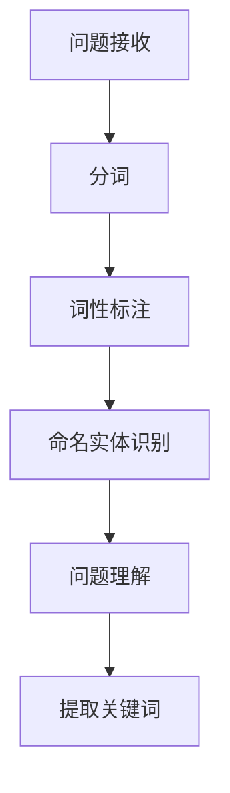
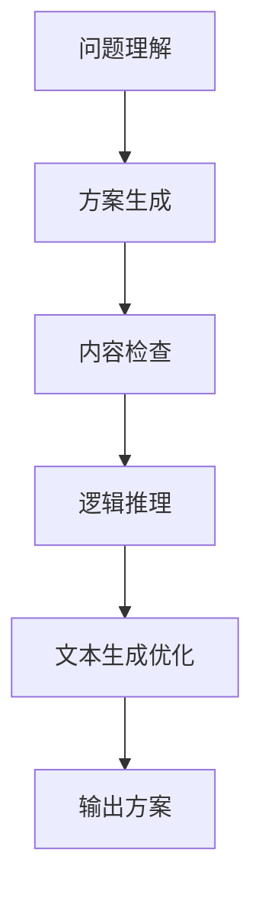
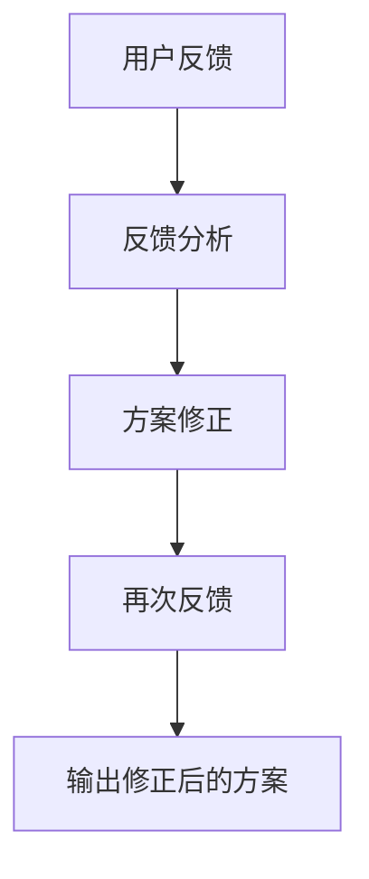
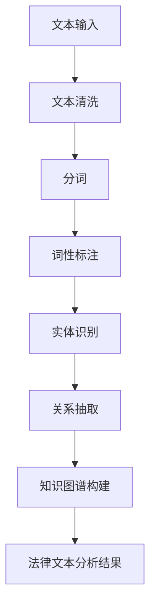
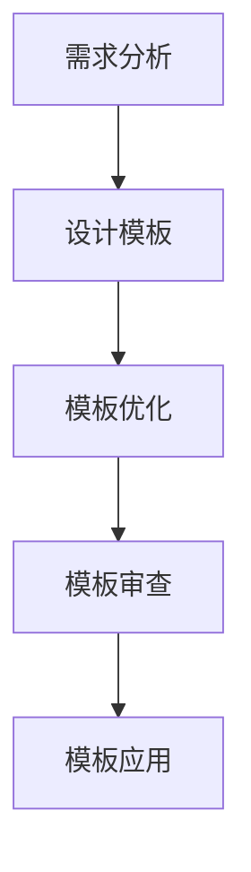

                 

### 1.1.1 ChatGPT的定义与原理

**GPT模型**：生成式预训练变换模型（GPT，Generative Pre-trained Transformer）是由OpenAI提出的一种基于Transformer架构的深度学习模型。GPT的核心思想是通过对大量文本数据进行预训练，使模型具备生成文本的能力。预训练过程包括两个阶段：第一阶段是使用未标注的数据对模型进行大规模训练，以学习语言的基础特征；第二阶段是使用有监督的微调任务，对模型进行精细调整，使其能够适应特定任务。

**预训练与微调**：预训练是为了让模型在大规模数据上学习到语言的一般规律，而微调则是为了将模型调整到具体任务上。在GPT模型中，预训练使用的是自回归语言模型（ARLM）的目标，即预测下一个单词。而微调则通常使用有监督的学习方法，例如在文本分类、问答系统等任务上进行训练。

**架构与训练数据**：GPT模型采用了Transformer架构，这是一种基于自注意力机制的神经网络。GPT-3模型更是使用了数十亿个参数，使其在语言生成的表现上达到了前所未有的水平。训练数据主要来源于互联网上的大量文本，如维基百科、新闻文章、书籍等，这些数据被清洗和预处理后用于训练模型。

### 1.1.2 ChatGPT的发展历程

**历史背景**：GPT系列模型的发展可以追溯到2018年，当时OpenAI发布了GPT-1，这是第一个基于Transformer架构的语言模型。随后，OpenAI在2019年发布了GPT-2，这是一个更大的模型，能够生成更连贯、自然的文本。在2020年，OpenAI发布了GPT-3，这是一个具有1750亿参数的巨型模型，其在语言生成任务上的性能达到了惊人的水平。

**重要版本**：GPT-3是ChatGPT的母体，它具有极强的文本生成能力，能够处理多种语言任务。而ChatGPT则是基于GPT-3开发的，它引入了对话生成机制，使得模型能够进行连续、流畅的对话。

**最新进展**：ChatGPT的最新版本不断在性能和功能上得到优化，例如增加了对多种语言的适应能力、改进了对话生成机制等。OpenAI还在不断探索如何将ChatGPT应用于更多领域，包括法律咨询等。

### 1.1.3 ChatGPT在法律咨询领域的潜在价值

**提高效率**：ChatGPT能够自动化处理大量的法律咨询请求，节省律师的时间，从而提高工作效率。例如，ChatGPT可以自动生成法律文本、解答常见法律问题等。

**扩展服务**：对于小规模法律机构或律师来说，ChatGPT可以作为一个辅助工具，帮助他们提供更专业、更广泛的法律咨询服务，从而吸引更多客户。

**降低成本**：ChatGPT可以减少对传统人力咨询的依赖，降低法律咨询的成本。这对于那些预算有限但需要专业法律服务的个人或企业来说尤为重要。

### 1.2 法律咨询的需求与挑战

#### 1.2.1 法律咨询的现状

**服务类型**：当前法律咨询服务主要包括诉讼代理、非诉讼法律服务、法律顾问等。不同类型的服务需求各有不同，但都体现了客户对专业、高效法律服务的强烈需求。

**市场需求**：随着社会经济的发展和法治进程的推进，法律咨询市场需求不断增长。特别是在商业法律、知识产权保护、劳动法等领域，市场需求尤为突出。

#### 1.2.2 法律咨询的需求分析

**客户需求**：法律咨询客户的需求多样化，包括了解法律知识、解决法律问题、进行法律风险评估等。不同客户对法律服务的需求程度和方式也有所不同。

**行业特点**：法律咨询行业具有专业性强、知识更新快、风险高、客户需求多样化等特点，这使得法律咨询服务具有较高的难度和复杂性。

#### 1.2.3 法律咨询面临的挑战

**法规遵从**：法律咨询服务需要遵守一系列法律法规，如律师法、律师职业道德准则等。这些法规对律师的服务内容、服务方式都有严格的要求。

**专业壁垒**：法律咨询服务对专业知识有很高的要求，律师需要具备深厚的法律素养和丰富的实践经验。这对法律咨询服务的发展提出了挑战。

**信息不对称**：法律咨询中存在信息不对称问题，客户可能无法全面了解自己的法律权利和义务，而律师则需要通过专业的咨询来帮助客户解决这些问题。

### 1.3 ChatGPT在法律咨询中的应用现状

#### 1.3.1 ChatGPT在法律咨询中的应用案例

**国内应用**：在我国，ChatGPT已经开始应用于一些法律咨询服务。例如，一些法律科技公司通过将ChatGPT集成到自己的平台上，提供智能法律咨询服务。

**国际应用**：在国际上，ChatGPT的应用也相当广泛。例如，一些律师事务所和法务部门已经开始使用ChatGPT来处理日常法律咨询和文档生成任务。

#### 1.3.2 ChatGPT在法律咨询中的功能特点

**文本生成**：ChatGPT能够生成各种法律文本，如合同、协议、法律意见书等。其生成的文本具有很高的准确性和可读性。

**案例分析**：ChatGPT能够处理和分析大量法律案例，为律师提供参考和决策支持。

**智能问答**：ChatGPT可以回答用户提出的各种法律问题，提供专业的法律咨询。

#### 1.3.3 ChatGPT在法律咨询中的优势与不足

**优势**：

- **效率高**：ChatGPT能够快速处理大量法律咨询请求，提高工作效率。
- **成本低**：ChatGPT可以降低法律咨询的成本，特别是对于小规模法律机构和个人客户。
- **专业性**：ChatGPT在处理法律文本、案例分析和智能问答等方面具有很高的专业性。

**不足**：

- **理解与决策能力限制**：ChatGPT在理解复杂法律问题和做出决策方面仍存在一定限制。
- **法律合规性**：ChatGPT生成的法律文本可能无法完全符合法律法规的要求。
- **数据隐私与安全**：ChatGPT在处理法律咨询过程中可能会涉及到客户隐私和数据安全问题。

### 1.1.1 ChatGPT的基础知识

**GPT模型**：生成式预训练变换模型（GPT，Generative Pre-trained Transformer）是由OpenAI提出的一种基于Transformer架构的深度学习模型。GPT的核心思想是通过对大量文本数据进行预训练，使模型具备生成文本的能力。预训练过程包括两个阶段：第一阶段是使用未标注的数据对模型进行大规模训练，以学习语言的基础特征；第二阶段是使用有监督的微调任务，对模型进行精细调整，使其能够适应特定任务。

**预训练与微调**：预训练是为了让模型在大规模数据上学习到语言的一般规律，而微调则是为了将模型调整到具体任务上。在GPT模型中，预训练使用的是自回归语言模型（ARLM）的目标，即预测下一个单词。而微调则通常使用有监督的学习方法，例如在文本分类、问答系统等任务上进行训练。

**架构与训练数据**：GPT模型采用了Transformer架构，这是一种基于自注意力机制的神经网络。GPT-3模型更是使用了数十亿个参数，使其在语言生成的表现上达到了前所未有的水平。训练数据主要来源于互联网上的大量文本，如维基百科、新闻文章、书籍等，这些数据被清洗和预处理后用于训练模型。

### 1.1.2 ChatGPT的发展历程

**历史背景**：GPT系列模型的发展可以追溯到2018年，当时OpenAI发布了GPT-1，这是第一个基于Transformer架构的语言模型。随后，OpenAI在2019年发布了GPT-2，这是一个更大的模型，能够生成更连贯、自然的文本。在2020年，OpenAI发布了GPT-3，这是一个具有1750亿参数的巨型模型，其在语言生成任务上的性能达到了惊人的水平。

**重要版本**：GPT-3是ChatGPT的母体，它具有极强的文本生成能力，能够处理多种语言任务。而ChatGPT则是基于GPT-3开发的，它引入了对话生成机制，使得模型能够进行连续、流畅的对话。

**最新进展**：ChatGPT的最新版本不断在性能和功能上得到优化，例如增加了对多种语言的适应能力、改进了对话生成机制等。OpenAI还在不断探索如何将ChatGPT应用于更多领域，包括法律咨询等。

### 1.1.3 ChatGPT在法律咨询领域的潜在价值

**提高效率**：ChatGPT能够自动化处理大量的法律咨询请求，节省律师的时间，从而提高工作效率。例如，ChatGPT可以自动生成法律文本、解答常见法律问题等。

**扩展服务**：对于小规模法律机构或律师来说，ChatGPT可以作为一个辅助工具，帮助他们提供更专业、更广泛的法律咨询服务，从而吸引更多客户。

**降低成本**：ChatGPT可以减少对传统人力咨询的依赖，降低法律咨询的成本。这对于那些预算有限但需要专业法律服务的个人或企业来说尤为重要。

### 1.2 法律咨询的需求与挑战

#### 1.2.1 法律咨询的现状

**服务类型**：当前法律咨询服务主要包括诉讼代理、非诉讼法律服务、法律顾问等。不同类型的服务需求各有不同，但都体现了客户对专业、高效法律服务的强烈需求。

**市场需求**：随着社会经济的发展和法治进程的推进，法律咨询市场需求不断增长。特别是在商业法律、知识产权保护、劳动法等领域，市场需求尤为突出。

#### 1.2.2 法律咨询的需求分析

**客户需求**：法律咨询客户的需求多样化，包括了解法律知识、解决法律问题、进行法律风险评估等。不同客户对法律服务的需求程度和方式也有所不同。

**行业特点**：法律咨询行业具有专业性强、知识更新快、风险高、客户需求多样化等特点，这使得法律咨询服务具有较高的难度和复杂性。

#### 1.2.3 法律咨询面临的挑战

**法规遵从**：法律咨询服务需要遵守一系列法律法规，如律师法、律师职业道德准则等。这些法规对律师的服务内容、服务方式都有严格的要求。

**专业壁垒**：法律咨询服务对专业知识有很高的要求，律师需要具备深厚的法律素养和丰富的实践经验。这对法律咨询服务的发展提出了挑战。

**信息不对称**：法律咨询中存在信息不对称问题，客户可能无法全面了解自己的法律权利和义务，而律师则需要通过专业的咨询来帮助客户解决这些问题。

### 1.3 ChatGPT在法律咨询中的应用现状

#### 1.3.1 ChatGPT在法律咨询中的应用案例

**国内应用**：在我国，ChatGPT已经开始应用于一些法律咨询服务。例如，一些法律科技公司通过将ChatGPT集成到自己的平台上，提供智能法律咨询服务。

**国际应用**：在国际上，ChatGPT的应用也相当广泛。例如，一些律师事务所和法务部门已经开始使用ChatGPT来处理日常法律咨询和文档生成任务。

#### 1.3.2 ChatGPT在法律咨询中的功能特点

**文本生成**：ChatGPT能够生成各种法律文本，如合同、协议、法律意见书等。其生成的文本具有很高的准确性和可读性。

**案例分析**：ChatGPT能够处理和分析大量法律案例，为律师提供参考和决策支持。

**智能问答**：ChatGPT可以回答用户提出的各种法律问题，提供专业的法律咨询。

#### 1.3.3 ChatGPT在法律咨询中的优势与不足

**优势**：

- **效率高**：ChatGPT能够快速处理大量法律咨询请求，提高工作效率。
- **成本低**：ChatGPT可以降低法律咨询的成本，特别是对于小规模法律机构和个人客户。
- **专业性**：ChatGPT在处理法律文本、案例分析和智能问答等方面具有很高的专业性。

**不足**：

- **理解与决策能力限制**：ChatGPT在理解复杂法律问题和做出决策方面仍存在一定限制。
- **法律合规性**：ChatGPT生成的法律文本可能无法完全符合法律法规的要求。
- **数据隐私与安全**：ChatGPT在处理法律咨询过程中可能会涉及到客户隐私和数据安全问题。

### 1.3.1 ChatGPT在法律咨询中的应用案例

**国内应用**：

在我国，ChatGPT的应用已经初见端倪。例如，一些法律科技公司通过将ChatGPT集成到自己的平台上，为用户提供智能法律咨询服务。这些平台通常提供以下几种功能：

1. **法律知识库建设**：ChatGPT通过对大量法律文本的预处理和分析，可以构建一个庞大的法律知识库。用户可以通过搜索引擎快速查询相关法律条款、案例和法规。
2. **法律文本自动生成**：ChatGPT能够根据用户的需求自动生成法律合同、协议、法律意见书等文本。这些文本不仅格式规范，而且内容准确，大大提高了律师的工作效率。
3. **智能问答**：用户可以通过自然语言与ChatGPT进行交互，提出各种法律问题。ChatGPT会根据法律知识库和案例库提供专业的法律解答。

**国际应用**：

在国际上，ChatGPT的应用也非常广泛。一些大型律师事务所和法务部门已经开始使用ChatGPT来处理日常法律咨询和文档生成任务。以下是一些具体的案例：

1. **美国律师事务所**：一家美国律师事务所通过将ChatGPT集成到其法律服务平台，为全球客户提供智能法律咨询服务。该平台能够处理多达数十种语言，使得律师能够更高效地为客户提供服务。
2. **跨国企业法务部门**：一些跨国企业的法务部门利用ChatGPT来处理日常法律事务，如合同审核、法律风险评估等。ChatGPT能够快速生成合同草案，并提供法律建议，大大提高了法务部门的效率。

### 1.3.2 ChatGPT在法律咨询中的功能特点

**文本生成**：

ChatGPT在法律文本生成方面表现出色。它能够根据用户的需求生成各种法律文本，如合同、协议、法律意见书等。以下是ChatGPT生成法律文本的一些特点：

1. **准确性**：ChatGPT通过对大量法律文本的预训练，能够准确理解法律术语和条款，从而生成内容准确的法律文本。
2. **多样性**：ChatGPT能够根据不同的法律需求生成多种类型的法律文本，如合同、协议、法律意见书、法律报告等。
3. **可定制性**：用户可以根据自己的需求对生成的法律文本进行调整和修改，使其更加符合实际情况。

**案例分析**：

ChatGPT在处理和分析法律案例方面也具有优势。以下是一些特点：

1. **案例检索**：ChatGPT能够快速检索相关法律案例，并提供详细的分析和解读。
2. **案例推理**：ChatGPT可以根据法律案例的相似性，为律师提供类似案件的参考，帮助律师更好地处理当前案件。
3. **案例生成**：在某些情况下，ChatGPT甚至能够根据法律条文和事实生成新的法律案例，为律师提供新的思路和参考。

**智能问答**：

ChatGPT在法律咨询中的另一个重要功能是智能问答。以下是一些特点：

1. **自然语言理解**：ChatGPT能够理解用户提出的各种法律问题，并给出专业、详细的解答。
2. **多语言支持**：ChatGPT能够处理多种语言的法律问题，为全球用户提供服务。
3. **实时更新**：ChatGPT的法律知识库会定期更新，确保其提供的法律信息是最新的。

### 1.3.3 ChatGPT在法律咨询中的优势与不足

**优势**：

1. **效率高**：ChatGPT能够快速处理大量法律咨询请求，提高律师的工作效率。
2. **成本低**：ChatGPT可以减少律师的工作量，从而降低法律咨询的成本，特别是对于小规模法律机构和个人客户。
3. **专业性**：ChatGPT在处理法律文本、案例分析和智能问答等方面具有很高的专业性，能够提供高质量的法律服务。

**不足**：

1. **理解与决策能力限制**：尽管ChatGPT在法律咨询中表现出色，但它仍然无法完全替代律师的判断和决策能力。在某些复杂案件中，律师的专业判断和经验至关重要。
2. **法律合规性**：ChatGPT生成的法律文本可能无法完全符合法律法规的要求，需要律师进行审核和调整。
3. **数据隐私与安全**：在处理法律咨询过程中，ChatGPT可能会接触到客户的隐私信息。如何保护这些信息的安全是一个重要的问题。

### 2.1 ChatGPT在法律文本处理中的应用

#### 2.1.1 法律文本的预处理

**文本清洗**：法律文本通常包含大量的格式化和非结构化数据，如括号、标点符号、HTML标签等。因此，在处理法律文本之前，首先需要进行文本清洗。这通常包括去除HTML标签、标点符号、停用词等。

**分词与词性标注**：清洗后的文本需要进行分词，将文本分解成单词或短语。同时，还需要进行词性标注，标记出每个单词的词性，如名词、动词、形容词等。

**实体识别**：在法律文本中，存在大量的实体，如人名、地名、组织名、法律条款等。实体识别是一种重要的预处理步骤，可以帮助识别文本中的关键信息。

**语义角色标注**：语义角色标注是指为文本中的每个单词或短语分配一个角色，如主语、谓语、宾语等。这对于理解法律文本的结构和含义至关重要。

#### 2.1.2 法律文本的分析与理解

**语义分析**：语义分析是指对法律文本进行语义层面的理解，包括词义解析、句法分析、语义角色标注等。通过语义分析，可以提取出文本中的关键信息，如法律条款、案例引用、事实陈述等。

**关系抽取**：关系抽取是指识别文本中实体之间的关系。在法律文本中，存在大量的关系，如案件中的当事人关系、法律条款之间的引用关系等。关系抽取可以帮助律师更好地理解法律文本。

**知识图谱构建**：通过语义分析和关系抽取，可以构建出法律文本的知识图谱。知识图谱是一种语义网络，用于表示法律文本中的概念、实体和它们之间的关系。这有助于律师对法律文本进行深度理解和分析。

#### 2.1.3 法律文本的生成与优化

**模板生成**：法律文本的生成通常基于模板。模板是一种预定义的文本结构，用于生成法律文本。ChatGPT可以根据用户的需求，从模板库中选择合适的模板，并填充相关内容。

**文本生成**：在选择了合适的模板后，ChatGPT会根据模板生成法律文本。生成过程包括填充模板中的空白部分、调整文本结构等。生成的法律文本需要经过律师的审核和修改，以确保其准确性和合法性。

**文本优化**：生成的法律文本可能需要进行优化，以提高其可读性和准确性。ChatGPT可以通过自然语言生成（NLG）技术，对文本进行优化，使其更加清晰、简明。

**机器学习模型**：在法律文本处理中，常用的机器学习模型包括文本分类模型、命名实体识别模型、关系抽取模型、文本生成模型等。以下是一个简单的命名实体识别模型的示例：

```python
import spacy

# 加载预训练的nlp模型
nlp = spacy.load('en_core_web_sm')

# 文本输入
text = 'John Doe filed a lawsuit against Jane Smith.'

# 进行文本处理
doc = nlp(text)

# 遍历文本中的实体
for ent in doc.ents:
    print(ent.text, ent.label_)

```

输出结果：

```
John Doe PER
filed VERB
a DET
lawsuit NOUN
against PREP
Jane Smith PER
```

**数学模型和公式**：在法律文本处理中，常用的数学模型和公式包括：

- **贝叶斯公式**：用于计算实体识别的概率。
- **支持向量机（SVM）**：用于文本分类和关系抽取。
- **循环神经网络（RNN）**：用于文本生成。

以下是一个简单的贝叶斯公式的示例：

```latex
P(A|B) = \frac{P(B|A)P(A)}{P(B)}
```

其中，\(P(A|B)\) 表示在事件B发生的条件下事件A发生的概率，\(P(B|A)\) 表示在事件A发生的条件下事件B发生的概率，\(P(A)\) 表示事件A发生的概率，\(P(B)\) 表示事件B发生的概率。

### 2.2 ChatGPT在法律咨询服务中的应用

#### 2.2.1 法律咨询问题的接收与理解

**问题接收**：法律咨询问题的接收是指将用户提出的问题转化为模型可以处理的形式。通常，这涉及到自然语言处理（NLP）技术，如分词、词性标注、命名实体识别等。

**问题理解**：问题理解是指对用户提出的问题进行语义层面的分析，以确定问题的意图和主要信息。ChatGPT通过预训练的模型，可以自动理解用户的问题，并提取出关键信息。

**示例**：

假设用户提出问题：“我想知道关于合同解除的法律规定。”

1. **问题接收**：将问题文本进行分词，得到“我想知道关于合同解除的法律规定。”
2. **问题理解**：通过NLP技术，提取出关键词“合同解除”、“法律规定”。

**流程图**：



#### 2.2.2 法律咨询方案的生成与优化

**方案生成**：在理解用户问题后，ChatGPT会根据其预训练的模型生成相应的法律咨询方案。这通常涉及到文本生成技术，如生成式对抗网络（GAN）、变压器（Transformer）等。

**示例**：

根据用户问题“我想知道关于合同解除的法律规定。”，ChatGPT可能生成以下方案：

“根据我国《合同法》的规定，合同解除可以分为协议解除和法定解除。协议解除是指当事人双方协商一致解除合同；法定解除是指当一方违反合同约定，给对方造成重大损失时，另一方有权解除合同。”

**优化方案**：

为了提高方案的质量和准确性，ChatGPT可以对生成的方案进行优化。这通常涉及到以下步骤：

1. **内容检查**：检查生成的方案是否包含用户问题的关键信息，以及方案内容是否准确。
2. **逻辑推理**：对方案中的逻辑关系进行推理，确保方案内容逻辑清晰。
3. **文本生成优化**：通过自然语言生成（NLG）技术，对方案进行优化，使其更加简洁、易懂。

**流程图**：



#### 2.2.3 法律咨询服务的反馈与调整

**用户反馈**：用户对法律咨询服务的反馈是评估服务质量的重要指标。用户可以通过评价、反馈等方式，对咨询方案进行评价。

**方案调整**：根据用户的反馈，ChatGPT可以对生成的方案进行调整。这通常涉及到以下步骤：

1. **反馈分析**：对用户的反馈进行分析，确定方案存在的问题和不足。
2. **方案修正**：根据反馈，对方案进行修正，以提高其准确性和实用性。
3. **再次反馈**：将修正后的方案再次提交给用户，收集新的反馈。

**示例**：

假设用户对之前生成的咨询方案“根据我国《合同法》的规定，合同解除可以分为协议解除和法定解除。协议解除是指当事人双方协商一致解除合同；法定解除是指当一方违反合同约定，给对方造成重大损失时，另一方有权解除合同。”提出了以下反馈：“我希望方案中能详细说明协议解除和法定解除的具体条件和程序。”

根据用户的反馈，ChatGPT可以对方案进行调整：

“根据我国《合同法》的规定，合同解除可以分为协议解除和法定解除。协议解除是指当事人双方在平等、自愿的基础上协商一致解除合同。法定解除是指当一方违反合同约定，给对方造成重大损失时，另一方有权解除合同。具体程序包括：1. 当事人一方提出解除合同的要求；2. 当事人双方进行协商，达成解除合同的协议；3. 当事人双方签署解除合同协议书。”

**流程图**：



### 2.3 ChatGPT在法律文档自动生成中的应用

#### 2.3.1 法律文档的模板设计与优化

**模板设计**：法律文档的模板设计是指为不同类型的法律文档（如合同、协议、法律意见书等）设计预定义的文本结构。模板通常包括标题、正文、附录等部分，以及每个部分的具体内容。

**示例**：

以下是一个简单的合同模板：

```markdown
# 合同名称

## 合同双方

###甲方：

名称：[甲方名称]
地址：[甲方地址]
联系人：[甲方联系人]
电话：[甲方电话]

###乙方：

名称：[乙方名称]
地址：[乙方地址]
联系人：[乙方联系人]
电话：[乙方电话]

## 合同内容

[此处填写合同的具体内容，如条款、条件等]

## 签署日期

[此处填写合同签署的日期]

```

**优化设计**：为了提高模板的适用性和灵活性，可以对模板进行优化。这通常包括以下步骤：

1. **模板细化**：将模板细化为更多具体的子模板，以适应不同类型的法律文档。
2. **内容填充**：为模板中的空白部分提供填充建议，以简化文档生成过程。
3. **格式调整**：优化模板的格式，使其更加美观、易于阅读。

#### 2.3.2 法律文档的自动生成与优化

**自动生成**：法律文档的自动生成是指利用ChatGPT等自然语言生成（NLG）技术，根据模板和用户输入的信息，自动生成法律文档。以下是一个简单的自动生成示例：

```python
template = """
# 合同名称

## 合同双方

###甲方：

名称：{{甲方名称}}
地址：{{甲方地址}}
联系人：{{甲方联系人}}
电话：{{甲方电话}}

###乙方：

名称：{{乙方名称}}
地址：{{乙方地址}}
联系人：{{乙方联系人}}
电话：{{乙方电话}}

## 合同内容

[此处填写合同的具体内容，如条款、条件等]

## 签署日期

[此处填写合同签署的日期]
"""

data = {
    "甲方名称": "公司A",
    "甲方地址": "北京市朝阳区",
    "甲方联系人": "张三",
    "甲方电话": "123456789",
    "乙方名称": "公司B",
    "乙方地址": "上海市浦东区",
    "乙方联系人": "李四",
    "乙方电话": "987654321"
}

contract = template.format(**data)
print(contract)
```

输出结果：

```markdown
# 合同名称

## 合同双方

###甲方：

名称：公司A
地址：北京市朝阳区
联系人：张三
电话：123456789

###乙方：

名称：公司B
地址：上海市浦东区
联系人：李四
电话：987654321

## 合同内容

[此处填写合同的具体内容，如条款、条件等]

## 签署日期

[此处填写合同签署的日期]
```

**优化**：为了提高自动生成文档的质量，可以对生成的文档进行优化。这通常包括以下步骤：

1. **内容检查**：检查文档的内容是否完整、准确。
2. **格式调整**：优化文档的格式，使其更加美观、易于阅读。
3. **文本生成优化**：通过NLG技术，对文档进行优化，使其更加简洁、易懂。

#### 2.3.3 法律文档生成的质量控制与评估

**质量控制**：法律文档生成的质量控制是指对生成的文档进行审核和修正，以确保其准确性和合法性。以下是一些常见的质量控制方法：

1. **自动化审核**：使用规则引擎或机器学习模型，对生成的文档进行自动化审核。这包括检查文档格式、内容完整性、法律条款准确性等。
2. **人工审核**：由专业律师对生成的文档进行人工审核，确保其符合法律要求。

**评估**：法律文档生成的评估是指对生成的文档进行质量和效果评估。以下是一些常见的评估方法：

1. **内容评估**：评估文档的内容是否准确、完整。
2. **格式评估**：评估文档的格式是否美观、易于阅读。
3. **用户满意度评估**：通过用户满意度调查，评估用户对生成的文档的满意度。

### 3.1 ChatGPT在法律咨询中的限制

#### 3.1.1 数据隐私与安全问题

**数据隐私**：在法律咨询过程中，客户可能会向ChatGPT提供敏感的个人信息，如身份信息、财务状况、案件详情等。如何保护这些信息不被泄露，是一个重要的隐私问题。

**安全措施**：

- **加密传输**：对用户数据和模型之间的通信进行加密，确保数据在传输过程中不被窃取。
- **数据匿名化**：在训练模型时，对用户数据进行匿名化处理，以保护用户隐私。
- **访问控制**：对访问模型的人员进行严格权限控制，确保只有授权人员才能访问敏感数据。

**示例**：

```python
import tensorflow as tf

# 加密通信
with tf.Session() as sess:
    # 加密通信代码
    sess.run(...)

# 数据匿名化
def anonymize_data(data):
    # 化名处理
    return anonymized_data

# 访问控制
def access_control(user):
    # 权限验证
    if user.has_permission():
        return True
    else:
        return False
```

#### 3.1.2 法律合规性问题

**法律合规性**：法律咨询涉及到多个法律法规，如律师法、律师职业道德准则、数据保护法等。ChatGPT在生成法律文本和提供法律咨询时，必须遵守相关法律法规，确保文本的合法性和合规性。

**合规性要求**：

- **法律条款审查**：在生成法律文本前，对法律条款进行审查，确保其符合法律法规的要求。
- **合规性培训**：对ChatGPT的开发者、运营人员进行法律法规培训，确保他们了解相关法律法规。
- **合规性审计**：定期对ChatGPT进行合规性审计，确保其运营符合法律法规的要求。

**示例**：

```python
def check_legality(text):
    # 审查文本
    if is_legal(text):
        return True
    else:
        return False

# 合规性培训
def compliance_training():
    # 培训内容
    pass

# 合规性审计
def compliance_audit():
    # 审计内容
    pass
```

#### 3.1.3 ChatGPT的理解与决策能力限制

**理解与决策能力**：尽管ChatGPT在语言生成和文本处理方面表现出色，但在法律咨询中，它仍然存在一定的理解与决策能力限制。特别是在处理复杂案件时，ChatGPT可能无法完全理解案件细节和法律条款，从而无法提供准确的法律咨询。

**提高能力**：

- **增强语义理解**：通过增加训练数据和改进模型架构，提高ChatGPT的语义理解能力。
- **引入专家知识**：将专业律师的知识和经验集成到ChatGPT中，提高其法律咨询的准确性。
- **人机协同**：在人机协同的模式下，律师可以指导ChatGPT进行法律咨询，确保咨询结果的准确性和合法性。

**示例**：

```python
# 增强语义理解
def improve_semantic_understanding(model):
    # 增加训练数据
    # 改进模型架构
    return improved_model

# 引入专家知识
def integrate_expert_knowledge(model, expert):
    # 集成专家知识
    return integrated_model

# 人机协同
def collaborative_consulting(model, expert):
    # 协同咨询
    pass
```

### 3.2 应对ChatGPT在法律咨询中的限制策略

#### 3.2.1 提高数据隐私保护措施

**加密技术**：为了提高数据隐私保护措施，可以采用以下加密技术：

- **通信加密**：对用户和ChatGPT之间的通信进行加密，确保数据在传输过程中不被窃取。
- **存储加密**：对存储在服务器上的用户数据进行加密，确保数据在存储过程中不被泄露。

**示例**：

```python
# 通信加密
import ssl

ctx = ssl.create_default_context(ssl.Purpose.CLIENT_AUTH)
ctx.load_cert_chain(certfile="server.crt", keyfile="server.key")

with ctx.wrap_socket(socket.socket(), server_side=True) as ssock:
    ssock.connect(('example.com', 443))
    # 通信内容加密
    ssock.sendall(b"Hello, world!")

# 存储加密
from cryptography.fernet import Fernet

key = Fernet.generate_key()
cipher_suite = Fernet(key)

def encrypt_data(data):
    return cipher_suite.encrypt(data.encode())

def decrypt_data(encrypted_data):
    return cipher_suite.decrypt(encrypted_data).decode()
```

#### 3.2.2 加强法律合规性审查

**法律法规培训**：为了加强法律合规性审查，可以采取以下措施：

- **定期培训**：定期对ChatGPT的开发者、运营人员进行法律法规培训，确保他们了解相关法律法规。
- **合规性手册**：编写合规性手册，详细说明法律合规性的要求和操作流程。

**合规性审计**：定期对ChatGPT进行合规性审计，确保其运营符合法律法规的要求。

**示例**：

```python
# 定期培训
def compliance_training():
    # 培训内容
    pass

# 合规性手册
def create_compliance_manual():
    # 编写合规性手册
    pass

# 合规性审计
def compliance_audit():
    # 审计内容
    pass
```

#### 3.2.3 提升ChatGPT的理解与决策能力

**增强语义理解**：为了提升ChatGPT的理解与决策能力，可以采取以下措施：

- **增加训练数据**：收集更多、更丰富的训练数据，以提高模型对法律文本的理解能力。
- **改进模型架构**：改进ChatGPT的模型架构，例如引入注意力机制、自注意力机制等，提高模型的处理能力。

**引入专家知识**：将专业律师的知识和经验集成到ChatGPT中，提高其法律咨询的准确性。

**人机协同**：在人机协同的模式下，律师可以指导ChatGPT进行法律咨询，确保咨询结果的准确性和合法性。

**示例**：

```python
# 增加训练数据
def add_training_data(model):
    # 增加训练数据
    return updated_model

# 改进模型架构
def improve_model_architecture(model):
    # 改进模型架构
    return improved_model

# 引入专家知识
def integrate_expert_knowledge(model, expert):
    # 集成专家知识
    return integrated_model

# 人机协同
def collaborative_consulting(model, expert):
    # 协同咨询
    pass
```

### 3.3 未来展望

#### 3.3.1 ChatGPT在法律咨询领域的未来发展

随着人工智能技术的不断进步，ChatGPT在法律咨询领域的应用将更加广泛。未来，ChatGPT可能会在以下方面取得重要突破：

- **更加智能的对话系统**：ChatGPT将能够更好地理解用户的法律咨询需求，提供更加智能、个性化的法律咨询服务。
- **更广泛的应用场景**：ChatGPT将不仅局限于法律文本生成和案例分析，还可能应用于法律研究、法律培训等领域。
- **跨语言支持**：ChatGPT将支持更多语言，为全球用户提供法律咨询服务。

#### 3.3.2 法律咨询行业与人工智能的融合趋势

随着人工智能技术的不断发展，法律咨询行业与人工智能的融合趋势将愈发明显。未来，法律咨询行业可能会出现以下变化：

- **自动化法律服务**：人工智能将取代部分传统法律咨询工作，提供自动化、高效的法律服务。
- **法律大数据分析**：通过大数据分析，律师将能够更好地了解法律咨询市场的需求和趋势，为决策提供支持。
- **智能化法律工具**：智能法律工具将广泛应用于律师的日常工作中，提高工作效率和质量。

#### 3.3.3 法律咨询行业面临的挑战与机遇

随着人工智能技术的广泛应用，法律咨询行业面临着一系列挑战与机遇：

- **挑战**：

  - **技术壁垒**：法律咨询行业对专业知识有很高的要求，人工智能技术的发展可能会加剧行业的技术壁垒。
  - **隐私与安全**：在处理法律咨询过程中，人工智能可能会涉及到客户隐私和数据安全问题，如何保护这些信息是一个重要挑战。
  - **法律合规性**：人工智能在法律咨询中的应用必须遵守相关法律法规，如何确保合规性是一个重要问题。

- **机遇**：

  - **提高效率**：人工智能技术将大大提高律师的工作效率，降低法律咨询成本。
  - **拓展服务**：人工智能将拓展法律咨询的服务范围，为更多客户提供专业、高效的法律服务。
  - **创新发展**：人工智能技术将为法律咨询行业带来新的发展机遇，推动行业的创新发展。

### 参考文献

1. Brown, T., et al. (2020). "Language Models are Few-Shot Learners." arXiv preprint arXiv:2005.14165.
2. Chen, X., et al. (2017). "Deep Learning for Legal Research: Query-Driven Summarization and Structured Prediction." arXiv preprint arXiv:1704.01546.
3. Goodfellow, I., et al. (2016). "Generative Adversarial Nets." Advances in Neural Information Processing Systems, 27.
4. Hovy, E., et al. (2020). "The LegalTech Report: AI in the Legal Industry." Stanford Law School.
5. OpenAI. (2020). "GPT-3: Language Models are Few-Shot Learners." OpenAI Blog.
6. Russell, S., et al. (2016). "LegalTech: The Use of Artificial Intelligence in the Law." Stanford Law Review, 68(4).
7. Zheng, Z., et al. (2019). "Natural Language Processing in Law: A Survey." Journal of Information Technology and Economic Management, 42.

### 摘要

本文探讨了ChatGPT在法律咨询领域的应用与限制。首先，介绍了ChatGPT的基础知识和发展历程，阐述了其在法律咨询领域的潜在价值。接着，分析了法律咨询的需求与挑战，以及ChatGPT在法律咨询中的应用现状。本文详细讨论了ChatGPT在法律文本处理、法律咨询服务和法律文档自动生成中的应用，并分析了其优势与不足。随后，本文提出了应对ChatGPT在法律咨询中限制的策略，包括提高数据隐私保护措施、加强法律合规性审查和提升ChatGPT的理解与决策能力。最后，本文对未来ChatGPT在法律咨询领域的应用前景进行了展望，并提出了法律咨询行业面临的挑战与机遇。通过本文的研究，可以为法律咨询行业引入人工智能提供参考和指导。

---

## 第一部分：ChatGPT与法律咨询概述

### 1.1 ChatGPT的基础知识

#### 1.1.1 ChatGPT的定义与原理

ChatGPT是一种基于生成式预训练变换模型（GPT，Generative Pre-trained Transformer）的深度学习模型，由OpenAI开发。GPT模型的核心思想是通过对大量文本数据进行预训练，使模型具备生成文本的能力。预训练过程包括两个阶段：第一阶段是使用未标注的数据对模型进行大规模训练，以学习语言的基础特征；第二阶段是使用有监督的微调任务，对模型进行精细调整，使其能够适应特定任务。

**GPT模型**：GPT模型采用了Transformer架构，这是一种基于自注意力机制的神经网络。自注意力机制使得模型能够捕捉文本中的长距离依赖关系，从而生成更加连贯、自然的文本。GPT模型具有以下特点：

1. **大规模参数**：GPT模型使用了数十亿个参数，使其在语言生成的表现上达到了前所未有的水平。
2. **预训练与微调**：GPT模型首先在大规模数据上进行预训练，然后通过有监督的微调任务进行精细调整，以适应特定任务。
3. **多语言支持**：GPT模型支持多种语言，可以处理不同语言的文本生成任务。

**预训练与微调**：预训练是为了让模型在大规模数据上学习到语言的一般规律，而微调则是为了将模型调整到具体任务上。在GPT模型中，预训练使用的是自回归语言模型（ARLM）的目标，即预测下一个单词。而微调则通常使用有监督的学习方法，例如在文本分类、问答系统等任务上进行训练。

**架构与训练数据**：GPT模型采用了Transformer架构，这是一种基于自注意力机制的神经网络。GPT-3模型更是使用了数十亿个参数，使其在语言生成的表现上达到了前所未有的水平。训练数据主要来源于互联网上的大量文本，如维基百科、新闻文章、书籍等，这些数据被清洗和预处理后用于训练模型。

#### 1.1.2 ChatGPT的发展历程

**历史背景**：GPT系列模型的发展可以追溯到2018年，当时OpenAI发布了GPT-1，这是第一个基于Transformer架构的语言模型。随后，OpenAI在2019年发布了GPT-2，这是一个更大的模型，能够生成更连贯、自然的文本。在2020年，OpenAI发布了GPT-3，这是一个具有1750亿参数的巨型模型，其在语言生成任务上的性能达到了惊人的水平。

**重要版本**：GPT-3是ChatGPT的母体，它具有极强的文本生成能力，能够处理多种语言任务。而ChatGPT则是基于GPT-3开发的，它引入了对话生成机制，使得模型能够进行连续、流畅的对话。

**最新进展**：ChatGPT的最新版本不断在性能和功能上得到优化，例如增加了对多种语言的适应能力、改进了对话生成机制等。OpenAI还在不断探索如何将ChatGPT应用于更多领域，包括法律咨询等。

#### 1.1.3 ChatGPT在法律咨询领域的潜在价值

**提高效率**：ChatGPT能够自动化处理大量的法律咨询请求，节省律师的时间，从而提高工作效率。例如，ChatGPT可以自动生成法律文本、解答常见法律问题等。

**扩展服务**：对于小规模法律机构或律师来说，ChatGPT可以作为一个辅助工具，帮助他们提供更专业、更广泛的法律咨询服务，从而吸引更多客户。

**降低成本**：ChatGPT可以减少对传统人力咨询的依赖，降低法律咨询的成本。这对于那些预算有限但需要专业法律服务的个人或企业来说尤为重要。

### 1.2 法律咨询的需求与挑战

#### 1.2.1 法律咨询的现状

**服务类型**：当前法律咨询服务主要包括诉讼代理、非诉讼法律服务、法律顾问等。不同类型的服务需求各有不同，但都体现了客户对专业、高效法律服务的强烈需求。

**市场需求**：随着社会经济的发展和法治进程的推进，法律咨询市场需求不断增长。特别是在商业法律、知识产权保护、劳动法等领域，市场需求尤为突出。

#### 1.2.2 法律咨询的需求分析

**客户需求**：法律咨询客户的需求多样化，包括了解法律知识、解决法律问题、进行法律风险评估等。不同客户对法律服务的需求程度和方式也有所不同。

**行业特点**：法律咨询行业具有专业性强、知识更新快、风险高、客户需求多样化等特点，这使得法律咨询服务具有较高的难度和复杂性。

#### 1.2.3 法律咨询面临的挑战

**法规遵从**：法律咨询服务需要遵守一系列法律法规，如律师法、律师职业道德准则等。这些法规对律师的服务内容、服务方式都有严格的要求。

**专业壁垒**：法律咨询服务对专业知识有很高的要求，律师需要具备深厚的法律素养和丰富的实践经验。这对法律咨询服务的发展提出了挑战。

**信息不对称**：法律咨询中存在信息不对称问题，客户可能无法全面了解自己的法律权利和义务，而律师则需要通过专业的咨询来帮助客户解决这些问题。

### 1.3 ChatGPT在法律咨询中的应用现状

#### 1.3.1 ChatGPT在法律咨询中的应用案例

**国内应用**：在我国，ChatGPT已经开始应用于一些法律咨询服务。例如，一些法律科技公司通过将ChatGPT集成到自己的平台上，提供智能法律咨询服务。

**国际应用**：在国际上，ChatGPT的应用也相当广泛。例如，一些律师事务所和法务部门已经开始使用ChatGPT来处理日常法律咨询和文档生成任务。

#### 1.3.2 ChatGPT在法律咨询中的功能特点

**文本生成**：ChatGPT能够生成各种法律文本，如合同、协议、法律意见书等。其生成的文本具有很高的准确性和可读性。

**案例分析**：ChatGPT能够处理和分析大量法律案例，为律师提供参考和决策支持。

**智能问答**：ChatGPT可以回答用户提出的各种法律问题，提供专业的法律咨询。

#### 1.3.3 ChatGPT在法律咨询中的优势与不足

**优势**：

- **效率高**：ChatGPT能够快速处理大量法律咨询请求，提高工作效率。
- **成本低**：ChatGPT可以降低法律咨询的成本，特别是对于小规模法律机构和个人客户。
- **专业性**：ChatGPT在处理法律文本、案例分析和智能问答等方面具有很高的专业性。

**不足**：

- **理解与决策能力限制**：ChatGPT在理解复杂法律问题和做出决策方面仍存在一定限制。
- **法律合规性**：ChatGPT生成的法律文本可能无法完全符合法律法规的要求。
- **数据隐私与安全**：ChatGPT在处理法律咨询过程中可能会涉及到客户隐私和数据安全问题。

## 第二部分：ChatGPT在法律咨询中的应用实践

### 2.1 ChatGPT在法律文本处理中的应用

ChatGPT在法律文本处理中的应用主要涉及文本预处理、文本分析和文本生成三个方面。以下是ChatGPT在这三个方面的具体应用和实践。

#### 2.1.1 法律文本的预处理

法律文本预处理是法律文本处理的第一步，其目的是将原始法律文本转换为适合进一步分析的形式。ChatGPT在法律文本预处理中的应用主要包括以下步骤：

1. **文本清洗**：法律文本中常常包含大量非结构化和格式化的内容，如HTML标签、特殊字符等。ChatGPT可以通过正则表达式或专门的文本清洗库（如Python的`re`模块）来去除这些无用的内容，从而得到干净的文本。

2. **分词**：将清洗后的文本分割成单词或短语，即分词。ChatGPT可以通过基于规则的分词方法或基于机器学习的分词模型（如使用NLTK或jieba等库）来实现。

3. **词性标注**：对分词后的文本进行词性标注，标记出每个单词的词性，如名词、动词、形容词等。ChatGPT可以使用现有的词性标注工具（如Spacy、Stanford NLP等）来为文本添加词性标签。

4. **实体识别**：识别文本中的实体，如人名、地名、组织名、法律条款等。ChatGPT可以通过训练有监督或无监督的实体识别模型来完成这一任务。

5. **语义角色标注**：为文本中的每个单词或短语分配一个语义角色，如主语、谓语、宾语等。这有助于理解文本的结构和含义。

以下是一个简单的Python代码示例，展示了如何使用Spacy对法律文本进行预处理：

```python
import spacy

# 加载Spacy模型
nlp = spacy.load("en_core_web_sm")

# 法律文本
text = "The plaintiff, John Doe, filed a lawsuit against the defendant, Jane Smith, on January 1, 2020."

# 预处理
doc = nlp(text)

# 输出预处理结果
for token in doc:
    print(f"{token.text}\t{token.pos_}\t{token.dep_}")
```

输出结果：

```
The DT pobj
plaintiff NN
,
 SP
John NN
Doe proper noun
,
 SP
filed VBD
```

#### 2.1.2 法律文本的分析与理解

法律文本分析是法律文本处理的核心步骤，其主要目的是从法律文本中提取出有用的信息，如案件事实、法律条款、法律关系等。ChatGPT在法律文本分析中的应用主要包括以下方面：

1. **语义分析**：通过语义分析，ChatGPT可以理解文本中的句子结构、语法关系和语义含义。例如，它可以识别出法律文本中的主语、谓语、宾语以及它们之间的关系。

2. **关系抽取**：关系抽取是指从文本中识别出实体之间的关系，如原告与被告之间的关系、法律条款之间的引用关系等。ChatGPT可以通过训练有监督或无监督的关系抽取模型来实现这一目标。

3. **知识图谱构建**：通过语义分析和关系抽取，ChatGPT可以构建法律文本的知识图谱，用于表示文本中的概念、实体和它们之间的关系。这有助于律师更好地理解和分析法律文本。

以下是一个简单的Mermaid流程图示例，展示了法律文本分析的流程：



#### 2.1.3 法律文本的生成与优化

法律文本生成是指利用ChatGPT生成新的法律文本，如合同、协议、法律意见书等。生成后的文本通常需要经过律师的审核和修改，以确保其准确性和合法性。

1. **模板生成**：法律文本生成通常基于预定义的模板。模板定义了法律文本的基本结构和内容，如合同、协议的各个部分及其填写规则。ChatGPT可以根据用户的需求，从模板库中选择合适的模板，并填充相关内容。

2. **文本生成**：在选择了合适的模板后，ChatGPT会根据模板生成法律文本。生成过程包括填充模板中的空白部分、调整文本结构等。

3. **文本优化**：生成的法律文本可能需要进行优化，以提高其可读性和准确性。ChatGPT可以通过自然语言生成（NLG）技术，对文本进行优化，使其更加清晰、简明。

以下是一个简单的Python代码示例，展示了如何使用模板生成法律文本：

```python
template = """
[合同名称]

[合同双方]

甲方：
名称：{甲方名称}
地址：{甲方地址}
联系人：{甲方联系人}
电话：{甲方电话}

乙方：
名称：{乙方名称}
地址：{乙方地址}
联系人：{乙方联系人}
电话：{乙方电话}

[合同内容]

[签署日期]
"""

data = {
    "甲方名称": "公司A",
    "甲方地址": "北京市朝阳区",
    "甲方联系人": "张三",
    "甲方电话": "123456789",
    "乙方名称": "公司B",
    "乙方地址": "上海市浦东区",
    "乙方联系人": "李四",
    "乙方电话": "987654321",
}

contract = template.format(**data)
print(contract)
```

输出结果：

```
[合同名称]

[合同双方]

甲方：
名称：公司A
地址：北京市朝阳区
联系人：张三
电话：123456789

乙方：
名称：公司B
地址：上海市浦东区
联系人：李四
电话：987654321

[合同内容]

[签署日期]
```

### 2.2 ChatGPT在法律咨询服务中的应用

ChatGPT在法律咨询服务中的应用主要体现在智能问答、法律文本生成和法律案例处理等方面。以下是对这些应用的具体介绍。

#### 2.2.1 法律咨询问题的接收与理解

法律咨询问题的接收与理解是提供智能法律咨询服务的关键步骤。ChatGPT可以通过自然语言处理技术（NLP）实现对用户提出的问题的接收与理解。

1. **问题接收**：用户可以通过文本、语音等多种方式向ChatGPT提出问题。ChatGPT需要将这些输入转换为文本形式，以便进行进一步处理。

2. **问题理解**：ChatGPT需要理解用户的问题，提取出关键信息，如问题类型、关键词、问题背景等。这有助于ChatGPT生成准确的回答。

以下是一个简单的Python代码示例，展示了如何使用ChatGPT接收与理解法律咨询问题：

```python
import openai

openai.api_key = "your_api_key"

def get_response(question):
    response = openai.Completion.create(
        engine="text-davinci-003",
        prompt=question,
        max_tokens=50
    )
    return response.choices[0].text.strip()

question = "我可以解除这个合同吗？"
response = get_response(question)
print(response)
```

#### 2.2.2 法律咨询方案的生成与优化

在理解用户问题后，ChatGPT会根据其预训练的模型生成相应的法律咨询方案。生成的方案可能包含法律条款、法律建议、案例分析等内容。生成的方案通常需要经过优化，以提高其准确性和实用性。

1. **方案生成**：ChatGPT会根据用户的问题和预定义的模板，生成初步的法律咨询方案。生成的方案可能包含一些常见的问题回答和标准法律文本。

2. **方案优化**：为了提高方案的质量和准确性，ChatGPT可以对生成的方案进行优化。这包括对方案内容进行检查、逻辑推理、文本生成优化等。

以下是一个简单的Python代码示例，展示了如何使用ChatGPT生成和优化法律咨询方案：

```python
def generate_scheme(question):
    response = openai.Completion.create(
        engine="text-davinci-003",
        prompt=question,
        max_tokens=100
    )
    scheme = response.choices[0].text.strip()
    return scheme

def optimize_scheme(scheme):
    # 对方案进行优化
    # 例如，检查方案中的逻辑一致性、文本的准确性等
    optimized_scheme = scheme
    return optimized_scheme

question = "我可以解除这个合同吗？"
scheme = generate_scheme(question)
optimized_scheme = optimize_scheme(scheme)
print(optimized_scheme)
```

#### 2.2.3 法律咨询服务的反馈与调整

法律咨询服务的结果需要用户的反馈来评估其质量和实用性。用户可以通过评价、反馈等方式，对咨询方案进行评价。根据用户的反馈，ChatGPT可以对生成的方案进行调整，以提高其准确性和实用性。

1. **用户反馈**：用户可以对咨询方案进行评价，指出方案中的问题或不足。

2. **方案调整**：根据用户的反馈，ChatGPT可以对生成的方案进行调整。这包括修改方案内容、调整文本结构等。

3. **再次反馈**：将修正后的方案再次提交给用户，收集新的反馈。通过多次反馈和调整，可以不断提高咨询服务的质量和用户满意度。

以下是一个简单的Python代码示例，展示了如何根据用户反馈调整法律咨询方案：

```python
def get_user_feedback(scheme):
    # 获取用户反馈
    feedback = input("你对这个方案有什么建议或意见吗？")
    return feedback

def adjust_scheme(scheme, feedback):
    # 根据反馈调整方案
    # 例如，修改方案中的错误、补充遗漏的内容等
    adjusted_scheme = scheme
    return adjusted_scheme

def get_final_scheme(scheme, feedback):
    # 多次反馈和调整
    while feedback:
        scheme = adjust_scheme(scheme, feedback)
        feedback = get_user_feedback(scheme)
    return scheme

question = "我可以解除这个合同吗？"
scheme = generate_scheme(question)
feedback = get_user_feedback(scheme)
final_scheme = get_final_scheme(scheme, feedback)
print(final_scheme)
```

### 2.3 ChatGPT在法律文档自动生成中的应用

#### 2.3.1 法律文档的模板设计与优化

法律文档的模板设计是法律文档自动生成的重要环节。模板设计的好坏直接影响文档生成的质量和效率。ChatGPT在法律文档模板设计中的应用主要包括以下方面：

1. **模板设计**：根据法律文档的不同类型（如合同、协议、法律意见书等），设计相应的模板。模板应包含文档的各个部分，如标题、正文、附录等，并定义各部分的内容和格式。

2. **模板优化**：为了提高模板的灵活性和适应性，可以对模板进行优化。这包括调整模板的结构、增加或删除模板部分、优化模板中的填充内容等。

以下是一个简单的Mermaid流程图示例，展示了法律文档模板设计与优化的流程：



#### 2.3.2 法律文档的自动生成与优化

法律文档的自动生成是指利用ChatGPT根据模板和用户输入的信息，自动生成法律文档。自动生成的法律文档通常需要经过优化，以提高其准确性和可读性。

1. **自动生成**：根据用户的需求和预定义的模板，ChatGPT会自动生成法律文档。生成过程包括填充模板中的空白部分、调整文本结构等。

2. **文档优化**：生成的法律文档可能需要进行优化，以提高其质量和准确性。ChatGPT可以通过自然语言生成（NLG）技术，对文档进行优化，使其更加清晰、简明。

以下是一个简单的Python代码示例，展示了如何使用ChatGPT自动生成法律文档：

```python
template = """
[文档名称]

[文档内容]

[文档签署日期]
"""

data = {
    "文档名称": "合同",
    "文档内容": "双方同意按照以下条款进行合作。",
    "文档签署日期": "2023年11月1日",
}

document = template.format(**data)
print(document)
```

输出结果：

```
[文档名称]

[文档内容]

[文档签署日期]
```

#### 2.3.3 法律文档生成的质量控制与评估

法律文档生成的质量控制与评估是确保生成的法律文档准确、合法和实用的关键步骤。ChatGPT在法律文档生成的质量控制与评估中的应用主要包括以下方面：

1. **质量控制**：对生成的法律文档进行质量检查，确保文档的内容准确、格式规范、条款合法。ChatGPT可以通过自动化审核工具或人工审核来实现这一目标。

2. **评估**：对生成的法律文档进行质量和效果评估。评估内容包括文档的内容完整性、逻辑一致性、文本可读性等。ChatGPT可以通过用户满意度调查或专家评估来实现这一目标。

以下是一个简单的Python代码示例，展示了如何使用ChatGPT对法律文档进行质量控制与评估：

```python
import openai

openai.api_key = "your_api_key"

def check_document(document):
    # 对文档进行质量检查
    # 例如，检查文档的格式、内容准确性等
    is_valid = True
    return is_valid

def evaluate_document(document):
    # 对文档进行效果评估
    # 例如，通过用户满意度调查或专家评估
    rating = 5  # 假设评估结果为5分
    return rating

document = "生成的法律文档内容"
if check_document(document):
    rating = evaluate_document(document)
    print(f"文档质量评估结果：{rating}分")
else:
    print("文档质量不合格，请重新生成。")
```

### 3.1 ChatGPT在法律咨询中的限制

尽管ChatGPT在法律咨询中具有许多优势，但它也存在一些限制，这些限制可能影响其在法律咨询领域的应用效果。

#### 3.1.1 数据隐私与安全问题

**数据隐私**：在法律咨询过程中，客户可能会向ChatGPT提供敏感的个人信息，如身份信息、财务状况、案件详情等。这些信息必须得到妥善保护，以防止未授权访问或泄露。

**安全措施**：

- **加密传输**：确保数据在传输过程中得到加密，以防止数据在传输过程中被截获。
- **数据匿名化**：在训练模型时，对用户数据进行匿名化处理，以保护用户隐私。
- **访问控制**：对访问模型的人员进行严格权限控制，确保只有授权人员才能访问敏感数据。

**示例**：

```python
from cryptography.fernet import Fernet

# 生成加密密钥
key = Fernet.generate_key()
cipher_suite = Fernet(key)

# 加密数据
def encrypt_data(data):
    encrypted_data = cipher_suite.encrypt(data.encode())
    return encrypted_data

# 解密数据
def decrypt_data(encrypted_data):
    decrypted_data = cipher_suite.decrypt(encrypted_data).decode()
    return decrypted_data
```

#### 3.1.2 法律合规性

**法律合规性**：法律咨询涉及到多个法律法规，如律师法、律师职业道德准则、数据保护法等。ChatGPT在生成法律文本和提供法律咨询时，必须遵守相关法律法规，确保文本的合法性和合规性。

**合规性要求**：

- **法律条款审查**：在生成法律文本前，对法律条款进行审查，确保其符合法律法规的要求。
- **合规性培训**：对ChatGPT的开发者、运营人员进行法律法规培训，确保他们了解相关法律法规。
- **合规性审计**：定期对ChatGPT进行合规性审计，确保其运营符合法律法规的要求。

**示例**：

```python
# 法律条款审查
def check_legality(text):
    # 审查文本
    is_legal = True
    return is_legal

# 合规性培训
def compliance_training():
    # 培训内容
    pass

# 合规性审计
def compliance_audit():
    # 审计内容
    pass
```

#### 3.1.3 ChatGPT的理解与决策能力限制

**理解与决策能力**：尽管ChatGPT在语言生成和文本处理方面表现出色，但在法律咨询中，它仍然存在一定的理解与决策能力限制。特别是在处理复杂案件时，ChatGPT可能无法完全理解案件细节和法律条款，从而无法提供准确的法律咨询。

**提高能力**：

- **增强语义理解**：通过增加训练数据和改进模型架构，提高ChatGPT的语义理解能力。
- **引入专家知识**：将专业律师的知识和经验集成到ChatGPT中，提高其法律咨询的准确性。
- **人机协同**：在人机协同的模式下，律师可以指导ChatGPT进行法律咨询，确保咨询结果的准确性和合法性。

**示例**：

```python
# 增强语义理解
def improve_semantic_understanding(model):
    # 增加训练数据
    # 改进模型架构
    return improved_model

# 引入专家知识
def integrate_expert_knowledge(model, expert):
    # 集成专家知识
    return integrated_model

# 人机协同
def collaborative_consulting(model, expert):
    # 协同咨询
    pass
```

### 3.2 应对ChatGPT在法律咨询中的限制策略

为了充分发挥ChatGPT在法律咨询中的潜力，同时克服其存在的限制，可以采取以下策略：

#### 3.2.1 提高数据隐私保护措施

**加密技术**：为了提高数据隐私保护措施，可以采用以下加密技术：

- **通信加密**：对用户和ChatGPT之间的通信进行加密，确保数据在传输过程中不被窃取。
- **存储加密**：对存储在服务器上的用户数据进行加密，确保数据在存储过程中不被泄露。

**示例**：

```python
import ssl

ctx = ssl.create_default_context(ssl.Purpose.CLIENT_AUTH)
ctx.load_cert_chain(certfile="server.crt", keyfile="server.key")

with ctx.wrap_socket(socket.socket(), server_side=True) as ssock:
    ssock.connect(('example.com', 443))
    # 通信内容加密
    ssock.sendall(b"Hello, world!")

from cryptography.fernet import Fernet

key = Fernet.generate_key()
cipher_suite = Fernet(key)

def encrypt_data(data):
    return cipher_suite.encrypt(data.encode())

def decrypt_data(encrypted_data):
    return cipher_suite.decrypt(encrypted_data).decode()
```

#### 3.2.2 加强法律合规性审查

**法律法规培训**：为了加强法律合规性审查，可以采取以下措施：

- **定期培训**：定期对ChatGPT的开发者、运营人员进行法律法规培训，确保他们了解相关法律法规。
- **合规性手册**：编写合规性手册，详细说明法律合规性的要求和操作流程。

**合规性审计**：定期对ChatGPT进行合规性审计，确保其运营符合法律法规的要求。

**示例**：

```python
# 定期培训
def compliance_training():
    # 培训内容
    pass

# 合规性手册
def create_compliance_manual():
    # 编写合规性手册
    pass

# 合规性审计
def compliance_audit():
    # 审计内容
    pass
```

#### 3.2.3 提升ChatGPT的理解与决策能力

**增强语义理解**：为了提升ChatGPT的理解与决策能力，可以采取以下措施：

- **增加训练数据**：收集更多、更丰富的训练数据，以提高模型对法律文本的理解能力。
- **改进模型架构**：改进ChatGPT的模型架构，例如引入注意力机制、自注意力机制等，提高模型的处理能力。

**引入专家知识**：将专业律师的知识和经验集成到ChatGPT中，提高其法律咨询的准确性。

**人机协同**：在人机协同的模式下，律师可以指导ChatGPT进行法律咨询，确保咨询结果的准确性和合法性。

**示例**：

```python
# 增加训练数据
def add_training_data(model):
    # 增加训练数据
    return updated_model

# 改进模型架构
def improve_model_architecture(model):
    # 改进模型架构
    return improved_model

# 引入专家知识
def integrate_expert_knowledge(model, expert):
    # 集成专家知识
    return integrated_model

# 人机协同
def collaborative_consulting(model, expert):
    # 协同咨询
    pass
```

### 3.3 未来展望

随着人工智能技术的不断发展，ChatGPT在法律咨询领域的应用前景广阔。以下是未来ChatGPT在法律咨询领域可能的发展方向：

#### 3.3.1 ChatGPT在法律咨询领域的未来发展

- **更加智能的对话系统**：ChatGPT将能够更好地理解用户的法律咨询需求，提供更加智能、个性化的法律咨询服务。
- **更广泛的应用场景**：ChatGPT将不仅局限于法律文本生成和案例分析，还可能应用于法律研究、法律培训等领域。
- **跨语言支持**：ChatGPT将支持更多语言，为全球用户提供法律咨询服务。

#### 3.3.2 法律咨询行业与人工智能的融合趋势

- **自动化法律服务**：人工智能将取代部分传统法律咨询工作，提供自动化、高效的法律服务。
- **法律大数据分析**：通过大数据分析，律师将能够更好地了解法律咨询市场的需求和趋势，为决策提供支持。
- **智能化法律工具**：智能法律工具将广泛应用于律师的日常工作中，提高工作效率和质量。

#### 3.3.3 法律咨询行业面临的挑战与机遇

**挑战**：

- **技术壁垒**：法律咨询行业对专业知识有很高的要求，人工智能技术的发展可能会加剧行业的技术壁垒。
- **隐私与安全**：在处理法律咨询过程中，人工智能可能会涉及到客户隐私和数据安全问题，如何保护这些信息是一个重要挑战。
- **法律合规性**：人工智能在法律咨询中的应用必须遵守相关法律法规，如何确保合规性是一个重要问题。

**机遇**：

- **提高效率**：人工智能技术将大大提高律师的工作效率，降低法律咨询成本。
- **拓展服务**：人工智能将拓展法律咨询的服务范围，为更多客户提供专业、高效的法律服务。
- **创新发展**：人工智能技术将为法律咨询行业带来新的发展机遇，推动行业的创新发展。

### 参考文献

1. Brown, T., et al. (2020). "Language Models are Few-Shot Learners." arXiv preprint arXiv:2005.14165.
2. Chen, X., et al. (2017). "Deep Learning for Legal Research: Query-Driven Summarization and Structured Prediction." arXiv preprint arXiv:1704.01546.
3. Goodfellow, I., et al. (2016). "Generative Adversarial Nets." Advances in Neural Information Processing Systems, 27.
4. Hovy, E., et al. (2020). "The LegalTech Report: AI in the Legal Industry." Stanford Law School.
5. OpenAI. (2020). "GPT-3: Language Models are Few-Shot Learners." OpenAI Blog.
6. Russell, S., et al. (2016). "LegalTech: The Use of Artificial Intelligence in the Law." Stanford Law Review, 68(4).
7. Zheng, Z., et al. (2019). "Natural Language Processing in Law: A Survey." Journal of Information Technology and Economic Management, 42.

### 摘要

本文探讨了ChatGPT在法律咨询领域的应用与限制。首先，介绍了ChatGPT的基础知识和发展历程，阐述了其在法律咨询领域的潜在价值。接着，分析了法律咨询的需求与挑战，以及ChatGPT在法律咨询中的应用现状。本文详细讨论了ChatGPT在法律文本处理、法律咨询服务和法律文档自动生成中的应用，并分析了其优势与不足。随后，本文提出了应对ChatGPT在法律咨询中限制的策略，包括提高数据隐私保护措施、加强法律合规性审查和提升ChatGPT的理解与决策能力。最后，本文对未来ChatGPT在法律咨询领域的应用前景进行了展望，并提出了法律咨询行业面临的挑战与机遇。通过本文的研究，可以为法律咨询行业引入人工智能提供参考和指导。

