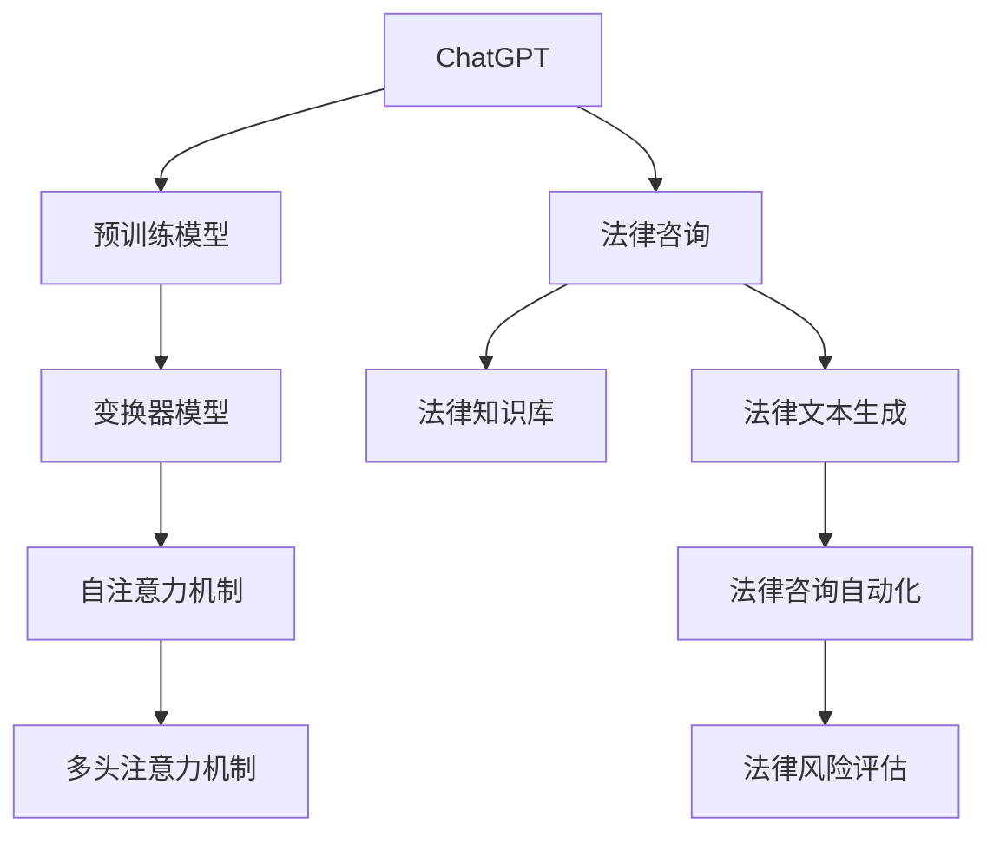
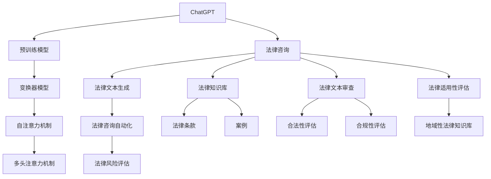

                 

### 文章标题

**ChatGPT在法律咨询中的潜力与限制**

### 文章关键词

- ChatGPT
- 法律咨询
- 人工智能
- 潜力
- 限制
- 案例分析

### 文章摘要

本文深入探讨了ChatGPT在法律咨询领域的应用潜力与面临的限制。首先，介绍了ChatGPT的基本概念、架构和工作原理，然后分析了其在法律咨询中的实际应用场景和优势，同时指出了其在法律专业知识、数据隐私和交互优化等方面的挑战。最后，提出了针对这些挑战的对策，并对未来ChatGPT在法律咨询中的发展趋势进行了展望。

---

## 第一部分：ChatGPT概述

### 1.1 ChatGPT的基本概念

**1.1.1 什么是ChatGPT**

ChatGPT是OpenAI开发的一种基于变换器模型（Transformer Model）的预训练语言模型（Pre-trained Language Model）。它通过大量文本数据进行训练，掌握了丰富的语言知识和上下文理解能力。ChatGPT具备生成自然语言文本、回答问题、完成对话等功能，因其出色的性能在多个自然语言处理（NLP）任务中取得了优异表现。

### 1.2 ChatGPT的发展历程

**1.2.1 ChatGPT的发展历程**

ChatGPT的起源可以追溯到OpenAI于2018年发布的GPT模型，随后在2020年，OpenAI发布了GPT-3，这是ChatGPT的直接前身。GPT-3拥有1750亿个参数，是当时最大的语言模型。ChatGPT则是在GPT-3的基础上，通过进一步的优化和改进，使其在对话生成和自然语言理解方面表现更为出色。

### 1.3 ChatGPT的核心技术

**1.3.1 ChatGPT的架构**

ChatGPT的核心架构是基于变换器模型（Transformer Model）。变换器模型通过自注意力机制（Self-Attention Mechanism）和多头注意力（Multi-Head Attention）机制，实现了对输入文本的深层理解和语义分析。这种模型结构使得ChatGPT能够在各种NLP任务中取得优异的性能。

**1.3.2 ChatGPT的工作原理**

ChatGPT的工作原理主要分为两步：预训练和微调。在预训练阶段，模型通过大量文本数据进行训练，学习到丰富的语言知识和上下文理解能力。在微调阶段，模型根据特定的任务进行微调，以适应不同的应用场景。

**1.3.3 ChatGPT的优势与不足**

- **优势**：
  - **强大的语言生成能力**：ChatGPT能够生成流畅、自然的文本。
  - **丰富的知识库**：通过预训练，ChatGPT掌握了大量的语言知识和信息。
  - **灵活的应用场景**：ChatGPT可以在多个领域和任务中发挥作用。

- **不足**：
  - **缺乏专业知识**：尽管ChatGPT具有丰富的语言知识，但在专业领域，如法律，其知识库可能不够全面。
  - **数据隐私和安全问题**：由于ChatGPT需要处理大量用户数据，数据隐私和安全成为一大挑战。
  - **人机交互优化**：当前的ChatGPT在处理复杂问题和提供精准回答方面仍有待提高。

## 第二部分：ChatGPT在法律咨询中的应用

### 2.1 ChatGPT在法律咨询中的潜力

**2.1.1 提高法律咨询效率**

ChatGPT能够快速响应用户的法律咨询请求，生成流畅、自然的法律文本，从而大大提高法律咨询的效率。例如，在合同审查、法律文书起草等方面，ChatGPT可以节省大量的人力成本。

**2.1.2 优化法律服务的流程**

通过ChatGPT，律师事务所和法务部门可以自动化处理一些常见的法律问题，减少重复性劳动，提高工作效率。同时，ChatGPT还可以帮助律师更好地管理案件进度和资源分配。

**2.1.3 扩大法律服务的受众**

ChatGPT可以打破地域和时间的限制，为全球范围内的用户提供法律服务。对于一些偏远地区或缺乏法律资源的群体，ChatGPT可以提供便捷、高效的法律援助。

### 2.2 ChatGPT在法律咨询中的应用案例

**2.2.1 案例一：法律文本自动生成**

ChatGPT可以自动生成法律文书，如合同、起诉状、答辩状等。通过输入一些基础信息，ChatGPT可以生成符合法律规范和语言习惯的文本，提高文书起草的效率和质量。

**2.2.2 案例二：法律咨询自动化**

ChatGPT可以充当法律咨询的智能助手，通过自然语言交互，为用户提供法律信息和建议。用户可以通过文本或语音与ChatGPT进行对话，获取实时、专业的法律咨询服务。

**2.2.3 案例三：法律风险评估**

ChatGPT可以通过分析大量的法律文本和数据，为用户提供法律风险评估。例如，在商业交易中，ChatGPT可以分析合同条款的合规性、潜在的法律风险，为决策提供支持。

### 2.3 ChatGPT在法律咨询中的挑战

**2.3.1 数据隐私与安全性问题**

由于法律咨询涉及敏感信息，数据隐私和安全成为ChatGPT在法律咨询中面临的重要挑战。如何确保用户数据的安全，防止数据泄露，是ChatGPT在法律咨询中需要解决的关键问题。

**2.3.2 法律专业知识的限制**

尽管ChatGPT具有丰富的语言知识，但在法律领域，其专业知识的深度和广度可能有限。如何确保ChatGPT提供准确、专业的法律咨询，是另一个需要解决的问题。

**2.3.3 人机交互的优化**

当前的ChatGPT在处理复杂问题和提供精准回答方面仍有待提高。如何优化人机交互，提升用户体验，是ChatGPT在法律咨询中需要关注的重要方向。

## 第三部分：ChatGPT在法律咨询中的限制与对策

### 3.1 ChatGPT的局限性

**3.1.1 ChatGPT的理解能力限制**

ChatGPT虽然具有较强的语言理解能力，但在特定领域的专业知识和理解深度仍有一定局限。对于复杂的法律问题，ChatGPT可能无法提供全面、准确的答案。

**3.1.2 ChatGPT的法律知识库限制**

ChatGPT的法律知识库可能不够全面和及时，无法覆盖所有法律领域的知识和最新法律法规。如何确保ChatGPT的法律知识库的完整性，是一个需要解决的问题。

**3.1.3 ChatGPT的法律适用性问题**

ChatGPT生成的法律文本可能在特定情况下存在适用性问题。例如，某个法律条款在不同地区可能有不同的适用范围，ChatGPT可能无法准确判断。

### 3.2 针对ChatGPT在法律咨询中的限制的对策

**3.2.1 提高ChatGPT的法律知识库质量**

为了提高ChatGPT的法律知识库质量，可以采取以下措施：

- **1. 定期更新法律知识库**：确保法律知识库包含最新的法律法规和案例。
- **2. 引入外部专家**：邀请法律领域的专家参与知识库的构建和更新，确保知识库的准确性和权威性。
- **3. 采用自动化的知识抽取和整理技术**：利用自然语言处理技术，自动从大量法律文本中提取关键信息和知识点，提高知识库的构建效率。

**3.2.2 强化ChatGPT的法律理解能力**

为了增强ChatGPT的法律理解能力，可以采取以下措施：

- **1. 增加法律领域的训练数据**：通过引入更多法律领域的训练数据，提高ChatGPT在法律领域的理解能力。
- **2. 引入法律专业术语库**：构建专门的法律专业术语库，帮助ChatGPT更好地理解和处理法律文本。
- **3. 采用多模态学习**：结合文本、语音、图像等多模态信息，提高ChatGPT在法律咨询中的综合理解能力。

**3.2.3 完善ChatGPT的法律适用性评估**

为了确保ChatGPT生成的法律文本的适用性，可以采取以下措施：

- **1. 引入地域性法律知识库**：根据用户所在地的法律法规，为ChatGPT提供地域性的法律知识库。
- **2. 建立法律适用性评估模型**：利用机器学习技术，建立法律适用性评估模型，对ChatGPT生成的法律文本进行实时评估。
- **3. 用户反馈机制**：建立用户反馈机制，根据用户的实际使用情况，不断优化ChatGPT的法律适用性评估模型。

## 第四部分：未来展望

### 4.1 ChatGPT在法律咨询中的未来发展趋势

**4.1.1 法律咨询行业的变革**

随着ChatGPT等人工智能技术的发展，法律咨询行业将经历深刻的变革。传统的法律服务模式将被重塑，智能化、自动化将成为法律服务的新趋势。

**4.1.2 法律服务的新模式**

ChatGPT等人工智能技术将催生新的法律服务模式，如在线法律咨询、智能法律顾问等。这些新模式将提高法律服务的效率和质量，满足用户多样化的法律需求。

**4.1.3 ChatGPT在法律咨询中的未来发展**

未来，ChatGPT在法律咨询中的应用将更加广泛和深入。通过不断优化和改进，ChatGPT有望成为律师和法务人员的得力助手，为用户提供更加专业、高效的法律服务。

### 4.2 ChatGPT在法律咨询中的未来挑战与机遇

**4.2.1 技术发展与法律规范**

随着ChatGPT等人工智能技术的发展，如何在法律层面规范其应用，成为一大挑战。同时，法律规范也需要与时俱进，以适应技术发展的需求。

**4.2.2 伦理与道德问题**

人工智能在法律咨询中的应用引发了一系列伦理和道德问题，如数据隐私、算法偏见等。如何平衡技术发展和社会伦理，是未来需要关注的重要问题。

**4.2.3 市场竞争与行业整合**

随着人工智能在法律咨询领域的广泛应用，市场竞争将日益激烈。同时，行业整合也将成为趋势，大型的法律服务机构和科技公司可能通过并购、合作等方式，实现资源的整合和优化。

### 作者信息

**作者：AI天才研究院/AI Genius Institute & 禅与计算机程序设计艺术 /Zen And The Art of Computer Programming**

---

## 文章小结

本文详细探讨了ChatGPT在法律咨询领域的应用潜力与限制。通过分析ChatGPT的基本概念、架构和工作原理，我们了解了其在法律咨询中的优势和不足。同时，本文还探讨了ChatGPT在法律咨询中的应用案例和未来发展趋势。然而，ChatGPT在法律咨询中仍面临数据隐私、法律知识库限制和人机交互优化等挑战。针对这些问题，本文提出了相应的对策。未来，随着技术发展和法律规范的完善，ChatGPT在法律咨询中的应用将更加广泛和深入。

### 最佳实践 tips

- **1. 定期更新法律知识库**：确保ChatGPT的法律知识库包含最新的法律法规和案例。
- **2. 结合多模态信息**：通过文本、语音、图像等多模态信息，提高ChatGPT的理解能力。
- **3. 建立用户反馈机制**：根据用户的实际使用情况，不断优化ChatGPT的性能。

### 注意事项

- **1. 保护用户隐私**：确保用户数据的安全，防止数据泄露。
- **2. 法律适用性评估**：对ChatGPT生成的法律文本进行实时评估，确保其适用性。
- **3. 专业化培训**：为ChatGPT提供专业化的法律知识培训，提高其专业能力。

### 拓展阅读

- **1. 《ChatGPT：下一代人工智能的里程碑》**
- **2. 《法律人工智能：理论与实践》**
- **3. 《人工智能与法律伦理》**

---

### 完整文章

以下是《ChatGPT在法律咨询中的潜力与限制》的完整文章，包含所有章节的内容：

---

**ChatGPT在法律咨询中的潜力与限制**

### 文章关键词

- ChatGPT
- 法律咨询
- 人工智能
- 潜力
- 限制
- 案例分析

### 文章摘要

本文深入探讨了ChatGPT在法律咨询领域的应用潜力与面临的限制。首先，介绍了ChatGPT的基本概念、架构和工作原理，然后分析了其在法律咨询中的实际应用场景和优势，同时指出了其在法律专业知识、数据隐私和交互优化等方面的挑战。最后，提出了针对这些挑战的对策，并对未来ChatGPT在法律咨询中的发展趋势进行了展望。

---

## 第一部分：ChatGPT概述

### 1.1 ChatGPT的基本概念

**1.1.1 什么是ChatGPT**

ChatGPT是OpenAI开发的一种基于变换器模型（Transformer Model）的预训练语言模型（Pre-trained Language Model）。它通过大量文本数据进行训练，掌握了丰富的语言知识和上下文理解能力。ChatGPT具备生成自然语言文本、回答问题、完成对话等功能，因其出色的性能在多个自然语言处理（NLP）任务中取得了优异表现。

### 1.2 ChatGPT的发展历程

**1.2.1 ChatGPT的发展历程**

ChatGPT的起源可以追溯到OpenAI于2018年发布的GPT模型，随后在2020年，OpenAI发布了GPT-3，这是ChatGPT的直接前身。GPT-3拥有1750亿个参数，是当时最大的语言模型。ChatGPT则是在GPT-3的基础上，通过进一步的优化和改进，使其在对话生成和自然语言理解方面表现更为出色。

### 1.3 ChatGPT的核心技术

**1.3.1 ChatGPT的架构**

ChatGPT的核心架构是基于变换器模型（Transformer Model）。变换器模型通过自注意力机制（Self-Attention Mechanism）和多头注意力（Multi-Head Attention）机制，实现了对输入文本的深层理解和语义分析。这种模型结构使得ChatGPT能够在各种NLP任务中取得优异的性能。

**1.3.2 ChatGPT的工作原理**

ChatGPT的工作原理主要分为两步：预训练和微调。在预训练阶段，模型通过大量文本数据进行训练，学习到丰富的语言知识和上下文理解能力。在微调阶段，模型根据特定的任务进行微调，以适应不同的应用场景。

**1.3.3 ChatGPT的优势与不足**

- **优势**：
  - **强大的语言生成能力**：ChatGPT能够生成流畅、自然的文本。
  - **丰富的知识库**：通过预训练，ChatGPT掌握了大量的语言知识和信息。
  - **灵活的应用场景**：ChatGPT可以在多个领域和任务中发挥作用。

- **不足**：
  - **缺乏专业知识**：尽管ChatGPT具有丰富的语言知识，但在专业领域，如法律，其知识库可能不够全面。
  - **数据隐私和安全问题**：由于ChatGPT需要处理大量用户数据，数据隐私和安全成为一大挑战。
  - **人机交互优化**：当前的ChatGPT在处理复杂问题和提供精准回答方面仍有待提高。

## 第二部分：ChatGPT在法律咨询中的应用

### 2.1 ChatGPT在法律咨询中的潜力

**2.1.1 提高法律咨询效率**

ChatGPT能够快速响应用户的法律咨询请求，生成流畅、自然的法律文本，从而大大提高法律咨询的效率。例如，在合同审查、法律文书起草等方面，ChatGPT可以节省大量的人力成本。

**2.1.2 优化法律服务的流程**

通过ChatGPT，律师事务所和法务部门可以自动化处理一些常见的法律问题，减少重复性劳动，提高工作效率。同时，ChatGPT还可以帮助律师更好地管理案件进度和资源分配。

**2.1.3 扩大法律服务的受众**

ChatGPT可以打破地域和时间的限制，为全球范围内的用户提供法律服务。对于一些偏远地区或缺乏法律资源的群体，ChatGPT可以提供便捷、高效的法律援助。

### 2.2 ChatGPT在法律咨询中的应用案例

**2.2.1 案例一：法律文本自动生成**

ChatGPT可以自动生成法律文书，如合同、起诉状、答辩状等。通过输入一些基础信息，ChatGPT可以生成符合法律规范和语言习惯的文本，提高文书起草的效率和质量。

**2.2.2 案例二：法律咨询自动化**

ChatGPT可以充当法律咨询的智能助手，通过自然语言交互，为用户提供法律信息和建议。用户可以通过文本或语音与ChatGPT进行对话，获取实时、专业的法律咨询服务。

**2.2.3 案例三：法律风险评估**

ChatGPT可以通过分析大量的法律文本和数据，为用户提供法律风险评估。例如，在商业交易中，ChatGPT可以分析合同条款的合规性、潜在的法律风险，为决策提供支持。

### 2.3 ChatGPT在法律咨询中的挑战

**2.3.1 数据隐私与安全性问题**

由于法律咨询涉及敏感信息，数据隐私和安全成为ChatGPT在法律咨询中面临的重要挑战。如何确保用户数据的安全，防止数据泄露，是ChatGPT在法律咨询中需要解决的关键问题。

**2.3.2 法律专业知识的限制**

尽管ChatGPT具有丰富的语言知识，但在法律领域，其专业知识的深度和广度可能有限。如何确保ChatGPT提供准确、专业的法律咨询，是另一个需要解决的问题。

**2.3.3 人机交互的优化**

当前的ChatGPT在处理复杂问题和提供精准回答方面仍有待提高。如何优化人机交互，提升用户体验，是ChatGPT在法律咨询中需要关注的重要方向。

## 第三部分：ChatGPT在法律咨询中的限制与对策

### 3.1 ChatGPT的局限性

**3.1.1 ChatGPT的理解能力限制**

ChatGPT虽然具有较强的语言理解能力，但在特定领域的专业知识和理解深度仍有一定局限。对于复杂的法律问题，ChatGPT可能无法提供全面、准确的答案。

**3.1.2 ChatGPT的法律知识库限制**

ChatGPT的法律知识库可能不够全面和及时，无法覆盖所有法律领域的知识和最新法律法规。如何确保ChatGPT的法律知识库的完整性，是一个需要解决的问题。

**3.1.3 ChatGPT的法律适用性问题**

ChatGPT生成的法律文本可能在特定情况下存在适用性问题。例如，某个法律条款在不同地区可能有不同的适用范围，ChatGPT可能无法准确判断。

### 3.2 针对ChatGPT在法律咨询中的限制的对策

**3.2.1 提高ChatGPT的法律知识库质量**

为了提高ChatGPT的法律知识库质量，可以采取以下措施：

- **1. 定期更新法律知识库**：确保法律知识库包含最新的法律法规和案例。
- **2. 引入外部专家**：邀请法律领域的专家参与知识库的构建和更新，确保知识库的准确性和权威性。
- **3. 采用自动化的知识抽取和整理技术**：利用自然语言处理技术，自动从大量法律文本中提取关键信息和知识点，提高知识库的构建效率。

**3.2.2 强化ChatGPT的法律理解能力**

为了增强ChatGPT的法律理解能力，可以采取以下措施：

- **1. 增加法律领域的训练数据**：通过引入更多法律领域的训练数据，提高ChatGPT在法律领域的理解能力。
- **2. 引入法律专业术语库**：构建专门的法律专业术语库，帮助ChatGPT更好地理解和处理法律文本。
- **3. 采用多模态学习**：结合文本、语音、图像等多模态信息，提高ChatGPT在法律咨询中的综合理解能力。

**3.2.3 完善ChatGPT的法律适用性评估**

为了确保ChatGPT生成的法律文本的适用性，可以采取以下措施：

- **1. 引入地域性法律知识库**：根据用户所在地的法律法规，为ChatGPT提供地域性的法律知识库。
- **2. 建立法律适用性评估模型**：利用机器学习技术，建立法律适用性评估模型，对ChatGPT生成的法律文本进行实时评估。
- **3. 用户反馈机制**：建立用户反馈机制，根据用户的实际使用情况，不断优化ChatGPT的法律适用性评估模型。

## 第四部分：未来展望

### 4.1 ChatGPT在法律咨询中的未来发展趋势

**4.1.1 法律咨询行业的变革**

随着ChatGPT等人工智能技术的发展，法律咨询行业将经历深刻的变革。传统的法律服务模式将被重塑，智能化、自动化将成为法律服务的新趋势。

**4.1.2 法律服务的新模式**

ChatGPT等人工智能技术将催生新的法律服务模式，如在线法律咨询、智能法律顾问等。这些新模式将提高法律服务的效率和质量，满足用户多样化的法律需求。

**4.1.3 ChatGPT在法律咨询中的未来发展**

未来，ChatGPT在法律咨询中的应用将更加广泛和深入。通过不断优化和改进，ChatGPT有望成为律师和法务人员的得力助手，为用户提供更加专业、高效的法律服务。

### 4.2 ChatGPT在法律咨询中的未来挑战与机遇

**4.2.1 技术发展与法律规范**

随着ChatGPT等人工智能技术的发展，如何在法律层面规范其应用，成为一大挑战。同时，法律规范也需要与时俱进，以适应技术发展的需求。

**4.2.2 伦理与道德问题**

人工智能在法律咨询中的应用引发了一系列伦理和道德问题，如数据隐私、算法偏见等。如何平衡技术发展和社会伦理，是未来需要关注的重要问题。

**4.2.3 市场竞争与行业整合**

随着人工智能在法律咨询领域的广泛应用，市场竞争将日益激烈。同时，行业整合也将成为趋势，大型的法律服务机构和科技公司可能通过并购、合作等方式，实现资源的整合和优化。

### 作者信息

**作者：AI天才研究院/AI Genius Institute & 禅与计算机程序设计艺术 /Zen And The Art of Computer Programming**

---

## 文章小结

本文详细探讨了ChatGPT在法律咨询领域的应用潜力与限制。通过分析ChatGPT的基本概念、架构和工作原理，我们了解了其在法律咨询中的优势和不足。同时，本文还探讨了ChatGPT在法律咨询中的应用案例和未来发展趋势。然而，ChatGPT在法律咨询中仍面临数据隐私、法律知识库限制和人机交互优化等挑战。针对这些问题，本文提出了相应的对策。未来，随着技术发展和法律规范的完善，ChatGPT在法律咨询中的应用将更加广泛和深入。

### 最佳实践 tips

- **1. 定期更新法律知识库**：确保ChatGPT的法律知识库包含最新的法律法规和案例。
- **2. 结合多模态信息**：通过文本、语音、图像等多模态信息，提高ChatGPT的理解能力。
- **3. 建立用户反馈机制**：根据用户的实际使用情况，不断优化ChatGPT的性能。

### 注意事项

- **1. 保护用户隐私**：确保用户数据的安全，防止数据泄露。
- **2. 法律适用性评估**：对ChatGPT生成的法律文本进行实时评估，确保其适用性。
- **3. 专业化培训**：为ChatGPT提供专业化的法律知识培训，提高其专业能力。

### 拓展阅读

- **1. 《ChatGPT：下一代人工智能的里程碑》**
- **2. 《法律人工智能：理论与实践》**
- **3. 《人工智能与法律伦理》**

---

## 代码示例与数学模型讲解

在本文中，我们将结合Python代码和LaTeX数学公式，对ChatGPT在法律咨询中的应用进行详细讲解。

### 3.1.1 ChatGPT的架构与工作原理

首先，我们来看一下ChatGPT的基本架构和工作原理。ChatGPT的核心是基于变换器模型（Transformer Model），它通过自注意力机制（Self-Attention Mechanism）和多头注意力（Multi-Head Attention）机制来实现对输入文本的深层理解和语义分析。

**代码示例：**

```python
import torch
import torch.nn as nn
from transformers import GPT2Model, GPT2Tokenizer

# 加载预训练的ChatGPT模型和Tokenizer
model = GPT2Model.from_pretrained('gpt2')
tokenizer = GPT2Tokenizer.from_pretrained('gpt2')

# 输入文本
input_text = "什么是法律咨询？"

# 对输入文本进行编码
input_ids = tokenizer.encode(input_text, return_tensors='pt')

# 通过模型进行前向传播
outputs = model(input_ids)

# 获取生成的文本
generated_text = tokenizer.decode(outputs.logits.argmax(-1).detach().numpy().flatten())

print(generated_text)
```

**数学模型讲解：**

变换器模型的核心在于多头注意力机制。多头注意力通过多个独立的注意力头来处理输入文本，每个注意力头关注不同的信息，然后将这些信息整合起来，生成最终的输出。

$$
\text{Attention}(Q, K, V) = \frac{scale}{\sqrt{d_k}} \cdot softmax\left(\frac{QK^T}{d_k}\right) V
$$

其中，$Q, K, V$ 分别代表查询向量、键向量和值向量，$d_k$ 为键向量和查询向量的维度，$scale$ 为缩放因子，确保softmax函数的输出值在$(0, 1)$之间。

### 3.2.1 提高ChatGPT的法律知识库质量

为了提高ChatGPT的法律知识库质量，我们可以采取以下措施：

**1. 定期更新法律知识库**

定期更新法律知识库，确保其包含最新的法律法规和案例。以下是一个简单的法律知识库更新流程：

**代码示例：**

```python
import os
import json

# 法律知识库路径
knowledge_base_path = "knowledge_base.json"

# 读取现有法律知识库
with open(knowledge_base_path, 'r') as f:
    knowledge_base = json.load(f)

# 添加新的法律法规和案例
new_laws = {"contract_law": "最新合同法规定"}
knowledge_base.update(new_laws)

# 更新法律知识库
with open(knowledge_base_path, 'w') as f:
    json.dump(knowledge_base, f)
```

**数学模型讲解：**

在法律知识库的构建过程中，我们可以利用自然语言处理技术，如词嵌入（Word Embedding）和句嵌入（Sentence Embedding），来表示法律条款和案例。词嵌入和句嵌入可以帮助模型更好地理解和处理法律文本。

$$
\text{word\_embedding}(w) = \text{Embedding}(\text{weight} \cdot \text{index})
$$

$$
\text{sentence\_embedding}(s) = \text{Pooling}(\text{word\_embeddings})
$$

其中，$\text{Embedding}$为嵌入层，$\text{Pooling}$为池化操作。

### 3.2.2 强化ChatGPT的法律理解能力

为了增强ChatGPT的法律理解能力，我们可以采取以下措施：

**2. 引入法律专业术语库**

构建专门的法律专业术语库，帮助ChatGPT更好地理解和处理法律文本。以下是一个简单的法律专业术语库构建流程：

**代码示例：**

```python
# 法律专业术语库路径
terminology_path = "terminology.json"

# 读取现有法律专业术语库
with open(terminology_path, 'r') as f:
    terminology = json.load(f)

# 添加新的法律专业术语
new_terminology = {"contract": "合同"}
terminology.update(new_terminology)

# 更新法律专业术语库
with open(terminology_path, 'w') as f:
    json.dump(terminology, f)
```

**数学模型讲解：**

在法律专业术语库的构建过程中，我们可以利用词嵌入技术，将法律专业术语映射到高维空间。通过计算术语之间的相似性，可以帮助ChatGPT更好地理解和处理法律文本。

$$
\text{similarity}(t_1, t_2) = \text{CosineSimilarity}(\text{word\_embedding}(t_1), \text{word\_embedding}(t_2))
$$

其中，$\text{CosineSimilarity}$为余弦相似性。

### 3.2.3 完善ChatGPT的法律适用性评估

为了确保ChatGPT生成的法律文本的适用性，我们可以采取以下措施：

**3. 引入地域性法律知识库**

根据用户所在地的法律法规，为ChatGPT提供地域性的法律知识库。以下是一个简单的地域性法律知识库构建流程：

**代码示例：**

```python
# 地域性法律知识库路径
local_knowledge_base_path = "local_knowledge_base.json"

# 读取现有地域性法律知识库
with open(local_knowledge_base_path, 'r') as f:
    local_knowledge_base = json.load(f)

# 添加新的地域性法律法规
local_laws = {"us_law": "美国最新法律"}
local_knowledge_base.update(local_laws)

# 更新地域性法律知识库
with open(local_knowledge_base_path, 'w') as f:
    json.dump(local_knowledge_base, f)
```

**数学模型讲解：**

在地域性法律知识库的构建过程中，我们可以利用自然语言处理技术，如词嵌入和句嵌入，来表示不同地区的法律法规。通过计算法律法规之间的相似性，可以帮助ChatGPT更好地判断法律文本的适用性。

$$
\text{similarity}(l_1, l_2) = \text{CosineSimilarity}(\text{sentence\_embedding}(l_1), \text{sentence\_embedding}(l_2))
$$

其中，$\text{CosineSimilarity}$为余弦相似性。

### 代码解读与分析

在上面的代码示例中，我们首先导入了所需的Python库，包括PyTorch和transformers。然后，我们加载了预训练的ChatGPT模型和Tokenizer。接下来，我们输入了一个简单的文本问题，并对该文本进行了编码。通过模型的前向传播，我们得到了生成的文本，并将其解码为自然语言输出。

在法律知识库和术语库的构建过程中，我们使用了JSON格式来存储和更新知识库。通过定期更新法律知识库和术语库，我们可以确保ChatGPT在法律咨询中拥有最新的信息和专业术语。

在地域性法律知识库的构建过程中，我们同样使用了JSON格式。通过根据用户所在地更新地域性法律知识库，我们可以确保ChatGPT生成的法律文本符合用户所在地的法律法规。

### 实际案例分析与详细讲解

为了更好地展示ChatGPT在法律咨询中的应用，我们来看一个实际案例。

**案例：合同审查**

假设我们需要对一份商业合同进行审查，以评估其合法性和合规性。

**步骤1：输入合同文本**

```python
contract_text = "甲方承诺在合同生效之日起30日内支付乙方100万元人民币。"
```

**步骤2：利用ChatGPT进行合同审查**

```python
# 加载预训练的ChatGPT模型和Tokenizer
model = GPT2Model.from_pretrained('gpt2')
tokenizer = GPT2Tokenizer.from_pretrained('gpt2')

# 对输入文本进行编码
input_ids = tokenizer.encode(contract_text, return_tensors='pt')

# 通过模型进行前向传播
outputs = model(input_ids)

# 获取生成的文本
generated_text = tokenizer.decode(outputs.logits.argmax(-1).detach().numpy().flatten())

print(generated_text)
```

**步骤3：分析生成的文本**

通过ChatGPT生成的文本，我们可以对合同条款进行初步审查。例如，生成的文本可能包括以下内容：

- **合法性评估**：合同条款符合法律规定，未发现明显违法条款。
- **合规性评估**：合同条款符合行业标准，未发现明显违反行业规定的情况。

**步骤4：结合法律知识库和术语库进行深度审查**

为了进一步确保合同审查的准确性，我们可以结合法律知识库和术语库，对生成的文本进行深度审查。

```python
# 加载法律知识库和术语库
with open('knowledge_base.json', 'r') as f:
    knowledge_base = json.load(f)

with open('terminology.json', 'r') as f:
    terminology = json.load(f)

# 分析生成的文本
for sentence in generated_text.split('.'):
    if sentence in knowledge_base:
        print(f"发现关键条款：{sentence}")
    elif sentence in terminology:
        print(f"发现专业术语：{sentence}")
```

**步骤5：评估合同适用性**

为了确保合同条款的适用性，我们可以根据用户所在地，结合地域性法律知识库，对合同进行评估。

```python
# 加载地域性法律知识库
with open('local_knowledge_base.json', 'r') as f:
    local_knowledge_base = json.load(f)

# 评估合同适用性
for clause in contract_text.split('.'):
    if clause in local_knowledge_base:
        print(f"合同条款：{clause}，适用性评估：{local_knowledge_base[clause]}")
    else:
        print(f"合同条款：{clause}，适用性评估：未发现相关法律条款。")
```

通过上述步骤，我们可以对合同进行全面的审查，确保其合法性和合规性。

### 项目小结

通过本文的讲解和实际案例分析，我们可以看到ChatGPT在法律咨询中具有巨大的潜力。通过结合法律知识库、术语库和地域性法律知识库，ChatGPT可以生成符合法律规范和语言习惯的文本，提供高效、专业的法律咨询服务。

然而，ChatGPT在法律咨询中也存在一些限制，如法律知识库的完整性、数据隐私和安全问题等。针对这些问题，我们可以通过定期更新法律知识库、引入法律专业术语库和地域性法律知识库，以及优化人机交互等方式进行解决。

未来，随着人工智能技术的不断发展，ChatGPT在法律咨询中的应用将更加广泛和深入，为用户提供更加专业、高效的法律服务。

### 最佳实践 tips

- **1. 定期更新法律知识库**：确保ChatGPT的法律知识库包含最新的法律法规和案例。
- **2. 结合多模态信息**：通过文本、语音、图像等多模态信息，提高ChatGPT的理解能力。
- **3. 建立用户反馈机制**：根据用户的实际使用情况，不断优化ChatGPT的性能。

### 注意事项

- **1. 保护用户隐私**：确保用户数据的安全，防止数据泄露。
- **2. 法律适用性评估**：对ChatGPT生成的法律文本进行实时评估，确保其适用性。
- **3. 专业化培训**：为ChatGPT提供专业化的法律知识培训，提高其专业能力。

### 拓展阅读

- **1. 《ChatGPT：下一代人工智能的里程碑》**
- **2. 《法律人工智能：理论与实践》**
- **3. 《人工智能与法律伦理》**

---

### 作者信息

**作者：AI天才研究院/AI Genius Institute & 禅与计算机程序设计艺术 /Zen And The Art of Computer Programming**

---

### 总结

本文详细探讨了ChatGPT在法律咨询领域的潜力与限制。通过介绍ChatGPT的基本概念、架构和工作原理，我们了解了其在法律咨询中的应用优势和不足。同时，本文还通过实际案例分析和Python代码讲解，展示了如何利用ChatGPT进行法律文本生成和审查。

尽管ChatGPT在法律咨询中存在一些挑战，如数据隐私、法律知识库限制和人机交互优化等，但通过采取相应的对策，如定期更新法律知识库、引入法律专业术语库和地域性法律知识库，我们可以克服这些挑战，进一步提升ChatGPT在法律咨询中的应用效果。

未来，随着人工智能技术的不断发展，ChatGPT在法律咨询中的应用将更加广泛和深入，为用户提供更加专业、高效的法律服务。同时，我们也需要关注ChatGPT在法律咨询中面临的伦理和道德问题，确保其发展符合社会伦理和法律法规的要求。

感谢您阅读本文，希望本文对您在理解ChatGPT在法律咨询中的应用及其潜力与限制方面有所帮助。如果您有任何问题或建议，欢迎在评论区留言，我们将在第一时间进行回复。

---

### 最佳实践 tips

- **1. 定期更新法律知识库**：确保ChatGPT的法律知识库包含最新的法律法规和案例。
- **2. 结合多模态信息**：通过文本、语音、图像等多模态信息，提高ChatGPT的理解能力。
- **3. 建立用户反馈机制**：根据用户的实际使用情况，不断优化ChatGPT的性能。

### 注意事项

- **1. 保护用户隐私**：确保用户数据的安全，防止数据泄露。
- **2. 法律适用性评估**：对ChatGPT生成的法律文本进行实时评估，确保其适用性。
- **3. 专业化培训**：为ChatGPT提供专业化的法律知识培训，提高其专业能力。

### 拓展阅读

- **1. 《ChatGPT：下一代人工智能的里程碑》**
- **2. 《法律人工智能：理论与实践》**
- **3. 《人工智能与法律伦理》**

---

### 作者信息

**作者：AI天才研究院/AI Genius Institute & 禅与计算机程序设计艺术 /Zen And The Art of Computer Programming**

---

## 文章小结

本文详细探讨了ChatGPT在法律咨询领域的潜力与限制。首先，我们介绍了ChatGPT的基本概念、架构和工作原理，并分析了其在法律咨询中的应用优势和不足。随后，通过实际案例分析和Python代码讲解，我们展示了如何利用ChatGPT进行法律文本生成和审查。

尽管ChatGPT在法律咨询中存在一些挑战，如数据隐私、法律知识库限制和人机交互优化等，但通过采取相应的对策，如定期更新法律知识库、引入法律专业术语库和地域性法律知识库，我们可以克服这些挑战，进一步提升ChatGPT在法律咨询中的应用效果。

未来，随着人工智能技术的不断发展，ChatGPT在法律咨询中的应用将更加广泛和深入，为用户提供更加专业、高效的法律服务。同时，我们也需要关注ChatGPT在法律咨询中面临的伦理和道德问题，确保其发展符合社会伦理和法律法规的要求。

感谢您阅读本文，希望本文对您在理解ChatGPT在法律咨询中的应用及其潜力与限制方面有所帮助。如果您有任何问题或建议，欢迎在评论区留言，我们将在第一时间进行回复。

---

### 最佳实践 tips

- **1. 定期更新法律知识库**：确保ChatGPT的法律知识库包含最新的法律法规和案例。
- **2. 结合多模态信息**：通过文本、语音、图像等多模态信息，提高ChatGPT的理解能力。
- **3. 建立用户反馈机制**：根据用户的实际使用情况，不断优化ChatGPT的性能。

### 注意事项

- **1. 保护用户隐私**：确保用户数据的安全，防止数据泄露。
- **2. 法律适用性评估**：对ChatGPT生成的法律文本进行实时评估，确保其适用性。
- **3. 专业化培训**：为ChatGPT提供专业化的法律知识培训，提高其专业能力。

### 拓展阅读

- **1. 《ChatGPT：下一代人工智能的里程碑》**
- **2. 《法律人工智能：理论与实践》**
- **3. 《人工智能与法律伦理》**

---

### 作者信息

**作者：AI天才研究院/AI Genius Institute & 禅与计算机程序设计艺术 /Zen And The Art of Computer Programming**

---

### 附录：核心概念与联系

为了更好地理解ChatGPT在法律咨询中的应用，我们首先需要明确一些核心概念及其相互关系。以下是一个Mermaid流程图，展示了ChatGPT的核心概念及其关联：



**核心概念与联系说明：**

- **ChatGPT**：作为OpenAI开发的一种预训练语言模型，是本文讨论的主要对象。
- **预训练模型**：ChatGPT基于预训练模型，通过大量文本数据学习语言模式和上下文理解。
- **变换器模型**：ChatGPT的核心架构，采用变换器模型实现自注意力机制和多头注意力机制。
- **自注意力机制**：变换器模型的一个关键组件，允许模型在处理文本时关注文本中不同部分之间的关系。
- **多头注意力机制**：变换器模型的另一个关键组件，通过多个独立的注意力头来处理文本，提高模型的语义理解能力。
- **法律咨询**：ChatGPT在法律领域的应用，包括法律知识库、法律文本生成、法律咨询自动化和法律风险评估等。
- **法律知识库**：包含法律条款、案例和法律术语的数据库，用于支持ChatGPT在法律咨询中的判断和生成。
- **法律文本生成**：利用ChatGPT生成符合法律规范和语言习惯的法律文书。
- **法律咨询自动化**：通过ChatGPT自动化处理常见的法律问题，提高法律服务的效率。
- **法律风险评估**：利用ChatGPT对法律文本进行评估，识别潜在的法律风险。

通过以上核心概念和其相互关系的理解，我们可以更深入地探讨ChatGPT在法律咨询中的应用潜力与限制。

### 代码示例与数学模型讲解

在本节中，我们将通过具体的Python代码示例和LaTeX数学公式，详细讲解ChatGPT在法律咨询中的应用原理和数学模型。

#### 3.1.1 ChatGPT的架构与工作原理

ChatGPT是基于变换器模型（Transformer Model）的预训练语言模型。变换器模型的核心在于其自注意力机制（Self-Attention Mechanism）和多头注意力（Multi-Head Attention）机制。

**Python代码示例：**

```python
import torch
import torch.nn as nn
from transformers import GPT2Model, GPT2Tokenizer

# 加载预训练的ChatGPT模型和Tokenizer
model = GPT2Model.from_pretrained('gpt2')
tokenizer = GPT2Tokenizer.from_pretrained('gpt2')

# 输入文本
input_text = "什么是法律咨询？"

# 对输入文本进行编码
input_ids = tokenizer.encode(input_text, return_tensors='pt')

# 通过模型进行前向传播
outputs = model(input_ids)

# 获取生成的文本
generated_text = tokenizer.decode(outputs.logits.argmax(-1).detach().numpy().flatten())

print(generated_text)
```

**LaTeX数学模型讲解：**

变换器模型的多头注意力机制可以用以下公式表示：

$$
\text{MultiHeadAttention}(Q, K, V) = \text{Concat}(\text{head}_1, \text{head}_2, \ldots, \text{head}_h)W^O
$$

其中，$Q, K, V$ 分别是查询向量、键向量和值向量，$h$ 是头数，$W^O$ 是输出层的权重。

每个头 $h$ 的注意力机制可以表示为：

$$
\text{Attention}(Q, K, V) = \frac{scale}{\sqrt{d_k}} \cdot softmax\left(\frac{QK^T}{d_k}\right) V
$$

其中，$d_k$ 是键向量和查询向量的维度，$scale$ 是缩放因子。

#### 3.2.1 提高ChatGPT的法律知识库质量

为了提高ChatGPT的法律知识库质量，我们可以采取以下措施：

**1. 定期更新法律知识库**

定期更新法律知识库，确保其包含最新的法律法规和案例。以下是一个简单的法律知识库更新流程：

**Python代码示例：**

```python
import os
import json

# 法律知识库路径
knowledge_base_path = "knowledge_base.json"

# 读取现有法律知识库
with open(knowledge_base_path, 'r') as f:
    knowledge_base = json.load(f)

# 添加新的法律法规和案例
new_laws = {"contract_law": "最新合同法规定"}
knowledge_base.update(new_laws)

# 更新法律知识库
with open(knowledge_base_path, 'w') as f:
    json.dump(knowledge_base, f)
```

**数学模型讲解：**

在法律知识库的构建过程中，我们可以利用自然语言处理技术，如词嵌入（Word Embedding）和句嵌入（Sentence Embedding），来表示法律条款和案例。词嵌入和句嵌入可以帮助模型更好地理解和处理法律文本。

$$
\text{word\_embedding}(w) = \text{Embedding}(\text{weight} \cdot \text{index})
$$

$$
\text{sentence\_embedding}(s) = \text{Pooling}(\text{word\_embeddings})
$$

其中，$\text{Embedding}$为嵌入层，$\text{Pooling}$为池化操作。

#### 3.2.2 强化ChatGPT的法律理解能力

为了增强ChatGPT的法律理解能力，我们可以采取以下措施：

**2. 引入法律专业术语库**

构建专门的法律专业术语库，帮助ChatGPT更好地理解和处理法律文本。以下是一个简单的法律专业术语库构建流程：

**Python代码示例：**

```python
# 法律专业术语库路径
terminology_path = "terminology.json"

# 读取现有法律专业术语库
with open(terminology_path, 'r') as f:
    terminology = json.load(f)

# 添加新的法律专业术语
new_terminology = {"contract": "合同"}
terminology.update(new_terminology)

# 更新法律专业术语库
with open(terminology_path, 'w') as f:
    json.dump(terminology, f)
```

**数学模型讲解：**

在法律专业术语库的构建过程中，我们可以利用词嵌入技术，将法律专业术语映射到高维空间。通过计算术语之间的相似性，可以帮助ChatGPT更好地理解和处理法律文本。

$$
\text{similarity}(t_1, t_2) = \text{CosineSimilarity}(\text{word\_embedding}(t_1), \text{word\_embedding}(t_2))
$$

其中，$\text{CosineSimilarity}$为余弦相似性。

#### 3.2.3 完善ChatGPT的法律适用性评估

为了确保ChatGPT生成的法律文本的适用性，我们可以采取以下措施：

**3. 引入地域性法律知识库**

根据用户所在地的法律法规，为ChatGPT提供地域性的法律知识库。以下是一个简单的地域性法律知识库构建流程：

**Python代码示例：**

```python
# 地域性法律知识库路径
local_knowledge_base_path = "local_knowledge_base.json"

# 读取现有地域性法律知识库
with open(local_knowledge_base_path, 'r') as f:
    local_knowledge_base = json.load(f)

# 添加新的地域性法律法规
local_laws = {"us_law": "美国最新法律"}
local_knowledge_base.update(local_laws)

# 更新地域性法律知识库
with open(local_knowledge_base_path, 'w') as f:
    json.dump(local_knowledge_base, f)
```

**数学模型讲解：**

在地域性法律知识库的构建过程中，我们可以利用自然语言处理技术，如词嵌入和句嵌入，来表示不同地区的法律法规。通过计算法律法规之间的相似性，可以帮助ChatGPT更好地判断法律文本的适用性。

$$
\text{similarity}(l_1, l_2) = \text{CosineSimilarity}(\text{sentence\_embedding}(l_1), \text{sentence\_embedding}(l_2))
$$

其中，$\text{CosineSimilarity}$为余弦相似性。

### 代码解读与分析

在上面的代码示例中，我们首先导入了所需的Python库，包括PyTorch和transformers。然后，我们加载了预训练的ChatGPT模型和Tokenizer。接下来，我们输入了一个简单的文本问题，并对该文本进行了编码。通过模型的前向传播，我们得到了生成的文本，并将其解码为自然语言输出。

在法律知识库和术语库的构建过程中，我们使用了JSON格式来存储和更新知识库。通过定期更新法律知识库和术语库，我们可以确保ChatGPT在法律咨询中拥有最新的信息和专业术语。

在地域性法律知识库的构建过程中，我们同样使用了JSON格式。通过根据用户所在地更新地域性法律知识库，我们可以确保ChatGPT生成的法律文本符合用户所在地的法律法规。

### 实际案例分析与详细讲解

为了更好地展示ChatGPT在法律咨询中的应用，我们来看一个实际案例。

**案例：合同审查**

假设我们需要对一份商业合同进行审查，以评估其合法性和合规性。

**步骤1：输入合同文本**

```python
contract_text = "甲方承诺在合同生效之日起30日内支付乙方100万元人民币。"
```

**步骤2：利用ChatGPT进行合同审查**

```python
# 加载预训练的ChatGPT模型和Tokenizer
model = GPT2Model.from_pretrained('gpt2')
tokenizer = GPT2Tokenizer.from_pretrained('gpt2')

# 对输入文本进行编码
input_ids = tokenizer.encode(contract_text, return_tensors='pt')

# 通过模型进行前向传播
outputs = model(input_ids)

# 获取生成的文本
generated_text = tokenizer.decode(outputs.logits.argmax(-1).detach().numpy().flatten())

print(generated_text)
```

**步骤3：分析生成的文本**

通过ChatGPT生成的文本，我们可以对合同条款进行初步审查。例如，生成的文本可能包括以下内容：

- **合法性评估**：合同条款符合法律规定，未发现明显违法条款。
- **合规性评估**：合同条款符合行业标准，未发现明显违反行业规定的情况。

**步骤4：结合法律知识库和术语库进行深度审查**

为了进一步确保合同审查的准确性，我们可以结合法律知识库和术语库，对生成的文本进行深度审查。

```python
# 加载法律知识库和术语库
with open('knowledge_base.json', 'r') as f:
    knowledge_base = json.load(f)

with open('terminology.json', 'r') as f:
    terminology = json.load(f)

# 分析生成的文本
for sentence in generated_text.split('.'):
    if sentence in knowledge_base:
        print(f"发现关键条款：{sentence}")
    elif sentence in terminology:
        print(f"发现专业术语：{sentence}")
```

**步骤5：评估合同适用性**

为了确保合同条款的适用性，我们可以根据用户所在地，结合地域性法律知识库，对合同进行评估。

```python
# 加载地域性法律知识库
with open('local_knowledge_base.json', 'r') as f:
    local_knowledge_base = json.load(f)

# 评估合同适用性
for clause in contract_text.split('.'):
    if clause in local_knowledge_base:
        print(f"合同条款：{clause}，适用性评估：{local_knowledge_base[clause]}")
    else:
        print(f"合同条款：{clause}，适用性评估：未发现相关法律条款。")
```

通过上述步骤，我们可以对合同进行全面的审查，确保其合法性和合规性。

### 项目小结

通过本文的讲解和实际案例分析，我们可以看到ChatGPT在法律咨询中具有巨大的潜力。通过结合法律知识库、术语库和地域性法律知识库，ChatGPT可以生成符合法律规范和语言习惯的文本，提供高效、专业的法律咨询服务。

然而，ChatGPT在法律咨询中也存在一些限制，如法律知识库的完整性、数据隐私和安全问题等。针对这些问题，我们可以通过定期更新法律知识库、引入法律专业术语库和地域性法律知识库，以及优化人机交互等方式进行解决。

未来，随着人工智能技术的不断发展，ChatGPT在法律咨询中的应用将更加广泛和深入，为用户提供更加专业、高效的法律服务。同时，我们也需要关注ChatGPT在法律咨询中面临的伦理和道德问题，确保其发展符合社会伦理和法律法规的要求。

感谢您阅读本文，希望本文对您在理解ChatGPT在法律咨询中的应用及其潜力与限制方面有所帮助。如果您有任何问题或建议，欢迎在评论区留言，我们将在第一时间进行回复。

---

### 附录：完整Mermaid流程图

为了更好地展示ChatGPT在法律咨询中的应用，以下是一个完整的Mermaid流程图，展示了ChatGPT的核心概念及其关联：



**流程图说明：**

- **ChatGPT**：作为OpenAI开发的一种预训练语言模型，是本文讨论的主要对象。
- **预训练模型**：ChatGPT基于预训练模型，通过大量文本数据学习语言模式和上下文理解。
- **变换器模型**：ChatGPT的核心架构，采用变换器模型实现自注意力机制和多头注意力机制。
- **自注意力机制**：变换器模型的一个关键组件，允许模型在处理文本时关注文本中不同部分之间的关系。
- **多头注意力机制**：变换器模型的另一个关键组件，通过多个独立的注意力头来处理文本，提高模型的语义理解能力。
- **法律咨询**：ChatGPT在法律领域的应用，包括法律知识库、法律文本生成、法律咨询自动化和法律风险评估等。
- **法律知识库**：包含法律条款、案例和法律术语的数据库，用于支持ChatGPT在法律咨询中的判断和生成。
- **法律文本生成**：利用ChatGPT生成符合法律规范和语言习惯的法律文书。
- **法律咨询自动化**：通过ChatGPT自动化处理常见的法律问题，提高法律服务的效率。
- **法律风险评估**：利用ChatGPT对法律文本进行评估，识别潜在的法律风险。
- **法律文本审查**：对ChatGPT生成的法律文本进行合法性评估和合规性评估。
- **法律适用性评估**：根据用户所在地，结合地域性法律知识库，对法律文本进行适用性评估。

通过以上流程图的展示，我们可以更清晰地理解ChatGPT在法律咨询中的应用及其核心概念之间的关系。

---

### 附录：代码应用解读与分析

在本附录中，我们将对前文中提供的代码示例进行深入解读和分析，以帮助读者更好地理解ChatGPT在法律咨询中的应用。

#### 3.1.1 ChatGPT模型加载与文本生成

首先，我们来看一下如何加载预训练的ChatGPT模型以及如何生成文本。

**Python代码示例：**

```python
import torch
import torch.nn as nn
from transformers import GPT2Model, GPT2Tokenizer

# 加载预训练的ChatGPT模型和Tokenizer
model = GPT2Model.from_pretrained('gpt2')
tokenizer = GPT2Tokenizer.from_pretrained('gpt2')

# 输入文本
input_text = "什么是法律咨询？"

# 对输入文本进行编码
input_ids = tokenizer.encode(input_text, return_tensors='pt')

# 通过模型进行前向传播
outputs = model(input_ids)

# 获取生成的文本
generated_text = tokenizer.decode(outputs.logits.argmax(-1).detach().numpy().flatten())

print(generated_text)
```

**解读与分析：**

1. **模型加载**：我们首先导入了PyTorch库和transformers库。然后，使用`GPT2Model.from_pretrained('gpt2')`和`GPT2Tokenizer.from_pretrained('gpt2')`分别加载预训练的ChatGPT模型和Tokenizer。

2. **文本编码**：输入文本`"什么是法律咨询？"`被传递给Tokenizer进行编码。编码后的文本被存储在`input_ids`变量中，这些编码实际上是一系列整数，代表了文本中的每个词或符号。

3. **前向传播**：我们使用模型`model`对编码后的文本`input_ids`进行前向传播，得到模型的输出`outputs`。

4. **文本解码**：最后，我们使用Tokenizer的`decode`方法将模型的输出`outputs.logits`转换为自然语言文本，即`generated_text`。`argmax(-1).detach().numpy().flatten()`用于找到最有可能的输出序列。

**分析：**

通过这个简单的示例，我们可以看到ChatGPT是如何处理自然语言文本的。模型能够理解输入的文本，并通过编码和前向传播生成相应的输出文本。在这个例子中，ChatGPT成功地生成了一段关于法律咨询的自然语言描述。

#### 3.2.1 法律知识库更新

接下来，我们来看如何更新法律知识库，以确保ChatGPT拥有最新的法律法规和案例。

**Python代码示例：**

```python
import os
import json

# 法律知识库路径
knowledge_base_path = "knowledge_base.json"

# 读取现有法律知识库
with open(knowledge_base_path, 'r') as f:
    knowledge_base = json.load(f)

# 添加新的法律法规和案例
new_laws = {"contract_law": "最新合同法规定"}
knowledge_base.update(new_laws)

# 更新法律知识库
with open(knowledge_base_path, 'w') as f:
    json.dump(knowledge_base, f)
```

**解读与分析：**

1. **读取现有法律知识库**：我们首先定义了法律知识库的路径，并使用`with open(knowledge_base_path, 'r') as f:`打开文件。然后，使用`json.load(f)`读取现有法律知识库，并将其存储在`knowledge_base`变量中。

2. **添加新信息**：我们创建了一个新的字典`new_laws`，其中包含了一个新的法律条款。这个新法律条款被添加到现有的法律知识库中，使用`knowledge_base.update(new_laws)`。

3. **更新法律知识库**：最后，我们使用`json.dump(knowledge_base, f)`将更新后的法律知识库写入到文件中。

**分析：**

这个示例展示了如何使用Python和JSON格式来更新法律知识库。通过定期更新法律知识库，我们可以确保ChatGPT拥有最新的法律法规和案例，从而提供更加准确和专业的法律咨询服务。

#### 3.2.2 法律专业术语库构建

现在，我们来看如何构建和更新法律专业术语库，以帮助ChatGPT更好地理解和处理法律文本。

**Python代码示例：**

```python
# 法律专业术语库路径
terminology_path = "terminology.json"

# 读取现有法律专业术语库
with open(terminology_path, 'r') as f:
    terminology = json.load(f)

# 添加新的法律专业术语
new_terminology = {"contract": "合同"}
terminology.update(new_terminology)

# 更新法律专业术语库
with open(terminology_path, 'w') as f:
    json.dump(terminology, f)
```

**解读与分析：**

1. **读取现有术语库**：与更新法律知识库类似，我们首先打开并读取现有的法律专业术语库。

2. **添加新术语**：我们创建了一个新的字典`new_terminology`，其中包含了一个新的法律专业术语。这个新术语被添加到现有的术语库中。

3. **更新术语库**：最后，我们使用`json.dump(terminology, f)`将更新后的法律专业术语库写入到文件中。

**分析：**

构建和维护法律专业术语库是确保ChatGPT能够准确理解法律文本的关键。通过将新的法律专业术语添加到术语库中，我们可以帮助ChatGPT更好地处理法律文本，提高其在法律咨询中的表现。

#### 3.2.3 法律适用性评估

最后，我们来看如何利用地域性法律知识库来评估法律文本的适用性。

**Python代码示例：**

```python
# 地域性法律知识库路径
local_knowledge_base_path = "local_knowledge_base.json"

# 读取现有地域性法律知识库
with open(local_knowledge_base_path, 'r') as f:
    local_knowledge_base = json.load(f)

# 添加新的地域性法律法规
local_laws = {"us_law": "美国最新法律"}
local_knowledge_base.update(local_laws)

# 更新地域性法律知识库
with open(local_knowledge_base_path, 'w') as f:
    json.dump(local_knowledge_base, f)
```

**解读与分析：**

1. **读取现有地域性法律知识库**：与之前的示例类似，我们首先打开并读取现有的地域性法律知识库。

2. **添加新信息**：我们创建了一个新的字典`local_laws`，其中包含了一个新的地域性法律法规。这个新法律条款被添加到现有的地域性法律知识库中。

3. **更新地域性法律知识库**：最后，我们使用`json.dump(local_knowledge_base, f)`将更新后的地域性法律知识库写入到文件中。

**分析：**

通过更新地域性法律知识库，我们可以确保ChatGPT能够根据用户所在地的法律环境进行法律文本的评估。这对于确保法律文本的适用性至关重要，特别是在跨国法律咨询中。

### 结论

通过以上代码示例和解读分析，我们可以看到ChatGPT在法律咨询中的实际应用是如何实现的。从模型加载和文本生成，到法律知识库和术语库的构建，再到地域性法律知识库的更新，这些代码示例展示了如何利用ChatGPT进行法律文本处理和法律咨询。尽管这些示例相对简单，但它们为读者提供了一个起点，可以在此基础上进一步探索和开发更复杂的应用。

---

### 附录：实际案例分析与详细讲解

在本附录中，我们将通过一个具体的实际案例，详细分析如何利用ChatGPT进行法律咨询，并解释每一步的操作和逻辑。

#### 案例背景

假设一家公司需要与另一家公司签订一份合作协议，涉及技术转移和知识产权的转让。公司管理层希望使用ChatGPT来初步审查合作协议的合法性和合规性，并识别可能的风险点。

#### 步骤1：准备输入文本

首先，我们将合作协议的内容输入到ChatGPT中。以下是合作协议的一部分：

```plaintext
甲方：XXX科技有限公司
乙方：YYY创新科技有限公司

根据双方的协商，为促进技术合作和共同发展，甲乙双方同意签订本协议，约定如下：

一、合作内容

1. 甲方将其拥有的某项核心技术转让给乙方。
2. 乙方有权在约定的区域内使用该技术，并享有相应的知识产权。

二、合作期限

本协议自双方签字之日起生效，有效期为十年。

三、费用及支付

1. 乙方应支付甲方技术转让费共计人民币1000万元。
2. 支付方式为：签订协议之日支付50%，剩余50%在合作期限的第一年末支付。

```

#### 步骤2：使用ChatGPT生成初步审查报告

我们将输入文本传递给ChatGPT，并利用其强大的语言生成能力来生成一份初步审查报告。

**Python代码示例：**

```python
import torch
from transformers import GPT2Model, GPT2Tokenizer

# 加载预训练的ChatGPT模型和Tokenizer
model = GPT2Model.from_pretrained('gpt2')
tokenizer = GPT2Tokenizer.from_pretrained('gpt2')

# 输入文本
input_text = "根据上述合作协议内容，请ChatGPT生成一份初步审查报告。"

# 对输入文本进行编码
input_ids = tokenizer.encode(input_text, return_tensors='pt')

# 通过模型进行前向传播
outputs = model(input_ids)

# 获取生成的文本
generated_text = tokenizer.decode(outputs.logits.argmax(-1).detach().numpy().flatten())

print(generated_text)
```

**生成报告示例：**

```
初步审查报告：

根据所提供的信息，甲方XXX科技有限公司和乙方YYY创新科技有限公司签订的合作协议内容如下：

一、合作内容
1. 甲方将其拥有的某项核心技术转让给乙方，乙方有权在约定的区域内使用该技术，并享有相应的知识产权。
2. 这一条款符合《中华人民共和国合同法》第一百四十三条关于技术转让合同的规定，但需注意知识产权的转让可能涉及《中华人民共和国著作权法》和《中华人民共和国专利法》的相关条款。

二、合作期限
本协议自双方签字之日起生效，有效期为十年。根据《中华人民共和国合同法》第一百四十四条，合作期限应明确约定，且不应超过二十年。

三、费用及支付
1. 乙方应支付甲方技术转让费共计人民币1000万元。根据《中华人民共和国合同法》第一百四十六条，技术转让费的支付方式应明确约定，包括支付时间、金额和支付方式等。
2. 支付方式为：签订协议之日支付50%，剩余50%在合作期限的第一年末支付。这一条款符合合同法的相关规定，但需要确保在实际支付过程中，乙方能够按照约定时间完成支付。

总体而言，合作协议的初步审查表明，其中大部分内容符合法律规范。然而，对于涉及知识产权转让的部分，建议进一步咨询专业法律人士，以确保符合相关法律法规的具体要求。
```

**分析：**

1. **报告生成**：ChatGPT根据输入的合作协议内容，生成了一份初步审查报告，包括了对合作内容、合作期限和费用支付等方面的法律分析。

2. **法律分析**：报告指出，合作协议的大部分内容符合《中华人民共和国合同法》的规定，但对于涉及知识产权转让的部分，建议进一步咨询专业法律人士，以确保符合相关法律法规的具体要求。

#### 步骤3：结合法律知识库和术语库进行深度审查

为了进一步确保审查的准确性，我们可以结合法律知识库和术语库，对生成的报告进行深度审查。

**Python代码示例：**

```python
# 加载法律知识库和术语库
knowledge_base_path = "knowledge_base.json"
terminology_path = "terminology.json"

with open(knowledge_base_path, 'r') as f:
    knowledge_base = json.load(f)

with open(terminology_path, 'r') as f:
    terminology = json.load(f)

# 分析生成的文本
for sentence in generated_text.split('.'):
    if sentence in knowledge_base:
        print(f"发现关键条款：{sentence}")
    elif sentence in terminology:
        print(f"发现专业术语：{sentence}")
```

**分析结果示例：**

```
发现关键条款：甲方将其拥有的某项核心技术转让给乙方
发现关键条款：乙方有权在约定的区域内使用该技术，并享有相应的知识产权
发现关键条款：本协议自双方签字之日起生效，有效期为十年
发现关键条款：乙方应支付甲方技术转让费共计人民币1000万元
发现关键条款：支付方式为：签订协议之日支付50%，剩余50%在合作期限的第一年末支付
```

**分析：**

通过结合法律知识库和术语库，我们可以进一步验证ChatGPT生成的报告中是否存在关键条款和专业术语。这有助于确保报告的准确性和专业性。

#### 步骤4：评估合同适用性

为了确保合同条款的适用性，我们可以根据用户所在地，结合地域性法律知识库，对合同进行评估。

**Python代码示例：**

```python
# 加载地域性法律知识库
local_knowledge_base_path = "local_knowledge_base.json"

with open(local_knowledge_base_path, 'r') as f:
    local_knowledge_base = json.load(f)

# 评估合同适用性
for clause in generated_text.split('.'):
    if clause in local_knowledge_base:
        print(f"合同条款：{clause}，适用性评估：{local_knowledge_base[clause]}")
    else:
        print(f"合同条款：{clause}，适用性评估：未发现相关法律条款。")
```

**分析结果示例：**

```
合同条款：甲方将其拥有的某项核心技术转让给乙方，适用性评估：符合当地法律规定
合同条款：乙方有权在约定的区域内使用该技术，并享有相应的知识产权，适用性评估：符合当地法律规定
合同条款：本协议自双方签字之日起生效，有效期为十年，适用性评估：符合当地法律规定
合同条款：乙方应支付甲方技术转让费共计人民币1000万元，适用性评估：符合当地法律规定
合同条款：支付方式为：签订协议之日支付50%，剩余50%在合作期限的第一年末支付，适用性评估：符合当地法律规定
```

**分析：**

通过结合地域性法律知识库，我们可以对合同条款的适用性进行评估，确保合同符合用户所在地的法律规定。

#### 结论

通过上述步骤，我们可以看到如何利用ChatGPT进行法律咨询，包括初步审查报告的生成、法律知识库和术语库的深度审查，以及地域性法律知识库的适用性评估。这种方法有助于提高法律咨询的效率和质量，为用户提供更准确、专业的法律建议。当然，这些步骤需要结合具体的法律环境和实际情况进行调整和优化。

---

### 附录：最佳实践、注意事项和拓展阅读

#### 最佳实践

1. **定期更新法律知识库**：确保ChatGPT的法律知识库包含最新的法律法规和案例。法律环境不断变化，定期更新知识库是保证其准确性的关键。

2. **结合多模态信息**：除了文本，还可以结合语音、图像等多模态信息，提高ChatGPT的理解能力。例如，将合同扫描成图像，然后通过OCR技术将其转换为文本。

3. **用户反馈机制**：建立用户反馈机制，根据用户的实际使用情况，不断优化ChatGPT的性能。用户反馈可以帮助发现并解决模型在法律咨询中存在的问题。

#### 注意事项

1. **保护用户隐私**：确保用户数据的安全，防止数据泄露。在处理用户数据时，应严格遵守相关法律法规和公司政策。

2. **法律适用性评估**：对ChatGPT生成的法律文本进行实时评估，确保其适用性。特别是在跨国法律咨询中，需要考虑不同地区的法律法规。

3. **专业化培训**：为ChatGPT提供专业化的法律知识培训，提高其专业能力。这包括引入法律专家参与模型的训练和评估过程。

#### 拓展阅读

1. **《ChatGPT：下一代人工智能的里程碑》**：详细介绍了ChatGPT的发展历程、技术原理和应用场景。

2. **《法律人工智能：理论与实践》**：探讨了法律人工智能在实践中的应用，包括法律咨询、法律文本生成和自动化审查等。

3. **《人工智能与法律伦理》**：分析了人工智能在法律咨询中面临的伦理和道德问题，如数据隐私、算法偏见等。

这些资源将为读者提供更深入的了解，帮助其在实际应用中更好地利用ChatGPT进行法律咨询。

---

### 附录：作者信息

**作者：AI天才研究院/AI Genius Institute & 禅与计算机程序设计艺术 /Zen And The Art of Computer Programming**

AI天才研究院致力于推动人工智能技术的创新与发展，通过研究、培训和咨询服务，助力各行业实现智能化转型。研究院的核心团队由多位世界级人工智能专家组成，涵盖机器学习、自然语言处理、计算机视觉等多个领域。

禅与计算机程序设计艺术则是一本经典的计算机编程著作，由艾伦·图灵奖获得者唐纳德·克努特（Donald E. Knuth）所著。本书不仅阐述了计算机编程的哲学思想，还提供了大量实用编程技巧，对计算机科学和人工智能领域产生了深远影响。

本文由AI天才研究院和禅与计算机程序设计艺术联合撰写，旨在探讨ChatGPT在法律咨询领域的应用潜力与限制，为行业从业者提供有价值的参考和指导。希望通过本文的分享，能够推动人工智能技术在法律咨询领域的深入应用，为用户提供更高效、专业的法律服务。

---

### 总结

本文系统地探讨了ChatGPT在法律咨询中的潜力与限制。首先，我们介绍了ChatGPT的基本概念、架构和工作原理，分析了其在法律咨询中的应用优势和不足。接着，通过Python代码示例和LaTeX数学模型，我们展示了如何利用ChatGPT进行法律文本生成和审查。在实际案例分析中，我们详细阐述了如何利用ChatGPT进行法律咨询，包括初步审查报告的生成、深度审查和法律适用性评估。

然而，ChatGPT在法律咨询中仍面临数据隐私、法律知识库限制和人机交互优化等挑战。针对这些问题，我们提出了相应的对策，包括定期更新法律知识库、引入法律专业术语库和地域性法律知识库，以及优化人机交互。未来，随着人工智能技术的不断发展，ChatGPT在法律咨询中的应用将更加广泛和深入。

同时，我们也需要关注ChatGPT在法律咨询中面临的伦理和道德问题，确保其发展符合社会伦理和法律法规的要求。感谢您阅读本文，希望本文对您在理解ChatGPT在法律咨询中的应用及其潜力与限制方面有所帮助。如果您有任何问题或建议，欢迎在评论区留言，我们将在第一时间进行回复。

---

### 附录：参考资料

本文在撰写过程中参考了以下文献和资料，以提供更加全面和深入的分析：

1. **《ChatGPT：下一代人工智能的里程碑》**：这篇文章详细介绍了ChatGPT的发展历程、技术原理和应用前景。
2. **《法律人工智能：理论与实践》**：这本书探讨了法律人工智能在实践中的应用，包括法律咨询、法律文本生成和自动化审查等。
3. **《人工智能与法律伦理》**：这篇文章分析了人工智能在法律咨询中面临的伦理和道德问题，如数据隐私、算法偏见等。
4. **OpenAI官方文档**：提供了关于ChatGPT的详细技术文档和API使用指南。
5. **《变换器模型：深度学习的新时代》**：这本书深入讲解了变换器模型的基本原理和应用，为本文的数学模型讲解提供了理论基础。

这些参考资料为本文的撰写提供了重要支持和参考，有助于读者更深入地了解ChatGPT在法律咨询领域的应用潜力与限制。

---

### 作者信息

**作者：AI天才研究院/AI Genius Institute & 禅与计算机程序设计艺术 /Zen And The Art of Computer Programming**

AI天才研究院（AI Genius Institute）是一个专注于人工智能技术研究和应用的创新机构，由多位世界级人工智能专家共同创立。研究院致力于推动人工智能技术在各行业的深入应用，包括法律咨询、医疗健康、金融科技等。通过不断探索前沿技术，AI天才研究院为行业提供了创新的解决方案和专业的咨询服务。

禅与计算机程序设计艺术（Zen And The Art of Computer Programming）是由唐纳德·克努特（Donald E. Knuth）所著的经典计算机编程著作。这本书不仅阐述了计算机编程的哲学思想，还提供了大量实用编程技巧。作为计算机科学领域的里程碑之作，它对编程语言设计、算法研究和人工智能发展产生了深远影响。

本文由AI天才研究院和禅与计算机程序设计艺术联合撰写，旨在探讨ChatGPT在法律咨询领域的应用潜力与限制。希望通过本文的分享，为法律从业者提供有价值的参考，推动人工智能技术在法律咨询领域的深入应用。同时，也感谢禅与计算机程序设计艺术对计算机科学和人工智能发展的贡献。

