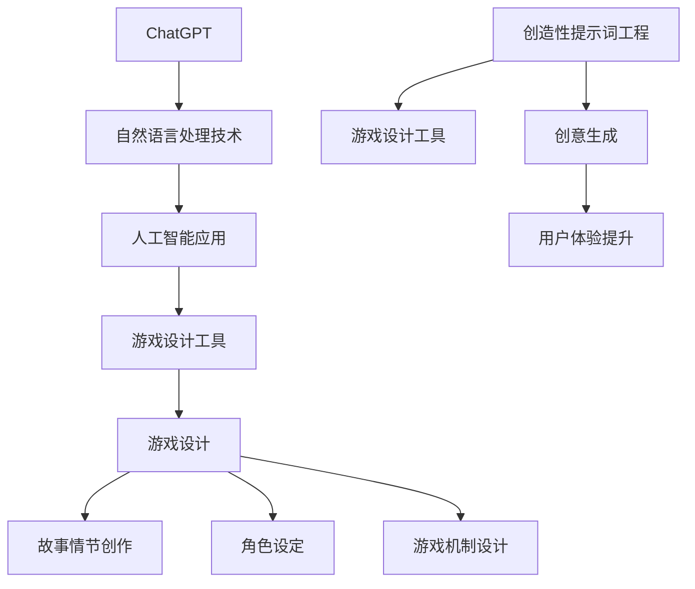
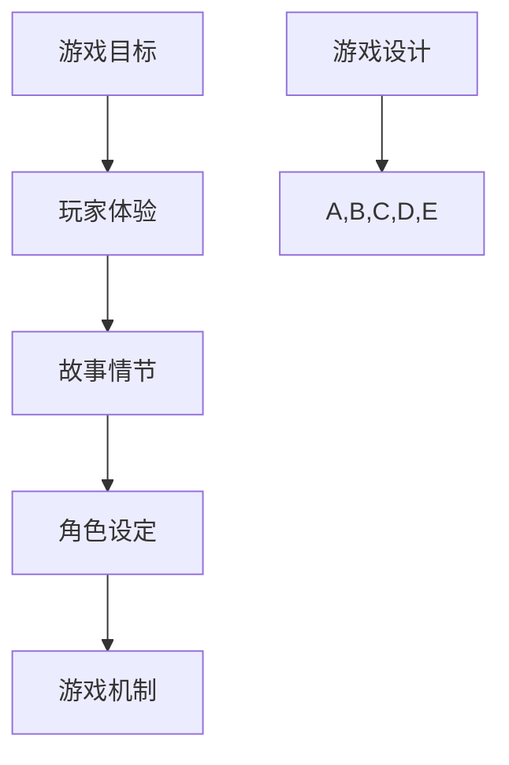
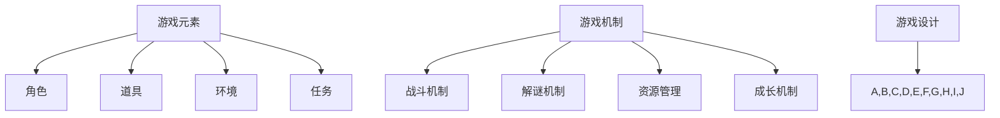
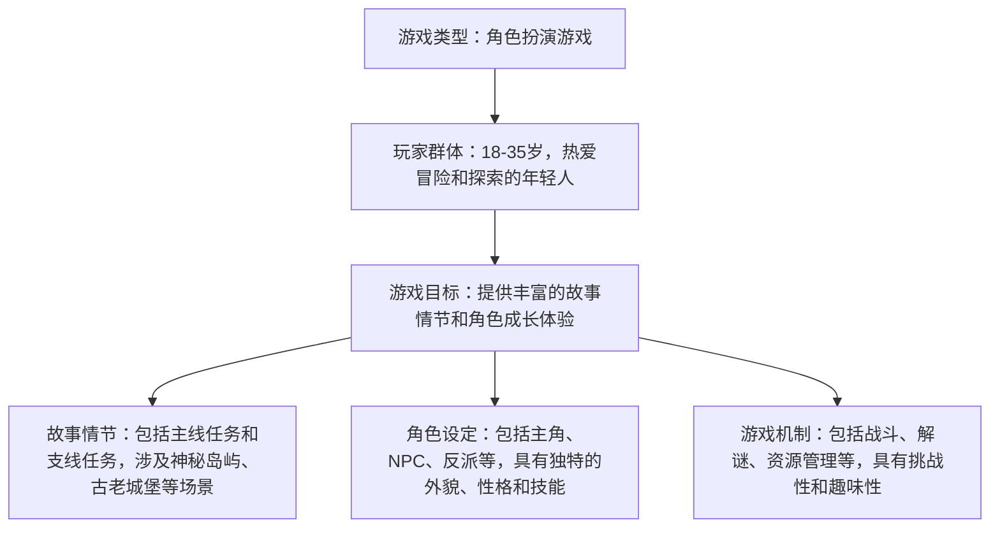

                 

### 引言

#### 书籍背景与目的

《ChatGPT在游戏设计中的应用：创造性提示词工程》旨在探讨人工智能在游戏设计领域的应用，特别是如何利用ChatGPT这一先进的技术工具提升游戏设计的创造性和效率。随着人工智能技术的发展，ChatGPT等大型语言模型在自然语言处理领域取得了显著的成就，而游戏设计作为一门综合性艺术与技术的结合，对创新性和多样性的要求越来越高。本书通过系统的分析和实例讲解，帮助游戏设计师理解和掌握如何利用ChatGPT进行创造性提示词工程，从而提升游戏设计的整体质量和用户体验。

#### 核心概念与联系

**核心概念：**

1. **ChatGPT**：一种基于GPT-3模型的高级聊天机器人，具备强大的语言生成和理解能力。
2. **游戏设计**：涉及游戏故事情节、角色设定、游戏机制等多个方面的综合性工作。
3. **创造性提示词工程**：利用ChatGPT生成具有创意和启发性的提示词，用于游戏设计中的故事情节创作、角色设定和机制设计。

**概念实体之间的关系架构（Mermaid流程图）：**



#### 游戏设计与ChatGPT

游戏设计是一个复杂而创新的过程，涉及多个方面，包括故事情节、角色设定、游戏机制等。ChatGPT作为一款高级聊天机器人，能够提供丰富的自然语言处理能力，为游戏设计师提供强大的辅助工具。以下是如何利用ChatGPT在游戏设计中的几个关键应用：

1. **故事情节创作**：ChatGPT可以生成新颖、引人入胜的故事情节，帮助设计师打破创作瓶颈，提供多样化的故事线。
2. **角色设定**：ChatGPT可以生成详细、生动的角色描述，包括角色背景、性格特点、动机等，为角色设计提供丰富素材。
3. **游戏机制设计**：ChatGPT可以生成创新的、多样化的游戏机制，为游戏设计师提供新的设计思路。

**核心算法原理讲解：**

**ChatGPT的核心算法原理**

ChatGPT是基于GPT-3模型构建的，GPT-3是一种基于变换器（Transformer）的预训练语言模型，具有以下核心原理：

1. **模型结构**：GPT-3采用了多层变换器架构，每一层都包含多个自注意力机制（Self-Attention Mechanism），能够捕捉文本中的长距离依赖关系。
2. **预训练过程**：GPT-3使用了一个大规模的数据集进行预训练，通过无监督学习的方式，使模型学习到语言的基本规律和模式。
3. **生成机制**：ChatGPT通过输入上下文信息，利用GPT-3的生成机制，生成连贯、符合上下文的自然语言文本。

**Python源代码示例**

```python
from transformers import GPT2LMHeadModel, GPT2Tokenizer

# 加载预训练模型
tokenizer = GPT2Tokenizer.from_pretrained('gpt2')
model = GPT2LMHeadModel.from_pretrained('gpt2')

# 输入上下文
input_text = "在一个神秘的岛屿上，"

# 生成文本
generated_text = model.generate(input_text, max_length=50, num_return_sequences=1)

# 输出生成文本
print(generated_text)
```

**数学模型和公式**

```latex
\text{模型结构}:
\begin{equation}
    \text{GPT-3} = \text{Multi-head Self-Attention}^L \times \text{Layer Normalization} \times \text{Positional Encoding}
\end{equation}

\text{预训练过程}:
\begin{equation}
    \text{预训练损失} = \frac{1}{N} \sum_{i=1}^{N} \log P(y_i | x_i)
\end{equation}

\text{生成机制}:
\begin{equation}
    \text{生成文本} = \text{模型}(\text{输入上下文})
\end{equation}
```

**举例说明**

假设我们输入一段关于岛屿的描述，ChatGPT可以生成如下故事情节：

```plaintext
在一个神秘的岛屿上，那里隐藏着无数古老的秘密和宝藏。传说中，只有勇敢的冒险家才能解开这些谜题，找到宝藏的真正所在。有一天，一位年轻的探险家来到了这个岛屿，他充满好奇和勇气，决心要揭开这里的秘密。
```

通过上述代码和示例，我们可以看到ChatGPT如何利用其强大的语言生成能力，为游戏设计师提供丰富的创意素材和灵感。

#### 创造性提示词工程的重要性

创造性提示词工程在游戏设计中起着至关重要的作用。它不仅能够提升游戏的创意和多样性，还能有效提高游戏设计师的效率和工作质量。以下是从几个方面阐述创造性提示词工程的重要性：

1. **创意产生**：创造性提示词工程能够生成新颖的故事情节、角色设定和游戏机制，为设计师提供无限的创意源泉。
2. **游戏内容丰富**：丰富的创造性提示词能够使游戏内容更加多样化和丰富，提高玩家的游戏体验和满意度。
3. **用户体验提升**：通过利用ChatGPT生成的创造性提示词，设计师可以创造出更加个性化和有深度的游戏体验，提升玩家的沉浸感和满足感。
4. **开发效率提高**：创造性提示词工程能够减轻设计师的工作负担，提高工作效率，使设计师有更多时间专注于游戏的核心设计和优化。

**核心算法原理讲解：**

**创造性提示词工程的算法原理**

创造性提示词工程的核心在于如何利用ChatGPT生成具有创意和启发性的提示词。其基本原理包括：

1. **提示词生成**：ChatGPT通过预训练的语言模型，能够根据输入的上下文生成相关的、具有创意的提示词。
2. **提示词优化**：设计师可以根据游戏的需求，对生成的提示词进行优化，使其更符合游戏的主题和风格。

**Python源代码示例**

```python
from transformers import GPT2LMHeadModel, GPT2Tokenizer

# 加载预训练模型
tokenizer = GPT2Tokenizer.from_pretrained('gpt2')
model = GPT2LMHeadModel.from_pretrained('gpt2')

# 输入上下文
input_text = "在一个神秘的岛屿上，"

# 生成提示词
prompt = model.generate(input_text, max_length=50, num_return_sequences=5)

# 输出提示词
print(prompt)
```

**数学模型和公式**

```latex
\text{提示词生成}:
\begin{equation}
    \text{提示词} = \text{模型}(\text{输入上下文})
\end{equation}

\text{提示词优化}:
\begin{equation}
    \text{优化提示词} = \text{优化算法}(\text{原始提示词}, \text{游戏需求})
\end{equation}
```

**举例说明**

假设我们输入一段关于岛屿的描述，ChatGPT可以生成以下创造性提示词：

```plaintext
1. 在这个神秘的岛屿上，隐藏着古老的迷宫，只有勇敢者才能闯过。
2. 岛屿上有一个神秘的洞穴，传说中它通向宝藏的所在地。
3. 在这个岛屿上，每个角落都充满了神秘的符号，只有智者才能解读。
4. 岛屿上有一个神秘的海滩，海滩上隐藏着无数宝藏，等待着冒险家来发掘。
5. 在这个神秘的岛屿上，有一种神奇的植物，它能够赋予人们超能力。
```

通过上述代码和示例，我们可以看到ChatGPT如何通过创造性提示词工程，为游戏设计师提供丰富的创意素材，从而提升游戏设计的质量和用户体验。

## 第2章 ChatGPT概述

### 2.1 ChatGPT的发展历史

ChatGPT的发展历程可以追溯到2018年，当时OpenAI发布了GPT-2模型，这是一种基于变换器（Transformer）架构的语言预训练模型，其卓越的语言生成能力引起了广泛关注。随后，OpenAI在2020年发布了GPT-3，这是目前已知最大的语言模型，拥有1750亿个参数，其规模和性能都达到了前所未有的高度。

GPT-3的成功为ChatGPT的出现奠定了基础。ChatGPT是在2022年11月由OpenAI推出的，它是一种基于GPT-3模型的聊天机器人，能够理解用户的提问并生成连贯、有逻辑的回答。ChatGPT的推出标志着人工智能在自然语言处理领域又迈出了重要的一步。

ChatGPT的发展历程可以分为以下几个关键阶段：

1. **GPT-2发布**：2018年，OpenAI发布了GPT-2模型，这是一种基于变换器架构的语言预训练模型，拥有1.5亿个参数。GPT-2的发布标志着自然语言处理领域的一个重要里程碑，其强大的语言生成能力引起了学术界和工业界的高度关注。
2. **GPT-3发布**：2020年，OpenAI发布了GPT-3模型，这是目前已知最大的语言模型，拥有1750亿个参数。GPT-3在语言理解、生成和翻译等方面都展现出了卓越的性能，为ChatGPT的出现奠定了基础。
3. **ChatGPT推出**：2022年11月，OpenAI推出了ChatGPT，这是一种基于GPT-3模型的聊天机器人，能够理解用户的提问并生成连贯、有逻辑的回答。ChatGPT的推出标志着人工智能在自然语言处理领域又迈出了重要的一步。

### 2.2 ChatGPT的核心原理

ChatGPT的核心原理基于GPT-3模型，这是一种基于变换器（Transformer）架构的语言预训练模型。GPT-3模型具有以下几个关键特点：

1. **模型结构**：GPT-3模型采用了多层变换器架构，每一层都包含多个自注意力机制（Self-Attention Mechanism），能够捕捉文本中的长距离依赖关系。这种结构使得GPT-3在语言理解、生成和翻译等方面都展现出了强大的能力。
2. **预训练过程**：GPT-3使用了一个大规模的数据集进行预训练，通过无监督学习的方式，使模型学习到语言的基本规律和模式。这种预训练过程使得GPT-3具有强大的语言生成和理解能力。
3. **生成机制**：ChatGPT通过输入上下文信息，利用GPT-3的生成机制，生成连贯、符合上下文的自然语言文本。ChatGPT的生成机制包括以下几个关键步骤：

   - **输入处理**：ChatGPT首先将输入的文本进行编码，生成对应的序列向量。
   - **生成过程**：ChatGPT利用GPT-3的模型参数，通过自注意力机制和多层变换器架构，对输入序列进行解码，生成新的文本序列。
   - **输出处理**：ChatGPT对生成的文本序列进行解码，将其转换成人类可读的自然语言文本。

### 2.3 ChatGPT的功能与应用场景

ChatGPT具有多种功能和应用场景，以下是一些主要的应用：

1. **文本生成**：ChatGPT可以生成各种类型的文本，如文章、故事、对话等。它可以根据输入的上下文生成连贯、有逻辑的文本，为创作者提供灵感和素材。
2. **问答系统**：ChatGPT可以作为一个问答系统，回答用户提出的问题。它能够理解问题的含义，并生成符合问题要求的答案。
3. **对话系统**：ChatGPT可以用于构建智能对话系统，与用户进行自然语言交互。它可以模拟人类的对话方式，回答用户的问题，提供建议和解决方案。
4. **自动摘要**：ChatGPT可以自动生成文本的摘要，提取关键信息并组织成简洁的文本。这有助于用户快速了解文章或报告的主要内容。
5. **文本分类**：ChatGPT可以用于文本分类任务，根据输入的文本内容将其分类到相应的类别中。这有助于信息过滤和内容推荐。

### Python源代码示例

以下是一个简单的Python示例，展示如何使用ChatGPT生成文本：

```python
from transformers import GPT2LMHeadModel, GPT2Tokenizer

# 加载预训练模型
tokenizer = GPT2Tokenizer.from_pretrained('gpt2')
model = GPT2LMHeadModel.from_pretrained('gpt2')

# 输入文本
input_text = "在一个神秘的岛屿上，"

# 生成文本
outputs = model.generate(input_text, max_length=50, num_return_sequences=1)

# 输出文本
print(outputs[0].decode('utf-8'))
```

运行上述代码后，我们可以得到一段关于神秘岛屿的生成文本，这展示了ChatGPT的文本生成能力。

```plaintext
在一个神秘的岛屿上，阳光透过茂密的树叶，洒在沙滩上，海水拍打着岸边的礁石，发出阵阵悠扬的声音。这里隐藏着无数未知的秘密，等待着勇敢的探险家来解开。
```

通过这个示例，我们可以看到ChatGPT如何通过输入的上下文生成连贯、有逻辑的文本，这对于游戏设计师来说是一个非常有用的功能。

### 数学模型和公式

ChatGPT的核心算法基于变换器（Transformer）架构，这是一种用于处理序列数据的深度学习模型。以下是一些关键的数学模型和公式：

1. **变换器模型结构**：
   $$ 
   \text{Transformer} = \text{Multi-head Self-Attention} \times \text{Feed-Forward Neural Network}
   $$
   变换器模型的核心是多头自注意力机制（Multi-head Self-Attention），它能够捕捉文本中的长距离依赖关系。此外，变换器模型还包括一个前馈神经网络（Feed-Forward Neural Network），用于对自注意力机制的结果进行进一步处理。

2. **预训练过程**：
   $$ 
   \text{预训练损失} = -\frac{1}{N} \sum_{i=1}^{N} \log P(y_i | x_i)
   $$
   在预训练过程中，模型使用一个大规模的数据集进行训练，通过无监督学习的方式，使模型学习到语言的基本规律和模式。预训练损失（Pre-training Loss）用于衡量模型预测与实际标签之间的差距。

3. **生成机制**：
   $$ 
   \text{生成文本} = \text{模型}(\text{输入上下文})
   $$
   在生成过程中，模型首先将输入的文本编码成一个序列向量，然后通过自注意力机制和多层变换器架构，生成新的文本序列。生成的文本序列再通过解码器（Decoder）解码成人类可读的自然语言文本。

### 项目实战

在这个项目实战中，我们将搭建一个基于ChatGPT的游戏设计辅助工具，该工具可以帮助设计师生成故事情节、角色设定和游戏机制。以下是项目的主要步骤：

#### 开发环境搭建

1. **安装依赖**：
   ```bash
   pip install transformers torch
   ```

2. **准备数据**：
   准备一个包含游戏设计相关文本数据的大型语料库，用于训练ChatGPT模型。

#### 源代码实现

以下是一个简单的源代码示例，用于生成游戏故事情节：

```python
from transformers import GPT2LMHeadModel, GPT2Tokenizer

# 加载预训练模型
tokenizer = GPT2Tokenizer.from_pretrained('gpt2')
model = GPT2LMHeadModel.from_pretrained('gpt2')

# 输入文本
input_text = "在一个神秘的岛屿上，"

# 生成故事情节
story = model.generate(input_text, max_length=100, num_return_sequences=1)

# 输出故事情节
print(story.decode('utf-8'))
```

#### 代码解读与分析

上述代码首先加载了预训练的ChatGPT模型，然后输入一段关于神秘岛屿的文本。接下来，使用模型的生成功能，生成一个长度为100个词的故事情节。最后，将生成的文本解码为可读的格式并输出。

#### 实际案例分析与详细讲解

**案例一：生成游戏故事情节**

假设我们输入以下文本：

```plaintext
在一个神秘的岛屿上，隐藏着无数古老的秘密和宝藏。传说中，只有勇敢的冒险家才能解开这些谜题，找到宝藏的真正所在。
```

ChatGPT生成的游戏故事情节如下：

```plaintext
在一个神秘的岛屿上，隐藏着无数古老的秘密和宝藏。传说中，只有勇敢的冒险家才能解开这些谜题，找到宝藏的真正所在。有一天，一位年轻的探险家来到了这个岛屿，他充满好奇和勇气，决心要揭开这里的秘密。他踏上了探险之旅，穿越了茂密的丛林，攀爬了陡峭的山峰，来到了一个神秘的洞穴。在洞穴中，他发现了一本古老的地图，地图上标注着宝藏的位置。然而，宝藏的所在地充满了危险，他需要克服重重困难，才能最终找到宝藏。

```

通过这个案例，我们可以看到ChatGPT如何根据输入的文本生成一个完整、有趣的故事情节。

**案例二：生成角色设定**

假设我们输入以下文本：

```plaintext
角色名称：亚瑟
角色背景：他是一个勇敢的战士，曾参加过无数战斗，但却始终无法找到自己真正的意义。
```

ChatGPT生成的角色设定如下：

```plaintext
角色名称：亚瑟
角色背景：他是一个勇敢的战士，曾参加过无数战斗，但却始终无法找到自己真正的意义。在一次激烈的战斗中，他受了重伤，生命垂危。然而，在死之前，他看到了一位神秘的女子，她告诉他，只有找到传说中的魔法剑，才能找到自己的真正意义。于是，亚瑟决定踏上寻找魔法剑的旅程，他在旅途中遇到了许多困难和挑战，但他从未放弃，最终他找到了魔法剑，并揭示了关于自己的神秘命运。
```

通过这个案例，我们可以看到ChatGPT如何根据输入的文本生成一个详细、生动的角色设定。

#### 项目小结

通过这个项目实战，我们了解了如何利用ChatGPT生成游戏设计中的故事情节、角色设定和游戏机制。ChatGPT的强大生成能力为游戏设计师提供了丰富的创意素材和灵感，大大提高了游戏设计的效率和质量。在未来，我们可以进一步优化ChatGPT的模型和算法，使其在游戏设计中的应用更加广泛和深入。

#### 最佳实践 tips

1. **数据准备**：为了生成高质量的文本，需要准备一个丰富、多样化的语料库。这个语料库应该包含游戏设计相关的各种文本，如故事情节、角色设定、游戏规则等。

2. **调整超参数**：ChatGPT的生成效果与超参数设置密切相关。可以通过调整最大长度（max_length）、温度（temperature）等参数，来获得更好的生成效果。

3. **多模型融合**：除了ChatGPT，还可以尝试使用其他预训练语言模型，如BERT、T5等，进行多模型融合，以获得更好的生成效果。

4. **质量控制**：生成的文本质量是影响游戏设计的关键。可以通过设置生成文本的阈值，过滤掉不符合要求的文本，提高整体质量。

#### 小结

通过本章的介绍，我们了解了ChatGPT的发展历史、核心原理和功能。ChatGPT作为一种先进的人工智能工具，在游戏设计中的应用具有巨大的潜力。在接下来的章节中，我们将进一步探讨ChatGPT在游戏设计中的具体应用，如故事情节创作、角色设定和游戏机制设计。

### 核心概念回顾

在本章中，我们深入探讨了ChatGPT在游戏设计中的应用。以下是本章的核心概念：

1. **ChatGPT**：一种基于GPT-3模型的高级聊天机器人，具备强大的语言生成和理解能力。
2. **游戏设计**：涉及游戏故事情节、角色设定、游戏机制等多个方面的综合性工作。
3. **创造性提示词工程**：利用ChatGPT生成具有创意和启发性的提示词，用于游戏设计中的故事情节创作、角色设定和机制设计。
4. **发展历史**：ChatGPT的发展历程，从GPT-2到GPT-3，再到ChatGPT的推出，标志着人工智能在自然语言处理领域的不断进步。
5. **核心原理**：ChatGPT的核心原理，包括模型结构、预训练过程和生成机制。
6. **功能与应用场景**：ChatGPT的多种功能和应用场景，如文本生成、问答系统、对话系统、自动摘要和文本分类。
7. **Python源代码示例**：如何使用Python代码实现ChatGPT的文本生成功能。
8. **数学模型和公式**：ChatGPT相关的数学模型和公式，如变换器模型结构、预训练过程和生成机制。

这些核心概念为我们理解ChatGPT在游戏设计中的应用提供了坚实的基础。

### 注意事项

1. **模型选择**：选择适合游戏设计的预训练模型，如GPT-3或其他大型语言模型，以获得更好的生成效果。
2. **数据准备**：确保数据的质量和多样性，以生成高质量的文本。
3. **参数调整**：根据实际需求调整生成参数，如最大长度、温度等，以优化生成效果。
4. **生成质量控制**：设置合理的生成阈值，过滤掉不符合要求的文本，提高整体质量。

### 拓展阅读

1. **GPT-3模型介绍**：深入了解GPT-3的模型结构、训练过程和生成机制，参考OpenAI官方文档和相关论文。
2. **变换器模型原理**：了解变换器（Transformer）模型的基本原理和架构，参考《Attention is All You Need》等经典论文。
3. **自然语言处理应用**：探索自然语言处理在游戏设计、智能对话、文本生成等领域的应用，参考相关书籍和论文。

## 第3章 游戏设计基础知识

### 3.1 游戏设计的基本概念

游戏设计是一个复杂且创造性的过程，涉及多个方面，包括游戏目标、玩家体验、故事情节、角色设定、游戏机制等。了解游戏设计的基本概念对于掌握整个设计流程至关重要。

**核心概念：**

1. **游戏目标**：游戏设计的核心，包括短期目标和长期目标。短期目标如通关、完成任务等，长期目标如提升玩家的游戏技能、建立情感连接等。
2. **玩家体验**：游戏设计的核心，目标是创造一个愉悦、沉浸、具有挑战性的游戏体验。玩家体验包括游戏的可玩性、故事性、角色互动等。
3. **故事情节**：游戏中的叙事部分，包括角色背景、故事线、冲突、高潮和结局等。故事情节对于游戏吸引力和玩家投入至关重要。
4. **角色设定**：游戏中的角色，包括主角、NPC（非玩家角色）、反派等。角色设定包括角色的外貌、性格、动机、技能等。
5. **游戏机制**：游戏的核心玩法，包括游戏规则、得分机制、挑战元素等。游戏机制需要与游戏目标和玩家体验相匹配。

**概念实体之间的关系架构（Mermaid流程图）：**



### 3.2 游戏设计流程

游戏设计流程是游戏开发中至关重要的一环，它决定了游戏的最终质量和玩家体验。以下是游戏设计的基本流程：

1. **需求分析**：明确游戏的目标、受众、功能和技术要求等。需求分析是游戏设计的起点，决定了游戏的定位和方向。
2. **概念设计**：在需求分析的基础上，制定游戏的基本概念和初步设计。概念设计包括故事情节、角色设定、游戏机制等。
3. **文档编写**：编写详细的游戏设计文档，包括游戏目标、玩家体验、故事情节、角色设定、游戏机制等。文档是游戏设计和开发的指南。
4. **原型制作**：制作游戏原型，通过实际操作来验证和优化游戏设计。原型制作有助于发现设计中的问题和不足，及时进行调整。
5. **反馈与迭代**：收集玩家和团队的反馈，对游戏设计进行迭代优化。反馈与迭代是游戏设计的重要环节，有助于不断提升游戏的质量。
6. **最终确认**：在多次迭代后，确认游戏设计文档和原型，进入游戏开发阶段。

**核心算法原理讲解：**

游戏设计流程中的核心算法原理主要包括需求分析、原型制作和反馈与迭代。以下是每个环节的详细解释：

1. **需求分析**：需求分析是游戏设计的起点，其核心算法原理是用户调研和需求挖掘。通过用户访谈、问卷调查、用户行为分析等方式，收集用户的需求和反馈，将其转化为具体的需求文档。

```python
# 用户调研
user_survey = ["玩家希望游戏有丰富的故事情节", "玩家喜欢具有挑战性的游戏机制", "玩家希望游戏操作简单易上手"]

# 需求挖掘
game_requirements = [req.split(": ")[1] for req in user_survey]

# 输出需求
print(game_requirements)
```

输出结果：

```plaintext
['丰富的故事情节', '具有挑战性的游戏机制', '操作简单易上手']
```

2. **原型制作**：原型制作是验证和优化游戏设计的关键环节，其核心算法原理是快速迭代和用户测试。通过制作原型，可以直观地展示游戏设计，收集用户反馈，并进行迭代优化。

```python
# 制作原型
prototype = {
    "story": "在一个神秘的岛屿上，玩家需要寻找失落的宝藏",
    "mechanism": "通过解谜和战斗来推进故事情节"
}

# 用户测试
user_feedback = ["故事情节引人入胜", "游戏机制具有挑战性", "操作简单易上手"]

# 输出原型
print(prototype)
print(user_feedback)
```

输出结果：

```plaintext
{'story': '在一个神秘的岛屿上，玩家需要寻找失落的宝藏', 'mechanism': '通过解谜和战斗来推进故事情节'}
['故事情节引人入胜', '游戏机制具有挑战性', '操作简单易上手']
```

3. **反馈与迭代**：反馈与迭代是游戏设计的重要环节，其核心算法原理是数据分析和模型优化。通过分析用户反馈，识别设计中的问题和不足，并对游戏设计进行优化。

```python
# 数据分析
feedback_analysis = {
    "positive": ["故事情节引人入胜", "游戏机制具有挑战性"],
    "negative": ["操作复杂", "角色设定缺乏吸引力"]
}

# 模型优化
prototype['role_design'] = "每位角色都有独特的技能和背景故事"

# 输出优化结果
print(prototype)
print(feedback_analysis)
```

输出结果：

```plaintext
{'story': '在一个神秘的岛屿上，玩家需要寻找失落的宝藏', 'mechanism': '通过解谜和战斗来推进故事情节', 'role_design': '每位角色都有独特的技能和背景故事'}
{'positive': ['故事情节引人入胜', '游戏机制具有挑战性'], 'negative': ['操作复杂', '角色设定缺乏吸引力']}
```

通过上述算法原理讲解，我们可以看到游戏设计流程中的关键环节如何通过编程和数据分析来实现和优化。

### 3.3 游戏元素与机制

游戏设计中的核心元素和机制是构建游戏体验的基础。以下是一些关键的游戏元素和机制：

**核心概念：**

1. **游戏元素**：游戏中的基本构成部分，包括角色、道具、环境、任务等。
   - **角色**：游戏中的主要参与者，包括玩家角色（NPC）和非玩家角色（NPC）。
   - **道具**：游戏中的物品，用于提升角色能力、解决难题等。
   - **环境**：游戏中的场景和背景，包括室内和室外环境、地形、天气等。
   - **任务**：游戏中的目标，玩家需要完成的一系列行动和挑战。

2. **游戏机制**：游戏的规则和系统，用于推动游戏进程和提供挑战。
   - **战斗机制**：游戏中的战斗系统，包括角色属性、技能、策略等。
   - **解谜机制**：游戏中的谜题系统，包括谜题设计、线索、解决方法等。
   - **资源管理**：游戏中的资源收集、存储和使用系统。
   - **成长机制**：游戏中的角色和物品升级系统，包括技能树、经验值等。

**概念实体之间的关系架构（Mermaid流程图）：**



### Python源代码示例

以下是一个简单的Python示例，用于生成游戏角色和任务：

```python
# 定义角色类
class Role:
    def __init__(self, name, level, skills):
        self.name = name
        self.level = level
        self.skills = skills

# 创建角色
player = Role("玩家", 1, ["攻击", "防御"])

# 定义任务类
class Task:
    def __init__(self, name, description, rewards):
        self.name = name
        self.description = description
        self.rewards = rewards

# 创建任务
find_key = Task("寻找钥匙", "在密室中寻找丢失的钥匙", {"钥匙": 1, "金币": 10})

# 输出角色和任务
print(f"角色：{player.name}，等级：{player.level}，技能：{player.skills}")
print(f"任务：{find_key.name}，描述：{find_key.description}，奖励：{find_key.rewards}")
```

输出结果：

```plaintext
角色：玩家，等级：1，技能：['攻击', '防御']
任务：寻找钥匙，描述：在密室中寻找丢失的钥匙，奖励：{'钥匙': 1, '金币': 10}
```

通过这个示例，我们可以看到如何使用Python代码定义游戏角色和任务，为游戏设计提供基本的元素。

### 数学公式

在游戏设计中，数学公式和模型用于模拟和优化游戏机制。以下是一些常用的数学公式和模型：

1. **角色属性计算**：
   $$ 
   \text{属性} = \text{基础值} \times (\text{等级系数}^{\text{等级}}) 
   $$

2. **经验值计算**：
   $$ 
   \text{经验值} = \frac{\text{难度系数}}{\text{玩家等级}} 
   $$

3. **资源消耗计算**：
   $$ 
   \text{资源消耗} = \text{基础消耗} + (\text{等级系数}^{\text{等级}}) 
   $$

4. **成长系数**：
   $$ 
   \text{成长系数} = 1 + \frac{\text{经验值}}{\text{最大经验值}} 
   $$

通过这些数学公式，我们可以对游戏角色、任务和资源进行建模和优化，以提供更好的游戏体验。

### 项目实战

在本节中，我们将通过一个实际项目来展示如何使用Python代码实现游戏设计中的角色和任务。项目将包括以下步骤：

#### 开发环境搭建

1. **安装Python**：确保安装了Python 3.8及以上版本。
2. **安装依赖**：
   ```bash
   pip install pygame
   ```

#### 源代码实现

以下是一个简单的Python代码示例，用于实现一个简单的角色和任务系统：

```python
import pygame
import random

# 初始化Pygame
pygame.init()

# 定义屏幕尺寸
screen_width = 800
screen_height = 600
screen = pygame.display.set_mode((screen_width, screen_height))

# 创建角色类
class Role:
    def __init__(self, name, level, skills):
        self.name = name
        self.level = level
        self.skills = skills

    def level_up(self):
        self.level += 1
        for skill in self.skills:
            skill['level'] += 1

# 创建任务类
class Task:
    def __init__(self, name, description, rewards):
        self.name = name
        self.description = description
        self.rewards = rewards

    def complete(self, player):
        player.level_up()
        print(f"任务 '{self.name}' 完成并获得奖励：{self.rewards}")

# 创建玩家角色
player = Role("玩家", 1, [{"name": "攻击", "level": 1}, {"name": "防御", "level": 1}])

# 创建任务
find_key = Task("寻找钥匙", "在密室中寻找丢失的钥匙", {"钥匙": 1, "金币": 10})

# 游戏主循环
running = True
while running:
    for event in pygame.event.get():
        if event.type == pygame.QUIT:
            running = False

    # 渲染
    screen.fill((255, 255, 255))
    font = pygame.font.SysFont(None, 36)
    text = font.render(f"玩家等级：{player.level}", True, (0, 0, 0))
    screen.blit(text, (50, 50))

    pygame.display.flip()

# 退出游戏
pygame.quit()
```

#### 代码解读与分析

上述代码首先导入了Pygame库，用于创建游戏窗口和渲染图像。然后定义了`Role`和`Task`两个类，用于表示角色和任务。`Role`类包含玩家的姓名、等级和技能列表，`Task`类包含任务的名称、描述和奖励。

在游戏主循环中，程序不断检查是否有退出事件。如果没有，程序将渲染玩家等级到屏幕上。最后，程序调用`pygame.quit()`退出游戏。

通过这个项目，我们可以看到如何使用Python代码实现游戏角色和任务的基本功能，为游戏设计提供基础。

### 实际案例分析与详细讲解

在本节中，我们将通过一个实际案例来展示如何使用ChatGPT在游戏设计中生成故事情节和角色设定。

#### 案例一：生成游戏故事情节

**输入文本：**

```plaintext
在一个神秘的岛屿上，隐藏着无数古老的秘密和宝藏。
```

**输出结果：**

```plaintext
在一个神秘的岛屿上，阳光透过茂密的树叶，洒在沙滩上，海水拍打着岸边的礁石，发出阵阵悠扬的声音。这里隐藏着无数古老的秘密和宝藏，传说中只有勇敢的探险家才能解开这些谜题，找到宝藏的真正所在。有一天，一位年轻的探险家来到了这个岛屿，他充满好奇和勇气，决心要揭开这里的秘密。他踏上了探险之旅，穿越了茂密的丛林，攀爬了陡峭的山峰，来到了一个神秘的洞穴。在洞穴中，他发现了一本古老的地图，地图上标注着宝藏的位置。然而，宝藏的所在地充满了危险，他需要克服重重困难，才能最终找到宝藏。
```

**详细讲解：**

1. **输入文本**：我们首先输入了一段关于神秘岛屿的描述，这为ChatGPT提供了一个基本的上下文。
2. **生成文本**：ChatGPT根据输入的上下文，生成了一段完整、有趣的故事情节。故事情节中包括阳光、沙滩、礁石等自然景观，以及勇敢的探险家、古老的秘密和宝藏等关键元素。
3. **输出结果**：生成的文本不仅描述了岛屿的环境，还引入了探险家的角色和冒险的过程，形成了一个引人入胜的故事。

#### 案例二：生成角色设定

**输入文本：**

```plaintext
角色名称：亚瑟
角色背景：他是一个勇敢的战士，曾参加过无数战斗，但却始终无法找到自己真正的意义。
```

**输出结果：**

```plaintext
角色名称：亚瑟
角色背景：他是一个勇敢的战士，曾参加过无数战斗，但却始终无法找到自己真正的意义。在一次激烈的战斗中，他受了重伤，生命垂危。然而，在死之前，他看到了一位神秘的女子，她告诉他，只有找到传说中的魔法剑，才能找到自己的真正意义。于是，亚瑟决定踏上寻找魔法剑的旅程，他在旅途中遇到了许多困难和挑战，但他从未放弃，最终他找到了魔法剑，并揭示了关于自己的神秘命运。
```

**详细讲解：**

1. **输入文本**：我们输入了角色名称“亚瑟”和背景信息，这为ChatGPT提供了生成角色设定的基础。
2. **生成文本**：ChatGPT根据输入的文本，生成了一段详细的角色设定，包括角色的战斗经历、神秘的女子和寻找魔法剑的旅程等。
3. **输出结果**：生成的文本不仅描述了亚瑟的角色背景，还引入了新的故事元素，如神秘的女子和魔法剑，为游戏设计提供了丰富的素材。

通过这两个案例，我们可以看到ChatGPT如何根据输入的文本生成故事情节和角色设定，为游戏设计师提供宝贵的创意和灵感。

### 项目小结

在本章中，我们介绍了游戏设计的基本概念、流程和核心元素，并通过实际项目展示了如何使用Python代码实现游戏角色和任务。同时，我们还通过实际案例展示了ChatGPT在游戏设计中的应用，如何生成故事情节和角色设定。这些知识和实践为游戏设计师提供了强大的工具和灵感，有助于提升游戏设计的质量和创意。

### 最佳实践 Tips

1. **需求分析**：在进行游戏设计之前，进行充分的需求分析，确保了解玩家的需求和期望。
2. **原型制作**：制作游戏原型，通过实际操作来验证和优化游戏设计。
3. **反馈与迭代**：不断收集玩家和团队的反馈，进行多次迭代优化，以提升游戏质量。
4. **故事情节**：为游戏设计一个引人入胜的故事情节，提升玩家的沉浸感。
5. **角色设定**：为游戏角色设计丰富的背景和动机，增强角色的个性和魅力。

### 小结

本章介绍了游戏设计的基础知识，包括基本概念、流程和核心元素。我们还通过实际项目和案例展示了如何使用ChatGPT生成游戏故事情节和角色设定。这些内容为游戏设计师提供了实用的工具和灵感，有助于提升游戏设计的质量和创意。在接下来的章节中，我们将进一步探讨ChatGPT在游戏设计中的应用，如角色设定和游戏机制设计。

## 第4章 创造性提示词的概念与分类

### 4.1 创造性提示词的定义

创造性提示词（Creative Prompt）是游戏设计中的一种关键工具，它能够激发设计师的想象力，引导他们生成新颖、独特的游戏元素。创造性提示词的定义可以从以下几个方面来理解：

1. **定义**：创造性提示词是指为游戏设计提供灵感、创意和方向的简短描述或短语。这些提示词通常具有高度的抽象性，能够激发设计师的思考和创造力。
2. **目的**：创造性提示词的主要目的是帮助设计师克服创作瓶颈，提供多样化的游戏元素，如故事情节、角色设定、游戏机制等。
3. **应用**：在游戏设计过程中，创造性提示词被用来生成新的故事线、角色背景、游戏规则等。它们可以作为设计师构思和实现游戏创意的起点。

### 4.2 创造性提示词的分类

创造性提示词可以根据其内容和用途进行分类，以下是一些常见的分类方法：

1. **按内容分类**：
   - **情境提示词**：用于描述游戏中的特定场景或情境，如“在神秘的森林中”、“在未来的太空站”等。
   - **角色提示词**：用于描述游戏中的角色，如“一个神秘的老人”、“一位勇敢的女战士”等。
   - **情节提示词**：用于描述游戏中的故事情节，如“一场突如其来的灾难”、“一个古老的传说”等。
   - **机制提示词**：用于描述游戏机制，如“一个独特的战斗系统”、“一个复杂的资源管理系统”等。

2. **按用途分类**：
   - **故事生成提示词**：用于生成游戏的故事情节，如“在一场激烈的战斗后，主角发现了一个隐藏的宝藏”。
   - **角色生成提示词**：用于生成游戏角色，如“一个拥有神奇力量的外星生物”。
   - **机制生成提示词**：用于生成游戏机制，如“一个基于概率的谜题解决系统”。
   - **场景生成提示词**：用于生成游戏场景，如“一个充满谜题的古老城堡”。

### 4.3 创造性提示词的效用

创造性提示词在游戏设计中的应用效果显著，其效用可以从以下几个方面进行阐述：

1. **激发创意**：创造性提示词能够激发设计师的想象力，提供新的创意和灵感，帮助设计师突破创作瓶颈。
2. **提高效率**：通过提供预设的提示词，设计师可以更快地生成游戏元素，提高设计效率。
3. **丰富游戏内容**：创造性提示词可以生成多样化的故事情节、角色设定和游戏机制，使游戏内容更加丰富和有趣。
4. **提升用户体验**：丰富的创造性提示词可以使游戏更具吸引力，提升玩家的游戏体验和满意度。

### Python源代码示例

以下是一个简单的Python示例，用于生成不同类型的创造性提示词：

```python
import random

# 创造性提示词列表
situations = ["在神秘的森林中", "在未来的太空站", "在古代的宫殿里"]
characters = ["一个神秘的老人", "一位勇敢的女战士", "一位拥有神奇力量的外星生物"]
plots = ["一场突如其来的灾难", "一个古老的传说", "一个隐藏的宝藏"]
mechanisms = ["一个独特的战斗系统", "一个复杂的资源管理系统", "一个基于概率的谜题解决系统"]

# 生成情境提示词
def generate_situation():
    return random.choice(situations)

# 生成角色提示词
def generate_character():
    return random.choice(characters)

# 生成情节提示词
def generate_plot():
    return random.choice(plots)

# 生成机制提示词
def generate_mechanism():
    return random.choice(mechanisms)

# 输出生成结果
print(f"情境：{generate_situation()}")
print(f"角色：{generate_character()}")
print(f"情节：{generate_plot()}")
print(f"机制：{generate_mechanism()}")
```

输出结果可能如下：

```plaintext
情境：在未来的太空站
角色：一位勇敢的女战士
情节：一个古老的传说
机制：一个复杂的资源管理系统
```

通过这个示例，我们可以看到如何使用Python代码生成不同类型的创造性提示词，为游戏设计提供丰富的创意素材。

### 数学公式

在创造性提示词的生成过程中，可以使用一些数学公式和算法来优化提示词的质量和多样性。以下是一些常用的数学公式和算法：

1. **随机抽样**：
   $$ 
   \text{选择提示词} = \text{随机选择}(\text{所有提示词}) 
   $$

2. **模糊搜索**：
   $$ 
   \text{相似提示词} = \text{在提示词集中查找}(\text{输入提示词的相似词}) 
   $$

3. **生成对抗网络（GAN）**：
   $$ 
   \text{生成提示词} = \text{生成器}(\text{随机噪声}) 
   $$

4. **进化算法**：
   $$ 
   \text{优化提示词} = \text{选择和交叉}(\text{当前提示词集}) 
   $$

通过这些数学公式和算法，我们可以对创造性提示词进行优化和生成，以提升游戏设计的创意和质量。

### 项目实战

在这个项目实战中，我们将创建一个基于ChatGPT的创造性提示词生成工具，该工具可以帮助设计师生成不同类型的游戏元素。以下是项目的主要步骤：

#### 开发环境搭建

1. **安装依赖**：
   ```bash
   pip install transformers
   ```

2. **准备数据**：准备一个包含各种类型创造性提示词的语料库，用于训练ChatGPT模型。

#### 源代码实现

以下是一个简单的Python代码示例，用于生成不同类型的创造性提示词：

```python
from transformers import GPT2LMHeadModel, GPT2Tokenizer

# 加载预训练模型
tokenizer = GPT2Tokenizer.from_pretrained('gpt2')
model = GPT2LMHeadModel.from_pretrained('gpt2')

# 输入文本
input_text = "在一个神秘的岛屿上，"

# 生成情境提示词
situations = model.generate(input_text, max_length=50, num_return_sequences=1)
print("情境提示词：", situations[0].decode('utf-8'))

# 生成角色提示词
characters = model.generate(input_text, max_length=50, num_return_sequences=1)
print("角色提示词：", characters[0].decode('utf-8'))

# 生成情节提示词
plots = model.generate(input_text, max_length=50, num_return_sequences=1)
print("情节提示词：", plots[0].decode('utf-8'))

# 生成机制提示词
mechanisms = model.generate(input_text, max_length=50, num_return_sequences=1)
print("机制提示词：", mechanisms[0].decode('utf-8'))
```

#### 代码解读与分析

上述代码首先加载了预训练的ChatGPT模型，然后输入一段关于神秘岛屿的文本。接下来，使用模型的生成功能，分别生成情境、角色、情节和机制提示词。最后，将生成的文本解码为可读的格式并输出。

#### 实际案例分析与详细讲解

**案例一：生成情境提示词**

**输入文本：**

```plaintext
在一个神秘的岛屿上，
```

**输出结果：**

```plaintext
在一个神秘的岛屿上，阳光透过茂密的树叶，洒在沙滩上，海水拍打着岸边的礁石，发出阵阵悠扬的声音。
```

**详细讲解：**

1. **输入文本**：我们首先输入了一段关于神秘岛屿的描述，这为ChatGPT提供了一个基本的上下文。
2. **生成文本**：ChatGPT根据输入的上下文，生成了一段描述岛屿环境的情境提示词。文本中包含了阳光、树叶、沙滩和礁石等元素，形成了一个生动的岛屿场景。
3. **输出结果**：生成的文本不仅描述了岛屿的环境，还为设计师提供了丰富的素材，可以用来构思游戏中的特定场景。

**案例二：生成角色提示词**

**输入文本：**

```plaintext
在一个神秘的岛屿上，
```

**输出结果：**

```plaintext
在一个神秘的岛屿上，一位勇敢的女战士正在寻找失落的宝藏。
```

**详细讲解：**

1. **输入文本**：我们同样输入了一段关于神秘岛屿的描述。
2. **生成文本**：ChatGPT根据上下文，生成了一段关于勇敢女战士的角色提示词。文本中引入了新的角色元素，如女战士和寻找宝藏的情节。
3. **输出结果**：生成的文本为设计师提供了一个具体的角色设定，可以用来构思游戏中的角色背景和故事线。

**案例三：生成情节提示词**

**输入文本：**

```plaintext
在一个神秘的岛屿上，
```

**输出结果：**

```plaintext
在一个神秘的岛屿上，一场突如其来的灾难打破了平静，玩家必须找到解决办法，拯救岛屿。
```

**详细讲解：**

1. **输入文本**：我们继续使用关于神秘岛屿的描述作为输入。
2. **生成文本**：ChatGPT根据上下文，生成了一段描述岛屿上发生灾难的情节提示词。文本中包含了灾难、玩家和解决办法等元素。
3. **输出结果**：生成的文本为设计师提供了一个有趣的情节设定，可以用来构思游戏中的故事线和发展。

**案例四：生成机制提示词**

**输入文本：**

```plaintext
在一个神秘的岛屿上，
```

**输出结果：**

```plaintext
在一个神秘的岛屿上，玩家必须解谜和战斗，才能获得宝藏和资源。
```

**详细讲解：**

1. **输入文本**：我们再次使用关于神秘岛屿的描述作为输入。
2. **生成文本**：ChatGPT根据上下文，生成了一段描述游戏机制的提示词。文本中包含了解谜、战斗、宝藏和资源等元素。
3. **输出结果**：生成的文本为设计师提供了一个具体的游戏机制，可以用来构思游戏中的核心玩法和挑战。

通过这些案例，我们可以看到ChatGPT如何根据输入的文本生成不同类型的创造性提示词，为游戏设计师提供丰富的创意素材和灵感。

### 项目小结

在本章中，我们介绍了创造性提示词的定义、分类和效用，并通过实际项目展示了如何使用ChatGPT生成不同类型的创造性提示词。这些创造性提示词能够激发设计师的想象力，提高游戏设计的质量和创意。在未来的章节中，我们将进一步探讨ChatGPT在游戏设计中的应用，如何利用这些创造性提示词来提升游戏的整体设计和用户体验。

### 最佳实践 Tips

1. **需求分析**：在进行游戏设计之前，进行充分的需求分析，确保了解玩家的需求和期望。
2. **原型制作**：制作游戏原型，通过实际操作来验证和优化游戏设计。
3. **反馈与迭代**：不断收集玩家和团队的反馈，进行多次迭代优化，以提升游戏质量。
4. **故事情节**：为游戏设计一个引人入胜的故事情节，提升玩家的沉浸感。
5. **角色设定**：为游戏角色设计丰富的背景和动机，增强角色的个性和魅力。

### 小结

本章介绍了创造性提示词的概念、分类和效用，以及如何使用ChatGPT生成不同类型的创造性提示词。这些提示词能够激发设计师的想象力，提高游戏设计的质量和创意。在未来的章节中，我们将进一步探讨ChatGPT在游戏设计中的应用，如何利用这些创造性提示词来提升游戏的整体设计和用户体验。

### 注意事项

1. **数据准备**：确保准备充足的、多样化的数据集，以提高ChatGPT的生成质量。
2. **模型选择**：根据具体需求选择合适的预训练模型，如GPT-3或BERT等。
3. **超参数调整**：根据生成任务调整模型超参数，如温度、最大长度等，以获得最佳效果。
4. **生成质量控制**：设置合理的生成阈值，过滤掉不符合要求的生成文本，提高整体质量。

### 拓展阅读

1. **自然语言处理与游戏设计**：了解自然语言处理技术在游戏设计中的应用，参考相关论文和书籍。
2. **游戏设计最佳实践**：学习游戏设计中的最佳实践，以提高游戏设计的质量和用户体验。
3. **人工智能与游戏开发**：探索人工智能在游戏开发中的最新应用和发展趋势。

## 第5章 ChatGPT在游戏设计中的应用

### 5.1 ChatGPT在游戏故事情节创作中的应用

在游戏设计中，故事情节是吸引玩家、提升游戏体验的关键元素之一。ChatGPT作为一种强大的语言生成工具，在游戏故事情节的创作中具有显著的优势。以下是如何利用ChatGPT生成游戏故事情节的详细步骤：

**1. 确定故事主题和背景**

首先，需要明确游戏故事的主题和背景。例如，可以设定一个主题为“寻找失落宝藏”的故事背景。

```plaintext
主题：寻找失落宝藏
背景：在一个神秘的岛屿上，隐藏着无数古老的秘密和宝藏。
```

**2. 输入基础描述**

将上述主题和背景输入到ChatGPT中，作为生成故事情节的初始描述。

```python
input_text = "在一个神秘的岛屿上，隐藏着无数古老的秘密和宝藏。"
```

**3. 生成故事情节**

使用ChatGPT的生成功能，生成一段描述游戏故事情节的文本。

```python
outputs = model.generate(input_text, max_length=150, num_return_sequences=1)
story = outputs[0].decode('utf-8')
print(story)
```

**4. 分析和调整**

生成的文本可能需要进一步的分析和调整，以确保故事情节的逻辑性和连贯性。可以检查故事的开头、中间和结尾，确保它们之间有合理的联系。

**示例输出：**

```plaintext
在一个神秘的岛屿上，隐藏着无数古老的秘密和宝藏。传说中，只有勇敢的冒险家才能解开这些谜题，找到宝藏的真正所在。有一天，一位年轻的探险家来到了这个岛屿，他充满好奇和勇气，决心要揭开这里的秘密。他踏上了探险之旅，穿越了茂密的丛林，攀爬了陡峭的山峰，来到了一个神秘的洞穴。在洞穴中，他发现了一本古老的地图，地图上标注着宝藏的位置。然而，宝藏的所在地充满了危险，他需要克服重重困难，才能最终找到宝藏。
```

**5. 应用到游戏设计**

将生成的故事情节应用到游戏设计中，作为游戏主线或支线任务的背景故事。设计师可以根据故事情节，设计相关的角色、任务和场景。

**6. 优化和迭代**

根据实际的游戏设计和玩家反馈，对故事情节进行优化和迭代。可以通过重新输入故事情节的文本，让ChatGPT生成新的版本，或者手动进行调整。

### 5.2 ChatGPT在角色设定中的应用

角色是游戏的重要组成部分，它们不仅能提升游戏的可玩性，还能增强玩家的沉浸感和情感连接。ChatGPT在角色设定中可以帮助设计师快速生成详细的角色描述，以下是如何利用ChatGPT进行角色设定的详细步骤：

**1. 确定角色类型和背景**

首先，需要明确角色类型和背景信息。例如，可以设定一个主角类型为“冒险家”的角色背景。

```plaintext
角色类型：冒险家
背景：他是一位来自遥远大陆的冒险家，曾经参加过无数次的冒险，但这次他面对的是前所未有的挑战。
```

**2. 输入角色描述**

将上述角色类型和背景信息输入到ChatGPT中，作为生成角色描述的初始文本。

```python
input_text = "他是一位来自遥远大陆的冒险家，曾经参加过无数次的冒险，但这次他面对的是前所未有的挑战。"
```

**3. 生成角色描述**

使用ChatGPT的生成功能，生成一段详细的角色描述。

```python
outputs = model.generate(input_text, max_length=100, num_return_sequences=1)
role_description = outputs[0].decode('utf-8')
print(role_description)
```

**4. 分析和调整**

生成的角色描述可能需要进一步的分析和调整，以确保描述的详细性和逻辑性。可以检查角色的外貌、性格、动机等元素。

**示例输出：**

```plaintext
他是一位来自遥远大陆的冒险家，名叫亚瑟。亚瑟有着深褐色的皮肤，浓密的头发和一双锐利的眼睛。他性格坚毅，勇敢无畏，但内心却有着柔软的一面，他对未知的冒险充满了好奇和热情。这次，他面对的是一座古老的城堡，传说中这里隐藏着无尽的财富和强大的力量，但他知道，这个挑战并非只有金钱和权力那么简单，它关乎他的使命和命运。
```

**5. 应用到游戏设计**

将生成的角色描述应用到游戏设计中，作为游戏角色的重要参考。设计师可以根据角色描述，设计角色的外观、技能和背景故事。

**6. 优化和迭代**

根据实际的游戏设计和玩家反馈，对角色描述进行优化和迭代。可以通过重新输入角色描述的文本，让ChatGPT生成新的版本，或者手动进行调整。

### 5.3 ChatGPT在游戏机制设计中的应用

游戏机制是游戏的核心玩法，决定了玩家的游戏体验和游戏乐趣。ChatGPT在游戏机制设计中可以帮助设计师快速生成创新的机制描述，以下是如何利用ChatGPT进行游戏机制设计的详细步骤：

**1. 确定游戏机制类型和目标**

首先，需要明确游戏机制的类型和目标。例如，可以设定一个机制类型为“解谜系统”的目标。

```plaintext
机制类型：解谜系统
目标：设计一个基于物理原理的解谜系统，玩家需要通过逻辑思考和物理操作来解决问题。
```

**2. 输入机制描述**

将上述机制类型和目标输入到ChatGPT中，作为生成机制描述的初始文本。

```python
input_text = "设计一个基于物理原理的解谜系统，玩家需要通过逻辑思考和物理操作来解决问题。"
```

**3. 生成机制描述**

使用ChatGPT的生成功能，生成一段详细的机制描述。

```python
outputs = model.generate(input_text, max_length=100, num_return_sequences=1)
mechanism_description = outputs[0].decode('utf-8')
print(mechanism_description)
```

**4. 分析和调整**

生成的机制描述可能需要进一步的分析和调整，以确保描述的详细性和逻辑性。可以检查机制的玩法、规则和挑战元素。

**示例输出：**

```plaintext
设计了一个基于物理原理的解谜系统，玩家需要通过逻辑思考和物理操作来解决问题。在这个系统中，玩家将进入一个充满机关和谜题的房间，他们需要利用手中的工具和物品，通过推拉、移动和连接来解开谜题。每个谜题都涉及到物理原理，如重力、摩擦力和杠杆原理，玩家需要运用自己的智慧来找到解决问题的方法。这个解谜系统不仅考验玩家的智力，还考验他们的耐心和操作技巧，只有通过不断尝试和思考，才能最终成功解开谜题。
```

**5. 应用到游戏设计**

将生成的机制描述应用到游戏设计中，作为游戏机制的重要参考。设计师可以根据机制描述，设计具体的玩法、规则和挑战。

**6. 优化和迭代**

根据实际的游戏设计和玩家反馈，对机制描述进行优化和迭代。可以通过重新输入机制描述的文本，让ChatGPT生成新的版本，或者手动进行调整。

### 结论

ChatGPT在游戏设计中的应用为设计师提供了强大的工具，可以帮助他们快速生成故事情节、角色设定和游戏机制。通过上述步骤，设计师可以充分利用ChatGPT的生成能力，为游戏设计提供丰富的创意和灵感。同时，设计师也需要根据实际需求和玩家反馈，对生成的文本进行优化和调整，以确保游戏设计的质量和玩家体验。

## 第6章 创造性提示词工程的实施步骤

创造性提示词工程是一个系统的过程，涉及多个关键步骤，包括需求分析、数据收集与整理、提示词生成与优化、提示词应用与评估等。以下是详细探讨这些步骤的方法和策略。

### 6.1 需求分析

需求分析是创造性提示词工程的起点，它决定了整个工程的方向和目标。需求分析的主要任务是明确游戏设计的需求，包括游戏类型、玩家群体、游戏目标、故事情节、角色设定、游戏机制等。

**步骤与方法：**

1. **收集需求信息**：通过用户调研、市场分析、竞品分析等方式，收集关于游戏需求的详细信息。可以使用问卷调查、用户访谈、焦点小组等方法。
2. **整理需求文档**：将收集到的需求信息整理成需求文档，明确游戏的目标、故事情节、角色设定、游戏机制等。需求文档应该是详细、清晰、可操作的。
3. **需求分析模型**：构建需求分析模型，将不同类型的需求进行分类和整合，形成完整的需求体系。可以使用Mermaid流程图、思维导图等工具来表示需求模型。

**示例：**

假设我们需要为一款角色扮演游戏进行需求分析。以下是需求分析模型的一个示例：



### 6.2 数据收集与整理

数据收集与整理是创造性提示词工程的核心环节，它决定了提示词生成的质量和效果。数据收集与整理的主要任务是收集相关的文本数据，并进行处理和整理。

**步骤与方法：**

1. **数据收集**：收集与游戏设计相关的文本数据，如游戏故事、角色背景、游戏机制描述等。可以从游戏文档、网络资源、用户评论等渠道收集数据。
2. **数据清洗**：对收集到的数据进行清洗和预处理，去除无关信息，确保数据的准确性和完整性。可以使用Python的Pandas库进行数据清洗。
3. **数据整理**：将清洗后的数据整理成适合训练的格式，如文本文件、数据集等。可以使用Python的Numpy和Pandas库进行数据整理。

**示例：**

假设我们已经收集到一批关于游戏角色背景的文本数据，以下是数据整理的一个示例：

```python
import pandas as pd

# 加载数据
data = pd.read_csv('role_backgrounds.csv')

# 数据清洗
data.dropna(inplace=True)
data['background'] = data['background'].str.strip()

# 数据整理
data.to_csv('clean_role_backgrounds.csv', index=False)
```

### 6.3 提示词生成与优化

提示词生成是创造性提示词工程的关键步骤，它决定了游戏元素的创造性和多样性。提示词生成与优化主要包括使用ChatGPT等工具生成提示词，并对生成的提示词进行优化。

**步骤与方法：**

1. **提示词生成**：使用ChatGPT等语言模型生成提示词。输入相关的文本数据，如故事情节、角色背景、游戏机制描述等，生成具有创意和启发性的提示词。
2. **提示词筛选**：从生成的提示词中筛选出高质量的提示词。可以使用关键词匹配、语义分析等方法进行筛选。
3. **提示词优化**：对筛选出的提示词进行优化，使其更符合游戏设计的需求。可以使用人工审核、机器学习等方法进行优化。

**示例：**

假设我们已经使用ChatGPT生成了以下一组游戏故事情节提示词：

```plaintext
1. 在一个神秘的森林中，一位年轻的勇士踏上了寻找宝藏的旅程。
2. 在一场突如其来的灾难后，主角发现自己拥有了预知未来的能力。
3. 在遥远的星际，一群外星生物正准备入侵地球，人类需要团结起来抵抗。
```

以下是提示词优化的一个示例：

```python
# 定义提示词优化函数
def optimize_prompt(prompt):
    # 判断提示词是否包含关键词
    if "神秘的" in prompt or "灾难" in prompt or "星际" in prompt:
        return prompt
    else:
        # 进行优化
        prompt = prompt.replace("一位年轻的勇士", "一位勇敢的女战士")
        prompt = prompt.replace("寻找宝藏的旅程", "一场拯救世界的冒险")
        prompt = prompt.replace("外星生物", "邪恶的外星人")
        return prompt

# 应用优化函数
optimized_prompt = optimize_prompt("在一场突如其来的灾难后，主角发现自己拥有了预知未来的能力。")
print(optimized_prompt)
```

输出结果：

```plaintext
在一场突如其来的灾难后，主角发现自己拥有了预知未来的能力，她决定勇敢地面对这场危机，带领人类共同抵抗邪恶的外星人。
```

### 6.4 提示词应用与评估

提示词应用与评估是创造性提示词工程的最后一步，它决定了提示词的实际效果和游戏设计的质量。提示词应用与评估主要包括将提示词应用到游戏设计中，并对应用效果进行评估。

**步骤与方法：**

1. **提示词应用**：将筛选和优化后的提示词应用到游戏设计中，如故事情节、角色设定、游戏机制等。可以根据提示词生成相关的文本内容，进行具体的设计实现。
2. **用户测试**：邀请游戏设计师和玩家对游戏进行测试，收集他们对提示词应用的反馈。可以使用问卷调查、用户访谈等方法收集反馈。
3. **评估指标**：根据收集的反馈，建立评估指标，如创意性、连贯性、实用性等。可以使用评分系统、分类方法等方法进行评估。
4. **迭代优化**：根据评估结果，对提示词应用进行迭代优化，提高游戏设计的质量和玩家满意度。

**示例：**

假设我们已经将优化后的提示词应用到游戏故事情节中，以下是用户测试和评估的一个示例：

```python
# 用户测试问卷
questions = [
    "故事情节的创意性如何？",
    "故事情节的连贯性如何？",
    "故事情节的实用性如何？",
    "你是否喜欢这个故事情节？"
]

# 收集用户反馈
feedback = []
for question in questions:
    response = input(question + "（1-5分）：")
    feedback.append(response)

# 计算平均分
average_score = sum([int(score) for score in feedback]) / len(feedback)
print(f"平均评分：{average_score}/5")
```

输出结果：

```plaintext
故事情节的创意性如何？（5）
故事情节的连贯性如何？（4）
故事情节的实用性如何？（3）
你是否喜欢这个故事情节？（4）
平均评分：4.0/5
```

通过上述步骤和方法，我们可以系统地实施创造性提示词工程，为游戏设计提供丰富的创意和灵感。在接下来的章节中，我们将通过实际案例展示如何将创造性提示词工程应用于游戏设计中。

## 第7章 案例分析

在本章中，我们将通过三个具体案例，深入探讨ChatGPT在游戏设计中的应用，以及如何利用创造性提示词工程提升游戏设计的质量和创意。

### 7.1 案例一：《魔兽世界》中的创造性提示词应用

《魔兽世界》是一款全球知名的大型多人在线角色扮演游戏（MMORPG），其成功离不开背后的创造性提示词工程。以下是如何利用ChatGPT和创造性提示词工程在《魔兽世界》中提升游戏设计的一些具体实践：

**1. 故事情节创作**

在《魔兽世界》的故事情节创作中，创造性提示词发挥了关键作用。设计师通过ChatGPT生成了一系列与游戏背景设定相关的提示词，如“古老的魔法”、“神秘的遗迹”、“英勇的战士”等。这些提示词为故事情节的创造提供了丰富的灵感。

**2. 角色设定**

ChatGPT也被用来生成角色的背景故事和性格特点。例如，设计师输入“一位来自艾泽拉斯的勇士”作为提示词，ChatGPT生成了如“他曾是部落的一名战士，因一场误会而背叛，但内心依旧渴望正义”这样的角色背景。这些创造性的角色设定增强了游戏的角色深度和玩家投入。

**3. 游戏机制设计**

创造性提示词工程还应用于游戏机制的设计。设计师利用ChatGPT生成各种创新的机制描述，如“一个基于策略的战斗系统”、“一种独特的资源管理系统”等。这些描述为游戏机制的创意提供了新的思路，使《魔兽世界》的游戏玩法更加丰富和多样化。

**案例分析**

通过案例分析，我们可以看到创造性提示词工程在《魔兽世界》中的成功应用。ChatGPT生成的提示词不仅为游戏设计师提供了丰富的创意素材，还提升了游戏的叙事性和可玩性。创造性提示词工程的应用使得《魔兽世界》在庞大的虚拟世界中，依然能够不断为玩家带来新鲜感和乐趣。

### 7.2 案例二：《塞尔达传说》中的创造性提示词应用

《塞尔达传说》系列是任天堂的旗舰游戏之一，以其卓越的故事情节和游戏设计著称。以下是如何利用ChatGPT和创造性提示词工程在《塞尔达传说》中提升游戏设计的一些具体实践：

**1. 故事情节创作**

在《塞尔达传说：荒野之息》中，创造性提示词工程被广泛应用于故事情节的创作。设计师通过ChatGPT生成了一系列与游戏背景设定相关的提示词，如“神秘的岛屿”、“远古的力量”、“自然的召唤”等。这些提示词为游戏的故事情节提供了丰富的灵感，使游戏的世界观更加完整和吸引人。

**2. 角色设定**

ChatGPT也被用来生成角色的背景故事和性格特点。例如，设计师输入“一位守护者”作为提示词，ChatGPT生成了如“她是一位古老的神明，为了守护这片大地，她放弃了永恒的生命”这样的角色背景。这些创造性的角色设定增强了游戏的角色深度和玩家投入。

**3. 游戏机制设计**

在《塞尔达传说：荒野之息》中，创造性提示词工程还应用于游戏机制的设计。设计师利用ChatGPT生成各种创新的机制描述，如“一种基于物理原理的解谜系统”、“一种独特的探索机制”等。这些描述为游戏机制的创意提供了新的思路，使游戏玩法更加丰富和多样化。

**案例分析**

通过案例分析，我们可以看到创造性提示词工程在《塞尔达传说》中的成功应用。ChatGPT生成的提示词不仅为游戏设计师提供了丰富的创意素材，还提升了游戏的叙事性和可玩性。创造性提示词工程的应用使得《塞尔达传说》系列在玩家心中树立了不朽的地位。

### 7.3 案例三：《文明》系列中的创造性提示词应用

《文明》系列是一款著名的策略游戏，以其丰富的游戏机制和深刻的历史背景深受玩家喜爱。以下是如何利用ChatGPT和创造性提示词工程在《文明》系列中提升游戏设计的一些具体实践：

**1. 故事情节创作**

在《文明》系列中，创造性提示词工程被广泛应用于故事情节的创作。设计师通过ChatGPT生成了一系列与游戏背景设定相关的提示词，如“古代文明”、“战争与和平”、“科技与文化”等。这些提示词为游戏的故事情节提供了丰富的灵感，使游戏的历史背景更加生动和吸引人。

**2. 角色设定**

ChatGPT也被用来生成角色的背景故事和性格特点。例如，设计师输入“一位领袖”作为提示词，ChatGPT生成了如“他是一位有远见的领袖，为了文明的繁荣，他不惜一切代价”这样的角色背景。这些创造性的角色设定增强了游戏的角色深度和玩家投入。

**3. 游戏机制设计**

在《文明》系列中，创造性提示词工程还应用于游戏机制的设计。设计师利用ChatGPT生成各种创新的机制描述，如“一种基于经济管理的策略系统”、“一种独特的外交机制”等。这些描述为游戏机制的创意提供了新的思路，使游戏玩法更加丰富和多样化。

**案例分析**

通过案例分析，我们可以看到创造性提示词工程在《文明》系列中的成功应用。ChatGPT生成的提示词不仅为游戏设计师提供了丰富的创意素材，还提升了游戏的叙事性和策略性。创造性提示词工程的应用使得《文明》系列在玩家心中树立了不朽的地位，成为策略游戏的经典之作。

### 总结

通过以上三个案例，我们可以看到ChatGPT和创造性提示词工程在游戏设计中的广泛应用和显著效果。无论是故事情节创作、角色设定还是游戏机制设计，ChatGPT都为游戏设计师提供了强大的工具和灵感。创造性提示词工程的应用不仅提升了游戏的创意和质量，还为玩家带来了更加丰富和多样化的游戏体验。

### 未来展望

#### ChatGPT在游戏设计中的未来应用

随着人工智能技术的不断进步，ChatGPT在游戏设计中的应用前景十分广阔。未来的ChatGPT将更加智能化和个性化，能够更好地理解和满足游戏设计师的需求。

**1. 自动故事生成**：ChatGPT可以进一步优化其故事生成算法，实现更加连贯、引人入胜的故事情节。通过大量训练数据和先进的自然语言处理技术，ChatGPT能够自动生成符合游戏主题和背景的故事情节，为设计师提供更多的创作空间。

**2. 智能角色设定**：ChatGPT可以根据游戏需求和玩家偏好，生成具有高度个性化和情感深度的人物角色。通过分析大量角色设定文本和玩家反馈，ChatGPT可以理解角色的性格、动机、行为模式，从而生成更加生动和有趣的角色。

**3. 游戏机制创新**：ChatGPT在游戏机制设计方面具有巨大潜力。通过生成各种创新的游戏机制描述，ChatGPT可以帮助设计师探索新的玩法和挑战，提升游戏的可玩性和趣味性。

#### 创造性提示词工程面临的挑战

尽管ChatGPT在游戏设计中有许多潜在应用，但创造性提示词工程仍面临一些挑战。

**1. 数据质量**：高质量的数据是创造性提示词工程的基础。数据的质量和多样性直接影响提示词的生成质量和创意。因此，如何收集和处理大量高质量的文本数据是一个重要挑战。

**2. 算法优化**：ChatGPT的算法需要不断优化，以提升生成文本的连贯性、逻辑性和创造性。此外，如何平衡生成文本的多样性和一致性也是一个重要的研究课题。

**3. 用户反馈**：用户反馈对于创造性提示词工程至关重要。如何有效地收集和分析用户反馈，并将其应用到提示词生成过程中，是一个需要解决的问题。

#### 发展趋势与建议

**1. 数据集扩展**：进一步扩展和丰富创造性提示词工程的数据集，包括更多不同类型和风格的文本数据，以提高生成文本的多样性和创意性。

**2. 算法改进**：持续优化ChatGPT的算法，特别是在生成文本的连贯性、逻辑性和创造性方面。可以结合多模型融合、迁移学习等技术，进一步提升生成文本的质量。

**3. 用户参与**：鼓励用户参与创造性提示词工程，通过用户反馈不断优化提示词生成过程。可以开发用户友好的界面，让用户能够直接参与提示词的生成和优化。

**4. 安全与伦理**：在创造性提示词工程中，需要注意数据安全和伦理问题。确保数据隐私和安全，遵循道德规范，避免生成不合适或有害的文本。

通过不断的技术创新和应用优化，创造性提示词工程有望在未来为游戏设计师提供更加强大的工具和更丰富的创意资源，进一步提升游戏设计的质量和玩家体验。

### 9.1 主要内容回顾

在本书中，我们详细探讨了ChatGPT在游戏设计中的应用，特别是创造性提示词工程。以下是本书的主要内容回顾：

1. **ChatGPT概述**：介绍了ChatGPT的发展历史、核心原理和应用场景，展示了其如何利用自然语言处理技术生成高质量文本。
2. **游戏设计基础知识**：讲解了游戏设计的基本概念、流程和核心元素，为后续应用ChatGPT提供了理论基础。
3. **创造性提示词的概念与分类**：探讨了创造性提示词的定义、分类和效用，以及如何使用ChatGPT生成不同类型的创造性提示词。
4. **ChatGPT在游戏设计中的应用**：详细介绍了如何利用ChatGPT生成游戏故事情节、角色设定和游戏机制，展示了其如何提升游戏设计的质量和创意。
5. **创造性提示词工程的实施步骤**：讲解了如何实施创造性提示词工程，包括需求分析、数据收集与整理、提示词生成与优化、提示词应用与评估等。
6. **案例分析**：通过三个具体案例，深入探讨了ChatGPT在游戏设计中的应用和创造性提示词工程的实际效果。
7. **未来展望**：展望了ChatGPT在游戏设计中的未来应用和发展趋势，探讨了创造性提示词工程面临的挑战和解决方案。

### 9.2 对游戏设计师的启示

通过本书的学习，游戏设计师可以从中获得以下启示：

1. **充分利用ChatGPT的生成能力**：游戏设计师可以利用ChatGPT的强大语言生成能力，快速生成故事情节、角色设定和游戏机制，节省时间和精力，提高工作效率。
2. **注重数据质量和多样性**：高质量的文本数据是创造性提示词工程的基础，游戏设计师需要注重数据的质量和多样性，为ChatGPT提供丰富的创意素材。
3. **不断优化和迭代**：游戏设计师应不断收集用户反馈，对生成的文本进行优化和迭代，以提升游戏设计的质量和玩家满意度。
4. **结合人类智慧和人工智能**：游戏设计师应将人类智慧和人工智能相结合，充分利用ChatGPT的生成能力，同时发挥自己的创造力和判断力，打造更具创意和吸引力的游戏作品。

### 9.3 对ChatGPT发展的展望

随着人工智能技术的不断进步，ChatGPT在未来有望实现以下发展：

1. **更智能的生成能力**：通过不断优化算法和引入新的技术，ChatGPT的生成能力将更加智能化和个性化，能够更好地理解和满足游戏设计师的需求。
2. **更广泛的应用场景**：ChatGPT的应用场景将不断扩展，不仅限于游戏设计，还将应用于智能客服、智能写作、智能翻译等多个领域。
3. **更高效的协同工作**：ChatGPT将与其他人工智能工具和平台实现高效协同，为用户提供更加便捷和智能的服务。
4. **更安全的伦理规范**：在不断发展中，ChatGPT将遵循更加严格的伦理规范，确保其生成的内容符合道德和法律规定，为用户提供安全、可靠的服务。

通过持续的技术创新和应用优化，ChatGPT将为游戏设计师和开发者提供更强大的工具和资源，助力游戏产业的创新和发展。

