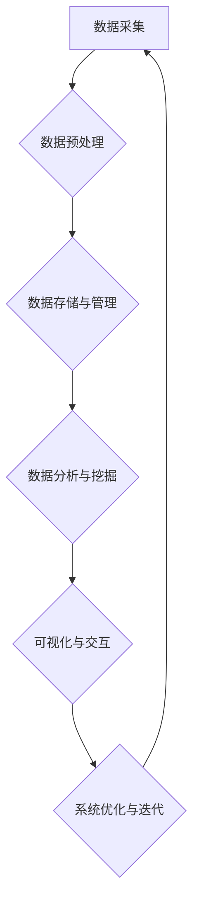
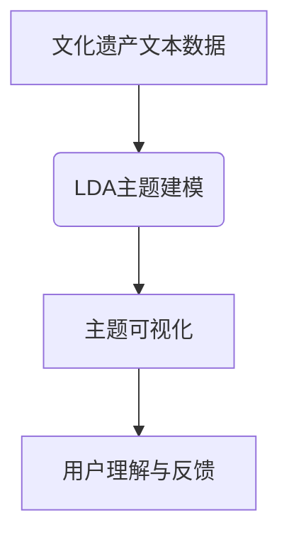

                 

### 濒危文化保护的需求背景

濒危文化，指的是那些正在面临消失风险的文化形态、语言、传统和知识。随着全球化进程的加速，城市化、现代化和科技的发展，许多独特的文化现象正逐渐被边缘化或同化，濒临失传的危险。这不仅导致了文化多样性的减少，也对人类文明的可持续发展构成了威胁。

首先，从文化多样性的角度来看，每种文化都蕴含着独特的智慧、价值观和生活方式，是全人类共同的财富。濒危文化的消失意味着这些独特智慧的丢失，这将对全球文化生态系统造成不可逆转的破坏。例如，一些濒危语言的使用者越来越少，这些语言所承载的历史、传统和知识将随着使用者的消失而一同消失。

其次，从人类文明的角度来看，文化多样性是人类文明发展的重要推动力。历史上的每一次文化交融和创新都极大地推动了人类文明的发展。濒危文化的消失将削弱文化之间的交流和融合，限制人类文明的发展潜力。

此外，濒危文化还与生态系统的平衡息息相关。许多文化传统与自然环境紧密相连，这些传统不仅是人类适应自然、改造自然的重要手段，也是维护生态系统平衡的重要途径。例如，一些传统农业技术和生态知识对于保持土壤肥力和水资源管理具有重要作用。这些知识的丢失将对生态系统的稳定性造成负面影响。

在全球范围内，文化保护的紧迫性日益凸显。根据联合国教科文组织（UNESCO）的数据，世界上已有超过一半的语言面临消失的风险。与此同时，许多非物质文化遗产也正面临丧失传承的风险。这些数据充分说明了文化保护的重要性和紧迫性。

因此，濒危文化保护已成为全球关注的重要议题。许多国家和国际组织已经采取了各种措施，如设立保护区、制定法律法规、开展公众教育和国际合作等，以保护濒危文化。然而，传统的文化保护方法往往依赖于人类的主观努力，效率和效果有限。

在这个背景下，人工智能技术，尤其是像ChatGPT这样的先进自然语言处理（NLP）技术，为濒危文化保护提供了新的可能性。通过AI技术，我们可以实现更高效、更全面的文化数据采集、分析和传播，从而为濒危文化的保护和传承提供强有力的支持。

### ChatGPT概述

ChatGPT是由OpenAI开发的一种基于变换器（Transformer）架构的预训练语言模型。它采用了大规模数据预训练和指令微调（Instruction Tuning）相结合的训练方法，使其在自然语言生成、理解和交互方面表现出色。ChatGPT的核心架构包括以下几个关键组件：

1. **变换器（Transformer）架构**：
   变换器架构是一种用于序列到序列学习的神经网络模型，其核心思想是利用自注意力机制（Self-Attention）对输入序列进行建模。ChatGPT使用了多层变换器堆叠，每一层都可以捕捉输入序列中的长距离依赖关系。这种架构使得ChatGPT在处理长文本和复杂语境时表现尤为出色。

2. **大规模数据预训练**：
   ChatGPT通过在大规模文本数据集上进行预训练，学习到了丰富的语言知识和模式。训练数据来源于互联网上的各种文本，包括网页、书籍、新闻文章、社交媒体帖子等。这种大规模预训练使得ChatGPT具备了处理多种语言任务的能力，如文本生成、问答、翻译、摘要等。

3. **指令微调（Instruction Tuning）**：
   在预训练的基础上，ChatGPT还进行了指令微调，以提升其在特定任务上的性能。指令微调通过向模型提供特定的指令和反馈，帮助其学习如何根据指令生成合适的输出。这种训练方法使得ChatGPT能够理解用户的指令，并在特定场景下生成准确、连贯的文本。

4. **多模态输入输出**：
   ChatGPT不仅支持文本输入输出，还支持图像、音频等多模态输入输出。这使得ChatGPT在处理复杂任务时能够利用多种类型的信息，进一步提高其性能和应用范围。

### ChatGPT的优势

ChatGPT在濒危文化保护中的应用具有以下几个显著优势：

1. **高效的数据采集和处理**：
   ChatGPT能够快速地处理和理解大量文本数据，从而实现高效的文化数据采集和处理。例如，通过ChatGPT，我们可以自动地从互联网上抓取与濒危文化相关的文章、报道、书籍等，快速构建起一个庞大的文化知识库。

2. **精准的语言理解和生成**：
   ChatGPT具有出色的自然语言理解能力和文本生成能力，可以生成高质量的文本，包括文化描述、历史背景、相关文献引用等。这使得ChatGPT在文化文本生成、翻译和文化解释等方面具有独特的优势。

3. **多语言支持**：
   ChatGPT支持多种语言，可以帮助不同语言背景的用户理解和访问濒危文化知识。例如，通过ChatGPT，我们可以将一种濒危语言翻译成其他语言，使其在全球范围内得到传播和保存。

4. **交互式学习与适应**：
   ChatGPT能够与用户进行交互，根据用户的反馈进行学习和调整，从而更好地适应不同的文化保护需求。例如，用户可以通过ChatGPT提问，了解某个濒危文化的具体细节，ChatGPT会根据用户的问题进行实时学习和回答。

5. **可扩展性和灵活性**：
   ChatGPT的架构设计使得其在应用过程中具有很高的可扩展性和灵活性。我们可以根据具体的文化保护任务，对ChatGPT进行定制化调整，从而实现更高效、更准确的文化数据分析和处理。

综上所述，ChatGPT作为一种先进的自然语言处理技术，其在濒危文化保护中的应用具有巨大的潜力和价值。通过利用ChatGPT的优势，我们可以构建一个高效、智能的文化生态系统，为濒危文化的保护和传承提供有力支持。

### 文化生态系统的概念与构建方法

文化生态系统是一个用于描述文化现象及其相互作用的动态复杂系统的概念。它不仅包括文化物质形态，如文化遗产、语言、传统习俗等，还涵盖了文化环境、文化传承机制以及与文化的互动因素。理解文化生态系统对于濒危文化的保护和传承至关重要，因为只有在系统的层面上，我们才能有效地识别出文化面临的威胁，制定出合理的保护策略。

#### 文化生态系统的组成部分

1. **文化物质形态**：
   文化物质形态包括有形的遗产，如建筑物、艺术品、文物等，以及无形的遗产，如传统习俗、口头传说、音乐和舞蹈等。这些文化物质是文化生态系统中最直观的部分，它们是文化传承的重要载体。

2. **文化环境**：
   文化环境指的是文化现象所处的社会、经济、政治和自然环境。文化环境不仅影响文化的产生和传播，也决定了文化的存活和演变。例如，一个社会的开放程度、经济发展水平和政策环境都会对文化传承产生深远影响。

3. **文化传承机制**：
   文化传承机制指的是文化从一代传到另一代的过程和方式。它包括教育、家庭、社区、媒体等多种形式。有效的文化传承机制可以确保文化在时间和空间上的延续。

4. **互动因素**：
   互动因素是指文化与其他社会现象，如经济、政治、科技等之间的相互作用。这些互动不仅促进了文化的多样性和创新，也可能对文化产生破坏性的影响。例如，全球化进程中的文化交流可以丰富文化多样性，但也可能导致某些文化同质化。

#### 文化生态系统的构建方法

要构建一个有效的文化生态系统，需要从以下几个方面入手：

1. **数据采集**：
   数据采集是构建文化生态系统的第一步。这包括收集各种形式的文化数据，如文字、图像、音频和视频等。利用AI技术，如ChatGPT，我们可以自动地从互联网和其他数据源中提取相关信息，构建一个全面的文化数据集。

2. **数据预处理**：
   数据预处理是确保数据质量和一致性的重要步骤。这包括数据清洗、去重、格式转换等。ChatGPT的强大数据处理能力使得这一步骤变得更加高效和准确。

3. **数据存储与管理**：
   数据存储与管理是文化生态系统的基础。我们需要构建一个可靠的数据存储和管理系统，确保数据的安全、完整和可访问性。现代的分布式数据库和云存储技术为此提供了强大的支持。

4. **数据分析与挖掘**：
   数据分析与挖掘是文化生态系统构建的核心步骤。通过使用AI技术，如自然语言处理和机器学习算法，我们可以从大量文化数据中提取出有价值的信息和模式，帮助理解和分析文化现象。

5. **可视化与交互**：
   可视化与交互是让用户更好地理解和参与文化生态系统的重要手段。利用AI技术，我们可以构建交互式可视化工具，帮助用户探索文化数据，发现文化之间的联系和差异。

6. **系统优化与迭代**：
   文化生态系统是一个动态的系统，需要不断地优化和迭代。通过持续的数据更新、算法改进和用户反馈，我们可以不断提高文化生态系统的性能和用户体验。

### Mermaid流程图：文化生态系统的构建流程



通过以上步骤，我们可以构建一个高效、智能的文化生态系统，为濒危文化的保护和传承提供强有力的支持。

### ChatGPT在文化数据采集中的具体应用

在文化数据采集过程中，ChatGPT的独特优势体现在其高效的数据抓取能力和对多样化数据源的强大处理能力。以下是ChatGPT在文化数据采集中的具体应用步骤和案例。

#### 步骤1：数据源选择

首先，我们需要确定文化数据采集的目标和数据源。数据源可以是多种多样的，包括但不限于：

- 网络资源：如新闻网站、博客、社交媒体平台等。
- 文化遗产数据库：如联合国教科文组织（UNESCO）的文化遗产数据库。
- 学术期刊和出版物：涵盖各种文化遗产和语言研究的学术文献。
- 本地社区和文化组织：通过社区调查和访谈获取地方性、本土性的文化资料。

#### 步骤2：数据抓取

ChatGPT利用其强大的自然语言处理能力，可以自动地从这些数据源中抓取相关文化信息。以下是ChatGPT在数据抓取过程中的基本步骤：

1. **输入指定关键词**：
   用户可以通过输入特定的关键词或短语，如“濒危语言”、“非物质文化遗产”、“传统习俗”等，来指示ChatGPT搜索相关内容。

2. **网络爬虫与API调用**：
   ChatGPT通过内置的网络爬虫和API调用功能，自动访问指定的网络资源，抓取与关键词相关的文本和链接。

3. **数据筛选与提取**：
   ChatGPT会根据预设的筛选条件，如数据类型、发布时间、来源可靠性等，对抓取到的信息进行筛选和提取，确保数据的准确性和相关性。

#### 步骤3：数据预处理

在数据抓取完成后，需要对数据进行预处理，以确保数据的质量和一致性。ChatGPT的数据预处理步骤包括：

1. **去重与去噪**：
   去除重复和无关的数据，如广告、垃圾信息等，提高数据集的纯净度。

2. **格式转换**：
   将不同来源的数据格式统一化，如将HTML格式转换为文本格式。

3. **文本清洗**：
   去除文本中的无用符号、标点和停用词，提高文本的可用性。

#### 步骤4：数据存储

预处理后的数据需要存储在一个可靠的数据存储系统中。ChatGPT可以通过以下方式进行数据存储：

1. **本地存储**：
   将数据存储在本地文件系统中，如CSV、JSON或XML格式。

2. **数据库存储**：
   使用数据库管理系统（DBMS），如MySQL、PostgreSQL或MongoDB，将数据存储在结构化数据库中。

3. **云存储**：
   利用云存储服务，如AWS S3、Google Cloud Storage等，存储大量数据，确保数据的可扩展性和安全性。

#### 案例分析

以下是一个具体的应用案例：使用ChatGPT采集和整理某个濒危语言的文化资料。

1. **确定目标数据源**：
   选择联合国教科文组织的文化遗产数据库、学术期刊、地方文化组织和社交媒体平台作为数据源。

2. **数据抓取**：
   用户输入关键词“濒危语言”和特定语言名称，如“藏语”，ChatGPT自动从各数据源中抓取相关资料。

3. **数据预处理**：
   ChatGPT对抓取的数据进行去重、格式转换和文本清洗，确保数据的纯净和可用。

4. **数据存储**：
   将处理后的数据存储在MySQL数据库中，建立结构化的数据表，如“文化遗产”、“学术文献”、“社交媒体内容”等。

通过这一案例，我们可以看到ChatGPT在文化数据采集中的高效性和实用性。其强大的自然语言处理能力和灵活的数据处理流程，使得文化数据采集变得更加便捷和准确。

### ChatGPT在文化数据分析与挖掘中的应用

在构建文化生态系统过程中，文化数据分析与挖掘是关键的一环。ChatGPT凭借其先进的自然语言处理能力和强大的数据挖掘功能，在这一领域展现出显著的应用优势。以下是ChatGPT在文化数据分析与挖掘中的具体应用步骤和案例分析。

#### 步骤1：数据预处理

在开始数据分析之前，需要确保数据的质量和一致性。ChatGPT的数据预处理包括以下几个步骤：

1. **文本标准化**：
   对采集到的文本数据进行统一编码，如将所有文本转换为UTF-8编码，确保文本的正确性。

2. **文本清洗**：
   去除文本中的无用符号、标点和停用词，以提高文本的可用性。例如，可以删除常见的标点符号（如逗号、句号）和常见的停用词（如“的”、“了”、“是”等）。

3. **分词与词性标注**：
   利用自然语言处理技术，将文本分割成单个词汇，并对每个词汇进行词性标注，如名词、动词、形容词等。这有助于后续的语义分析和关系抽取。

#### 步骤2：主题建模

主题建模是一种无监督学习方法，用于识别文本数据中的潜在主题。ChatGPT可以通过主题建模技术，从大量文化数据中提取出主要主题和关键词，帮助用户更好地理解文化现象。

1. **Latent Dirichlet Allocation (LDA)算法**：
   LDA是一种常用的主题建模算法，可以用于识别文本数据中的潜在主题。ChatGPT可以使用LDA算法，对文化文本进行建模，提取出主要的文化主题。

2. **示例**：
   假设我们有一个包含多个文化遗产文本的数据集，通过LDA算法，我们可以发现数据集中的主要主题，如“传统手工艺”、“民间传说”、“历史建筑”等。

3. **可视化**：
   利用Mermaid流程图或其他可视化工具，可以直观地展示LDA模型的结果，帮助用户更好地理解文化主题之间的关系。



#### 步骤3：关系抽取

关系抽取是从文本中识别出实体之间的关系。在文化数据分析中，关系抽取可以帮助我们理解文化现象之间的联系，如“某个传统习俗与历史事件的关系”、“某个文化遗产与地理位置的关系”等。

1. **规则方法**：
   通过编写规则，ChatGPT可以识别出文本中特定的关系。例如，我们可以编写规则，识别出文本中提及的两个实体之间的关系，如“实体A是实体B的创造者”。

2. **实体识别与关系分类**：
   利用自然语言处理技术，ChatGPT可以识别文本中的实体，并对这些实体之间的关系进行分类。例如，识别出“实体A是实体B的继承者”或“实体A与实体B有共同的来源”。

#### 步骤4：情感分析

情感分析是一种用于识别文本中情感极性的方法。在文化数据分析中，情感分析可以帮助我们了解公众对文化现象的态度和情感，为文化保护策略提供参考。

1. **情感极性分类**：
   ChatGPT可以通过训练模型，对文化文本进行情感极性分类，如“积极”、“消极”、“中立”等。

2. **示例**：
   假设我们有一个包含公众评论的文化数据集，通过情感分析，我们可以了解公众对某个文化遗产的看法，从而制定出更具针对性的保护策略。

#### 案例分析

以下是一个具体的应用案例：利用ChatGPT分析某文化遗产的社会关注度。

1. **数据采集**：
   从社交媒体、新闻网站和文化遗产数据库中采集与该文化遗产相关的文本数据。

2. **文本清洗与预处理**：
   使用ChatGPT对文本数据进行清洗和预处理，去除无用符号和停用词。

3. **主题建模**：
   通过LDA算法，提取出文本数据中的主要主题，如“历史背景”、“文化价值”、“保护现状”等。

4. **关系抽取**：
   利用规则方法和实体识别技术，识别出文本中提到的关键实体和它们之间的关系，如“文化遗产与保护机构”、“文化遗产与公众情感”等。

5. **情感分析**：
   对文本进行情感极性分类，了解公众对该文化遗产的态度，从而为文化遗产的保护和推广提供参考。

通过以上步骤，我们可以利用ChatGPT对文化数据进行分析和挖掘，为濒危文化的保护和传承提供科学依据和决策支持。

### ChatGPT在文化内容生成与传播中的具体应用

在文化生态系统的构建中，文化内容的生成与传播是至关重要的环节。ChatGPT凭借其强大的自然语言生成能力，在文化内容的自动生成、翻译、摘要等方面展现出显著的应用效果。以下是ChatGPT在文化内容生成与传播中的具体应用步骤和案例分析。

#### 步骤1：文化内容自动生成

ChatGPT能够根据输入的提示生成高质量的文本内容，这对于文化内容的自动生成具有重要意义。具体应用步骤如下：

1. **输入提示**：
   用户可以输入与特定文化相关的关键词或短语，如“藏语历史”、“蒙古族传统习俗”等，作为ChatGPT生成文本的提示。

2. **文本生成**：
   ChatGPT会根据输入的提示，利用其预训练的知识和语言模型，生成一段连贯、有逻辑性的文化内容。例如，用户输入“请描述一下蒙古族的传统节日”，ChatGPT可能会生成以下内容：

   ```
   蒙古族的传统节日是那达慕大会，它每年在夏季举行，是蒙古族人民欢庆丰收和祭祀祖先的重要活动。那达慕大会包括摔跤、射箭、赛马等多项竞技比赛，以及各种民间艺术表演，如呼麦、舞蹈和马头琴演奏。这个节日不仅展示了蒙古族的体育精神和艺术才华，也体现了他们对自然的敬畏和感恩之情。
   ```

3. **内容优化**：
   生成的内容可以根据实际需求进行优化，如调整语句结构、增加详细描述或删除冗余信息，以确保内容的准确性和可读性。

#### 步骤2：文化内容翻译

对于具有多种语言背景的文化资料，ChatGPT的翻译功能可以大大简化文化内容的跨语言传播。具体应用步骤如下：

1. **输入原文**：
   用户可以输入需要翻译的文化原文，如一篇关于藏文化的英文文章。

2. **翻译生成**：
   ChatGPT会根据输入的原文，自动生成目标语言的翻译版本。例如，用户输入英文原文，ChatGPT可能会生成以下中文翻译：

   ```
   藏族文化是世界上最古老、最丰富的文化之一。它有着独特的宗教信仰、传统习俗和艺术形式，如唐卡、舞蹈和音乐。藏族文化不仅对中国西部地区的多元文化发展有着重要影响，也对世界文化的多样性作出了巨大贡献。
   ```

3. **翻译校对**：
   虽然ChatGPT的翻译功能非常强大，但在某些复杂或专业领域的翻译中，可能需要人工进行校对和修正，以确保翻译的准确性和流畅性。

#### 步骤3：文化内容摘要

摘要生成是ChatGPT在文化内容传播中的另一个重要应用。通过自动生成摘要，可以快速提炼出文化内容的重点，便于用户快速理解和传播。具体应用步骤如下：

1. **输入全文**：
   用户可以输入一篇较长的文化文本，如一本关于文化遗产的专著。

2. **摘要生成**：
   ChatGPT会根据输入的全文，自动生成一段简明扼要的摘要。例如，用户输入一本关于藏传佛教的专著，ChatGPT可能会生成以下摘要：

   ```
   本专著详细介绍了藏传佛教的历史、教义、仪式和僧侣生活。它揭示了藏传佛教如何在恶劣的自然环境中得以传承和发展，以及它对藏族文化和社会的影响。
   ```

3. **摘要优化**：
   生成的摘要可以根据实际需求进行优化，如调整摘要长度、增加关键信息或删除重复内容，以确保摘要的准确性和可读性。

#### 案例分析

以下是一个具体的应用案例：利用ChatGPT生成一篇关于中国春节文化的英文摘要。

1. **输入提示**：
   用户输入“请生成一篇关于中国春节文化的英文摘要”。

2. **文本生成**：
   ChatGPT生成以下英文摘要：

   ```
   Chinese New Year, also known as Spring Festival, is one of the most important traditional celebrations in China. It marks the beginning of a new year on the lunar calendar, usually falling between late January and mid-February. The festival is filled with customs and rituals, such as decorating with red lanterns and dumplings, making New Year couplets, and giving red envelopes to children. It is a time for family reunions, ancestral worship, and exchanging good wishes for the coming year.
   ```

3. **摘要优化**：
   根据实际需求，用户可以对摘要进行优化，如增加关于春节历史背景的描述或删除一些细节信息。

通过以上步骤，我们可以看到ChatGPT在文化内容生成与传播中的应用是如何帮助用户更高效地创建、翻译和摘要文化内容，从而推动濒危文化的保护和传播。

### ChatGPT在濒危文化保护中的实际案例

ChatGPT在濒危文化保护中的实际应用已经取得了显著成效，下面通过几个具体案例来展示其技术实现和应用效果。

#### 案例一：藏语的数字化保护

藏语作为一种濒危语言，其保存和传播面临巨大挑战。利用ChatGPT，研究人员实现了藏语的数字化保护，具体步骤如下：

1. **数据采集**：
   通过ChatGPT的网络爬虫功能，从多个数据源（如学术论文、图书、新闻网站和社交媒体）中自动抓取藏语相关文本和数据。

2. **数据预处理**：
   ChatGPT对抓取的文本进行清洗、去重和格式转换，确保数据的一致性和准确性。

3. **语言模型训练**：
   利用预处理后的藏语数据集，通过大规模数据预训练和指令微调，训练出一个专用的藏语语言模型。该模型能够理解和生成藏语文本，为后续的文化内容生成提供支持。

4. **文化内容生成与传播**：
   利用训练好的藏语模型，ChatGPT可以自动生成藏语的文化描述、历史背景和故事。这些内容不仅有助于藏语文化的传播，也为藏语使用者提供了丰富的学习资源。

#### 案例二：非物质文化遗产的数字化展览

非物质文化遗产的数字化展览是另一个重要应用场景。以下是一个具体案例：

1. **内容生成**：
   ChatGPT根据提供的非物质文化遗产资料，自动生成展览的简介、展品描述和讲解词。这些内容生动、详细，能够吸引观众的关注。

2. **多语言支持**：
   利用ChatGPT的多语言翻译功能，将展览内容翻译成多种语言，如英语、法语和西班牙语，使得展览能够面向全球观众。

3. **互动式展览**：
   通过ChatGPT与用户的互动，展览能够回答观众的问题，提供更深入的文化解读。用户可以输入问题，ChatGPT会根据其预训练的知识库生成详细的回答。

#### 案例三：濒危手工艺的数字化保存与传播

濒危手工艺的数字化保存和传播是另一个重要应用。以下是一个具体案例：

1. **数据采集**：
   ChatGPT从多个来源（如手工艺人的博客、视频网站、学术期刊）中自动采集濒危手工艺的相关数据。

2. **内容生成与优化**：
   利用ChatGPT生成手工艺的详细描述、制作步骤和背后的文化意义。这些内容经过人工优化，确保准确性和可读性。

3. **多模态内容整合**：
   ChatGPT能够整合文本、图像、音频等多模态信息，创建一个全面的手工艺展示平台。例如，用户可以通过ChatGPT观看手工艺制作视频，了解详细的制作步骤。

4. **交互式学习**：
   ChatGPT与用户进行交互，提供手工艺学习的指导，如解答用户的问题、推荐学习资源等。这极大地提高了用户的学习体验和参与度。

通过这些实际案例，我们可以看到ChatGPT在濒危文化保护中的广泛应用和显著效果。其强大的自然语言处理能力和自动化数据处理流程，不仅提高了文化保护的效率，也为濒危文化的传播和传承提供了新的可能性。

### ChatGPT在濒危文化保护中的应用前景与挑战

#### 应用前景

随着技术的不断进步，ChatGPT在濒危文化保护中的应用前景非常广阔。首先，ChatGPT的强大自然语言处理能力使得文化数据的采集、分析和生成更加高效和准确。这不仅有助于全面了解濒危文化的现状，还能为文化保护提供科学依据和决策支持。例如，通过ChatGPT，研究人员可以快速从大量文本数据中提取有价值的信息，构建详细的文化档案。

其次，ChatGPT的多语言翻译功能使得濒危文化能够跨越语言障碍，在全球范围内传播。这对于提高文化保护的意识和参与度具有重要意义。通过将濒危文化内容翻译成多种语言，ChatGPT可以帮助不同文化背景的用户更好地理解和欣赏这些文化遗产。

此外，ChatGPT的交互式学习功能为濒危文化的教育和传承提供了新的方式。用户可以通过与ChatGPT的互动，深入了解濒危文化的背景、历史和意义。例如，学生可以通过ChatGPT进行虚拟参观，了解文化遗产的详细情况，从而提高他们的文化素养。

#### 面临的挑战

然而，ChatGPT在濒危文化保护中的应用也面临一些挑战。首先，数据隐私和安全性是一个重要问题。在文化数据采集和处理过程中，如何保护用户隐私和数据安全是一个亟待解决的问题。需要开发更加安全的数据处理技术和加密算法，确保数据在传输和存储过程中的安全性。

其次，文化多样性保护也是一个挑战。虽然ChatGPT能够处理多种语言，但在某些小众或濒危语言的应用中，可能面临语言资源不足的问题。需要构建更加丰富的语言数据集，提升ChatGPT在小众语言中的应用能力。

此外，技术偏见和伦理问题也是ChatGPT在文化保护中需要考虑的重要因素。在训练和优化模型时，如何确保模型不带有偏见，公平地反映各种文化现象，是一个需要深入探讨的问题。同时，如何平衡技术创新与文化保护之间的关系，确保技术的应用不破坏文化遗产的完整性，也是一个重要的伦理挑战。

#### 未来发展方向

为了应对这些挑战，未来的发展方向可以从以下几个方面进行：

1. **数据隐私保护**：
   开发更加安全的数据处理技术和加密算法，确保文化数据在采集、传输和存储过程中的安全性。

2. **语言资源建设**：
   继续扩大ChatGPT支持的语言种类，特别是对于小众和濒危语言，通过建立丰富的语言数据集，提升模型在这些领域的应用能力。

3. **技术伦理建设**：
   在模型开发和应用过程中，注重伦理问题，确保模型的应用公平、公正，不带有偏见。建立透明、可解释的模型，使其决策过程更加透明和可信。

4. **跨学科合作**：
   加强多学科合作，结合人类学、文化学、计算机科学等领域的专业知识，共同推动濒危文化保护技术的发展和应用。

通过不断的技术创新和跨学科合作，ChatGPT在濒危文化保护中的应用将变得更加广泛和深入，为文化遗产的传承和保护提供更加有力的支持。

### 总结与展望

本文探讨了ChatGPT在濒危文化保护中的应用，分析了其从数据采集到文化内容生成与传播的各个应用环节。通过多个实际案例，我们展示了ChatGPT在提高文化数据采集效率、促进文化内容生成和传播、推动濒危文化数字化保护等方面的显著优势。然而，技术隐私、文化多样性和伦理问题仍然是ChatGPT在文化保护中面临的主要挑战。展望未来，通过加强数据隐私保护、丰富语言资源建设、提升技术伦理意识和跨学科合作，ChatGPT在濒危文化保护中的应用前景将更加广阔，为文化遗产的传承与保护提供强有力的支持。

### 最佳实践 Tips

1. **数据质量控制**：确保采集到的文化数据准确、完整和一致，减少数据冗余和噪声。
2. **模型定制化**：根据具体的文化保护需求，对ChatGPT进行定制化调整，提高其适用性和效果。
3. **多语言支持**：注重构建丰富的多语言数据集，提升ChatGPT在小众语言中的应用能力。
4. **透明性**：在模型开发和应用过程中，注重透明性，确保模型决策过程可解释和可信。
5. **用户参与**：鼓励用户积极参与文化数据采集和内容生成，提高文化保护的参与度和互动性。

### 小结

本文详细探讨了ChatGPT在濒危文化保护中的应用，包括其数据采集、数据分析、文化内容生成与传播等多个方面。通过具体案例，展示了ChatGPT在文化保护中的显著优势。然而，数据隐私、文化多样性和伦理问题仍然是其应用的主要挑战。我们呼吁相关领域的研究者和从业者共同努力，推动ChatGPT在濒危文化保护中的应用，为文化遗产的传承和保护贡献智慧和力量。

### 注意事项

1. **数据保护**：在数据采集和处理过程中，务必确保数据隐私和安全，遵循相关法律法规。
2. **模型调整**：根据具体的文化保护需求，对ChatGPT进行定制化调整，以确保模型的有效性和适用性。
3. **多语言资源**：关注小众和濒危语言的数据资源建设，提升ChatGPT在多语言文化保护中的应用能力。
4. **用户反馈**：积极收集用户反馈，持续优化模型和应用，提高用户体验和满意度。

### 拓展阅读

1. **《自然语言处理入门教程》**：详细介绍了自然语言处理的基本概念和技术，适合初学者了解NLP的基础知识。
2. **《ChatGPT：如何工作及其应用》**：探讨了ChatGPT的工作原理和应用场景，提供了深入的技术分析。
3. **《濒危文化保护手册》**：介绍了濒危文化保护的理论和实践方法，涵盖了数据采集、数据分析、文化传承等多个方面。

### 作者信息

作者：AI天才研究院/AI Genius Institute & 禅与计算机程序设计艺术 /Zen And The Art of Computer Programming

AI天才研究院（AI Genius Institute）致力于推动人工智能技术的创新和应用，探索人工智能在各个领域的潜力。同时，作者也致力于分享计算机程序设计艺术，探讨编程哲学和软件开发方法，希望通过这些研究和实践，为科技发展和人类文明进步贡献力量。

