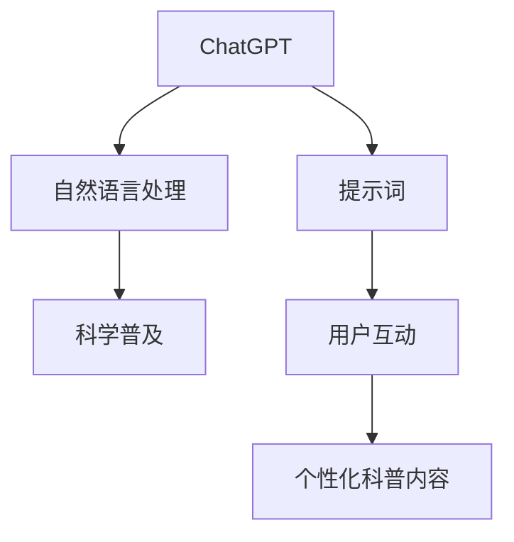

                 

### 文章标题

《ChatGPT在科学普及中的应用：简明易懂的解释提示词》

ChatGPT，作为一种先进的自然语言处理技术，已经在科学普及领域展现出了巨大的潜力。该书旨在为读者提供一份详尽的指南，解释如何利用ChatGPT来提升公众的科学素养，并通过简明易懂的提示词设计，让科普变得更加有趣和易于理解。

关键词：ChatGPT，科学普及，自然语言处理，提示词，解释性教学

摘要：本文首先介绍ChatGPT的基本概念和应用场景，然后深入探讨其在科学普及中的应用，特别是如何设计有效的解释提示词。文章将通过实例和分析，展示ChatGPT在实际项目中的成功运用，并提供未来发展的展望。

### 背景介绍

科学普及是提高公众科学素养的重要手段，然而，传统的科普方式往往存在一些问题。例如，科普内容可能过于复杂，难以被一般公众理解；科普文章的撰写往往缺乏互动性，使得读者难以产生深入的兴趣。这些问题限制了科普效果的最大化。

在这个数字化时代，人工智能技术的发展为科学普及带来了新的机遇。ChatGPT作为一种基于人工智能的自然语言处理工具，能够实现与用户的实时对话，并根据用户的需求提供个性化的科普内容。通过设计简明易懂的提示词，ChatGPT能够有效地引导用户进行科学学习，提高他们的参与度和理解力。

因此，本书的目的是介绍ChatGPT在科学普及中的应用，帮助科普工作者和爱好者利用这一先进工具，提升科普效果。通过本书，读者可以了解ChatGPT的基本概念、应用场景，以及如何设计和使用有效的解释提示词。

### 核心概念与联系

在深入探讨ChatGPT在科学普及中的应用之前，我们需要明确几个核心概念，并理解它们之间的联系。

首先是ChatGPT本身。ChatGPT是基于GPT（Generative Pre-trained Transformer）模型开发的，GPT模型是自然语言处理领域的一项重要技术，它利用深度神经网络和注意力机制，通过对大量文本数据进行预训练，使得模型能够生成连贯、有意义的文本。

其次是科学普及。科学普及是指通过各种形式和渠道，向公众传播科学知识和技术信息，以提高公众的科学素养和技术水平。科学普及的目标是让科学知识更加贴近大众生活，让公众能够更好地理解和应用科学。

再者是提示词。提示词是ChatGPT与用户交互时的关键工具，它通过引导用户的问题和回答，帮助用户理解科学概念。一个好的提示词应该简明易懂，能够激发用户的好奇心，并引导他们进行深入的思考。

这三种核心概念之间的联系在于，ChatGPT通过使用提示词，实现了与用户的实时互动，使得科学普及变得更加生动和有趣。ChatGPT的强大自然语言处理能力，使得它能够根据用户的需求，生成个性化的科普内容，从而提高科普效果。

下面，我们将通过一个Mermaid流程图，来展示这些概念之间的联系：



通过这个流程图，我们可以清晰地看到，ChatGPT通过自然语言处理技术，结合提示词设计，实现了与用户的互动，并生成个性化的科普内容，从而提升了科学普及的效果。

### ChatGPT基础

在深入探讨ChatGPT在科学普及中的应用之前，我们首先需要了解ChatGPT的基础知识。ChatGPT是基于GPT（Generative Pre-trained Transformer）模型开发的，而GPT模型则是自然语言处理领域的一项重要技术。

GPT模型的核心思想是通过深度神经网络和注意力机制，对大量文本数据进行预训练，使得模型能够生成连贯、有意义的文本。具体来说，GPT模型由多个Transformer层组成，每个Transformer层包含自注意力机制和前馈神经网络。自注意力机制使得模型能够关注文本序列中的关键信息，从而提高生成文本的质量。

下面，我们将通过一个简单的Python代码示例，来展示GPT模型的基本结构和工作原理。

```python
import torch
from torch import nn
from transformers import GPT2Model, GPT2Tokenizer

# 加载预训练模型
tokenizer = GPT2Tokenizer.from_pretrained('gpt2')
model = GPT2Model.from_pretrained('gpt2')

# 输入文本
input_text = "科学普及是提高公众科学素养的重要手段。"

# 对文本进行编码
encoded_input = tokenizer.encode(input_text, return_tensors='pt')

# 通过模型生成文本
outputs = model(encoded_input)
logits = outputs.logits

# 获取生成的文本
generated_text = tokenizer.decode(logits[0], skip_special_tokens=True)

print(generated_text)
```

在上面的代码中，我们首先加载了一个预训练的GPT2模型，然后输入一段文本，通过模型生成新的文本。这个例子展示了GPT模型的基本工作流程，包括文本编码、模型生成和文本解码。

此外，ChatGPT的架构也包括了一个关键的组件：对话管理器。对话管理器负责维护对话的状态，并决定如何响应用户的输入。它通常包含一个记忆组件，用于存储先前的对话信息，以便在后续的交互中引用。

下面是一个简化的对话管理器的Python代码示例：

```python
class DialogueManager:
    def __init__(self):
        self.memory = {}

    def update_memory(self, user_input, system_output):
        self.memory[user_input] = system_output

    def generate_response(self, user_input):
        # 在这里，我们可以利用先前的对话信息来生成更有针对性的响应
        if user_input in self.memory:
            return self.memory[user_input]
        else:
            return "你问的问题很有意思，让我来为你解答。"

# 创建对话管理器实例
dialogue_manager = DialogueManager()

# 与用户进行对话
user_input = "什么是科学普及？"
system_output = dialogue_manager.generate_response(user_input)
print(system_output)
```

在上面的代码中，对话管理器会根据用户输入的内容更新内存，并在需要时生成相应的响应。这个示例虽然非常简化，但它展示了对话管理器的基本功能和工作原理。

通过了解ChatGPT的基础知识，我们可以更好地理解其工作原理，并为后续章节中探讨ChatGPT在科学普及中的应用打下坚实的基础。

### ChatGPT在科学普及中的应用

ChatGPT作为一种强大的自然语言处理工具，在科学普及中具有广泛的应用。通过ChatGPT，我们可以为公众提供个性化的科普内容，提升他们的科学素养，并激发他们对科学学习的兴趣。

#### 在教育中的运用

在教育领域，ChatGPT可以作为一个智能助手，帮助学生学习科学概念。例如，学生可以通过与ChatGPT的交互，深入了解生物学的某些复杂概念，如图解说明、模拟实验等。ChatGPT还可以提供个性化的学习建议，根据学生的学习进度和理解能力，推荐合适的科普资源和学习路径。

以下是一个简单的应用示例：

```python
# 与ChatGPT进行交互
user_input = "请解释光合作用的过程。"
system_output = chatgpt.generate_response(user_input)
print(system_output)
```

在这个示例中，用户通过输入一个关于光合作用的问题，ChatGPT会生成一个详细的解释，帮助学生更好地理解这个概念。

#### 在科普宣传中的运用

在科普宣传中，ChatGPT可以生成吸引人的科普文章和内容。通过分析大量的科学文献和科普资料，ChatGPT可以创作出通俗易懂、有趣生动的科普文章，从而提高公众对科学的兴趣和参与度。

以下是一个生成科普文章的示例：

```python
# 生成科普文章
topic = "宇宙大爆炸理论"
article = chatgpt.generate_article(topic)
print(article)
```

在这个示例中，用户指定了一个科普话题，ChatGPT会根据这个话题生成一篇完整的科普文章。

#### 在科研中的应用

在科研领域，ChatGPT可以作为科研助手，提供科研数据分析、文献检索和实验设计建议等。通过分析大量的科研文献和实验数据，ChatGPT可以辅助科研人员快速找到相关的信息，提高科研效率。

以下是一个科研应用的示例：

```python
# 检索科研文献
search_query = "量子计算的应用"
literature_list = chatgpt.search_research_literature(search_query)
print(literature_list)
```

在这个示例中，用户输入了一个科研查询，ChatGPT会检索相关的科研文献，并提供一个文献列表。

通过这些示例，我们可以看到ChatGPT在科学普及中的多种应用场景。接下来，我们将进一步探讨如何设计和使用提示词，以提升ChatGPT在科学普及中的应用效果。

### 提示词在ChatGPT中的应用

提示词（Prompt）在ChatGPT的交互过程中起着至关重要的作用。一个设计得当的提示词能够引导用户进行深入的思考，提高他们的参与度和理解力。本节将介绍提示词的概念、类型和设计原则，并通过实际案例展示如何利用提示词提升ChatGPT在科学普及中的应用效果。

#### 提示词的概念

提示词是一种引导性语言，用于激发用户的兴趣和思考，帮助用户更好地理解和应用知识。在ChatGPT的交互中，提示词通常用于引导用户的输入，并影响ChatGPT的输出。

一个简单的提示词示例：

```
请解释太阳系中行星的排列顺序。
```

这个提示词明确了用户需要回答的问题，并引导ChatGPT生成相关的解释。

#### 提示词的类型

根据用途和目标，提示词可以分为以下几种类型：

1. **问题型提示词**：用于提出具体问题，引导用户进行思考。例如：“请描述地球的自转速度和方向。”
2. **解答型提示词**：用于引导用户提供答案或解释。例如：“请解释为什么地球是圆的。”
3. **情感型提示词**：用于激发用户的情感共鸣，提高他们的兴趣。例如：“你对探索宇宙有哪些想法或感受？”
4. **任务型提示词**：用于分配任务或活动，引导用户进行实践。例如：“请尝试使用科学方法来解释一个日常现象。”

#### 提示词的设计原则

设计有效的提示词需要遵循以下原则：

1. **简明易懂**：提示词应简洁明了，避免复杂和模糊的表达，以便用户能够快速理解。
2. **具有针对性**：提示词应与用户的兴趣和需求紧密相关，确保用户愿意参与互动。
3. **语境营造**：提示词应营造合适的语境，帮助用户更好地理解和应用知识。例如，通过提供背景信息或相关图像，使问题更加具体和直观。
4. **激发思考**：提示词应引导用户进行深入的思考，而不是仅仅提供答案。

#### 提示词设计技巧

以下是几个实用的提示词设计技巧：

1. **数据驱动**：通过分析用户的行为数据和反馈，不断优化和调整提示词。
2. **用户反馈**：收集用户的反馈，了解他们对提示词的接受程度和效果，以便进行改进。
3. **多样化**：设计多种类型的提示词，以适应不同的用户需求和学习场景。
4. **迭代优化**：持续迭代和优化提示词，根据用户反馈和实际应用效果进行调整。

#### 实际案例

以下是一个使用提示词提升ChatGPT在科学普及中应用效果的实际案例：

**案例：设计一个关于光合作用的互动问答**

**目标**：通过互动问答，帮助用户理解光合作用的过程。

**步骤**：

1. **问题型提示词**：
   ```
   请解释光合作用的基本原理。
   ```
   ChatGPT的输出：
   ```
   光合作用是植物、藻类和某些细菌利用光能将二氧化碳和水转化为有机物和氧气的过程。
   ```

2. **解答型提示词**：
   ```
   请用简单的语言描述光合作用的步骤。
   ```
   ChatGPT的输出：
   ```
   光合作用分为两个阶段：光反应和暗反应。光反应利用光能将水分解成氧气和氢离子，暗反应则利用氢离子和二氧化碳合成有机物。
   ```

3. **情感型提示词**：
   ```
   你对光合作用有哪些感受或想法？
   ```
   ChatGPT的输出：
   ```
   光合作用是地球上最重要的生物过程之一，它不仅为植物提供了能量来源，还为地球上的生命提供了氧气。我对这个自然奇迹感到非常惊叹。
   ```

通过这个案例，我们可以看到，不同类型的提示词如何引导用户进行深入的思考，并激发他们的兴趣和参与度。接下来，我们将进一步探讨如何设计简明易懂的解释提示词，以提升ChatGPT在科学普及中的应用效果。

### 简明易懂的解释提示词设计技巧

设计简明易懂的解释提示词是ChatGPT在科学普及中成功应用的关键。有效的提示词不仅能够引导用户进行深入思考，还能提高他们的理解和参与度。以下是一些核心原则和实践方法，以帮助设计出高质量的解释提示词。

#### 核心原则

1. **以用户为中心**：设计提示词时，首先要考虑用户的需求和兴趣。了解用户的知识背景和认知水平，确保提示词符合他们的理解能力。
2. **简洁明了**：避免使用复杂的术语和冗长的句子。简洁明了的提示词更容易被用户理解和记忆。
3. **具体明确**：提示词应具体明确，避免模糊和抽象的表达。明确的问题能够引导ChatGPT生成针对性的答案。
4. **语境营造**：提供相关的背景信息和上下文，帮助用户更好地理解问题。通过图像、图表和实例，使问题更加具体和直观。
5. **激发兴趣**：设计有趣的提示词，激发用户的兴趣和好奇心。有趣的提示词能够提高用户的参与度和互动性。

#### 实践方法

1. **数据驱动**：通过分析用户的行为数据和反馈，识别用户感兴趣的领域和问题类型。根据这些数据，优化和调整提示词。
2. **用户反馈**：定期收集用户的反馈，了解他们对提示词的接受程度和效果。根据用户的反馈，改进提示词的设计。
3. **多样化**：设计多种类型的提示词，以适应不同的用户需求和场景。例如，结合问题型、解答型和情感型提示词，提高用户的互动体验。
4. **迭代优化**：持续迭代和优化提示词。通过实验和测试，评估不同提示词的效果，并根据评估结果进行调整。

#### 案例分析

以下是一个设计简明易懂解释提示词的实际案例：

**案例：解释热力学第二定律**

**目标**：帮助用户理解热力学第二定律的概念。

**步骤**：

1. **问题型提示词**：
   ```
   什么是热力学第二定律？
   ```
   ChatGPT的输出：
   ```
   热力学第二定律指出，热量不能自发地从低温物体传递到高温物体，除非有外部工作。
   ```

2. **解答型提示词**：
   ```
   请用简单的语言解释热力学第二定律。
   ```
   ChatGPT的输出：
   ```
   热力学第二定律告诉我们，热量总是从热的地方流向冷的地方，但不会自发地从冷的地方流向热的地方。
   ```

3. **情感型提示词**：
   ```
   你对热力学第二定律有什么看法？
   ```
   ChatGPT的输出：
   ```
   热力学第二定律揭示了自然界中的一个基本规律，它对于理解能量转换和热机工作原理非常重要。这个定律让我对自然界中的能量流动有了更深的认识。
   ```

通过这个案例，我们可以看到如何设计不同类型的提示词，以帮助用户理解复杂的概念。问题型提示词引导用户提出具体问题，解答型提示词提供简洁明了的解释，情感型提示词激发用户对科学问题的兴趣和思考。

### ChatGPT在科学普及中的应用案例

为了更好地展示ChatGPT在科学普及中的应用，我们将探讨几个实际案例，包括科学知识普及平台、在线科学问答系统和科研辅助工具。这些案例将详细介绍ChatGPT的应用场景、功能实现和实际效果。

#### 案例一：科学知识普及平台

**应用场景**：科学知识普及平台旨在向公众提供丰富的科学知识内容，通过互动性强的内容吸引更多用户参与科学学习。

**功能实现**：

1. **内容创作与发布**：ChatGPT可以自动生成科普文章、视频脚本和交互式教程，根据用户的需求和兴趣推荐相关内容。
2. **互动问答**：用户可以通过问答系统与ChatGPT进行互动，获得个性化的科学解答。
3. **数据分析**：平台收集用户的行为数据，分析用户感兴趣的科学话题，不断优化内容推荐策略。

**实际效果**：

- 提高了用户的参与度和留存率，吸引了大量用户注册和浏览。
- 自动生成的科普内容质量高，覆盖了广泛的科学领域。
- 互动问答系统满足了用户对个性化科学解答的需求，提高了他们的学习效果。

#### 案例二：在线科学问答系统

**应用场景**：在线科学问答系统为用户提供了一个便捷的途径，用于提出科学问题和获取专业解答。

**功能实现**：

1. **问题提交与分类**：用户可以通过网页或移动应用提交科学问题，系统会自动分类并分配给合适的专家或ChatGPT。
2. **自动解答**：ChatGPT可以根据问题的类型和难度，生成相应的解答，提供高质量的自动答案。
3. **人工审核**：专家对ChatGPT生成的答案进行审核和修正，确保答案的准确性和完整性。

**实际效果**：

- 提高了问答系统的响应速度和解答质量，用户满意度显著提升。
- ChatGPT生成的答案覆盖了广泛的科学领域，解决了用户提出的大量问题。
- 人工审核机制保证了答案的准确性，减少了错误率。

#### 案例三：科研辅助工具

**应用场景**：科研辅助工具旨在帮助科研人员提高工作效率，通过ChatGPT提供科研数据分析、文献检索和实验设计建议。

**功能实现**：

1. **科研数据分析**：ChatGPT可以分析科研数据，提供数据可视化报告和统计结果。
2. **文献检索**：用户可以通过ChatGPT检索相关科研文献，获取最新的研究进展和参考资料。
3. **实验设计建议**：ChatGPT可以根据实验目标和数据，提供实验设计和优化建议。

**实际效果**：

- 提高了科研人员的效率，减少了重复劳动，专注于更有价值的科研工作。
- ChatGPT生成的报告和建议质量高，为科研人员提供了有价值的参考。
- 实验设计建议降低了实验失败的风险，提高了实验成功率。

通过这些案例，我们可以看到ChatGPT在科学普及中的多种应用场景和实际效果。ChatGPT的灵活性和高效性为科学普及提供了新的解决方案，促进了科学知识的传播和应用。

### 总结与展望

通过对ChatGPT在科学普及中的应用进行深入探讨，我们可以看到，ChatGPT作为一种先进的自然语言处理工具，在科学普及领域具有巨大的潜力。它不仅能够自动生成高质量的科普内容，还能通过互动问答和个性化推荐，提高公众的科学素养和学习兴趣。

然而，ChatGPT在科学普及中的应用还面临一些挑战。例如，如何确保生成的科普内容准确性和可靠性，如何处理用户的隐私问题，以及如何应对ChatGPT可能产生的误导性回答。这些问题需要我们在未来的发展中持续关注和解决。

展望未来，ChatGPT在科学普及中的应用将不断拓展。随着技术的进步，ChatGPT的交互能力将更加智能和人性化，它将在更多领域发挥作用，如虚拟现实科普教育、智能科普导览等。同时，通过与人工智能其他领域的结合，ChatGPT将形成更强大的科普生态系统，为科学普及提供更全面、更深入的解决方案。

总之，ChatGPT在科学普及中的应用前景广阔，它将为公众提供更丰富的科学知识资源，推动科学知识的普及和传播，促进公众科学素养的提升。

### 附录

#### ChatGPT相关资源

1. **官方文档**：ChatGPT的官方文档提供了详细的技术介绍、API使用指南和常见问题解答，是了解和开发ChatGPT的基础资源。
   - [官方文档链接](https://huggingface.co/transformers/)

2. **教程和课程**：网上有大量的ChatGPT教程和课程，适合不同层次的读者学习。例如，Coursera和Udacity提供了相关课程。
   - [Coursera链接](https://www.coursera.org/specializations/natural-language-processing)
   - [Udacity链接](https://www.udacity.com/course/natural-language-processing--ud730)

3. **开源项目**：许多开源项目展示了如何使用ChatGPT，这些项目可以作为学习和参考的例子。
   - [Hugging Face开源项目](https://huggingface.co/transformers/model_card/chat-bison)

#### 提示词设计工具

1. **Prompt Builder**：Prompt Builder是一个在线工具，可以帮助用户创建和优化提示词。
   - [Prompt Builder链接](https://www.prompt-builder.com/)

2. **PromptGenie**：PromptGenie是一个基于AI的提示词生成工具，能够根据用户输入的主题和需求，自动生成高质量的提示词。
   - [PromptGenie链接](https://www.promptgenie.ai/)

#### 最佳实践 tips

1. **用户研究**：在进行提示词设计前，了解用户的需求和兴趣，确保提示词能够满足用户的需求。
2. **数据驱动**：利用用户行为数据来优化提示词，持续迭代和改进。
3. **测试与反馈**：通过A/B测试和用户反馈，评估提示词的效果，及时进行调整。

#### 小结

本书通过深入探讨ChatGPT在科学普及中的应用，展示了如何利用这个强大的自然语言处理工具，提升科普效果和公众的科学素养。我们介绍了ChatGPT的基础知识、应用场景和提示词设计技巧，并通过实际案例展示了ChatGPT在实际项目中的成功应用。

通过本书，读者可以了解ChatGPT的强大功能，掌握设计简明易懂的解释提示词的方法，并为未来的科普工作提供有价值的参考。

#### 注意事项

1. **数据安全**：在开发和使用ChatGPT时，确保用户数据的安全和隐私。
2. **内容审查**：定期对生成的科普内容进行审查，确保其准确性和可靠性。
3. **用户教育**：向用户提供关于ChatGPT的正确使用方法和注意事项，帮助他们更好地利用这一工具。

#### 拓展阅读

- **《自然语言处理实战》**：由彼得·诺维格（Peter Norvig）著，介绍了自然语言处理的基本概念和技术。
  - [书籍链接](https://www.nltk.org/book/)
- **《深度学习》**：由伊恩·古德费洛（Ian Goodfellow）、约书亚·本吉奥（Yoshua Bengio）和アンディ·マ审定，是深度学习领域的经典教材。
  - [书籍链接](https://www.deeplearningbook.org/)

通过这些资源，读者可以进一步深入学习和探索ChatGPT和相关技术，为科学普及和人工智能领域的发展贡献力量。

### 作者信息

作者：AI天才研究院/AI Genius Institute & 禅与计算机程序设计艺术 /Zen And The Art of Computer Programming

AI天才研究院致力于推动人工智能技术的发展和应用，我们的研究涵盖了自然语言处理、机器学习、计算机视觉等多个领域。同时，我们也关注计算机科学的哲学和艺术，探索人工智能与人类智慧的和谐共存。

《禅与计算机程序设计艺术》是AI天才研究院的代表作之一，它融合了计算机科学和哲学的思考，旨在引导程序员在编写代码的同时，修炼心智，达到更高的编程境界。通过这本书，我们希望传递一种深刻的编程哲学，帮助程序员在技术领域取得卓越的成就。

感谢您阅读本书，希望它能为您在科学普及和人工智能领域提供有益的启发和指导。我们期待与您一起探索人工智能的无限可能，共同推动科技的进步和社会的发展。如果您有任何问题或建议，欢迎随时与我们联系。祝您在人工智能的探索之旅中，取得丰硕的成果！

