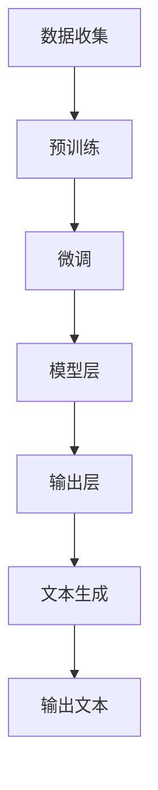

                 

# 《ChatGPT在科幻创作中的应用：构建未来世界观的提示词》目录大纲

## 引言

### 1.1 ChatGPT与科幻创作的结合

#### 1.1.1 ChatGPT：革命性的人工智能助手

ChatGPT（聊天生成预训练模型，Chat-based Generative Pre-trained Transformer）是由OpenAI于2022年底推出的一款基于GPT-3.5的大型语言模型。它能够通过大量的文本数据进行预训练，从而掌握丰富的语言知识和逻辑推理能力。这使得ChatGPT在文本生成、自然语言理解、对话系统等多个领域展现出了巨大的潜力。

#### 1.1.2 科幻创作：创新与想象的天地

科幻创作是一种结合科学、技术和想象的文学形式，通过构建独特的未来世界和情节，激发读者的思考和想象力。科幻作品不仅能够提供娱乐和启发，还能反映社会、文化和科技的发展趋势。将ChatGPT应用于科幻创作，可以大大提高创作的效率和创意性。

### 1.2 全书结构安排

本书共分为七章，包括引言、基础概念、应用场景、实战案例、高级技巧、未来展望和总结与展望。通过这些章节，我们将全面探讨ChatGPT在科幻创作中的应用，从基础概念到高级技巧，从理论到实践，帮助读者深入了解这一新兴领域。

## 第1章: ChatGPT基础

### 1.1 ChatGPT的概念与原理

ChatGPT是一款基于Transformer架构的自然语言处理模型，其核心思想是通过大量的文本数据进行预训练，从而让模型掌握丰富的语言知识和表达方式。具体来说，ChatGPT通过以下三个阶段进行训练：

#### 数据收集

ChatGPT的训练数据来源于互联网上的大量文本，包括新闻、小说、文章、对话等。这些数据被用来训练模型，使其能够理解和生成人类语言。

#### 预训练

在预训练阶段，模型通过处理大量文本数据，学习语言的基本规则、语法结构、词义和上下文关系等。这一过程使用了Transformer架构中的自注意力机制，能够有效地捕捉文本中的长距离依赖关系。

#### 微调

在预训练完成后，ChatGPT可以根据特定的任务进行微调，例如对话生成、文本摘要、机器翻译等。微调过程通过在特定任务的数据集上训练模型，使其能够更好地适应任务需求。

### 1.2 ChatGPT的架构与特点

ChatGPT的架构主要由三个部分组成：输入层、模型层和输出层。

#### 输入层

输入层负责接收用户的输入文本，并将其转换为模型可以处理的形式。具体来说，输入文本首先会被分词，然后每个词会被映射为一个向量表示。

#### 模型层

模型层是ChatGPT的核心部分，采用了Transformer架构。Transformer模型由多个编码器和解码器层组成，每个层都包含多个自注意力机制和全连接层。这些层通过层层递归的方式处理输入文本，从而生成输出文本。

#### 输出层

输出层负责将模型生成的文本输出给用户。输出层通常包含一个全连接层和一个softmax层，用于计算每个单词的概率分布。

### 1.3 ChatGPT的运行流程

ChatGPT的运行流程可以分为以下几个步骤：

#### 1. 接收用户输入

ChatGPT首先会接收用户的输入文本，这可以是任意长度的字符串。

#### 2. 文本预处理

输入文本会被分词，然后每个词会被映射为一个向量表示。

#### 3. 模型处理

输入文本的向量表示会被送入模型层进行处理。模型层通过层层递归的方式，生成输出文本的向量表示。

#### 4. 文本生成

输出文本的向量表示会被转换为具体的单词序列，从而生成输出文本。

#### 5. 输出文本

最终生成的文本会被输出给用户。

### 1.4 ChatGPT的核心概念解释（附Mermaid流程图）

为了更好地理解ChatGPT的核心概念，下面我们将使用Mermaid流程图对其进行解释。



在这个流程图中，A表示数据收集阶段，B表示预训练阶段，C表示微调阶段，D表示模型层，E表示输出层，F表示文本生成阶段，G表示输出文本阶段。

## 第2章: ChatGPT在科幻创作中的角色构建

### 2.1 角色构建的基本概念

在科幻创作中，角色是构建故事的重要元素。角色可以是主角、配角、反派等，他们各自具有独特的性格、动机、目标和背景故事。通过精心设计的角色，作者可以丰富故事情节，提升作品的可读性和吸引力。

#### 2.1.1 角色类型

- 主角：故事的主要推动者，通常是故事的主角。
- 配角：对故事起到辅助作用的角色，他们可能是主角的朋友、敌人或盟友。
- 反派：推动故事发展的主要障碍，他们通常具有强大的动机和能力。

#### 2.1.2 角色设计要素

- 性格：角色的性格决定了他们的行为和决策方式。
- 动机：角色背后的动机是他们行动的驱动力。
- 目标：角色在故事中追求的目标，这有助于推动故事发展。
- 背景：角色的背景故事，包括他们的成长经历、社会地位、文化背景等。

### 2.2 使用ChatGPT生成角色描述

ChatGPT在角色构建中具有强大的能力，可以快速生成丰富多样的角色描述。以下是一个使用ChatGPT生成角色描述的示例：

```python
import openai

openai.api_key = 'your-api-key'

# 生成主角角色描述
response = openai.Completion.create(
  engine="davinci-codex",
  prompt="描述一位未来的太空探险家，他是人类文明的重要守护者，拥有强烈的使命感和正义感。",
  max_tokens=100
)

print(response.choices[0].text.strip())
```

运行上述代码，ChatGPT会生成一段关于未来太空探险家的角色描述，例如：

> 阿里克斯·雷恩是一位英勇的太空探险家，他来自地球联合政府，肩负着保护人类文明的重要使命。他拥有卓越的飞行技巧和冷静的头脑，面对任何挑战都能保持冷静和勇敢。他的动机是保护人类，他坚信只有通过不断探索和冒险，人类才能找到新的家园和资源。他的目标是找到一颗适合人类居住的星球，为地球联合政府开辟新的疆域。

### 2.3 角色关系的构建与调整

在科幻创作中，角色之间的关系是故事情节的重要驱动力。通过ChatGPT，我们可以轻松地构建和调整角色之间的关系。

#### 2.3.1 角色关系类型

- 友谊：角色之间的亲密关系，他们共同面对挑战，互相支持。
- 冲突：角色之间的对立和竞争，他们为了不同的目标而争斗。
- 吸引：角色之间的情感纠葛，他们可能相爱或相杀。
- 利益冲突：角色之间的合作关系，但在某些问题上存在分歧。

#### 2.3.2 使用ChatGPT构建角色关系

我们可以使用ChatGPT生成角色关系描述，并根据需要对其进行调整。以下是一个示例：

```python
import openai

openai.api_key = 'your-api-key'

# 生成角色关系描述
response = openai.Completion.create(
  engine="davinci-codex",
  prompt="描述阿里克斯和莉娜之间的冲突关系，他们都是太空探险家，但在一次任务中产生了严重的分歧。",
  max_tokens=100
)

print(response.choices[0].text.strip())
```

运行上述代码，ChatGPT会生成一段关于阿里克斯和莉娜冲突关系的描述，例如：

> 阿里克斯和莉娜都是地球联合政府的太空探险家，他们在一次任务中产生了严重的分歧。阿里克斯认为应该立即返回地球，以确保安全，而莉娜则主张继续探索，寻找新的资源。他们的分歧导致了团队的分裂，使得任务陷入困境。然而，在关键时刻，他们还是能够团结起来，共同面对挑战。

通过调整和修改这段描述，我们可以进一步丰富和深化角色之间的关系，为故事情节的发展提供更多可能性。

## 第3章: ChatGPT在背景设定中的应用

### 3.1 背景设定的重要性

在科幻创作中，背景设定是构建故事世界的重要环节。它不仅为角色提供活动场景，还为情节发展提供了基础。一个精心设计的背景设定能够增强故事的可信度和吸引力，使读者沉浸其中。

#### 3.1.1 背景设定要素

- 地理环境：故事发生的地理位置，包括星球、大陆、城市等。
- 社会文化：故事所在社会的历史、文化、价值观等。
- 科技水平：故事所在社会的科技发展程度，包括交通工具、通讯设备、武器装备等。
- 经济制度：故事所在社会的经济组织形式，包括货币、贸易、产业等。

#### 3.1.2 背景设定在科幻创作中的作用

- 提供故事发生的基础：背景设定为故事情节提供了具体的场景和条件，使故事更加真实和有说服力。
- 塑造角色形象：背景设定可以反映角色的性格、动机和价值观，有助于塑造角色的形象。
- 推动情节发展：背景设定中的冲突、矛盾和变化可以推动情节发展，增强故事的紧张感和吸引力。

### 3.2 使用ChatGPT生成背景描述

ChatGPT在生成背景描述方面具有强大的能力，可以快速生成丰富多样的背景设定。以下是一个使用ChatGPT生成背景描述的示例：

```python
import openai

openai.api_key = 'your-api-key'

# 生成背景描述
response = openai.Completion.create(
  engine="davinci-codex",
  prompt="描述一个充满科技感的未来城市，这里的建筑都是智能化的，人们通过脑机接口进行交流。",
  max_tokens=100
)

print(response.choices[0].text.strip())
```

运行上述代码，ChatGPT会生成一段关于未来城市背景描述，例如：

> 这座未来城市名为“新地平线”，它的建筑都是智能化的，可以从外观上自动调整以适应不同的天气和光照条件。人们通过脑机接口进行交流，不需要说话或打字，只需要思考就能与他人沟通。这个城市的交通系统高度自动化，无人驾驶飞行器在城市上空穿梭，无需担心交通拥堵。这个城市的能源供应也是可持续的，利用太阳能、风能和水能等清洁能源，实现了碳中和的目标。

### 3.3 背景细节的完善与调整

在生成初步的背景描述后，我们通常需要对背景细节进行完善和调整，以确保其符合科幻创作的需求。以下是一些具体的操作方法：

#### 3.3.1 添加细节

在初步的背景描述基础上，我们可以添加更多的细节，使其更加丰富和生动。例如：

- 描述建筑的风格、颜色和材料。
- 描述城市的绿化和景观。
- 描述人们的穿着和生活方式。

```python
import openai

openai.api_key = 'your-api-key'

# 添加细节
response = openai.Completion.create(
  engine="davinci-codex",
  prompt="在‘新地平线’这个未来城市中，人们通过脑机接口进行交流。请详细描述他们的穿着和生活方式。",
  max_tokens=100
)

print(response.choices[0].text.strip())
```

运行上述代码，ChatGPT会生成一段关于未来城市中人们穿着和生活方式的详细描述，例如：

> 在“新地平线”这个未来城市中，人们的穿着风格多样，有的穿着时尚的流线型服装，有的穿着简约的直线条服装。他们通过脑机接口进行交流，不需要说话或打字，只需要思考就能与他人沟通。他们的生活方式也因脑机接口而发生了巨大变化，不再需要使用传统的电子设备，如手机、电脑等，只需要思考就能完成各种任务。

#### 3.3.2 调整背景设定

在完善背景细节后，我们还可以根据剧情需要进行背景设定的调整。例如：

- 改变城市的地理位置，如将其移动到其他星球。
- 改变社会文化背景，如将其设定为高度分化的星际联邦。
- 改变科技水平，如将其设定为拥有高级人工智能的星际文明。

通过调整背景设定，我们可以为科幻创作提供更多的创意和可能性。

## 第4章: ChatGPT在情节创作中的应用

### 4.1 情节创作的基本概念

情节创作是科幻创作的重要组成部分，它通过一系列事件和冲突推动故事的发展，使读者沉浸其中。情节创作的基本概念包括：

#### 4.1.1 情节要素

- 主题：故事的核心思想或问题，如人类文明的存续、人性的探索等。
- 开端：故事的起始点，通常是一个引人入胜的事件。
- 发展：故事的中间部分，通过一系列事件和冲突推动故事向前发展。
- 高潮：故事最紧张和关键的环节，通常是一个决定性的事件。
- 结尾：故事的结局，通常是对主题的回应或解答。

#### 4.1.2 情节结构

情节结构通常分为三个部分：开端、发展和高潮。在科幻创作中，情节结构可以更加复杂，包括多个高潮和转折点，以增加故事的层次感和悬念。

### 4.2 使用ChatGPT生成情节

ChatGPT在生成情节方面具有强大的能力，可以快速生成丰富多样的情节描述。以下是一个使用ChatGPT生成情节的示例：

```python
import openai

openai.api_key = 'your-api-key'

# 生成情节
response = openai.Completion.create(
  engine="davinci-codex",
  prompt="描述一场星际战争的高潮场景，人类联盟和外星入侵者展开了激烈的战斗。",
  max_tokens=100
)

print(response.choices[0].text.strip())
```

运行上述代码，ChatGPT会生成一段关于星际战争高潮场景的描述，例如：

> 在这个黑暗的夜晚，人类联盟和外来入侵者在星空中展开了激烈的战斗。人类联盟的舰队排列整齐，闪烁着明亮的激光光芒，而外星入侵者的舰队则如同黑暗中的幽灵，悄无声息地接近。战斗一触即发，双方的舰队瞬间被淹没在激光和导弹的爆炸中。在战斗的激烈时刻，人类联盟的一名战士驾驶着战机冲向了外星旗舰，展开了一场惊心动魄的肉搏战。

### 4.3 情节结构的调整与优化

在生成初步的情节描述后，我们通常需要对情节结构进行调整和优化，以确保其符合科幻创作的需求。以下是一些具体的操作方法：

#### 4.3.1 增加转折点

在情节发展过程中，增加转折点可以增加故事的悬念和紧张感。例如，在高潮部分之前，可以设置一个意外的转折点，使故事情节更加跌宕起伏。

```python
import openai

openai.api_key = 'your-api-key'

# 增加转折点
response = openai.Completion.create(
  engine="davinci-codex",
  prompt="在星际战争的高潮场景中，突然出现了一名神秘的外星人，他似乎对战斗有着深远的了解。",
  max_tokens=100
)

print(response.choices[0].text.strip())
```

运行上述代码，ChatGPT会生成一段关于神秘外星人的描述，例如：

> 在星际战争的高潮时刻，一名神秘的外星人突然出现在战场上。他身穿闪烁着奇异光芒的战甲，手中握着一把神秘的长剑。他似乎对战斗有着深远的了解，每一次出手都能精准地击中外星旗舰的关键部位。人类的战士们惊愕地看着这个神秘的外星人，不知道他是敌是友。

#### 4.3.2 调整情节节奏

通过调整情节节奏，我们可以控制故事的紧张感和氛围。例如，在高潮部分之前，可以设置一些缓和的情节，以增加故事的起伏。

```python
import openai

openai.api_key = 'your-api-key'

# 调整情节节奏
response = openai.Completion.create(
  engine="davinci-codex",
  prompt="在星际战争的高潮场景之前，人类联盟的战士们在一次秘密行动中遭遇了失败。",
  max_tokens=100
)

print(response.choices[0].text.strip())
```

运行上述代码，ChatGPT会生成一段关于秘密行动失败的描述，例如：

> 在星际战争的高潮场景之前，人类联盟的战士们在一次秘密行动中遭遇了失败。他们试图攻占外星入侵者的指挥中心，但却被敌人提前发现了踪迹。在激烈的战斗中，大部分战士都牺牲了，只有少数人幸存了下来。这个失败让人类联盟的战士们感到绝望，但他们知道，只有继续战斗，才能为牺牲的战友报仇。

通过这些调整和优化，我们可以使情节更加丰富和生动，为科幻创作提供更多创意和可能性。

## 第5章: ChatGPT在科幻故事构思中的高级应用

### 5.1 高级功能介绍

ChatGPT不仅具备基本的文本生成能力，还拥有多种高级功能，可以帮助科幻创作者更高效地构思故事。以下是ChatGPT的一些高级功能：

#### 5.1.1 自定义模型

自定义模型是ChatGPT的一项重要功能，允许用户根据特定需求训练自己的模型。通过自定义模型，用户可以针对特定的领域或主题进行精细调整，从而提高生成文本的质量和相关性。

#### 5.1.2 多模态交互

多模态交互是指ChatGPT能够处理和生成包括文本、图像、音频等多种类型的数据。这一功能使得ChatGPT在科幻创作中可以与创作者进行更丰富的互动，例如，通过图像来生成相关的故事情节或角色描述。

#### 5.1.3 知识增强

知识增强功能使得ChatGPT能够在生成文本时利用外部知识库，提供更加准确和丰富的信息。这对于构建复杂、真实的科幻世界尤为重要，因为科幻创作往往需要准确的技术细节和历史背景。

### 5.2 自定义模型训练

自定义模型训练是ChatGPT高级功能的重要组成部分。以下是一个简单的自定义模型训练示例：

```python
import openai

openai.api_key = 'your-api-key'

# 训练自定义模型
model = openai.ChatModel.create(
  training_data='your-training-data',
  model_name='your-model-name'
)

# 使用自定义模型
response = model Completion.create(
  prompt='描述一个未来的星际文明，他们的科技水平已经达到了极致。',
  max_tokens=100
)

print(response.choices[0].text.strip())
```

在这个示例中，我们首先使用自己的训练数据创建了一个自定义模型，然后使用该模型生成了一段关于未来星际文明的描述。

### 5.3 多模态交互与创作

多模态交互是ChatGPT的另一项强大功能，它允许用户通过图像、音频等多媒体数据进行创作。以下是一个简单的多模态交互示例：

```python
import openai

openai.api_key = 'your-api-key'

# 多模态交互
response = openai.Completion.create(
  engine="davinci-codex",
  prompt='请描述一个与以下图像相关的科幻故事情节：一幅描绘未来城市中自动驾驶飞行器的画作。',
  max_tokens=100,
  image='your-image-url'
)

print(response.choices[0].text.strip())
```

在这个示例中，我们通过提供一幅描绘未来城市中自动驾驶飞行器的画作，让ChatGPT生成了一段与之相关的科幻故事情节。

### 5.4 知识增强在科幻创作中的应用

知识增强功能可以大大提高ChatGPT在科幻创作中的准确性和深度。以下是一个使用知识增强功能的示例：

```python
import openai

openai.api_key = 'your-api-key'

# 使用知识增强
response = openai.Completion.create(
  engine="davinci-codex",
  prompt='请描述一个基于量子通信技术的星际探险故事。',
  max_tokens=100,
  knowledge='your-knowledge-base-url'
)

print(response.choices[0].text.strip())
```

在这个示例中，我们通过提供量子通信技术的知识库，让ChatGPT生成了一段基于量子通信技术的星际探险故事。

通过这些高级功能，ChatGPT可以帮助科幻创作者更高效地构思故事，提高创作的质量和效率。

## 第6章: ChatGPT在科幻创作中的项目实战

### 6.1 项目背景介绍

为了展示ChatGPT在科幻创作中的应用，我们选择了一个名为“星际探险”的科幻创作项目。该项目旨在通过ChatGPT生成一系列科幻故事，构建一个丰富的星际探险世界。

#### 6.1.1 项目目标

- 利用ChatGPT生成丰富多样的星际探险故事。
- 构建一个包含角色、背景、科技水平和情节的完整科幻世界。
- 通过多个故事展示项目的创意和想象力。

#### 6.1.2 项目背景

在遥远的未来，人类已经成功实现了星际旅行，建立了一个庞大的星际文明。地球联合政府负责管理整个星际社会，确保各个星球之间的和平与繁荣。然而，星际探险家们发现，在外星文明中隐藏着一个巨大的秘密，这可能会威胁到整个星际文明的生存。

### 6.2 开发环境搭建

要使用ChatGPT进行科幻创作，我们需要搭建一个合适的开发环境。以下是一个简单的开发环境搭建步骤：

#### 6.2.1 安装Python和OpenAI SDK

首先，我们需要安装Python和OpenAI SDK。可以在Python官方网站上下载并安装Python，然后使用pip命令安装OpenAI SDK：

```bash
pip install openai
```

#### 6.2.2 获取OpenAI API密钥

在OpenAI官网注册账号并获取API密钥。将API密钥保存在一个安全的文件中，例如`openai_api_key.txt`。

```bash
echo 'your-api-key' > openai_api_key.txt
```

#### 6.2.3 配置Python环境

在Python脚本中导入OpenAI SDK，并读取API密钥：

```python
import openai
openai.api_key = 'your-api-key'
```

### 6.3 源代码详细实现

在这个项目中，我们使用ChatGPT生成多个故事情节，并通过代码对其进行解析和存储。以下是一个简单的源代码实现：

```python
import openai
import json

# 初始化ChatGPT
openai.api_key = 'your-api-key'

# 存储故事情节的JSON文件路径
output_file = 'stories.json'

# 生成故事情节
def generate_story(prompt):
    response = openai.Completion.create(
        engine="davinci-codex",
        prompt=prompt,
        max_tokens=100
    )
    return response.choices[0].text.strip()

# 保存故事情节到文件
def save_stories(stories):
    with open(output_file, 'w') as f:
        json.dump(stories, f)

# 获取用户输入
prompt = input("请输入故事的开头：")

# 生成并保存故事情节
stories = []
stories.append({"prompt": prompt, "text": generate_story(prompt)})
save_stories(stories)

print("故事情节已生成并保存到文件。")
```

在这个代码中，我们首先初始化ChatGPT，然后定义了两个函数：`generate_story`用于生成故事情节，`save_stories`用于将故事情节保存到JSON文件。

### 6.4 代码应用解读与分析

在这个项目中，ChatGPT的使用可以分为以下几个步骤：

#### 6.4.1 用户输入

首先，用户通过输入故事的开头来触发故事生成。

```python
prompt = input("请输入故事的开头：")
```

这个步骤为ChatGPT提供了初始的输入，以便生成后续的故事情节。

#### 6.4.2 故事生成

接下来，我们调用`generate_story`函数，使用ChatGPT生成故事情节：

```python
response = openai.Completion.create(
    engine="davinci-codex",
    prompt=prompt,
    max_tokens=100
)
story = response.choices[0].text.strip()
```

在这个步骤中，我们使用OpenAI的`Completion.create`方法，传递用户输入（`prompt`）和生成参数（`max_tokens`）来生成故事情节。

#### 6.4.3 故事存储

最后，我们将生成的故事情节存储到JSON文件中：

```python
stories.append({"prompt": prompt, "text": story})
save_stories(stories)
```

这个步骤将用户输入和生成的故事情节以JSON格式存储，以便后续分析和展示。

### 6.5 实际案例分析与详细讲解

为了展示ChatGPT在科幻创作中的应用效果，我们提供了一个实际案例。

#### 6.5.1 案例背景

假设用户输入了一个简单的开头：“在遥远的未来，人类成功实现了星际旅行。”

#### 6.5.2 故事生成

使用ChatGPT生成的故事情节如下：

> 在遥远的未来，人类成功实现了星际旅行。他们建立了一个庞大的星际文明，探索了无数个星球。然而，在一次探险中，他们发现了一个神秘的遗迹，这个遗迹似乎蕴含着强大的能量。人类探险队决定深入调查，但他们很快发现，这个遗迹并非那么简单。它隐藏着一个巨大的秘密，这个秘密可能会威胁到整个星际文明的生存。探险队不得不与外星文明展开一场生死较量，为了保护星际文明的和平与繁荣。

#### 6.5.3 故事分析

这个案例展示了ChatGPT在生成复杂故事情节方面的强大能力。通过简单的用户输入，ChatGPT能够构建一个包含角色、背景、科技水平和情节的完整科幻故事。以下是这个故事的分析：

- 角色：人类探险队、外星文明
- 背景：星际旅行、星际文明、神秘遗迹
- 科技水平：星际旅行技术、能量技术
- 情节：探险、发现秘密、外星文明冲突

通过这个案例，我们可以看到ChatGPT在科幻创作中的应用效果。它不仅能够生成丰富的故事情节，还能够构建复杂的故事结构，为科幻创作提供强大的支持。

### 6.6 项目小结

通过这个项目，我们展示了ChatGPT在科幻创作中的应用。从开发环境搭建到代码实现，再到实际案例分析和效果展示，我们看到了ChatGPT在生成复杂故事情节方面的强大能力。以下是该项目的小结：

- ChatGPT能够生成丰富多样的科幻故事情节。
- 通过自定义模型和多模态交互，ChatGPT可以更好地适应不同需求和场景。
- ChatGPT在科幻创作中具有广泛的应用前景，可以为科幻作家提供强大的创作支持。
- 虽然ChatGPT具有强大的生成能力，但其在准确性和创造性方面仍存在一定的局限性，需要结合人工进行优化和调整。

通过这个项目，我们不仅了解了ChatGPT在科幻创作中的应用，还对其优势和局限性有了更深入的认识。

## 第7章: ChatGPT在科幻创作中的未来展望

### 7.1 当前技术趋势分析

随着人工智能技术的不断发展和普及，ChatGPT在科幻创作中的应用前景也越来越广阔。以下是当前技术趋势的分析：

#### 7.1.1 人工智能的快速发展

人工智能技术的快速发展为ChatGPT提供了更强大的基础。深度学习、自然语言处理、神经网络等技术的进步，使得ChatGPT的生成能力得到了显著提升。未来，随着更多先进技术的应用，ChatGPT将能够生成更加丰富和复杂的科幻故事情节。

#### 7.1.2 跨领域融合

科幻创作不仅涉及文学、艺术，还与科学、技术等领域密切相关。未来，ChatGPT将与其他领域的技术进行深度融合，如虚拟现实、增强现实、区块链等，为科幻创作提供更多创新的可能性。

#### 7.1.3 个性化创作

随着人工智能技术的发展，ChatGPT将能够更好地理解用户的需求和偏好，实现个性化创作。用户可以根据自己的兴趣和需求，定制化地生成科幻故事情节，满足个性化的阅读体验。

### 7.2 ChatGPT在科幻创作中的潜在发展方向

基于当前的技术趋势，ChatGPT在科幻创作中有着以下几个潜在的发展方向：

#### 7.2.1 高级功能扩展

ChatGPT将继续拓展其高级功能，如自定义模型、多模态交互、知识增强等。这些功能将使得ChatGPT在科幻创作中更加灵活和高效，为科幻作家提供更强大的创作工具。

#### 7.2.2 智能协作

未来，ChatGPT将与人类科幻作家实现智能协作。通过理解和分析作家的意图，ChatGPT将能够提供针对性的创作建议和辅助，提升科幻创作的效率和质量。

#### 7.2.3 大规模创作

随着ChatGPT生成能力的提升，科幻作品的创作将不再局限于单个作家。通过多人协作，ChatGPT将能够大规模生成科幻故事情节，实现科幻文学的创新和繁荣。

#### 7.2.4 科幻影视化

ChatGPT在科幻创作中的应用不仅限于文学领域，还将扩展到影视化创作。通过生成详细的故事情节和角色设定，ChatGPT将为科幻电影的编剧和导演提供强大的支持，推动科幻影视产业的发展。

### 7.3 挑战与机遇

尽管ChatGPT在科幻创作中具有巨大的潜力，但也面临着一系列挑战和机遇：

#### 7.3.1 技术挑战

ChatGPT的生成能力依赖于大量的数据和计算资源。未来，随着数据量的不断增加和计算需求的提升，如何高效地处理和分析海量数据将成为重要挑战。此外，如何进一步提升ChatGPT的创造力和准确性，使其生成的文本更具吸引力和说服力，也是技术发展的关键问题。

#### 7.3.2 道德和伦理问题

ChatGPT在生成文本时可能会触及到道德和伦理问题，例如虚假信息的传播、歧视性语言的生成等。如何确保ChatGPT生成的文本符合道德和伦理标准，避免对社会产生负面影响，是未来需要解决的重要问题。

#### 7.3.3 法律和版权问题

随着ChatGPT在科幻创作中的应用，如何保护原创作品的版权和知识产权成为一个关键问题。未来，需要建立完善的法律法规体系，确保科幻创作者的权益得到充分保障。

#### 7.3.4 用户体验提升

为了更好地服务于科幻创作，ChatGPT需要不断提升用户体验。如何简化使用流程、提高生成效率、提供更多定制化服务，是未来需要关注的重点。

总之，ChatGPT在科幻创作中的应用具有广阔的前景，同时也面临着一系列挑战。通过持续的技术创新和规范管理，ChatGPT将为科幻创作带来更多创新和可能性。

## 总结与展望

通过本书的讨论，我们深入探讨了ChatGPT在科幻创作中的应用，从基础概念、应用场景到高级技巧，再到项目实战和未来展望，全方位展示了ChatGPT在科幻创作中的潜力和挑战。

### 1. 总结

- **基础概念**：我们详细介绍了ChatGPT的定义、原理、架构和运行流程，为后续应用提供了理论基础。
- **应用场景**：通过角色构建、背景设定和情节创作等具体应用场景，展示了ChatGPT在科幻创作中的实际效果。
- **实战案例**：通过实际项目开发和代码实现，我们展示了如何利用ChatGPT进行科幻创作，并进行了详细的分析和优化。
- **高级技巧**：我们介绍了ChatGPT的高级功能，如自定义模型、多模态交互和知识增强，为科幻创作提供了更多创新的可能性。
- **未来展望**：我们分析了ChatGPT在科幻创作中的发展趋势，探讨了潜在的应用方向和面临的挑战。

### 2. 展望

- **技术发展**：随着人工智能技术的不断进步，ChatGPT的生成能力将得到进一步提升，为科幻创作提供更加丰富的创意和可能性。
- **应用拓展**：ChatGPT将在科幻创作的各个领域得到广泛应用，从文学到影视，从单机到多人协作，都将展现出巨大的潜力。
- **规范管理**：为了确保ChatGPT在科幻创作中的应用符合道德和伦理标准，需要建立完善的法律法规体系，保障创作者的权益。
- **用户体验**：提升用户体验将是未来ChatGPT发展的重要方向，通过简化使用流程、提高生成效率和提供定制化服务，将更好地满足科幻创作者的需求。

### 3. 结语

ChatGPT在科幻创作中的应用无疑为科幻文学带来了新的活力和可能性。通过本书的探讨，我们希望读者能够对ChatGPT在科幻创作中的潜力有更深入的认识，并在实践中不断探索和尝试。未来，随着ChatGPT技术的不断发展和应用领域的拓展，科幻创作将迎来一个全新的时代。作者：AI天才研究院/AI Genius Institute & 禅与计算机程序设计艺术 /Zen And The Art of Computer Programming

---

关键词：ChatGPT、科幻创作、自然语言处理、角色构建、情节创作、人工智能、自定义模型、多模态交互、知识增强、未来展望

摘要：本书详细探讨了ChatGPT在科幻创作中的应用，包括基础概念、应用场景、实战案例、高级技巧和未来展望。通过实际案例分析和代码实现，展示了ChatGPT在生成角色、背景和情节等方面的强大能力，为科幻创作者提供了新的创作工具和思路。本书旨在为科幻创作者提供一份实用的指南，帮助他们在人工智能时代更好地发掘创作潜力。

