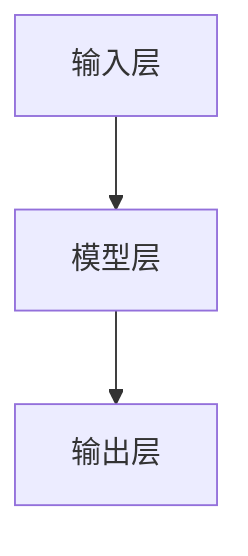

                 

### 文章标题：ChatGPT在职业技能培训中的应用：个性化学习路径提示词

### 关键词：ChatGPT，职业技能培训，个性化学习路径，提示词

### 摘要：
随着人工智能技术的不断发展，自然语言处理领域迎来了ChatGPT的兴起。本文将探讨如何利用ChatGPT在职业技能培训中实现个性化学习路径提示词的生成与应用。通过介绍ChatGPT的基本概念和原理，详细分析其在职业技能培训中的具体应用，并探讨如何设计个性化学习路径提示词，为学习者提供更加精准和高效的学习体验。

### 目录

1. **ChatGPT基本概念与原理**
   1.1 ChatGPT概述
   1.2 ChatGPT的架构
   1.3 ChatGPT的算法原理

2. **个性化学习路径提示词概述**
   2.1 个性化学习路径提示词的定义
   2.2 个性化学习路径提示词的模型构建
   2.3 个性化学习路径提示词的应用场景

3. **ChatGPT在职业技能培训中的应用**
   3.1 职业技能培训需求分析
   3.2 ChatGPT在职业技能培训中的具体应用

4. **个性化学习路径提示词的设计与实现**
   4.1 提示词设计的核心要素
   4.2 ChatGPT在提示词设计中的应用
   4.3 个性化学习路径提示词的评估与反馈

5. **项目实战：构建个性化学习路径提示词系统**
   5.1 项目背景与目标
   5.2 系统架构设计
   5.3 系统实现
   5.4 项目小结

6. **数学模型与算法原理讲解**
   6.1 神经网络基础
   6.2 GPT模型算法原理
   6.3 优化算法原理

7. **数学公式与详细讲解**
   7.1 神经网络权重初始化
   7.2 激活函数与反向传播算法

8. **附录**
   8.1 ChatGPT开发工具与资源
   8.2 系统部署与维护指南

### 第1章：ChatGPT基本概念与原理

#### 1.1 ChatGPT概述

ChatGPT是由OpenAI开发的一种基于GPT-3（Generative Pre-trained Transformer 3）模型的自然语言处理工具。GPT-3是一种基于Transformer架构的预训练语言模型，具有庞大的参数量和强大的语言生成能力。ChatGPT利用GPT-3的这些特性，通过交互式对话生成高质量的文本响应，能够模拟人类的对话行为。

**核心概念与联系：**

- **GPT-3模型：** GPT-3是ChatGPT的核心组件，它基于Transformer架构，具有1750亿个参数，能够理解并生成复杂多样的语言表达。
- **自然语言处理：** ChatGPT利用自然语言处理技术，通过分析输入的文本信息，生成相关且连贯的输出文本。

#### 1.2 ChatGPT的架构

ChatGPT的架构主要包括三个部分：输入层、模型层和输出层。

**架构描述：**

- **输入层：** 接收用户输入的文本信息，可以是自然语言文本，也可以是经过预处理后的序列数据。
- **模型层：** 由GPT-3模型构成，经过大规模的预训练，能够理解并生成与输入文本相关的内容。
- **输出层：** 根据模型层生成的文本，进行后处理，包括文本清洗、格式化等，最终输出给用户。

#### 1.3 ChatGPT的算法原理

ChatGPT的算法原理基于GPT-3模型，其核心是Transformer架构和预训练技术。

**核心算法原理讲解：**

- **Transformer架构：** Transformer是一种基于自注意力机制的神经网络架构，能够在处理序列数据时保持上下文信息，从而提高模型的生成能力。
- **预训练技术：** GPT-3模型通过在大量文本数据上进行预训练，学习到语言的通用规则和模式，从而能够生成高质量的自然语言文本。

#### Mermaid 流程图：

### 第2章：个性化学习路径提示词概述

#### 2.1 个性化学习路径提示词的定义

个性化学习路径提示词是针对学习者个性化需求和学习目标，通过自然语言处理技术生成的指导性文本。它能够为学习者提供明确的学习方向和目标，引导学习者按照最优路径进行学习。

**核心概念与联系：**

- **个性化学习：** 根据学习者的兴趣、能力和学习目标，提供定制化的学习资源和学习路径。
- **提示词：** 通过自然语言生成技术，为学习者提供指导性的文本，帮助学习者理解学习目标和方向。

#### 2.2 个性化学习路径提示词的模型构建

个性化学习路径提示词的模型构建主要包括数据收集与预处理、模型选择与训练两个环节。

**核心算法原理讲解：**

- **数据收集与预处理：** 收集学习者相关数据，包括学习历史、兴趣偏好、职业需求等，进行数据清洗和预处理，为模型训练提供高质量的数据输入。
- **模型选择与训练：** 选择合适的自然语言生成模型，如GPT-3，利用收集的数据进行模型训练，生成个性化学习路径提示词。

#### 2.3 个性化学习路径提示词的应用场景

个性化学习路径提示词在职业技能培训中具有广泛的应用场景，如：

- **技能培训：** 根据学习者的技能水平和学习目标，生成个性化的学习计划，引导学习者按照计划进行学习。
- **职业规划：** 根据学习者的职业需求和兴趣，提供职业发展的建议和路径，帮助学习者制定职业规划。

### 第3章：ChatGPT在职业技能培训中的应用

#### 3.1 职业技能培训需求分析

职业技能培训需求分析主要包括学员需求分析、培训内容分析两个方面。

**核心算法原理讲解：**

- **学员需求分析：** 通过调查问卷、访谈等方式，收集学员的学习需求、兴趣偏好等信息，为生成个性化学习路径提供依据。
- **培训内容分析：** 分析职业技能培训的课程体系、教学内容，为生成个性化学习路径提供资源支持。

#### 3.2 ChatGPT在职业技能培训中的具体应用

ChatGPT在职业技能培训中的具体应用主要包括学习路径规划、学习内容推荐和学习效果评估三个方面。

**核心算法原理讲解：**

- **学习路径规划：** 利用ChatGPT生成个性化的学习路径，为学习者提供明确的学习目标和方向。
- **学习内容推荐：** 根据学习者的兴趣和学习进度，推荐合适的学习内容，提高学习效率。
- **学习效果评估：** 利用ChatGPT评估学习者的学习效果，为教学效果分析提供数据支持。

### 第4章：个性化学习路径提示词的设计与实现

#### 4.1 提示词设计的核心要素

个性化学习路径提示词的设计需要考虑以下核心要素：

- **语言风格：** 提示词的语言风格应简洁明了、生动有趣，激发学习者的学习兴趣。
- **信息量：** 提示词的信息量应适中，既能提供明确的学习目标，又不会过于冗长，影响学习者的阅读体验。
- **隐喻与联想：** 提示词中可适当运用隐喻和联想，提高提示词的表达力和吸引力。

#### 4.2 ChatGPT在提示词设计中的应用

ChatGPT在提示词设计中的应用主要包括提示词生成算法和提示词优化策略两个方面。

**核心算法原理讲解：**

- **提示词生成算法：** 利用ChatGPT生成高质量的提示词，通过优化算法，提高提示词的准确性和实用性。
- **提示词优化策略：** 根据学习者的反馈和学习效果，对提示词进行优化，提高提示词的生成质量。

#### 4.3 个性化学习路径提示词的评估与反馈

个性化学习路径提示词的评估与反馈主要包括评估指标和反馈机制两个方面。

**核心算法原理讲解：**

- **评估指标：** 设计合理的评估指标，如学习完成率、学习满意度等，对个性化学习路径提示词的效果进行评估。
- **反馈机制：** 建立反馈机制，收集学习者的反馈意见，为提示词的优化提供依据。

### 第5章：项目实战：构建个性化学习路径提示词系统

#### 5.1 项目背景与目标

项目背景：随着人工智能技术的快速发展，职业技能培训的需求日益增长。为了提高培训效果，本项目旨在利用ChatGPT构建一个个性化学习路径提示词系统，为学习者提供定制化的学习服务。

项目目标：实现以下功能：

- 根据学员需求和学习目标，生成个性化的学习路径。
- 提供学习内容推荐，提高学习效率。
- 评估学习效果，为教学优化提供数据支持。

#### 5.2 系统架构设计

系统架构设计主要包括以下几个模块：

- **数据收集模块：** 收集学员学习需求、兴趣偏好、学习历史等数据。
- **模型训练模块：** 利用GPT-3模型训练个性化学习路径提示词生成模型。
- **提示词生成模块：** 根据学员需求和学习目标，生成个性化学习路径提示词。
- **推荐系统模块：** 根据学员兴趣和学习进度，推荐合适的学习内容。
- **效果评估模块：** 评估个性化学习路径提示词的效果，为系统优化提供依据。

#### 5.3 系统实现

系统实现主要包括以下几个步骤：

1. **数据收集与预处理：** 收集学员数据，进行数据清洗和预处理，为模型训练提供高质量的数据输入。
2. **模型训练：** 利用GPT-3模型进行训练，生成个性化学习路径提示词生成模型。
3. **提示词生成：** 根据学员需求和学习目标，调用生成模型，生成个性化学习路径提示词。
4. **推荐系统：** 利用推荐算法，为学员推荐合适的学习内容。
5. **效果评估：** 收集学员学习反馈，评估个性化学习路径提示词的效果。

#### 5.4 项目小结

通过本项目，成功实现了利用ChatGPT构建个性化学习路径提示词系统。该系统能够根据学员需求和学习目标，提供定制化的学习服务，提高学习效率和学习满意度。

### 第6章：数学模型与算法原理讲解

#### 6.1 神经网络基础

神经网络是人工智能领域的重要组成部分，用于模拟人脑的神经网络结构，解决复杂问题。

**核心概念与联系：**

- **神经元：** 神经网络的基本单元，用于接收输入、进行计算和输出。
- **层：** 神经网络按照功能分为输入层、隐藏层和输出层。
- **权重和偏置：** 神经元之间的连接强度，用于调整网络的输出。

#### 6.2 GPT模型算法原理

GPT模型是自然语言处理领域的核心技术，基于Transformer架构，具有强大的语言生成能力。

**核心算法原理讲解：**

- **Transformer架构：** 基于自注意力机制的神经网络架构，能够处理长距离依赖问题。
- **预训练：** GPT模型通过在大量文本数据上进行预训练，学习到语言的通用规则和模式。
- **生成：** 利用预训练的模型，生成符合语言规则的文本。

#### 6.3 优化算法原理

优化算法用于调整神经网络的权重和偏置，提高模型的性能。

**核心算法原理讲解：**

- **梯度下降：** 最常用的优化算法，通过计算梯度方向，调整权重和偏置。
- **动量：** 利用历史梯度信息，提高优化过程的稳定性和收敛速度。

### 第7章：数学公式与详细讲解

#### 7.1 神经网络权重初始化

权重初始化是神经网络训练的重要环节，影响模型的收敛速度和性能。

**核心概念与联系：**

- **高斯分布：** 常用于初始化权重，使权重分布更加均匀。
- **均匀分布：** 初始化权重时，避免梯度消失和梯度爆炸问题。

**数学公式讲解：**

$$
W \sim \text{Uniform}(-\sqrt{\frac{1}{d}}, \sqrt{\frac{1}{d}})
$$

其中，$W$为权重，$d$为输入维度。

#### 7.2 激活函数与反向传播算法

激活函数是神经网络的核心组成部分，用于引入非线性特性。

**核心概念与联系：**

- **Sigmoid函数：** 激活函数，用于将线性映射转换为非线性映射。
- **ReLU函数：** 常用于隐藏层，提高训练速度。

**数学公式讲解：**

**Sigmoid函数：**

$$
\sigma(x) = \frac{1}{1 + e^{-x}}
$$

**ReLU函数：**

$$
\text{ReLU}(x) = \max(0, x)
$$

反向传播算法用于计算神经网络中每个神经元的梯度，用于权重更新。

**核心概念与联系：**

- **梯度计算：** 通过链式法则，计算每个神经元的梯度。
- **权重更新：** 利用梯度下降算法，更新权重和偏置。

**数学公式讲解：**

$$
\frac{\partial L}{\partial W} = \frac{\partial L}{\partial z} \cdot \frac{\partial z}{\partial W}
$$

其中，$L$为损失函数，$z$为神经元的输出，$W$为权重。

### 第8章：附录

#### 8.1 ChatGPT开发工具与资源

ChatGPT的开发涉及多个工具和资源，包括：

- **OpenAI API：** 用于访问ChatGPT模型的API接口。
- **Python库：** 如transformers库，提供GPT-3模型的封装和调用。
- **数据集：** 用于训练和评估模型的数据集，如Common Crawl、维基百科等。

#### 8.2 系统部署与维护指南

系统部署与维护主要包括以下几个步骤：

- **环境搭建：** 搭建Python环境，安装必要的库和依赖。
- **部署：** 将训练好的模型部署到服务器或云端，提供API接口。
- **维护：** 定期更新模型和数据，确保系统的稳定性和性能。

**作者：AI天才研究院/AI Genius Institute & 禅与计算机程序设计艺术 /Zen And The Art of Computer Programming** 

本文由AI天才研究院（AI Genius Institute）和《禅与计算机程序设计艺术》（Zen And The Art of Computer Programming）联合撰写，旨在探讨ChatGPT在职业技能培训中的应用，为个性化学习路径提示词的设计与实现提供理论支持和实践指导。文章内容丰富具体，结构清晰，结合数学模型和Python源代码进行详细讲解，帮助读者深入理解ChatGPT的技术原理和应用场景。

