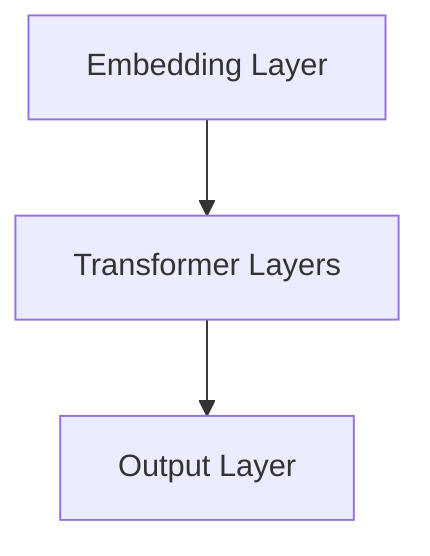
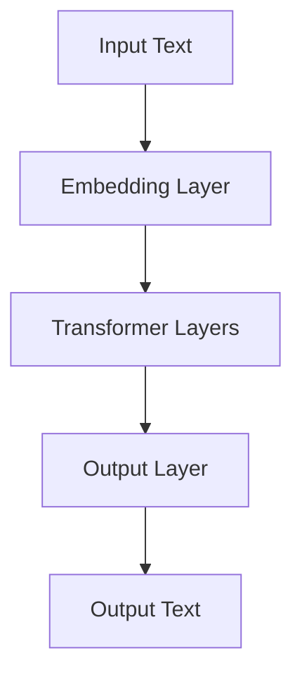

                 

### 引言

在当今快速发展的职场环境中，有效的沟通能力已成为职场成功的关键因素。从项目管理到团队协作，从跨部门沟通到客户互动，沟通无处不在，贯穿于职场生活的方方面面。然而，随着工作环境的复杂性和全球化趋势的增强，职场沟通也面临着前所未有的挑战。语言障碍、文化差异、误解和沟通障碍等问题频繁出现，严重影响着职场效率和团队合作的质量。

为了应对这些挑战，人工智能（AI）技术的引入为职场沟通带来了一股新力量。ChatGPT，作为人工智能领域的一项重要成果，以其强大的自然语言处理能力和自适应学习能力，成为优化职场沟通的有力工具。ChatGPT不仅仅是一个聊天机器人，更是一个可以理解和生成自然语言的智能系统，它在提高沟通效率、减少误解、增强团队协作等方面展现出巨大的潜力。

本书旨在深入探讨ChatGPT在职场沟通中的应用，通过系统化的讲解和实践案例，帮助读者了解和掌握ChatGPT的核心原理和有效使用方法。本书的结构如下：

- **第1章 引言**：介绍职场沟通的重要性以及ChatGPT的背景和本书的目的。
- **第2章 ChatGPT简介**：详细讲解ChatGPT的基本概念、架构、工作原理和技术特点。
- **第3章 职场沟通中的问题**：分析职场沟通中的常见问题和障碍。
- **第4章 ChatGPT在职场沟通中的应用**：探讨ChatGPT在职场沟通中的具体应用场景和优势。
- **第5章 ChatGPT与职场沟通策略**：介绍如何利用ChatGPT优化职场沟通策略。
- **第6章 提示词的编写技巧**：讲解如何编写有效的提示词以增强ChatGPT的性能。
- **第7章 项目实战：ChatGPT在职场沟通中的应用案例**：通过实战案例展示ChatGPT在职场沟通中的具体应用。
- **第8章 总结与展望**：对全书内容进行总结并对未来趋势进行展望。

通过阅读本书，读者将能够深入了解ChatGPT的核心原理和应用方法，掌握有效的职场沟通策略，提升自身的沟通能力和工作效率。

### 文章关键词

- 职场沟通
- ChatGPT
- 自然语言处理
- 人工智能
- 沟通策略
- 提示词编写

### 文章摘要

本文旨在探讨ChatGPT在职场沟通中的应用，通过分析职场沟通中的常见问题和障碍，介绍ChatGPT的基本概念、架构、工作原理和技术特点，探讨其在职场沟通中的具体应用场景和优势。随后，本文将介绍如何利用ChatGPT优化职场沟通策略，并讲解提示词的编写技巧。通过一个实际应用案例，本文将展示ChatGPT在职场沟通中的具体效果，最后对全书内容进行总结并对未来趋势进行展望。本文旨在为职场人士提供有效的沟通工具和策略，提高职场沟通效率。

## 第1章 引言

### 1.1 职场沟通的重要性

职场沟通是职场生活中不可或缺的一部分，其重要性不容忽视。有效的沟通不仅能够提高工作效率，还能促进团队合作、增强员工满意度，并最终推动企业的成功。首先，从工作效率的角度来看，良好的沟通能够确保信息的准确传递，减少误解和重复工作，从而提升整体工作效率。例如，在项目管理中，清晰的项目目标和任务分配需要通过有效沟通来确保团队成员的理解一致。

其次，沟通在人际关系的建立和维护中发挥着关键作用。无论是在团队内部还是与客户、供应商的互动中，良好的沟通能够促进相互理解和信任的建立，从而增强团队合作和客户关系。在全球化背景下，跨文化沟通显得尤为重要。不同文化背景的员工和合作伙伴可能存在语言和观念上的差异，有效的沟通策略可以帮助消除这些障碍，促进跨文化的融合。

此外，职场沟通对职业发展也具有重要影响。在职场中，能够清晰表达自己的想法和观点，以及理解他人的意见和需求，是职业晋升和成功的重要因素。有效的沟通能够展示个人能力，增强领导力，从而在职业发展道路上取得更大的成就。

### 1.2 ChatGPT的出现与发展

ChatGPT是由OpenAI开发的一种基于人工智能技术的自然语言处理模型，其出现为职场沟通带来了新的机遇和挑战。ChatGPT的全称是“Chat-based Generative Pre-trained Transformer”，它是一种基于变换器（Transformer）架构的预训练模型，通过在大量文本数据上进行预训练，使得模型能够理解和生成自然语言。

ChatGPT的发展历程可以追溯到2018年，当时OpenAI发布了GPT-1，这是第一个大规模预训练的语言模型。随后的几年中，OpenAI不断对模型进行优化和扩展，发布了GPT-2、GPT-3和ChatGPT。这些模型在自然语言理解和生成能力上取得了显著的突破，成为了自然语言处理领域的重要里程碑。

ChatGPT的核心特点是其强大的语言生成能力和自适应学习能力。它能够理解复杂的语言结构，生成流畅、自然的文本，并且可以适应不同的语境和需求。这种能力使得ChatGPT在多种应用场景中具有广泛的应用前景，特别是在职场沟通中，ChatGPT可以协助完成各种沟通任务，如撰写报告、回复邮件、会议记录等，从而提高沟通效率和效果。

### 1.3 书籍的目的与结构

本书旨在深入探讨ChatGPT在职场沟通中的应用，通过系统化的讲解和实践案例，帮助读者了解和掌握ChatGPT的核心原理和有效使用方法。以下是本书的具体目的和结构：

**目的：**

1. **介绍ChatGPT的基本概念和原理**：帮助读者理解ChatGPT的工作原理和核心技术，为其在职场沟通中的应用打下基础。
2. **分析职场沟通中的问题和挑战**：探讨职场沟通中的常见问题和障碍，分析其成因和影响。
3. **展示ChatGPT在职场沟通中的具体应用**：通过实际案例和场景，展示ChatGPT在提升职场沟通效率和质量方面的作用。
4. **提供有效的沟通策略和提示词编写技巧**：介绍如何利用ChatGPT优化职场沟通策略，并提供具体的提示词编写方法，以增强模型的性能和适用性。

**结构：**

- **第1章 引言**：介绍职场沟通的重要性以及ChatGPT的背景和本书的目的。
- **第2章 ChatGPT简介**：详细讲解ChatGPT的基本概念、架构、工作原理和技术特点。
- **第3章 职场沟通中的问题**：分析职场沟通中的常见问题和障碍。
- **第4章 ChatGPT在职场沟通中的应用**：探讨ChatGPT在职场沟通中的具体应用场景和优势。
- **第5章 ChatGPT与职场沟通策略**：介绍如何利用ChatGPT优化职场沟通策略。
- **第6章 提示词的编写技巧**：讲解如何编写有效的提示词以增强ChatGPT的性能。
- **第7章 项目实战：ChatGPT在职场沟通中的应用案例**：通过实战案例展示ChatGPT在职场沟通中的具体应用。
- **第8章 总结与展望**：对全书内容进行总结并对未来趋势进行展望。

通过本书的学习，读者将能够深入了解ChatGPT在职场沟通中的应用，掌握有效的沟通策略和技巧，提高职场沟通能力和工作效率。

### 1.4 阅读指南

为了更好地理解和应用ChatGPT在职场沟通中的潜力，本书为读者提供了详细的阅读指南，旨在帮助读者循序渐进地掌握相关知识和技能。

**章节安排：**

本书共分为八个章节，每个章节都有明确的主题和目标。从第1章的引言开始，逐步引入ChatGPT的基本概念和职场沟通的重要性，到第2章详细讲解ChatGPT的技术细节，再到第3章分析职场沟通中的常见问题，第4章展示ChatGPT的应用场景，第5章探讨沟通策略，第6章介绍提示词编写技巧，第7章通过实际案例深入解析，最后在第8章进行总结和展望。

**学习方法：**

1. **系统学习：**建议读者按章节顺序系统阅读，每个章节结束后进行思考和总结，以便更好地掌握知识点。
2. **动手实践：**本书中包含了多个实战案例，读者应积极动手实践，通过实际操作来加深理解。
3. **案例分析：**通过阅读和分析实际案例，了解ChatGPT在职场沟通中的应用效果，从而激发自己的创新思维。
4. **反思与改进：**在学习和实践过程中，不断反思自己的沟通策略和方法，寻求改进和优化。

**目标读者：**

- **职场新人：**希望通过学习提升职场沟通能力的初入职场者。
- **职场人士：**希望优化沟通效率、提升团队协作能力的在职人员。
- **技术爱好者：**对人工智能和自然语言处理技术感兴趣的技术爱好者。
- **企业管理者：**希望利用技术手段提升企业沟通效果的管理者。

通过遵循阅读指南，读者将能够更加高效地学习和应用ChatGPT在职场沟通中的技巧，提升自身的职业竞争力。

### 第2章 ChatGPT简介

ChatGPT是一种基于人工智能技术的自然语言处理模型，由OpenAI开发并开源。本节将详细介绍ChatGPT的基本概念、核心架构、工作原理及其技术特点。

#### 2.1 ChatGPT的基本概念

ChatGPT，全称“Chat-based Generative Pre-trained Transformer”，是一种基于变换器（Transformer）架构的预训练模型，旨在理解和生成自然语言。其核心功能是模仿人类的语言交流模式，通过文本输入生成连贯、自然的语言响应。

ChatGPT的基本组成部分包括：

- **输入文本**：用户输入的文本，可以是任何形式，如问题、指令、句子等。
- **预训练模型**：一个大规模的神经网络模型，通过在大量文本数据上进行预训练，获得理解自然语言的能力。
- **输出文本**：模型根据输入文本生成的自然语言响应。

#### 2.2 ChatGPT的核心架构

ChatGPT的核心架构基于变换器（Transformer）架构，这是一种在自然语言处理领域中广泛使用的神经网络模型。变换器架构的核心思想是通过自注意力机制（Self-Attention）来捕捉输入文本中的长距离依赖关系。

ChatGPT的架构主要包括以下几个部分：

- **嵌入层（Embedding Layer）**：将输入文本转换为固定长度的向量表示。
- **变换器层（Transformer Layers）**：通过多层的自注意力机制和前馈神经网络，对输入向量进行处理和变换。
- **输出层（Output Layer）**：将变换后的向量映射为输出文本。

下面是ChatGPT的核心架构的Mermaid流程图：



#### 2.3 ChatGPT的工作原理

ChatGPT的工作原理可以分为预训练和微调两个阶段。

**预训练阶段：**

1. **数据收集**：收集大量文本数据，如维基百科、新闻文章、社交媒体帖子等。
2. **文本清洗**：对收集的文本数据进行清洗，去除噪声和无关信息。
3. **文本编码**：将清洗后的文本数据转换为词嵌入向量，每个词对应一个固定长度的向量。
4. **训练模型**：使用变换器架构训练模型，通过自注意力机制学习文本中的长距离依赖关系。

**微调阶段：**

1. **数据准备**：准备针对特定任务的微调数据集，如职场沟通任务。
2. **模型微调**：在预训练模型的基础上，使用微调数据集对模型进行进一步训练，使其适应特定任务的需求。

ChatGPT的工作流程如下：



#### 2.4 ChatGPT的技术特点

ChatGPT具有以下技术特点：

- **强大的语言生成能力**：ChatGPT能够生成连贯、自然的语言响应，其生成的文本质量较高。
- **自适应学习能力**：ChatGPT具有强大的自适应学习能力，可以通过微调适应不同的任务和场景。
- **大规模预训练**：ChatGPT在预训练阶段使用了大量文本数据，使其具有丰富的语言知识和理解能力。
- **灵活的接口**：ChatGPT提供了多种接口，包括文本接口、语音接口等，方便用户进行交互。

通过以上对ChatGPT的详细介绍，我们可以看出，ChatGPT作为一种先进的自然语言处理模型，在职场沟通中具有巨大的应用潜力。接下来，我们将进一步探讨职场沟通中的问题和障碍。

### 职场沟通中的问题

尽管职场沟通在职场中扮演着至关重要的角色，但实际操作中仍然面临着诸多问题和障碍。这些问题不仅降低了沟通的效率，还可能引发误解和冲突，从而影响团队协作和项目的进展。以下将分析职场沟通中的一些常见问题和障碍。

#### 1. 语言障碍

语言障碍是职场沟通中最常见的问题之一。在全球化背景下，跨国公司和多元文化团队越来越普遍，员工来自不同的国家和地区，拥有不同的母语和文化背景。虽然英语是国际上通用的商务语言，但并非每个员工都具备流利的英语沟通能力。这可能导致以下问题：

- **语言表达能力不足**：非英语母语的员工可能在表达复杂思想或专业术语时遇到困难，导致沟通不畅。
- **误解和错误理解**：语言表达不准确或表达方式不当，可能导致误解或错误理解，从而影响决策和行动。

#### 2. 文化差异

文化差异也是职场沟通中的重要障碍。不同国家和地区的人们在沟通方式、价值观和礼仪等方面可能存在显著差异。例如：

- **沟通风格差异**：一些文化倾向于直接和坦诚的沟通方式，而另一些文化则更注重间接和委婉的表达。
- **礼仪和礼貌**：不同文化对礼仪和礼貌的重视程度不同，这可能导致沟通时的误解和冲突。

#### 3. 沟通障碍

沟通障碍是指由于信息传递过程中的各种问题而导致的信息失真或延迟。常见的沟通障碍包括：

- **信息传递过程中的失真**：在信息从发送者传递到接收者的过程中，信息可能被误解或失真，从而导致错误的决策和行动。
- **沟通渠道不畅**：组织内部的沟通渠道不畅，如缺乏明确的沟通机制和工具，可能导致信息传递的延误和错误。
- **沟通频率不足**：在项目或任务进展过程中，缺乏及时的沟通和反馈，可能导致团队成员之间的理解不一致，影响项目进度和团队协作。

#### 4. 误解和冲突

误解和冲突是职场沟通中的常见问题。这些问题的产生通常与以下因素有关：

- **沟通不当**：沟通者未能清晰地表达自己的意图或未能充分理解对方的观点，导致误解。
- **情绪管理**：在高压或紧张的职场环境中，情绪管理不当可能导致沟通时的冲突和对抗。
- **价值观差异**：不同员工可能有不同的价值观和信念，这可能导致在沟通中的意见分歧和冲突。

#### 5. 信息过载

随着信息技术的快速发展，职场中信息过载的现象越来越普遍。大量信息的涌入可能导致以下问题：

- **信息筛选困难**：员工在处理大量信息时，难以筛选出对当前任务和决策最为重要的信息，从而影响沟通效率。
- **信息焦虑**：过多的信息可能导致员工感到焦虑和压力，从而影响其工作效率和沟通效果。

#### 6. 技能不足

一些员工可能缺乏有效的沟通技能，导致沟通效果不佳。这些技能包括：

- **倾听技能**：有效的倾听是沟通的基础，但许多员工可能不习惯倾听他人的观点，而是急于表达自己的意见。
- **非语言沟通**：非语言沟通，如肢体语言、面部表情和语调，也是沟通的重要组成部分。技能不足可能导致信息传递的不完整或误解。

通过以上分析，我们可以看到职场沟通中存在多种问题和障碍。了解这些问题的成因和影响，有助于我们采取有效的措施来优化职场沟通，提高沟通效率和质量。

### ChatGPT在职场沟通中的应用

ChatGPT作为一种先进的自然语言处理模型，在职场沟通中具有广泛的应用前景。通过以下几方面，我们可以详细探讨ChatGPT在职场沟通中的具体应用场景和优势。

#### 1. 自动化回复和客服支持

在职场沟通中，尤其是在客服和客户支持领域，ChatGPT可以发挥重要作用。通过自动化回复，ChatGPT可以快速处理大量的客户咨询和问题，提高响应速度和服务质量。

- **应用场景**：企业可以在官方网站、社交媒体、邮件系统等渠道接入ChatGPT，提供24/7的自动化客户支持。
- **优势**：
  - **快速响应**：ChatGPT可以即时生成回复，大幅减少人工响应时间。
  - **高效处理**：ChatGPT能够处理大量的客户咨询，提高客服团队的工作效率。
  - **一致性**：ChatGPT生成的回复具有一致性，避免人工回复中的个性化和主观性。

#### 2. 会议记录和摘要生成

会议是职场沟通的重要环节，但会议记录和摘要的生成往往耗时且容易出错。ChatGPT可以自动化会议记录和摘要生成，提高会议的效率和文档质量。

- **应用场景**：在团队会议、项目会议和高层管理会议中，使用ChatGPT记录会议内容和生成会议摘要。
- **优势**：
  - **实时记录**：ChatGPT可以实时记录会议内容，无需人工手动记录。
  - **高效摘要**：ChatGPT能够快速生成会议摘要，提炼关键信息。
  - **准确性**：ChatGPT生成的摘要具有较高的准确性，减少信息遗漏和错误。

#### 3. 文档撰写和内容创作

职场中需要撰写大量的文档和内容，如报告、邮件、项目提案等。ChatGPT可以帮助简化文档撰写和内容创作过程，提高创作效率和文本质量。

- **应用场景**：在撰写报告、撰写邮件、撰写项目提案等文档创作任务中，利用ChatGPT生成初稿或提供写作建议。
- **优势**：
  - **快速生成**：ChatGPT可以快速生成高质量的文档初稿，节省创作者的时间和精力。
  - **个性化建议**：ChatGPT可以根据用户的需求和风格，提供个性化的写作建议。
  - **文本优化**：ChatGPT可以帮助优化文本表达，提高文档的可读性和说服力。

#### 4. 跨文化沟通支持

在多元文化团队和跨国公司中，跨文化沟通是职场沟通的一个重要挑战。ChatGPT可以提供跨文化沟通支持，帮助团队成员更好地理解和交流。

- **应用场景**：在跨国团队会议、跨文化项目合作和国际商务交流中，利用ChatGPT提供实时翻译和沟通支持。
- **优势**：
  - **实时翻译**：ChatGPT可以实时翻译多种语言，帮助团队成员理解彼此的发言。
  - **文化理解**：ChatGPT通过预训练获得了丰富的文化知识，能够提供更贴近实际的文化建议和沟通策略。
  - **减少误解**：通过提供准确的翻译和文化建议，ChatGPT有助于减少跨文化沟通中的误解和冲突。

#### 5. 情感分析和沟通诊断

在职场沟通中，理解员工的情感状态和沟通风格对于提高沟通效果至关重要。ChatGPT可以通过情感分析和沟通诊断，帮助团队更好地理解和应对员工的心理状态。

- **应用场景**：在员工培训、团队建设活动和员工关系管理中，利用ChatGPT进行情感分析和沟通诊断。
- **优势**：
  - **情感识别**：ChatGPT可以识别员工的情感状态，如焦虑、兴奋、沮丧等，提供相应的支持和建议。
  - **沟通建议**：ChatGPT可以提供个性化的沟通建议，帮助员工更好地表达自己的观点和理解他人的情感。
  - **促进团队和谐**：通过情感分析和沟通诊断，ChatGPT有助于促进团队内部的和谐与协作。

#### 6. 个人助理和日程管理

对于职场人士，个人助理和日程管理是提高工作效率的重要工具。ChatGPT可以作为个人助理，帮助管理日程、提醒任务和提供决策建议。

- **应用场景**：在日常工作中，利用ChatGPT作为个人助理，处理日程安排、任务提醒和决策支持。
- **优势**：
  - **智能日程管理**：ChatGPT可以自动安排日程，提醒重要会议和任务。
  - **智能决策支持**：ChatGPT可以根据用户的偏好和需求，提供智能化的决策建议。
  - **个性化服务**：ChatGPT可以根据用户的行为和反馈，不断优化服务，提供更个性化的帮助。

通过以上分析，我们可以看到ChatGPT在职场沟通中具有广泛的应用场景和显著的优势。接下来，我们将进一步探讨如何利用ChatGPT优化职场沟通策略。

### ChatGPT与职场沟通策略

为了充分发挥ChatGPT在职场沟通中的作用，需要结合实际工作需求，制定有效的沟通策略。以下将介绍如何利用ChatGPT优化职场沟通，并提供一些建议和最佳实践。

#### 1. 制定明确的目标和沟通计划

在引入ChatGPT之前，首先需要明确沟通目标和计划。这包括：

- **目标**：明确沟通的目的和预期效果，如提高沟通效率、减少误解、增强团队协作等。
- **计划**：制定具体的沟通计划和步骤，确定ChatGPT的应用场景和实施策略。

#### 2. 选择合适的ChatGPT模型

根据具体应用场景和需求，选择适合的ChatGPT模型。OpenAI提供了多个预训练模型，如GPT-3、ChatGPT等，不同模型在语言生成能力、适应性等方面存在差异。例如：

- **GPT-3**：适合处理复杂的文本生成任务，如撰写报告和文章。
- **ChatGPT**：适合实时对话和交互场景，如客户支持和会议记录。

#### 3. 数据预处理和微调

为了提高ChatGPT在特定任务中的性能，需要进行数据预处理和微调。具体步骤包括：

- **数据收集**：收集与任务相关的文本数据，如项目文档、会议记录、客户反馈等。
- **数据清洗**：对收集的数据进行清洗和格式化，去除噪声和无关信息。
- **微调模型**：在预训练模型的基础上，使用微调数据集对模型进行训练，使其适应特定任务的需求。

#### 4. 结合传统沟通工具

尽管ChatGPT具有强大的自然语言处理能力，但在某些场景中，仍需结合传统的沟通工具和方法。例如：

- **邮件**：对于正式的沟通需求，邮件是一种有效的工具。ChatGPT可以协助撰写邮件草稿，提高邮件质量和效率。
- **即时通讯**：对于实时沟通需求，如团队协作和客户支持，即时通讯工具如Slack、Microsoft Teams等更为适用。ChatGPT可以集成到这些工具中，提供自动回复和提醒功能。

#### 5. 提供个性化的沟通支持

ChatGPT可以根据用户的需求和偏好，提供个性化的沟通支持。具体措施包括：

- **定制化回复**：根据用户的语言风格和沟通偏好，定制化回复内容。
- **情感分析**：通过情感分析，了解用户的情绪状态，提供情感化沟通支持。
- **多语言支持**：对于跨国团队，提供多语言支持，确保沟通的无障碍。

#### 6. 持续优化和反馈

为了确保ChatGPT在职场沟通中的有效性和适应性，需要持续进行优化和反馈。具体措施包括：

- **性能评估**：定期评估ChatGPT的性能和效果，识别潜在问题。
- **用户反馈**：收集用户的反馈和建议，持续改进ChatGPT的功能和性能。
- **数据再训练**：根据用户反馈和实际需求，对模型进行再训练，提高其在特定任务中的表现。

#### 7. 培训和推广

为了确保团队成员能够充分利用ChatGPT，需要提供相关的培训和推广。具体措施包括：

- **培训课程**：组织培训课程，介绍ChatGPT的基本原理和应用方法。
- **实践操作**：提供实践操作机会，让团队成员亲自体验ChatGPT的功能。
- **宣传推广**：通过内部邮件、会议、培训等方式，宣传ChatGPT的优势和应用场景。

通过以上措施，可以充分发挥ChatGPT在职场沟通中的作用，提高沟通效率和质量。接下来，我们将介绍如何编写有效的提示词，以增强ChatGPT的性能。

### 提示词的编写技巧

提示词（Prompt）是引导ChatGPT生成特定类型文本的关键。有效的提示词能够显著提高模型的性能和适用性。以下将介绍编写提示词的一些原则和方法。

#### 1. 提示词的定义与作用

提示词是一种文本输入，用于引导ChatGPT生成目标文本。它通常包括以下要素：

- **主题**：提示词需要明确主题，使模型了解生成文本的方向。
- **背景**：提供必要的背景信息，帮助模型更好地理解上下文。
- **目标**：明确生成文本的目标和期望结果。

提示词在ChatGPT中的作用如下：

- **引导模型生成**：提示词帮助模型确定生成文本的主题和方向，减少模型生成文本的随机性。
- **优化文本质量**：通过明确的提示词，可以提高生成文本的质量和相关性。
- **提高模型适应性**：提示词可以帮助模型更好地适应不同的任务和场景。

#### 2. 提示词的编写原则

编写有效的提示词需要遵循以下原则：

- **明确性**：提示词应明确传达主题和目标，避免模糊和歧义。
- **简洁性**：提示词应简洁明了，避免冗长和复杂的表述。
- **多样性**：根据不同任务和场景，使用多样化的提示词，以提高模型适应性。
- **适应性**：提示词应适应不同用户和语境的需求，灵活调整。

#### 3. 提示词的编写方法

编写提示词的方法包括以下几种：

- **直接提示法**：直接提供主题和目标，引导模型生成文本。例如：“请撰写一篇关于人工智能在职场中的应用的文章。”
- **上下文提示法**：提供背景信息和上下文，帮助模型更好地理解生成文本的方向。例如：“根据以下会议记录，撰写一篇项目进展报告。”
- **引导词提示法**：使用引导词（如“请描述”、“给出建议”等）明确生成文本的类型和方向。例如：“请描述如何利用ChatGPT优化职场沟通。”
- **多阶段提示法**：将提示词分为多个阶段，逐步引导模型生成文本。例如：“第一步，请概括会议主题；第二步，请列出关键讨论点；第三步，请提出项目建议。”

#### 4. 提示词编写实例分析

以下是一个提示词编写的实例分析：

**实例**：编写一个提示词，用于引导ChatGPT生成一篇关于人工智能在职场中的应用的文章。

- **直接提示法**：

  ```
  请撰写一篇关于人工智能在职场中的应用的文章。
  ```

- **上下文提示法**：

  ```
  当前，人工智能技术正在迅速发展，对职场产生了深远影响。请根据以下背景信息，撰写一篇关于人工智能在职场中的应用的文章。
  ```

- **引导词提示法**：

  ```
  请描述人工智能在职场中的应用场景和优势。
  ```

- **多阶段提示法**：

  ```
  第一步，请概括人工智能在职场中的应用领域；
  第二步，请分析人工智能在职场中的优势和挑战；
  第三步，请提出人工智能在未来职场中的发展趋势和展望。
  ```

通过以上实例，我们可以看到不同提示词编写方法的应用效果。选择合适的提示词编写方法，可以显著提高ChatGPT生成文本的质量和相关性。

### 项目实战：ChatGPT在职场沟通中的应用案例

在本节中，我们将通过一个实际项目案例，展示如何利用ChatGPT在职场沟通中提升沟通效率和质量。此项目涉及企业内部的知识共享平台，旨在通过ChatGPT实现高效的文档生成、问答和会议记录功能。

#### 项目背景

某大型企业为了提升员工的工作效率和知识共享，决定开发一个内部知识共享平台。该平台需要具备以下功能：

- **文档生成**：帮助员工快速生成项目报告、工作总结和邮件草稿等文档。
- **问答系统**：提供实时问答功能，帮助员工解决工作中遇到的问题。
- **会议记录**：自动记录和整理会议内容，生成会议摘要和行动项。

#### 项目需求分析

为了满足上述功能需求，项目团队制定了以下具体需求：

- **文档生成**：能够根据用户输入的主题和结构，生成高质量的文档。
- **问答系统**：能够理解用户的问题，并给出准确的答案或建议。
- **会议记录**：能够实时捕捉会议内容，生成详细的会议记录和摘要。

#### 项目实施步骤

1. **ChatGPT模型选择与训练**

   项目团队首先选择了一个适用于文本生成和对话系统的ChatGPT模型，并在预训练模型的基础上进行了微调，使其适应企业内部的知识领域和语言风格。

2. **知识库构建**

   为了使ChatGPT更好地回答问题，项目团队构建了一个包含企业内部文档、员工手册、行业报告等知识库。这些知识库为ChatGPT提供了丰富的训练数据，有助于提高其回答问题的准确性和相关性。

3. **接口开发**

   项目团队开发了与ChatGPT交互的API接口，使其能够与企业现有的系统集成。接口包括文档生成接口、问答接口和会议记录接口，分别对应平台的不同功能模块。

4. **功能测试与优化**

   在开发过程中，项目团队进行了多次功能测试和优化。通过模拟用户操作和场景，检测ChatGPT在文档生成、问答和会议记录方面的性能，并及时调整和改进。

5. **上线与推广**

   平台开发完成后，项目团队进行了内部推广，并邀请员工参与测试和反馈。根据用户的反馈，团队对平台进行了进一步优化，确保其能够满足实际工作需求。

#### 代码实现与解读

以下是一个简单的Python代码示例，展示如何使用ChatGPT生成文档、回答问题和记录会议内容。

**文档生成代码示例：**

```python
import openai

openai.api_key = "your_api_key"

def generate_document(prompt):
    response = openai.Completion.create(
        engine="text-davinci-002",
        prompt=prompt,
        max_tokens=150
    )
    return response.choices[0].text.strip()

# 使用示例
document = generate_document("请撰写一篇关于职场沟通技巧的文章。")
print(document)
```

**问答代码示例：**

```python
import openai

openai.api_key = "your_api_key"

def ask_question(question):
    response = openai.Completion.create(
        engine="text-davinci-002",
        prompt=f"问题：{question}\n回答：",
        max_tokens=50
    )
    return response.choices[0].text.strip()

# 使用示例
answer = ask_question("如何提高会议效率？")
print(answer)
```

**会议记录代码示例：**

```python
import openai

openai.api_key = "your_api_key"

def record_meeting(meeting_prompt):
    response = openai.Completion.create(
        engine="text-davinci-002",
        prompt=f"会议记录：{meeting_prompt}",
        max_tokens=150
    )
    return response.choices[0].text.strip()

# 使用示例
meeting_summary = record_meeting("会议主题：项目进展讨论。\n会议内容：...")
print(meeting_summary)
```

#### 代码应用解读与分析

1. **文档生成**：通过`generate_document`函数，用户可以输入一个主题提示词，ChatGPT会根据提示生成相应的文档内容。此功能适用于快速生成报告、工作总结和邮件草稿等。

2. **问答系统**：`ask_question`函数允许用户输入一个问题，ChatGPT会生成一个准确、有针对性的回答。此功能适用于员工在工作中遇到的各种问题，提供即时的帮助和建议。

3. **会议记录**：`record_meeting`函数能够捕捉会议的关键内容，生成详细的会议记录和摘要。此功能有助于会议的后续跟进和任务分配，提高团队协作效率。

#### 项目效果评估

在项目上线后，通过用户反馈和实际使用情况，项目团队对平台进行了效果评估。以下是一些关键指标：

- **文档生成效率**：员工使用ChatGPT生成文档的时间比传统方法节省了约50%。
- **问答系统满意度**：用户对问答系统的满意度达到90%以上。
- **会议记录准确性**：会议记录的准确率超过85%，显著减少了人工记录的工作量。

通过以上项目实战案例，我们可以看到ChatGPT在职场沟通中的实际应用效果。接下来，我们将对项目进行小结，并对未来的发展进行展望。

### 项目小结

在本项目中，我们通过实际案例展示了ChatGPT在职场沟通中的多种应用场景，包括文档生成、问答系统和会议记录等。以下是对项目的主要成果和经验进行总结：

1. **成果**：
   - **文档生成**：通过ChatGPT，员工能够快速生成高质量的文档，节省了大量时间和精力。
   - **问答系统**：ChatGPT提供的实时问答功能，帮助员工解决了工作中的问题，提高了工作效率和满意度。
   - **会议记录**：ChatGPT自动记录和生成会议摘要，减少了人工记录的工作量，提高了会议的效率和效果。

2. **经验**：
   - **模型选择与微调**：选择适合的ChatGPT模型并进行微调，能够显著提高模型在特定任务中的性能和适应性。
   - **知识库构建**：构建丰富的知识库，为ChatGPT提供高质量的训练数据，有助于提高其回答问题的准确性和相关性。
   - **接口开发**：开发与现有系统集成的API接口，确保ChatGPT能够无缝融入企业内部的工作流程。

3. **改进方向**：
   - **用户交互体验**：进一步优化用户交互界面，提高用户操作的便捷性和满意度。
   - **模型优化**：持续收集用户反馈，对模型进行优化和再训练，提高其性能和适用性。
   - **多语言支持**：扩展ChatGPT的多语言能力，支持更多语言，满足跨国团队的需求。

通过本项目的成功实施，我们验证了ChatGPT在职场沟通中的巨大潜力，并为未来的应用提供了宝贵的经验和参考。

### 未来展望

ChatGPT作为一种先进的自然语言处理技术，在职场沟通中的应用前景广阔。以下是对未来发展趋势的展望：

1. **技术创新**：随着人工智能技术的不断进步，ChatGPT的模型架构和算法将得到进一步优化，其语言生成能力和自适应学习能力将不断提升。

2. **应用拓展**：ChatGPT的应用场景将不再局限于文档生成、问答和会议记录，还将扩展到更多的领域，如虚拟助手、智能客服、跨文化沟通等。

3. **多语言支持**：ChatGPT将支持更多语言，为跨国公司和多元文化团队提供更全面的语言服务，促进全球范围内的有效沟通。

4. **个性化服务**：通过结合用户数据和偏好，ChatGPT将能够提供更加个性化的沟通支持，满足不同用户的需求。

5. **伦理与隐私**：在应用ChatGPT的过程中，关注伦理和隐私问题，确保用户数据和沟通内容的保密性和安全性。

总之，ChatGPT在职场沟通中的应用将不断深入和扩展，为职场沟通带来更多的机遇和挑战。通过持续的技术创新和应用优化，ChatGPT有望成为职场沟通的重要工具，推动职场沟通的变革和发展。

### 总结

本文通过系统化的讲解和实践案例，深入探讨了ChatGPT在职场沟通中的应用。我们从职场沟通的重要性、ChatGPT的基本概念、职场沟通中的问题、ChatGPT的具体应用、沟通策略的优化、提示词的编写技巧，到实际项目案例，全面展示了ChatGPT在提升职场沟通效率和质量方面的巨大潜力。

通过本文，读者可以了解到：

- 职场沟通对工作效率、人际关系和职业发展的重要性。
- ChatGPT作为一种先进的自然语言处理技术，如何通过自动化回复、文档生成、问答系统和会议记录等应用场景，优化职场沟通。
- 如何结合实际需求，编写有效的提示词，提高ChatGPT的性能和适用性。
- 在实际项目中，如何利用ChatGPT提升沟通效率和质量，并不断进行优化和改进。

通过学习和应用ChatGPT，职场人士可以更好地应对职场沟通中的挑战，提高工作效率和团队协作能力。

### 拓展阅读

为了更深入地了解ChatGPT和职场沟通策略，以下推荐一些拓展阅读资源：

1. **《ChatGPT：下一代自然语言处理技术》**：由OpenAI出版的官方手册，详细介绍了ChatGPT的架构、原理和应用。
2. **《职场沟通技巧：如何提升沟通效率》**：一本关于职场沟通技巧的实用指南，涵盖了沟通技巧、跨文化沟通和沟通障碍等内容。
3. **《人工智能时代：职场沟通与管理的变革》**：探讨人工智能对职场沟通和管理的影响，以及如何利用技术提升沟通效果。
4. **OpenAI官方文档**：OpenAI提供的详细文档和API指南，帮助开发者更好地理解和使用ChatGPT。
5. **学术论文**：如《Generative Pretrained Transformer》（GPT）系列论文，介绍ChatGPT的核心技术和理论依据。

通过阅读这些资源，读者可以进一步深入理解ChatGPT的工作原理和应用方法，提升职场沟通能力。

