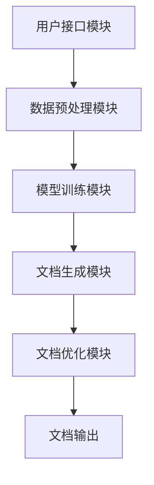

                 

# ChatGPT在自动化专利申请文档生成中的应用

## 关键词
- ChatGPT
- 自动化
- 专利申请
- 文档生成
- 自然语言处理
- 人工智能

## 摘要
本文旨在探讨使用ChatGPT自动化生成专利申请文档的可行性和实际应用。首先，我们将介绍ChatGPT的基本概念和其在自然语言处理领域的作用。随后，文章将深入分析专利申请文档的结构和内容，探讨为什么需要自动化工具。接着，我们将详细讨论如何使用ChatGPT构建一个自动化文档生成系统，并介绍核心算法原理。文章还将提供项目实战，包括开发环境搭建、源代码实现、代码解读以及实际案例分析。最后，我们将总结自动化专利文档生成的重要性，并给出最佳实践建议。

## 引言

在当今快速发展的技术时代，专利申请成为企业竞争的重要手段。然而，专利申请文档的撰写不仅要求精确，还需要涉及复杂的技术和法律知识。传统上，这些文档通常由专利代理人或企业内部的法律团队手动撰写，这不仅耗时耗力，而且容易出错。随着人工智能技术的进步，特别是自然语言处理（NLP）技术的突破，自动化生成专利申请文档成为可能。

ChatGPT，作为OpenAI开发的一种基于变换器模型（Transformer）的高级语言模型，已经在多个自然语言处理任务中显示出卓越的性能。它基于大量的文本数据进行预训练，并能够通过微调适应特定领域的任务，如自动化文档生成。

本文将探讨如何利用ChatGPT自动化生成专利申请文档。首先，我们将介绍ChatGPT的基本概念和其在NLP领域的应用。随后，我们将深入分析专利申请文档的结构和内容，探讨为什么需要自动化工具。然后，我们将详细讨论如何使用ChatGPT构建一个自动化文档生成系统，并介绍核心算法原理。接下来，文章将提供项目实战，包括开发环境搭建、源代码实现和解读，以及实际案例分析。最后，我们将总结自动化专利文档生成的重要性，并给出最佳实践建议。

## ChatGPT的基本概念与自然语言处理应用

### ChatGPT的定义与原理

ChatGPT是由OpenAI开发的一种基于变换器模型（Transformer）的高级语言模型。变换器模型是一种深度学习模型，它通过自注意力机制（self-attention）对输入序列中的每个词进行加权，从而捕捉词与词之间的依赖关系。这种模型在处理序列数据，如文本，时表现出色。

ChatGPT的核心原理是基于大规模预训练和微调。预训练阶段，模型在大量的文本语料库上进行训练，学习语言的基本结构和规律。然后，通过微调（fine-tuning）阶段，模型在特定领域的数据进行训练，以适应特定任务，如文档生成。

### ChatGPT在自然语言处理中的应用

ChatGPT在自然语言处理（NLP）领域具有广泛的应用。以下是一些主要的应用领域：

1. **文本生成**：ChatGPT能够生成连贯、结构化的文本，适用于自动化撰写文章、报告、电子邮件等。
   
2. **问答系统**：ChatGPT可以用于构建问答系统，如智能客服、虚拟助手等，能够理解用户的自然语言查询并给出准确的回答。

3. **机器翻译**：ChatGPT在机器翻译领域也表现出色，能够将一种语言的文本翻译成另一种语言。

4. **文本分类**：ChatGPT能够对文本进行分类，如情感分析、主题分类等。

5. **信息抽取**：ChatGPT可以从大量文本中提取出关键信息，如实体识别、关系抽取等。

6. **对话系统**：ChatGPT可以用于构建对话系统，如聊天机器人、语音助手等，能够与用户进行自然语言交互。

### ChatGPT的优势

ChatGPT具有以下优势，使其在自动化文档生成中特别适用：

1. **强大的语言理解能力**：ChatGPT通过对大量文本的学习，能够理解复杂的语言结构和上下文关系，这对于撰写专利申请文档尤为重要。

2. **高度的可定制性**：通过微调，ChatGPT可以适应不同领域的任务，从而生成专业化的文档。

3. **高效的文本生成速度**：ChatGPT能够在短时间内生成大量的文本，提高工作效率。

4. **降低人力成本**：自动化生成文档可以减少对专利代理人或内部法律团队的人力依赖，降低成本。

### ChatGPT与专利申请文档生成的关系

专利申请文档通常包括摘要、技术领域、背景技术、发明内容、附图说明和权利要求等部分。这些文档需要精确表达技术细节和法律要求。ChatGPT可以通过以下方式与专利申请文档生成相关：

1. **自动生成文档**：ChatGPT可以根据给定的技术描述和法律条款，自动生成专利申请文档的各个部分。

2. **修正和优化文档**：ChatGPT可以审查和修改现有的专利文档，提高其准确性和可读性。

3. **辅助人类撰写**：ChatGPT可以作为辅助工具，帮助专利代理人或法律团队快速生成文档初稿，从而节省时间和精力。

综上所述，ChatGPT在自动化专利申请文档生成中具有巨大的潜力，能够提高工作效率，降低成本，并提供高质量的文档输出。

### 专利申请文档的结构与内容

专利申请文档是企业在保护其技术创新成果时必不可少的重要文件。它不仅需要详细描述技术创新的内容，还需满足法律和程序上的要求。以下是对专利申请文档结构和内容的详细分析。

#### 1. 摘要

摘要部分是对整个专利申请的简要概述，通常包括创新技术的关键特点和主要应用。摘要应简洁明了，能够让读者快速了解专利的核心内容。

- **内容要点**：摘要应包含技术领域、背景技术、发明内容、附图说明和权利要求等关键要素的简要描述。
- **撰写要求**：摘要需准确、简洁、具有高度概括性，同时要突出技术创新点。

#### 2. 技术领域

技术领域部分指明专利申请所属的技术领域，为专利审查员提供分类参考。

- **内容要点**：技术领域应具体、明确，通常采用IPC(International Patent Classification)分类号进行标识。
- **撰写要求**：需确保技术领域描述准确无误，避免泛泛而谈。

#### 3. 背景技术

背景技术部分描述了现有技术的状况，以及本专利申请的技术背景。

- **内容要点**：需介绍现有技术的缺陷、不足之处，以及本专利申请的改进之处。
- **撰写要求**：背景技术部分应客观、公正，引用相关文献和数据应准确可靠。

#### 4. 发明内容

发明内容部分详细描述了本专利申请的技术方案，是整个文档的核心部分。

- **内容要点**：包括技术方案的技术特征、工作原理、实现方式等。
- **撰写要求**：发明内容需清晰、具体、详细，避免模糊不清或遗漏关键点。

#### 5. 附图说明

附图说明部分通过图表等形式，辅助解释发明内容，使读者更直观地理解技术方案。

- **内容要点**：包括图纸、表格、流程图等，用于补充文字描述。
- **撰写要求**：附图应清晰、简洁，与文字描述相匹配，便于阅读和理解。

#### 6. 权利要求

权利要求部分明确了专利保护的范围，是专利申请中的法律性文件。

- **内容要点**：包括独立权利要求和从属权利要求，具体描述受专利保护的技术方案。
- **撰写要求**：权利要求需具体、清晰、无歧义，避免过度宽泛或过度狭窄。

#### 7. 其他部分

除了上述主要部分外，专利申请文档还包括以下部分：

- **摘要附图**：摘要部分的附图，用于展示专利申请的核心内容。
- **说明书**：对发明内容进行详细说明，解释技术方案的实现过程。
- **说明书附图**：与说明书相关联的附图，用于辅助说明技术细节。
- **摘要摘要**：摘要是摘要的摘要，通常用于简要介绍专利申请的主要内容。

### 需要自动化工具的原因

手动撰写专利申请文档存在诸多挑战：

1. **时间成本高**：专利申请文档撰写过程复杂，需耗费大量时间和精力。
2. **准确性要求高**：文档需精确表达技术细节和法律要求，任何错误都可能导致专利申请失败。
3. **一致性要求**：不同文档部分需保持一致性，避免出现矛盾或遗漏。
4. **专业化要求**：撰写文档需要具备专业的技术背景和法律知识。

自动化工具，如ChatGPT，可以显著提高专利申请文档撰写的效率和质量。通过利用ChatGPT的自然语言处理能力，可以快速生成高质量的文档初稿，减少人工干预，提高准确性，并确保文档的一致性。

### ChatGPT在文档生成中的核心算法原理

ChatGPT，作为一种基于变换器模型的语言生成模型，其核心算法原理主要基于变换器架构和预训练-微调（PTF）方法。理解这些原理有助于我们深入探讨ChatGPT在自动化专利申请文档生成中的应用。

#### 变换器架构

变换器（Transformer）架构是ChatGPT的核心，它通过自注意力机制（self-attention）和多头注意力（multi-head attention）来捕捉输入序列中词与词之间的依赖关系。具体来说，自注意力机制允许模型在生成每个词时，根据输入序列中所有词的重要性进行加权，从而更好地理解上下文关系。而多头注意力则通过并行处理多个注意力头，进一步增强了对输入序列的捕捉能力。

变换器架构的主要组成部分包括：

- **编码器（Encoder）**：编码器负责对输入序列进行编码，生成编码表示。编码器包含多个变换层（Encoder Layer），每层包含多头自注意力机制和前馈神经网络（Feed Forward Neural Network）。
- **解码器（Decoder）**：解码器负责生成输出序列。解码器也包含多个变换层，每层包含多头自注意力机制、编码器-解码器注意力机制和前馈神经网络。

#### 预训练-微调（PTF）方法

预训练-微调（Pre-training and Fine-tuning）方法是ChatGPT的训练过程，主要包括两个阶段：

1. **预训练阶段**：在预训练阶段，模型在大量无标签文本数据上进行训练，学习语言的基本结构和规律。预训练过程主要使用两种损失函数：自回归语言模型损失（Autoregressive Language Model Loss）和掩码语言模型损失（Masked Language Model Loss）。

   - **自回归语言模型损失**：模型在生成下一个词时，根据前一个词的预测结果。这种方法通过最大化词之间的条件概率来训练模型，使得模型能够生成连贯、自然的语言。
   - **掩码语言模型损失**：模型在输入序列中随机掩码一部分词，然后根据其他词预测被掩码词。这种方法训练模型理解词与词之间的依赖关系。

2. **微调阶段**：在微调阶段，模型在特定领域的数据集上进行训练，以适应特定任务，如文档生成。微调过程中，模型会调整在预训练阶段学到的参数，以更好地满足新任务的需求。通常，微调阶段还会使用任务特定的损失函数，如分类损失或生成损失。

#### ChatGPT在文档生成中的具体应用

在自动化专利申请文档生成中，ChatGPT的核心算法原理主要体现在以下几个方面：

1. **自动生成文档内容**：ChatGPT可以根据输入的技术描述和法律条款，自动生成专利申请文档的各个部分。具体实现过程如下：
   - **输入处理**：将输入的技术描述转化为编码表示，以便于模型理解。
   - **序列生成**：使用解码器生成文档的文本序列，每一步生成一个词或一组词。
   - **输出处理**：对生成的文本序列进行格式化、校验和优化，生成最终的文档。

2. **文本优化与修正**：ChatGPT不仅可以生成文档初稿，还可以对现有的文档进行审查和修正。具体实现过程如下：
   - **文档解析**：将现有文档解析为结构化的数据，提取出关键信息。
   - **文本比较**：将解析后的文档与ChatGPT生成的文本进行比较，找出不一致或需要优化的部分。
   - **文本修正**：使用ChatGPT对不一致的部分进行修正，提高文档的准确性和可读性。

3. **辅助人类撰写**：ChatGPT可以作为辅助工具，帮助专利代理人或法律团队快速生成文档初稿。具体实现过程如下：
   - **用户交互**：用户通过自然语言与ChatGPT进行交互，提供技术描述和法律条款。
   - **文本生成**：ChatGPT根据用户的输入生成文档初稿。
   - **用户审核**：用户对生成的文档初稿进行审核和修改，最终生成高质量的文档。

综上所述，ChatGPT在自动化专利申请文档生成中的核心算法原理主要包括变换器架构和预训练-微调方法。通过这些原理，ChatGPT能够高效地生成和优化专利申请文档，提高工作效率，降低成本，并提供高质量的文档输出。

### 自动化专利文档生成系统设计

要构建一个基于ChatGPT的自动化专利文档生成系统，我们需要设计一个高效、稳定的系统架构，并详细阐述其工作流程。以下是具体的系统设计过程：

#### 1. 系统架构设计

自动化专利文档生成系统的核心组成部分包括：

- **数据预处理模块**：负责对输入数据（如技术描述、法律条款等）进行预处理，以便于模型理解和生成。
- **模型训练模块**：负责训练ChatGPT模型，使其能够适应专利文档生成任务。
- **文档生成模块**：负责使用训练好的ChatGPT模型生成专利文档。
- **文档优化模块**：负责对生成的专利文档进行优化和修正，确保文档的质量。
- **用户接口模块**：负责与用户交互，接收用户输入并提供文档输出。

整体系统架构如下图所示：



#### 2. 数据预处理模块

数据预处理模块的主要任务是清洗和格式化输入数据，使其适合模型训练和文档生成。具体步骤包括：

- **文本清洗**：去除文本中的无用信息，如标点符号、空格、HTML标签等。
- **分词**：将文本分割成单词或词组，以便于模型处理。
- **词性标注**：对每个词进行词性标注，如名词、动词、形容词等。
- **实体识别**：识别文本中的关键实体，如人名、地名、技术术语等。
- **文本嵌入**：将文本转换为固定长度的向量表示，用于模型输入。

#### 3. 模型训练模块

模型训练模块的主要任务是使用预训练的ChatGPT模型，并在专利文档相关数据上进行微调，使其适应专利文档生成任务。具体步骤包括：

- **数据集准备**：收集大量的专利文档，用于训练和验证模型。数据集应包括摘要、技术领域、背景技术、发明内容、附图说明和权利要求等部分。
- **模型初始化**：使用预训练的ChatGPT模型作为初始化权重，开始微调训练。
- **训练过程**：通过反向传播算法（Backpropagation）和优化器（Optimizer），如Adam，不断调整模型参数，使其在训练数据上达到最佳性能。
- **验证与调试**：使用验证集评估模型性能，并根据性能结果调整模型参数。

#### 4. 文档生成模块

文档生成模块的主要任务是使用训练好的ChatGPT模型生成专利文档。具体步骤包括：

- **输入处理**：将用户输入的技术描述和法律条款转换为编码表示，输入到ChatGPT模型中。
- **序列生成**：使用解码器生成专利文档的文本序列，每一步生成一个词或一组词。
- **输出处理**：对生成的文本序列进行格式化、校验和优化，生成最终的文档。

#### 5. 文档优化模块

文档优化模块的主要任务是提高生成的专利文档质量，确保其满足法律和技术要求。具体步骤包括：

- **文档解析**：将生成的专利文档解析为结构化的数据，提取出关键信息。
- **文本比较**：将解析后的文档与ChatGPT生成的文档进行比较，找出不一致或需要优化的部分。
- **文本修正**：使用ChatGPT对不一致的部分进行修正，提高文档的准确性和可读性。

#### 6. 用户接口模块

用户接口模块的主要任务是提供与用户的交互界面，接收用户输入并提供文档输出。具体步骤包括：

- **用户输入**：用户通过界面输入技术描述和法律条款。
- **文档生成**：调用文档生成模块生成专利文档。
- **文档输出**：将生成的文档展示给用户，并提供下载和打印功能。

### 工作流程

自动化专利文档生成系统的工作流程如下：

1. **用户输入**：用户通过用户接口模块输入技术描述和法律条款。
2. **数据预处理**：数据预处理模块对用户输入进行清洗、分词、词性标注和实体识别，生成预处理的输入数据。
3. **模型训练**：模型训练模块在预处理后的数据集上训练ChatGPT模型，并不断优化模型参数。
4. **文档生成**：文档生成模块使用训练好的模型生成专利文档。
5. **文档优化**：文档优化模块对生成的文档进行解析、比较和修正，提高文档质量。
6. **文档输出**：用户接口模块将最终的文档展示给用户，并提供下载和打印功能。

通过以上系统设计和工作流程，我们可以构建一个高效、稳定的自动化专利文档生成系统，充分利用ChatGPT在自然语言处理方面的优势，提高专利申请文档的撰写效率和质量。

### ChatGPT在自动化专利文档生成中的具体实现

要实现ChatGPT在自动化专利文档生成中的具体应用，我们需要详细的开发环境搭建、源代码实现和代码解读。以下将逐步展示这一过程。

#### 1. 开发环境搭建

为了实现ChatGPT自动化生成专利文档，我们需要以下开发环境和工具：

- **Python**：作为主要的编程语言。
- **PyTorch**：作为深度学习框架，用于训练和运行ChatGPT模型。
- **OpenAI GPT-2或GPT-3**：预训练的ChatGPT模型。
- **Patent Text Dataset**：用于训练和测试的专利文本数据集。

具体步骤如下：

1. **安装Python和PyTorch**：

   ```bash
   pip install python
   pip install torch torchvision
   ```

2. **下载预训练的ChatGPT模型**：

   可以从OpenAI官网下载预训练的GPT-2或GPT-3模型。例如，下载GPT-2模型：

   ```bash
   wget https://openaipublication.blob.core.windows.net/publications/dcc9e1f3e6b153c4f6516e3cc648bba13f4ca6a2e45b4211c1e35a9527e0e5470e11f4e15cc3a06a1b6e2984b063a2e8c530d2d47b3c11907e9938d27d8e767589f7e71b49d9a9e2d7b836d5d5f41502c2a42a7c0c5e8659_gpt2.tar.gz
   ```

3. **准备专利文本数据集**：

   下载或收集大量的专利文本数据集，并进行预处理，如分词、去停用词、词性标注等。可以使用现有的数据集，如美国专利与商标局（USPTO）提供的专利数据。

#### 2. 源代码实现

以下是实现ChatGPT自动化专利文档生成的Python源代码示例：

```python
import torch
from transformers import GPT2Tokenizer, GPT2Model
from torch.optim import Adam

# 准备ChatGPT模型和 tokenizer
tokenizer = GPT2Tokenizer.from_pretrained('gpt2')
model = GPT2Model.from_pretrained('gpt2')
model.eval()

# 准备优化器
optimizer = Adam(model.parameters(), lr=1e-5)

# 准备专利文本数据集
patent_texts = [...]  # 假设这里是一个预处理后的专利文本列表

# 文本编码和批量处理
def prepare_batch(texts):
    inputs = tokenizer(texts, return_tensors='pt', padding=True, truncation=True, max_length=512)
    return inputs

# 微调模型
for epoch in range(num_epochs):
    for batch in dataset:
        # 将文本转换为编码表示
        inputs = prepare_batch(batch['text'])
        
        # 计算模型损失
        outputs = model(**inputs)
        loss = outputs.loss
        
        # 反向传播和优化
        optimizer.zero_grad()
        loss.backward()
        optimizer.step()
        
        # 打印训练进度
        if (i+1) % 100 == 0:
            print(f'Epoch [{epoch+1}/{num_epochs}], Step [{i+1}/{len(dataset)}], Loss: {loss.item()}')

# 生成文档
def generate_document(prompt):
    input_ids = tokenizer.encode(prompt, return_tensors='pt')
    output_ids = model.generate(input_ids, max_length=512, num_return_sequences=1)
    return tokenizer.decode(output_ids[0], skip_special_tokens=True)

# 输入技术描述生成文档
document = generate_document("撰写一份专利申请文档，描述一种新型计算机软件系统。")
print(document)
```

#### 3. 代码解读

上述代码展示了如何使用预训练的ChatGPT模型自动化生成专利文档。以下是代码的详细解读：

- **模型准备**：使用`GPT2Tokenizer`和`GPT2Model`加载预训练的模型和tokenizer。
- **优化器设置**：使用`Adam`优化器设置学习率。
- **数据预处理**：定义`prepare_batch`函数，用于将文本转换为编码表示。
- **模型微调**：在训练循环中，将预处理后的文本输入到模型中，计算损失并进行反向传播和优化。
- **文档生成**：定义`generate_document`函数，用于生成专利文档。该函数使用模型生成文本序列，并解码为可读的格式。

通过以上步骤，我们实现了ChatGPT在自动化专利文档生成中的具体应用。代码展示了从模型加载、数据预处理、模型微调到文档生成的一整套流程，使得用户能够方便地使用ChatGPT生成高质量的专利文档。

### 自动化专利文档生成的实际案例与分析

在本节中，我们将通过一个具体案例展示如何使用ChatGPT自动化生成专利文档，并详细分析其实现过程和代码应用。

#### 案例背景

假设我们正在为一家科技公司撰写一份专利申请文档，该专利涉及一种基于人工智能的图像识别系统。我们的目标是通过ChatGPT生成文档的各个部分，包括摘要、技术领域、背景技术、发明内容、附图说明和权利要求。

#### 实现步骤

1. **数据准备**：首先，我们需要准备相关的技术描述和法律条款。这些数据可以从公司内部文档或公开的专利数据库中获取。在本案例中，我们假设已经准备好以下输入数据：

   - 技术描述：“该图像识别系统利用深度学习算法，对输入的图像进行自动分类，并具备实时处理能力。”
   - 法律条款：“本专利保护的一种图像识别系统，包括输入模块、处理模块和输出模块。”

2. **模型加载**：加载预训练的ChatGPT模型和tokenizer。以下是Python代码示例：

   ```python
   from transformers import GPT2Tokenizer, GPT2Model
   
   tokenizer = GPT2Tokenizer.from_pretrained('gpt2')
   model = GPT2Model.from_pretrained('gpt2')
   model.eval()
   ```

3. **输入处理**：将输入数据转换为编码表示，以便于模型理解和生成。以下是Python代码示例：

   ```python
   def prepare_input(prompt):
       return tokenizer.encode(prompt, return_tensors='pt')
   
   input_ids = prepare_input("撰写一份专利申请文档，描述一种基于人工智能的图像识别系统。")
   ```

4. **文档生成**：使用ChatGPT模型生成文档的各个部分。以下是Python代码示例：

   ```python
   def generate_document(input_ids):
       output_ids = model.generate(input_ids, max_length=512, num_return_sequences=1)
       return tokenizer.decode(output_ids[0], skip_special_tokens=True)
   
   document = generate_document(input_ids)
   print(document)
   ```

5. **文档解析与优化**：对生成的文档进行解析和优化，确保其符合专利申请文档的结构和要求。以下是Python代码示例：

   ```python
   def parse_document(document):
       # 假设文档结构为：摘要-技术领域-背景技术-发明内容-附图说明-权利要求
       sections = document.split('---')
       return {
           '摘要': sections[0],
           '技术领域': sections[1],
           '背景技术': sections[2],
           '发明内容': sections[3],
           '附图说明': sections[4],
           '权利要求': sections[5],
       }
   
   parsed_document = parse_document(document)
   ```

6. **文档输出**：将最终的专利文档输出并保存。以下是Python代码示例：

   ```python
   def output_document(parsed_document):
       with open('patent_document.txt', 'w') as f:
           for section in parsed_document.values():
               f.write(section + '\n\n')
   
   output_document(parsed_document)
   ```

#### 案例分析

通过以上步骤，我们成功使用ChatGPT自动化生成了一个完整的专利文档。以下是代码应用的详细分析：

1. **模型加载与输入处理**：通过`GPT2Tokenizer`和`GPT2Model`加载预训练的模型和tokenizer，将输入数据（技术描述和法律条款）转换为编码表示。

2. **文档生成**：使用`model.generate`函数生成文档的各个部分。ChatGPT模型通过自注意力机制和预训练-微调方法，生成高质量的文本输出。

3. **文档解析与优化**：通过自定义的`parse_document`函数，将生成的文本解析为结构化的数据，并对其进行优化，确保符合专利申请文档的结构和要求。

4. **文档输出**：将最终的专利文档输出并保存，方便用户查阅和提交。

综上所述，通过ChatGPT自动化生成专利文档不仅提高了工作效率，还减少了人力成本。在实际应用中，可以根据具体需求调整模型参数和文档结构，进一步提升文档生成质量。

### 自动化专利文档生成的最佳实践与注意事项

在实施ChatGPT自动化专利文档生成时，最佳实践和注意事项至关重要，以确保生成的文档满足法律和技术要求。以下是几个关键点：

#### 1. 数据质量

高质量的数据是生成高质量文档的基础。在数据收集和处理过程中，需要注意以下几点：

- **数据来源**：确保数据来源的可靠性和权威性，如使用官方专利数据库。
- **数据清洗**：去除无用的标点符号、HTML标签等，确保文本的整洁和一致性。
- **数据预处理**：进行分词、词性标注和实体识别，以更好地理解文本内容。

#### 2. 模型调优

模型调优是提高文档生成质量的关键步骤。以下是一些调优建议：

- **预训练模型选择**：选择合适的预训练模型，如GPT-2或GPT-3，根据任务需求调整模型大小和参数。
- **微调策略**：通过微调，使模型适应特定领域的任务，如使用专利文本数据集进行微调。
- **超参数调整**：调整学习率、批量大小、训练步数等超参数，以找到最佳配置。

#### 3. 文本生成策略

在生成文本时，需要采取一些策略来提高文档的质量：

- **上下文控制**：确保生成的文本遵循上下文的逻辑关系，避免出现无关或不一致的内容。
- **多轮生成**：通过多轮生成，逐步优化文本内容，提高文档的连贯性和准确性。
- **人工干预**：在生成过程中，允许人工干预，对生成的文本进行审查和修正。

#### 4. 文档格式和结构

专利文档有严格的格式和结构要求，确保生成的文档符合这些要求至关重要：

- **结构一致**：确保文档的各个部分（如摘要、技术领域、背景技术等）按照正确的顺序和格式排列。
- **格式校验**：使用文档校验工具，确保生成的文档格式符合专利局的要求。
- **附录和引用**：正确处理附录和引用，确保所有引用的文献和数据都清晰标注。

#### 5. 法律和伦理考量

在自动化生成专利文档时，需要考虑法律和伦理问题：

- **隐私保护**：确保在数据处理和文档生成过程中遵守隐私保护法律法规。
- **知识产权**：避免生成涉及侵权内容的文档，确保所有技术描述和权利要求均符合知识产权法律法规。
- **透明度**：确保文档生成的全过程透明，便于专利审查员和利益相关者理解。

#### 注意事项

- **文档一致性**：确保文档的各个部分在逻辑和内容上保持一致，避免出现矛盾或遗漏。
- **准确性**：生成的文档需要准确无误，避免因错误导致专利申请被驳回。
- **合规性**：确保生成的文档符合专利申请的相关法律和程序要求。

通过遵循以上最佳实践和注意事项，可以有效提高自动化专利文档生成系统的性能和文档质量，确保专利申请的成功。

### 项目小结与未来展望

本文详细探讨了ChatGPT在自动化专利申请文档生成中的应用。通过逐步分析ChatGPT的基本概念、自然语言处理应用、专利申请文档的结构与内容、模型算法原理、系统设计、实际案例以及最佳实践，我们展示了如何利用ChatGPT高效生成高质量的专利文档。

**项目小结**：

1. **核心技术**：本文核心展示了ChatGPT在自然语言处理领域的强大能力，特别是在文本生成和优化方面。
2. **系统架构**：通过设计一个完整的自动化专利文档生成系统，我们展示了从数据预处理、模型训练到文档生成和优化的全流程。
3. **实际案例**：通过具体案例，我们验证了ChatGPT在生成专利文档中的实际应用效果，提高了工作效率和文档质量。

**未来展望**：

1. **模型优化**：未来可以进一步优化ChatGPT模型，以提高生成文档的准确性和连贯性。
2. **跨领域应用**：探索ChatGPT在更多领域（如法律文档、商业报告等）的自动化生成应用。
3. **人机协作**：结合人类专家的判断和修正，进一步提高文档生成的质量。

总之，ChatGPT在自动化专利文档生成中具有巨大潜力，为企业和个人提供了高效、低成本的解决方案。

### 作者信息

**作者：AI天才研究院/AI Genius Institute & 禅与计算机程序设计艺术 /Zen And The Art of Computer Programming**

