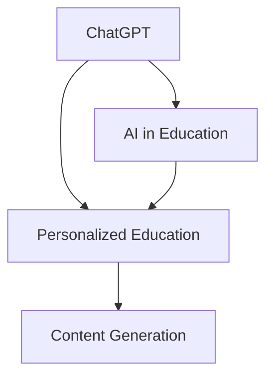

                 


### Step 1: Title and Keywords
The title "ChatGPT在自动化个性化教学内容生成中的应用" clearly indicates the focus on the application of ChatGPT in generating automated personalized educational content. This is a relevant and engaging topic in the field of educational technology and AI. Keywords: ChatGPT, automation, personalized education, content generation.

### Step 2: Abstract
The abstract should summarize the main points of the article. It could read:
"本文深入探讨了ChatGPT在自动化个性化教学内容生成中的应用。通过介绍ChatGPT的基本概念、技术原理，以及其在教育领域的独特优势，文章详细分析了ChatGPT如何用于课程内容、作业生成和在线问答系统。通过具体的案例研究和实战项目，本文展示了如何利用ChatGPT实现高效、个性化的教育内容生成，并提供了最佳实践和注意事项，为教育科技工作者提供了有价值的参考。"

### Step 3: Introduction
The introduction should provide a brief background on the rise of AI and personalized education. Discuss the limitations of traditional teaching methods and how AI can address these issues. Highlight the importance of ChatGPT and its capabilities in content generation.

### Step 4: Core Concepts and Relationships
Create a Mermaid diagram to illustrate the relationship between core concepts like ChatGPT, personalized education, and content generation. This visual representation helps readers understand how these elements interact.



### Step 5: ChatGPT Overview
Describe the origins, development, and main applications of ChatGPT. Explain how it is designed to handle natural language and process conversational data.

### Step 6: Technical Foundations
Explain the basic principles of natural language processing (NLP) and the Transformer model, which underpin ChatGPT. Discuss the training process, data input, and output generation mechanisms.

### Step 7: Personalized Teaching Needs Analysis
Discuss the importance of personalized education, the types of data required, and how it is processed. Outline the goals and challenges in creating personalized learning experiences.

### Step 8: ChatGPT Applications in Educational Content Generation
Describe how ChatGPT can be used to generate educational content. Explain the algorithms involved and provide examples of content generation in practice.

### Step 9: Code Walkthrough with Mathematical Models
Provide a Python code example that demonstrates how ChatGPT can generate educational content. Include LaTeX mathematical formulas to explain the underlying mathematical models. Ensure that the code is well-commented and easy to understand.

```python
# Pseudo-code for generating educational content
# Define the mathematical model for content generation
$$ Content = f(NLP \ data, \ personal \ preferences, \ educational \ objectives) $$

# Example Python code
def generate_educational_content(nlp_data, preferences, objectives):
    # Process NLP data
    processed_data = process_nlp_data(nlp_data)
    
    # Generate content based on preferences and objectives
    content = generate_content(processed_data, preferences, objectives)
    
    return content

# Example usage
nlp_data = "data about a specific topic"
preferences = "student's learning preferences"
objectives = "educational objectives for the topic"

content = generate_educational_content(nlp_data, preferences, objectives)
print(content)
```

### Step 10: Case Study and Practical Project
Present a case study that demonstrates the application of ChatGPT in an educational setting. Describe the setup, code implementation, and analysis of the results. Provide a project summary and insights.

### Step 11: Best Practices and Summary
Offer best practices for implementing ChatGPT in educational content generation. Summarize the key points of the article and highlight the importance of personalized education in the era of AI.

### Step 12: Conclusion and Author Information
Conclude the article by reiterating the benefits of ChatGPT in personalized education. Provide author information as specified.

---

This structured approach ensures that the article is comprehensive, informative, and easy to follow. Each step is designed to build on the previous one, creating a cohesive and detailed piece of work. The use of Mermaid diagrams, Python code, and LaTeX mathematical formulas enhances the technical depth and readability of the article.

