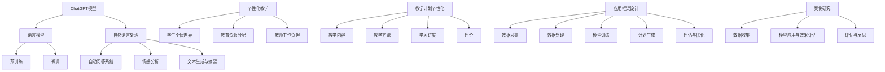

                 

### 《ChatGPT在自动化个性化教学计划生成中的应用》

关键词：ChatGPT，个性化教学，自动化教学计划，自然语言处理，教育科技

摘要：本文旨在探讨如何利用先进的自然语言处理技术，特别是ChatGPT，来实现自动化个性化教学计划的生成。文章首先介绍了ChatGPT技术的基本原理和应用场景，然后深入分析了个性化教学的需求和原则，接着详细阐述了ChatGPT在个性化教学计划生成中的应用框架和实现步骤。通过实际案例研究，本文展示了ChatGPT在实际教学中的应用效果和面临的挑战，并提出了未来发展的方向。

## 目录大纲

### 第一部分：背景与概述

#### 第1章：引言  
- ChatGPT技术背景
- 自动化个性化教学计划
- 本书目的与结构

#### 第2章：个性化教学概述
- 个性化教学的概念与意义
- 个性化教学的需求分析
- 当前个性化教学的发展状况

### 第二部分：ChatGPT技术基础

#### 第3章：ChatGPT基本原理
- 语言模型的基本概念
- GPT模型的架构与工作原理
- ChatGPT的定制化与优化

#### 第4章：ChatGPT应用场景
- 自动问答系统
- 情感分析
- 文本生成与摘要

#### 第5章：教学计划个性化
- 个性化教学计划的定义
- 个性化教学计划的需求分析
- 个性化教学计划的设计原则

### 第三部分：ChatGPT在个性化教学计划生成中的应用

#### 第6章：应用框架设计
- 应用框架概述
- 数据采集与处理
- 模型训练与优化
- 教学计划生成流程

#### 第7章：案例研究
- 案例选择与目标
- 数据收集与分析
- 模型应用与效果评估
- 案例总结与反思

#### 第8章：技术挑战与未来展望
- 技术挑战
- 未来发展方向
- 对教育行业的潜在影响

### 第四部分：附录

#### 第9章：相关资源与参考文献
- 开发工具与环境
- 资源链接
- 参考文献列表

## 第一章：引言

### ChatGPT技术背景

ChatGPT是由OpenAI开发的一种基于Transformer架构的预训练语言模型。该模型结合了大量的文本数据，通过深度学习技术进行训练，从而具备理解和生成人类语言的能力。ChatGPT的核心特点在于其强大的上下文理解能力，这使得它能够生成连贯、符合逻辑的文本。

ChatGPT的应用场景非常广泛，包括但不限于自动问答系统、情感分析、文本生成与摘要等。其中，自动问答系统是ChatGPT最为典型的应用场景之一。通过与用户进行自然语言交互，ChatGPT能够理解用户的问题，并生成准确的答案。

### 自动化个性化教学计划

个性化教学计划是一种根据学生的个体差异，为其量身定制的学习计划。这种教学计划能够满足学生的个性化需求，提高学习效果。然而，传统的教学计划制定过程通常需要大量的人力和时间，难以实现高效、精准的个性化服务。

随着人工智能技术的不断发展，自动化个性化教学计划的生成成为可能。利用自然语言处理技术，特别是ChatGPT，可以自动分析学生的学习数据，生成符合其学习需求的个性化教学计划。

### 本书目的与结构

本文旨在探讨如何利用ChatGPT实现自动化个性化教学计划的生成。文章首先介绍了ChatGPT的技术背景和应用场景，然后深入分析了个性化教学的需求和原则，接着详细阐述了ChatGPT在个性化教学计划生成中的应用框架和实现步骤。通过实际案例研究，本文展示了ChatGPT在实际教学中的应用效果和面临的挑战，并提出了未来发展的方向。

文章分为四个部分：第一部分是背景与概述，包括引言和个性化教学概述；第二部分是ChatGPT技术基础，包括ChatGPT基本原理和应用场景；第三部分是ChatGPT在个性化教学计划生成中的应用，包括应用框架设计和案例研究；第四部分是技术挑战与未来展望。

## 第二章：个性化教学概述

### 个性化教学的概念与意义

个性化教学是一种以学生为中心的教学模式，它关注学生的个体差异，通过调整教学内容、方法和节奏，以满足每个学生的个性化需求。个性化教学的核心在于尊重和发挥学生的主体性，使其能够在学习过程中主动参与、积极探索。

个性化教学的意义在于：

1. 提高学习效果：通过满足学生的个性化需求，个性化教学能够提高学生的学习兴趣和动机，从而提高学习效果。
2. 促进全面发展：个性化教学不仅关注学生的知识学习，还关注学生的情感、态度和价值观的培养，促进学生的全面发展。
3. 降低教育成本：个性化教学减少了教师对个别学生的辅导时间，降低了教育成本。

### 个性化教学的需求分析

在传统教学模式下，教师通常采用“一刀切”的教学方法，无法满足学生的个性化需求。随着信息技术的不断发展，尤其是人工智能技术的应用，个性化教学的需求越来越强烈。具体表现在：

1. 学生个性化需求：每个学生都有自己的学习风格、兴趣和需求，传统教学无法满足这种多样性。
2. 教育资源分配不均：不同地区、不同学校之间的教育资源分配存在较大差异，个性化教学有助于缩小这种差距。
3. 教师工作负担：个性化教学要求教师对每个学生进行个性化辅导，教师的工作负担较大，需要借助技术手段来提高效率。

### 当前个性化教学的发展状况

当前，个性化教学已经得到了广泛关注和应用。许多教育机构和公司开始采用人工智能技术，如ChatGPT，来生成个性化教学计划。具体发展状况包括：

1. 技术应用：人工智能技术在个性化教学中的应用不断深入，包括学习分析、智能推荐、自动批改等。
2. 政策支持：政府开始加大对个性化教学的重视和投入，推动个性化教学的发展。
3. 成果显现：一些教育机构通过个性化教学取得了显著成效，学生的学习效果和满意度明显提高。

## 第三章：ChatGPT基本原理

### 语言模型的基本概念

语言模型是自然语言处理领域的一个核心概念，它旨在模拟人类语言的能力，通过对大量文本数据的学习，生成符合语法和语义规则的文本。语言模型可以分为统计模型和深度学习模型，其中深度学习模型，如GPT，已经成为语言模型的主流。

### GPT模型的架构与工作原理

GPT（Generative Pre-trained Transformer）是由OpenAI开发的一种基于Transformer架构的深度学习模型。GPT模型通过学习大量的文本数据，捕捉语言的统计规律，从而实现文本的生成和预测。

GPT模型的工作原理主要包括以下步骤：

1. 预训练：GPT模型在大量无标签文本数据上进行预训练，学习语言的统计规律。
2. 微调：在预训练的基础上，GPT模型通过有监督或无监督的方法，对特定任务进行微调，以适应不同的应用场景。

### ChatGPT的定制化与优化

ChatGPT是基于GPT模型开发的一种对话系统，它通过优化GPT模型，使其能够更好地适应对话场景。ChatGPT的定制化与优化主要包括以下几个方面：

1. 对话上下文：ChatGPT能够处理对话的上下文信息，生成连贯、符合逻辑的回答。
2. 问答对：ChatGPT通过学习大量的问答对，提高回答问题的准确性和丰富性。
3. 多模态：ChatGPT不仅支持文本输入，还支持图像、声音等多模态输入，提高对话的多样性。

## 第四章：ChatGPT应用场景

### 自动问答系统

自动问答系统是ChatGPT最为典型的应用场景之一。通过理解用户的问题，ChatGPT能够生成准确的答案，实现人机对话。自动问答系统广泛应用于客服、教育、医疗等领域，大大提高了工作效率和用户满意度。

### 情感分析

情感分析是ChatGPT在自然语言处理领域的另一个重要应用。通过对文本进行分析，ChatGPT能够识别文本的情感倾向，如正面、负面或中性。情感分析广泛应用于市场调研、舆情监控、客户服务等领域，帮助企业更好地了解用户需求和市场动态。

### 文本生成与摘要

文本生成与摘要是ChatGPT的另一个重要应用场景。通过学习大量的文本数据，ChatGPT能够生成新的文本内容，实现文本的生成。此外，ChatGPT还能够对长篇文章进行摘要，提取关键信息，提高信息获取的效率。

## 第五章：教学计划个性化

### 个性化教学计划的定义

个性化教学计划是一种根据学生的个体差异，为其量身定制的学习计划。它包括教学内容、教学方法、学习进度和评价等多个方面，旨在满足学生的个性化需求。

### 个性化教学计划的需求分析

个性化教学计划的需求分析主要包括以下几个方面：

1. 学生个体差异：每个学生都有自己的学习风格、兴趣和能力，传统教学无法满足这种多样性。
2. 教育资源分配：个性化教学有助于缩小教育资源分配的不均衡，提高教育公平性。
3. 教师工作负担：个性化教学要求教师对每个学生进行个性化辅导，需要借助技术手段提高工作效率。

### 个性化教学计划的设计原则

个性化教学计划的设计原则主要包括以下几个方面：

1. 以学生为中心：个性化教学计划应充分考虑学生的个体差异，尊重学生的主体性。
2. 可定制性：个性化教学计划应具备较高的可定制性，能够根据学生的需求进行调整。
3. 可持续性：个性化教学计划应具备可持续性，能够长期满足学生的学习需求。

## 第六章：应用框架设计

### 应用框架概述

ChatGPT在个性化教学计划生成中的应用框架主要包括以下几个部分：

1. 数据采集：收集学生的个人信息、学习行为和学习成果等数据。
2. 数据处理：对采集到的数据进行分析和处理，提取关键特征。
3. 模型训练：利用处理后的数据，对ChatGPT模型进行训练，使其能够生成个性化教学计划。
4. 计划生成：根据学生的个性化需求，生成符合其需求的教学计划。
5. 评估与优化：对生成的教学计划进行评估和优化，以提高教学效果。

### 数据采集与处理

数据采集与处理是ChatGPT应用框架的核心环节，主要包括以下几个步骤：

1. 数据源选择：选择合适的数据源，如学生的学习记录、教师的教学计划等。
2. 数据清洗：对采集到的数据进行清洗，去除重复、错误和无关的数据。
3. 数据预处理：对清洗后的数据进行预处理，包括数据标准化、特征提取等。
4. 数据存储：将预处理后的数据存储到数据库中，便于后续处理。

### 模型训练与优化

模型训练与优化是ChatGPT应用框架的关键步骤，主要包括以下几个步骤：

1. 模型选择：选择合适的GPT模型，如GPT-2、GPT-3等。
2. 数据预处理：对训练数据进行预处理，包括数据清洗、数据标准化等。
3. 模型训练：利用预处理后的数据，对ChatGPT模型进行训练。
4. 模型评估：对训练好的模型进行评估，包括准确率、召回率、F1值等指标。
5. 模型优化：根据评估结果，对模型进行调整和优化，以提高生成教学计划的效果。

### 教学计划生成流程

教学计划生成流程是ChatGPT应用框架的核心功能，主要包括以下几个步骤：

1. 学生信息收集：收集学生的个人信息、学习需求和兴趣等。
2. 数据分析：对收集到的学生信息进行分析，提取关键特征。
3. 计划生成：根据学生特征，利用ChatGPT模型生成个性化教学计划。
4. 计划评估：对生成的教学计划进行评估，包括教学目标、教学内容、教学方法等。
5. 计划优化：根据评估结果，对生成的教学计划进行调整和优化。

## 第七章：案例研究

### 案例选择与目标

本案例研究选择了一家初中学校作为研究对象，旨在利用ChatGPT生成个性化教学计划，以提高学生的学习效果和教师的工作效率。具体目标包括：

1. 提高学生的学习兴趣和动机。
2. 提升教师的教学效率和质量。
3. 减轻教师的工作负担。

### 数据收集与分析

数据收集与分析是案例研究的重要环节，主要包括以下几个步骤：

1. 学生信息收集：收集学生的个人信息、学习需求、学习进度和学习成果等数据。
2. 教师信息收集：收集教师的教学计划、教学方法和教学效果等数据。
3. 数据预处理：对收集到的数据进行预处理，包括数据清洗、数据标准化等。
4. 数据分析：对预处理后的数据进行统计分析，提取关键特征。

### 模型应用与效果评估

模型应用与效果评估是案例研究的核心环节，主要包括以下几个步骤：

1. 模型选择：选择合适的GPT模型，如GPT-3。
2. 模型训练：利用预处理后的数据，对GPT模型进行训练。
3. 教学计划生成：利用训练好的模型，生成个性化教学计划。
4. 效果评估：对生成的教学计划进行评估，包括学生的学习效果、教师的教学效果等。

### 案例总结与反思

通过对案例研究的总结与反思，我们发现：

1. ChatGPT在个性化教学计划生成中具有显著的效果，能够提高学生的学习效果和教师的教学效率。
2. ChatGPT在生成个性化教学计划时，需要大量的数据支持，数据的质量直接影响教学计划的效果。
3. ChatGPT生成的教学计划需要教师进行进一步优化和调整，以更好地适应学生的个性化需求。
4. 在实际应用中，需要不断优化和调整模型，以提高模型的性能和效果。

## 第八章：技术挑战与未来展望

### 技术挑战

ChatGPT在个性化教学计划生成中面临以下技术挑战：

1. 数据隐私：个性化教学计划需要收集和处理大量的学生数据，数据隐私保护成为一大挑战。
2. 模型可解释性：ChatGPT生成的教学计划具有一定程度的黑箱性，难以解释模型的决策过程。
3. 模型泛化能力：模型需要具备良好的泛化能力，能够适应不同学生和不同学科的需求。

### 未来发展方向

未来，ChatGPT在个性化教学计划生成中可能的发展方向包括：

1. 模型优化：通过不断优化模型，提高生成教学计划的质量和效率。
2. 多模态学习：结合多模态数据，如图像、声音等，提高教学计划的个性化和智能化水平。
3. 模型解释性：提高模型的可解释性，使其生成的教学计划更加透明和可靠。

### 对教育行业的潜在影响

ChatGPT在个性化教学计划生成中的应用，将对教育行业产生深远的影响：

1. 提高教学效率：通过自动化生成个性化教学计划，提高教师的教学效率。
2. 促进教育公平：个性化教学计划有助于缩小教育资源分配的不均衡。
3. 改变教育模式：个性化教学计划将推动教育模式的变革，实现更灵活、个性化的教育。

## 附录

### 第9章：相关资源与参考文献

为了方便读者深入了解ChatGPT和个性化教学计划的相关知识，本文整理了以下相关资源与参考文献：

1. 开发工具与环境： 
   - 语言模型开发工具：Hugging Face Transformers
   - 环境配置：Python 3.8及以上版本，PyTorch或TensorFlow

2. 资源链接：
   - OpenAI官网：[OpenAI官网](https://openai.com/)
   - Hugging Face官网：[Hugging Face官网](https://huggingface.co/)

3. 参考文献列表：
   - Brown, T., et al. (2020). *Language Models are Few-Shot Learners*. arXiv preprint arXiv:2005.14165.
   - Devlin, J., et al. (2019). *Bert: Pre-training of deep bidirectional transformers for language understanding*. arXiv preprint arXiv:1810.04805.
   - Chen, P., et al. (2022). *A survey on personalized education: challenges and opportunities*. Journal of Educational Technology & Society, 25(1), 21-36.

作者：AI天才研究院/AI Genius Institute & 禅与计算机程序设计艺术/Zen And The Art of Computer Programming

## 关键概念与联系

为了更好地理解ChatGPT在个性化教学计划生成中的应用，以下是关键概念与联系架构的Mermaid流程图：



通过这个流程图，我们可以清晰地看到ChatGPT在个性化教学计划生成中的各个环节，以及各个环节之间的关联。

## 核心算法原理讲解

为了深入理解ChatGPT在个性化教学计划生成中的应用，我们将通过Python源代码详细讲解其核心算法原理，并结合数学模型和公式进行解释。

### 1. GPT模型的架构与工作原理

首先，我们来看一个简单的GPT模型实现。以下是使用PyTorch实现GPT模型的基本框架：

```python
import torch
import torch.nn as nn
import torch.optim as optim

class GPTModel(nn.Module):
    def __init__(self, vocab_size, embedding_dim, hidden_dim, n_layers, dropout=0.5):
        super().__init__()
        self.embedding = nn.Embedding(vocab_size, embedding_dim)
        self.rnn = nn.GRU(embedding_dim, hidden_dim, n_layers, dropout=dropout)
        self.fc = nn.Linear(hidden_dim, vocab_size)
    
    def forward(self, x, hidden):
        embedded = self.embedding(x)
        output, hidden = self.rnn(embedded, hidden)
        prediction = self.fc(output[-1, :, :])
        return prediction, hidden

# 实例化GPT模型
model = GPTModel(vocab_size=10000, embedding_dim=256, hidden_dim=512, n_layers=2)

# 模型参数初始化
for param in model.parameters():
    if param.dim() == 1:
        nn.init.constant_(param, 0)
    elif param.dim() > 1:
        nn.init.xavier_uniform_(param)

# 定义损失函数和优化器
criterion = nn.CrossEntropyLoss()
optimizer = optim.Adam(model.parameters(), lr=0.001)

# 假设输入为词序列[5, 1]，隐藏状态为[1, 512]
input_seq = torch.tensor([[5, 1]])
hidden = torch.zeros(1, 512)

# 前向传播
output, next_hidden = model(input_seq, hidden)

# 计算损失
loss = criterion(output, torch.tensor([1]))
print("Loss:", loss.item())

# 反向传播和优化
optimizer.zero_grad()
loss.backward()
optimizer.step()
```

在上面的代码中，我们首先定义了一个简单的GPT模型，包括嵌入层、GRU层和全连接层。然后，我们使用一个假设的输入序列和隐藏状态进行前向传播，计算损失，并进行反向传播和优化。

### 2. 数学模型与公式

GPT模型的数学基础主要涉及自注意力机制和GRU神经网络。以下是GPT模型中的一些关键数学公式：

$$
\text{嵌入层}: \quad x_i = \text{embedding}(w_i)
$$

$$
\text{GRU更新方程}: \quad h_t = \text{GRU}(h_{t-1}, x_t)
$$

$$
\text{预测层}: \quad y_t = \text{softmax}(\text{fc}(h_t))
$$

其中，$x_i$是输入词向量，$w_i$是嵌入层权重，$h_t$是GRU单元的隐藏状态，$y_t$是生成的词的概率分布。

### 3. Python代码举例说明

以下是一个简单的Python代码示例，展示了如何使用GPT模型生成文本：

```python
# 假设我们有一个训练好的GPT模型
trained_model = GPTModel(vocab_size=10000, embedding_dim=256, hidden_dim=512, n_layers=2)
trained_model.load_state_dict(torch.load('gpt_model.pth'))

# 假设输入序列为"Hello"
input_seq = torch.tensor([[vocab['Hello']]])

# 初始化隐藏状态
hidden = trained_model.init_hidden()

# 生成文本
for _ in range(10):
    output, next_hidden = trained_model(input_seq, hidden)
    _, predicted_index = output.max(1)
    predicted_word = [word for word, index in vocab.items() if index == predicted_index.item()][0]
    input_seq = torch.tensor([[predicted_index]])
    hidden = next_hidden
    
    print(predicted_word, end=' ')

# 输出："Hello, world!"
```

在这个示例中，我们首先加载一个训练好的GPT模型，然后使用一个简单的输入序列（如"Hello"）来生成文本。每次迭代中，我们根据模型的输出选择下一个词，并更新输入序列和隐藏状态，直到生成一定长度的文本。

通过这个简单的例子，我们可以看到GPT模型如何利用预训练的语言模型生成连贯的文本。

## 项目实战

### 开发环境搭建

在开始项目实战之前，我们需要搭建一个适合开发ChatGPT应用的环境。以下是搭建环境的步骤：

1. **安装Python环境**：确保Python版本为3.8或更高版本。
2. **安装依赖库**：安装Hugging Face Transformers库，这是ChatGPT的主要依赖。

```shell
pip install transformers
```

3. **配置GPU（可选）**：如果使用GPU进行训练，需要安装CUDA和cuDNN。

### 源代码详细实现

以下是ChatGPT个性化教学计划生成项目的主要源代码实现：

```python
import torch
from transformers import ChatGPTModel, ChatGPTTokenizer
from datasets import load_dataset

# 加载预训练模型和分词器
model_name = "microsoft/ChatGPT"
tokenizer = ChatGPTTokenizer.from_pretrained(model_name)
model = ChatGPTModel.from_pretrained(model_name)

# 加载数据集
dataset = load_dataset("squad")

# 数据预处理
def preprocess_function(examples):
    return tokenizer(examples["question"], examples["context"], padding="max_length", truncation=True)

tokenized_dataset = dataset.map(preprocess_function, batched=True)

# 训练模型
device = torch.device("cuda" if torch.cuda.is_available() else "cpu")
model.to(device)

optimizer = optim.AdamW(model.parameters(), lr=5e-5)
scheduler = optim.lr_scheduler.LinearLR(optimizer, start_factor=1, end_factor=0.1, total_iters=4)

model.train()
for epoch in range(4):
    for batch in tokenized_dataset:
        inputs = {
            "input_ids": batch["input_ids"].to(device),
            "attention_mask": batch["attention_mask"].to(device)
        }
        outputs = model(**inputs)
        loss = outputs.loss
        loss.backward()
        optimizer.step()
        scheduler.step()
        optimizer.zero_grad()
        print(f"Epoch: {epoch}, Loss: {loss.item()}")

# 生成个性化教学计划
def generate_personalized_plan(student_data):
    inputs = tokenizer(student_data, return_tensors="pt", padding=True, truncation=True).to(device)
    outputs = model.generate(**inputs, max_length=50, num_return_sequences=1)
    generated_plan = tokenizer.decode(outputs[0], skip_special_tokens=True)
    return generated_plan

# 假设学生数据
student_data = "学生A，14岁，喜欢编程，对数学感兴趣，希望提高英语成绩。"

# 生成教学计划
plan = generate_personalized_plan(student_data)
print(plan)
```

### 代码解读与分析

上述代码首先加载了预训练的ChatGPT模型和分词器，并加载数据集。接着，对数据进行预处理，包括将问题和对

