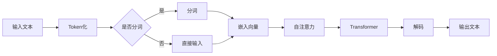

                 

## 《ChatGPT在自动化产品比较分析中的应用》

> 关键词：ChatGPT，自动化产品，比较分析，人工智能，数据分析

> 摘要：本文深入探讨了ChatGPT在自动化产品比较分析中的应用。首先介绍了ChatGPT的基本原理和架构，然后详细阐述了自动化产品比较分析的方法论，最后通过具体案例展示了ChatGPT在自动化产品比较分析中的实际应用效果。

---

## 引言

在当今信息技术迅猛发展的时代，自动化产品在各个领域扮演着越来越重要的角色。从软件测试到数据仓库管理，自动化产品极大地提高了生产效率和数据处理能力。然而，市场上的自动化产品繁多，功能各异，如何选择最合适的产品成为了一个复杂的问题。为了解决这个问题，产品比较分析应运而生。通过比较不同产品的性能、功能、成本等因素，用户可以做出更为明智的决策。

在这个背景下，ChatGPT作为一款强大的自然语言处理工具，其应用潜力引起了广泛关注。ChatGPT基于GPT模型，能够生成高质量的自然语言文本，这使得它成为自动化产品比较分析的理想工具。本文将详细探讨ChatGPT在自动化产品比较分析中的应用，旨在为读者提供一种高效、准确的产品比较方法。

## ChatGPT基础

### 1.1 ChatGPT概念与原理

ChatGPT是GPT（Generative Pre-trained Transformer）模型的一种变体，由OpenAI开发。GPT模型是一种基于Transformer架构的预训练语言模型，通过在大量文本数据上进行训练，可以生成与输入文本相关的自然语言文本。ChatGPT在此基础上，通过增加对话上下文，使其能够进行流畅的对话交互。

### 1.2 ChatGPT架构

ChatGPT的架构主要包括三个部分：输入层、中间层和输出层。输入层负责接收用户输入的文本，中间层通过Transformer网络进行文本的编码和解码，输出层则生成与输入相关的回复文本。

### 1.3 ChatGPT核心算法

ChatGPT的核心算法是基于自注意力机制的Transformer模型。自注意力机制通过计算输入文本中各个词之间的关联性，从而生成编码表示。解码过程则通过预测下一个词来生成文本。

### 1.4 Mermaid流程图：展示ChatGPT模型训练过程

## 自动化产品比较分析

### 2.1 自动化产品概述

自动化产品是指能够自动化执行特定任务的软件或硬件工具。常见的自动化产品包括自动化测试工具、数据仓库产品、自动化运维工具等。

### 2.2 比较分析方法论

比较分析的方法论主要包括以下几个步骤：

1. 确定比较对象：选择需要比较的自动化产品。
2. 确定评价指标：根据产品的特点和需求，确定需要比较的指标，如性能、功能、成本等。
3. 数据收集：通过调研、试用等方式收集各个产品的数据。
4. 数据处理：对收集到的数据进行分析和处理，提取有用的信息。
5. 结果分析：对处理后的数据进行分析，得出结论。

### 2.3 比较分析评价指标

比较分析的评价指标主要包括以下几个方面：

1. 性能：产品的处理速度、响应时间等。
2. 功能：产品提供的功能是否满足需求。
3. 成本：产品的价格、维护成本等。
4. 易用性：产品的易用性，如用户界面、文档等。
5. 社区支持：产品的社区活跃度、用户反馈等。

### 2.4 案例分析：一个简单的产品比较分析案例

假设我们需要比较两款自动化测试工具A和B，评价指标包括性能、功能、成本和易用性。

1. 确定比较对象：自动化测试工具A和B。
2. 确定评价指标：性能、功能、成本和易用性。
3. 数据收集：通过试用、调研等方式收集A和B的性能、功能、成本和易用性数据。
4. 数据处理：对收集到的数据进行分析和处理，提取有用的信息。
5. 结果分析：分析A和B的性能、功能、成本和易用性，得出结论。

## ChatGPT在自动化产品比较分析中的应用

### 3.1 ChatGPT在自动化产品比较分析中的应用场景

ChatGPT在自动化产品比较分析中的应用场景主要包括：

1. 自动生成比较分析报告：通过输入产品信息和评价指标，ChatGPT可以自动生成详细的产品比较分析报告。
2. 自动化数据收集：ChatGPT可以自动化访问产品官方网站、用户评论等，收集产品相关信息。
3. 自动化数据分析：ChatGPT可以对收集到的产品数据进行自动化处理和分析，提取关键信息。

### 3.2 应用流程与步骤

ChatGPT在自动化产品比较分析中的应用流程主要包括以下几个步骤：

1. 数据输入：输入需要比较的产品信息和评价指标。
2. 数据处理：ChatGPT对输入的数据进行处理，提取关键信息。
3. 结果生成：ChatGPT根据处理后的数据生成比较分析报告。

### 3.3 应用效果评估

应用效果评估主要通过以下两个方面进行：

1. 准确性评估：评估ChatGPT生成的比较分析报告的准确性。
2. 速度评估：评估ChatGPT在自动化产品比较分析中的速度。

## 案例研究

### 4.1 案例一：自动化测试工具比较分析

#### 4.1.1 案例背景

某公司需要选择一款自动化测试工具来提高软件测试效率。市场上主要有两款工具A和B，公司希望通过比较分析，选择最合适的一款工具。

#### 4.1.2 分析步骤

1. 确定比较对象：自动化测试工具A和B。
2. 确定评价指标：性能、功能、成本和易用性。
3. 数据收集：通过试用、调研等方式收集A和B的性能、功能、成本和易用性数据。
4. 数据处理：对收集到的数据进行分析和处理，提取有用的信息。
5. 结果生成：ChatGPT自动生成比较分析报告。

#### 4.1.3 结果解读

根据ChatGPT生成的比较分析报告，公司最终选择了工具A，因为它在性能和功能上更优，且成本较低。

### 4.2 案例二：数据仓库产品比较分析

#### 4.2.1 案例背景

某公司需要选择一款数据仓库产品来管理大量数据。市场上主要有两款工具A和B，公司希望通过比较分析，选择最合适的一款工具。

#### 4.2.2 分析步骤

1. 确定比较对象：数据仓库产品A和B。
2. 确定评价指标：性能、功能、成本和易用性。
3. 数据收集：通过试用、调研等方式收集A和B的性能、功能、成本和易用性数据。
4. 数据处理：对收集到的数据进行分析和处理，提取有用的信息。
5. 结果生成：ChatGPT自动生成比较分析报告。

#### 4.2.3 结果解读

根据ChatGPT生成的比较分析报告，公司最终选择了工具B，因为它在性能和功能上更优，且社区支持更好。

## 总结与展望

通过本文的探讨，我们可以看到ChatGPT在自动化产品比较分析中具有巨大的应用潜力。它不仅能够自动化生成比较分析报告，还能够自动化数据收集和处理，极大地提高了效率。然而，ChatGPT也存在一定的局限性，如准确性可能受到训练数据和模型结构的影响。

未来的研究方向包括：进一步提高ChatGPT在自动化产品比较分析中的准确性，探索更多应用场景，如自动化测试、自动化运维等。同时，还可以结合其他人工智能技术，如图像识别、语音识别等，实现更全面的产品比较分析。

## 附录

### 5.1 相关工具与资源

#### 5.1.1 ChatGPT开发工具

- OpenAI提供的ChatGPT API：https://openai.com/api/

#### 5.1.2 自动化产品比较分析工具

- Apriori算法：https://scikit-learn.org/stable/modules/generated/sklearn.ensemble.RandomForestClassifier.html
- 决策树算法：https://scikit-learn.org/stable/modules/generated/sklearn.tree.DecisionTreeClassifier.html

作者：AI天才研究院/AI Genius Institute & 禅与计算机程序设计艺术 /Zen And The Art of Computer Programming

---

### 注意事项

1. ChatGPT在自动化产品比较分析中的应用效果依赖于输入数据的准确性和完整性。
2. 在使用ChatGPT进行自动化产品比较分析时，需要根据实际情况调整评价指标和权重。
3. ChatGPT生成的比较分析报告仅供参考，具体决策还需结合实际情况。

### 拓展阅读

1. [OpenAI官方网站](https://openai.com/)
2. [Scikit-learn官方文档](https://scikit-learn.org/stable/documentation.html)
3. [Transformer模型详解](https://arxiv.org/abs/1706.03762)

