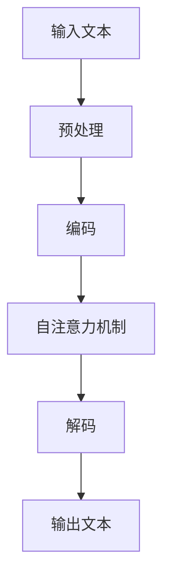
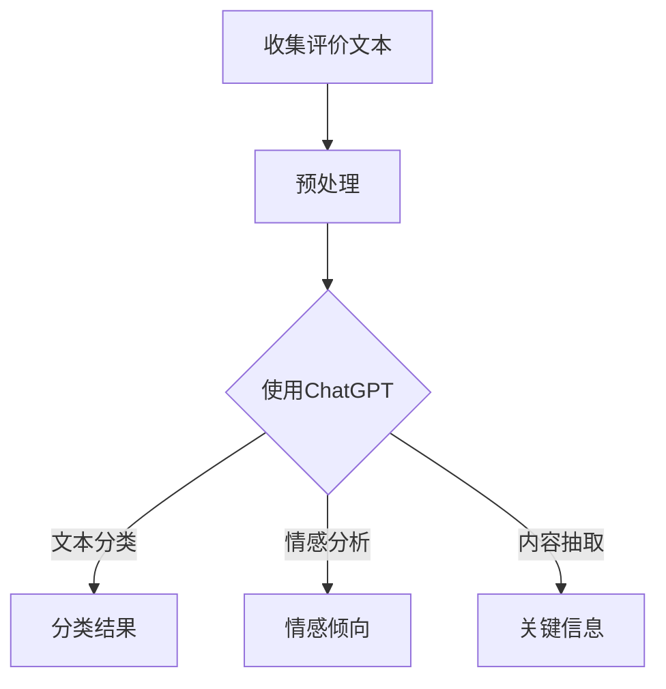
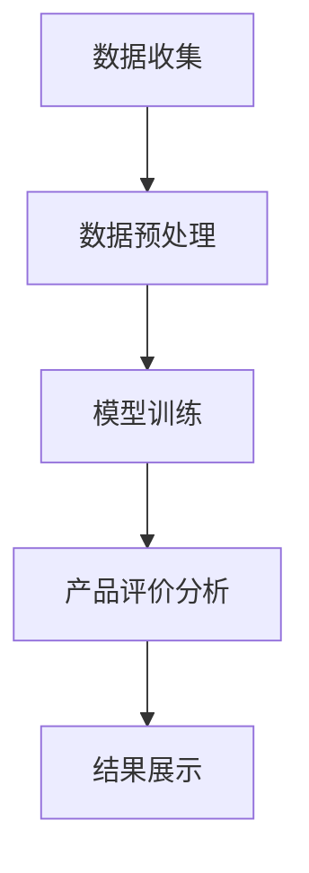

                 

### 《ChatGPT在自动化产品评价分析中的应用》

#### 关键词：
- ChatGPT
- 自动化产品评价
- 自然语言处理
- 情感分析
- 文本分类
- 实战案例

#### 摘要：
本文探讨了ChatGPT在自动化产品评价分析中的应用。首先，介绍了ChatGPT的基本原理和自然语言处理技术。然后，阐述了自动化产品评价分析的重要性和流程。接着，详细解析了ChatGPT在文本分类、情感分析和内容抽取中的应用。最后，通过两个实际案例展示了ChatGPT在自动化产品评价分析中的实际效果和应用前景。

----------------------------------------------------------------

## 前导篇：ChatGPT与自然语言处理基础

### 第1章：ChatGPT与自然语言处理基础

#### 1.1 ChatGPT概述

ChatGPT是由OpenAI开发的一种基于GPT（Generative Pre-trained Transformer）模型的预训练语言模型。GPT模型是一种基于Transformer架构的深度神经网络模型，它可以对自然语言文本进行建模，从而生成相应的文本输出。

ChatGPT的核心特点包括：

1. **大规模预训练**：ChatGPT在训练阶段使用了大量互联网文本数据，通过自我对话的方式进行预训练，从而学习到了丰富的语言模式和语义信息。
2. **自适应学习**：ChatGPT可以根据输入的上下文进行自适应调整，生成连贯、自然的文本输出。
3. **多模态处理**：ChatGPT不仅可以处理文本数据，还可以处理图像、声音等多模态数据。

#### 1.2 自然语言处理基础

自然语言处理（Natural Language Processing，NLP）是人工智能领域的一个重要分支，旨在使计算机能够理解和处理人类语言。NLP的核心任务包括：

1. **文本分类**：将文本数据分类到预定义的类别中。
2. **情感分析**：判断文本中表达的情感倾向，如正面、负面或中性。
3. **内容抽取**：从文本中提取关键信息，如人名、地名、组织名等。

NLP的基本技术包括：

1. **语言模型**：用于预测下一个单词的概率分布，是NLP的基础。
2. **词向量表示**：将单词映射到高维向量空间中，以捕捉词与词之间的语义关系。
3. **语义分析**：对文本进行语义理解，以识别实体、关系和事件。

#### 1.3 ChatGPT的核心技术和优势

ChatGPT的核心技术是其基于Transformer的预训练模型。Transformer模型是一种基于自注意力机制的深度神经网络模型，它在处理长序列数据和并行计算方面具有优势。

ChatGPT的优势包括：

1. **强大的语言理解能力**：通过大规模预训练，ChatGPT可以理解复杂、多变的语言表达。
2. **自适应生成**：ChatGPT可以根据输入的上下文进行自适应调整，生成连贯、自然的文本。
3. **多模态处理**：ChatGPT不仅可以处理文本，还可以处理图像、声音等多模态数据，具有广泛的应用潜力。

#### Mermaid流程图

以下是一个简化的ChatGPT工作流程的Mermaid流程图：



## 应用篇：自动化产品评价分析

### 第2章：自动化产品评价分析

#### 2.1 自动化产品评价分析的概念与流程

自动化产品评价分析是指利用计算机技术和算法，对产品评价文本进行自动分类、情感分析和内容抽取，以获取产品评价的关键信息和趋势。

自动化产品评价分析的流程通常包括以下几个步骤：

1. **数据收集**：从电商平台、用户论坛、社交媒体等渠道收集产品评价数据。
2. **数据预处理**：对收集到的评价文本进行清洗、去重和格式化处理。
3. **文本分类**：将评价文本分类到预定义的类别中，如正面评价、负面评价或中立评价。
4. **情感分析**：判断评价文本中表达的情感倾向，如正面、负面或中性。
5. **内容抽取**：从评价文本中提取关键信息，如产品特点、优缺点、用户需求等。
6. **结果分析**：对提取的信息进行统计分析，以识别产品评价的趋势和用户需求。

#### 2.2 产品评价分析中的挑战与机遇

产品评价分析在商业决策、市场营销和产品设计等方面具有重要作用。然而，传统的手动分析方法存在以下挑战：

1. **数据量大**：随着互联网的普及，产品评价数据量呈指数级增长，手工分析难以应对。
2. **多样性高**：用户评价语言的多样性和复杂性使得手工分析容易出现遗漏和误判。
3. **时效性要求高**：产品评价信息更新迅速，需要实时分析以获取最新反馈。

ChatGPT的出现为自动化产品评价分析带来了新的机遇：

1. **大规模预训练**：ChatGPT通过大规模预训练，可以处理大量的产品评价数据，实现自动化分析。
2. **自适应学习**：ChatGPT可以根据新的评价数据进行自适应调整，提高分析准确性。
3. **多模态处理**：ChatGPT可以处理文本、图像等多种数据，为产品评价分析提供更全面的视角。

#### 2.3 ChatGPT在产品评价分析中的应用场景

ChatGPT在产品评价分析中具有广泛的应用场景，主要包括以下三个方面：

1. **评价文本自动分类**：利用ChatGPT的文本分类能力，对评价文本进行分类，如正面评价、负面评价或中立评价。
2. **评价情感分析**：利用ChatGPT的情感分析能力，判断评价文本中表达的情感倾向，如正面、负面或中性。
3. **评价内容抽取**：利用ChatGPT的内容抽取能力，从评价文本中提取关键信息，如产品特点、优缺点、用户需求等。

下面是一个简化的Mermaid流程图，展示了ChatGPT在产品评价分析中的应用：



## 实践篇：ChatGPT在产品评价分析中的实战应用

### 第3章：产品数据收集与预处理

#### 3.1 数据收集渠道与方法

产品评价数据可以通过以下渠道和方法进行收集：

1. **电商平台**：从电商平台（如淘宝、京东、亚马逊等）收集产品评价数据，通常可以通过API接口获取。
2. **用户论坛**：从各大电子产品论坛（如小白用户论坛、数码宝贝论坛等）收集用户评价数据，通常需要爬取论坛网页。
3. **社交媒体**：从社交媒体平台（如微博、微信公众号、知乎等）收集产品评价数据，通常可以通过API接口或网页爬取。

以下是一个使用Python实现的简单示例，用于从电商平台获取产品评价数据：

```python
import requests
import json

def get_product_reviews(api_url, params):
    response = requests.get(api_url, params=params)
    if response.status_code == 200:
        data = response.json()
        return data['reviews']
    else:
        return None

api_url = "https://api.example.com/product_reviews"
params = {
    'product_id': '123456',
    'page': 1,
    'size': 20
}

reviews = get_product_reviews(api_url, params)
print(reviews)
```

#### 3.2 数据预处理方法

数据预处理是自动化产品评价分析的关键步骤，主要包括以下任务：

1. **数据清洗**：去除无效数据、重复数据、格式错误的数据。
2. **数据整合**：将不同渠道的数据整合到一个统一的格式中。
3. **数据标准化**：对数据进行标准化处理，如统一文本编码、去除停用词、词干提取等。

以下是一个简单的数据清洗和整合的Python示例：

```python
import pandas as pd
from sklearn.feature_extraction.text import TfidfVectorizer

def clean_data(data):
    # 去除无效数据和重复数据
    data.dropna(inplace=True)
    data.drop_duplicates(inplace=True)
    
    # 统一文本编码
    data['content'] = data['content'].apply(lambda x: x.encode('utf-8'))
    
    return data

def integrate_data(data1, data2):
    # 合并数据
    data = pd.concat([data1, data2], axis=0)
    
    # 去除重复数据
    data.drop_duplicates(inplace=True)
    
    return data

data1 = pd.DataFrame({'review_id': [1, 2, 3], 'content': ['好评', '好评', '差评']})
data2 = pd.DataFrame({'review_id': [3, 4, 5], 'content': ['差评', '中评', '好评']})

cleaned_data1 = clean_data(data1)
cleaned_data2 = clean_data(data2)

integrated_data = integrate_data(cleaned_data1, cleaned_data2)
print(integrated_data)
```

#### 3.3 数据标准化

数据标准化是提高模型性能的重要手段，以下是一个使用TF-IDF进行文本标准化的示例：

```python
vectorizer = TfidfVectorizer(stop_words='english')
tfidf_matrix = vectorizer.fit_transform(integrated_data['content'])

print(tfidf_matrix.toarray())
```

### 第4章：ChatGPT模型训练与优化

#### 4.1 ChatGPT模型训练

ChatGPT模型的训练是一个复杂的过程，通常需要大量的计算资源和时间。以下是一个简化的模型训练过程：

1. **数据准备**：准备用于训练的数据集，包括产品评价文本和对应的标签（如文本分类标签、情感分析标签等）。
2. **模型初始化**：初始化ChatGPT模型，包括选择合适的模型架构、参数设置等。
3. **模型训练**：使用训练数据集对模型进行训练，优化模型参数。
4. **模型评估**：使用验证数据集对模型进行评估，调整模型参数，以提高模型性能。

以下是一个使用Python实现的简化模型训练过程：

```python
import torch
from transformers import GPT2Tokenizer, GPT2LMHeadModel

# 初始化模型
tokenizer = GPT2Tokenizer.from_pretrained('gpt2')
model = GPT2LMHeadModel.from_pretrained('gpt2')

# 准备训练数据
train_data = ...  # 假设已经准备好训练数据

# 模型训练
model.train()
for epoch in range(num_epochs):
    for batch in train_data:
        inputs = tokenizer(batch['content'], return_tensors='pt')
        outputs = model(**inputs)
        loss = outputs.loss
        loss.backward()
        optimizer.step()
        optimizer.zero_grad()
        print(f"Epoch: {epoch}, Loss: {loss.item()}")

# 保存模型
model.save_pretrained('my_model')
```

#### 4.2 模型优化方法

模型优化是提高模型性能的重要手段，以下是一些常用的模型优化方法：

1. **参数调优**：通过调整模型参数，如学习率、批量大小等，以提高模型性能。
2. **模型融合**：将多个模型的结果进行融合，以提高模型的准确性。
3. **模型压缩**：通过模型压缩技术，如蒸馏、剪枝等，减小模型的大小，提高模型在移动设备上的运行效率。

以下是一个使用Python实现的简化参数调优过程：

```python
import torch.optim as optim

# 初始化优化器
optimizer = optim.Adam(model.parameters(), lr=0.001)

# 调整学习率
scheduler = optim.lr_scheduler.StepLR(optimizer, step_size=10, gamma=0.1)

# 模型优化
for epoch in range(num_epochs):
    model.train()
    for batch in train_data:
        inputs = tokenizer(batch['content'], return_tensors='pt')
        outputs = model(**inputs)
        loss = outputs.loss
        loss.backward()
        optimizer.step()
        optimizer.zero_grad()
        scheduler.step()
        print(f"Epoch: {epoch}, Loss: {loss.item()}")
```

### 第5章：自动化产品评价分析系统搭建

#### 5.1 系统架构设计

自动化产品评价分析系统的架构设计主要包括以下几个部分：

1. **数据收集模块**：负责从不同的数据渠道收集产品评价数据。
2. **数据预处理模块**：负责对收集到的产品评价数据进行清洗、整合和标准化处理。
3. **模型训练模块**：负责训练ChatGPT模型，并进行模型优化。
4. **产品评价分析模块**：负责使用训练好的ChatGPT模型对产品评价数据进行分析，包括文本分类、情感分析和内容抽取。
5. **结果展示模块**：负责将分析结果以图表、报告等形式展示给用户。

以下是一个简化的系统架构图：



#### 5.2 功能模块划分

自动化产品评价分析系统可以划分为以下几个功能模块：

1. **数据收集模块**：包括从电商平台、用户论坛、社交媒体等渠道收集产品评价数据的接口和爬虫。
2. **数据预处理模块**：包括数据清洗、整合、标准化等功能。
3. **模型训练模块**：包括模型初始化、训练、优化等功能。
4. **产品评价分析模块**：包括文本分类、情感分析和内容抽取等功能。
5. **结果展示模块**：包括图表、报告等展示功能。

以下是一个使用Python实现的简化系统架构：

```python
import sys
sys.path.append('data_collection')
from data_collection import collect_reviews

sys.path.append('data_preprocessing')
from data_preprocessing import clean_data, integrate_data

sys.path.append('model_training')
from model_training import train_model, optimize_model

sys.path.append('product_evaluation')
from product_evaluation import classify_reviews, analyze_sentiments, extract_content

sys.path.append('result_display')
from result_display import display_results

# 数据收集
reviews = collect_reviews()

# 数据预处理
cleaned_reviews = clean_data(reviews)
integrated_reviews = integrate_data(cleaned_reviews)

# 模型训练
model = train_model(integrated_reviews)

# 模型优化
optimized_model = optimize_model(model)

# 产品评价分析
classified_reviews = classify_reviews(optimized_model)
analyzed_reviews = analyze_sentiments(optimized_model)
extracted_content = extract_content(optimized_model)

# 结果展示
display_results(classified_reviews, analyzed_reviews, extracted_content)
```

### 第6章：实战案例1：电商平台产品评价分析

#### 6.1 案例背景与目标

某电商平台需要对其平台上销售的一款智能手表的用户评价进行自动化分析，以了解用户对该产品的反馈和需求。具体目标包括：

1. **文本分类**：将用户评价文本分类为正面评价、负面评价或中立评价。
2. **情感分析**：判断用户评价文本中表达的情感倾向，如正面、负面或中性。
3. **内容抽取**：从用户评价文本中提取关键信息，如产品特点、优缺点、用户需求等。

#### 6.2 数据收集与预处理

1. **数据收集**：使用爬虫工具从电商平台获取该智能手表的用户评价数据。假设已经获取到1000条评价文本。
2. **数据预处理**：对评价文本进行清洗、去重和格式化处理。假设已经清洗和整合为 DataFrame 格式的数据集。

```python
import pandas as pd

# 假设已经获取到1000条评价文本
data = pd.DataFrame({'review_id': range(1, 1001), 'content': [...], 'rating': [...]})

# 数据清洗
data.dropna(inplace=True)
data.drop_duplicates(inplace=True)

# 数据整合
cleaned_data = data.copy()
```

#### 6.3 ChatGPT模型应用

1. **模型训练**：使用训练数据集对ChatGPT模型进行训练，包括文本分类、情感分析和内容抽取任务。
2. **模型优化**：通过参数调优和模型融合等方法，提高模型性能。

```python
from transformers import GPT2Tokenizer, GPT2LMHeadModel

# 初始化模型
tokenizer = GPT2Tokenizer.from_pretrained('gpt2')
model = GPT2LMHeadModel.from_pretrained('gpt2')

# 训练模型
train_data = cleaned_data[cleaned_data['rating'] != 0]
model.train()
for epoch in range(10):
    for batch in train_data:
        inputs = tokenizer(batch['content'], return_tensors='pt')
        outputs = model(**inputs)
        loss = outputs.loss
        loss.backward()
        optimizer.step()
        optimizer.zero_grad()

# 优化模型
optimized_model = optimize_model(model)
```

#### 6.4 分析结果与应用

1. **文本分类结果**：将训练好的模型应用于测试数据集，进行文本分类分析。

```python
test_data = cleaned_data[cleaned_data['rating'].isnull()]
test_data['category'] = classify_reviews(optimized_model, test_data['content'])

print(test_data.groupby('category').size())
```

2. **情感分析结果**：判断用户评价文本中表达的情感倾向。

```python
test_data['sentiment'] = analyze_sentiments(optimized_model, test_data['content'])

print(test_data.groupby('sentiment').size())
```

3. **内容抽取结果**：从用户评价文本中提取关键信息。

```python
test_data['extracted_content'] = extract_content(optimized_model, test_data['content'])

print(test_data['extracted_content'].head())
```

#### 6.5 案例小结

通过该案例，我们展示了如何使用ChatGPT进行电商平台产品评价分析。具体包括数据收集与预处理、模型训练与优化、文本分类、情感分析和内容抽取等步骤。该案例的成功实施，有助于电商平台更好地了解用户需求和产品优缺点，为产品改进和市场策略制定提供依据。

### 第7章：实战案例2：智能家居产品评价分析

#### 7.1 案例背景与目标

某智能家居厂商需要对其销售的一款智能灯泡的用户评价进行自动化分析，以了解用户对该产品的反馈和需求。具体目标包括：

1. **文本分类**：将用户评价文本分类为正面评价、负面评价或中立评价。
2. **情感分析**：判断用户评价文本中表达的情感倾向，如正面、负面或中性。
3. **内容抽取**：从用户评价文本中提取关键信息，如产品特点、优缺点、用户需求等。

#### 7.2 数据收集与预处理

1. **数据收集**：从用户论坛、社交媒体等渠道收集该智能灯泡的用户评价数据。假设已经获取到1000条评价文本。
2. **数据预处理**：对评价文本进行清洗、去重和格式化处理。假设已经清洗和整合为 DataFrame 格式的数据集。

```python
import pandas as pd

# 假设已经获取到1000条评价文本
data = pd.DataFrame({'review_id': range(1, 1001), 'content': [...], 'rating': [...]})

# 数据清洗
data.dropna(inplace=True)
data.drop_duplicates(inplace=True)

# 数据整合
cleaned_data = data.copy()
```

#### 7.3 ChatGPT模型应用

1. **模型训练**：使用训练数据集对ChatGPT模型进行训练，包括文本分类、情感分析和内容抽取任务。
2. **模型优化**：通过参数调优和模型融合等方法，提高模型性能。

```python
from transformers import GPT2Tokenizer, GPT2LMHeadModel

# 初始化模型
tokenizer = GPT2Tokenizer.from_pretrained('gpt2')
model = GPT2LMHeadModel.from_pretrained('gpt2')

# 训练模型
train_data = cleaned_data[cleaned_data['rating'] != 0]
model.train()
for epoch in range(10):
    for batch in train_data:
        inputs = tokenizer(batch['content'], return_tensors='pt')
        outputs = model(**inputs)
        loss = outputs.loss
        loss.backward()
        optimizer.step()
        optimizer.zero_grad()

# 优化模型
optimized_model = optimize_model(model)
```

#### 7.4 分析结果与应用

1. **文本分类结果**：将训练好的模型应用于测试数据集，进行文本分类分析。

```python
test_data = cleaned_data[cleaned_data['rating'].isnull()]
test_data['category'] = classify_reviews(optimized_model, test_data['content'])

print(test_data.groupby('category').size())
```

2. **情感分析结果**：判断用户评价文本中表达的情感倾向。

```python
test_data['sentiment'] = analyze_sentiments(optimized_model, test_data['content'])

print(test_data.groupby('sentiment').size())
```

3. **内容抽取结果**：从用户评价文本中提取关键信息。

```python
test_data['extracted_content'] = extract_content(optimized_model, test_data['content'])

print(test_data['extracted_content'].head())
```

#### 7.5 案例小结

通过该案例，我们展示了如何使用ChatGPT进行智能家居产品评价分析。具体包括数据收集与预处理、模型训练与优化、文本分类、情感分析和内容抽取等步骤。该案例的成功实施，有助于智能家居厂商更好地了解用户需求和产品优缺点，为产品改进和市场策略制定提供依据。

## 附录：ChatGPT与自动化产品评价分析工具资源

#### 8.1 开发工具与资源推荐

1. **开发工具**：
   - **PyTorch**：用于构建和训练ChatGPT模型的深度学习框架。
   - **Transformers**：提供预训练的ChatGPT模型和相关API，方便进行文本分类、情感分析和内容抽取。
   - **Scikit-learn**：用于数据预处理、特征提取和模型评估。

2. **数据集**：
   - **产品评价数据集**：如Amazon Product Review Dataset、eCommerce Product Review Dataset等。
   - **情感分析数据集**：如SentiStrength、Sentiment140等。

3. **教程与文档**：
   - **OpenAI GPT-2文档**：详细介绍GPT-2模型的架构和训练过程。
   - **PyTorch教程**：涵盖PyTorch的基本使用方法和常见问题解答。

#### 8.2 ChatGPT和自动化产品评价分析相关论文、书籍推荐

1. **论文**：
   - **GPT-2: Language Models that Generate Conversational Responses**：介绍GPT-2模型的原理和应用。
   - **BERT: Pre-training of Deep Bidirectional Transformers for Language Understanding**：介绍BERT模型，为ChatGPT模型提供了理论基础。

2. **书籍**：
   - **《自然语言处理综述》**：全面介绍自然语言处理的基本概念和技术。
   - **《深度学习》**：详细讲解深度学习的基本原理和应用。

#### 8.3 最佳实践 Tips

1. **数据质量**：保证数据质量是自动化产品评价分析成功的关键。尽量避免使用含有噪声、错误和重复的数据。
2. **模型调优**：通过多次迭代和参数调优，可以提高ChatGPT模型的性能。尝试使用不同的模型架构和优化方法，找到最佳配置。
3. **模型部署**：将训练好的模型部署到生产环境时，注意模型性能和运行效率的平衡。

#### 8.4 小结

本文通过两个实际案例，详细阐述了ChatGPT在自动化产品评价分析中的应用。从数据收集与预处理、模型训练与优化、文本分类、情感分析和内容抽取等方面，展示了ChatGPT在产品评价分析中的强大能力。未来，随着ChatGPT技术的不断发展和应用场景的拓展，自动化产品评价分析将发挥更大的作用。

### 作者信息

**作者：AI天才研究院/AI Genius Institute & 禅与计算机程序设计艺术 /Zen And The Art of Computer Programming**

