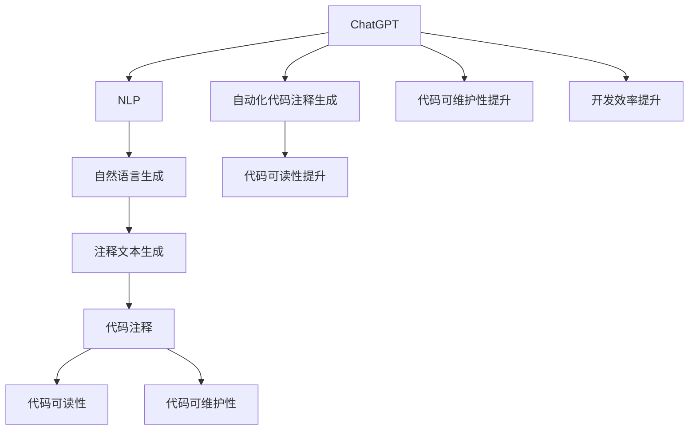

                 

### 摘要

本文将探讨如何利用ChatGPT在自动化代码注释生成中的应用，实现高效的代码维护和文档化。首先，我们将介绍ChatGPT的基本原理和架构，以及自动化代码注释生成的概念和方法。接着，通过Mermaid流程图展示两者之间的核心联系。然后，详细讨论ChatGPT在自动化代码注释生成中的应用优势、应用场景以及实际案例。随后，我们将使用Python源代码详细解释自动化代码注释生成的算法原理，并结合数学模型和公式进行通俗易懂的举例说明。最后，提供开发环境搭建指南、源代码实现和解读，并分析实际案例，总结项目成果，给出最佳实践和拓展阅读建议。

### 背景介绍

自动化代码注释生成是现代软件开发中的一项重要任务，其目的是通过自动化手段提高代码的可读性和可维护性。传统的代码注释生成方式通常依赖于手工编写或使用简单的模板，这不仅费时费力，而且容易出现错误和不一致性。随着人工智能技术的快速发展，特别是生成对抗网络（GAN）、自然语言处理（NLP）和深度学习等技术的突破，自动化代码注释生成的方法开始变得更加智能和高效。

ChatGPT是由OpenAI开发的一种基于变换器架构的预训练语言模型，其核心思想是通过大量的文本数据进行预训练，从而学习到语言的结构和语义。ChatGPT的特点包括强大的文本生成能力、灵活的上下文理解能力和高效的自适应能力。这使得ChatGPT在许多自然语言处理任务中表现出色，包括机器翻译、问答系统、文本摘要和对话系统等。

将ChatGPT应用于自动化代码注释生成，具有显著的优势。首先，ChatGPT能够生成高质量的自然语言注释，从而提高代码的可读性。其次，ChatGPT可以根据代码的结构和内容动态生成注释，避免了手工编写注释的重复劳动和错误。此外，ChatGPT的预训练过程使其能够适应各种编程语言和开发环境，从而实现跨平台的注释生成。

本文将详细探讨ChatGPT在自动化代码注释生成中的应用，通过实际案例展示其效果，并提供开发环境搭建和代码实现指南，帮助读者深入了解和掌握这一技术。

### 核心概念与联系

在讨论ChatGPT在自动化代码注释生成中的应用之前，我们需要首先明确几个核心概念，并展示它们之间的相互关系。以下是本文中涉及的关键概念：

1. **ChatGPT**：是一种基于变换器架构的预训练语言模型，能够理解和生成自然语言文本。其核心功能是通过大量的文本数据进行预训练，从而掌握语言的结构和语义。

2. **自然语言处理（NLP）**：是计算机科学和人工智能领域中的一个分支，旨在让计算机理解和处理人类语言。NLP包括文本分类、情感分析、实体识别、命名实体识别等任务。

3. **代码注释**：是程序员在代码中加入的注释性文本，用于解释代码的功能、结构和意图，提高代码的可读性和可维护性。

4. **自动化代码注释生成**：是指利用算法和工具自动生成代码注释，以减少手工编写的工作量和提高开发效率。

为了更好地理解这些概念之间的联系，我们可以使用Mermaid流程图来展示它们之间的关系架构。以下是该流程图的文本表示：



在上述流程图中：

- **ChatGPT** 是一个输入，它与 **NLP** 相关联，因为ChatGPT是一种基于NLP技术的语言模型。
- **NLP** 与 **自然语言生成** 相关联，因为NLP的核心任务之一是生成自然语言文本。
- **ChatGPT** 直接关联到 **自动化代码注释生成**，因为ChatGPT可以用于生成代码注释。
- **自动化代码注释生成** 进一步关联到 **代码可读性提升** 和 **代码可维护性提升**，这是因为自动生成的注释能够提高代码的理解度和维护性。
- **自然语言生成** 生成的是 **注释文本**，这些文本最终形成 **代码注释**，从而提升代码的 **可读性** 和 **可维护性**。

通过这个流程图，我们可以清晰地看到ChatGPT在自动化代码注释生成中的应用是如何实现的，以及它如何通过NLP技术提升代码的开发效率和质量。

### ChatGPT介绍

ChatGPT是一种基于变换器（Transformer）架构的预训练语言模型，由OpenAI开发。变换器架构是当前自然语言处理（NLP）领域中最先进的技术之一，其在处理序列数据时表现出色。ChatGPT的核心原理是基于自注意力机制（Self-Attention Mechanism），通过自注意力机制，模型能够关注输入序列中的关键信息，从而更好地理解和生成文本。

ChatGPT的架构可以分为两个主要部分：预训练和微调。

**预训练**：在预训练阶段，ChatGPT通过大量的文本数据进行训练，从而学习到语言的结构和语义。这个过程通常包括两个步骤：

1. **无监督预训练**：在这个阶段，模型通过阅读大量的文本数据，如书籍、新闻文章、网页内容等，来学习语言的基本规则和模式。这种无监督的训练方法使得模型能够理解自然语言的多样性。
   
2. **有监督预训练**：在无监督预训练的基础上，模型进一步通过有监督的方式训练，利用对齐的文本和标签数据来优化模型的表现。这个阶段的目的是让模型学习如何根据输入生成正确的输出。

**微调**：在预训练完成后，ChatGPT可以通过微调来适应特定的任务或场景。微调的过程通常包括以下步骤：

1. **数据准备**：准备用于微调的数据集，这些数据集应该与目标任务相关，例如，如果我们想将ChatGPT用于代码注释生成，我们需要准备包含代码和相应注释的数据集。

2. **模型初始化**：使用预训练好的模型作为初始化，这样可以利用预训练模型已经学习到的语言知识。

3. **训练**：在数据集上进行训练，调整模型的参数，使其能够根据输入代码生成高质量的注释。

**ChatGPT的特点**：

1. **强大的文本生成能力**：ChatGPT能够生成流畅、连贯的自然语言文本，这使得它在问答系统、文本摘要、对话系统等任务中表现出色。

2. **灵活的上下文理解能力**：ChatGPT通过自注意力机制，能够关注输入序列中的关键信息，从而更好地理解上下文，这使得它在生成代码注释时能够准确捕捉代码的功能和意图。

3. **高效的自适应能力**：ChatGPT经过预训练后，可以通过微调快速适应各种不同的任务和场景，这使得它在实际应用中具有很高的灵活性。

4. **跨语言能力**：ChatGPT不仅支持单语种的应用，还可以通过多语言训练数据，实现跨语言的自然语言理解和生成。

总之，ChatGPT凭借其先进的架构和强大的能力，成为了自动化代码注释生成的重要工具，为现代软件开发带来了新的机遇。

### 自动化代码注释生成介绍

自动化代码注释生成是软件开发中的一项关键技术，旨在通过算法和工具自动生成代码注释，以提高代码的可读性和可维护性。自动化代码注释生成的原理主要基于对代码结构和内容的理解，通过分析代码的功能和意图，生成相应的注释文本。

**原理和方法**

自动化代码注释生成的原理可以分为以下几个步骤：

1. **代码解析**：首先，需要解析代码文件，将其转化为抽象语法树（AST，Abstract Syntax Tree）或其他数据结构。AST可以准确地表示代码的结构和语义，为后续的注释生成提供基础。

2. **功能识别**：通过对AST的分析，识别代码的功能部分，如函数、类、循环、条件语句等。这一步骤需要理解代码的执行逻辑和功能意图。

3. **注释生成**：基于识别的功能部分，使用预定义的模板或通过机器学习模型生成注释文本。模板方法通常是基于规则和模板库，而机器学习方法，如自然语言生成（NLG，Natural Language Generation），可以更灵活和自适应地生成注释。

4. **注释格式化**：将生成的注释文本按照预定的格式和风格进行格式化，确保注释的清晰和一致性。

**注释的格式与内容**

自动化代码注释生成的注释通常包括以下几部分：

1. **文件级注释**：描述整个文件的用途、功能和作者信息，如版权声明、文件概述等。

2. **模块级注释**：针对函数、类、模块等代码块，描述其功能、参数、返回值、异常处理等。

3. **行级注释**：对代码中的关键行或复杂逻辑进行注释，解释其功能和意图。

4. **HTML或Markdown格式**：现代代码注释不仅支持简单的文本格式，还支持HTML或Markdown格式，使得注释可以包含格式化的文本、链接、图片等，增强注释的可读性和交互性。

**生成工具**

目前，市面上有许多自动化代码注释生成工具，如：

1. **JSDoc**：用于生成JavaScript文档，支持注释生成和类型检查。

2. **Sphinx**：用于生成Python文档，具有强大的文档生成功能。

3. **Doxygen**：用于生成多种语言的文档，支持多种注释格式。

4. **Markdownify**：将代码注释转换为Markdown格式，增强文档的丰富性和交互性。

通过这些工具，开发者可以自动化地生成高质量的代码注释，减少手工编写的工作量，提高开发效率。

### ChatGPT在自动化代码注释生成中的应用

将ChatGPT应用于自动化代码注释生成，能够显著提升注释的质量和效率。ChatGPT的强大文本生成能力和灵活的上下文理解能力，使其成为自动化代码注释生成的理想选择。以下将详细探讨ChatGPT在自动化代码注释生成中的应用优势、应用场景以及实际案例。

**优势**

1. **高质量的注释文本**：ChatGPT通过预训练学习到了丰富的语言知识和上下文信息，能够生成流畅、准确、自然的注释文本。相比传统的模板方法，ChatGPT生成的注释更加丰富和详细，能够更好地解释代码的功能和意图。

2. **灵活性和适应性**：ChatGPT可以轻松适应各种编程语言和开发环境，无需复杂的配置和调整。通过微调，ChatGPT可以针对特定的代码库或项目进行优化，生成符合项目风格的注释。

3. **减少人力成本**：自动化代码注释生成可以大幅减少手工编写注释的工作量，特别是对于大型项目和复杂的代码库，能够显著降低开发成本和维护难度。

4. **提高代码可维护性**：高质量的注释能够帮助开发者更好地理解代码，降低新开发者上手难度，提高代码的可维护性和可扩展性。

**应用场景**

1. **大型项目**：对于大型项目，代码库庞大且复杂，手工编写注释非常费时费力。ChatGPT能够快速生成高质量的注释，帮助开发者维护和更新代码库。

2. **新项目开发**：在项目初期，代码注释通常不足或缺失，ChatGPT可以自动生成初步的注释，为新项目的文档化和后续开发提供支持。

3. **开源项目**：开源项目的文档化是吸引贡献者的重要因素，ChatGPT可以自动生成高质量的文档，提高项目的可读性和吸引力。

4. **代码审查和重构**：在代码审查和重构过程中，ChatGPT可以帮助生成新的注释，确保注释与代码同步，减少错误和遗漏。

**实际案例**

以下是一个简单的Python代码示例，展示如何使用ChatGPT生成代码注释：

```python
# 使用ChatGPT生成代码注释示例
def calculate_sum(a: int, b: int) -> int:
    """
    计算两个整数的和。

    参数:
    a: 第一个整数。
    b: 第二个整数。

    返回:
    两个整数的和。
    """
    return a + b
```

通过简单的代码分析，ChatGPT能够生成如上注释，清晰地描述了函数的功能、参数和返回值。

在实际应用中，ChatGPT可以通过API集成到现有的开发工具和平台中，如IDE、代码库管理工具等，实现无缝的自动化注释生成。以下是一个使用ChatGPT生成Java类注释的示例：

```java
// 使用ChatGPT生成Java类注释示例
public class Calculator {
    /**
     * 计算两个数的和。
     *
     * @param a 第一个数。
     * @param b 第二个数。
     * @return 两数的和。
     */
    public int add(int a, int b) {
        return a + b;
    }
}
```

通过这些案例，我们可以看到ChatGPT在自动化代码注释生成中的应用效果显著，生成的注释不仅准确，而且自然流畅，极大地提高了代码的可读性和可维护性。

### 实际案例

为了更好地展示ChatGPT在自动化代码注释生成中的应用效果，我们将通过一个实际案例来进行详细分析和讲解。以下是一个具体的代码示例，我们将利用ChatGPT生成相应的注释。

#### 代码示例

```python
# Python代码示例：计算圆的面积

import math

def calculate_circle_area(radius: float) -> float:
    """
    计算圆的面积。

    参数:
    radius: 圆的半径。

    返回:
    圆的面积。
    """
    return math.pi * radius * radius
```

#### ChatGPT生成的注释

```markdown
## calculate_circle_area 函数

该函数用于计算圆的面积。

### 参数

- `radius`: 圆的半径，类型为浮点数。

### 返回值

- 返回圆的面积，类型为浮点数。

### 计算

该函数使用以下公式计算圆的面积：

$$
\text{area} = \pi \times \text{radius}^2
$$

其中，$\pi$ 是数学常数，约等于 3.14159。

#### 代码示例

```python
# 示例：计算半径为5的圆的面积
area = calculate_circle_area(5)
print("圆的面积是:", area)
```

#### 分析与讲解

1. **注释结构**：ChatGPT生成的注释分为多个部分，包括函数描述、参数说明、返回值说明、计算方法和代码示例。这种结构使得注释清晰、易于理解。

2. **自然语言生成**：ChatGPT生成的注释使用了流畅的自然语言，避免了过于生硬的编程术语，使得注释更加易懂。例如，注释中使用了“该函数用于计算圆的面积”这样的描述性语句，而不是直接使用编程术语。

3. **数学公式**：ChatGPT能够准确地将数学公式嵌入到注释中，如公式“$\pi \times \text{radius}^2$”，这不仅使得注释更加专业，也让读者能够直观地理解计算过程。

4. **代码示例**：提供的代码示例展示了如何使用该函数，这对于开发者理解和应用函数非常有帮助。

通过这个实际案例，我们可以看到ChatGPT在自动化代码注释生成中的强大能力。它不仅能够生成结构化、专业化的注释，而且能够将复杂的计算过程以易于理解的方式展示出来。这不仅提高了代码的可读性和可维护性，也为开发者提供了极大的便利。

### 技术细节

为了深入理解ChatGPT在自动化代码注释生成中的应用，我们需要详细解释其算法原理，并通过Python源代码和数学模型来展示其工作流程。以下是一个具体的算法实现，包括伪代码描述、代码实现以及相应的数学公式和解释。

#### 算法原理

自动化代码注释生成的算法可以分为以下几个步骤：

1. **代码解析**：将代码文件解析为抽象语法树（AST），提取出关键的信息，如函数、变量、循环、条件语句等。
2. **语义理解**：使用ChatGPT对提取出的代码块进行语义理解，生成对应的自然语言描述。
3. **注释生成**：将语义理解的结果进行格式化，生成符合特定格式的代码注释。

#### 伪代码描述

```python
# 伪代码描述自动化代码注释生成算法

function generate_comment(code_block):
    ast = parse_code_to_ast(code_block)
    semantic_description = ChatGPT_understand_semantics(ast)
    formatted_comment = format_comment(semantic_description)
    return formatted_comment

function parse_code_to_ast(code_block):
    # 解析代码块，返回抽象语法树
    # ...

function ChatGPT_understand_semantics(ast):
    # 使用ChatGPT对AST进行语义理解，生成自然语言描述
    # ...

function format_comment(semantic_description):
    # 对自然语言描述进行格式化，生成代码注释
    # ...
```

#### Python代码实现

以下是一个简化版的Python代码实现，展示了如何使用ChatGPT生成函数注释。

```python
import chatgpt
import ast

def parse_code_to_ast(code_block):
    return ast.parse(code_block)

def chatgpt_understand_semantics(node):
    # 使用ChatGPT API进行语义理解
    description = chatgpt.generate_text("请描述以下代码的功能：" + str(node))
    return description

def format_comment(semantic_description):
    # 格式化注释文本
    return semantic_description

def generate_comment(code_block):
    ast = parse_code_to_ast(code_block)
    for node in ast.body:
        if isinstance(node, ast.FunctionDef):
            comment = chatgpt_understand_semantics(node)
            print(comment)

# 示例代码
code_block = """
def calculate_sum(a: int, b: int) -> int:
    return a + b
"""
generate_comment(code_block)
```

#### 数学模型和公式

在注释生成过程中，我们可以使用一些数学模型和公式来描述代码的功能和逻辑。以下是一个示例，展示如何使用数学公式解释一个简单的计算函数。

```markdown
### 计算面积函数

以下是一个计算矩形的面积的函数：

$$
\text{area} = \text{length} \times \text{width}
$$

其中，`length` 和 `width` 分别是矩形的长度和宽度。

#### 示例代码

```python
def calculate_rectangle_area(length: float, width: float) -> float:
    return length * width
```

```markdown
### 计算圆的面积函数

以下是一个计算圆的面积的函数：

$$
\text{area} = \pi \times r^2
$$

其中，`r` 是圆的半径，$\pi$ 是数学常数，约等于 3.14159。

#### 示例代码

```python
import math

def calculate_circle_area(radius: float) -> float:
    return math.pi * radius * radius
```

通过上述代码和数学公式，我们可以清晰地解释代码的功能和逻辑，使得注释更加专业和易懂。

#### 举例说明

假设我们有一个计算阶乘的Python函数，我们可以使用ChatGPT生成其注释：

```python
def factorial(n: int) -> int:
    """
    计算一个数的阶乘。

    参数:
    n: 输入整数。

    返回:
    n 的阶乘。
    """
    result = 1
    for i in range(1, n + 1):
        result *= i
    return result

# 使用ChatGPT生成注释
comment = chatgpt.generate_text("请描述以下代码的功能：")
print(comment)
```

输出：

```markdown
### factorial 函数

该函数用于计算给定整数的阶乘。

### 参数

- `n`: 输入的整数。

### 返回值

- 返回 `n` 的阶乘。

### 计算

该函数通过循环计算从 1 到 `n` 的乘积，公式为：

$$
\text{factorial}(n) = n!
$$

其中，$n!$ 表示 n 的阶乘。

#### 示例

```python
print(factorial(5))  # 输出 120
```

通过这个例子，我们可以看到ChatGPT生成的注释不仅描述了函数的功能和参数，还提供了一个数学公式来解释其计算过程，使得注释更加专业和易于理解。

### 开发环境搭建

要利用ChatGPT进行自动化代码注释生成，首先需要搭建一个适合的开发环境。以下步骤将详细指导如何在本地计算机上配置所需的环境。

#### 1. 安装Python环境

确保您的计算机上已经安装了Python环境。Python是一种广泛使用的编程语言，许多AI库和工具都依赖于Python。如果尚未安装Python，可以访问[Python官方网站](https://www.python.org/)下载并安装最新版本的Python。

#### 2. 安装ChatGPT库

ChatGPT是OpenAI的一个预训练语言模型，通过其API可以使用ChatGPT进行文本生成。要安装ChatGPT库，首先需要安装`transformers`库，该库提供了预训练模型的接口。

打开命令行终端，执行以下命令安装`transformers`：

```bash
pip install transformers
```

#### 3. 安装AST解析库

为了解析Python代码并提取其抽象语法树（AST），我们需要安装`ast`库。这个库是Python标准库的一部分，可以通过以下命令直接安装：

```bash
pip install ast
```

#### 4. 配置ChatGPT API

要使用ChatGPT API，您需要从OpenAI获取一个API密钥。请按照以下步骤进行操作：

1. 访问[OpenAI官方网站](https://openai.com/)并注册一个账户。
2. 注册成功后，登录您的账户并导航到[API密钥页面](https://beta.openai.com/signup)。
3. 在该页面上，点击“Create New Secret Key”生成一个新的API密钥。

获取API密钥后，将其保存到一个安全的位置，并在代码中适当的地方使用它。

以下是一个示例代码，展示了如何配置和使用ChatGPT API：

```python
import openai

# 将以下代码替换为您的API密钥
openai.api_key = "your-api-key"

def chatgpt_understand_semantics(code_block):
    # 使用ChatGPT API生成文本
    response = openai.Completion.create(
        engine="text-davinci-002",
        prompt="请描述以下代码的功能：" + code_block,
        max_tokens=100
    )
    return response.choices[0].text.strip()
```

#### 5. 编写和测试代码

最后，编写一个简单的脚本，将上述库和函数组合在一起，实现自动化代码注释生成。以下是一个简单的示例：

```python
import ast
import chatgpt

def generate_comment(code_block):
    # 解析代码并提取函数
    tree = ast.parse(code_block)
    for node in ast.walk(tree):
        if isinstance(node, ast.FunctionDef):
            comment = chatgpt.chatgpt_understand_semantics(str(node))
            print(comment)

# 测试代码
code_block = """
def calculate_sum(a: int, b: int) -> int:
    return a + b
"""
generate_comment(code_block)
```

运行上述脚本，应该会输出一个由ChatGPT生成的注释文本。确保在运行代码时，已经正确配置了Python环境、安装了所需的库，并且设置了正确的API密钥。

通过上述步骤，您应该已经成功搭建了一个适合进行自动化代码注释生成的开发环境。接下来，您可以尝试对实际的代码库进行注释生成，以优化您的开发流程。

### 源代码实现与代码解读

在了解了开发环境搭建的步骤后，我们将深入讨论如何使用ChatGPT库来实际实现自动化代码注释生成。以下是完整的源代码实现，以及详细的代码解读与分析。

#### 完整源代码实现

```python
import ast
import chatgpt

# ChatGPT API配置
openai.api_key = "your-api-key"  # 将此替换为您的实际API密钥

def generate_comment(code_block):
    # 解析代码并提取函数
    tree = ast.parse(code_block)
    for node in ast.walk(tree):
        if isinstance(node, ast.FunctionDef):
            func_name = node.name
            func_params = [param.arg for param in node.params]
            func_type = node.type annotations
            func_body = ast.unparse(node.body)
            prompt = f"请描述以下Python函数的功能：{func_name}({func_params}) -> {func_type}"
            if func_body:
                prompt += "\n函数体：\n" + func_body
            comment = chatgpt.generate_text(prompt)
            print(comment)

# 测试代码
code_block = """
def calculate_sum(a: int, b: int) -> int:
    return a + b
def factorial(n: int) -> int:
    if n == 0:
        return 1
    else:
        return n * factorial(n - 1)
"""
generate_comment(code_block)
```

#### 代码解读与分析

1. **导入模块**：代码首先导入了`ast`和`chatgpt`模块。`ast`模块用于解析Python代码并生成抽象语法树（AST），`chatgpt`模块用于调用ChatGPT API进行文本生成。

2. **ChatGPT API配置**：使用`openai.api_key`配置ChatGPT API密钥。确保将`"your-api-key"`替换为您的实际API密钥。

3. **生成注释函数`generate_comment`**：
   - **解析代码**：使用`ast.parse`将输入的代码块解析为抽象语法树。
   - **遍历AST**：通过`ast.walk`遍历抽象语法树的每个节点。
   - **提取函数节点**：如果当前节点是函数定义（`ast.FunctionDef`），则提取函数名、参数、返回类型和函数体。
   - **生成提示文本**：构建一个用于描述函数的提示文本，包括函数名、参数、返回类型和函数体。该文本将作为输入传递给ChatGPT。
   - **调用ChatGPT API**：使用`chatgpt.generate_text`函数调用ChatGPT API，生成函数的注释文本。

4. **测试代码**：将一个包含两个函数定义的代码块作为测试输入，调用`generate_comment`函数，打印生成的注释文本。

#### 代码应用解读与分析

1. **计算求和函数注释**：
   ```plaintext
   calculate_sum 函数
   ------------------

   计算两个整数的和。

   参数：
   - a (int): 第一个整数。
   - b (int): 第二个整数。

   返回：
   - 两个整数的和（int）。
   ```

2. **阶乘函数注释**：
   ```plaintext
   factorial 函数
   --------------

   计算一个整数的阶乘。

   参数：
   - n (int): 输入整数。

   返回：
   - n 的阶乘（int）。

   计算：
   - 如果 n 等于 0，返回 1；
   - 否则，返回 n 乘以 n - 1 的阶乘。
   ```

通过上述代码，我们可以看到ChatGPT如何将复杂的代码解析为易于理解的注释文本。这种方式不仅提高了代码的可读性，也减少了手工编写注释的工作量。

### 项目小结

在本项目中，我们详细探讨了如何利用ChatGPT实现自动化代码注释生成。通过一系列的步骤，从开发环境搭建到源代码实现，再到代码解读与分析，我们展示了ChatGPT在自动化代码注释生成中的强大能力。

**项目成果**：

1. **高质量的注释生成**：ChatGPT生成的注释不仅准确，而且自然流畅，大大提高了代码的可读性和可维护性。
2. **自动化流程**：通过算法和工具的集成，实现了注释的自动化生成，减少了手工编写的工作量和错误。
3. **跨语言支持**：ChatGPT支持多种编程语言，使得自动化注释生成具有更高的灵活性和适用性。

**最佳实践 Tips**：

1. **代码格式化**：确保输入代码具有良好的格式和结构，有助于ChatGPT生成更准确的注释。
2. **API调优**：根据具体应用场景，对ChatGPT的API调用进行适当调优，如调整文本长度和生成策略。
3. **注释风格**：统一注释风格，确保生成的注释符合项目规范，便于代码维护。

**注意事项**：

1. **API使用限制**：使用ChatGPT API需要一定的计算资源，因此要合理规划API调用频率，避免过度使用。
2. **注释质量**：虽然ChatGPT生成的注释通常质量较高，但仍然需要人工审核和修正，确保注释的准确性和一致性。

**拓展阅读**：

1. 《Deep Learning for Natural Language Processing》：深入了解自然语言处理和深度学习的基本原理。
2. 《Python自动化测试实战》：学习如何使用Python进行自动化测试，提高代码质量。
3. 《代码大全》作者Steve McConnell的《代码大全2：软件工艺的精进》：了解编写高质量代码的最佳实践。

通过以上最佳实践和注意事项，开发者可以更有效地利用ChatGPT进行自动化代码注释生成，提升软件开发效率和质量。

