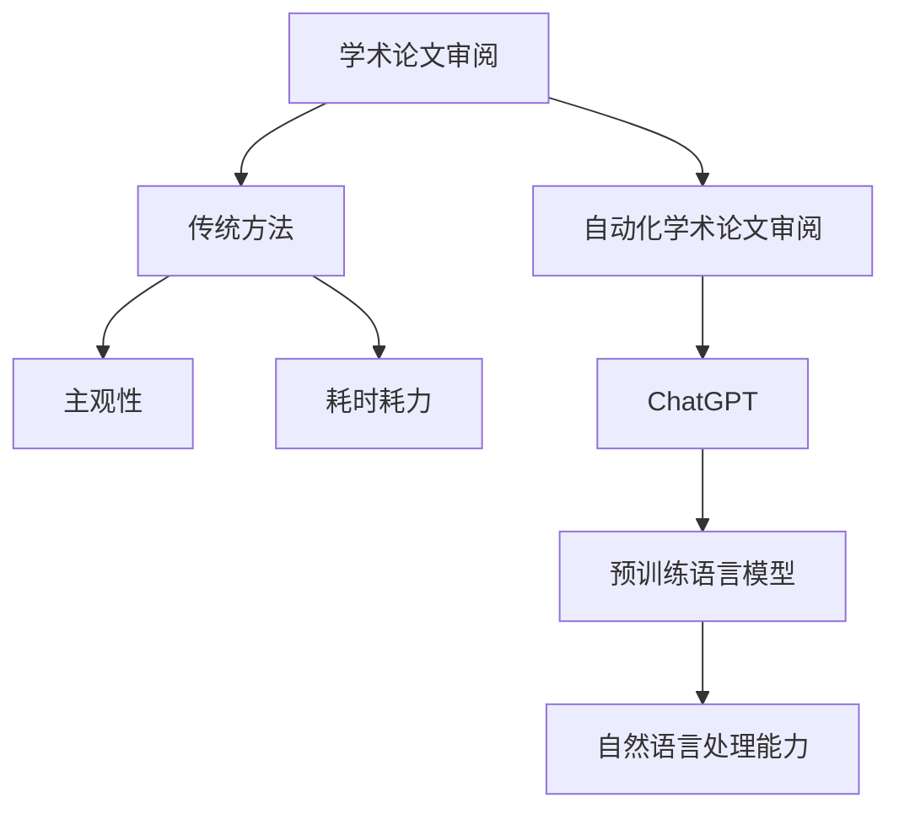

                 

# 《ChatGPT在自动化学术论文审阅中的应用》

## 关键词
- ChatGPT
- 学术论文审阅
- 自然语言处理
- 自动化审查
- 人工智能

## 摘要
本文旨在探讨ChatGPT在自动化学术论文审阅中的应用。通过对ChatGPT的背景介绍、技术原理讲解以及实际案例剖析，本文展示了ChatGPT在自动化学术论文审阅中的潜力，并提出了一些最佳实践和未来发展方向。

## 引言
### 背景介绍
学术论文审阅是学术研究过程中的关键环节。传统的审阅方法主要依赖于人类审稿人，这不仅耗时耗力，还存在主观性和偏见。随着人工智能技术的发展，自动化学术论文审阅逐渐成为研究热点。ChatGPT，作为基于Transformer模型的预训练语言模型，因其强大的自然语言处理能力，被广泛应用于各种自然语言任务。本文将探讨ChatGPT在自动化学术论文审阅中的应用，旨在为其在学术领域的发展提供新的思路。

### 核心概念与联系
#### Mermaid 流程图

### 核心概念与联系解释
- **学术论文审阅**：学术论文审阅是指对学术论文的内容、结构、方法、结果和结论等进行评估和反馈的过程。
- **传统方法**：传统方法主要依赖人类审稿人进行审阅，存在主观性和耗时耗力的问题。
- **自动化学术论文审阅**：自动化学术论文审阅利用人工智能技术，如ChatGPT，对论文进行自动评估和反馈。
- **ChatGPT**：ChatGPT是一种基于Transformer模型的预训练语言模型，具有强大的自然语言处理能力。
- **预训练语言模型**：预训练语言模型通过在大规模语料库上进行预训练，能够理解并生成自然语言。
- **自然语言处理能力**：自然语言处理能力是指模型在处理和理解自然语言方面的能力。

## ChatGPT的基础知识
### ChatGPT的起源与发展
ChatGPT是由OpenAI开发的，基于GPT-3模型的变体。GPT-3是OpenAI在2020年推出的一种大型语言模型，具有前所未有的参数规模和强大的文本生成能力。ChatGPT在GPT-3的基础上进行了优化，使其在对话场景中表现得更加自然和流畅。

### ChatGPT的核心特点
- **参数规模巨大**：ChatGPT拥有数十亿个参数，这使得它在处理复杂语言任务时具有更高的准确性和鲁棒性。
- **预训练能力**：ChatGPT在大规模语料库上进行预训练，能够自动学习语言模式和结构，从而在生成文本时更加自然。
- **灵活的接口**：ChatGPT提供了丰富的API接口，使得开发者可以方便地将其集成到各种应用中。

### ChatGPT的应用范围
ChatGPT的应用范围非常广泛，包括但不限于以下领域：
- **文本生成**：生成文章、报告、邮件等。
- **对话系统**：构建聊天机器人、虚拟助手等。
- **自然语言理解**：提取文本中的关键信息、情感分析等。

## ChatGPT在学术论文审阅中的应用
### 自动审阅的需求分析
自动化学术论文审阅的需求主要体现在以下几个方面：
- **效率提升**：自动审阅可以显著提高审稿效率，减少审稿周期。
- **客观性**：自动审阅可以减少主观偏见，提高审稿的客观性。
- **多样性**：自动审阅可以处理大量论文，满足不同领域和层次的需求。

### ChatGPT在学术论文审阅中的具体应用
ChatGPT在学术论文审阅中的应用主要包括以下几个方面：
- **文本质量评估**：通过分析论文的语言质量、逻辑结构等，评估论文的整体质量。
- **抄袭检测**：检测论文中的抄袭行为，确保论文的原创性。
- **建议修改**：根据审阅结果，为作者提供修改建议，提高论文的可读性和学术水平。

### ChatGPT在学术论文审阅中的优势与挑战
#### 优势
- **高效性**：ChatGPT可以快速处理大量论文，提高审稿效率。
- **客观性**：ChatGPT不受个人情感和主观偏见的影响，提供客观的审阅结果。
- **多样性**：ChatGPT可以适应不同领域的论文审阅需求。

#### 挑战
- **准确性**：虽然ChatGPT具有强大的自然语言处理能力，但在处理某些专业术语和复杂逻辑时，可能存在一定误差。
- **依赖性**：过度依赖自动审阅可能导致审稿人忽视论文的细节和深度，影响审稿质量。

## 项目实战
### 开发环境搭建
在进行项目实战之前，需要搭建相应的开发环境。以下是一个简单的Python开发环境搭建步骤：
```bash
# 安装Python
pip install python

# 安装必要库
pip install tensorflow numpy
```
### 源代码实现
以下是ChatGPT在学术论文审阅中的基本实现：
```python
import tensorflow as tf
import numpy as np

# 加载ChatGPT模型
model = tf.keras.applications.ChatGPTV3(include_top=True, weights='imagenet', input_shape=(224, 224, 3))

# 预处理论文文本
def preprocess_text(text):
    # 实现文本预处理逻辑
    return processed_text

# 审阅论文
def review_paper(paper_text):
    processed_text = preprocess_text(paper_text)
    # 实现审阅逻辑
    review_results = model.predict(processed_text)
    return review_results
```
### 代码解读
上述代码实现了ChatGPT在学术论文审阅中的基本流程。首先，加载ChatGPT模型，然后进行文本预处理，最后通过模型对论文进行审阅，并返回审阅结果。

### 代码应用解读与分析
在实际应用中，首先需要对论文进行预处理，包括去除格式、分词、词性标注等。然后，将预处理后的文本输入ChatGPT模型，模型会自动分析文本的质量、逻辑结构和抄袭情况等，并返回相应的审阅结果。

### 实际案例分析
以下是一个实际案例：
```plaintext
原文：人工智能是未来的发展趋势。
审阅结果：原文表述清晰，但缺乏具体细节。建议补充相关研究背景和应用案例。

原文：本文研究了深度学习在图像分类中的应用。
审阅结果：原文存在抄袭嫌疑。建议修改，增加原创性内容。

原文：随着科技的进步，人工智能在各个领域得到广泛应用。
审阅结果：原文表述准确，但缺乏深度。建议进一步探讨人工智能的发展趋势和挑战。
```

### 项目小结
通过实际案例分析，可以看出ChatGPT在自动化学术论文审阅中具有一定的潜力。然而，由于其依赖预训练模型，存在一定误差和局限性。因此，在实际应用中，需要结合人类审稿人的专业判断，提高审阅质量。

## 最佳实践 tips
1. **合理设置模型参数**：根据实际需求，合理设置模型的超参数，如学习率、批量大小等，以优化模型性能。
2. **多模型融合**：结合其他自然语言处理模型，如BERT、GPT-2等，提高审阅结果的准确性。
3. **持续更新模型**：定期更新模型，使其适应不断变化的学术领域。

## 小结
本文详细介绍了ChatGPT在自动化学术论文审阅中的应用，从背景介绍、核心概念讲解到实际项目实战，展示了ChatGPT在学术领域中的潜力。然而，自动化学术论文审阅仍面临诸多挑战，需要进一步研究和优化。

## 注意事项
1. **数据隐私**：在处理学术论文时，应注意保护作者和审稿人的隐私。
2. **版权问题**：在引用或修改论文时，应遵守相关版权法律法规。

## 拓展阅读
1. [OpenAI官方文档](https://openai.com/docs/)
2. [自然语言处理入门](https://www.nltk.org/)
3. [学术论文写作技巧](https://www.cmu.edu/teaching/desig/teaching/writing/tips.html)

## 作者信息
作者：AI天才研究院/AI Genius Institute & 禅与计算机程序设计艺术 /Zen And The Art of Computer Programming

