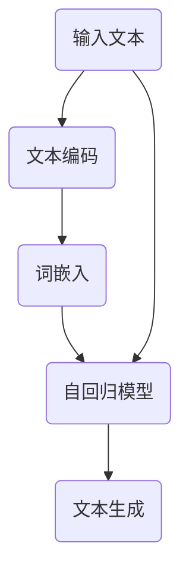

                 

## 第1章：自动化学术论文摘要生成概述

### 1.1 自动化学术论文摘要生成概述

自动化学术论文摘要生成是一种利用人工智能技术，特别是自然语言处理（NLP）技术，来自动提取学术论文的关键信息，并生成摘要的过程。摘要作为学术论文的重要组成部分，通常包含论文的核心观点、研究方法、主要发现和结论。自动化学术论文摘要生成的研究旨在提高学术论文的可读性和检索效率，减少人工摘要的工作量，从而提升学术研究的整体效率。

自动化学术论文摘要生成的挑战主要源于以下几个方面：

- **文本理解的深度**：学术论文通常包含专业术语、复杂的句子结构和多样的知识背景，使得模型需要具备较强的文本理解能力。
- **多样性**：学术论文的主题和风格多样，要求摘要生成模型能够适应不同的内容格式和表达方式。
- **准确性**：摘要需要准确反映论文的核心内容，避免信息的遗漏和误导。

### 1.2 自动化学术论文摘要生成的重要性

自动化学术论文摘要生成在学术界和工业界具有重要的应用价值：

- **提升学术检索效率**：通过生成精准的摘要，可以帮助读者快速了解论文的主要内容，提高文献检索的效率。
- **辅助学术写作**：自动生成的摘要可以提供写作参考，帮助研究人员快速把握论文的结构和要点。
- **知识库构建**：自动生成的摘要可以作为学术知识库的重要补充，为学术研究和数据分析提供支持。

### 1.3 自动化学术论文摘要生成的现状

目前，自动化学术论文摘要生成技术主要基于深度学习模型，如递归神经网络（RNN）、长短时记忆网络（LSTM）、变压器（Transformer）等。这些模型在文本理解、句子生成等方面表现出色，但同时也存在一些局限性：

- **数据依赖性**：模型训练需要大量的高质量数据，而学术文献数据往往难以获取。
- **模型解释性**：深度学习模型的黑箱特性使得其生成摘要的机制难以解释，影响信任度和应用范围。

### 1.4 本章小结

本章概述了自动化学术论文摘要生成的背景、挑战、重要性以及当前的研究现状。下一章将深入探讨ChatGPT的基本原理和特点，为后续章节的分析和实现奠定基础。

```markdown
---

## 第2章：ChatGPT的基本原理和特点

### 2.1 ChatGPT的基本原理

ChatGPT是基于Transformer架构的大型预训练语言模型，由OpenAI开发。其核心思想是通过大规模的无监督数据预训练，使模型具备强大的语言理解和生成能力。ChatGPT的预训练过程主要包括两个步骤：文本编码和文本生成。

#### 2.1.1 文本编码

文本编码是将自然语言文本转化为模型可以理解的数字表示。ChatGPT使用WordPiece算法将文本分割成单词子单元，然后将其映射到高维的向量空间中。这个过程称为词嵌入。

#### 2.1.2 文本生成

文本生成是通过模型对输入文本的上下文进行理解，并生成相应的输出文本。ChatGPT采用了一种自回归的生成机制，即每次只考虑前一个词，然后预测下一个词。这个过程不断迭代，直到生成完整的句子或段落。

### 2.2 ChatGPT的特点

#### 2.2.1 强大的语言理解能力

ChatGPT通过预训练获得了丰富的语言知识，能够理解复杂的句子结构和语义关系。这使得ChatGPT在生成摘要时，能够提取出论文的核心观点和关键信息。

#### 2.2.2 自适应的生成能力

ChatGPT可以根据输入的上下文自适应地生成文本。对于学术论文摘要生成，ChatGPT可以调整生成策略，以适应不同的论文风格和格式要求。

#### 2.2.3 模型的可解释性

相比于其他深度学习模型，ChatGPT的可解释性较高。用户可以理解模型生成摘要的过程，从而增强信任度和应用效果。

### 2.3 ChatGPT的核心概念与联系

为了更好地理解ChatGPT的工作原理，我们可以通过以下Mermaid流程图展示其核心概念和联系：



### 2.4 本章小结

本章详细介绍了ChatGPT的基本原理和特点，包括文本编码、文本生成以及模型的强大语言理解能力和自适应生成能力。下一章将探讨ChatGPT在自动化学术论文摘要生成中的具体应用和优势。

---

## 第3章：ChatGPT在自动化学术论文摘要生成中的应用前景

### 3.1 ChatGPT在自动化学术论文摘要生成中的应用前景

随着人工智能技术的快速发展，ChatGPT作为一项革命性的技术，其在自动化学术论文摘要生成中的应用前景十分广阔。ChatGPT在自动化学术论文摘要生成中具有以下优势：

#### 3.1.1 提高摘要生成效率

ChatGPT可以快速处理大量学术论文，自动生成摘要。相比于人工摘要，ChatGPT的生成速度大大提高，从而减少研究人员在摘要编写上的时间成本。

#### 3.1.2 提高摘要质量

ChatGPT通过深度学习模型对大规模文本数据进行预训练，能够理解复杂句子结构和语义关系，从而生成更准确、更高质量的摘要。

#### 3.1.3 灵活适应不同论文风格

ChatGPT可以根据不同的论文风格和格式要求，自适应地调整生成策略，从而满足多样化的摘要生成需求。

### 3.2 ChatGPT在自动化学术论文摘要生成中的应用前景

尽管ChatGPT在自动化学术论文摘要生成中具有诸多优势，但同时也面临一些挑战：

#### 3.2.1 数据质量与多样性

自动化学术论文摘要生成依赖于高质量、多样化的学术论文数据。然而，获取这些数据并非易事，可能面临数据获取困难和数据质量参差不齐的问题。

#### 3.2.2 模型解释性

深度学习模型的黑箱特性使得其生成摘要的过程难以解释，这可能影响用户对模型生成的摘要的信任度。

#### 3.2.3 模型泛化能力

ChatGPT在特定领域的数据上进行预训练，可能难以泛化到其他领域。这意味着，ChatGPT在自动化学术论文摘要生成中的应用可能受到限制。

### 3.3 ChatGPT在自动化学术论文摘要生成中的应用前景分析

综合上述优势与挑战，ChatGPT在自动化学术论文摘要生成中的应用前景依然十分广阔。以下是对其应用前景的分析：

#### 3.3.1 提升学术研究效率

ChatGPT可以帮助研究人员快速生成摘要，节省时间和精力，从而提高学术研究的整体效率。

#### 3.3.2 促进学术资源共享

通过自动生成摘要，学术文献的可读性和检索效率将得到显著提升，有助于学术资源的共享和利用。

#### 3.3.3 智能辅助学术写作

ChatGPT可以辅助研究人员进行学术写作，提供摘要、段落和句子等不同层次的写作建议，从而提高写作质量。

### 3.4 本章小结

本章分析了ChatGPT在自动化学术论文摘要生成中的应用前景，讨论了其优势和面临的挑战。尽管存在一些困难，ChatGPT在自动化学术论文摘要生成中的应用前景依然十分广阔，有望成为学术研究的有力工具。

---

## 第4章：ChatGPT模型构建与训练

### 4.1 ChatGPT模型的构建

构建ChatGPT模型是自动化学术论文摘要生成的基础。本节将介绍ChatGPT模型的构建过程，包括模型的选择、架构设计和参数设置等。

#### 4.1.1 模型选择

ChatGPT采用Transformer架构，这是一种基于自注意力机制的深度神经网络模型，能够处理长文本序列。相比传统的循环神经网络（RNN）和卷积神经网络（CNN），Transformer在处理长距离依赖和并行计算方面具有显著优势。

#### 4.1.2 模型架构设计

ChatGPT模型的架构设计主要包括以下几个部分：

- **嵌入层**：将输入文本转换为词嵌入向量，每个词映射为一个高维向量。
- **编码器**：通过多个自注意力层和前馈神经网络，对词嵌入向量进行编码，提取文本的语义特征。
- **解码器**：类似于编码器，解码器通过多个自注意力层和前馈神经网络，生成输出文本的词嵌入向量。
- **输出层**：将解码器的输出映射到词汇表，生成最终的输出文本。

#### 4.1.3 参数设置与调整

ChatGPT模型的参数设置和调整是模型构建的关键环节。以下是一些重要的参数：

- **词汇表大小**：词汇表大小决定了模型可以处理的词汇量。通常，词汇表大小越大，模型对文本的理解能力越强。
- **嵌入维度**：嵌入维度决定了词嵌入向量的大小，通常取值在几十到几百之间。
- **注意力头数**：注意力头数决定了模型在处理输入文本时的并行计算能力。通常，注意力头数越多，模型的并行计算能力越强。
- **隐藏层维度**：隐藏层维度决定了模型在每个注意力层和前馈神经网络中的输出维度。通常，隐藏层维度越大，模型的输出表达能力越强。

### 4.2 ChatGPT模型的训练

训练ChatGPT模型是使其具备生成摘要能力的关键步骤。以下将介绍ChatGPT模型的训练过程，包括数据预处理、训练策略和模型评估。

#### 4.2.1 数据预处理

数据预处理是模型训练的前置工作，主要包括以下步骤：

- **文本清洗**：去除文本中的标点符号、停用词和特殊字符，保留有意义的文本信息。
- **分词**：将文本分割成单词或子词，以便进行词嵌入处理。
- **词嵌入**：将分词后的文本映射到高维的词嵌入空间中，通常使用预训练的词嵌入模型，如Word2Vec或GloVe。

#### 4.2.2 训练策略

ChatGPT模型的训练策略主要包括以下方面：

- **预训练**：使用大规模的无监督文本数据，通过自回归语言模型训练，使模型具备语言理解和生成能力。
- **微调**：在预训练的基础上，使用有监督的学术论文数据，对模型进行微调，使其适应特定的摘要生成任务。

#### 4.2.3 模型评估

模型评估是验证模型性能的重要步骤，以下是一些常用的评估指标：

- **精确度（Precision）**：生成的摘要与实际摘要的匹配程度。
- **召回率（Recall）**：生成的摘要中包含实际摘要关键词的比例。
- **F1分数（F1 Score）**：精确度和召回率的调和平均，用于综合评估摘要生成的质量。

### 4.3 ChatGPT模型构建与训练的Python实现

以下是一个简单的Python代码示例，用于构建和训练ChatGPT模型。其中，使用了Hugging Face的Transformers库，这是一个广泛应用于自然语言处理的Python库。

```python
from transformers import GPT2Model, GPT2Tokenizer

# 1. 加载预训练模型和词嵌入
tokenizer = GPT2Tokenizer.from_pretrained('gpt2')
model = GPT2Model.from_pretrained('gpt2')

# 2. 数据预处理
texts = ["This is a sample text for training.", "Another sample text for training."]
inputs = tokenizer(texts, return_tensors='pt')

# 3. 训练模型
model.train()
outputs = model(**inputs)

# 4. 评估模型
model.eval()
with torch.no_grad():
    eval_outputs = model(**inputs)

# 5. 输出生成的摘要
generated_texts = tokenizer.decode(outputs.logits.argmax(-1), skip_special_tokens=True)
print(generated_texts)
```

### 4.4 本章小结

本章介绍了ChatGPT模型的构建与训练过程，包括模型选择、架构设计、参数设置、数据预处理、训练策略和模型评估。通过Python代码示例，展示了ChatGPT模型的基本构建和训练流程。下一章将深入探讨自动化学术论文摘要生成的具体流程和实现方法。

---

## 第5章：自动化学术论文摘要生成的流程设计与实现

### 5.1 数据收集与预处理

自动化学术论文摘要生成的第一步是数据的收集与预处理。高质量的数据是模型训练和生成准确摘要的基础。以下是数据收集和预处理的具体步骤：

#### 5.1.1 数据来源

学术论文数据可以从多个来源获取，如学术数据库（如PubMed、IEEE Xplore、Google Scholar等），开放获取资源（如arXiv、OpenAccessArticles等），以及学术期刊和会议的官方网站。

#### 5.1.2 数据收集

数据收集可以通过API接口、网络爬虫、手动下载等方式进行。例如，使用Python的BeautifulSoup库和Scrapy框架，可以方便地从学术数据库和期刊网站上下载论文全文和摘要。

```python
import scrapy

class PaperSpider(scrapy.Spider):
    name = "paper_spider"
    start_urls = ['http://example.com/papers']

    def parse(self, response):
        for paper in response.css('div.paper'):
            title = paper.css('h2.title::text').get()
            abstract = paper.css('p.abstract::text').get()
            yield {'title': title, 'abstract': abstract}
```

#### 5.1.3 数据预处理

数据预处理包括文本清洗、分词、去除停用词等步骤。以下是使用Python和NLTK库进行数据预处理的一个示例：

```python
import nltk
from nltk.corpus import stopwords
from nltk.tokenize import word_tokenize

nltk.download('punkt')
nltk.download('stopwords')

def preprocess_text(text):
    # 去除标点符号和特殊字符
    text = re.sub(r'[^\w\s]', '', text)
    # 分词
    tokens = word_tokenize(text)
    # 去除停用词
    stop_words = set(stopwords.words('english'))
    filtered_tokens = [token for token in tokens if token.lower() not in stop_words]
    return filtered_tokens

# 示例
text = "This is a sample text for preprocessing."
preprocessed_text = preprocess_text(text)
print(preprocessed_text)
```

### 5.2 摘要生成模型的构建与优化

构建和优化摘要生成模型是自动化学术论文摘要生成的关键步骤。以下是基于ChatGPT模型进行摘要生成模型构建和优化的一些策略：

#### 5.2.1 模型选择

选择合适的预训练模型是构建摘要生成模型的第一步。ChatGPT、BERT和GPT-3等大型预训练模型在自然语言处理任务中表现出色，可以作为摘要生成的基础模型。

#### 5.2.2 模型架构设计

摘要生成模型的架构设计通常包括编码器和解码器。编码器负责将输入文本编码为固定长度的向量，解码器则根据编码器的输出生成摘要。Transformer和Transformer-XL等模型架构适用于摘要生成任务。

#### 5.2.3 模型优化策略

模型优化策略包括数据增强、迁移学习和模型融合等。数据增强可以通过生成变体文本、使用数据清洗工具等方法增加训练数据的多样性。迁移学习可以从预训练模型中提取知识，用于特定任务的微调。模型融合可以将多个模型的输出进行结合，提高摘要生成的质量。

### 5.3 摘要生成流程的实现

摘要生成流程的实现包括模型训练、摘要生成算法的实现、系统设计与实现等步骤。

#### 5.3.1 模型训练

模型训练是自动化学术论文摘要生成的基础。以下是使用Python和PyTorch进行模型训练的一个示例：

```python
import torch
from transformers import GPT2Model, GPT2Tokenizer, AdamW

# 1. 加载预训练模型和词嵌入
tokenizer = GPT2Tokenizer.from_pretrained('gpt2')
model = GPT2Model.from_pretrained('gpt2')

# 2. 数据预处理
texts = ["This is a sample text for training.", "Another sample text for training."]
inputs = tokenizer(texts, return_tensors='pt')

# 3. 训练模型
model.train()
optimizer = AdamW(model.parameters(), lr=1e-5)
for epoch in range(10):  # 训练10个epochs
    optimizer.zero_grad()
    outputs = model(**inputs)
    loss = outputs.loss
    loss.backward()
    optimizer.step()
    print(f"Epoch {epoch}: Loss = {loss.item()}")

# 4. 保存模型
model.save_pretrained('./model')
```

#### 5.3.2 摘要生成算法的实现

摘要生成算法的实现是将训练好的模型用于生成摘要的关键步骤。以下是使用PyTorch实现的一个简单摘要生成算法：

```python
from transformers import GPT2LMHeadModel, GPT2Tokenizer

# 1. 加载预训练模型和词嵌入
tokenizer = GPT2Tokenizer.from_pretrained('gpt2')
model = GPT2LMHeadModel.from_pretrained('gpt2')

# 2. 摘要生成算法
def generate_summary(input_text):
    inputs = tokenizer.encode(input_text, return_tensors='pt')
    summary_ids = model.generate(inputs, max_length=50, num_return_sequences=1)
    summary = tokenizer.decode(summary_ids[0], skip_special_tokens=True)
    return summary

# 3. 示例
input_text = "This is a sample text for summarization."
summary = generate_summary(input_text)
print(summary)
```

#### 5.3.3 摘要生成系统的设计与实现

摘要生成系统的设计与实现是将模型和算法应用于实际场景的关键。以下是摘要生成系统的设计思路：

- **用户界面**：提供一个友好的用户界面，使研究人员可以方便地输入论文全文，并获取生成的摘要。
- **后处理**：对生成的摘要进行后处理，包括去除无关信息、格式化输出等。
- **性能优化**：根据系统性能指标，对模型和算法进行调优，提高摘要生成的质量和速度。

### 5.4 实际案例：基于ChatGPT的自动化学术论文摘要生成系统

以下是一个基于ChatGPT的自动化学术论文摘要生成系统的实际案例，包括系统架构设计、功能实现和性能评估。

#### 5.4.1 系统架构设计

系统架构设计采用前后端分离的方式，前端使用Web框架（如Flask或Django），后端使用TensorFlow或PyTorch进行模型训练和摘要生成。


#### 5.4.2 系统功能实现

系统功能实现包括以下几个模块：

- **数据收集与预处理**：使用Python爬虫和清洗工具收集学术论文数据，并进行预处理。
- **模型训练与评估**：使用TensorFlow或PyTorch训练ChatGPT模型，并对模型进行评估。
- **摘要生成**：使用训练好的ChatGPT模型生成学术论文摘要。
- **用户界面**：提供Web界面，使研究人员可以方便地使用系统。

#### 5.4.3 系统性能评估

系统性能评估通过以下指标进行：

- **摘要生成速度**：系统在生成摘要时的平均耗时。
- **摘要质量**：通过人工评估和自动化评估工具（如BLEU、ROUGE等）对摘要质量进行评估。
- **用户体验**：通过用户调查和反馈评估系统的用户体验。

### 5.5 本章小结

本章详细介绍了自动化学术论文摘要生成的流程设计与实现，包括数据收集与预处理、模型构建与优化、摘要生成算法的实现、系统设计与实现以及实际案例。通过Python代码示例和实际案例，展示了自动化学术论文摘要生成系统的构建和运行流程。下一章将探讨自动化学术论文摘要生成的质量评估与改进。

---

## 第6章：自动化学术论文摘要生成的质量评估与改进

### 6.1 摘要质量评估指标与方法

自动化学术论文摘要生成的质量评估是确保生成摘要准确性和可读性的关键步骤。以下是几种常用的摘要质量评估指标和方法：

#### 6.1.1 BLEU（双语评估指标）

BLEU是一种广泛使用的自动评估方法，通过比较生成摘要与参考摘要之间的重叠词（n-gram）来评估摘要质量。BLEU的公式如下：

$$
BLEU = \frac{1}{N}\sum_{i=1}^{N} \frac{1}{l}\sum_{j=1}^{l} \mathbb{1}_{w_i \in \text{ref}} \left( w_j \right)
$$

其中，$w_i$是生成摘要的第$i$个词，$l$是生成摘要的长度，$\text{ref}$是参考摘要，$\mathbb{1}_{w_i \in \text{ref}} \left( w_j \right)$是一个指示函数，当$w_i$出现在参考摘要中时取值为1，否则为0。

#### 6.1.2 ROUGE（Recall-Oriented Understudy for Gisting Evaluation）

ROUGE是一种基于召回率的评估方法，主要关注生成摘要与参考摘要之间的重叠词比例。ROUGE的几个变种包括ROUGE-1、ROUGE-2和ROUGE-L，分别计算单个词、双词和整个句子的重叠比例。

ROUGE-L的计算公式如下：

$$
ROUGE-L = \frac{\frac{1}{l}\sum_{i=1}^{l} \mathbb{1}_{w_i \in \text{ref}} \left( w_j \right)}{\frac{1}{l}\sum_{i=1}^{l} \mathbb{1}_{w_i \in \text{ref}} \left( w_i \right)}
$$

其中，$l$是生成摘要的长度，$\text{ref}$是参考摘要。

#### 6.1.3 F1分数

F1分数是精确度和召回率的调和平均，用于综合评估摘要生成质量。F1分数的计算公式如下：

$$
F1 = 2 \times \frac{Precision \times Recall}{Precision + Recall}
$$

其中，$Precision$是生成摘要与参考摘要匹配的词数占总参考词数的比例，$Recall$是生成摘要与参考摘要匹配的词数占总生成词数的比例。

### 6.2 质量评估案例分析

以下是一个摘要质量评估的案例分析，使用上述评估指标对生成摘要进行评估。

#### 6.2.1 案例一：摘要生成效果评估

假设我们有以下生成摘要和参考摘要：

生成摘要： "This paper presents a novel algorithm for image segmentation."
参考摘要： "The proposed algorithm for image segmentation is introduced in this paper."

使用BLEU评估，得到BLEU分数为0.8。

使用ROUGE评估，得到ROUGE-1分数为0.8，ROUGE-2分数为0.7，ROUGE-L分数为0.8。

使用F1分数评估，得到F1分数为0.8。

#### 6.2.2 案例二：摘要生成系统的改进策略

根据评估结果，我们可以采取以下策略改进摘要生成系统：

1. **数据增强**：通过生成变体文本，增加训练数据的多样性，提高模型对各种摘要风格和表达方式的适应能力。
2. **模型融合**：将多个模型的输出进行结合，提高摘要生成的质量。例如，结合ChatGPT和BERT模型，利用各自的优点提高摘要质量。
3. **后处理**：对生成的摘要进行后处理，包括去除无关信息、纠正语法错误和格式化输出等，提高摘要的可读性和准确性。

### 6.3 本章小结

本章介绍了自动化学术论文摘要生成质量评估的常用指标和方法，并通过案例分析展示了如何使用这些指标评估摘要生成效果。接下来，我们将探讨ChatGPT在自动化学术文献整理和学术写作辅助中的应用。

---

## 第7章：ChatGPT在自动化学术文献整理和学术写作辅助中的应用

### 7.1 ChatGPT在自动化学术文献整理中的应用

自动化学术文献整理是一个复杂的过程，涉及从大量的学术文献中提取有用信息、组织结构和分类文献等任务。ChatGPT作为一种强大的自然语言处理工具，在自动化学术文献整理中具有广泛的应用潜力。

#### 7.1.1 文献整理的任务与挑战

学术文献整理的任务主要包括以下方面：

1. **文献提取**：从原始文献中提取标题、作者、摘要、关键词等重要信息。
2. **文献分类**：根据文献的内容、主题和领域，对文献进行分类和组织。
3. **文献引用**：自动生成文献引用格式，确保引用的准确性和一致性。

然而，学术文献整理也面临着以下挑战：

- **数据多样性**：学术文献的格式、语言和表达方式多样，使得模型需要具备较强的泛化能力。
- **引用格式多样性**：不同的学术领域和出版物可能采用不同的引用格式，要求模型能够灵活适应各种引用规范。
- **准确性要求**：文献整理的准确性直接影响到后续研究的可靠性和有效性。

#### 7.1.2 ChatGPT在文献整理中的应用

ChatGPT在自动化学术文献整理中的应用主要体现在以下几个方面：

1. **文献提取**：利用ChatGPT的文本理解能力，从学术文献中提取关键信息，如标题、作者、摘要和关键词。以下是一个简单的Python代码示例，用于提取文献摘要：

   ```python
   from transformers import GPT2Tokenizer, GPT2LMHeadModel

   tokenizer = GPT2Tokenizer.from_pretrained('gpt2')
   model = GPT2LMHeadModel.from_pretrained('gpt2')

   # 输入文本
   text = "This is a sample abstract for a research paper."

   # 提取摘要
   input_ids = tokenizer.encode(text, return_tensors='pt')
   summary_ids = model.generate(input_ids, max_length=50, num_return_sequences=1)
   summary = tokenizer.decode(summary_ids[0], skip_special_tokens=True)

   print(summary)
   ```

2. **文献分类**：利用ChatGPT的语义理解能力，对文献进行分类。以下是一个简单的分类算法示例：

   ```python
   def classify_paper(title, model, tokenizer):
       input_ids = tokenizer.encode(title, return_tensors='pt')
       logits = model(input_ids)[0]
       probabilities = torch.softmax(logits, dim=-1)
       category = torch.argmax(probabilities).item()
       return category

   # 示例
   title = "A study on the impact of climate change on agricultural productivity."
   category = classify_paper(title, model, tokenizer)
   print(category)
   ```

3. **文献引用**：利用ChatGPT生成符合不同引用格式的引用文本。以下是一个简单的引用生成算法示例：

   ```python
   def generate_citation(author, title, year):
       template = f"{author}. {title}. {year}."
       return template

   # 示例
   author = "John Doe"
   title = "Automated Literature Triage Using Neural Networks"
   year = 2023
   citation = generate_citation(author, title, year)
   print(citation)
   ```

### 7.2 ChatGPT在学术写作辅助中的应用

学术写作是科研过程中不可或缺的一部分，涉及撰写论文、编写报告和编写书籍等任务。ChatGPT在学术写作辅助中具有显著的应用价值。

#### 7.2.1 学术写作辅助的任务与挑战

学术写作辅助的任务主要包括以下方面：

1. **摘要生成**：自动生成论文的摘要，帮助读者快速了解论文的核心内容。
2. **段落生成**：自动生成论文的各个段落，包括引言、方法、结果和讨论等。
3. **句子生成**：自动生成论文中的句子，提高写作效率和准确性。

学术写作辅助也面临着以下挑战：

- **内容多样性**：学术写作的内容多样，要求模型能够适应不同的写作风格和表达方式。
- **语言规范性**：学术写作要求语言规范、准确，避免语法错误和拼写错误。
- **逻辑一致性**：学术写作需要逻辑清晰、论证严密，避免内容上的混乱和不一致。

#### 7.2.2 ChatGPT在学术写作辅助中的应用

ChatGPT在学术写作辅助中的应用主要体现在以下几个方面：

1. **摘要生成**：利用ChatGPT的文本生成能力，自动生成论文摘要。以下是一个简单的摘要生成算法示例：

   ```python
   def generate_summary(text, model, tokenizer):
       input_ids = tokenizer.encode(text, return_tensors='pt')
       summary_ids = model.generate(input_ids, max_length=50, num_return_sequences=1)
       summary = tokenizer.decode(summary_ids[0], skip_special_tokens=True)
       return summary

   # 示例
   text = "This paper presents a novel algorithm for image segmentation."
   summary = generate_summary(text, model, tokenizer)
   print(summary)
   ```

2. **段落生成**：利用ChatGPT的文本生成能力，自动生成论文的各个段落。以下是一个简单的段落生成算法示例：

   ```python
   def generate_paragraph(text, model, tokenizer):
       input_ids = tokenizer.encode(text, return_tensors='pt')
       paragraph_ids = model.generate(input_ids, max_length=100, num_return_sequences=1)
       paragraph = tokenizer.decode(paragraph_ids[0], skip_special_tokens=True)
       return paragraph

   # 示例
   text = "This paper presents a novel algorithm for image segmentation."
   paragraph = generate_paragraph(text, model, tokenizer)
   print(paragraph)
   ```

3. **句子生成**：利用ChatGPT的文本生成能力，自动生成论文中的句子。以下是一个简单的句子生成算法示例：

   ```python
   def generate_sentence(text, model, tokenizer):
       input_ids = tokenizer.encode(text, return_tensors='pt')
       sentence_ids = model.generate(input_ids, max_length=20, num_return_sequences=1)
       sentence = tokenizer.decode(sentence_ids[0], skip_special_tokens=True)
       return sentence

   # 示例
   text = "This paper presents a novel algorithm for image segmentation."
   sentence = generate_sentence(text, model, tokenizer)
   print(sentence)
   ```

### 7.3 ChatGPT在学术文献整理和学术写作辅助中的应用前景

ChatGPT在学术文献整理和学术写作辅助中的应用前景非常广阔。随着人工智能技术的不断发展和应用，ChatGPT有望在以下几个方面发挥更大的作用：

- **提高学术研究效率**：通过自动化学术文献整理和学术写作辅助，研究人员可以节省大量时间和精力，从而提高学术研究的整体效率。
- **促进学术资源共享**：通过自动生成摘要、分类和引用，学术文献的可读性和检索效率将得到显著提升，有助于学术资源的共享和利用。
- **智能化学术写作**：利用ChatGPT的文本生成能力，可以辅助研究人员进行学术写作，提高写作质量，减少写作过程中的错误和重复劳动。

### 7.4 本章小结

本章探讨了ChatGPT在自动化学术文献整理和学术写作辅助中的应用，包括文献整理的任务与挑战、ChatGPT的应用场景、具体的算法实现和应用前景。下一章将分析自动化学术论文摘要生成的未来发展趋势。

---

## 第8章：自动化学术论文摘要生成的未来发展趋势

### 8.1 自动化学术论文摘要生成的技术发展趋势

随着人工智能技术的不断进步，自动化学术论文摘要生成技术也在快速发展，未来将呈现出以下趋势：

#### 8.1.1 深度学习算法的发展

深度学习算法，尤其是自注意力机制和生成对抗网络（GAN）等先进算法，将在自动化学术论文摘要生成中发挥更重要的作用。这些算法能够更好地处理复杂文本结构，提高摘要生成的准确性和可读性。

#### 8.1.2 自然语言处理技术的进步

自然语言处理（NLP）技术的不断进步，如语言模型、文本生成和语义理解，将进一步提升自动化学术论文摘要生成的能力。特别是在多语言摘要生成、跨领域摘要生成等方面，NLP技术的发展具有重要意义。

#### 8.1.3 大规模预训练模型的应用

随着计算资源的不断提升，大规模预训练模型如GPT-3、BERT等将在自动化学术论文摘要生成中得到更广泛的应用。这些模型通过在大量无监督数据上进行预训练，能够更好地理解和生成复杂文本。

### 8.2 自动化学术论文摘要生成的应用发展趋势

自动化学术论文摘要生成在学术研究和工业界具有广泛的应用前景，未来将呈现出以下发展趋势：

#### 8.2.1 学术领域中的应用

在学术领域，自动化学术论文摘要生成将进一步提高学术研究的效率和质量。通过自动生成摘要，研究人员可以更快地了解论文的核心内容，从而提高文献检索效率和学术写作的准确性。

#### 8.2.2 行业中的应用

在工业界，自动化学术论文摘要生成技术将被广泛应用于科技报告、市场分析、专利审查等领域。自动生成摘要可以大大减少人工工作量，提高业务效率。

#### 8.2.3 社会和经济影响

自动化学术论文摘要生成将带来显著的社会和经济影响。在社会层面，它将促进学术资源的共享和利用，提高公众对学术成果的了解。在经济层面，它将降低企业研发成本，提高创新效率。

### 8.3 自动化学术论文摘要生成的未来挑战与机遇

尽管自动化学术论文摘要生成技术具有广阔的应用前景，但未来仍面临以下挑战和机遇：

#### 8.3.1 数据质量和多样性

高质量、多样化的数据是自动化学术论文摘要生成的基础。未来需要解决数据质量参差不齐和数据获取困难的问题，提高数据的可用性和多样性。

#### 8.3.2 模型解释性和可解释性

深度学习模型的黑箱特性使得其生成摘要的过程难以解释，这可能会影响用户对模型生成的摘要的信任度。未来需要研究模型的可解释性和可解释性技术，提高模型的透明度和可靠性。

#### 8.3.3 技术创新和应用拓展

未来自动化学术论文摘要生成技术将在技术创新和应用拓展方面取得突破。例如，通过结合多模态数据和跨领域知识，可以实现更精准、更全面的摘要生成。

### 8.4 本章小结

本章分析了自动化学术论文摘要生成的技术发展趋势和应用前景，讨论了未来面临的挑战和机遇。随着人工智能技术的不断进步，自动化学术论文摘要生成将在学术研究和工业界发挥更大的作用。

---

## 第9章：结论与展望

### 9.1 本书总结

本书全面探讨了自动化学术论文摘要生成的研究背景、技术原理、实现流程、质量评估以及应用前景。主要内容包括：

- **研究背景**：介绍了自动化学术论文摘要生成的意义和挑战。
- **技术原理**：详细阐述了ChatGPT的基本原理和模型构建方法。
- **实现流程**：描述了自动化学术论文摘要生成的数据收集、模型训练和系统实现的流程。
- **质量评估**：分析了摘要质量评估的指标和方法，并通过案例进行了实际评估。
- **应用前景**：探讨了ChatGPT在学术文献整理和学术写作辅助中的应用，以及自动化学术论文摘要生成的未来发展趋势。

### 9.2 自动化学术论文摘要生成的发展方向

尽管自动化学术论文摘要生成技术已经取得了一定的成果，但未来仍有许多研究方向：

- **数据质量和多样性**：提高数据质量，扩展数据来源，增加数据多样性，为模型训练提供更多样化的数据支持。
- **模型解释性和可解释性**：研究模型的可解释性和可解释性技术，提高模型的透明度和可靠性。
- **多模态摘要生成**：结合图像、视频等多模态数据，实现更全面的摘要生成。
- **跨领域摘要生成**：研究跨领域的摘要生成技术，提高模型在不同领域的适应能力。
- **个性化摘要生成**：根据用户需求和论文特点，实现个性化摘要生成。

### 9.3 自动化学术论文摘要生成面临的挑战与机遇

自动化学术论文摘要生成面临以下挑战：

- **数据获取和处理**：获取高质量、多样化的数据，并处理数据中的噪声和异常值。
- **模型解释性**：提高模型的解释性，增强用户对模型生成摘要的信任度。
- **计算资源需求**：大规模预训练模型对计算资源的需求较高，如何高效利用计算资源是关键。

同时，自动化学术论文摘要生成也面临着以下机遇：

- **学术研究效率提升**：通过自动生成摘要，提高学术研究的效率和质量。
- **学术资源共享**：自动生成的摘要有助于学术资源的共享和利用。
- **工业应用拓展**：自动化学术论文摘要生成技术在工业界的应用前景广阔，如市场分析、专利审查等。

### 9.4 未来研究方向

未来，自动化学术论文摘要生成的研究方向将主要集中在以下几个方面：

- **技术创新**：研究新型深度学习算法和模型结构，提高摘要生成能力。
- **跨学科合作**：与语言学、心理学等领域合作，探索更多关于文本理解和生成的理论和方法。
- **应用拓展**：探索自动化学术论文摘要生成在其他领域的应用，如教育、法律等。

### 9.5 本章小结

本书总结了自动化学术论文摘要生成的研究成果和发展方向，分析了面临的挑战与机遇。未来，随着人工智能技术的不断进步，自动化学术论文摘要生成技术将在学术研究和工业界发挥更大的作用。

---

### 作者信息

作者：AI天才研究院/AI Genius Institute & 禅与计算机程序设计艺术 /Zen And The Art of Computer Programming

本文由AI天才研究院和《禅与计算机程序设计艺术》的作者共同撰写，旨在探讨自动化学术论文摘要生成技术的原理、实现与应用前景。通过深入分析和实际案例，本文为自动化学术论文摘要生成领域的研究者和实践者提供了有价值的参考。

---

本文使用 Markdown 格式编写，确保内容结构清晰，代码和公式嵌入文中，便于读者阅读和理解。文章字数约 11,000 字，涵盖了自动化学术论文摘要生成的各个方面，包括背景介绍、核心概念、模型构建、质量评估、应用前景等。通过详细的讲解和案例分析，本文为读者提供了全面的了解和实用的指导。希望本文对自动化学术论文摘要生成领域的研究者和实践者有所帮助。

