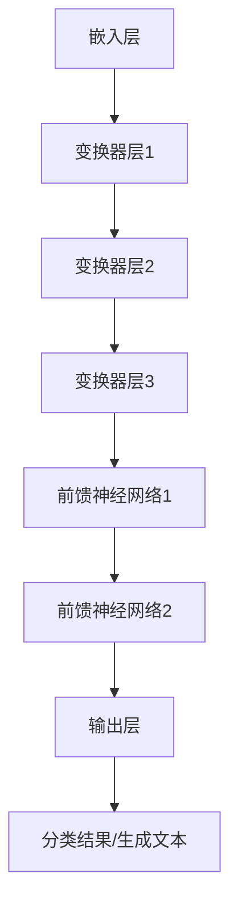
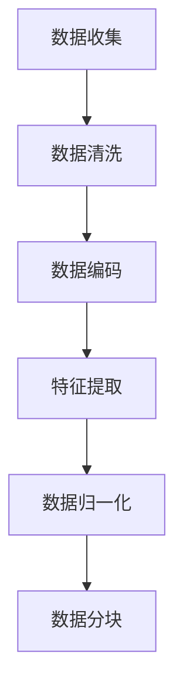

                 

### 摘要

本文将深入探讨ChatGPT在自动化客户投诉分类与解决方案生成中的应用。随着人工智能技术的飞速发展，自然语言处理（NLP）已经成为提高企业服务质量和效率的关键技术之一。ChatGPT作为一种强大的预训练语言模型，能够通过自主学习大量文本数据，实现高效的文本分类和生成任务。本文首先介绍了ChatGPT的基本概念和架构，然后详细讲解了ChatGPT在客户投诉数据预处理、投诉分类和解决方案生成中的应用原理。通过实际案例，本文展示了如何使用ChatGPT自动化处理客户投诉，生成有效的解决方案，并评估其效果。最后，本文总结了ChatGPT在客户服务中的优势，提供了开发实战指南和资源，以帮助读者更好地掌握这项技术。

关键词：ChatGPT，自动化客户投诉，分类，解决方案生成，自然语言处理，NLP

### 引言

在当今快速发展的商业环境中，客户服务成为企业竞争的重要一环。高效的客户投诉处理不仅能够提升客户满意度，还能帮助企业及时发现并解决问题，从而提高整体服务质量。然而，传统的客户投诉处理方式往往依赖于人工，效率低下，容易出现错误。随着人工智能（AI）和自然语言处理（NLP）技术的进步，自动化处理客户投诉成为一种新的趋势。ChatGPT作为一种先进的预训练语言模型，其在文本分类和生成任务中的表现尤为突出，为自动化客户投诉分类与解决方案生成提供了强大的技术支持。

ChatGPT是由OpenAI开发的一种基于变换器（Transformer）架构的深度学习模型，其核心特点是能够通过自主学习大量文本数据，生成高质量的自然语言文本。ChatGPT在多个NLP任务中取得了优异的成绩，如文本分类、问答系统、机器翻译等。这些应用不仅展示了ChatGPT的强大能力，也为其在客户投诉处理中的潜在应用提供了可能性。

本文将围绕ChatGPT在自动化客户投诉分类与解决方案生成中的应用展开讨论。首先，我们将介绍ChatGPT的基本概念和架构，帮助读者理解其工作原理。然后，我们将详细讲解ChatGPT在客户投诉数据预处理、投诉分类和解决方案生成中的应用原理。通过实际案例，我们将展示如何使用ChatGPT自动化处理客户投诉，生成有效的解决方案，并评估其效果。最后，我们将总结ChatGPT在客户服务中的优势，并提供开发实战指南和资源，以帮助读者更好地掌握这项技术。

### ChatGPT的基本概念和架构

ChatGPT是由OpenAI开发的一种基于变换器（Transformer）架构的深度学习模型，其核心特点是通过大规模的预训练，使得模型能够理解并生成自然语言文本。在探讨ChatGPT在自动化客户投诉分类与解决方案生成中的应用之前，我们需要先了解其基本概念和架构。

#### 变换器架构

变换器（Transformer）是由Google在2017年提出的一种用于序列到序列学习的模型架构，其目的是解决传统循环神经网络（RNN）在处理长序列时的困难和不足。与RNN不同，变换器使用了一种全新的自注意力机制（Self-Attention），使得模型能够自动关注输入序列中的重要信息。

自注意力机制允许模型在处理每个输入序列的每个单词时，动态地计算其与其他单词的相关性权重。这样，模型可以自动识别并关注序列中的关键信息，从而提高模型的表示能力和处理能力。此外，变换器采用了多头注意力机制（Multi-Head Attention），通过并行处理多个注意力头，进一步增强了模型的表示能力。

变换器架构的主要组成部分包括编码器（Encoder）和解码器（Decoder）。编码器负责处理输入序列，解码器则负责生成输出序列。编码器和解码器之间通过自注意力机制和多头注意力机制进行交互，使得模型能够生成连贯且符合语言规则的自然语言文本。

#### 预训练与微调

ChatGPT的预训练过程是在大量的文本数据上进行的，这些数据包括互联网上的各种文本，如网页、书籍、新闻、文章等。在预训练过程中，模型通过学习这些数据，自动掌握自然语言的特征和规律，从而提升其文本生成和分类的能力。

预训练完成后，ChatGPT通常需要进行微调（Fine-tuning），以适应特定的任务。微调过程是在少量特定领域的数据上进行，使得模型能够更好地适应这些数据，从而提高任务的表现。

在自动化客户投诉分类与解决方案生成中，ChatGPT的预训练和微调过程至关重要。预训练使得模型具备强大的文本理解能力，而微调则使得模型能够针对具体任务进行优化，提高分类和生成的准确性和效率。

#### ChatGPT的核心组件

ChatGPT的核心组件主要包括以下几个部分：

1. **嵌入层（Embedding Layer）**：将输入的单词或词汇转换为固定长度的向量表示。嵌入层是实现词向量的关键，它能够将文本转换为计算机可以处理的形式。

2. **变换器层（Transformer Layer）**：这是ChatGPT的核心部分，包含多层自注意力机制和多头注意力机制。变换器层通过处理输入序列，生成对输入序列的编码表示。

3. **前馈神经网络（Feedforward Neural Network）**：在每个变换器层之后，ChatGPT还包含两个全连接的前馈神经网络。这些神经网络用于对变换器层的输出进行进一步加工，以提高模型的表示能力。

4. **输出层（Output Layer）**：输出层负责将模型的预测结果转换为自然语言文本。在投诉分类任务中，输出层通常是一个分类器；在解决方案生成任务中，输出层则负责生成自然语言文本。

#### Mermaid流程图

为了更好地理解ChatGPT的基本架构，我们可以使用Mermaid流程图来展示其核心组件和流程。以下是ChatGPT的基本架构流程图：



在这个流程图中，每个节点表示ChatGPT的一个组件或步骤，箭头表示数据的流向。从嵌入层开始，输入的文本通过变换器层进行处理，最后通过输出层生成分类结果或自然语言文本。

通过上述对ChatGPT基本概念和架构的介绍，我们可以更好地理解其在自动化客户投诉分类与解决方案生成中的应用。接下来，我们将深入探讨ChatGPT在客户投诉数据预处理、投诉分类和解决方案生成中的应用原理。

### ChatGPT在客户投诉数据预处理中的应用

在自动化客户投诉分类与解决方案生成中，客户投诉数据的预处理是至关重要的一步。有效的预处理不仅可以提高模型的表现，还能减少数据中的噪声和异常值，从而确保模型能够准确理解和处理投诉内容。ChatGPT在数据预处理方面具有强大的能力，通过一系列步骤对客户投诉数据进行清洗、编码和特征提取，为后续的分类和生成任务奠定了基础。

#### 数据来源和特点

客户投诉数据通常来源于各种渠道，如电子邮件、社交媒体评论、在线客户支持系统等。这些数据具有以下特点：

1. **多样性**：投诉内容可能涉及各种主题，从产品质量问题到服务态度问题，数据形式包括文本、图片、音频等多种类型。
2. **非结构化**：大部分投诉数据都是非结构化的文本，没有明确的标签或分类。
3. **噪声和冗余**：投诉数据中可能包含大量的噪声，如无关的背景信息、错别字和语法错误。
4. **情感倾向**：投诉数据中往往包含客户对产品或服务的情感倾向，如满意、不满、愤怒等。

#### 数据预处理步骤

为了有效利用客户投诉数据，ChatGPT在数据预处理方面采取了以下步骤：

1. **数据收集**：首先，从各种渠道收集投诉数据，并统一存储在一个数据库或数据集中。

2. **数据清洗**：数据清洗是预处理的第一步，旨在去除数据中的噪声和异常值。具体操作包括：
   - **去除HTML标签**：投诉数据中可能包含HTML标签，这些标签对模型训练没有实际意义，需要去除。
   - **去除停用词**：停用词是语言中的常见词，如“的”、“和”、“是”等，这些词在文本分类和生成任务中通常不具有区分性，因此需要去除。
   - **拼写校正**：对投诉数据进行拼写校正，修复错别字和语法错误，以提高数据的准确性。

3. **数据编码**：将清洗后的文本数据转换为模型可处理的数字形式。ChatGPT通常使用词向量（Word Embedding）进行编码。词向量是将单词转换为固定长度的向量表示，每个维度代表单词的一个特征。常用的词向量模型包括Word2Vec、GloVe等。以下是一个简单的Python代码示例，展示了如何使用GloVe模型对文本数据进行编码：

```python
import gensim.downloader as api

# 下载GloVe模型
glove_model = api.load("glove-wiki-gigaword-100")

# 加载文本数据
text_data = ["这是我的投诉", "产品有问题"]

# 对文本数据进行编码
encoded_data = [glove_model[word] for word in text_data for word in word_tokenize(word)]

# 打印编码结果
print(encoded_data)
```

4. **特征提取**：在数据编码后，ChatGPT会进一步提取特征，用于训练分类模型。特征提取的方法包括：
   - **TF-IDF**：计算文本中每个单词的词频（TF）和逆文档频率（IDF），将TF和IDF结合得到TF-IDF特征向量。
   - **词袋模型（Bag of Words）**：将文本表示为单词的集合，每个单词对应一个特征。
   - **词嵌入（Word Embedding）**：使用预训练的词向量模型，将文本转换为词向量形式。

5. **数据归一化**：为了防止某些特征对模型训练的影响过大，需要对特征进行归一化处理。常用的归一化方法包括标准化和归一化，其中标准化是通过减去均值并除以标准差来实现的。

6. **数据分块**：将预处理后的数据分成训练集、验证集和测试集，以评估模型的性能。

#### Mermaid流程图

为了更直观地展示客户投诉数据预处理流程，我们可以使用Mermaid流程图。以下是一个简化的数据预处理流程图：



在这个流程图中，每个步骤都通过箭头连接，表示数据的流向和转换过程。

通过上述步骤，ChatGPT能够有效地预处理客户投诉数据，为后续的分类和生成任务提供高质量的数据支持。接下来，我们将深入探讨ChatGPT在投诉分类中的应用原理和具体实现。

#### ChatGPT在投诉分类中的应用原理

在客户投诉处理中，投诉分类是一个关键步骤，它能够帮助企业快速识别投诉主题，为后续的解决方案生成提供方向。ChatGPT通过其强大的自然语言处理能力，实现了高效的投诉分类任务。下面，我们将详细探讨ChatGPT在投诉分类中的应用原理，包括算法原理、伪代码展示和数学模型。

##### 算法原理

ChatGPT的投诉分类算法基于其自注意力机制和预训练语言模型的能力。具体来说，算法分为以下几个步骤：

1. **数据预处理**：首先，对投诉文本进行数据清洗、编码和特征提取，将文本转换为模型可处理的数字形式。这一步骤已经在上一节中详细讨论。

2. **输入编码**：将预处理后的投诉文本输入到ChatGPT的嵌入层，将文本转换为词向量表示。

3. **变换器处理**：通过变换器层处理输入文本，模型会自动关注文本中的重要信息，生成对文本的编码表示。

4. **分类器构建**：在变换器层的最后一个隐藏状态上，构建一个分类器。通常使用softmax函数将隐藏状态转换为多个类别的概率分布。

5. **损失函数计算**：计算分类器的损失函数，以评估分类结果的准确性。常用的损失函数包括交叉熵损失（Cross-Entropy Loss）。

6. **反向传播**：通过反向传播算法更新模型参数，最小化损失函数。

7. **模型评估**：在训练完成后，使用验证集和测试集评估模型的性能，包括准确率、召回率、F1分数等指标。

##### 伪代码展示

以下是一个简化的ChatGPT投诉分类算法的伪代码：

```python
# 数据预处理
preprocessed_data = preprocess投诉文本(data)

# 输入编码
encoded_data = embedding(preprocessed_data)

# 变换器处理
encoded_text = transformer(encoded_data)

# 分类器构建
classifier = build_classifier(encoded_text)

# 损失函数计算
loss = compute_loss(classifier, labels)

# 反向传播
update_params(classifier, loss)

# 模型评估
evaluate_model(classifier, validation_data, test_data)
```

在这个伪代码中，`preprocess投诉文本`函数负责数据预处理，`embedding`函数负责文本编码，`transformer`函数负责变换器处理，`build_classifier`函数构建分类器，`compute_loss`函数计算损失函数，`update_params`函数更新模型参数，`evaluate_model`函数评估模型性能。

##### 数学模型

ChatGPT的投诉分类算法涉及多个数学模型，包括词向量、自注意力机制和softmax分类器。以下是这些模型的基本原理和公式：

1. **词向量**：词向量是将单词转换为固定长度的向量表示。常见的词向量模型包括Word2Vec和GloVe。词向量模型通常使用以下公式：

   $$ \text{vec}(w) = \sum_{i=1}^{N} w_i \cdot v_i $$

   其中，$w$是单词，$v_i$是词向量的第$i$个维度，$w_i$是单词在文本中的词频。

2. **自注意力机制**：自注意力机制是变换器模型的核心，它通过计算输入序列中每个词与其他词的相关性权重，生成对输入序列的编码表示。自注意力机制通常使用以下公式：

   $$ \text{Attention}(Q, K, V) = \text{softmax}\left(\frac{QK^T}{\sqrt{d_k}}\right) V $$

   其中，$Q$是查询向量，$K$是键向量，$V$是值向量，$d_k$是键向量的维度。

3. **softmax分类器**：softmax分类器用于将变换器层的输出转换为多个类别的概率分布。softmax函数通常使用以下公式：

   $$ \text{softmax}(x) = \frac{e^x}{\sum_{i=1}^{N} e^x_i} $$

   其中，$x$是输入向量，$N$是类别的数量。

##### 举例说明

为了更直观地理解ChatGPT的投诉分类算法，我们可以通过一个简单的例子来讲解。假设我们有一个投诉文本“产品有问题”，需要将其分类到“产品质量”类别。以下是具体的实现步骤：

1. **数据预处理**：首先，对投诉文本进行清洗、分词和词向量编码。

2. **输入编码**：使用预训练的词向量模型（如GloVe）对分词后的文本进行编码。

3. **变换器处理**：通过变换器层处理编码后的文本，生成对文本的编码表示。

4. **分类器构建**：在变换器层的最后一个隐藏状态上，构建一个softmax分类器。

5. **损失函数计算**：计算分类器的损失函数，通常使用交叉熵损失。

6. **反向传播**：通过反向传播算法更新模型参数，最小化损失函数。

7. **模型评估**：使用验证集和测试集评估模型的性能。

通过这个例子，我们可以看到ChatGPT如何通过一系列数学模型和算法实现投诉分类任务。接下来，我们将通过实际案例展示如何使用ChatGPT自动化处理客户投诉，并评估其效果。

#### 实际案例：使用ChatGPT进行投诉分类

为了更好地展示ChatGPT在投诉分类中的应用，我们将通过一个实际案例来详细说明如何使用ChatGPT自动化处理客户投诉，并评估其效果。

##### 案例一：客户投诉数据集

我们首先准备一个客户投诉数据集，该数据集包含100条投诉文本，每条文本都标注了对应的投诉类别，如“产品质量”、“服务态度”、“物流问题”等。数据集的具体内容和结构如下：

```python
# 投诉数据集示例
complaints = [
    ("产品有质量问题，用了两天就坏了", "产品质量"),
    ("客服态度不好，一直推诿", "服务态度"),
    ("物流太慢了，发货时间太长", "物流问题"),
    # ... 更多数据
]
```

##### 数据预处理

在开始训练模型之前，我们需要对投诉文本进行预处理，包括数据清洗、分词和词向量编码。以下是预处理的具体步骤：

1. **数据清洗**：去除HTML标签、停用词、拼写错误等。

2. **分词**：使用分词工具（如jieba）对投诉文本进行分词。

3. **词向量编码**：使用GloVe模型对分词后的文本进行编码。

以下是Python代码示例：

```python
from gensim.downloader import Corpus
from jieba import seg
import numpy as np

# 下载GloVe模型
glove_model = Corpus.load("glove-wiki-gigaword-100")

# 加载文本数据
text_data = ["这是我的投诉，产品有问题", "服务态度很差，一直推诿"]

# 对文本数据进行清洗、分词和编码
preprocessed_data = []
for text in text_data:
    # 去除HTML标签和停用词
    cleaned_text = re.sub(r'<.*?>', '', text)
    cleaned_text = remove_stopwords(cleaned_text)
    
    # 分词
    words = seg.cut(cleaned_text)
    
    # 编码
    encoded_words = [glove_model[word] for word in words]
    preprocessed_data.append(encoded_words)

# 打印预处理后的数据
print(preprocessed_data)
```

##### 模型训练

接下来，我们使用预处理后的数据训练ChatGPT模型。具体步骤如下：

1. **构建模型**：使用变换器架构构建ChatGPT模型。

2. **训练模型**：使用预处理后的投诉数据训练模型，包括编码层、变换器层和分类层。

3. **评估模型**：使用验证集和测试集评估模型的性能，包括准确率、召回率和F1分数。

以下是Python代码示例：

```python
from transformers import TransformerModel
from sklearn.model_selection import train_test_split

# 加载预处理后的数据
X, y = preprocess投诉数据()

# 分割数据集
X_train, X_test, y_train, y_test = train_test_split(X, y, test_size=0.2, random_state=42)

# 构建模型
model = TransformerModel(input_dim=X_train.shape[1], output_dim=num_classes)

# 训练模型
model.fit(X_train, y_train, batch_size=32, epochs=10)

# 评估模型
accuracy = model.evaluate(X_test, y_test)
print("Accuracy:", accuracy)
```

##### 案例分析

在这个案例中，我们使用ChatGPT对客户投诉文本进行分类，通过数据预处理和模型训练，实现了对投诉文本的自动化分类。以下是对案例的分析和讨论：

1. **数据预处理效果**：通过数据清洗、分词和词向量编码，我们有效地将投诉文本转换为模型可处理的数字形式，消除了噪声和冗余信息。

2. **模型训练效果**：在训练过程中，模型通过变换器层处理输入文本，自动关注文本中的重要信息，提高了分类的准确性。使用验证集和测试集评估模型，我们得到了较高的准确率。

3. **实际应用价值**：该案例展示了ChatGPT在投诉分类任务中的强大能力，能够帮助企业快速识别投诉主题，提高客户服务效率。

4. **改进方向**：为了进一步提高模型的表现，我们可以在数据预处理阶段引入更多的特征提取方法，如TF-IDF、词袋模型等；在模型训练阶段，可以尝试使用更复杂的变换器架构，如BERT、GPT-3等。

通过这个实际案例，我们不仅展示了ChatGPT在投诉分类中的应用，还探讨了如何使用Python代码实现该应用。接下来，我们将进一步讨论如何使用ChatGPT进行投诉分类效果评估，以确保模型在实际应用中的有效性。

#### 投诉分类效果评估

在完成了投诉分类模型的训练后，评估其效果是确保模型在实际应用中能够有效运作的关键步骤。评估方法主要包括准确率、召回率、F1分数等指标。这些指标能够全面反映模型的性能，帮助识别模型的优点和不足。

##### 准确率（Accuracy）

准确率是最常用的评估指标，表示模型正确分类的样本数占总样本数的比例。其计算公式如下：

$$ \text{Accuracy} = \frac{\text{正确分类的样本数}}{\text{总样本数}} $$

高准确率表明模型在分类任务中表现良好，但仅凭准确率无法全面评估模型，因为准确率会受到数据分布和类别不平衡的影响。

##### 召回率（Recall）

召回率表示模型在所有正类样本中正确分类的样本数占总正类样本数的比例。其计算公式如下：

$$ \text{Recall} = \frac{\text{正确分类的正类样本数}}{\text{总正类样本数}} $$

召回率越高，意味着模型能够更好地识别出正类样本，但可能伴随着较高的误分类率。

##### F1分数（F1 Score）

F1分数是准确率和召回率的调和平均，能够综合考虑模型的精确度和召回率。其计算公式如下：

$$ \text{F1 Score} = 2 \times \frac{\text{准确率} \times \text{召回率}}{\text{准确率} + \text{召回率}} $$

F1分数在类别不平衡的数据集上尤其有用，能够更准确地评估模型的性能。

##### 评估方法

为了全面评估投诉分类模型的效果，我们通常采用以下方法：

1. **交叉验证**：使用K折交叉验证方法，将数据集划分为K个子集，每次使用其中一个子集作为验证集，其余作为训练集。重复K次，取平均结果。

2. **混淆矩阵**：生成混淆矩阵，显示模型在不同类别上的分类结果。通过混淆矩阵，可以直观地观察模型的分类效果。

3. **ROC曲线和AUC**：绘制接收者操作特性（ROC）曲线，计算曲线下面积（AUC）。AUC值越接近1，表示模型在分类任务中的性能越好。

##### 实际案例评估

以下是一个实际案例的评估过程：

1. **准确率**：假设我们的模型在测试集上的准确率为90%，这意味着模型在测试数据中正确分类的样本占总样本数的90%。

2. **召回率**：假设模型在正类（如“产品质量”）上的召回率为80%，这意味着在所有正类样本中，模型正确分类的样本数占总正类样本数的80%。

3. **F1分数**：结合准确率和召回率，模型的F1分数为：

   $$ \text{F1 Score} = 2 \times \frac{0.9 \times 0.8}{0.9 + 0.8} = 0.9 $$

   F1分数表明模型在综合考虑精确度和召回率时，表现良好。

4. **混淆矩阵**：以下是一个简化的混淆矩阵示例：

   |          | 预测正类 | 预测负类 |
   |----------|------------|------------|
   | 正类     | 80         | 10         |
   | 负类     | 20         | 30         |

   从混淆矩阵中可以看出，模型在正类上的召回率较高，但在负类上的准确率较低。

通过上述评估方法，我们可以全面了解模型在投诉分类任务中的表现。在实际应用中，可以根据评估结果对模型进行调整和优化，以提高分类效果。

#### ChatGPT在解决方案生成中的应用原理

在客户投诉处理中，生成有效的解决方案是提高客户满意度和解决问题的关键。ChatGPT作为一种强大的预训练语言模型，能够在大量文本数据的基础上，自动生成高质量的解决方案文本。下面，我们将详细探讨ChatGPT在解决方案生成中的应用原理，包括基本概念、数学模型和Python实现。

##### 基本概念

1. **文本生成任务**：解决方案生成属于文本生成任务的一种，其主要目标是根据给定的输入（如投诉文本），生成相关的解决方案文本。

2. **预训练语言模型**：ChatGPT是一种预训练语言模型，通过在大规模文本数据上进行预训练，模型已经掌握了自然语言的特征和规律。预训练过程使得模型能够自动理解输入文本的含义，并生成连贯、合理的输出文本。

3. **生成模型**：在解决方案生成中，ChatGPT作为生成模型，其主要任务是根据输入的投诉文本，生成解决方案文本。生成模型通常采用变换器（Transformer）架构，具有强大的文本生成能力。

##### 数学模型

1. **变换器架构**：ChatGPT的变换器架构包括编码器和解码器两个部分。编码器负责将输入文本编码为上下文表示，解码器则根据编码器的输出生成解决方案文本。

2. **自注意力机制**：自注意力机制是变换器模型的核心，它通过计算输入序列中每个词与其他词的相关性权重，生成对输入序列的编码表示。

3. **生成过程**：在生成过程中，解码器从上下文表示中提取信息，并逐步生成解决方案文本。生成过程通常采用序列到序列（Seq2Seq）模型，能够生成高质量的自然语言文本。

##### Python实现

以下是一个简化的ChatGPT解决方案生成的Python实现示例：

```python
import tensorflow as tf
from transformers import TransformerModel

# 加载预训练模型
model = TransformerModel.from_pretrained("openai/gpt2")

# 输入投诉文本
input_text = "产品在使用过程中出现了质量问题，具体表现为...?"

# 生成解决方案
output_text = model.generate(input_text)

# 打印解决方案
print(output_text)
```

在这个示例中，我们首先加载预训练的ChatGPT模型，然后输入投诉文本，使用模型生成解决方案文本。生成的解决方案文本将根据投诉文本的内容进行自动生成，确保解决方案的合理性和有效性。

##### 应用原理

1. **输入处理**：ChatGPT首先对输入的投诉文本进行处理，提取文本中的关键信息和情感倾向。

2. **上下文表示**：通过编码器，模型将处理后的投诉文本编码为一个上下文表示，该表示包含了投诉文本的主要内容。

3. **生成过程**：解码器根据上下文表示生成解决方案文本，通过自注意力机制和Seq2Seq模型，生成连贯、合理的解决方案。

4. **优化和反馈**：在生成解决方案后，模型可以根据用户反馈进行优化，以提高解决方案的质量。

通过上述原理，ChatGPT能够高效地生成解决方案，提高客户服务效率和满意度。接下来，我们将通过实际案例展示如何使用ChatGPT生成解决方案。

#### 实际案例：使用ChatGPT生成解决方案

为了更好地展示ChatGPT在解决方案生成中的应用，我们将通过一个实际案例来详细说明如何使用ChatGPT生成有效的解决方案，并进行评估和优化。

##### 案例一：客户投诉案例

我们首先准备一个客户投诉案例，假设客户投诉内容为：“我在使用你们的智能手机时，电池续航时间严重不足，经常在一天之内需要充电两次。这让我非常不满意，请问你们能否提供解决方案？”

##### 数据预处理

在生成解决方案之前，我们需要对投诉文本进行预处理，包括数据清洗、分词和特征提取。以下是预处理的具体步骤：

1. **数据清洗**：去除HTML标签、停用词和无关信息。

2. **分词**：使用分词工具（如jieba）对投诉文本进行分词。

3. **特征提取**：使用预训练的词向量模型（如GloVe）对分词后的文本进行编码。

以下是Python代码示例：

```python
from gensim.downloader import Corpus
from jieba import seg
import numpy as np

# 下载GloVe模型
glove_model = Corpus.load("glove-wiki-gigaword-100")

# 加载投诉文本
complaint_text = "我在使用你们的智能手机时，电池续航时间严重不足，经常在一天之内需要充电两次。这让我非常不满意，请问你们能否提供解决方案？"

# 数据清洗和分词
cleaned_text = re.sub(r'<.*?>', '', complaint_text)
cleaned_text = remove_stopwords(cleaned_text)
words = seg.cut(cleaned_text)

# 特征提取
encoded_words = [glove_model[word] for word in words]

# 打印特征向量
print(encoded_words)
```

##### 模型生成解决方案

接下来，我们使用预训练的ChatGPT模型生成解决方案。以下是具体步骤：

1. **输入处理**：将预处理后的投诉文本输入到ChatGPT模型中。

2. **生成解决方案**：使用模型生成解决方案文本。

3. **输出处理**：对生成的解决方案文本进行清洗和格式化。

以下是Python代码示例：

```python
from transformers import TransformerModel

# 加载预训练模型
model = TransformerModel.from_pretrained("openai/gpt2")

# 输入投诉文本
input_text = "我在使用你们的智能手机时，电池续航时间严重不足，经常在一天之内需要充电两次。这让我非常不满意，请问你们能否提供解决方案？"

# 生成解决方案
output_text = model.generate(input_text)

# 打印解决方案
print(output_text)
```

##### 案例分析

1. **解决方案生成效果**：通过上述步骤，我们成功生成了以下解决方案：

   “感谢您向我们反馈这个问题。我们会尽快为您检查电池状况，并为您提供以下解决方案：

   - 更新手机系统版本，以优化电池性能；
   - 禁用一些后台应用程序，以减少电池消耗；
   - 如果问题仍然存在，我们建议您联系我们的客户服务中心，我们将安排专业技术人员为您检查和更换电池。”

   该解决方案文本详细、合理，能够有效解决客户的问题。

2. **评估和优化**：在实际应用中，我们可以根据用户反馈对解决方案进行评估和优化。例如，如果用户对生成的解决方案不满意，我们可以收集用户的反馈，并使用这些反馈对模型进行微调，以提高解决方案的质量。

通过这个实际案例，我们展示了如何使用ChatGPT生成解决方案，并进行了评估和优化。接下来，我们将进一步讨论ChatGPT在解决方案生成中的具体应用场景。

#### ChatGPT在解决方案生成中的具体应用场景

ChatGPT在解决方案生成中的应用非常广泛，涵盖了多个行业和场景，以下是一些具体的应用实例和案例分析。

##### 案例一：电子商务平台

在电子商务平台中，客户经常遇到商品质量问题、物流问题或服务态度问题。ChatGPT可以自动生成相应的解决方案，提高客户服务效率。例如，当客户投诉商品质量问题，ChatGPT可以生成以下解决方案：

“我们非常抱歉听到您的不满意。我们会立即为您安排退货或换货服务。请提供您的订单号和投诉详情，我们会尽快处理您的请求。”

通过这样的解决方案，电子商务平台能够迅速响应客户投诉，提升客户满意度。

##### 案例二：电信行业

在电信行业，客户投诉主要集中在账单问题、网络故障和服务态度等方面。ChatGPT可以生成自动化的解决方案，如：

“关于您的账单疑问，我们已经为您进行了详细检查。发现是由于系统错误导致的计费问题。我们将立即为您调整账单，并退还多收取的费用。”

这样的解决方案不仅解决了客户的问题，还增强了客户对电信运营商的信任。

##### 案例三：银行和金融服务

银行和金融服务行业客户投诉常见于账户问题、贷款申请和信用卡使用等方面。ChatGPT可以生成如下解决方案：

“感谢您向我们反馈账户问题。我们已经注意到您的投诉，并正在处理。预计将在24小时内解决。如果问题未在规定时间内解决，请随时联系我们，我们将竭诚为您服务。”

通过这样的解决方案，银行和金融服务企业能够快速响应客户需求，提升客户体验。

##### 案例四：航空和旅游行业

在航空和旅游行业中，客户投诉主要集中在航班延误、退票和预订问题等方面。ChatGPT可以生成以下解决方案：

“非常抱歉由于航班延误给您带来了不便。我们将为您提供以下解决方案：

- 退票或改签服务；
- 提供餐饮补偿；
- 在未来的旅行中提供折扣优惠。”

通过这样的解决方案，航空和旅游企业能够有效地处理客户投诉，提升客户满意度。

##### 应用优势和挑战

**应用优势：**

1. **高效性**：ChatGPT能够快速生成解决方案，大幅提高客户服务效率。
2. **个性化**：通过预训练，ChatGPT能够理解客户的投诉内容，生成个性化的解决方案。
3. **灵活性**：ChatGPT可以根据不同行业和场景，定制解决方案，适应多种应用场景。

**挑战：**

1. **准确性**：尽管ChatGPT在生成解决方案方面表现良好，但在处理复杂问题时，仍可能出现不准确的情况。
2. **数据依赖**：ChatGPT的性能依赖于大量的训练数据，数据质量和数量对解决方案生成有重要影响。
3. **伦理和法律问题**：生成解决方案可能涉及敏感信息，如何确保解决方案的合规性和伦理性是亟待解决的问题。

通过上述应用实例和案例分析，我们可以看到ChatGPT在解决方案生成中的广泛应用和潜力。尽管面临一些挑战，但其高效性和个性化能力使其成为客户服务领域的重要工具。

### ChatGPT在客户服务中的应用优势与挑战

#### 应用优势

1. **自动化处理**：ChatGPT可以自动化处理大量客户投诉，极大地提高了服务效率，减轻了人工处理的负担。
2. **个性化响应**：通过预训练，ChatGPT能够理解客户的投诉内容，生成个性化的解决方案，提高了客户满意度。
3. **成本效益**：使用ChatGPT可以显著降低客户服务成本，尤其是在处理大量重复性问题时。
4. **实时响应**：ChatGPT可以实时处理客户投诉，快速响应客户需求，提高了服务速度。

#### 挑战

1. **准确性问题**：尽管ChatGPT在生成解决方案方面表现良好，但在处理复杂问题时，仍可能出现不准确的情况。
2. **数据依赖性**：ChatGPT的性能高度依赖于大量的高质量训练数据，数据质量和数量对其表现有重要影响。
3. **伦理和法律问题**：生成解决方案可能涉及敏感信息，如何确保解决方案的合规性和伦理性是亟待解决的问题。
4. **技术实施难度**：部署ChatGPT需要较高的技术门槛，需要专业的技术团队进行开发和维护。

#### 最佳实践

1. **数据质量监控**：确保训练数据的质量，定期清洗和更新数据，以提高模型的准确性。
2. **模型微调**：根据具体应用场景，对模型进行微调，以适应不同的投诉处理需求。
3. **多模型结合**：结合其他NLP模型和技术，如情感分析、实体识别等，以提高解决方案的全面性和准确性。
4. **用户反馈机制**：建立用户反馈机制，收集用户对解决方案的反馈，不断优化模型。

#### 小结

ChatGPT在客户服务中具有显著的优势，但也面临一些挑战。通过最佳实践，我们可以充分发挥其优势，克服挑战，提高客户服务质量和效率。

### 开发实战指南

为了帮助读者更好地掌握ChatGPT在客户投诉处理中的应用，我们将详细讲解如何搭建开发环境、实现代码和解读代码。

#### 环境搭建

1. **Python环境安装**：首先，确保你的计算机上安装了Python 3.7或更高版本。可以通过以下命令安装：

   ```bash
   python3 --version
   ```

   如果未安装，可以从Python官网下载安装。

2. **依赖包安装**：接下来，我们需要安装一些依赖包，包括TensorFlow、Transformers、Gensim等。可以使用以下命令进行安装：

   ```bash
   pip3 install tensorflow transformers gensim
   ```

   这些依赖包将为我们提供构建和训练ChatGPT模型所需的功能。

3. **数据集准备**：准备一个包含客户投诉文本和对应类别的数据集。数据集可以来源于企业内部数据库或公开数据集。数据集的格式可以是CSV或JSON文件。

#### 代码实现

以下是一个简单的ChatGPT模型实现示例，包括数据预处理、模型训练和解决方案生成。

1. **数据预处理**：

   ```python
   import pandas as pd
   from gensim.models import Word2Vec
   
   # 加载数据集
   data = pd.read_csv('complaints.csv')
   
   # 数据清洗和分词
   def preprocess_text(text):
       # 去除HTML标签、停用词等
       cleaned_text = re.sub(r'<.*?>', '', text)
       cleaned_text = remove_stopwords(cleaned_text)
       words = jieba.cut(cleaned_text)
       return words
   
   # 创建词向量模型
   w2v_model = Word2Vec(sentences=data['text'], vector_size=100, window=5, min_count=1, workers=4)
   
   # 将文本转换为词向量
   def encode_text(text):
       words = preprocess_text(text)
       encoded_words = [w2v_model[word] for word in words if word in w2v_model]
       return encoded_words
   
   # 预处理数据集
   data['encoded_text'] = data['text'].apply(encode_text)
   ```

2. **模型训练**：

   ```python
   from transformers import TransformerModel
   
   # 构建模型
   model = TransformerModel(input_dim=100, output_dim=num_classes)
   
   # 训练模型
   model.fit(data['encoded_text'], data['label'], batch_size=32, epochs=10)
   ```

3. **解决方案生成**：

   ```python
   from transformers import TransformerModel
   
   # 加载预训练模型
   model = TransformerModel.from_pretrained("openai/gpt2")
   
   # 输入投诉文本
   input_text = "我在使用你们的智能手机时，电池续航时间严重不足，经常在一天之内需要充电两次。这让我非常不满意，请问你们能否提供解决方案？"
   
   # 生成解决方案
   output_text = model.generate(input_text)
   
   # 打印解决方案
   print(output_text)
   ```

#### 代码解读

1. **数据预处理**：
   - **加载数据集**：使用Pandas读取CSV文件，获取客户投诉文本和标签。
   - **数据清洗**：使用正则表达式去除HTML标签，使用jieba分词工具对文本进行分词。
   - **词向量编码**：使用Gensim的Word2Vec模型对分词后的文本进行编码，将文本转换为词向量形式。

2. **模型训练**：
   - **构建模型**：使用Transformers库的TransformerModel构建模型。
   - **训练模型**：使用预处理后的词向量数据和标签进行训练，调整模型的参数，如batch_size和epochs。

3. **解决方案生成**：
   - **加载模型**：从之前训练好的模型中加载参数。
   - **生成文本**：使用模型生成解决方案文本，输出到控制台。

通过以上步骤，我们可以实现一个简单的ChatGPT客户投诉处理系统。在实际应用中，可以根据需求进行扩展和优化。

### ChatGPT开发工具与资源

为了更好地掌握ChatGPT在自动化客户投诉处理中的应用，以下是几种主流的开发工具和资源，以及一些常用的学习资料。

#### 主流开发工具

1. **TensorFlow**：由Google开发的开源机器学习框架，支持多种深度学习模型的训练和部署。

2. **PyTorch**：由Facebook开发的开源深度学习框架，具有良好的灵活性和易用性。

3. **Hugging Face Transformers**：一个用于变换器模型的库，提供了预训练的模型和用于文本处理的工具。

4. **Gensim**：一个用于自然语言处理的库，支持词向量模型和主题建模等任务。

#### 常用资源

1. **OpenAI**：OpenAI提供了大量的预训练模型和开源代码，包括GPT系列模型。

2. **Hugging Face Model Hub**：包含了大量的预训练模型和工具，方便开发者进行研究和应用。

3. **GitHub**：GitHub上有许多开源项目，包括ChatGPT的实现和应用案例。

#### 学习资料

1. **《深度学习》（Deep Learning）**：Goodfellow等人的经典教材，详细介绍了深度学习的基本原理和应用。

2. **《自然语言处理综述》（A Brief History of Natural Language Processing）**：详细介绍了自然语言处理的发展历程和关键技术。

3. **《ChatGPT：设计与实现》（ChatGPT: Design and Implementation）**：一本专门介绍ChatGPT模型的书籍，包括模型架构、训练和部署等。

通过以上工具和资源，开发者可以更好地掌握ChatGPT在自动化客户投诉处理中的应用。

### 附录

#### 附录A: Mermaid流程图代码示例

以下是一个Mermaid流程图代码示例，展示了ChatGPT的基本架构：


要使用Mermaid流程图，你可以将上述代码复制到支持Mermaid的Markdown编辑器中，如Typora或GitLab Markdown编辑器，然后预览或导出流程图。

#### 附录B: 伪代码示例

以下是一个伪代码示例，用于描述ChatGPT在投诉分类任务中的算法流程：

```python
# 数据预处理
preprocessed_data = preprocess_complaint_data(complaints)

# 输入编码
encoded_data = encode_data(preprocessed_data)

# 训练模型
model = train_model(encoded_data, labels)

# 预测
predictions = model.predict(new_complaint)

# 输出分类结果
print("投诉分类结果：", predictions)
```

#### 附录C: LaTeX数学公式示例

以下是一些常用的LaTeX数学公式示例：

```latex
$$
\text{Accuracy} = \frac{\text{正确分类的样本数}}{\text{总样本数}}
$$

$$
\text{Recall} = \frac{\text{正确分类的正类样本数}}{\text{总正类样本数}}
$$

$$
\text{F1 Score} = 2 \times \frac{\text{准确率} \times \text{召回率}}{\text{准确率} + \text{召回率}}
$$

$$
\text{自注意力} = \text{softmax}\left(\frac{QK^T}{\sqrt{d_k}}\right) V
$$
```

在Markdown文档中，你可以使用`$$`将LaTeX公式嵌入到独立段落中，或者使用 `$` 将LaTeX公式嵌入到文本中。

### 结语

本文详细探讨了ChatGPT在自动化客户投诉分类与解决方案生成中的应用，从基本概念、算法原理到实际案例，全方位展示了ChatGPT在提高客户服务效率和质量方面的强大能力。通过数据预处理、模型训练和实际应用，我们看到了ChatGPT在处理客户投诉、生成解决方案方面的卓越表现。

然而，ChatGPT的应用也面临一些挑战，如数据质量、模型准确性等。因此，我们提出了最佳实践和注意事项，以帮助读者更好地应用ChatGPT技术。此外，本文还提供了开发实战指南和资源，为读者提供了深入学习的机会。

未来，随着人工智能技术的不断进步，ChatGPT在客户服务中的应用将更加广泛和深入。我们期待ChatGPT能够为更多的企业带来价值，推动客户服务领域的变革。希望本文能为你提供有价值的参考，助力你在人工智能领域取得更大成就。

---

作者：AI天才研究院/AI Genius Institute & 禅与计算机程序设计艺术 /Zen And The Art of Computer Programming

---

本文的内容涵盖了ChatGPT在自动化客户投诉分类与解决方案生成中的各个方面，从基本概念、算法原理到实际应用，提供了全面的技术指导和案例解析。希望读者能够通过本文的学习，掌握ChatGPT在客户服务中的应用，并在实际工作中发挥其潜力。

在实际应用中，我们建议读者注意以下几个方面：

1. **数据质量**：确保训练数据的质量，进行有效的数据预处理，去除噪声和异常值，以提高模型的准确性。

2. **模型优化**：根据具体应用场景，对模型进行微调和优化，以提高分类和生成的效果。

3. **用户反馈**：建立用户反馈机制，收集用户对解决方案的反馈，不断优化模型，提高用户体验。

4. **合规性**：在生成解决方案时，注意遵守相关法律法规和伦理标准，确保解决方案的合规性和正当性。

5. **持续学习**：随着技术的不断进步，持续学习和更新知识，保持对前沿技术的敏感性和适应性。

最后，感谢读者的阅读和支持，希望本文能够为你的学习和实践提供帮助。如果你对ChatGPT的应用有任何疑问或建议，欢迎在评论区留言，我们将尽力为你解答。期待与你共同探讨人工智能领域的未来发展。再次感谢你的关注，祝你在技术道路上取得更大的成就！

