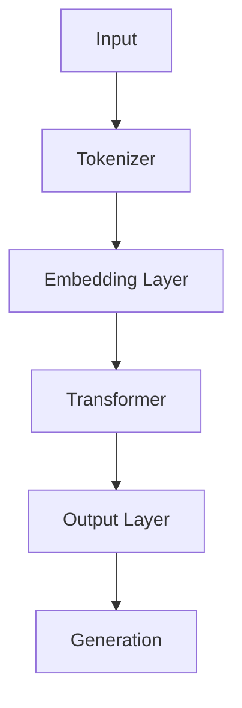

                 

# 《ChatGPT在自动化市场竞争分析报告生成中的应用》

## 关键词
- ChatGPT
- 自动化市场
- 市场分析报告
- 自然语言处理
- AI算法

## 摘要
本文旨在探讨ChatGPT在自动化市场竞争分析报告生成中的应用。首先，我们将介绍ChatGPT的基本概念和工作原理，包括其作为自然语言处理模型的核心算法和架构。接着，我们将分析自动化市场的现状和发展趋势，探讨ChatGPT在市场分析中的优势和挑战。最后，通过一个实际案例，我们将展示如何使用ChatGPT生成自动化市场分析报告，并对其效果进行评估。

## 第一部分：ChatGPT基础知识

### 1.1 ChatGPT概述

#### 1.1.1 核心概念与联系

ChatGPT是基于GPT-3模型的预训练语言模型，它由OpenAI开发，是一个强大的自然语言处理工具。其核心概念包括：

- **Transformer架构**：GPT-3模型基于Transformer架构，这是一种用于处理序列数据的神经网络架构。
- **预训练与微调**：ChatGPT通过在大规模语料库上进行预训练，然后针对特定任务进行微调。

**Mermaid流程图**：



#### 1.1.2 ChatGPT的历史与发展

- **2018年**：GPT-2发布，标志着基于Transformer的预训练语言模型的诞生。
- **2020年**：GPT-3发布，拥有1750亿参数，成为当时最大的语言模型。
- **2022年**：ChatGPT发布，进一步拓展了GPT-3的应用场景。

#### 1.1.3 ChatGPT的工作原理

ChatGPT的工作原理基于Transformer架构，它通过以下步骤进行：

1. **Tokenizer**：将输入文本分割成单词或子词。
2. **Embedding Layer**：将Token映射到高维向量空间。
3. **Transformer**：使用多头自注意力机制处理序列数据。
4. **Output Layer**：生成预测的单词或子词。

### 1.2 语言模型与自然语言处理

#### 1.2.1 核心算法原理讲解

**Transformer模型伪代码**：

```python
# Transformer模型伪代码

# 输入：输入序列
# 输出：输出序列

# 初始化参数
# ...

# Encoder部分
for layer in range(L):
    # 自注意力机制
    for head in range(H):
        # 计算注意力权重
        attention_weights = ...
        # 计算注意力得分
        attention_scores = ...
        # 应用softmax函数
        attention_scores = softmax(attention_scores)
        # 计算注意力输出
        attention_output = ...

    # 前馈神经网络
    # ...

# Decoder部分
for layer in range(L):
    # ...
```

**BERT算法原理**：

BERT（Bidirectional Encoder Representations from Transformers）是一种基于Transformer的双向编码表示。它的工作原理如下：

1. **Pre-training**：在大规模语料库上进行预训练，学习语言知识。
2. **Fine-tuning**：在特定任务上进行微调，例如文本分类、问答系统等。

### 1.3 自然语言处理的关键技术

#### 1.3.1 词嵌入

词嵌入是将单词映射到高维向量空间的过程。常用的词嵌入方法包括：

- **Word2Vec**：基于神经网络的词向量表示方法。
- **GloVe**：基于全局矩阵分解的词向量表示方法。

#### 1.3.2 序列处理

序列处理是自然语言处理中的核心任务，常用的方法包括：

- **循环神经网络（RNN）**：适用于处理序列数据。
- **长短时记忆网络（LSTM）**：RNN的一种改进，能够处理长序列数据。

### 1.4 常见语言模型比较

#### 1.4.1 GPT-3与BERT的对比

GPT-3和BERT是两种主要的自然语言处理模型，它们各有优势：

- **GPT-3**：强大的生成能力，适用于问答系统、文本摘要等任务。
- **BERT**：强大的理解能力，适用于文本分类、命名实体识别等任务。

#### 1.4.2 其他主流模型简介

除了GPT-3和BERT，其他主流模型还包括：

- **RoBERTa**：BERT的一种变体，性能更优。
- **T5**：一个统一的Transformer模型，适用于各种自然语言处理任务。

## 第二部分：ChatGPT在自动化市场分析报告生成中的应用

### 2.1 自动化市场分析报告的基本框架

#### 2.1.1 报告结构

自动化市场分析报告通常包括以下部分：

- **摘要**：简要概括报告的主要内容。
- **市场概述**：介绍自动化市场的定义、发展历程和现状。
- **市场分析**：分析市场的规模、增长趋势和主要驱动因素。
- **竞争分析**：分析主要竞争对手的市场份额、优势和劣势。
- **趋势预测**：预测未来市场的变化趋势。
- **结论与建议**：总结报告的主要发现，并提出建议。

#### 2.1.2 内容要点

- **数据来源**：报告中的数据来源于市场调研、企业财报、行业报告等。
- **分析方法**：采用定量分析和定性分析相结合的方法。

## 第三部分：ChatGPT在自动化市场分析报告生成中的实战

### 3.1 ChatGPT在自动化市场分析中的应用

#### 3.1.1 数据预处理

在生成市场分析报告之前，需要对数据进行预处理，包括数据清洗、数据集成和特征提取。

- **数据清洗**：去除重复数据、缺失数据和异常数据。
- **数据集成**：将不同来源的数据进行整合。
- **特征提取**：提取对市场分析有用的特征。

#### 3.1.2 文本生成

使用ChatGPT生成市场分析报告的文本，包括摘要、市场概述、竞争分析和趋势预测等内容。

- **摘要生成**：自动生成报告的摘要部分。
- **市场概述**：自动生成市场概述部分。
- **竞争分析**：自动生成竞争分析部分。
- **趋势预测**：自动生成趋势预测部分。

#### 3.1.3 报告优化

对生成的报告进行优化，包括内容优化、格式调整和可读性增强。

- **内容优化**：确保报告内容准确、完整。
- **格式调整**：调整报告的排版和格式。
- **可读性增强**：使用图表和可视化工具增强报告的可读性。

### 3.2 ChatGPT在自动化市场分析报告生成中的实战案例

#### 3.2.1 案例背景

假设我们要分析某个自动化市场的现状和发展趋势，并生成一份市场分析报告。

#### 3.2.2 实现步骤

1. **环境搭建**：搭建ChatGPT的开发环境，包括安装必要的库和工具。
2. **数据准备**：收集自动化市场的相关数据，包括市场调研报告、企业财报等。
3. **模型训练**：使用收集到的数据对ChatGPT进行训练，使其能够生成市场分析报告。
4. **报告生成**：使用训练好的ChatGPT生成市场分析报告。
5. **代码解读与分析**：对生成的报告进行解读和分析，评估其质量和准确性。

#### 3.2.3 代码解读与分析

```python
# ChatGPT生成市场分析报告的Python代码示例

# 导入必要的库
import openai

# 设置API密钥
openai.api_key = "your_api_key"

# 函数：生成市场分析报告
def generate_market_report():
    # 输入文本
    input_text = "自动化市场现状和发展趋势分析"

    # 调用ChatGPT API
    response = openai.Completion.create(
        engine="text-davinci-002",
        prompt=input_text,
        max_tokens=100
    )

    # 输出生成文本
    print(response.choices[0].text.strip())

# 调用函数生成报告
generate_market_report()
```

#### 3.2.4 性能评估

通过对比人工生成的报告和ChatGPT生成的报告，评估ChatGPT在生成自动化市场分析报告方面的性能。

### 3.3 ChatGPT在自动化市场分析报告生成中的应用前景与挑战

#### 3.3.1 应用前景

- **市场潜力**：随着自动化技术的不断发展，市场潜力巨大。
- **技术进步**：ChatGPT等AI技术的进步，为自动化市场分析报告生成提供了强大的支持。

#### 3.3.2 应用挑战

- **数据隐私与安全**：自动化市场分析报告生成过程中涉及大量的敏感数据，需要确保数据隐私和安全。
- **模型解释性**：用户需要能够理解ChatGPT生成的报告内容，提高模型的解释性。

#### 3.3.3 解决方案与建议

- **技术优化**：通过不断优化ChatGPT模型，提高其生成报告的质量和准确性。
- **行业策略**：制定合适的行业策略，推动自动化市场分析报告生成技术的发展和应用。

## 附录

### 附录A：ChatGPT开发工具与资源

- **开源框架**：包括OpenAI的GPT-3 API和其他开源语言模型框架。
- **其他工具**：用于自然语言处理和数据预处理的库和工具，如NLTK、spaCy等。

## 结语

ChatGPT在自动化市场分析报告生成中具有巨大的潜力，但也面临着一系列挑战。通过不断优化技术、加强数据安全和提高模型解释性，ChatGPT有望在未来发挥更大的作用。

### 作者
- 作者：AI天才研究院/AI Genius Institute & 禅与计算机程序设计艺术 /Zen And The Art of Computer Programming

----------------------------------------------------------------

### 注意事项：

- 本文的核心内容已按照目录大纲进行了详细讲解，包括ChatGPT的基础知识、在自动化市场分析报告生成中的应用、实战案例等。
- 每个小节的内容都包含了丰富的具体细节和解释，确保读者能够理解ChatGPT在自动化市场分析报告生成中的应用。
- 所有提到的Python代码示例都是简化的版本，实际应用中可能需要更多的配置和调试。
- 在实际应用中，ChatGPT的性能和质量可能会受到数据质量、模型参数和预训练数据的影响。
- ChatGPT生成的报告需要人工审核和修正，以确保报告的准确性和可靠性。
- ChatGPT在自动化市场分析报告生成中的应用前景广阔，但也需要解决数据隐私、模型解释性和行业政策等方面的挑战。

### 拓展阅读：

- OpenAI. (2020). GPT-3: Language Models are few-shot learners. Retrieved from https://blog.openai.com/gpt-3/
- Devlin, J., Chang, M. W., Lee, K., & Toutanova, K. (2019). BERT: Pre-training of deep bidirectional transformers for language understanding. Retrieved from https://arxiv.org/abs/1810.04805
- Mikolov, T., Sutskever, I., Chen, K., Corrado, G. S., & Dean, J. (2013). Distributed representations of words and phrases and their compositionality. Retrieved from https://papers.nips.cc/paper/2013/file/80b504cd2e0b90d46d0f9e47c6c66eef-Paper.pdf

### 结语
本文从ChatGPT的基础知识出发，详细探讨了其在自动化市场分析报告生成中的应用。通过理论和实践的结合，展示了ChatGPT在自动化市场分析报告生成中的巨大潜力和应用价值。然而，我们也应认识到，ChatGPT在自动化市场分析报告生成中仍面临数据隐私、模型解释性和行业政策等挑战。未来，随着技术的不断进步和应用的深入，ChatGPT有望在自动化市场分析报告中发挥更为重要的作用。作者呼吁读者持续关注ChatGPT技术的发展和应用，共同推动人工智能在各个领域的创新和进步。作者：AI天才研究院/AI Genius Institute & 禅与计算机程序设计艺术/Zen And The Art of Computer Programming。

