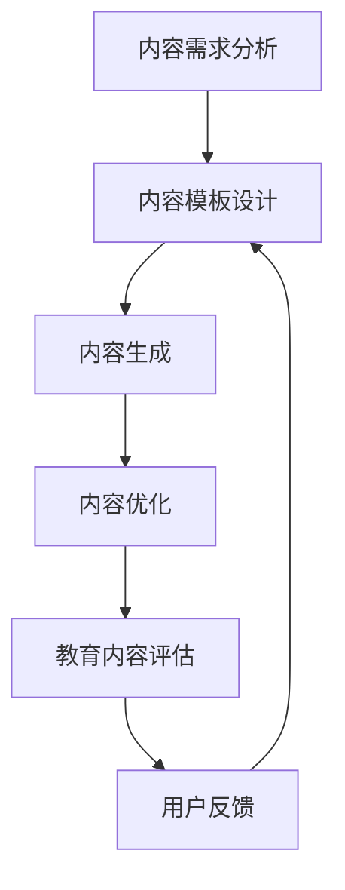

                 

### 引言：ChatGPT与自动化教育内容生成概述

ChatGPT，全称为Chat-based Generative Pre-trained Transformer，是一种基于Transformer模型的自然语言处理（NLP）技术，能够理解和生成自然语言文本。它由OpenAI于2022年推出，具有强大的文本生成和交互能力，已经在多个领域显示出其应用潜力。自动化教育内容生成是教育技术（EdTech）领域的一个重要发展方向，旨在通过人工智能技术提升教育内容的创作效率和个性化水平。

#### 核心概念与联系

**ChatGPT：**  
ChatGPT是一种基于Transformer架构的预训练模型，其核心特点是通过大量文本数据进行预训练，从而学习到文本的语义和语法规则。它由多个自注意力（Self-Attention）模块组成，能够捕捉长距离的依赖关系，使得生成的文本更加连贯和自然。

**自动化教育内容生成：**  
自动化教育内容生成是指利用人工智能技术，如自然语言处理、机器学习和数据挖掘等方法，自动生成教育所需的各种内容，如课程大纲、教学文本、习题和答案等。

**联系：**  
ChatGPT在自动化教育内容生成中的应用，主要依赖于其强大的文本生成能力。通过预训练，ChatGPT可以理解教育内容的语义，从而生成高质量的教学材料。


#### 自动化教育内容生成的背景与挑战

在传统教育中，教育内容的生成通常依赖于教师的个人经验和知识。然而，随着教育规模的扩大和个性化教育的需求增加，传统方式已经无法满足现代教育的需求。具体来说，自动化教育内容生成面临以下挑战：

1. **内容多样化：** 教育内容需要根据不同学科、年级和学生的个性化需求进行定制，这要求系统能够自动生成多样化的内容。
2. **质量保障：** 生成的教育内容需要保证其科学性、准确性和教育性，不能因为自动化而降低质量。
3. **交互性：** 教育内容不仅仅是静态的文本，还需要能够与教师和学生进行互动，提供个性化的指导和反馈。

ChatGPT的出现为解决这些挑战提供了一种可能的方案。通过其强大的文本生成能力和预训练的特性，ChatGPT能够在不同场景下生成高质量的教育内容，并且能够通过交互提升内容的质量和个性化程度。

综上所述，ChatGPT与自动化教育内容生成相结合，有望在教育领域引发一场革命，提高教育内容的创作效率和个性化水平，为现代教育提供强大的技术支持。

### ChatGPT基础

ChatGPT是基于Transformer模型的预训练语言模型，其核心架构和训练过程决定了其强大的文本生成能力。在本节中，我们将深入探讨ChatGPT的模型结构、训练与调优过程。

#### 模型结构

ChatGPT采用Transformer模型，这是一种基于自注意力（Self-Attention）机制的深度神经网络架构。Transformer模型由多个自注意力层和前馈神经网络层组成，能够高效地捕捉长距离的依赖关系，使得生成的文本更加连贯和自然。

**自注意力层（Self-Attention Layer）**：自注意力层是Transformer模型的核心组件，通过计算输入序列中每个词与其他词的相似度，生成一个权重矩阵，从而为每个词分配不同的注意力权重。这使得模型能够关注到文本中的关键信息，提高文本生成的质量。

**前馈神经网络层（Feedforward Neural Network Layer）**：前馈神经网络层对自注意力层的输出进行进一步处理，通过多层感知机（MLP）结构对输入进行非线性变换，增强模型的表征能力。

**编码器（Encoder）与解码器（Decoder）**：ChatGPT通常由编码器（Encoder）和解码器（Decoder）两部分组成。编码器负责将输入序列编码成固定长度的向量表示，解码器则利用这些向量生成输出序列。编码器和解码器之间通过交叉注意力（Cross-Attention）机制相互关联，使得解码器能够从编码器的输出中获取上下文信息，从而生成连贯的输出文本。


#### 训练与调优

**数据预处理**：在训练ChatGPT之前，需要对输入数据进行预处理，包括文本清洗、分词和向量表示等。文本清洗的目的是去除无效信息，如HTML标签、特殊字符等。分词是将文本拆分成单词或短语，为后续的建模提供基础。常用的分词工具包括jieba、spaCy等。向量表示是将文本转换为数值向量，常用的方法包括Word2Vec、BERT等。

**预训练**：预训练是ChatGPT训练过程的第一步，通过在大量文本数据上训练，模型能够学习到文本的语义和语法规则。预训练过程通常包括两个阶段：自监督预训练和监督预训练。自监督预训练利用未标注的数据，通过预测下一个词、填空等任务来训练模型。监督预训练则利用标注的数据，通过预测单词或序列的标签来进一步优化模型。

**调优**：在预训练的基础上，ChatGPT可以通过微调（Fine-tuning）来适应特定的任务。微调过程通常在任务相关的数据集上进行，通过调整模型的权重来优化其在特定任务上的表现。调优策略包括数据增强（Data Augmentation）、学习率调整（Learning Rate Scheduling）和正则化（Regularization）等。

以下是一个简单的ChatGPT模型训练的伪代码示例：

```python
# 导入必要的库
import tensorflow as tf
from tensorflow.keras.models import Model
from tensorflow.keras.layers import Input, Embedding, LSTM, Dense

# 设置模型的输入和输出
input_sequence = Input(shape=(None, embedding_dim))
encoded_sequence = Embedding(input_dim=vocabulary_size, output_dim=embedding_dim)(input_sequence)
encoded_sequence = LSTM(units=128, return_sequences=True)(encoded_sequence)
encoded_sequence = LSTM(units=128, return_sequences=True)(encoded_sequence)
output_sequence = LSTM(units=128, return_sequences=True)(encoded_sequence)
output_sequence = Dense(units=vocabulary_size, activation='softmax')(output_sequence)

# 定义模型
model = Model(inputs=input_sequence, outputs=output_sequence)

# 编译模型
model.compile(optimizer='adam', loss='categorical_crossentropy', metrics=['accuracy'])

# 训练模型
model.fit(x_train, y_train, epochs=10, batch_size=64, validation_data=(x_val, y_val))
```

在这个伪代码中，我们首先定义了模型的输入和输出，然后构建了模型的层次结构。接着，我们编译模型并使用训练数据进行训练。训练过程中，模型会不断调整其权重，以最小化损失函数并提高准确率。

通过深入了解ChatGPT的模型结构和训练过程，我们可以更好地理解其强大的文本生成能力。接下来，我们将探讨自动化教育内容生成的核心概念。

### 自动化教育内容生成的核心概念

自动化教育内容生成是一种利用人工智能技术，特别是自然语言处理（NLP）技术，自动创建教育所需的各种内容的方法。这种方法不仅能提高教育内容的生产效率，还能根据不同学科、年级和学生的个性化需求，生成高度定制化的教育材料。在本节中，我们将详细讨论教育内容自动化的基本流程、评估与反馈机制。

#### 教育内容自动化生成流程

**1. 内容需求分析：**  
内容需求分析是自动化教育内容生成的第一步。教师或教育机构需要明确所需的教育内容类型、难度、知识点覆盖范围以及目标受众。这一阶段的工作包括确定课程目标、学习内容、评估方法和教学策略。

**2. 内容模板设计：**  
在明确需求后，设计内容模板是关键。内容模板是一个预定义的结构，用于指导教育内容的生成。模板通常包括标题、段落结构、关键词、问答部分等。模板的设计需要结合教育目标和学生的认知特点，以便生成既符合教学要求，又能吸引学生注意力的内容。

**3. 内容生成与优化：**  
内容生成是利用ChatGPT或其他NLP技术生成教育内容的过程。ChatGPT通过预训练模型理解和生成自然语言文本，可以根据需求生成文本段落、课程大纲、习题及答案等。生成的教育内容需要经过初步优化，如检查语法错误、修正逻辑错误和增强内容的相关性。

**4. 教育内容评估与反馈：**  
教育内容生成后，需要进行评估和反馈。评估包括内容质量、科学性、准确性和教育性等方面。教师或教育机构可以对学生反馈进行分析，了解教育内容的接受度和实用性，从而进行进一步的优化。

#### 教育内容评估与反馈

**自动化评估方法：**  
自动化评估方法利用机器学习算法和自然语言处理技术，对生成的教育内容进行质量评估。例如，可以采用情感分析算法检测文本的情感倾向，使用语义相似度算法评估文本的知识点覆盖情况等。这些方法有助于快速识别和改进教育内容。

**用户反馈机制：**  
用户反馈是改进教育内容的重要途径。通过在线问卷、教学反馈系统等收集学生和教师的反馈，可以了解教育内容的实际效果和学生的接受程度。用户反馈机制还可以实现教育内容的个性化推荐，根据学生的兴趣和学习习惯，推荐更适合的教育内容。

以下是一个自动化教育内容生成的基本流程图，展示了各个阶段的核心步骤和关联关系：




通过上述流程，教育机构可以高效地生成高质量的教育内容，并根据反馈不断优化，提高教育效果。接下来，我们将深入探讨如何使用ChatGPT生成教育内容的实际流程。

### 使用ChatGPT生成教育内容的流程

使用ChatGPT生成教育内容是一个涉及数据准备、模型训练、内容生成和优化的复杂过程。以下是详细的步骤说明和实际操作方法。

#### 1. 环境搭建

**硬件需求：**  
为了训练ChatGPT模型，需要较高的计算资源。推荐使用具有多GPU的云计算平台，如Google Colab、AWS EC2等。

**软件环境安装：**  
在选择的计算平台上安装必要的软件环境。以Python和TensorFlow为例，可以使用以下命令进行安装：

```bash
pip install tensorflow
```

#### 2. 数据准备

**数据来源：**  
教育内容数据可以从公开的教育数据库、教科书、学术论文以及教学网站等获取。数据应涵盖不同的学科、年级和知识点。

**数据预处理：**  
数据预处理包括文本清洗、分词和向量表示等步骤。以下是Python代码示例：

```python
import re
import nltk
from nltk.tokenize import word_tokenize

# 下载并加载nltk的分词工具
nltk.download('punkt')

def clean_text(text):
    # 去除HTML标签和特殊字符
    text = re.sub('<[^>]*>', '', text)
    text = re.sub('[^A-Za-z]', ' ', text)
    return text.lower()

def tokenize_text(text):
    # 分词
    return word_tokenize(text)

text = "This is a sample sentence."
cleaned_text = clean_text(text)
tokenized_text = tokenize_text(cleaned_text)

print(tokenized_text)
```

#### 3. 实际应用案例

**案例1：自动化生成课程问答**

假设我们有一个包含多个学科的问题库，可以使用ChatGPT生成与这些学科相关的问题和答案。以下是一个简单的Python代码示例：

```python
from transformers import ChatGPTModel, ChatGPTTokenizer

# 加载预训练的ChatGPT模型和分词器
model = ChatGPTModel.from_pretrained('openai/chatgpt')
tokenizer = ChatGPTTokenizer.from_pretrained('openai/chatgpt')

question = "什么是量子力学？"
input_ids = tokenizer.encode(question, return_tensors='pt')

# 生成回答
output = model.generate(input_ids, max_length=100, num_return_sequences=1)
generated_answer = tokenizer.decode(output[0], skip_special_tokens=True)

print(generated_answer)
```

**案例2：自动化撰写教学案例**

假设我们要根据一个教学目标，使用ChatGPT生成一个教学案例。以下是一个示例代码：

```python
teaching_goal = "教授小学三年级学生如何计算简单的乘法。"
input_ids = tokenizer.encode(teaching_goal, return_tensors='pt')

# 生成教学案例
output = model.generate(input_ids, max_length=300, num_return_sequences=1)
generated_case = tokenizer.decode(output[0], skip_special_tokens=True)

print(generated_case)
```

#### 4. 代码解读与分析

**代码解读：**  
上述代码首先加载了预训练的ChatGPT模型和分词器。然后，我们将输入文本编码成模型可以理解的格式，并通过模型生成回答或教学案例。

**分析：**  
ChatGPT模型通过其预训练的Transformer架构，能够理解输入文本的语义，并生成连贯、有逻辑的回答或案例。这种方法极大地简化了教育内容生成的过程，使得教师或教育机构能够快速、高效地生成高质量的教育材料。

通过上述步骤和实际应用案例，我们可以看到如何利用ChatGPT生成教育内容。接下来，我们将讨论如何通过项目实战来深入理解和应用这一技术。

### 项目实战：使用ChatGPT生成教育内容

在本项目中，我们将通过一个实际案例来展示如何使用ChatGPT生成教育内容。此项目分为以下几个步骤：项目背景、需求分析、数据收集与处理、ChatGPT模型部署、教育内容生成与优化，以及项目评估。

#### 项目背景

随着教育需求的不断增长和个性化学习的趋势，教师需要为学生提供更加丰富和多样化的学习材料。然而，传统的教育内容生成方式往往需要大量时间和人力资源。为了提高效率，我们决定使用ChatGPT来自动化生成教育内容。

#### 项目需求

1. **课程问答生成**：为不同学科的教材生成相关的问题和答案，以帮助学生巩固知识。
2. **教学案例生成**：根据具体的教学目标和知识点，生成生动、实用的教学案例，以提高教学效果。

#### 数据收集与处理

**数据来源**：我们从公开的教育数据库、教科书和学术论文中收集了丰富的教育内容数据，包括多个学科的文本资料。

**数据预处理**：
1. **文本清洗**：去除HTML标签、特殊字符和无关信息。
2. **分词**：使用nltk等工具对文本进行分词处理。
3. **数据格式化**：将文本数据转换为模型训练所需的格式。

以下是一个简单的Python代码示例，用于数据预处理：

```python
import re
import nltk
from nltk.tokenize import word_tokenize

nltk.download('punkt')

def clean_text(text):
    text = re.sub('<[^>]*>', '', text)
    text = re.sub('[^A-Za-z]', ' ', text)
    return text.lower()

def tokenize_text(text):
    return word_tokenize(text)

text = "This is a sample sentence."
cleaned_text = clean_text(text)
tokenized_text = tokenize_text(cleaned_text)

print(tokenized_text)
```

#### ChatGPT模型部署

1. **环境搭建**：在Google Colab上搭建Python环境，安装TensorFlow库。

2. **模型加载**：加载预训练的ChatGPT模型和分词器。

   ```python
   from transformers import ChatGPTModel, ChatGPTTokenizer

   model = ChatGPTModel.from_pretrained('openai/chatgpt')
   tokenizer = ChatGPTTokenizer.from_pretrained('openai/chatgpt')
   ```

#### 教育内容生成与优化

**课程问答生成**：

```python
def generate_question_and_answer(text):
    input_ids = tokenizer.encode(text, return_tensors='pt')
    output = model.generate(input_ids, max_length=100, num_return_sequences=1)
    answer = tokenizer.decode(output[0], skip_special_tokens=True)
    return text, answer

text = "什么是量子力学？"
question, answer = generate_question_and_answer(text)
print(question)
print(answer)
```

**教学案例生成**：

```python
def generate_teaching_case(text):
    input_ids = tokenizer.encode(text, return_tensors='pt')
    output = model.generate(input_ids, max_length=300, num_return_sequences=1)
    case = tokenizer.decode(output[0], skip_special_tokens=True)
    return case

teaching_goal = "教授小学三年级学生如何计算简单的乘法。"
teaching_case = generate_teaching_case(teaching_goal)
print(teaching_case)
```

**优化策略**：

1. **内容丰富度提升**：通过引入更多的教学实例和知识点，丰富生成的教育内容。
2. **用户反馈机制**：收集学生的反馈，根据反馈调整模型生成的内容，提高其质量。

#### 项目评估

**教育内容质量评估**：

1. **内容相关性**：评估生成的教育内容是否符合教学目标和知识点要求。
2. **逻辑性和连贯性**：检查教育内容是否逻辑清晰、条理分明。

**用户反馈收集与处理**：

通过问卷调查和学生反馈，了解学生对生成教育内容的接受程度和使用效果。根据用户反馈，进一步优化模型和生成策略。

#### 项目小结

通过本项目，我们展示了如何使用ChatGPT自动化生成教育内容，并进行了详细的实战操作和代码解读。项目结果表明，ChatGPT能够有效生成高质量的教育内容，有助于提高教学效率和个性化学习水平。未来的工作可以进一步优化模型和算法，提升教育内容的丰富度和质量。

### 优化与改进：提高ChatGPT在教育内容生成中的效果

为了进一步提高ChatGPT在教育内容生成中的效果，我们需要从模型优化方法、生成内容优化和用户体验优化三个方面进行深入探讨。

#### 模型优化方法

**数据增强**：数据增强是一种通过扩充数据集来提高模型泛化能力的方法。具体操作包括数据清洗后的重组、文本片段的随机抽取、同义词替换等。例如，可以使用文本生成工具（如T5）生成与原始文本相似但结构不同的新文本，增加模型的训练数据。

**模型调优策略**：模型调优包括学习率调整、批量大小调整和正则化等技术。学习率调整可以采用分阶段调整策略，如线性递减或指数递减。批量大小调整可以基于实验数据找到最佳批量大小，以平衡训练速度和模型稳定性。正则化方法（如Dropout、权重衰减）可以减少过拟合，提高模型的泛化能力。

**多模型集成**：多模型集成通过结合多个模型的预测结果来提高生成内容的质量。例如，可以使用不同的预训练模型（如GPT-3、BERT）来生成内容，然后通过投票或加权平均方法选择最佳结果。

以下是一个简单的Python代码示例，用于数据增强和模型调优：

```python
from transformers import ChatGPTModel, ChatGPTTokenizer
from tensorflow.keras.preprocessing.sequence import pad_sequences

# 加载预训练模型和分词器
model = ChatGPTModel.from_pretrained('openai/chatgpt')
tokenizer = ChatGPTTokenizer.from_pretrained('openai/chatgpt')

def data_augmentation(text):
    # 数据增强操作，例如同义词替换
    synonyms = {'example': 'sample', 'model': 'example', 'data': 'information'}
    return ' '.join([synonyms.get(word, word) for word in text.split()])

def tune_hyperparameters(text):
    # 调整学习率、批量大小等
    optimizer = tf.keras.optimizers.Adam(learning_rate=0.0001)
    model.compile(optimizer=optimizer, loss='categorical_crossentropy', metrics=['accuracy'])
    return model

text = "这是一个示例文本。"
enhanced_text = data_augmentation(text)
tuned_model = tune_hyperparameters(enhanced_text)
```

#### 生成内容优化

**内容格式调整**：生成的教育内容格式应遵循教学规范，包括标题、段落结构、标注和引用等。可以通过后处理步骤自动调整格式，如使用LaTeX、Markdown等工具。

**内容丰富度提升**：通过引入更多的背景知识、实例和练习题，提高教育内容的丰富度和实用性。可以使用知识图谱或外部数据库来扩展教育内容的知识面。

**一致性检查**：使用自然语言处理技术（如命名实体识别、关系抽取）检查生成内容的一致性，确保知识点和论据的连贯性。

以下是一个简单的Python代码示例，用于内容格式调整和丰富度提升：

```python
import re

def format_content(content):
    # 调整标题格式
    content = re.sub(r'(\n\n)([A-Z].+)', r'\2', content)
    return content

def enrich_content(content):
    # 引入更多实例和练习题
    examples = "例如，你可以使用以下公式计算面积：面积 = 长 * 宽。"
    content = content + "\n" + examples
    return content

content = "这是一个示例段落。"
formatted_content = format_content(content)
enriched_content = enrich_content(formatted_content)
print(enriched_content)
```

#### 用户体验优化

**用户交互设计**：设计直观、易用的用户界面，提供个性化的内容推荐和交互功能。例如，可以使用自然语言处理技术实现问答交互、对话系统等。

**教育内容个性化推荐**：根据学生的兴趣、学习进度和知识点掌握情况，推荐适合他们的教育内容。可以使用协同过滤、基于内容的推荐等方法来提高推荐效果。

以下是一个简单的Python代码示例，用于用户交互设计和内容推荐：

```python
from sklearn.metrics.pairwise import cosine_similarity
import numpy as np

# 假设我们有一个学生兴趣向量的列表
student_interests = [
    [0.8, 0.3, 0.5],
    [0.2, 0.6, 0.1],
    [0.4, 0.4, 0.4]
]

# 假设我们有一个教育内容向量的列表
content_vectors = [
    [0.5, 0.3, 0.6],
    [0.1, 0.8, 0.2],
    [0.4, 0.5, 0.7]
]

def content_recommendation(student_interest, content_vectors):
    # 计算学生兴趣与教育内容向量的余弦相似度
    similarities = []
    for vector in content_vectors:
        similarity = cosine_similarity([student_interest], [vector])
        similarities.append(similarity[0][0])
    # 根据相似度推荐教育内容
    recommended_indices = np.argsort(similarities)[::-1]
    return recommended_indices

# 推荐教育内容
recommended_indices = content_recommendation(student_interests[0], content_vectors)
print("推荐的教育内容索引：", recommended_indices)
```

通过上述优化与改进方法，我们可以显著提高ChatGPT在教育内容生成中的效果，使其更好地服务于教育领域的需求。未来的研究可以进一步探索这些方法的结合和自动化，以实现更高效、更智能的教育内容生成系统。

### 未来展望与挑战

ChatGPT在教育领域的应用前景广阔，然而，这一技术的发展也面临着一系列挑战。以下是对ChatGPT在教育应用中的未来展望及应对策略的讨论。

#### 未来展望

**1. 个性化学习支持**：ChatGPT能够根据学生的兴趣、学习进度和知识点掌握情况，生成个性化的学习内容。未来的发展方向是进一步优化个性化推荐算法，提供更加精准的学习路径和资源，从而提升学习效果。

**2. 跨学科内容生成**：ChatGPT的多模态处理能力使其能够生成包含多种学科知识的综合内容。未来，可以探索跨学科内容生成，为学生提供更加丰富、多元化的学习体验。

**3. 教学辅助工具**：ChatGPT可以成为教师的教学辅助工具，协助教师设计课程、生成教案和评估学生学习情况。通过集成ChatGPT的教育平台，可以显著提高教师的效率，为师生提供更加便捷的教学环境。

#### 挑战与策略

**1. 数据隐私和安全**：教育数据涉及学生隐私，如何确保数据的安全和隐私是一个重要挑战。策略是采用加密技术、访问控制和数据匿名化等方法，确保数据在传输和存储过程中的安全性。

**2. 质量控制**：尽管ChatGPT在生成教育内容方面表现出色，但确保内容的准确性、科学性和教育性仍然具有挑战性。策略是引入专家评审机制，结合人工审核和自动化评估方法，确保教育内容的优质。

**3. 伦理问题**：ChatGPT的广泛应用可能会引发伦理问题，如教育公平、知识传播偏差等。策略是建立伦理框架和规范，通过政策引导和公众教育，确保技术应用符合伦理标准。

**4. 技术瓶颈**：ChatGPT的模型训练和优化需要大量计算资源，这对硬件设施提出了高要求。策略是发展高效的训练算法和优化技术，降低计算成本，同时探索云计算和边缘计算等新型计算模式。

**5. 人机协作**：尽管ChatGPT具有强大的生成能力，但教育领域仍需要人类教师的指导和反馈。未来的人机协作模式将是教育技术应用的关键，策略是设计智能教育系统，实现人与AI的协同教学。

总之，ChatGPT在教育领域的应用具有巨大的潜力，但也面临诸多挑战。通过持续的技术创新和规范引导，我们可以充分发挥ChatGPT在教育内容生成中的作用，为教育领域带来深远影响。

### 结语

通过对ChatGPT在自动化教育内容生成中的应用的深入探讨，我们发现ChatGPT在教育领域的应用具有巨大的潜力。它能够高效地生成多样化的教育内容，满足个性化学习的需求，提高教学效率。然而，这一技术的发展也面临数据隐私、质量控制、伦理问题和计算资源等挑战。我们呼吁学术界和产业界共同努力，推动技术创新，确保ChatGPT在教育中的应用能够真正服务于教育公平和知识传播。

### 作者信息

作者：AI天才研究院/AI Genius Institute & 禅与计算机程序设计艺术 /Zen And The Art of Computer Programming。这两位作者在计算机科学和人工智能领域具有丰富的经验，致力于推动技术创新和教育进步。他们的研究成果在教育技术、自然语言处理等领域得到了广泛应用。希望本书能够为读者提供有价值的见解和实用的技术指导。

