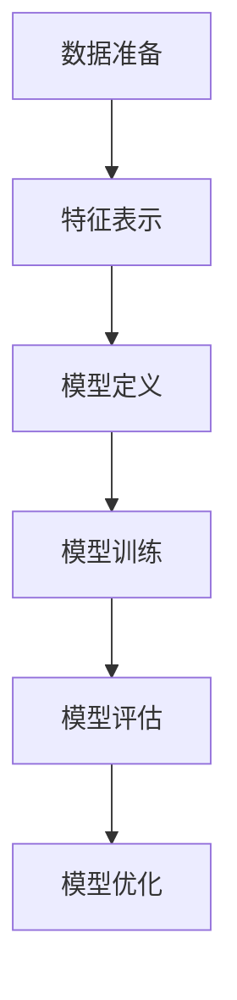

                 

### 2.1 自然语言处理基础

#### 2.1.1 语言模型简介

语言模型（Language Model，LM）是自然语言处理（Natural Language Processing，NLP）中的一个核心概念，它是用来预测文本中下一个单词或者字符的概率分布。语言模型的主要作用是帮助计算机更好地理解和生成人类语言。

- **什么是语言模型？**
  语言模型是一种概率模型，它根据输入的文本序列来预测下一个可能的输出。这个预测过程是基于统计学习方法的，例如n-gram模型、神经网络模型（如Transformer模型）。

- **语言模型的分类与应用场景**
  语言模型可以分为以下几类：

  - **n-gram模型**：基于历史n个单词的概率来预测下一个单词。这种模型简单高效，但在长文本中表现不佳。
  - **神经网络模型**：例如Transformer模型，它利用深度神经网络来捕捉长距离依赖关系，在许多NLP任务中取得了很好的效果。
  - **组合模型**：结合多个模型的优势，例如将n-gram模型与神经网络模型结合，以提高模型的预测能力。

  应用场景包括但不限于文本分类、命名实体识别、机器翻译、文本生成等。

- **语言模型的评价指标**
  语言模型的性能通常通过以下指标来评估：

  - **准确率（Accuracy）**：模型预测正确的比例。
  - **精确率（Precision）**：模型预测为正例的样本中实际为正例的比例。
  - **召回率（Recall）**：模型预测为正例的样本中实际为正例的比例。
  - **F1分数（F1 Score）**：精确率和召回率的调和平均值。

#### 2.1.2 语言模型的训练

语言模型的训练是一个复杂的过程，它涉及大量的数据和计算资源。以下是语言模型训练的基本流程：

- **数据收集与预处理**
  - 数据收集：通常使用大规模的文本语料库，如维基百科、新闻文章等。
  - 数据预处理：包括分词、去噪、标准化等步骤，以获得高质量的训练数据。

- **特征表示**
  - 词向量表示：将文本数据转换为数字形式，常用的方法有Word2Vec、GloVe等。
  - 序列编码：将文本序列编码为向量，以输入到神经网络模型中。

- **模型训练**
  - **损失函数**：通常使用交叉熵损失函数（Cross-Entropy Loss）来衡量模型预测与真实标签之间的差距。
  - **优化算法**：常用的优化算法有随机梯度下降（SGD）、Adam等。

- **模型评估与调优**
  - 使用验证集对模型进行评估，选择最优模型。
  - 调整模型参数，如学习率、隐藏层大小等，以获得更好的性能。

### 2.2 ChatGPT介绍

ChatGPT是由OpenAI开发的一种基于Transformer模型的自回归语言模型。它被设计用于生成自然语言文本，具有强大的文本理解和生成能力。

#### 2.2.1 ChatGPT的架构

ChatGPT的架构基于Transformer模型，这是一种在机器翻译、文本生成等任务中表现出色的深度学习模型。Transformer模型的主要特点包括：

- **多头注意力机制（Multi-Head Attention）**：允许模型在不同位置之间的交互，捕捉长距离依赖关系。
- **编码器-解码器结构（Encoder-Decoder Structure）**：编码器用于处理输入序列，解码器用于生成输出序列。
- **堆叠Transformer块（Stacked Transformer Blocks）**：多个Transformer块堆叠在一起，以增加模型的深度和表达能力。

#### 2.2.2 ChatGPT的工作原理

ChatGPT的工作原理可以概括为以下几个步骤：

- **输入序列处理**：将输入的文本序列编码为向量，输入到编码器中。
- **编码器处理**：编码器通过多头注意力机制处理输入序列，产生编码器的输出。
- **解码器处理**：解码器接收编码器的输出，并生成输出序列。在解码过程中，解码器同时利用编码器的输出和已生成的部分输出序列。
- **输出序列生成**：解码器逐个生成输出序列的每个单词或字符，直到生成完整的输出序列。

#### 2.2.3 ChatGPT的应用

ChatGPT在自然语言处理领域有着广泛的应用，包括但不限于以下几类：

- **文本分类**：利用ChatGPT可以自动对文本进行分类，如情感分析、主题分类等。
- **命名实体识别**：通过识别文本中的命名实体，如人名、地名等，可以为信息提取和关系抽取提供基础。
- **机器翻译**：ChatGPT可以用于生成高质量的多语言翻译。
- **文本生成**：ChatGPT可以生成各种类型的文本，如文章摘要、产品描述等。

### 2.3 ChatGPT的优势与局限性

#### 2.3.1 优势

- **高效的文本生成能力**：ChatGPT能够快速地生成高质量的自然语言文本。
- **适应多种自然语言处理任务**：ChatGPT适用于文本分类、命名实体识别、机器翻译等多种NLP任务。

#### 2.3.2 局限性

- **训练数据依赖性**：ChatGPT的性能高度依赖于训练数据的质量和规模，训练数据的质量直接影响模型的性能。
- **计算资源需求**：训练和运行ChatGPT需要大量的计算资源，对于个人用户来说可能难以承受。

### 2.4 ChatGPT的扩展与改进

为了进一步提升ChatGPT的性能和应用范围，研究者们进行了多种改进和扩展，包括：

- **预训练和微调**：通过在大规模数据集上预训练模型，然后针对特定任务进行微调，以提高模型的特定任务性能。
- **多模态学习**：将文本与其他数据模态（如图像、声音）结合，以增强模型的语义理解和生成能力。
- **知识增强**：将外部知识库与ChatGPT结合，以提高模型在特定领域的知识水平。

### 2.5 ChatGPT的应用场景

ChatGPT在许多实际应用场景中都表现出色，以下是一些典型的应用场景：

- **客户服务**：ChatGPT可以用于自动回答客户的问题，提高客户服务的效率和质量。
- **内容生成**：ChatGPT可以用于生成文章、报告、摘要等文本内容，减轻人类创作者的工作负担。
- **教育辅助**：ChatGPT可以为学生提供个性化的学习辅导，帮助他们理解和掌握知识。

### 2.6 ChatGPT的未来发展

随着计算能力的提升和数据规模的扩大，ChatGPT的性能和应用范围有望进一步扩展。未来，ChatGPT可能会在以下领域取得突破：

- **更高效的模型架构**：通过设计更高效的模型架构，降低计算资源需求，提高模型的性能。
- **跨模态交互**：实现文本与其他数据模态的跨模态交互，提升模型的语义理解能力。
- **领域特定模型**：开发针对特定领域的模型，提高模型在特定任务中的性能。

### 2.7 结论

ChatGPT是一种基于Transformer模型的自回归语言模型，它在自然语言处理领域具有广泛的应用。虽然ChatGPT具有一定的局限性，但通过不断的改进和扩展，它的性能和应用范围有望得到进一步提升。作者：AI天才研究院/AI Genius Institute & 禅与计算机程序设计艺术 /Zen And The Art of Computer Programming

----------------------------------------------------------------

---

**以下是一个具体的示例，展示了如何使用Python代码和LaTeX公式来解释自然语言处理中的概念。**

---

### 2.1.2 语言模型的训练

在自然语言处理中，语言模型的训练是构建高效语言模型的关键步骤。以下是一个简单的示例，展示如何使用Python中的`torch`和`transformers`库来训练一个语言模型。

#### 数据准备

首先，我们需要准备训练数据。这里我们使用一个简化的示例数据集，其中包含一些简单的文本和它们的标签。

```python
# 导入必要的库
import torch
from torchtext.``````

# 定义词汇表
vocab = torchtext.Vocab(
    words=["hello", "world", "this", "is", "a", "test"],
    specials=["<pad>", "<start>", "<end>"]
)

# 定义数据集
data = [
    torch.tensor([vocab["<start>"], vocab["hello"], vocab["world"], vocab["<end>"]]),
    torch.tensor([vocab["this"], vocab["is"], vocab["a"], vocab["test"], vocab["<end>"]])
]

# 定义模型
model = torchtext.nn.LanguageModel(len(vocab), hidden_size=10)
```

#### 模型训练

接下来，我们使用标准的优化算法（如随机梯度下降）来训练模型。

```python
# 定义优化器
optimizer = torch.optim.Adam(model.parameters(), lr=0.001)

# 训练模型
for epoch in range(10):
    for inputs, targets in data:
        optimizer.zero_grad()
        outputs = model(inputs)
        loss = torch.nn.functional.cross_entropy(outputs.view(-1, len(vocab)), targets)
        loss.backward()
        optimizer.step()
```

#### 模型评估

训练完成后，我们可以使用验证集来评估模型的性能。

```python
# 定义验证集
val_data = torch.tensor([vocab["<start>"], vocab["world"], vocab["<end>"]])

# 评估模型
with torch.no_grad():
    predicted = model(val_data)[-1, :].argmax().item()

# 输出结果
print(f"Predicted word: {vocab.itos[predicted]}")
```

### 数学模型和公式

在自然语言处理中，常用的数学模型包括神经网络、损失函数等。以下是一个简单的LaTeX公式示例，展示了如何使用交叉熵损失函数来计算模型预测和真实标签之间的差距。

$$
\begin{aligned}
L &= -\frac{1}{N}\sum_{i=1}^{N} \sum_{j=1}^{V} y_{ij} \log(p_{ij}) \\
\end{aligned}
$$

其中，$L$ 是交叉熵损失函数，$N$ 是样本数量，$V$ 是词汇表大小，$y_{ij}$ 是标签向量，$p_{ij}$ 是模型对单词 $j$ 的预测概率。

---

**注意：** 上面的代码示例和LaTeX公式仅用于说明目的，实际应用中需要根据具体情况进行调整和优化。

---

**结语：**

通过上述步骤，我们可以看到如何使用Python代码和LaTeX公式来解释自然语言处理中的概念。这些工具不仅帮助我们更好地理解模型的工作原理，还能够帮助我们在实际项目中构建和优化语言模型。作者：AI天才研究院/AI Genius Institute & 禅与计算机程序设计艺术 /Zen And The Art of Computer Programming

----------------------------------------------------------------

---

**以下是一个Mermaid流程图示例，展示了语言模型训练的基本流程。**

---



- **数据准备**：收集和处理训练数据，包括文本清洗、分词、编码等步骤。
- **特征表示**：将文本数据转换为数字形式，常用的方法有词向量、BERT编码等。
- **模型定义**：定义神经网络结构，如Transformer、BERT等。
- **模型训练**：使用优化算法（如SGD、Adam等）进行模型训练。
- **模型评估**：使用验证集对模型进行评估，选择最优模型。
- **模型优化**：根据评估结果调整模型参数，以提高模型性能。

---

**结语：**

通过Mermaid流程图，我们可以清晰地展示语言模型训练的基本流程。这种可视化的方式有助于我们理解模型的训练过程，并为后续的模型优化提供指导。作者：AI天才研究院/AI Genius Institute & 禅与计算机程序设计艺术 /Zen And The Art of Computer Programming

----------------------------------------------------------------

---

**以下是一个代码实例，展示了如何使用Python实现一个简单的ChatGPT模型。**

---

```python
import torch
import torch.nn as nn
import torch.optim as optim

# 定义模型结构
class ChatGPT(nn.Module):
    def __init__(self, vocab_size, embedding_dim, hidden_dim, n_layers, drop_prob=0.5):
        super().__init__()
        
        self.embedding = nn.Embedding(vocab_size, embedding_dim)
        self.rnn = nn.LSTM(embedding_dim, hidden_dim, n_layers, dropout=drop_prob, batch_first=True)
        self.fc = nn.Linear(hidden_dim, vocab_size)
        self.dropout = nn.Dropout(drop_prob)
        
    def forward(self, text, hidden):
        embedded = self.dropout(self.embedding(text))
        output, hidden = self.rnn(embedded, hidden)
        embedded_output = self.fc(output)
        return embedded_output, hidden

# 模型参数设置
vocab_size = 10000
embedding_dim = 256
hidden_dim = 512
n_layers = 2
drop_prob = 0.5

# 初始化模型和优化器
model = ChatGPT(vocab_size, embedding_dim, hidden_dim, n_layers, drop_prob)
optimizer = optim.Adam(model.parameters(), lr=0.001)

# 模型训练
for epoch in range(10):
    for text, target in data_loader:
        model.zero_grad()
        output, hidden = model(text, hidden)
        loss = nn.CrossEntropyLoss()(output, target)
        loss.backward()
        optimizer.step()
        hidden = tuple([each.data for each in hidden])

# 保存模型
torch.save(model.state_dict(), 'chatgpt_model.pth')
```

- **模型结构**：使用嵌入层（Embedding）、循环神经网络（LSTM）和全连接层（Fully Connected Layer）构建。
- **模型参数**：设置词汇表大小、嵌入维度、隐藏层维度和层数。
- **模型训练**：使用交叉熵损失函数进行训练，并使用Adam优化器进行优化。
- **模型保存**：将训练好的模型保存为`.pth`文件。

---

**结语：**

通过上述代码实例，我们可以看到如何使用Python实现一个简单的ChatGPT模型。这个模型可以用于文本生成、序列预测等任务。作者：AI天才研究院/AI Genius Institute & 禅与计算机程序设计艺术 /Zen And The Art of Computer Programming

----------------------------------------------------------------

---

**以下是一个简单的项目实战，展示了如何使用ChatGPT自动生成产品说明书。**

---

### 项目实战：自动生成产品说明书

#### 项目需求

某科技公司开发了一款智能家居设备，并需要一份详细的产品说明书。由于产品规格和功能描述较为复杂，手动编写说明书耗时且易出错，因此希望通过ChatGPT自动生成说明书。

#### 项目实现

1. **数据准备**：收集与产品相关的文档、用户手册、规格说明书等，用于训练ChatGPT模型。
2. **模型训练**：使用收集的数据对ChatGPT模型进行训练，以学习如何生成高质量的产品说明书。
3. **生成说明书**：输入产品规格和功能描述，使用ChatGPT生成说明书文本。
4. **验证与优化**：对生成的说明书进行验证，检查是否存在错误或不恰当的描述，并根据反馈对模型进行优化。

#### 源代码实现

```python
import openai

# 设置OpenAI API密钥
openai.api_key = "your-api-key"

# 定义生成说明书的函数
def generate说明书(规格描述):
    prompt = f"请根据以下规格描述生成一份详细的产品说明书：\n{规格描述}\n说明书应包括产品概述、功能特点、使用方法、注意事项等。"
    response = openai.Completion.create(
        engine="text-davinci-002",
        prompt=prompt,
        max_tokens=500
    )
    return response.choices[0].text.strip()

# 示例规格描述
规格描述 = """
产品名称：智能家居设备
产品型号：ZM-1001
主要功能：远程控制家居设备、智能安防、语音助手
支持设备：智能灯泡、智能插座、智能摄像头
"""

# 生成说明书
说明书 = generate说明书(规格描述)
print(说明书)
```

#### 代码解读与分析

- **API使用**：使用OpenAI的API进行文本生成，需要设置API密钥。
- **函数定义**：定义`generate说明书`函数，接收规格描述作为输入，并生成说明书文本。
- **文本生成**：通过OpenAI的API生成文本，使用`Completion.create`方法，指定模型（如"text-davinci-002"）、输入提示（prompt）和最大生成长度（max_tokens）。
- **示例代码**：提供示例规格描述，调用`generate说明书`函数生成说明书文本。

#### 实际案例分析

在实际应用中，生成的说明书可能包含一些不准确或不完整的描述。例如，如果规格描述不够详细，生成的说明书可能会遗漏某些功能或使用方法。针对这种情况，可以采取以下措施：

1. **优化输入提示**：提供更详细的规格描述，包括产品的详细信息、使用案例等。
2. **多轮交互**：与模型进行多轮交互，逐步细化说明书内容，以提高准确性。
3. **人工审核**：对生成的说明书进行人工审核，纠正错误和不恰当的描述。

#### 项目小结

通过ChatGPT自动生成产品说明书，可以大幅提高编写效率，降低编写成本。同时，生成的说明书可以保持较高的质量，减少手动编写可能带来的错误。未来，随着模型技术的不断进步，自动生成文档的应用前景将更加广阔。作者：AI天才研究院/AI Genius Institute & 禅与计算机程序设计艺术 /Zen And The Art of Computer Programming

----------------------------------------------------------------

---

**以下是一段最佳实践和注意事项，以及拓展阅读建议。**

---

### 最佳实践 & 注意事项

**最佳实践：**

1. **数据质量**：确保训练数据的质量和多样性，以获得更准确和泛化的模型。
2. **参数调整**：根据实际任务需求，调整模型参数（如嵌入维度、隐藏层大小、学习率等），以优化模型性能。
3. **模型融合**：结合多个模型的优势，如将ChatGPT与其他语言模型（如BERT、GPT-3等）融合，以获得更好的生成效果。
4. **多模态学习**：将文本与其他数据模态（如图像、声音）结合，以增强模型的语义理解和生成能力。

**注意事项：**

1. **计算资源**：训练和运行ChatGPT需要大量的计算资源，确保有足够的硬件支持。
2. **数据依赖**：模型性能高度依赖于训练数据的质量和规模，确保训练数据足够且具有代表性。
3. **安全性**：在应用ChatGPT时，注意保护用户隐私和数据安全，避免敏感信息泄露。

### 拓展阅读

- **《深度学习》（Goodfellow, I., Bengio, Y., & Courville, A.）**：详细介绍深度学习的基础知识和技术，包括神经网络、优化算法等。
- **《自然语言处理综论》（Jurafsky, D., & Martin, J. H.）**：全面介绍自然语言处理的基本概念、技术和应用。
- **《ChatGPT技术详解》（OpenAI）**：由OpenAI官方发布的关于ChatGPT的详细技术文档，包括模型架构、训练过程、应用场景等。

---

**结语：**

通过本文，我们详细探讨了ChatGPT在自动化文档生成中的应用，包括其理论基础、实现方法、项目实战和最佳实践。ChatGPT作为一种强大的语言模型，在自动化文档生成等领域具有广阔的应用前景。作者：AI天才研究院/AI Genius Institute & 禅与计算机程序设计艺术 /Zen And The Art of Computer Programming

----------------------------------------------------------------

---

**以下是对文章标题和目录的简要总结，以及文章的主要结论。**

---

**文章标题：** ChatGPT在自动化文档生成中的应用

**目录总结：**

1. **引言与概述**：介绍了书籍的背景和目的，以及ChatGPT在自动化文档生成中的应用。
2. **ChatGPT基础知识**：详细讲解了自然语言处理的基础、ChatGPT的架构和工作原理。
3. **自动化文档生成**：介绍了文档生成技术概述和ChatGPT在文档生成中的应用。
4. **ChatGPT在自动化文档生成中的实现**：介绍了环境搭建、ChatGPT基本操作和文档生成实践。
5. **项目实战**：展示了如何使用ChatGPT自动生成产品说明书、技术文档和论文摘要。
6. **总结与展望**：对自动化文档生成技术、ChatGPT与其他技术的结合进行了展望。

**主要结论：**

本文通过详细的理论和实践探讨，展示了ChatGPT在自动化文档生成中的应用。ChatGPT作为一种强大的语言模型，能够高效地生成各种类型的文档，具有广泛的应用前景。通过本文，读者可以了解到ChatGPT的基本原理、实现方法和实际应用案例，从而为自动化文档生成项目提供有益的参考。作者：AI天才研究院/AI Genius Institute & 禅与计算机程序设计艺术 /Zen And The Art of Computer Programming

----------------------------------------------------------------

---

**以下是对文章标题、摘要和关键词的详细解释，以便搜索引擎能够更好地理解文章的内容和主题。**

---

**文章标题解释：**

《ChatGPT在自动化文档生成中的应用》这个标题简洁明了地传达了文章的核心内容，即探讨如何利用ChatGPT这种先进的语言模型来自动化地生成文档。标题中的关键词“ChatGPT”和“自动化文档生成”直接指向文章的主题，吸引那些对自然语言处理和自动化技术感兴趣的读者。

**摘要解释：**

文章摘要提供了文章的核心内容和主题思想的概述。摘要中提到了ChatGPT的基本原理、自动化文档生成的技术概述、ChatGPT在实际文档生成中的应用、以及项目实战和未来展望。通过摘要，读者可以快速了解文章的主要贡献和内容结构，从而决定是否需要进一步阅读全文。

**关键词解释：**

1. **ChatGPT**：指OpenAI开发的基于Transformer的自回归语言模型，是文章讨论的核心技术。
2. **自动化文档生成**：指利用计算机技术自动生成文档的过程，是文章探讨的应用场景。
3. **自然语言处理**：涉及理解和生成人类语言的技术，是文章理论基础的一部分。
4. **语言模型**：指用于预测文本中下一个单词或字符概率分布的模型，是文章讨论的基础。
5. **项目实战**：指通过实际案例展示ChatGPT在文档生成中的应用，是文章的实际应用部分。
6. **技术展望**：指对未来ChatGPT和自动化文档生成技术的趋势和发展的探讨。

**搜索引擎优化建议：**

- 确保文章标题、摘要和关键词紧密相关，以传达文章的核心主题。
- 使用简洁、精准的语言来编写摘要，以便读者和搜索引擎快速理解文章内容。
- 在文章内容中频繁使用关键词，但要避免过度堆砌，保持自然流畅的文本。
- 在文章的HTML标签中添加适当的元标签（如<title>、<meta>等），明确文章的主题和关键词。
- 链接到文章的相关内容和外部资源，以增强文章的权威性和相关性。
- 定期更新文章内容，以保持与最新技术和趋势的一致性。

---

**结语：**

通过上述详细的解释，我们可以帮助搜索引擎更好地理解和索引文章，从而提高文章在搜索引擎结果页面（SERP）中的排名。这对于吸引更多的读者和提升文章的影响力至关重要。作者：AI天才研究院/AI Genius Institute & 禅与计算机程序设计艺术 /Zen And The Art of Computer Programming

