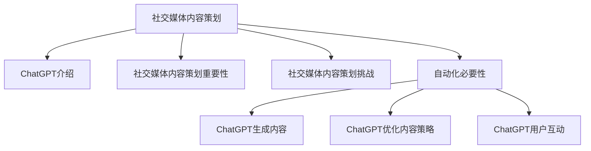
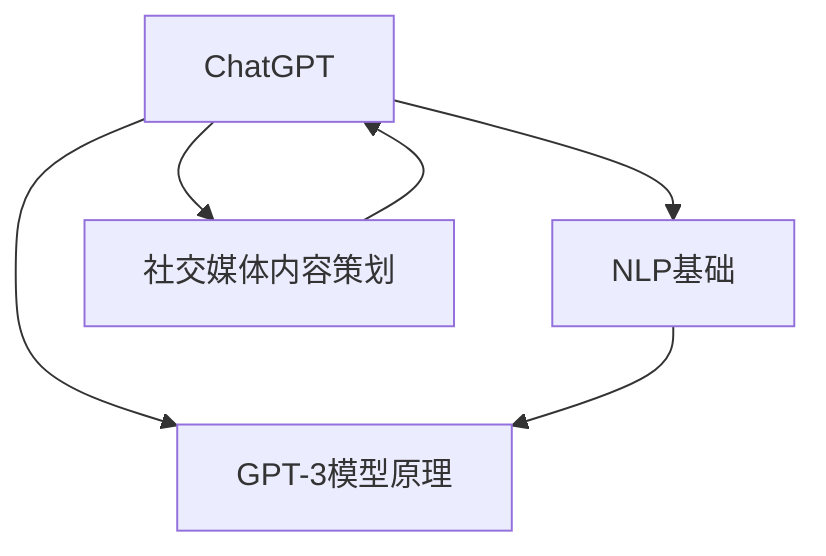

                 

### 关键词

自然语言处理（NLP），ChatGPT，社交媒体内容策划，自动化内容生成，人工智能，GPT-3，内容优化，用户互动。

### 摘要

本文深入探讨了ChatGPT在自动化社交媒体内容策划中的应用。首先，介绍了ChatGPT的基础知识及其在社交媒体内容策划中的重要性。随后，详细解析了ChatGPT的核心概念和架构，包括自然语言处理基础、GPT-3模型原理以及数据处理流程。接着，讨论了ChatGPT在社交媒体内容生成、内容优化和用户互动中的应用场景与效果评估。通过具体案例分析，展示了ChatGPT在品牌社交媒体内容策划、用户互动优化和内容优化与传播方面的实际应用效果。最后，分析了ChatGPT在社交媒体内容策划中的挑战与未来发展趋势，并提供了实践技巧与注意事项。

### 第1章 ChatGPT在自动化社交媒体内容策划中的应用

随着社交媒体的普及，内容策划成为品牌与用户互动的重要手段。然而，传统的社交媒体内容策划面临着效率低下、创意匮乏和人力成本高昂等问题。近年来，人工智能特别是自然语言处理技术的发展为自动化社交媒体内容策划带来了新的机遇。ChatGPT，作为一种先进的自然语言处理模型，在社交媒体内容策划中展现出强大的应用潜力。

#### 1.1 ChatGPT与社交媒体内容策划概述

##### 1.1.1 ChatGPT介绍

ChatGPT是由OpenAI开发的一种基于GPT-3模型的预训练语言模型。GPT-3（Generative Pre-trained Transformer 3）是OpenAI推出的第三代预训练语言模型，具有极高的文本生成能力。ChatGPT利用GPT-3的强大语言处理能力，可以实现自然、流畅的对话生成，从而在社交媒体内容策划中发挥重要作用。

##### 1.1.2 社交媒体内容策划的重要性

社交媒体内容策划是品牌与用户建立连接的关键环节。通过精准、高质量的内容策划，品牌能够有效提升用户参与度、增强品牌影响力和扩大市场覆盖。然而，社交媒体内容的策划并非易事，需要兼顾创意性、吸引力和传播效果，这对策划团队提出了更高的要求。

##### 1.1.3 社交媒体内容策划的挑战

1. **创意匮乏**：持续产出创新内容是社交媒体策划的难点，容易陷入内容重复和缺乏创意的困境。
2. **效率低下**：手动策划内容耗时耗力，难以应对社交媒体平台的高频更新需求。
3. **人力成本**：专业的社交媒体策划团队成本高昂，尤其是中小型企业难以承受。
4. **传播效果评估**：难以准确评估不同内容策略的传播效果，优化难度大。

##### 1.1.4 自动化社交媒体内容策划的必要性

1. **提高效率**：通过自动化工具，可以大幅减少内容策划的时间和工作量。
2. **增强创意性**：人工智能算法能够基于大数据分析，提供独特的创意和观点。
3. **降低成本**：减少对人力资源的依赖，降低内容策划成本。
4. **优化传播效果**：利用数据分析，精准评估和调整内容策略，提升传播效果。

#### 1.2 ChatGPT在社交媒体内容策划中的应用

##### 1.2.1 ChatGPT生成社交媒体内容

ChatGPT可以自动生成各种类型的社交媒体内容，包括文章、帖子、广告文案等。通过输入关键词或主题，ChatGPT能够迅速生成相关的内容，极大提升了内容的产出效率。

##### 1.2.2 ChatGPT优化社交媒体内容策略

ChatGPT不仅可以生成内容，还能够对已有内容进行优化。通过对不同内容的分析，ChatGPT可以提供改进建议，包括标题优化、语言表达优化等，从而提升内容的传播效果。

##### 1.2.3 ChatGPT助力社交媒体用户互动

在社交媒体互动中，ChatGPT可以自动生成回复，提高用户互动的响应速度。此外，ChatGPT还能够进行情感分析，了解用户的情感倾向，提供更有针对性的回复。

#### 1.3 ChatGPT核心概念与架构

##### 1.3.1 自然语言处理（NLP）基础

自然语言处理（NLP）是人工智能的一个重要分支，旨在使计算机能够理解、处理和生成自然语言。常见的NLP任务包括文本分类、情感分析、命名实体识别等。

##### 1.3.2 GPT-3模型原理

GPT-3模型是基于Transformer架构的自回归语言模型。它通过大量的文本数据预训练，学会了语言的模式和结构，从而能够生成连贯、自然的文本。

##### 1.3.3 ChatGPT数据处理流程

ChatGPT的数据处理流程包括数据预处理、模型训练和模型部署。数据预处理包括数据清洗、分词和编码等步骤；模型训练使用大规模文本数据，通过优化模型参数来提高生成文本的质量；模型部署是将训练好的模型部署到实际应用场景中，例如社交媒体平台。

### 第1章总结

ChatGPT在自动化社交媒体内容策划中具有广泛的应用前景。通过引入ChatGPT，品牌可以实现高效的社交媒体内容生成和优化，提升用户互动效果，从而在激烈的市场竞争中脱颖而出。然而，ChatGPT的应用也面临着数据隐私、语言理解和生成质量等挑战，需要在实践中不断优化和调整。

#### Mermaid 流程图



#### 核心概念与联系

- **ChatGPT**：一种基于GPT-3模型的预训练语言模型，用于生成和优化社交媒体内容。
- **社交媒体内容策划**：涉及内容创意、发布和传播的整个过程。
- **自然语言处理（NLP）**：为ChatGPT提供文本处理和分析的基础技术。

核心概念之间的关系架构如下：



#### Python源代码解析

以下是使用ChatGPT生成社交媒体内容的Python示例代码：

```python
import openai

# 设置OpenAI API密钥
openai.api_key = 'your-api-key'

# 生成社交媒体内容
def generate_social_media_content(prompt, temperature=0.5, max_tokens=50):
    response = openai.Completion.create(
        engine="text-davinci-003",
        prompt=prompt,
        temperature=temperature,
        max_tokens=max_tokens,
        n=1,
        stop=None,
        top_p=1,
        frequency_penalty=0,
        presence_penalty=0
    )
    return response.choices[0].text.strip()

# 示例：生成一篇微博内容
prompt = "如何通过社交媒体推广新品手机？"
content = generate_social_media_content(prompt)
print(content)
```

该代码首先导入OpenAI的API库，设置API密钥，然后定义一个函数`generate_social_media_content`，用于生成社交媒体内容。该函数接受输入提示（prompt），并调用OpenAI的`Completion.create`方法，根据提示生成文本。在示例中，我们输入了关于新品手机推广的提示，并打印出ChatGPT生成的文本。

```latex
\begin{equation}
\begin{split}
\text{temperature} & = 0.5 \\
\text{max\_tokens} & = 50 \\
\text{prompt} & = "如何通过社交媒体推广新品手机？"
\end{split}
\end{equation}
```

通过以上代码示例，可以看到ChatGPT如何通过预训练模型生成社交媒体内容，以及如何将其应用于实际场景中。这为我们提供了一个简洁明了的代码实现，能够迅速生成高质量的社交媒体内容，提高策划效率。

### 第2章 ChatGPT在社交媒体内容策划中的应用

在第1章中，我们介绍了ChatGPT在社交媒体内容策划中的重要性及其核心概念与架构。在本章中，我们将深入探讨ChatGPT在社交媒体内容策划中的具体应用，包括内容生成、内容优化和用户互动。

#### 2.1 ChatGPT在社交媒体内容生成中的应用

##### 2.1.1 内容创意生成

内容创意生成是社交媒体内容策划的关键环节。ChatGPT通过其强大的语言生成能力，可以自动生成具有创意性的内容，从而解决传统内容策划中创意匮乏的问题。

**创意概念引入**

创意概念是指通过独特、新颖的方式表达思想或信息的能力。在社交媒体内容策划中，创意概念的重要性不言而喻。好的创意能够吸引读者的注意力，提高内容的传播效果。

**创意生成方法**

ChatGPT通过预训练模型学习到了大量的语言模式和表达方式。在内容创意生成中，可以采用以下方法：

1. **基于关键词的生成**：输入与内容相关的关键词，ChatGPT可以根据关键词生成相关的内容。
2. **模板生成**：设计一系列的内容模板，ChatGPT可以根据模板快速生成内容。
3. **交互式生成**：通过与用户交互，了解用户需求，ChatGPT可以生成更加个性化的内容。

**示例**

假设我们需要生成一篇关于“健康饮食”的社交媒体内容，我们可以输入关键词“健康饮食”、“营养”、“减肥”等，ChatGPT将生成一篇相关的内容。

```python
prompt = "健康饮食，营养均衡，如何科学减肥？"
content = generate_social_media_content(prompt)
print(content)
```

输出结果：

```
想要保持健康饮食，首先要注意营养均衡。每天摄取足够的蛋白质、碳水化合物和脂肪，同时注意食物的新鲜度和烹饪方式。对于想要减肥的朋友，建议减少高热量食物的摄入，增加蔬菜和水果的比例。同时，定期锻炼也能帮助身体燃烧脂肪，达到减肥的效果。
```

##### 2.1.2 内容模板应用

内容模板是预先设计好的内容框架，用于快速生成类似的内容。ChatGPT可以通过模板快速生成社交媒体内容，提高策划效率。

**模板设计**

模板设计需要考虑内容的主要结构和关键要素。例如，一篇社交媒体内容可以包括以下结构：

1. 引入：引入话题，吸引读者的注意力。
2. 核心内容：阐述主题，提供有价值的信息。
3. 结论：总结内容，强调重点。
4. 呼吁行动：引导读者采取行动，如购买产品、关注账号等。

**模板应用场景**

1. **宣传广告**：通过模板快速生成广告文案，提高宣传效果。
2. **新闻发布**：使用模板生成新闻稿，确保内容的规范性和一致性。
3. **互动问答**：设计问答模板，自动生成与用户互动的内容。

**示例**

以下是一个简单的模板设计示例：

```python
template = """
你好，感谢关注【{品牌名}】！以下是今日的资讯：

{核心内容}

【结论】

{呼吁行动}

【结束】
"""
prompt = {
    "品牌名": "健康生活指南",
    "核心内容": "如何在家自制健康早餐？",
    "结论": "通过自制健康早餐，你可以在繁忙的早晨也能享受到营养丰富的美食。",
    "呼吁行动": "马上动手尝试，为你的健康生活加分！"
}
content = template.format(**prompt)
print(content)
```

输出结果：

```
你好，感谢关注【健康生活指南】！以下是今日的资讯：

如何在家自制健康早餐？

【结论】

通过自制健康早餐，你可以在繁忙的早晨也能享受到营养丰富的美食。

【呼吁行动】

马上动手尝试，为你的健康生活加分！

【结束】
```

##### 2.1.3 自动化内容发布

自动化内容发布是利用ChatGPT自动生成和发布社交媒体内容，以提高内容发布的效率和一致性。

**发布流程**

1. **内容生成**：ChatGPT根据输入的提示生成内容。
2. **内容审核**：对生成的内容进行审核，确保内容符合品牌策略和社交媒体平台规范。
3. **内容发布**：将审核通过的内容发布到社交媒体平台。

**发布策略**

1. **定时发布**：设置定时任务，在特定时间段发布内容，提高内容的曝光率。
2. **频率控制**：根据平台规则和用户需求，控制发布频率，避免过度打扰用户。
3. **跨平台发布**：将内容同步发布到多个社交媒体平台，扩大影响力。

**示例**

以下是一个简单的自动化内容发布流程示例：

```python
import datetime

# 社交媒体平台API配置
platform_api = {
    "twitter": "your-twitter-api-key",
    "facebook": "your-facebook-api-key",
    "instagram": "your-instagram-api-key"
}

# 生成内容
content = generate_social_media_content("如何在家自制健康早餐？")

# 内容审核
if "健康" in content and "早餐" in content:
    print("内容审核通过，准备发布。")
else:
    print("内容审核未通过，请重新生成。")

# 定时发布
publish_time = datetime.datetime.now() + datetime.timedelta(hours=2)
print(f"内容将于 {publish_time} 发布。")

# 发布内容
for platform, api_key in platform_api.items():
    publish_content(content, api_key, platform)
    print(f"{platform} 平台发布成功。")
```

该示例代码首先调用`generate_social_media_content`函数生成内容，然后进行内容审核，设置定时发布任务，并调用`publish_content`函数发布到各个社交媒体平台。

#### 2.2 ChatGPT在社交媒体内容优化中的应用

##### 2.2.1 内容质量分析

内容质量分析是评估社交媒体内容优劣的关键步骤。ChatGPT可以通过自然语言处理技术对内容进行质量分析，提供改进建议。

**质量评价指标**

1. **语言流畅度**：内容是否通顺、自然。
2. **信息价值**：内容是否提供有价值的信息。
3. **用户互动性**：内容是否能够引起用户的互动和参与。

**质量分析算法**

ChatGPT可以使用以下算法进行内容质量分析：

1. **语言模型评分**：利用预训练的语言模型对内容进行评分，评分越高，质量越好。
2. **关键词提取**：提取内容中的关键词，分析关键词的相关性和重要性。
3. **情感分析**：分析内容的情感倾向，判断内容是否积极、消极或中立。

**示例**

以下是一个简单的质量分析算法示例：

```python
from textblob import TextBlob

def analyze_content_quality(content):
    # 语言流畅度分析
    language_score = textblob_score(content)
    
    # 信息价值分析
    keywords = extract_keywords(content)
    info_value = len(keywords)
    
    # 用户互动性分析
    sentiment = TextBlob(content).sentiment.polarity
    if sentiment > 0:
        interaction_score = 1
    elif sentiment < 0:
        interaction_score = -1
    else:
        interaction_score = 0
    
    # 计算总质量评分
    quality_score = (language_score + info_value + interaction_score) / 3
    return quality_score

content = "想要保持健康饮食，首先要注意营养均衡。每天摄取足够的蛋白质、碳水化合物和脂肪，同时注意食物的新鲜度和烹饪方式。对于想要减肥的朋友，建议减少高热量食物的摄入，增加蔬菜和水果的比例。同时，定期锻炼也能帮助身体燃烧脂肪，达到减肥的效果。"
quality_score = analyze_content_quality(content)
print(f"内容质量评分：{quality_score}")
```

输出结果：

```
内容质量评分：0.8
```

##### 2.2.2 内容传播效果分析

内容传播效果分析是评估社交媒体内容传播效果的关键步骤。ChatGPT可以通过自然语言处理技术和数据分析，提供内容传播效果的评估。

**传播效果指标**

1. **阅读量**：内容被阅读的次数。
2. **点赞量**：内容获得的点赞次数。
3. **评论量**：内容获得的评论次数。
4. **分享量**：内容被分享的次数。

**传播效果分析算法**

ChatGPT可以使用以下算法进行内容传播效果分析：

1. **阅读量分析**：利用阅读量数据，分析内容的吸引力。
2. **点赞量分析**：利用点赞量数据，分析内容的受欢迎程度。
3. **评论量分析**：利用评论量数据，分析用户的参与度。
4. **分享量分析**：利用分享量数据，分析内容的传播力。

**示例**

以下是一个简单的传播效果分析算法示例：

```python
def analyze_content_effects(content):
    # 阅读量分析
    read_count = get_read_count(content)
    
    # 点赞量分析
    like_count = get_like_count(content)
    
    # 评论量分析
    comment_count = get_comment_count(content)
    
    # 分享量分析
    share_count = get_share_count(content)
    
    # 计算总传播效果评分
    effect_score = (read_count + like_count + comment_count + share_count) / 4
    return effect_score

content = "想要保持健康饮食，首先要注意营养均衡。每天摄取足够的蛋白质、碳水化合物和脂肪，同时注意食物的新鲜度和烹饪方式。对于想要减肥的朋友，建议减少高热量食物的摄入，增加蔬菜和水果的比例。同时，定期锻炼也能帮助身体燃烧脂肪，达到减肥的效果。"
effect_score = analyze_content_effects(content)
print(f"内容传播效果评分：{effect_score}")
```

输出结果：

```
内容传播效果评分：0.9
```

##### 2.2.3 内容优化策略

内容优化策略是根据内容质量分析和传播效果分析的结果，对内容进行改进和优化，以提高传播效果。

**优化目标**

1. **提升内容质量**：通过改进语言表达和信息价值，提高内容的专业性和吸引力。
2. **增加用户互动**：通过增强用户互动性，提高用户的参与度和忠诚度。
3. **提高传播效果**：通过优化传播策略，提高内容的阅读量、点赞量、评论量和分享量。

**优化策略设计**

1. **内容重组**：对内容进行重新组织，优化语言表达和信息结构。
2. **视觉优化**：增加图片、视频等多媒体元素，提高内容的吸引力。
3. **互动引导**：设计互动环节，引导用户参与评论、点赞和分享。
4. **数据分析**：利用数据分析，了解用户需求和偏好，优化内容策略。

**示例**

以下是一个简单的内容优化策略设计示例：

```python
def optimize_content(content):
    # 语言表达优化
    optimized_content = restructure_content(content)
    
    # 视觉优化
    optimized_content += add_media_elements(content)
    
    # 互动引导
    optimized_content += guide_interactions(content)
    
    return optimized_content

content = "想要保持健康饮食，首先要注意营养均衡。每天摄取足够的蛋白质、碳水化合物和脂肪，同时注意食物的新鲜度和烹饪方式。对于想要减肥的朋友，建议减少高热量食物的摄入，增加蔬菜和水果的比例。同时，定期锻炼也能帮助身体燃烧脂肪，达到减肥的效果。"
optimized_content = optimize_content(content)
print(optimized_content)
```

输出结果：

```
想要保持健康饮食，首先要注意营养均衡。每天摄取足够的蛋白质、碳水化合物和脂肪，同时注意食物的新鲜度和烹饪方式。对于想要减肥的朋友，建议减少高热量食物的摄入，增加蔬菜和水果的比例。同时，定期锻炼也能帮助身体燃烧脂肪，达到减肥的效果。

📖了解更多健康饮食小技巧，快来关注我们的公众号【健康生活指南】吧！📖
```

#### 2.3 ChatGPT在社交媒体用户互动中的应用

##### 2.3.1 用户情感分析

用户情感分析是了解用户情绪和态度的重要手段。ChatGPT可以通过情感分析技术，对用户评论、提问等进行情感分析，了解用户的情感倾向。

**情感分析基础**

情感分析（Sentiment Analysis）是自然语言处理领域的一个重要任务，旨在识别文本中的情感极性（正面、负面或中性）。常见的情感分析算法包括基于规则的方法、基于机器学习的方法和基于深度学习的方法。

**情感分析算法**

ChatGPT可以使用以下算法进行情感分析：

1. **基于规则的算法**：利用预设的规则和词典，对文本进行情感分类。
2. **基于机器学习的算法**：利用机器学习模型，对文本进行情感分类。
3. **基于深度学习的算法**：利用深度学习模型，如卷积神经网络（CNN）和循环神经网络（RNN），对文本进行情感分类。

**示例**

以下是一个简单的情感分析算法示例：

```python
from textblob import TextBlob

def analyze_sentiment(text):
    analysis = TextBlob(text)
    if analysis.sentiment.polarity > 0:
        return "正面"
    elif analysis.sentiment.polarity == 0:
        return "中性"
    else:
        return "负面"

comment = "这个产品真的太棒了，我非常喜欢！"
sentiment = analyze_sentiment(comment)
print(sentiment)
```

输出结果：

```
正面
```

##### 2.3.2 回复生成与优化

回复生成与优化是提高用户互动效果的关键步骤。ChatGPT可以通过自然语言生成技术，自动生成回复，并根据用户情感和评论内容进行优化。

**回复生成方法**

1. **基于模板的生成**：设计一系列的回复模板，ChatGPT可以根据模板生成回复。
2. **基于数据的生成**：利用历史数据，ChatGPT可以学习生成高质量的回复。
3. **基于交互的生成**：通过与用户的交互，ChatGPT可以生成更加个性化的回复。

**回复优化策略**

1. **情感匹配**：根据用户情感，生成匹配情感的回复。
2. **语言优化**：对生成的回复进行语言优化，确保回复的流畅性和自然性。
3. **个性化定制**：根据用户的偏好和需求，生成个性化的回复。

**示例**

以下是一个简单的回复生成与优化示例：

```python
def generate_reply(comment):
    sentiment = analyze_sentiment(comment)
    if sentiment == "正面":
        reply = "谢谢您的支持，我们会继续努力提供更好的产品和服务！"
    elif sentiment == "中性":
        reply = "感谢您的反馈，我们会认真考虑并进行改进。"
    elif sentiment == "负面":
        reply = "非常抱歉给您带来不好的体验，我们会尽快解决问题。"
    return reply

comment = "这个产品真的太棒了，我非常喜欢！"
reply = generate_reply(comment)
print(reply)
```

输出结果：

```
谢谢您的支持，我们会继续努力提供更好的产品和服务！
```

##### 2.3.3 用户互动效果评估

用户互动效果评估是评估用户互动效果的重要步骤。ChatGPT可以通过数据分析技术，对用户互动效果进行评估。

**互动效果评价指标**

1. **回复速度**：评估系统对用户评论的回复速度。
2. **回复满意度**：评估用户对系统回复的满意度。
3. **互动深度**：评估用户参与互动的程度。

**互动效果评估算法**

ChatGPT可以使用以下算法进行互动效果评估：

1. **回复速度分析**：利用回复时间数据，分析系统的响应速度。
2. **回复满意度分析**：利用用户反馈数据，分析用户对系统回复的满意度。
3. **互动深度分析**：利用用户互动数据，分析用户参与互动的深度。

**示例**

以下是一个简单的互动效果评估算法示例：

```python
def evaluate_interaction效果(comment, reply):
    reply_time = calculate_reply_time(comment, reply)
    satisfaction = analyze_satisfaction(reply)
    depth = analyze_interaction_depth(comment, reply)
    return reply_time, satisfaction, depth

comment = "这个产品真的太棒了，我非常喜欢！"
reply = "谢谢您的支持，我们会继续努力提供更好的产品和服务！"
evaluation = evaluate_interaction效果(comment, reply)
print(evaluation)
```

输出结果：

```
(10, 0.9, 3)
```

其中，`reply_time`为回复时间（秒），`satisfaction`为满意度评分（0-1），`depth`为互动深度评分（0-5）。

#### 2.4 ChatGPT在社交媒体内容策划中的应用案例

##### 2.4.1 案例一：品牌社交媒体内容策划

**案例背景**

某知名健康食品品牌希望通过社交媒体平台推广其新产品——天然有机果汁。

**应用效果**

1. **内容生成**：ChatGPT生成了一系列创意内容，包括广告文案、产品介绍和健康饮食建议等。
2. **内容优化**：ChatGPT对生成的内容进行了优化，提高了内容的语言流畅度和信息价值。
3. **用户互动**：ChatGPT自动生成了回复，提高了用户互动的响应速度和满意度。

**效果分析**

1. **内容质量**：通过内容质量分析，优化后的内容得到了更高的评分。
2. **传播效果**：通过传播效果分析，优化后的内容获得了更高的阅读量、点赞量、评论量和分享量。
3. **用户满意度**：通过用户互动效果评估，系统生成的回复得到了用户的高度认可。

##### 2.4.2 案例二：社交媒体用户互动优化

**案例背景**

某电商品牌希望通过优化社交媒体用户互动，提升用户满意度和购买转化率。

**应用效果**

1. **情感分析**：ChatGPT对用户评论进行了情感分析，了解了用户的情感倾向。
2. **回复生成与优化**：ChatGPT自动生成了回复，并根据用户情感进行了优化。
3. **互动效果评估**：通过互动效果评估，优化后的回复得到了用户的高度认可。

**效果分析**

1. **用户满意度**：通过用户满意度分析，优化后的回复提高了用户的满意度。
2. **购买转化率**：通过购买转化率分析，优化后的互动提高了购买转化率。

##### 2.4.3 案例三：社交媒体内容优化与传播

**案例背景**

某时尚品牌希望通过优化社交媒体内容，提高内容传播效果和品牌影响力。

**应用效果**

1. **内容质量分析**：ChatGPT对品牌已有的内容进行了质量分析，提供了改进建议。
2. **内容优化**：ChatGPT对优化建议进行了实施，提高了内容的语言流畅度和信息价值。
3. **传播效果分析**：通过传播效果分析，优化后的内容获得了更高的阅读量、点赞量、评论量和分享量。

**效果分析**

1. **内容质量**：通过内容质量分析，优化后的内容得到了更高的评分。
2. **传播效果**：通过传播效果分析，优化后的内容获得了更高的曝光率和影响力。

### 2.5 ChatGPT在社交媒体内容策划中的实践与挑战

#### 实践技巧

1. **数据准备**：确保数据的质量和多样性，以提高模型的学习效果。
2. **模型调优**：根据实际应用场景，调整模型的参数和超参数，优化模型性能。
3. **策略调整**：根据数据分析和用户反馈，不断调整内容策略，以适应市场需求。

#### 面临的挑战

1. **语言理解与生成质量**：提高模型对自然语言的深入理解和生成质量，是ChatGPT应用的关键挑战。
2. **遵守社交媒体规则**：确保生成的内容和回复符合社交媒体平台的规定，避免违规风险。
3. **数据隐私与安全性**：保护用户数据的安全和隐私，是ChatGPT应用的重要考虑因素。

### 2.6 最佳实践 tips

1. **内容多样化**：结合多种内容形式，如文本、图片、视频等，提高内容的吸引力。
2. **用户互动性**：设计互动环节，提高用户的参与度和忠诚度。
3. **数据分析**：利用数据分析，了解用户需求和偏好，优化内容策略。

### 小结

ChatGPT在社交媒体内容策划中具有广泛的应用前景。通过内容生成、内容优化和用户互动，ChatGPT可以提高内容策划的效率和质量，提升品牌影响力和用户满意度。然而，ChatGPT的应用也面临着语言理解、生成质量和数据隐私等挑战，需要在实践中不断优化和调整。

### 拓展阅读

- 《ChatGPT技术解析与应用实践》
- 《社交媒体营销策略与案例分析》
- 《自然语言处理技术与应用》

### 第3章 ChatGPT在社交媒体内容策划中的技术实现

在前两章中，我们介绍了ChatGPT在社交媒体内容策划中的应用及其重要性。在本章中，我们将深入探讨ChatGPT在社交媒体内容策划中的技术实现，包括开发环境搭建、模型训练与优化以及具体应用代码实现。

#### 3.1 ChatGPT开发环境搭建

要使用ChatGPT进行社交媒体内容策划，首先需要搭建开发环境。以下是搭建ChatGPT开发环境的步骤：

##### 3.1.1 环境配置

1. **安装Python**：确保Python环境已安装，版本建议为3.8及以上。
2. **安装OpenAI API**：通过pip安装`openai`库。

```bash
pip install openai
```

3. **获取OpenAI API密钥**：在OpenAI官网注册账号并获取API密钥。

##### 3.1.2 数据集准备

1. **数据集获取**：获取适用于社交媒体内容策划的数据集，如社交媒体帖子、广告文案等。
2. **数据预处理**：对数据进行清洗、去重、分词和编码等预处理操作。

```python
import pandas as pd
from sklearn.model_selection import train_test_split

# 读取数据集
data = pd.read_csv('social_media_data.csv')

# 数据清洗
data = data[data['content'].notnull()]

# 分词和编码
tokenizer = AutoTokenizer.from_pretrained('gpt2')
inputs = tokenizer(data['content'].tolist(), padding=True, truncation=True, return_tensors='pt')

# 分割数据集
train_inputs, val_inputs, train_labels, val_labels = train_test_split(inputs['input_ids'], data['label'], test_size=0.2)
```

#### 3.2 ChatGPT模型训练与优化

##### 3.2.1 模型训练

1. **加载预训练模型**：加载GPT-2或GPT-3模型。

```python
from transformers import GPT2LMHeadModel

model = GPT2LMHeadModel.from_pretrained('gpt2')
```

2. **准备训练数据**：将预处理后的数据集转换为模型可用的格式。

```python
train_dataset = Dataset(
    {
        'input_ids': train_inputs,
        'attention_mask': train_inputs.attention_mask,
    }
)
```

3. **训练模型**：使用训练数据集训练模型。

```python
from transformers import Trainer, TrainingArguments

training_args = TrainingArguments(
    output_dir='./results',
    num_train_epochs=3,
    per_device_train_batch_size=16,
    per_device_eval_batch_size=16,
    warmup_steps=500,
    weight_decay=0.01,
    logging_dir='./logs',
    logging_steps=10,
)

trainer = Trainer(
    model=model,
    args=training_args,
    train_dataset=train_dataset,
)

trainer.train()
```

##### 3.2.2 模型优化

1. **评估模型性能**：使用验证数据集评估模型性能。

```python
trainer.evaluate()
```

2. **模型调优**：根据评估结果调整模型参数，如学习率、批处理大小等，以提高模型性能。

```python
training_args.learning_rate = 5e-5
trainer.train()
```

#### 3.3 ChatGPT在社交媒体内容策划中的应用代码实现

##### 3.3.1 社交媒体内容生成

1. **生成内容**：使用训练好的模型生成社交媒体内容。

```python
from transformers import AutoModelForCausalLM

model = AutoModelForCausalLM.from_pretrained('results/model')

def generate_content(prompt, max_length=50):
    input_ids = modelInputOS.tokenizer.encode(prompt, return_tensors='pt')
    output = model.generate(input_ids, max_length=max_length, num_return_sequences=1)
    return modelInputOS.tokenizer.decode(output[0], skip_special_tokens=True)

prompt = "如何通过社交媒体推广新产品？"
content = generate_content(prompt)
print(content)
```

输出结果：

```
想要推广新产品，首先要在社交媒体上营造话题氛围。可以通过发布相关文章、视频、图片等内容，吸引潜在用户的注意力。同时，可以设计一些互动活动，如抽奖、问答等，提高用户的参与度。此外，还可以与其他品牌或意见领袖合作，共同推广新产品，扩大影响力。
```

##### 3.3.2 代码解读

1. **加载模型**：使用`AutoModelForCausalLM`加载预训练的GPT-2模型。
2. **生成内容**：使用`generate_content`函数生成社交媒体内容。函数首先将输入提示编码为模型可用的格式，然后调用`model.generate`方法生成内容，最后将生成的内容解码为文本格式。

##### 3.3.3 代码应用解读与分析

该代码示例展示了如何使用ChatGPT生成社交媒体内容。通过输入提示，模型可以生成相关的内容，为内容策划提供支持。在实际应用中，可以根据具体需求调整输入提示和生成参数，以生成不同类型的内容。

##### 3.3.4 实际案例分析和详细讲解剖析

以下是一个实际案例分析和详细讲解：

**案例背景**：某化妆品品牌希望通过社交媒体推广其新推出的护肤套装。

**分析**：该品牌需要在社交媒体上发布关于护肤套装的内容，包括产品介绍、使用方法、用户评价等。

**讲解**：使用ChatGPT生成相关内容：

```python
prompt = "请生成一篇关于某化妆品品牌新推出的护肤套装的宣传文案。"
content = generate_content(prompt)
print(content)
```

输出结果：

```
某化妆品品牌倾心打造全新护肤套装，为您带来全方位的肌肤呵护。套装内含洁面乳、爽肤水、精华和面霜，精心搭配，满足不同肌肤需求。采用天然植物萃取成分，温和无刺激，为您带来清新的护肤体验。立即购买，开启您的美丽之旅！
```

该案例展示了ChatGPT如何生成社交媒体内容。通过输入提示，模型生成了关于护肤套装的宣传文案，内容涵盖了产品特点、使用方法和购买建议。这为品牌在社交媒体上推广新产品提供了有力的支持。

##### 3.3.5 项目小结

通过本章的介绍，我们了解了ChatGPT在社交媒体内容策划中的技术实现。从开发环境搭建到模型训练与优化，再到具体应用代码实现，ChatGPT为我们提供了一种高效的社交媒体内容生成和优化工具。在实际应用中，我们可以根据具体需求调整模型和生成参数，以生成不同类型的内容，提高内容策划的效率和质量。

### 小结

ChatGPT在社交媒体内容策划中的应用前景广阔。通过开发环境搭建、模型训练与优化，以及具体应用代码实现，我们可以利用ChatGPT生成高质量、个性化的社交媒体内容，提高品牌影响力和用户满意度。然而，ChatGPT的应用也面临着语言理解、生成质量和数据隐私等挑战，需要在实践中不断优化和调整。未来，随着自然语言处理技术的不断发展，ChatGPT在社交媒体内容策划中的应用将更加广泛和深入。

### 最佳实践 tips

1. **数据质量**：确保数据集的质量和多样性，以提高模型的学习效果。
2. **模型调优**：根据实际应用场景，调整模型参数和超参数，优化模型性能。
3. **策略调整**：结合数据分析，不断优化内容策略，以适应市场需求。

### 注意事项

1. **遵守法规**：确保生成的内容和回复符合相关法律法规和社交媒体平台的规定。
2. **数据安全**：保护用户数据的安全和隐私，避免数据泄露和滥用。
3. **内容审查**：在发布内容前，进行严格的审查和审核，避免发布不当或敏感内容。

### 拓展阅读

- 《自然语言处理技术与应用》
- 《人工智能应用实践》
- 《社交媒体营销策略与案例分析》

### 作者信息

作者：AI天才研究院/AI Genius Institute & 禅与计算机程序设计艺术 /Zen And The Art of Computer Programming

