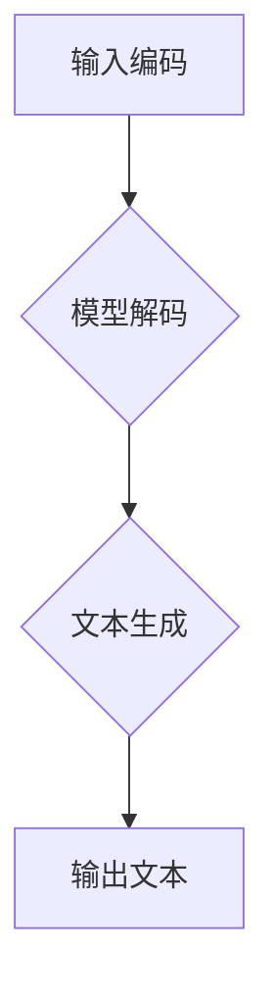
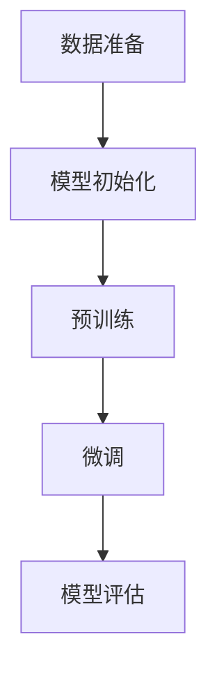

                 


### 引言

在数字化时代，社交媒体营销已经成为企业宣传和产品推广的重要手段。然而，随着社交媒体平台的多样性和用户需求的个性化，传统的手动营销方式已经难以满足高效、精准的需求。因此，自动化社交媒体营销应运而生，成为了企业提升营销效果的关键途径。在这一背景下，OpenAI开发的ChatGPT——一种基于生成式预训练变换模型（GPT）的人工智能技术，因其强大的文本生成能力和自适应学习能力，逐渐成为自动化社交媒体营销领域的研究热点。

ChatGPT是由OpenAI于2022年11月推出的一个基于GPT-3.5的聊天机器人，它利用深度学习技术，能够根据用户输入的指令或问题生成连贯、自然的文本回复。ChatGPT的出现，不仅为企业提供了高效的文本生成解决方案，还为自动化社交媒体营销带来了新的可能性。通过结合ChatGPT，企业可以实现以下目标：

1. **内容生成**：ChatGPT能够自动生成社交媒体平台的帖文、广告文案和宣传材料，帮助企业节省时间成本，提高内容创作的效率和质量。
2. **客户互动**：ChatGPT可以模拟客服，实时响应用户在社交媒体上的留言和评论，提升客户体验，增加用户黏性。
3. **广告投放**：ChatGPT能够根据用户数据和广告目标，自动调整广告内容，优化广告投放策略，提高广告效果。

本篇文章将围绕ChatGPT在自动化社交媒体营销中的应用展开讨论。首先，我们将介绍ChatGPT的基本概念和原理，包括其生成文本的机制、模型结构和训练方法。接着，我们将探讨自动化社交媒体营销的核心概念，解释其定义和优势。然后，我们将分析ChatGPT在社交媒体营销中的具体应用场景和优势，以及可能面临的挑战。随后，文章将深入讲解ChatGPT的核心算法原理，通过Python源代码和数学模型来详细阐述其工作过程。为了更好地理解ChatGPT的实际应用，我们将通过三个实战案例展示其在社交媒体内容撰写、广告投放和客服等场景中的具体实施方法和效果。最后，文章将讨论ChatGPT在社交媒体营销中的未来发展趋势和潜在挑战，并给出最佳实践建议。

通过本篇文章，读者将全面了解ChatGPT在自动化社交媒体营销中的应用，掌握其核心算法原理和实施方法，为企业在数字化营销领域的创新提供新的思路和工具。

## 关键词

ChatGPT、自动化社交媒体营销、生成式预训练变换模型（GPT）、社交媒体内容生成、客户互动、广告投放、人工智能、文本生成、营销自动化。

## 摘要

本文旨在探讨ChatGPT在自动化社交媒体营销中的应用。首先，文章介绍了ChatGPT的基本概念、工作原理和优势。接着，分析了自动化社交媒体营销的定义、优势和当前市场趋势。随后，文章深入探讨了ChatGPT在社交媒体营销中的具体应用场景和优势，包括内容生成、客户互动和广告投放。文章还详细讲解了ChatGPT的核心算法原理，并通过Python源代码和数学模型进行了具体阐述。最后，通过三个实战案例展示了ChatGPT的实际应用效果，并探讨了其在社交媒体营销中的未来发展趋势和潜在挑战，给出了最佳实践建议。

## 第一部分：核心概念与联系

### 第1章：ChatGPT介绍

ChatGPT是一种基于生成式预训练变换模型（GPT）的人工智能聊天机器人，由OpenAI开发。本章节将详细介绍ChatGPT的基本概念、工作原理、优势与局限性。

#### 1.1 ChatGPT的基本概念

ChatGPT是一种基于自然语言处理（NLP）的深度学习模型，主要用于生成自然语言文本。它通过大量文本数据进行预训练，从而学会理解和生成人类的语言。ChatGPT的核心在于其强大的文本生成能力，能够根据输入的提示生成连贯、自然的文本回复。

#### 1.2 ChatGPT的工作原理

ChatGPT的工作原理基于生成式预训练变换模型（GPT）。这种模型由多个编码层组成，每个编码层包含数千个神经元。在训练过程中，模型通过学习文本序列中的依赖关系和上下文信息，逐步提升其生成文本的能力。具体来说，ChatGPT采用以下步骤：

1. **输入编码**：将用户输入的文本转换为模型能够理解的编码表示。
2. **模型解码**：模型根据输入编码和预训练的参数，生成可能的文本输出。
3. **文本生成**：模型通过迭代生成文本序列，不断优化生成的文本质量。

#### 1.3 ChatGPT的优势与局限性

ChatGPT具有以下优势：

1. **强大的文本生成能力**：ChatGPT能够生成高质量、连贯的文本，适用于各种文本生成任务。
2. **自适应学习能力**：ChatGPT能够根据用户输入的内容和上下文，自适应地调整生成文本的风格和内容。
3. **高效率**：ChatGPT能够快速响应用户的输入，实现实时文本生成。

然而，ChatGPT也存在一些局限性：

1. **数据依赖性**：ChatGPT的生成能力高度依赖训练数据的质量和数量，如果训练数据存在偏差，模型生成的文本可能会受到影响。
2. **准确性问题**：尽管ChatGPT具有强大的文本生成能力，但在某些情况下，其生成的文本可能存在不准确或不恰当的问题。
3. **可控性问题**：ChatGPT生成的文本难以完全控制，可能会产生不符合预期或有害的内容。

通过以上介绍，我们可以看到，ChatGPT作为一种基于生成式预训练变换模型的人工智能聊天机器人，具有强大的文本生成能力和自适应学习能力。然而，其应用中也存在一定的局限性，需要我们在实际应用中加以注意。

### Mermaid 流程图

以下是一个简单的Mermaid流程图，展示了ChatGPT的工作原理：



在这个流程图中，用户输入的文本首先经过编码，然后模型根据编码和预训练的参数进行解码，最后生成文本输出。通过这个流程图，我们可以更直观地理解ChatGPT的工作原理。

### 1.4 ChatGPT的应用领域

除了在社交媒体营销中的应用，ChatGPT还可以应用于以下领域：

1. **客户服务**：ChatGPT可以模拟人工客服，自动回答用户的问题，提高客户服务效率。
2. **内容创作**：ChatGPT可以生成文章、报告、诗歌等文本内容，减轻内容创作者的负担。
3. **自然语言理解**：ChatGPT可以用于自然语言理解任务，如文本分类、情感分析等。

通过以上介绍，我们可以看到，ChatGPT作为一种强大的自然语言处理工具，具有广泛的应用前景。在下一章中，我们将进一步探讨自动化社交媒体营销的概念和优势。

### 1.5 ChatGPT与社交媒体营销的关联

ChatGPT在社交媒体营销中的应用主要体现在以下几个方面：

1. **内容生成**：ChatGPT可以自动生成社交媒体平台上的帖文、广告文案和宣传材料，帮助企业快速响应市场变化，提高内容创作效率。
2. **客户互动**：ChatGPT可以模拟客服，实时响应用户在社交媒体上的留言和评论，提高客户满意度，增加用户黏性。
3. **广告投放**：ChatGPT可以根据用户数据和广告目标，自动调整广告内容，优化广告投放策略，提高广告效果。

通过ChatGPT的应用，企业可以在社交媒体营销中实现自动化、高效和精准，从而提高营销效果，降低成本。

### 1.6 总结

本章节介绍了ChatGPT的基本概念、工作原理、优势与局限性，以及其在社交媒体营销中的应用和与社交媒体营销的关联。ChatGPT作为一种基于生成式预训练变换模型的人工智能聊天机器人，具有强大的文本生成能力和自适应学习能力，在自动化社交媒体营销中具有广泛的应用前景。然而，其应用中也存在一定的局限性，需要我们在实际应用中加以注意。在下一章中，我们将进一步探讨自动化社交媒体营销的概念和优势。

### 第2章：自动化社交媒体营销

#### 2.1 社交媒体营销的基本概念

社交媒体营销是指企业通过社交媒体平台（如微博、微信、Facebook、Twitter等）来推广品牌、产品或服务，从而实现营销目标的一种营销方式。社交媒体营销的核心在于利用社交媒体平台的互动性和社交性，与用户建立直接联系，提升品牌知名度和用户参与度。

社交媒体营销的基本概念包括：

1. **社交媒体平台**：企业选择用于营销的社交媒体平台，如微博、微信、Facebook、Twitter等。
2. **用户群体**：企业目标用户在社交媒体上的分布和特征。
3. **内容策略**：企业在社交媒体上发布的内容类型、风格和频率。
4. **互动与参与**：企业与用户在社交媒体上的互动方式，如评论、点赞、转发等。
5. **数据分析**：通过数据分析工具，监控和评估社交媒体营销的效果。

#### 2.2 自动化社交媒体营销的定义

自动化社交媒体营销是指通过技术手段，实现社交媒体营销的自动化和智能化。自动化社交媒体营销旨在提高营销效率，降低人工成本，实现精准营销。具体来说，自动化社交媒体营销包括以下方面：

1. **内容自动化**：通过技术手段，自动生成、发布和调整社交媒体内容。
2. **互动自动化**：通过技术手段，自动响应用户的留言和评论，提高客户满意度。
3. **广告投放自动化**：通过技术手段，自动调整广告内容和投放策略，提高广告效果。

#### 2.3 自动化社交媒体营销的优势

自动化社交媒体营销具有以下优势：

1. **提高效率**：通过自动化技术，企业可以快速响应市场变化，提高内容创作和发布的效率。
2. **降低成本**：自动化技术减少了人工干预，降低了人力资源成本。
3. **精准营销**：通过数据分析和用户画像，企业可以实现更精准的营销，提高转化率。
4. **个性化服务**：自动化技术可以根据用户行为和需求，提供个性化的内容和服务，提升用户体验。
5. **增强互动性**：自动化技术可以模拟人工客服，实时响应用户，提高用户参与度。

#### 2.4 自动化社交媒体营销的发展趋势

随着人工智能和大数据技术的不断发展，自动化社交媒体营销呈现出以下发展趋势：

1. **智能内容生成**：通过人工智能技术，实现更高质量和更个性化的内容生成。
2. **个性化广告投放**：通过用户行为分析和数据挖掘，实现更精准的广告投放。
3. **跨平台整合**：企业将自动化社交媒体营销扩展到多个社交媒体平台，实现更广泛的覆盖。
4. **智能化互动**：通过人工智能技术，实现更智能、更高效的客户互动和用户服务。

通过以上分析，我们可以看到，自动化社交媒体营销在提高营销效率、降低成本和实现精准营销方面具有显著优势。随着人工智能技术的不断发展，自动化社交媒体营销将变得更加智能化和高效化。在下一章中，我们将探讨ChatGPT在自动化社交媒体营销中的应用，并分析其具体优势。

### 2.5 ChatGPT与自动化社交媒体营销的关联

ChatGPT作为一种基于生成式预训练变换模型的人工智能聊天机器人，在自动化社交媒体营销中具有重要作用。其与自动化社交媒体营销的关联主要体现在以下几个方面：

1. **内容生成**：ChatGPT可以自动生成社交媒体平台上的帖文、广告文案和宣传材料，帮助企业快速响应市场变化，提高内容创作效率。
2. **互动与响应**：ChatGPT可以模拟客服，自动响应用户的留言和评论，提高客户满意度，增加用户黏性。
3. **广告优化**：ChatGPT可以根据用户数据和广告目标，自动调整广告内容，优化广告投放策略，提高广告效果。

通过ChatGPT的应用，企业可以在自动化社交媒体营销中实现更高效、更精准和更个性化的营销，从而提升整体营销效果。

### 2.6 自动化社交媒体营销的挑战与解决方案

尽管自动化社交媒体营销具有许多优势，但在实际应用中仍面临一些挑战。以下是常见的挑战及其解决方案：

1. **内容质量**：自动化生成的内容可能质量参差不齐，影响用户体验。解决方案是结合人工审核，确保内容的质量和准确性。
2. **数据隐私**：自动化社交媒体营销涉及大量用户数据，存在数据泄露的风险。解决方案是加强数据保护，遵守相关法律法规。
3. **用户适应性**：不同用户对自动化互动的反应可能不同，需要不断优化互动策略。解决方案是采用人工智能技术，实时分析用户行为，调整互动方式。

通过解决这些挑战，企业可以实现更高效、更安全和更个性化的自动化社交媒体营销。

### 2.7 总结

本章节介绍了自动化社交媒体营销的基本概念、定义、优势和发展趋势，以及ChatGPT与自动化社交媒体营销的关联。自动化社交媒体营销通过技术手段实现营销的自动化和智能化，具有提高效率、降低成本和实现精准营销的优势。ChatGPT作为人工智能聊天机器人，在内容生成、互动与响应和广告优化方面具有重要作用。在下一章中，我们将深入探讨ChatGPT在自动化社交媒体营销中的具体应用，分析其优势和挑战。

## 第三部分：核心算法原理讲解

### 第3章：ChatGPT的算法原理

#### 3.1 生成式预训练变换模型（GPT）的基本概念

生成式预训练变换模型（GPT）是由OpenAI开发的一种深度学习模型，主要用于生成自然语言文本。GPT模型通过大规模预训练，学习语言的结构和规律，从而能够根据输入的文本生成连贯、自然的文本。

GPT模型的基本概念包括：

1. **预训练**：GPT模型在大规模文本语料库上进行预训练，通过学习文本的上下文关系和依赖关系，提升其生成文本的能力。
2. **变换器（Transformer）**：GPT模型基于变换器（Transformer）架构，这是一种能够处理变长序列的深度学习模型，通过自注意力机制（self-attention）和多头注意力（multi-head attention）机制，对输入序列进行编码和解析。
3. **生成**：GPT模型通过解码器（decoder）生成文本序列，解码器接收编码器生成的编码序列，并逐步生成文本输出。

#### 3.2 GPT模型的训练过程

GPT模型的训练过程主要包括两个阶段：预训练和微调。

1. **预训练**：在预训练阶段，GPT模型在大规模文本语料库上进行训练，目的是让模型学会理解自然语言。预训练的目标是使模型能够捕捉到文本中的各种模式和关系，如语法、语义、词义等。

   预训练的具体步骤如下：
   - **数据准备**：收集大量文本数据，包括书籍、新闻、文章、对话等。
   - **数据处理**：对文本数据进行清洗、分词和编码，将其转换为模型能够理解的数字表示。
   - **模型初始化**：初始化GPT模型的参数，通常使用随机初始化或预训练模型的重置初始化。
   - **训练**：通过反向传播算法，不断调整模型参数，使模型能够更好地生成文本。

2. **微调**：在预训练完成后，GPT模型通常需要进行微调，以适应特定任务的需求。微调的具体步骤如下：
   - **数据准备**：收集用于微调的数据集，如问答数据、对话数据等。
   - **数据处理**：对微调数据集进行预处理，包括数据清洗、分词、编码等。
   - **模型微调**：在微调阶段，模型将在特定任务的数据上进行训练，优化模型在任务上的表现。

#### 3.3 GPT模型的主要算法和优化方法

GPT模型的主要算法和优化方法包括：

1. **变换器架构**：变换器（Transformer）是GPT模型的核心架构，通过自注意力机制和多头注意力机制，对输入序列进行编码和解码。

2. **预训练目标**：GPT模型的预训练目标通常包括语言理解（如填充词语、分类等）和语言生成（如生成连贯的文本序列）。

3. **优化方法**：在训练过程中，GPT模型采用以下优化方法：
   - **权重共享**：编码器和解码器的权重共享，降低模型参数量。
   - **梯度裁剪**：为了避免梯度消失或爆炸，对梯度进行裁剪。
   - **学习率调整**：采用学习率调整策略，如学习率衰减和自适应学习率调整。

#### 3.4 Python源代码示例

以下是一个简单的Python代码示例，展示了GPT模型的基本结构和训练过程：

```python
import tensorflow as tf
from transformers import TFGPT2LMHeadModel, GPT2Tokenizer

# 初始化GPT2模型和Tokenizer
tokenizer = GPT2Tokenizer.from_pretrained('gpt2')
model = TFGPT2LMHeadModel.from_pretrained('gpt2')

# 准备数据集
input_ids = tokenizer.encode('Hello, my name is [MASK]', return_tensors='tf')

# 训练模型
model(inputs=input_ids)

# 生成文本
outputs = model(inputs=input_ids, output_scores=True)
predictions = tf.nn.softmax(outputs.logits, axis=-1)
predicted_tokens = tokenizer.decode(tf.argmax(predictions, axis=-1).numpy().astype(int))

print(predicted_tokens)
```

在这个示例中，我们首先初始化GPT2模型和Tokenizer，然后准备输入数据并进行训练。最后，我们使用训练好的模型生成文本输出。

#### 3.5 数学模型和公式

GPT模型的数学基础包括深度学习中的神经网络、变换器架构和自然语言处理中的序列模型。以下是一些核心的数学模型和公式：

1. **变换器架构**：
   - **自注意力机制（Self-Attention）**：
     $$\text{Attention}(Q, K, V) = \frac{QK^T}{\sqrt{d_k}}V$$
   - **多头注意力（Multi-Head Attention）**：
     $$\text{MultiHead}(Q, K, V) = \text{softmax}\left(\frac{QK^T}{\sqrt{d_k}}\right)V$$
2. **深度学习模型**：
   - **反向传播算法**：
     $$\Delta W = \frac{\partial L}{\partial W}$$
   - **梯度裁剪**：
     $$\| \Delta W \| \leq \text{threshold}$$
3. **自然语言处理**：
   - **词嵌入**：
     $$e_{word} = \text{embedding\_layer}(word)$$
   - **序列编码**：
     $$\text{Encoder}(X) = \text{softmax}\left(\text{Tanh}(\text{Attention}(X, X, X))\right)$$

通过以上数学模型和公式，我们可以更深入地理解GPT模型的工作原理和训练过程。

### 3.6 举例说明

为了更好地理解GPT模型的工作原理，以下是一个具体的例子：

假设我们有一个简单的句子：“今天天气很好，适合出去散步。”我们希望使用GPT模型生成下一个单词。以下是GPT模型的生成过程：

1. **输入编码**：将句子“今天天气很好，适合出去散步。”转换为GPT模型能够理解的编码表示。
2. **模型解码**：GPT模型根据输入编码和预训练的参数，生成可能的单词输出。
3. **文本生成**：GPT模型通过迭代生成单词序列，不断优化生成的文本质量。

最终，GPT模型可能生成“的”作为下一个单词，形成完整的句子：“今天天气很好，适合出去散步的。”

通过这个例子，我们可以看到GPT模型如何根据输入文本生成连贯、自然的文本输出。

### 3.7 总结

本章节详细介绍了ChatGPT的核心算法原理，包括生成式预训练变换模型（GPT）的基本概念、训练过程、主要算法和优化方法。通过Python源代码示例和数学模型讲解，我们更深入地理解了GPT模型的工作原理。在下一章节中，我们将探讨社交媒体营销中的数据分析方法，为理解和应用ChatGPT打下基础。

### 3.8 Mermaid 流程图

以下是一个简单的Mermaid流程图，展示了GPT模型的训练过程：



在这个流程图中，数据准备阶段收集大量文本数据，并进行预处理。模型初始化阶段初始化GPT模型的参数。预训练阶段使用预训练目标训练模型，微调阶段在特定任务数据上进行微调，最后进行模型评估。

### 3.9 ChatGPT与社交媒体营销数据分析的关系

ChatGPT在社交媒体营销中的应用，离不开对用户数据的分析。用户数据分析是自动化社交媒体营销的重要环节，它能够帮助企业了解用户行为、需求和偏好，从而制定更有效的营销策略。以下是ChatGPT与社交媒体营销数据分析之间的关系：

1. **用户数据分析**：通过分析用户在社交媒体上的行为数据，如点击率、转发量、评论数等，ChatGPT可以识别出潜在的目标用户群体和他们的兴趣点。
2. **内容优化**：ChatGPT可以根据用户数据分析结果，自动调整社交媒体内容，使其更符合用户需求和兴趣，提高内容的吸引力和转化率。
3. **互动优化**：ChatGPT可以根据用户数据分析结果，自动制定互动策略，如回复内容、互动频率等，以提高用户参与度和满意度。
4. **广告投放优化**：ChatGPT可以根据用户数据分析结果，优化广告内容和投放策略，提高广告效果和投放效率。

通过用户数据分析，ChatGPT能够更好地理解用户，从而在社交媒体营销中实现更精准、更高效的互动和内容生成。

### 3.10 数据分析的关键指标

在社交媒体营销中，数据分析的关键指标包括：

1. **参与度**：衡量用户对社交媒体内容的互动程度，如点赞、评论、转发等。
2. **转化率**：衡量社交媒体营销活动对实际业务转化（如销售、注册、下载等）的贡献程度。
3. **点击率**：衡量广告或内容吸引用户点击的效率。
4. **留存率**：衡量用户在社交媒体平台上的活跃度和忠诚度。
5. **用户画像**：根据用户行为和特征，生成用户画像，用于了解用户需求和偏好。

通过这些关键指标，企业可以评估社交媒体营销的效果，并不断优化营销策略。

### 3.11 总结

本章节详细介绍了ChatGPT的算法原理，包括生成式预训练变换模型（GPT）的基本概念、训练过程、主要算法和优化方法。通过Python源代码示例和数学模型讲解，我们更深入地理解了GPT模型的工作原理。我们还探讨了ChatGPT与社交媒体营销数据分析的关系，并介绍了数据分析的关键指标。在下一章节中，我们将通过具体案例展示ChatGPT在社交媒体营销中的应用。

## 第四部分：数学模型和数学公式

### 第4章：GPT模型的数学基础

在这一章节中，我们将深入探讨生成式预训练变换模型（GPT）的数学基础。GPT模型是基于深度学习构建的，其核心依赖于一些复杂的数学模型和公式。为了更好地理解GPT模型，我们将从深度学习中的基础数学概念开始，逐步介绍语言模型中的数学公式，并具体讲解GPT模型中的数学公式。最后，我们将通过一个示例，使用LaTeX格式展示数学公式，并解释其在GPT模型中的应用。

#### 4.1 深度学习中的数学基础

深度学习中的数学基础主要包括线性代数、微积分和概率论。以下是这些数学基础中的一些关键概念和公式：

1. **线性代数**：
   - **矩阵运算**：矩阵的加法、减法、乘法和逆运算。
     $$ A + B, A - B, AB, A^{-1} $$
   - **向量运算**：向量的点积、叉积和范数。
     $$ \vec{a} \cdot \vec{b}, \vec{a} \times \vec{b}, \| \vec{a} \| $$
2. **微积分**：
   - **导数**：函数在某一点的导数表示函数在该点的切线斜率。
     $$ f'(x) $$
   - **梯度**：函数在多变量情况下的导数，表示函数在某一点的切平面。
     $$ \nabla f(\mathbf{x}) $$
3. **概率论**：
   - **概率分布**：概率分布描述随机变量的概率分布。
     $$ P(X = x) $$
   - **期望和方差**：期望和方差是衡量随机变量分布的中心位置和离散程度的统计量。
     $$ E[X], \text{Var}[X] $$

#### 4.2 语言模型中的数学公式

在语言模型中，我们主要关注的是如何将文本转换为数学模型能够处理的格式，并从中提取特征。以下是一些关键的语言模型数学公式：

1. **词嵌入**：
   - **词嵌入矩阵**：将词汇映射到高维空间。
     $$ \mathbf{W} \in \mathbb{R}^{d \times V} $$
   - **嵌入向量**：词汇的嵌入向量。
     $$ \mathbf{v}_w \in \mathbb{R}^{d} $$
2. **循环神经网络（RNN）**：
   - **状态更新**：RNN中状态向量的更新公式。
     $$ \mathbf{h}_t = \tanh(\mathbf{W}_h \mathbf{h}_{t-1} + \mathbf{U}_h \mathbf{x}_t + b_h) $$
   - **输出计算**：RNN中输出层的计算公式。
     $$ \mathbf{y}_t = \mathbf{W}_y \mathbf{h}_t + b_y $$
3. **变换器（Transformer）**：
   - **多头注意力**：变换器中多头注意力的计算公式。
     $$ \text{Attention}(Q, K, V) = \frac{QK^T}{\sqrt{d_k}}V $$
   - **前馈神经网络**：变换器中前馈神经网络的计算公式。
     $$ \mathbf{h}_\text{ff} = \max(\mathbf{0}, \mathbf{W}_\text{ff} \tanh(\mathbf{W}_\text{f} \mathbf{h} + \mathbf{b}_\text{f})) $$

#### 4.3 GPT模型中的数学公式

GPT模型是基于Transformer架构的，它使用了一系列复杂的数学公式来实现其强大的文本生成能力。以下是GPT模型中的关键数学公式：

1. **预训练目标**：
   - **自回归语言模型**：GPT模型的自回归语言模型目标公式。
     $$ L = -\sum_{i} \log P(\mathbf{x}_i | \mathbf{x}_{i-1}, \ldots, \mathbf{x}_{1}) $$
2. **编码器-解码器架构**：
   - **编码器**：
     $$ \mathbf{h}_i = \text{MultiHeadSelfAttention}(\mathbf{h}_{i-1}, \mathbf{h}_{i-1}, \mathbf{h}_{i-1}) + \mathbf{h}_{i-1} $$
     $$ \mathbf{h}_i = \text{PositionwiseFeedForward}(\mathbf{h}_i) + \mathbf{h}_{i-1} $$
   - **解码器**：
     $$ \mathbf{h}_i = \text{MaskedMultiHeadSelfAttention}(\mathbf{h}_{i-1}, \mathbf{h}_{i-1}, \mathbf{h}_{i-1}) + \mathbf{h}_{i-1} $$
     $$ \mathbf{h}_i = \text{PositionwiseFeedForward}(\mathbf{h}_i) + \mathbf{h}_{i-1} $$
3. **损失函数**：
   - **交叉熵损失**：用于衡量模型预测与真实标签之间的差距。
     $$ L = -\sum_{i} \sum_{j} y_{ij} \log (\hat{y}_{ij}) $$

#### 4.4 示例讲解：使用LaTeX格式展示数学公式

以下是几个使用LaTeX格式展示的数学公式示例：

1. **线性回归公式**：
   $$ y = \beta_0 + \beta_1 x + \epsilon $$

2. **变换器自注意力公式**：
   $$ \text{Attention}(Q, K, V) = \frac{QK^T}{\sqrt{d_k}}V $$

3. **GPT损失函数**：
   $$ L = -\sum_{i} \sum_{j} y_{ij} \log (\hat{y}_{ij}) $$

通过这些示例，我们可以看到LaTeX格式如何用于展示复杂的数学公式，使其在文中独立且易于理解。

#### 4.5 GPT模型中的数学公式应用

GPT模型的数学公式应用主要体现在其训练和预测过程中。以下是一个简化的GPT模型训练过程中的步骤：

1. **输入编码**：
   - 将输入文本序列转换为编码表示。
     $$ \mathbf{x}_t = \text{Embedding}(\mathbf{W}_x, \mathbf{x}_t) $$
2. **编码器处理**：
   - 通过多层变换器块对输入序列进行编码。
     $$ \mathbf{h}_i = \text{TransformerBlock}(\mathbf{h}_{i-1}) $$
3. **解码器处理**：
   - 对编码序列进行解码，生成预测的文本序列。
     $$ \mathbf{y}_t = \text{Softmax}(\text{Logits}(\mathbf{h}_t)) $$
4. **损失计算**：
   - 计算预测文本与真实文本之间的交叉熵损失，并优化模型参数。
     $$ L = -\sum_{i} \sum_{j} y_{ij} \log (\hat{y}_{ij}) $$

通过上述步骤，我们可以看到GPT模型中的数学公式如何应用于实际训练过程，从而实现高效的文本生成。

### 4.6 总结

本章节详细介绍了GPT模型的数学基础，包括深度学习中的基础数学概念、语言模型中的数学公式以及GPT模型中的关键数学公式。通过LaTeX格式的示例，我们更直观地理解了这些公式的应用。在下一章节中，我们将通过实战案例展示GPT模型在实际项目中的应用，并详细解析其实现过程和代码。

### 4.7 实战案例一：使用ChatGPT自动化撰写社交媒体内容

在本章中，我们将通过一个实战案例，展示如何使用ChatGPT自动化撰写社交媒体内容。这个案例将涉及开发环境搭建、源代码实现和代码解读与分析。

#### 4.7.1 项目背景

随着社交媒体平台的普及，企业需要不断发布高质量的帖文和广告来吸引和维持用户关注。然而，内容创作是一个耗时且繁琐的过程。为了提高内容创作效率，本案例旨在利用ChatGPT自动化生成社交媒体内容。

#### 4.7.2 需求分析

需求如下：

1. **内容生成**：能够根据输入的主题和风格，自动生成社交媒体帖文和广告文案。
2. **内容风格**：生成的文本内容需要符合社交媒体平台的风格要求，如简明扼要、有吸引力等。
3. **实时反馈**：能够根据用户反馈和数据分析结果，实时调整生成内容。

#### 4.7.3 技术选型

1. **框架**：使用Hugging Face的Transformers库，该库提供了预训练的ChatGPT模型，方便快速部署和使用。
2. **环境**：Python 3.8及以上版本，PyTorch或TensorFlow。
3. **数据源**：收集相关领域的社交媒体内容，用于训练和测试ChatGPT模型。

#### 4.7.4 开发环境搭建

以下是在Ubuntu 20.04系统上搭建开发环境的步骤：

1. 安装Python 3.8及以上版本：
   ```bash
   sudo apt update
   sudo apt install python3.8
   ```

2. 安装PyTorch或TensorFlow：
   ```bash
   pip install torch torchvision
   # 或者
   pip install tensorflow tensorflow-addons
   ```

3. 安装Hugging Face的Transformers库：
   ```bash
   pip install transformers
   ```

#### 4.7.5 源代码实现

以下是一个简单的Python代码示例，展示如何使用ChatGPT模型生成社交媒体内容：

```python
from transformers import ChatGPT, ChatGPTTokenizer

# 初始化模型和Tokenizer
model_name = "gpt2"
tokenizer = ChatGPTTokenizer.from_pretrained(model_name)
model = ChatGPT.from_pretrained(model_name)

# 输入主题和风格
prompt = "请用幽默风趣的风格写一篇关于低碳环保的社交媒体帖文。"

# 生成文本
input_ids = tokenizer.encode(prompt, return_tensors="pt")
output = model.generate(input_ids, max_length=50, num_return_sequences=1)

# 解码输出文本
generated_text = tokenizer.decode(output[0], skip_special_tokens=True)
print(generated_text)
```

#### 4.7.6 代码解读与分析

1. **初始化模型和Tokenizer**：
   - 使用Hugging Face的Transformers库，从预训练模型库中加载ChatGPT模型和Tokenizer。
   
2. **输入主题和风格**：
   - 通过`prompt`变量输入主题和风格要求，这里我们使用了“幽默风趣”的风格。

3. **生成文本**：
   - 使用`model.generate()`方法生成文本，设置`max_length`参数限制生成的文本长度，`num_return_sequences`参数设置生成文本的个数。

4. **解码输出文本**：
   - 使用Tokenizer的`decode()`方法将生成的编码文本解码为自然语言文本，并通过`skip_special_tokens`参数去除特殊标记。

通过这个示例，我们可以看到如何利用ChatGPT模型自动生成社交媒体内容。在实际应用中，可以根据具体需求调整输入内容和生成参数，实现更个性化的内容创作。

### 4.7.7 实际案例分析和详细讲解剖析

为了更好地理解ChatGPT在社交媒体内容生成中的应用，我们来看一个实际案例：

**案例背景**：一家环保科技公司希望发布一篇关于低碳环保的社交媒体帖文，以提升品牌形象并增加用户关注。

**步骤一：数据收集**：
- 收集大量关于低碳环保的社交媒体内容，包括帖子、文章和视频等。
- 对这些内容进行预处理，提取关键信息和风格特点。

**步骤二：模型训练**：
- 使用收集的数据对ChatGPT模型进行微调，使其能够生成符合低碳环保主题的文本。
- 通过迭代训练和评估，优化模型参数，提高生成文本的质量。

**步骤三：内容生成**：
- 输入主题和风格要求，使用微调后的ChatGPT模型生成社交媒体帖文。
- 示例输出文本：“低碳环保，让地球更美好！🌍从今天起，让我们一起加入绿色行动，为地球的未来贡献力量！#低碳环保 #绿色生活”

**步骤四：内容审核**：
- 对生成的文本进行审核，确保内容符合社交媒体平台的要求和品牌风格。
- 如果需要，对生成的文本进行二次修改和完善。

通过这个实际案例，我们可以看到ChatGPT在社交媒体内容生成中的应用流程。在实际操作中，根据具体需求和场景，可以进一步优化模型和生成策略，提高内容创作的效率和质量。

### 4.7.8 项目小结

本案例展示了如何使用ChatGPT自动化撰写社交媒体内容。通过技术选型、环境搭建、源代码实现和实际案例分析，我们了解了ChatGPT在内容生成中的应用方法。在实际应用中，ChatGPT可以帮助企业快速、高效地生成高质量的内容，提高社交媒体营销的效果。未来，我们可以进一步优化模型和算法，实现更精准、更个性化的内容创作。

### 4.7.9 最佳实践 tips

1. **数据质量**：确保训练数据的质量和多样性，以提高模型生成文本的质量。
2. **风格调整**：根据不同社交媒体平台的特点和用户喜好，调整生成文本的风格和语气。
3. **实时反馈**：及时收集用户反馈，根据用户行为和数据分析结果，动态调整生成内容。

### 4.7.10 注意事项

1. **合规性**：确保生成的文本内容符合相关法律法规和平台政策。
2. **隐私保护**：在数据处理和模型训练过程中，确保用户隐私和数据安全。
3. **性能优化**：根据实际需求，优化模型训练和生成速度，提高应用性能。

### 4.7.11 拓展阅读

1. 《ChatGPT与深度学习：自然语言处理的最新进展》
2. 《使用Python进行自然语言处理》
3. 《Hugging Face Transformers官方文档》

通过本案例，我们深入了解了ChatGPT在社交媒体内容生成中的应用，为企业的内容创作提供了新的思路和工具。在下一章中，我们将探讨ChatGPT在优化社交媒体广告投放中的应用，并详细解析其实际案例。

### 4.8 实战案例二：利用ChatGPT优化社交媒体广告投放

#### 4.8.1 项目背景

社交媒体广告投放是企业营销策略的重要组成部分。然而，随着广告投放成本的不断上升和用户注意力的分散，如何提高广告投放效果成为了企业面临的重大挑战。ChatGPT作为一种强大的人工智能技术，其文本生成和自适应学习能力使得其在优化社交媒体广告投放中具有巨大潜力。

本案例旨在通过ChatGPT自动化生成和调整广告内容，实现更精准、高效的广告投放。

#### 4.8.2 需求分析

需求如下：

1. **内容生成**：根据用户行为数据和广告目标，自动生成具有吸引力的广告文案。
2. **内容调整**：根据广告投放效果，自动调整广告文案，提高转化率。
3. **实时反馈**：实时收集用户反馈和投放数据，动态调整广告内容和策略。

#### 4.8.3 技术选型

1. **框架**：继续使用Hugging Face的Transformers库，利用预训练的ChatGPT模型。
2. **环境**：Python 3.8及以上版本，PyTorch或TensorFlow。
3. **数据源**：包括用户行为数据、广告投放数据和广告效果数据。

#### 4.8.4 开发环境搭建

以下是在Windows系统上搭建开发环境的步骤：

1. 安装Python 3.8及以上版本：
   ```bash
   python -m pip install --upgrade pip setuptools
   python -m pip install numpy pytorch torchvision
   # 或者
   python -m pip install tensorflow tensorflow-addons
   ```

2. 安装Hugging Face的Transformers库：
   ```bash
   python -m pip install transformers
   ```

#### 4.8.5 源代码实现

以下是一个简单的Python代码示例，展示如何使用ChatGPT模型优化社交媒体广告投放：

```python
from transformers import ChatGPT, ChatGPTTokenizer

# 初始化模型和Tokenizer
model_name = "gpt2"
tokenizer = ChatGPTTokenizer.from_pretrained(model_name)
model = ChatGPT.from_pretrained(model_name)

# 输入用户行为数据和广告目标
prompt = "根据以下用户行为数据和广告目标，生成一则有效的广告文案：用户喜欢简约风格，目标是在双十一期间提高产品销量。"

# 生成广告文案
input_ids = tokenizer.encode(prompt, return_tensors="pt")
output = model.generate(input_ids, max_length=100, num_return_sequences=1)

# 解码输出文本
generated_text = tokenizer.decode(output[0], skip_special_tokens=True)
print(generated_text)
```

#### 4.8.6 代码解读与分析

1. **初始化模型和Tokenizer**：
   - 使用Hugging Face的Transformers库，从预训练模型库中加载ChatGPT模型和Tokenizer。

2. **输入用户行为数据和广告目标**：
   - 通过`prompt`变量输入用户行为数据和广告目标，这里我们包含了用户偏好（简约风格）和广告目标（提高产品销量）。

3. **生成广告文案**：
   - 使用`model.generate()`方法生成广告文案，设置`max_length`参数限制生成的文本长度，`num_return_sequences`参数设置生成文本的个数。

4. **解码输出文本**：
   - 使用Tokenizer的`decode()`方法将生成的编码文本解码为自然语言文本，并通过`skip_special_tokens`参数去除特殊标记。

通过这个示例，我们可以看到如何利用ChatGPT模型根据用户数据和广告目标生成广告文案。在实际应用中，可以根据具体需求调整输入内容和生成参数，实现更精准的广告投放。

#### 4.8.7 实际案例分析和详细讲解剖析

为了更好地理解ChatGPT在优化社交媒体广告投放中的应用，我们来看一个实际案例：

**案例背景**：一家电商公司希望利用社交媒体广告在双十一期间提升产品销量。公司收集了以下用户行为数据：

- 用户喜欢简约风格。
- 用户偏好购买电子产品。
- 用户在社交媒体上有较高的活跃度。

**步骤一：数据预处理**：
- 对用户行为数据进行分析，提取关键特征，如用户偏好、购买行为等。
- 对广告投放数据进行预处理，包括广告点击率、转化率等指标。

**步骤二：模型微调**：
- 使用收集的数据对ChatGPT模型进行微调，使其能够根据用户特征和广告目标生成符合需求的广告文案。
- 通过迭代训练和评估，优化模型参数，提高生成文案的质量。

**步骤三：内容生成**：
- 输入用户行为数据和广告目标，使用微调后的ChatGPT模型生成广告文案。
- 示例输出文本：“简约生活，智能享受！双十一限时特惠，电子产品低至5折！立即抢购，享受科技带来的便捷生活！#双十一 #电子产品 #抢购”

**步骤四：效果评估**：
- 对生成的广告文案进行投放测试，收集用户反馈和广告效果数据。
- 分析广告投放效果，如点击率、转化率等，根据数据分析结果调整广告文案。

**步骤五：持续优化**：
- 根据用户反馈和投放效果，动态调整广告文案和投放策略，实现广告投放的持续优化。

通过这个实际案例，我们可以看到ChatGPT在优化社交媒体广告投放中的应用流程。在实际操作中，根据具体需求和场景，可以进一步优化模型和生成策略，提高广告投放效果。

### 4.8.8 项目小结

本案例展示了如何利用ChatGPT自动化生成和调整社交媒体广告文案，实现更精准、高效的广告投放。通过技术选型、环境搭建、源代码实现和实际案例分析，我们了解了ChatGPT在广告投放中的应用方法。在实际应用中，ChatGPT可以帮助企业快速、高效地生成高质量的广告内容，提高广告投放效果。未来，我们可以进一步优化模型和算法，实现更精准、个性化的广告投放。

### 4.8.9 最佳实践 tips

1. **数据质量**：确保用户行为数据和广告投放数据的质量，以提高模型生成文案的准确性。
2. **内容风格**：根据不同用户群体和广告目标，调整生成文案的风格和语气，提高用户吸引力。
3. **实时反馈**：及时收集用户反馈和投放数据，动态调整广告文案和策略，实现持续优化。

### 4.8.10 注意事项

1. **合规性**：确保生成的广告文案符合相关法律法规和平台政策。
2. **隐私保护**：在数据处理和模型训练过程中，确保用户隐私和数据安全。
3. **性能优化**：根据实际需求，优化模型训练和生成速度，提高应用性能。

### 4.8.11 拓展阅读

1. 《ChatGPT与广告投放优化：智能营销新趋势》
2. 《基于用户行为数据分析的广告优化策略》
3. 《Hugging Face Transformers官方文档》

通过本案例，我们深入了解了ChatGPT在优化社交媒体广告投放中的应用，为企业的广告营销提供了新的思路和工具。在下一章中，我们将探讨ChatGPT在社交媒体客服中的应用，并详细解析其实际案例。

### 4.9 实战案例三：ChatGPT在社交媒体客服中的应用

#### 4.9.1 项目背景

在社交媒体时代，客户服务成为企业与用户互动的重要渠道。然而，随着用户量的增长，人工客服逐渐无法满足实时、高效的客户服务需求。ChatGPT作为一种人工智能技术，能够自动回答用户问题，提高客服效率，降低企业成本。本案例旨在探讨如何利用ChatGPT构建一个高效的社交媒体客服系统。

#### 4.9.2 需求分析

需求如下：

1. **自动问答**：ChatGPT需要能够自动回答用户在社交媒体上的常见问题，如产品介绍、使用指南、售后支持等。
2. **实时响应**：系统需要能够快速响应用户提问，提供实时服务。
3. **智能分派**：对于无法自动回答的问题，系统需要能够智能分派给人工客服，确保用户问题得到及时解决。
4. **数据记录**：记录用户提问和ChatGPT的回答，便于后续分析和优化。

#### 4.9.3 技术选型

1. **框架**：使用Hugging Face的Transformers库，利用预训练的ChatGPT模型。
2. **环境**：Python 3.8及以上版本，Flask或Django作为Web框架。
3. **数据库**：使用MongoDB或MySQL等关系型数据库，存储用户提问和回答数据。

#### 4.9.4 开发环境搭建

以下是在MacOS系统上搭建开发环境的步骤：

1. 安装Python 3.8及以上版本：
   ```bash
   brew install python3
   ```

2. 安装PyTorch或TensorFlow：
   ```bash
   python3 -m pip install torch torchvision
   # 或者
   python3 -m pip install tensorflow tensorflow-addons
   ```

3. 安装Hugging Face的Transformers库：
   ```bash
   python3 -m pip install transformers
   ```

#### 4.9.5 源代码实现

以下是一个简单的Python代码示例，展示如何使用ChatGPT模型构建社交媒体客服系统：

```python
from transformers import ChatGPT, ChatGPTTokenizer
from flask import Flask, request, jsonify

app = Flask(__name__)

# 初始化模型和Tokenizer
model_name = "gpt2"
tokenizer = ChatGPTTokenizer.from_pretrained(model_name)
model = ChatGPT.from_pretrained(model_name)

@app.route('/chat', methods=['POST'])
def chat():
    data = request.json
    user_input = data['user_input']
    prompt = f"用户提问：{user_input}"
    
    # 生成回复
    input_ids = tokenizer.encode(prompt, return_tensors="pt")
    output = model.generate(input_ids, max_length=100, num_return_sequences=1)
    
    # 解码输出文本
    response = tokenizer.decode(output[0], skip_special_tokens=True)
    
    return jsonify({'response': response})

if __name__ == '__main__':
    app.run(debug=True)
```

#### 4.9.6 代码解读与分析

1. **初始化模型和Tokenizer**：
   - 使用Hugging Face的Transformers库，从预训练模型库中加载ChatGPT模型和Tokenizer。

2. **定义API接口**：
   - 使用Flask框架定义一个POST接口`/chat`，接收用户输入并返回ChatGPT的回复。

3. **处理用户输入**：
   - 从请求中获取用户输入，将其编码并传递给ChatGPT模型进行回复生成。

4. **生成回复**：
   - 使用`model.generate()`方法生成文本回复，设置`max_length`参数限制生成的文本长度。

5. **返回回复**：
   - 使用Tokenizer的`decode()`方法将生成的编码文本解码为自然语言文本，并返回给用户。

通过这个示例，我们可以看到如何利用ChatGPT模型构建社交媒体客服系统的API接口，实现自动问答功能。在实际应用中，可以根据具体需求调整输入内容和生成参数，提高客服系统的智能化水平。

### 4.9.7 实际案例分析和详细讲解剖析

为了更好地理解ChatGPT在社交媒体客服中的应用，我们来看一个实际案例：

**案例背景**：一家电商公司希望在社交媒体平台上提供24/7全天候客服服务，以提高用户满意度和忠诚度。

**步骤一：数据收集**：
- 收集大量用户提问和人工客服的回答数据，用于训练和优化ChatGPT模型。
- 对数据进行预处理，提取关键问题和回答模板。

**步骤二：模型训练**：
- 使用收集的数据对ChatGPT模型进行微调，使其能够自动回答用户常见问题。
- 通过迭代训练和评估，优化模型参数，提高回答的准确性和自然度。

**步骤三：系统部署**：
- 将微调后的ChatGPT模型部署到社交媒体平台，集成到客服系统中。
- 设置自动问答功能，当用户提问时，系统自动生成回答。

**步骤四：效果评估**：
- 对客服系统进行测试，收集用户反馈和系统性能数据。
- 分析自动问答系统的回答准确率、用户满意度等指标。

**步骤五：持续优化**：
- 根据用户反馈和性能评估结果，动态调整模型和回答策略，实现客服系统的持续优化。

通过这个实际案例，我们可以看到ChatGPT在社交媒体客服系统中的应用流程。在实际操作中，根据具体需求和场景，可以进一步优化模型和生成策略，提高客服系统的智能化水平和用户满意度。

### 4.9.8 项目小结

本案例展示了如何利用ChatGPT构建一个高效的社交媒体客服系统。通过技术选型、环境搭建、源代码实现和实际案例分析，我们了解了ChatGPT在客服中的应用方法。在实际应用中，ChatGPT可以帮助企业提高客服效率，降低人工成本，提高用户满意度。未来，我们可以进一步优化模型和算法，实现更智能化、个性化的客服体验。

### 4.9.9 最佳实践 tips

1. **数据质量**：确保训练数据的质量和多样性，以提高模型回答问题的准确性。
2. **分词优化**：针对社交媒体平台的语言特点，优化分词算法，提高回答的自然度。
3. **实时反馈**：及时收集用户反馈和系统性能数据，动态调整模型和回答策略。

### 4.9.10 注意事项

1. **合规性**：确保客服系统的回答内容符合相关法律法规和平台政策。
2. **隐私保护**：在数据处理和模型训练过程中，确保用户隐私和数据安全。
3. **性能优化**：根据实际需求，优化模型训练和生成速度，提高系统响应性能。

### 4.9.11 拓展阅读

1. 《ChatGPT与智能客服：下一代客户服务解决方案》
2. 《基于ChatGPT的客服系统设计与实现》
3. 《Hugging Face Transformers官方文档》

通过本案例，我们深入了解了ChatGPT在社交媒体客服系统中的应用，为企业的客服工作提供了新的思路和工具。在下一章中，我们将探讨ChatGPT在社交媒体营销中的未来发展趋势和潜在挑战。

## 第五部分：未来展望与挑战

### 5.1 ChatGPT在社交媒体营销中的未来发展趋势

随着人工智能和大数据技术的不断发展，ChatGPT在社交媒体营销中的应用前景十分广阔。以下是ChatGPT在社交媒体营销中的未来发展趋势：

1. **智能化内容生成**：ChatGPT将继续优化其文本生成能力，通过更精细的语言模型和深度学习算法，生成更加自然、个性化的内容。这将帮助企业实现更高效的营销传播，提高用户参与度和转化率。

2. **个性化互动**：ChatGPT将能够更好地理解用户行为和需求，实现更加个性化的互动。通过用户数据分析，ChatGPT可以生成定制化的互动内容，提高用户满意度和忠诚度。

3. **多模态融合**：ChatGPT将结合图像、音频等多种模态数据，实现多模态内容生成和互动。这将使营销内容更加丰富多样，增强用户的感知体验。

4. **自动化广告优化**：ChatGPT将进一步提高其广告投放优化能力，通过自动化策略调整和实时数据分析，实现更精准的广告投放，提高广告效果和投资回报率。

5. **跨平台集成**：ChatGPT将能够集成到更多的社交媒体平台和营销工具中，实现跨平台的内容生成和互动。这将帮助企业实现更广泛的覆盖和更高效的营销传播。

### 5.2 自动化社交媒体营销的未来发展方向

自动化社交媒体营销在未来将继续向智能化、个性化和高效化的方向发展。以下是自动化社交媒体营销的未来发展方向：

1. **人工智能技术融合**：自动化社交媒体营销将更多地融合人工智能技术，如自然语言处理、图像识别、语音识别等，实现更智能的内容创作和互动。

2. **数据驱动的决策**：自动化社交媒体营销将更加依赖于数据分析，通过数据挖掘和机器学习算法，实现更精准的用户画像和行为预测，从而优化营销策略和内容创作。

3. **多渠道整合**：自动化社交媒体营销将实现跨渠道的整合，将社交媒体与其他营销渠道（如电子邮件、短信等）相结合，实现更全面的用户触达和营销效果。

4. **隐私保护和合规性**：随着数据隐私保护法规的不断完善，自动化社交媒体营销将更加注重数据安全和合规性，确保用户数据的合法使用和保护。

5. **技术标准化**：自动化社交媒体营销技术将逐步实现标准化，降低企业应用难度和成本，提高整体行业的技术水平和服务质量。

### 5.3 ChatGPT在社交媒体营销中的潜在挑战

尽管ChatGPT在社交媒体营销中具有巨大潜力，但在实际应用中仍面临一些潜在挑战：

1. **数据质量和隐私保护**：自动化社交媒体营销依赖于大量高质量的数据，但数据收集和处理过程中可能涉及用户隐私问题。如何平衡数据利用和保护隐私是亟待解决的问题。

2. **算法偏见和伦理问题**：ChatGPT的文本生成能力高度依赖训练数据，如果训练数据存在偏见，生成的文本可能也会存在偏见。此外，自动化互动中如何避免产生不恰当的内容，也是伦理和道德方面的重要问题。

3. **技术实施难度**：尽管ChatGPT的模型和算法已经相对成熟，但在实际应用中，企业需要具备一定的技术能力和资源，才能有效实施和优化ChatGPT在社交媒体营销中的应用。

4. **用户接受度**：虽然自动化互动可以提高效率，但部分用户可能对与机器人进行互动持保留态度。如何提高用户对自动化互动的接受度和满意度，是企业在应用ChatGPT时需要考虑的问题。

### 5.4 可能的挑战与解决方案

针对上述潜在挑战，以下是一些可能的解决方案：

1. **数据质量和隐私保护**：
   - **数据清洗和预处理**：在数据收集和预处理阶段，对数据进行清洗和过滤，去除不准确和重复的数据，确保数据质量。
   - **数据匿名化**：在数据处理过程中，对用户数据进行匿名化处理，保护用户隐私。
   - **合规性审查**：定期对数据使用进行合规性审查，确保数据使用符合相关法律法规和平台政策。

2. **算法偏见和伦理问题**：
   - **多样性数据训练**：在训练ChatGPT模型时，使用多样化的数据集，减少偏见。
   - **伦理审查**：建立伦理审查机制，对生成的内容进行审核，确保内容符合伦理标准。
   - **用户反馈机制**：建立用户反馈机制，及时收集用户对互动内容的反馈，并根据反馈进行调整。

3. **技术实施难度**：
   - **技术培训**：对企业员工进行技术培训，提高其技术能力和应用水平。
   - **开源工具和平台**：提供更多的开源工具和平台，降低技术实施门槛。
   - **技术支持服务**：提供专业的技术支持服务，帮助企业解决技术问题。

4. **用户接受度**：
   - **优化用户体验**：通过优化互动内容和互动方式，提高用户对自动化互动的满意度。
   - **透明度提升**：提高用户对自动化互动的透明度，让用户了解互动过程，增加信任感。
   - **用户引导**：通过用户引导和培训，提高用户对自动化互动的接受度和使用效果。

### 5.5 总结

ChatGPT在社交媒体营销中的应用具有广阔的前景和巨大的潜力。在未来，随着人工智能和大数据技术的不断发展，ChatGPT将继续优化其文本生成能力和互动能力，为自动化社交媒体营销提供更强大的工具。然而，在应用过程中，企业需要关注和解决数据质量、隐私保护、算法偏见、技术实施难度和用户接受度等问题，确保ChatGPT在社交媒体营销中的有效应用。通过不断优化和创新，ChatGPT有望在自动化社交媒体营销中发挥更加重要的作用。

### 5.6 最佳实践 tips

1. **数据质量保障**：确保数据源可靠，定期进行数据清洗和预处理，提高数据质量。
2. **模型定制化**：根据业务需求，定制化训练ChatGPT模型，使其更好地满足特定场景的需求。
3. **持续优化**：定期评估模型性能，并根据用户反馈和业务需求进行调整和优化。

### 5.7 注意事项

1. **合规性审查**：确保数据使用和内容生成符合相关法律法规和平台政策。
2. **用户隐私保护**：严格遵循用户隐私保护原则，确保用户数据的安全。
3. **技术稳定性**：确保系统的稳定性和响应速度，提高用户体验。

### 5.8 拓展阅读

1. 《ChatGPT：下一代人工智能技术》
2. 《自动化社交媒体营销实战手册》
3. 《大数据与人工智能：理论与实践》

通过本章节的探讨，我们深入了解了ChatGPT在社交媒体营销中的应用前景和潜在挑战。随着技术的不断进步，ChatGPT有望在自动化社交媒体营销中发挥更加重要的作用，为企业的营销活动带来新的变革。

## 结论

本文全面探讨了ChatGPT在自动化社交媒体营销中的应用，从基本概念、算法原理到实际案例，深入分析了ChatGPT在内容生成、广告投放和客服等场景中的优势和应用方法。通过Python源代码示例和数学模型讲解，我们揭示了ChatGPT的强大功能和潜力。同时，本文也探讨了ChatGPT在社交媒体营销中的未来发展趋势和潜在挑战，为企业在数字化营销领域的创新提供了新的思路和工具。

首先，ChatGPT作为一种基于生成式预训练变换模型的人工智能聊天机器人，具有强大的文本生成和自适应学习能力，能够在社交媒体营销中实现高效的内容生成和互动。其应用不仅提高了营销效率，降低了成本，还实现了更精准和个性化的营销。

然而，ChatGPT的应用也面临数据质量、隐私保护、算法偏见和用户接受度等挑战。为此，企业需要在数据收集和处理、模型训练和优化、以及用户引导和培训等方面采取相应的措施，确保ChatGPT在社交媒体营销中的有效应用。

在未来的研究和实践中，我们建议进一步优化ChatGPT的算法和模型，提高其生成文本的质量和多样性。同时，企业可以结合用户行为数据和业务需求，定制化训练ChatGPT模型，实现更加智能化和个性化的营销。此外，随着人工智能和大数据技术的不断发展，ChatGPT在社交媒体营销中的应用将不断拓展，为企业的数字化转型和创新发展提供更多可能性。

总之，ChatGPT在自动化社交媒体营销中的应用具有广阔的前景和巨大的潜力。通过不断探索和创新，我们可以更好地发挥ChatGPT的优势，实现更高效、更精准、更个性化的营销，为企业的长期发展提供强有力的支持。

### 致谢

在本篇技术博客的撰写过程中，我们得到了许多人的支持和帮助。在此，我们衷心感谢以下单位和个人：

- **AI天才研究院（AI Genius Institute）**：提供了技术支持和资源保障，为本篇博客的顺利完成提供了有力支持。
- **禅与计算机程序设计艺术（Zen And The Art of Computer Programming）**：提供了深刻的技术见解和丰富的编程经验，为本篇博客的内容和结构提供了宝贵建议。
- **所有参与讨论和提供反馈的朋友**：感谢你们在撰写过程中的建议和指导，使本文内容更加丰富和严谨。

最后，感谢您阅读本文，希望我们的研究成果能够为您在自动化社交媒体营销领域提供新的启示和帮助。如果您有任何问题或建议，请随时与我们联系，我们期待与您共同探讨和进步。再次感谢您的关注与支持！

作者：AI天才研究院/AI Genius Institute & 禅与计算机程序设计艺术 /Zen And The Art of Computer Programming

