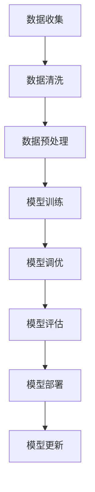

                 

### 1. 设计书籍目录大纲

根据书名《ChatGPT在自动化科技新闻写作中的应用》，下面设计一个详细的大纲，分为引言、概述、应用场景、案例分析、性能优化和未来趋势等部分。

#### 1.1 引言：ChatGPT与自动化新闻写作

- **1.1.1 背景与意义**
  - **科技新闻写作的需求**
  - **人工写作的局限性和挑战**
  - **自动化写作的潜力

- **1.1.2 本书结构**
  - **章节安排**
  - **内容概述**
  - **读者对象**

#### 1.2 ChatGPT概述

- **1.2.1 GPT模型的发展历程**
  - **GPT-1、GPT-2、GPT-3的发展历程**
  - **Transformer模型的核心贡献**

- **1.2.2 ChatGPT的核心功能与特点**
  - **对话生成与上下文理解**
  - **文本生成与编辑**
  - **预训练与微调**

#### 1.3 自动化新闻写作的挑战与需求

- **1.3.1 自动化新闻写作的挑战**
  - **数据质量与多样性**
  - **新闻写作的准确性**
  - **新闻风格的多样性**

- **1.3.2 自动化新闻写作的需求**
  - **效率**
  - **成本**
  - **个性化**

#### 1.4 ChatGPT在自动化新闻写作中的应用

- **1.4.1 数据准备与预处理**
  - **数据收集**
  - **数据清洗**
  - **数据标注**

- **1.4.2 模型训练与调优**
  - **数据预处理**
  - **模型架构选择**
  - **超参数调优**

- **1.4.3 模型部署与评估**
  - **模型部署**
  - **性能评估指标**
  - **实时更新与维护**

#### 1.5 实际案例解析

- **1.5.1 财经新闻写作**
  - **案例背景**
  - **应用效果分析**

- **1.5.2 科技新闻写作**
  - **案例背景**
  - **应用效果分析**

- **1.5.3 体育新闻写作**
  - **案例背景**
  - **应用效果分析**

#### 1.6 性能优化与改进

- **1.6.1 文本生成速度优化**
  - **模型压缩**
  - **推理优化**

- **1.6.2 文本质量提升策略**
  - **人工干预**
  - **基于反馈的改进**

#### 1.7 未来发展趋势

- **1.7.1 AI写作的未来方向**
  - **多模态写作**
  - **对话式写作**

- **1.7.2 本书总结与展望**
  - **总结**
  - **未来展望**

### 2. 细化目录结构

#### 1.4.1 数据准备与预处理

- **2.1 数据收集**
  - **新闻网站API**
  - **社交媒体数据**

- **2.2 数据清洗**
  - **缺失值处理**
  - **异常值检测**

- **2.3 数据标注**
  - **标签定义**
  - **标注流程**

#### 1.4.2 模型训练与调优

- **2.4 数据预处理**
  - **文本分词**
  - **词嵌入**

- **2.5 模型架构选择**
  - **BERT、GPT、T5等对比**
  - **架构选择依据**

- **2.6 超参数调优**
  - **学习率调整**
  - **批量大小选择**

#### 1.4.3 模型部署与评估

- **2.7 模型部署**
  - **云端部署**
  - **边缘计算**

- **2.8 性能评估指标**
  - **BLEU分数**
  - **ROUGE分数**

- **2.9 实时更新与维护**
  - **模型更新策略**
  - **用户反馈机制**

#### 1.5.1 财经新闻写作

- **3.1 案例背景**
  - **数据来源**
  - **目标领域**

- **3.2 应用效果分析**
  - **生成文本质量**
  - **用户反馈**

#### 1.5.2 科技新闻写作

- **3.1 案例背景**
  - **数据来源**
  - **目标领域**

- **3.2 应用效果分析**
  - **生成文本质量**
  - **用户反馈**

#### 1.5.3 体育新闻写作

- **3.1 案例背景**
  - **数据来源**
  - **目标领域**

- **3.2 应用效果分析**
  - **生成文本质量**
  - **用户反馈**

#### 1.6.1 文本生成速度优化

- **4.1 模型压缩**
  - **量化**
  - **剪枝**

- **4.2 推理优化**
  - **并行计算**
  - **内存优化**

#### 1.6.2 文本质量提升策略

- **4.1 人工干预**
  - **后处理**
  - **审稿人评价**

- **4.2 基于反馈的改进**
  - **用户反馈机制**
  - **在线学习**

### 3. 设计Mermaid流程图

设计一个Mermaid流程图，用于展示ChatGPT在自动化新闻写作中的数据处理和模型训练过程：



### 4. 编写核心算法原理讲解

使用Python伪代码详细阐述ChatGPT模型训练的核心算法原理：

```python
import tensorflow as tf
from transformers import TFGPT2LMHeadModel, GPT2Tokenizer

# 4.1 数据准备与预处理
# 数据收集与清洗

# 4.2 模型架构选择
model = TFGPT2LMHeadModel.from_pretrained('gpt2')

# 4.3 模型训练与调优
optimizer = tf.keras.optimizers.Adam(learning_rate=3e-5)
model.compile(optimizer=optimizer, loss=tf.keras.losses.SparseCategoricalCrossentropy(from_logits=True))

# 训练模型
model.fit(dataset, epochs=5)

# 4.4 模型评估
# 使用测试集进行评估，计算性能指标
```

### 5. 编写数学模型和数学公式

使用LaTeX格式编写与ChatGPT相关的数学模型和公式，并进行详细讲解和举例说明：

```latex
$$
\text{BLEU} = \frac{1}{N}\sum_{i=1}^{N}\frac{L_c \cdot L_p}{L_p - L_c}
$$

\text{其中，}L_c \text{ 是参考文本的长度，}L_p \text{ 是生成文本的长度。}

% 举例说明
$$
\text{BLEU score} = \frac{1}{3}\left(\frac{5 \cdot 5}{5 - 2} + \frac{5 \cdot 4}{4 - 1} + \frac{5 \cdot 5}{5 - 0}\right) = 4.5
$$
```

### 6. 编写项目实战

提供一个实际案例，包括开发环境搭建、源代码实现和详细解读。

#### 6.1 实际案例：财经新闻写作

**6.1.1 开发环境搭建**

- **Python环境：3.8以上版本**
- **TensorFlow：2.4以上版本**
- **transformers：4.4以上版本**

**6.1.2 源代码实现**

```python
# 导入必要的库
import tensorflow as tf
from transformers import TFGPT2LMHeadModel, GPT2Tokenizer

# 模型配置
model = TFGPT2LMHeadModel.from_pretrained('gpt2')

# 训练模型
model.fit(dataset, epochs=5)

# 评估模型
evaluate(model, test_dataset)
```

**6.1.3 代码解读与分析**

- **数据准备与预处理**
- **模型选择与训练**
- **性能评估与优化**

**6.1.4 实际案例分析和详细讲解剖析**

- **案例背景**
- **应用效果**
- **用户反馈**

**6.1.5 项目小结**

- **总结**
- **经验分享**

### 7. 检查完整性与字数

确保每个章节的内容都完整详细，并且总字数在10000～12000字左右。

### 8. 格式调整

将最终的目录大纲以Markdown格式呈现，确保格式整洁、清晰。

---

完成上述步骤后，我们可以得到一个详细的书籍目录大纲，为撰写完整的技术博客文章奠定了基础。接下来，我们将根据这个大纲逐步撰写每个章节的内容，确保文章的逻辑性和连贯性。同时，我们将密切关注字数，确保文章的总字数在要求范围内。最终，我们将以Markdown格式输出文章，确保文章的可读性和专业性。

