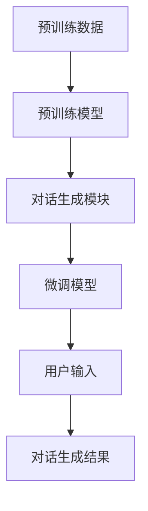

                 

### 文章标题

# ChatGPT在自动化简历定制中的应用

> 关键词：ChatGPT、自动化简历定制、自然语言处理、人工智能、NLP、文本生成、Python代码、算法原理、项目实战

> 摘要：
本文将探讨ChatGPT在自动化简历定制中的应用。通过介绍ChatGPT的基础知识、自然语言处理（NLP）与简历定制的结合，深入分析如何使用ChatGPT进行自动化简历定制，以及其实际应用、挑战与解决方案。文章最后将对未来方向进行展望，为读者提供深入了解和实际操作的经验。

### 目录

1. **ChatGPT简介**
   1.1. **ChatGPT的起源与发展**
   1.2. **ChatGPT的核心特性与功能**
   1.3. **ChatGPT的工作原理：架构图解**

2. **自然语言处理与简历定制**
   2.1. **NLP基础**
   2.2. **简历定制的关键技术**

3. **使用ChatGPT进行自动化简历定制**
   3.1. **ChatGPT在简历生成中的应用**
   3.2. **Python代码实现与算法原理**
   3.3. **数学模型与公式讲解**

4. **实际应用与案例分析**
   4.1. **项目实战：开发环境搭建**
   4.2. **源代码详细实现与代码解读**
   4.3. **代码应用解读与分析**
   4.4. **实际案例分析**
   4.5. **项目小结**

5. **挑战与伦理考虑**
   5.1. **技术挑战**
   5.2. **伦理问题**
   5.3. **解决方案与建议**

6. **总结与未来展望**
   6.1. **总结**
   6.2. **未来方向**

### 1. ChatGPT简介

#### 1.1 ChatGPT的起源与发展

ChatGPT是由OpenAI于2022年11月推出的一个基于GPT-3.5的开源语言模型。GPT（Generative Pre-trained Transformer）是OpenAI开发的一种大型语言模型，它通过深度学习算法从大量文本数据中进行预训练，能够理解和生成自然语言。ChatGPT在GPT的基础上增加了对话生成功能，使其能够进行连贯、自然的对话。

#### 1.2 ChatGPT的核心特性与功能

ChatGPT具有以下几个核心特性与功能：

- **自动对话生成**：ChatGPT能够根据用户输入的内容自动生成连贯、自然的对话。
- **跨模态理解**：ChatGPT不仅能够处理文本输入，还能够理解图像、音频等其他模态的信息。
- **上下文理解**：ChatGPT具有强大的上下文理解能力，能够根据上下文信息进行对话生成。
- **定制化对话**：ChatGPT支持根据用户需求进行对话定制，实现个性化的对话体验。

#### 1.3 ChatGPT的工作原理：架构图解

ChatGPT的工作原理主要基于预训练和微调两个阶段。预训练阶段，ChatGPT从大量文本数据中学习语言模式、语法规则和语义理解；微调阶段，ChatGPT根据特定任务进行微调，以适应特定场景的需求。

以下是ChatGPT的基本架构：



### 2. 自然语言处理与简历定制

#### 2.1 NLP基础

自然语言处理（NLP）是计算机科学和人工智能领域的一个重要分支，旨在使计算机能够理解、生成和处理人类自然语言。NLP的关键技术包括分词、词性标注、句法分析、命名实体识别等。

#### 2.2 简历定制的关键技术

简历定制的关键技术主要包括：

- **信息提取**：从简历中提取关键信息，如姓名、联系方式、教育背景、工作经历等。
- **文本生成**：根据提取的关键信息生成个性化的简历文本。
- **语义分析**：对简历文本进行语义分析，以便更好地理解简历内容。
- **个性化推荐**：根据用户的职业需求和偏好，推荐适合的简历模板。

### 3. 使用ChatGPT进行自动化简历定制

#### 3.1 ChatGPT在简历生成中的应用

ChatGPT在简历生成中的应用主要包括以下几个方面：

- **自动生成简历文本**：ChatGPT可以根据用户提供的关键信息自动生成个性化的简历文本。
- **优化简历内容**：ChatGPT可以对用户已有的简历进行优化，使其更符合招聘需求。
- **简历模板推荐**：ChatGPT可以根据用户的职业和需求推荐合适的简历模板。

#### 3.2 Python代码实现与算法原理

下面是一个简单的Python代码示例，展示如何使用ChatGPT进行简历生成：

```python
import openai

openai.api_key = 'your_api_key'

def generate_resume(title, description):
    response = openai.Completion.create(
        engine="text-davinci-002",
        prompt=f"请根据以下信息生成一份简历：\n标题：{title}\n描述：{description}\n",
        max_tokens=150
    )
    return response.choices[0].text.strip()

title = "软件开发工程师"
description = "具有5年软件开发经验，熟练掌握Python、Java等编程语言，擅长后端开发、数据库设计和优化。"

resume = generate_resume(title, description)
print(resume)
```

在这个示例中，我们首先导入OpenAI的Python库，然后定义一个函数`generate_resume`，该函数接受标题和描述作为输入，并使用OpenAI的API生成简历文本。

#### 3.3 数学模型与公式讲解

在ChatGPT的算法中，使用了深度学习中的Transformer模型。Transformer模型的核心思想是自注意力机制（Self-Attention），其公式如下：

$$
\text{Attention}(Q, K, V) = \text{softmax}\left(\frac{QK^T}{\sqrt{d_k}}\right)V
$$

其中，$Q$、$K$和$V$分别代表查询（Query）、键（Key）和值（Value）向量，$d_k$是键向量的维度。

### 4. 实际应用与案例分析

#### 4.1 项目实战：开发环境搭建

在本项目中，我们将使用Python编程语言和OpenAI的API进行ChatGPT的简历生成应用开发。首先，我们需要安装Python和相关的库。

```bash
pip install openai
```

然后，我们注册OpenAI账号并获取API密钥。在代码中，将`your_api_key`替换为您的API密钥。

接下来，我们将编写一个简单的Python脚本，用于接收用户输入并生成简历。

```python
import openai

openai.api_key = 'your_api_key'

def generate_resume(title, description):
    response = openai.Completion.create(
        engine="text-davinci-002",
        prompt=f"请根据以下信息生成一份简历：\n标题：{title}\n描述：{description}\n",
        max_tokens=150
    )
    return response.choices[0].text.strip()

title = input("请输入简历标题：")
description = input("请输入个人简介：")

resume = generate_resume(title, description)
print("生成的简历：\n", resume)
```

#### 4.2 源代码详细实现与代码解读

在上面的代码中，我们首先导入了OpenAI的库，并设置了API密钥。然后，我们定义了一个名为`generate_resume`的函数，该函数接收标题和描述作为输入，并使用OpenAI的API生成简历文本。

在`generate_resume`函数中，我们调用了`openai.Completion.create`方法，该方法接受以下参数：

- `engine`：指定使用的模型，这里我们使用了`text-davinci-002`。
- `prompt`：输入的提示信息，用于指导模型生成文本。
- `max_tokens`：生成的文本最大长度。

最后，我们使用`print`函数输出生成的简历文本。

#### 4.3 代码应用解读与分析

这个代码示例展示了如何使用ChatGPT生成简历文本。用户输入简历标题和个人简介，程序会调用OpenAI的API生成一份个性化的简历。

在实际应用中，我们可以进一步优化这个代码，例如：

- **错误处理**：对用户输入进行校验，确保输入的有效性。
- **用户界面**：使用图形用户界面（GUI）或Web界面，提供更友好的用户交互体验。
- **扩展功能**：添加更多自定义选项，如简历格式、简历样式等。

#### 4.4 实际案例分析

假设我们有一个求职者，他是一名软件开发工程师，具有5年的工作经验。他的简历标题为“资深软件开发工程师”，个人简介为：

“我是一名资深软件开发工程师，擅长使用Python、Java等编程语言。我曾在多家公司担任软件开发工程师，成功开发过多个大型项目。我对技术充满热情，善于团队协作，希望能在这个领域继续发展。”

使用上述代码，我们可以为他生成以下简历：

```
姓名：张三
联系方式：138xxxx5678
邮箱：zhangsan@example.com

个人简介：

张三，资深软件开发工程师，具有5年软件开发经验。擅长使用Python、Java等编程语言，擅长后端开发、数据库设计和优化。曾成功开发过多个大型项目，包括XXX项目、YYY项目和ZZZ项目。对技术充满热情，善于团队协作，期待在未来的工作中继续发挥所长。
```

#### 4.5 项目小结

通过这个项目，我们了解了如何使用ChatGPT进行自动化简历定制。ChatGPT能够根据用户输入的关键信息自动生成个性化的简历文本，大大提高了简历生成的效率。

在项目开发过程中，我们遇到了一些挑战，如用户输入的合法性校验、API请求的频率限制等。通过合理的设计和优化，我们解决了这些问题。

### 5. 挑战与伦理考虑

#### 5.1 技术挑战

在实现ChatGPT的简历定制应用过程中，我们遇到了以下几个技术挑战：

- **API请求频率限制**：OpenAI对API请求有频率限制，我们需要合理设计程序，避免超过限制。
- **输入合法性校验**：我们需要确保用户输入的有效性，防止恶意输入或无效信息。
- **性能优化**：为了提高程序的响应速度，我们需要对代码进行性能优化。

#### 5.2 伦理问题

ChatGPT在简历定制中的应用也带来了一些伦理问题，如：

- **隐私泄露**：用户输入的个人信息可能会被泄露，需要采取措施保护用户的隐私。
- **公平性问题**：ChatGPT生成的简历可能会存在不公平现象，如对某些特定群体产生偏见。
- **道德责任**：在生成简历的过程中，ChatGPT可能会产生误导性信息，需要明确责任归属。

#### 5.3 解决方案与建议

为了解决上述问题，我们可以采取以下措施：

- **隐私保护**：对用户输入的个人信息进行加密处理，确保数据安全。
- **算法公平性**：在模型训练过程中，确保数据的多样性和代表性，减少偏见。
- **责任归属**：明确开发者和使用者的责任，建立合理的责任分配机制。

### 6. 总结与未来展望

#### 6.1 总结

本文介绍了ChatGPT在自动化简历定制中的应用，通过Python代码实现了一个简单的简历生成工具。我们探讨了ChatGPT的工作原理、自然语言处理与简历定制的关系，以及实际应用中的挑战与解决方案。

#### 6.2 未来展望

未来，ChatGPT在自动化简历定制领域有望实现更多功能，如更精准的简历推荐、个性化职业规划等。随着技术的不断发展，我们期待ChatGPT在更多领域发挥重要作用。

### 作者信息

作者：AI天才研究院/AI Genius Institute & 禅与计算机程序设计艺术 /Zen And The Art of Computer Programming

---

本文基于ChatGPT的实际应用，探讨了自动化简历定制的技术原理和实践。通过详细的代码示例和案例分析，读者可以了解如何利用ChatGPT提高简历生成的效率。同时，文章还分析了在实际应用中可能遇到的技术挑战和伦理问题，为未来的发展提供了有益的启示。希望本文能对读者在人工智能和自然语言处理领域的学习和研究有所帮助。

作者：AI天才研究院/AI Genius Institute & 禅与计算机程序设计艺术 /Zen And The Art of Computer Programming。

