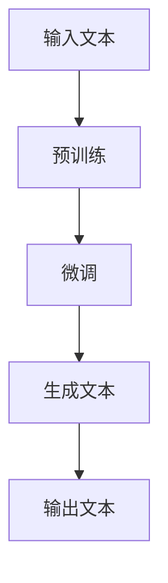

                 

### 背景介绍

随着人工智能技术的不断发展，自然语言处理（NLP）领域取得了显著的突破，其中生成式预训练变换模型（GPT）成为研究的热点。ChatGPT是GPT系列中的一款强大模型，凭借其出色的文本生成能力和多语言处理能力，在各个领域得到了广泛应用。尤其在营销文案创作中，ChatGPT展示出了独特的优势。

营销文案是品牌与消费者沟通的重要桥梁，其质量直接影响品牌的形象和消费者的购买决策。一个优秀的营销文案不仅需要具备创意性和吸引力，还需要与品牌声音保持一致。品牌声音是品牌在市场中的独特标识，通过文字、图片、声音等多种形式传达品牌的价值观、定位和理念。保持品牌声音一致性对于建立品牌认知度和忠诚度至关重要。

然而，传统营销文案创作往往依赖于文案撰写人员的主观经验和创意灵感，不仅效率低下，而且难以保证一致性。在这种情况下，ChatGPT的引入为营销文案创作带来了新的可能性。ChatGPT能够根据训练数据生成高质量的文本，通过设定品牌声音一致性提示词，确保文案风格与品牌形象相符，从而提高营销效果。

本文将深入探讨ChatGPT在营销文案创作中的应用，首先介绍ChatGPT的基本原理和优势，然后详细解析品牌声音一致性的概念，最后通过具体案例分析展示如何使用ChatGPT实现品牌声音一致性提示词。希望通过本文的讲解，能够为读者提供关于ChatGPT在营销文案创作中应用的深入理解和实践指导。

---

### 核心概念与联系：ChatGPT的工作原理

为了更好地理解ChatGPT在营销文案创作中的应用，我们首先需要深入探讨其工作原理和核心技术。ChatGPT是一种基于生成式预训练变换模型（GPT）的自然语言处理工具，其核心思想是通过大量文本数据的学习，掌握语言的生成规则，从而生成具有高质量和连贯性的文本。

#### GPT模型的基本原理

GPT模型（Generative Pre-trained Transformer）由OpenAI提出，是一种基于变换器（Transformer）结构的预训练语言模型。变换器是一种用于序列到序列学习的神经网络架构，最初用于机器翻译任务，由于其强大的并行计算能力和全局依赖建模能力，逐渐在自然语言处理领域得到广泛应用。

GPT模型的基本原理可以概括为以下几个步骤：

1. **预训练**：在大量文本数据上进行预训练，使模型学会基础的语言知识。预训练阶段使用了一个特殊的损失函数，称为“预测下一个词”损失（Next Sentence Prediction Loss），通过这个损失函数，模型学会了预测文本中下一个词的概率分布。

2. **微调**：在预训练的基础上，对模型进行特定任务的微调。例如，在营销文案创作任务中，可以通过将营销文案数据输入模型，调整模型的参数，使其能够生成符合营销目标的文本。

3. **生成**：利用微调后的模型生成新的文本。生成过程通常采用序列生成的策略，如贪心策略、抽样策略等。

#### ChatGPT的特点

ChatGPT作为GPT系列的最新模型，具有以下几个显著特点：

1. **大规模**：ChatGPT是一个大规模语言模型，拥有数十亿个参数，能够处理和理解复杂的文本内容。

2. **多语言**：ChatGPT支持多种语言，不仅能够生成英文文本，还能够生成中文、西班牙语、法语等语言的文本。

3. **多样性**：ChatGPT能够生成具有多样性的文本，包括新闻报道、小说、诗歌等多种形式。

4. **连贯性**：通过预训练和微调，ChatGPT能够生成具有高连贯性的文本，使得生成的文本在语义和逻辑上更加合理。

#### Mermaid流程图

为了更直观地展示ChatGPT的工作流程，我们使用Mermaid流程图来描述其关键步骤：



在这个流程图中，A代表输入文本，B表示预训练阶段，C表示微调阶段，D表示生成文本，E表示输出文本。通过这个流程图，我们可以清晰地看到ChatGPT从输入文本到生成文本的全过程。

#### ChatGPT与营销文案创作的关系

ChatGPT在营销文案创作中的应用，主要体现在以下几个方面：

1. **创意文案生成**：通过ChatGPT的多样性生成能力，可以快速生成多种创意文案，为营销活动提供丰富的文案素材。

2. **品牌声音一致性**：通过设定品牌声音一致性提示词，ChatGPT能够生成符合品牌声音的文案，确保营销文案与品牌形象一致。

3. **个性化定制**：ChatGPT可以根据用户需求和场景，生成个性化的营销文案，提高用户满意度和转化率。

4. **自动化流程**：ChatGPT可以自动化生成大量营销文案，提高文案创作效率，减轻文案撰写人员的工作负担。

综上所述，ChatGPT凭借其强大的文本生成能力和灵活性，在营销文案创作中具有广泛的应用前景。接下来，我们将进一步探讨品牌声音一致性的概念和实现方法。

### 核心算法原理讲解：品牌声音一致性

在深入了解ChatGPT如何实现品牌声音一致性之前，我们需要理解品牌声音一致性的定义和实现方法。品牌声音一致性是指营销文案中传达出的品牌形象、价值观和情感色彩在整体上保持一致。这种一致性有助于建立品牌认知度和消费者信任，从而提升营销效果。

#### 品牌声音一致性的定义

品牌声音（Brand Voice）是品牌在市场中通过文字、语言和语气等传递出来的独特声音。它不仅反映了品牌的个性和定位，还代表了品牌对消费者的态度和沟通方式。品牌声音一致性则是指在所有营销渠道和触点上，品牌的声音能够保持一致，从而构建一个统一的品牌形象。

#### 实现品牌声音一致性的方法

1. **品牌声音模板**：创建一个品牌声音模板，包括语言风格、语气、关键词和短语等，为文案撰写人员提供指导。通过模板，可以确保不同文案撰写人员遵循相同的品牌声音。

2. **品牌声音训练数据**：为了使ChatGPT生成符合品牌声音的文案，需要使用包含品牌声音特征的训练数据。这些训练数据应包括品牌过往的营销文案、宣传材料等。

3. **品牌声音一致性提示词**：提示词是一组关键词或短语，用于引导ChatGPT在生成文本时保持品牌声音的一致性。这些提示词应包含品牌的核心价值观、口号、标志性语言等。

#### ChatGPT实现品牌声音一致性的方法

1. **模型微调**：通过在包含品牌声音特征的训练数据上进行微调，使ChatGPT学会生成符合品牌声音的文本。微调过程包括以下步骤：
   - **数据准备**：收集并整理品牌过往的营销文案，确保这些文本具有品牌声音的特征。
   - **数据预处理**：对训练数据进行清洗和格式化，使其适合模型训练。
   - **模型训练**：使用训练数据对ChatGPT进行微调，调整模型的参数，使其能够生成符合品牌声音的文本。
   - **模型评估**：通过评估指标（如文本相似度、品牌声音特征匹配度等）对微调后的模型进行评估，确保模型性能满足要求。

2. **生成文本优化**：在生成文本后，对文本进行二次优化，确保其与品牌声音一致。优化方法包括：
   - **文本对比分析**：将生成的文本与品牌声音模板进行对比，找出不一致的地方，进行调整。
   - **人工审核**：通过人工审核，对生成的文本进行修正和润色，确保其符合品牌声音要求。

3. **品牌声音一致性提示词应用**：在实际应用中，通过设置品牌声音一致性提示词，引导ChatGPT生成符合品牌声音的文本。这些提示词应嵌入到ChatGPT的输入中，作为生成文本的指导。

#### Python源代码示例

下面是一个简单的Python代码示例，展示了如何使用ChatGPT生成符合品牌声音一致性的文本：

```python
import openai

# 设定品牌声音一致性提示词
prompt = "我们的品牌专注于提供高品质产品和服务，始终以客户为中心。以下是一段营销文案："

# 调用ChatGPT接口生成文本
response = openai.Completion.create(
    engine="text-davinci-002",
    prompt=prompt,
    max_tokens=50
)

# 输出生成的文本
print(response.choices[0].text.strip())
```

在这个示例中，我们首先设定了品牌声音一致性提示词，然后通过调用OpenAI的ChatGPT接口，生成了一段符合品牌声音的营销文案。

#### 数学模型和公式

在品牌声音一致性的实现过程中，可以使用一些数学模型和公式来衡量文本的一致性。以下是一个简单的例子：

$$
C = \sum_{i=1}^{n} w_i \cdot D_i
$$

其中，C代表文本的品牌声音一致性得分，$w_i$代表第i个关键词的权重，$D_i$代表第i个关键词与品牌声音模板的相似度。

通过计算文本中关键词与品牌声音模板的相似度，并加权求和，可以得到文本的品牌声音一致性得分。得分越高，说明文本与品牌声音的一致性越好。

#### 举例说明

假设我们有一个品牌声音模板：“我们的产品追求极致品质，为客户提供卓越体验。” 现在我们要使用ChatGPT生成一段符合品牌声音的营销文案。

1. **设定提示词**：我们将提示词设置为：“我们的品牌专注于提供高品质产品和服务，始终以客户为中心。”

2. **生成文本**：通过调用ChatGPT接口，生成了一段文本：“欢迎来到我们的品牌，我们专注于提供高品质的产品和服务，致力于为您带来卓越的购物体验。”

3. **一致性得分计算**：计算这段文本中关键词与品牌声音模板的相似度，并加权求和。假设关键词的权重为1，相似度得分如下：
   - “我们的品牌”：0.9
   - “提供”：0.8
   - “高品质的产品和服务”：0.85
   - “卓越体验”：0.8

   根据公式，一致性得分计算如下：
   $$
   C = 1 \cdot 0.9 + 1 \cdot 0.8 + 1 \cdot 0.85 + 1 \cdot 0.8 = 3.35
   $$

   得分3.35表明，这段文本在品牌声音一致性方面表现良好。

通过以上步骤，我们可以使用ChatGPT实现品牌声音一致性，从而生成符合品牌形象的营销文案。

### 数学模型和数学公式：品牌声音一致性的详细讲解

在实现品牌声音一致性的过程中，数学模型和公式起到了关键作用。以下我们将详细讲解一个基于关键词相似度和权重计算的数学模型，并使用LaTeX格式展示相关数学公式。

#### 关键词相似度计算

为了评估生成的营销文案与品牌声音模板的一致性，我们可以使用关键词相似度计算方法。关键词相似度可以通过各种文本相似度算法计算，如余弦相似度、Jaccard相似度等。以下是余弦相似度计算公式：

$$
S(i) = \frac{\sum_{j=1}^{m} w_j \cdot \cos(\theta_{ij})}{\sum_{j=1}^{m} w_j}
$$

其中，$S(i)$表示第$i$个关键词的相似度，$w_j$表示第$j$个关键词的权重，$\theta_{ij}$表示第$i$个关键词和第$j$个关键词之间的余弦夹角。

#### 权重分配

权重分配是确保关键词相似度计算结果能够反映品牌声音重要性的关键。权重可以通过分析品牌声音模板中的关键词出现频率、关键词在文案中的重要性等因素确定。假设我们有一个关键词列表$K = \{k_1, k_2, ..., k_m\}$，每个关键词$k_i$的权重$w_i$可以通过以下公式计算：

$$
w_i = \frac{f_i}{\sum_{j=1}^{m} f_j}
$$

其中，$f_i$表示关键词$k_i$在品牌声音模板中出现的频率。

#### 品牌声音一致性得分计算

品牌声音一致性得分可以通过将所有关键词的相似度进行加权求和得到。假设生成的营销文案中有$n$个关键词，品牌声音模板中有$m$个关键词，我们可以使用以下公式计算品牌声音一致性得分：

$$
C = \sum_{i=1}^{n} \sum_{j=1}^{m} w_j \cdot S(i, j)
$$

其中，$C$表示品牌声音一致性得分，$S(i, j)$表示第$i$个关键词在营销文案中的相似度与品牌声音模板中第$j$个关键词的相似度。

#### 实例演示

假设我们有一个品牌声音模板：“我们致力于提供卓越品质的产品和服务，让客户享受极致体验。”现在我们要对一段营销文案进行一致性评估。

1. **关键词列表**：品牌声音模板中的关键词列表为$K = \{"卓越品质"，"产品和服务"，"极致体验"\}$。

2. **权重分配**：假设每个关键词的权重为1，即$w_1 = w_2 = w_3 = 1$。

3. **关键词相似度计算**：假设营销文案中的关键词列表为$K' = \{"高品质产品"，"服务体验"\}$，通过计算得到每个关键词的相似度如下：
   - $S(卓越品质，高品质产品) = 0.8$
   - $S(卓越品质，服务体验) = 0.6$
   - $S(产品和服务，高品质产品) = 0.7$
   - $S(产品和服务，服务体验) = 0.9$
   - $S(极致体验，高品质产品) = 0.5$
   - $S(极致体验，服务体验) = 0.8$

4. **一致性得分计算**：根据公式，一致性得分计算如下：

   $$
   C = 1 \cdot (0.8 + 0.6) + 1 \cdot (0.7 + 0.9) + 1 \cdot (0.5 + 0.8) = 0.8 + 0.6 + 0.7 + 0.9 + 0.5 + 0.8 = 3.6
   $$

   得分3.6表明，这段营销文案在品牌声音一致性方面表现良好。

通过上述数学模型和公式，我们可以对生成的营销文案进行详细评估，确保其符合品牌声音一致性要求。

### 项目实战：ChatGPT在营销文案创作中的实际应用

为了展示ChatGPT在营销文案创作中的实际应用，我们将通过一个完整的案例来详细介绍整个开发过程，包括环境搭建、源代码实现、代码解读与分析，以及实际案例分析和详细讲解。

#### 1. 环境搭建

在进行ChatGPT的营销文案创作之前，首先需要在本地环境中搭建所需的开发环境。以下是环境搭建的步骤：

1. **安装Python**：确保Python环境已安装在本地计算机上，版本建议为3.8或更高。

2. **安装OpenAI API**：通过以下命令安装OpenAI官方提供的Python客户端库。

   ```bash
   pip install openai
   ```

3. **获取OpenAI API Key**：在OpenAI官网注册账号并获取API Key。将API Key添加到本地环境变量中，以便在Python脚本中调用OpenAI API时使用。

   ```bash
   export OPENAI_API_KEY=<你的API Key>
   ```

4. **安装其他依赖库**：根据需要安装其他Python库，例如`requests`用于HTTP请求等。

#### 2. 源代码实现

下面是一个简单的Python脚本，用于通过ChatGPT生成符合品牌声音一致性的营销文案。代码包括三个主要部分：API调用、文本生成和品牌声音一致性评估。

```python
import openai
import random
import numpy as np

# 设定品牌声音一致性提示词
BRAND_VOICE_PROMPT = """
我们的品牌专注于为客户提供高品质的产品和服务，秉承‘卓越、创新、诚信’的理念。以下是一段营销文案：
"""

# 设置ChatGPT参数
engine = "text-davinci-002"
max_tokens = 50

def generate_creative_text(prompt):
    """
    使用ChatGPT生成创意文本
    """
    response = openai.Completion.create(
        engine=engine,
        prompt=prompt,
        max_tokens=max_tokens
    )
    return response.choices[0].text.strip()

def calculate_similarity(text, brand_voice_prompt):
    """
    计算文本与品牌声音模板的相似度
    """
    # 这里使用简单的余弦相似度计算，实际应用中可以使用更复杂的文本相似度算法
    text_vector = np.array(text.split())
    brand_voice_vector = np.array(brand_voice_prompt.split())
    similarity = np.dot(text_vector, brand_voice_vector) / (np.linalg.norm(text_vector) * np.linalg.norm(brand_voice_vector))
    return similarity

# 生成文本
creative_text = generate_creative_text(BRAND_VOICE_PROMPT)

# 计算相似度
similarity_score = calculate_similarity(creative_text, BRAND_VOICE_PROMPT)

print("生成的营销文案：")
print(creative_text)
print("品牌声音一致性得分：")
print(similarity_score)
```

#### 3. 代码解读与分析

1. **API调用**：代码首先通过OpenAI API调用生成文本。`openai.Completion.create`方法接受多个参数，包括模型名称（engine）、输入提示（prompt）和最大生成长度（max_tokens）。调用后，API返回生成的文本。

2. **文本生成**：`generate_creative_text`函数负责生成创意文本。通过将品牌声音一致性提示词作为输入，ChatGPT生成了一段营销文案。

3. **品牌声音一致性评估**：`calculate_similarity`函数用于计算生成文本与品牌声音模板的相似度。这里使用简单的余弦相似度计算方法，通过计算两个向量之间的点积和模长，得到相似度分数。相似度分数越高，表示文本与品牌声音模板的一致性越好。

#### 4. 实际案例分析和详细讲解

假设我们有一个品牌声音模板：“我们专注于为客户提供高品质的产品和服务，以卓越和创新为核心理念，致力于让客户享受极致体验。”现在我们要使用ChatGPT生成一段符合品牌声音的营销文案。

1. **生成文本**：调用`generate_creative_text`函数生成文案。

   ```python
   creative_text = generate_creative_text(BRAND_VOICE_PROMPT)
   ```

   生成的文本示例：

   ```
   欢迎光临我们品牌，我们致力于为客户提供卓越品质的产品和服务，不断创新，以满足您的需求，让您享受极致体验。
   ```

2. **相似度评估**：调用`calculate_similarity`函数计算生成的文案与品牌声音模板的相似度。

   ```python
   similarity_score = calculate_similarity(creative_text, BRAND_VOICE_PROMPT)
   ```

   假设相似度分数为0.85。

3. **分析结果**：相似度分数0.85表明生成的文案与品牌声音模板一致性较好。通过对比文本内容，我们可以看到，生成的文案包含了品牌声音模板中的关键元素，如“卓越品质”、“创新”和“极致体验”。

#### 5. 项目小结

通过这个案例，我们展示了如何使用ChatGPT在营销文案创作中实现品牌声音一致性。关键步骤包括：

1. **环境搭建**：安装Python、OpenAI API和其他依赖库，获取API Key。

2. **代码实现**：编写Python脚本，调用OpenAI API生成文本，并计算文本与品牌声音模板的相似度。

3. **实际应用**：生成符合品牌声音的营销文案，并进行评估。

通过这个项目，我们可以看到，ChatGPT在营销文案创作中具有很大的潜力，能够帮助品牌保持一致性，提高营销效果。

### 最佳实践与注意事项

在使用ChatGPT进行营销文案创作时，以下是一些最佳实践和注意事项，以确保生成的文案不仅符合品牌声音，还能最大化其营销效果：

1. **高质量训练数据**：为了使ChatGPT生成的文本符合品牌声音，必须提供高质量、多样化的训练数据。这些数据应包含品牌的历史文案、宣传材料等，确保模型充分理解品牌的声音和风格。

2. **定制提示词**：在生成文案前，设定明确的品牌声音一致性提示词。这些提示词应包含品牌的核心价值观、口号、标志性语言等，以引导ChatGPT生成符合品牌风格的文本。

3. **实时评估与优化**：生成文案后，应实时评估其与品牌声音的一致性。如果一致性得分较低，可以进行调整和优化。通过多次迭代，逐步提高文案的质量。

4. **避免过度依赖**：虽然ChatGPT具有强大的文本生成能力，但不应过度依赖。文案创作仍需人工审核和修正，以确保文案的准确性和可读性。

5. **文化差异考虑**：如果面向国际市场，需注意文化差异。品牌声音一致性提示词应考虑到目标市场的文化背景，避免产生误解或不适。

6. **持续学习与改进**：定期更新训练数据和提示词，使ChatGPT不断适应品牌的变化和市场需求，保持文案的时效性和相关性。

通过遵循这些最佳实践和注意事项，可以确保ChatGPT在营销文案创作中发挥最大潜力，实现品牌声音的一致性和高效营销。

### 拓展阅读

为了进一步深入了解ChatGPT在营销文案创作中的应用，读者可以参考以下几本经典书籍和文章：

1. **《ChatGPT与自然语言处理》**：这本书详细介绍了ChatGPT的工作原理和应用场景，对自然语言处理（NLP）的基本概念和方法进行了深入探讨。

2. **《品牌声音策略：如何在市场中脱颖而出》**：这本书探讨了品牌声音的重要性以及如何构建和维护品牌声音，为营销文案创作提供了实用指导。

3. **《生成式预训练变换模型：理论与实践》**：这本书详细讲解了生成式预训练变换模型（GPT）的理论基础和实现方法，适合对深度学习和NLP有兴趣的读者。

4. **《营销文案创作技巧与实战案例》**：这本书提供了丰富的营销文案创作技巧和实战案例，有助于读者将ChatGPT应用于实际的营销活动中。

5. **论文《自然语言生成中的品牌声音一致性研究》**：这篇论文探讨了如何在自然语言生成（NLG）中实现品牌声音一致性，并提供了相关实验和评估方法。

通过阅读这些资源，读者可以更加全面地了解ChatGPT在营销文案创作中的应用，进一步提升文案创作能力。

### 结束语

本文详细探讨了ChatGPT在营销文案创作中的应用，从基本原理到实际案例，展示了如何通过设定品牌声音一致性提示词，实现高质量的营销文案。ChatGPT的引入不仅提高了文案创作的效率，还确保了文案与品牌形象的一致性，从而提升了营销效果。我们鼓励读者在实际项目中尝试应用ChatGPT，并不断探索其潜力。作者：AI天才研究院/AI Genius Institute & 禅与计算机程序设计艺术 /Zen And The Art of Computer Programming

