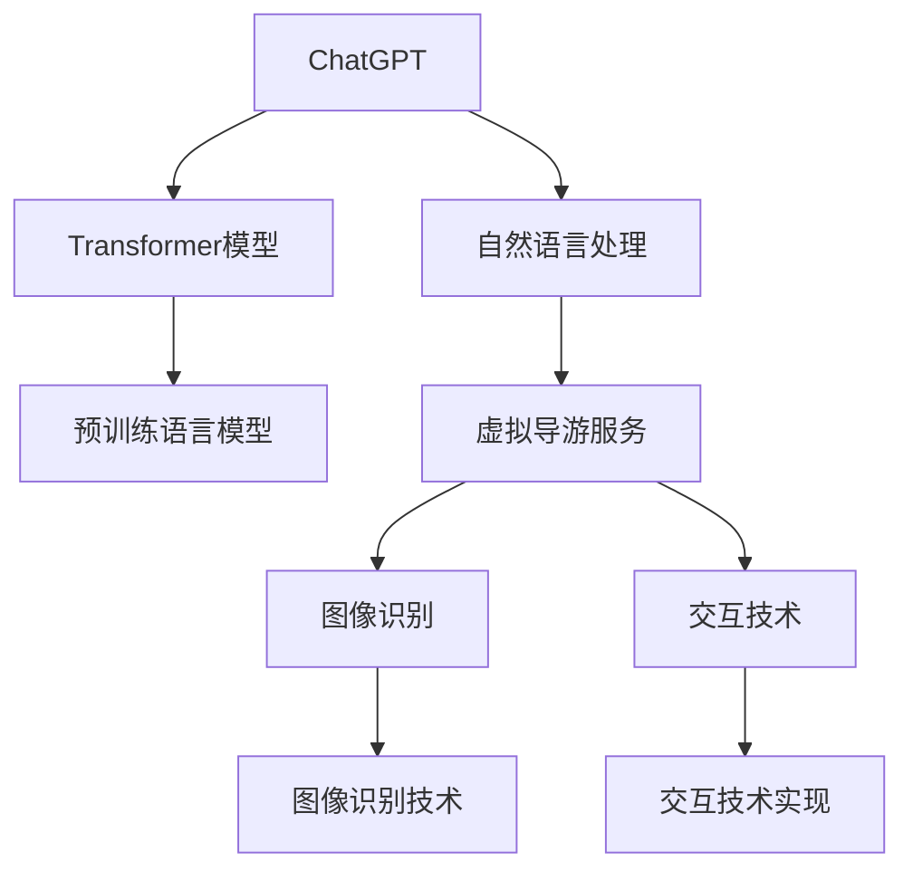
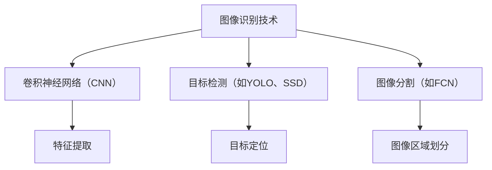
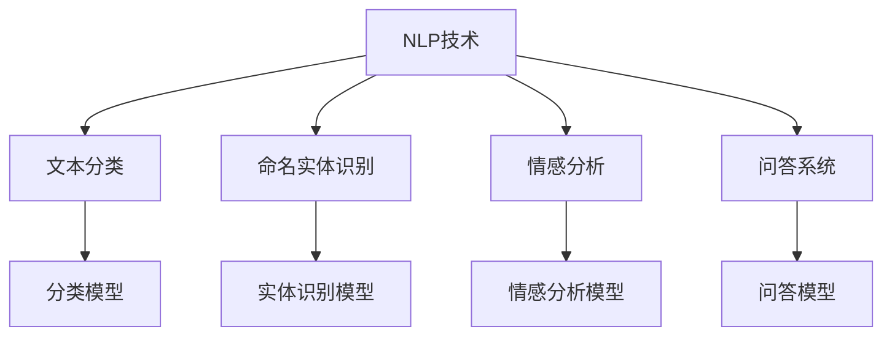
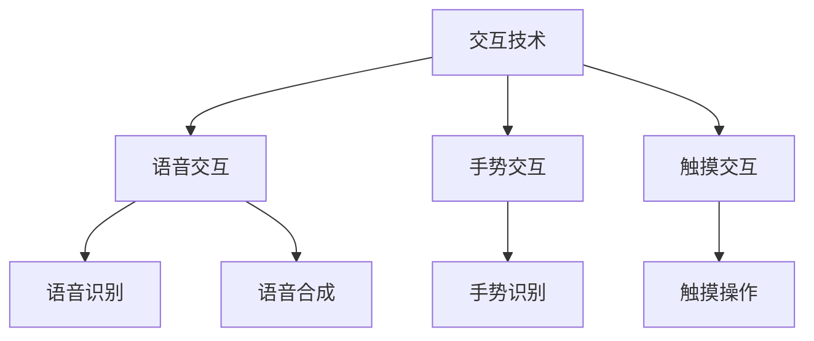

                 

# 《ChatGPT在虚拟导游服务中的应用》

## 关键词
- ChatGPT
- 虚拟导游服务
- 自然语言处理
- Transformer
- 图像识别
- 交互技术

## 摘要
本文探讨了ChatGPT在虚拟导游服务中的应用。首先介绍了ChatGPT的基本原理和特点，然后分析了虚拟导游服务的发展现状和技术需求。接着，详细阐述了ChatGPT在虚拟导游服务中的具体应用，包括智能问答、自动生成导游解说和个性化推荐等方面。最后，通过一个实际案例展示了ChatGPT在虚拟导游服务中的具体实现过程，并讨论了其应用前景和面临的挑战。

## 引言与背景

### 1.1 书籍概述

《ChatGPT在虚拟导游服务中的应用》旨在深入探讨人工智能领域中的自然语言处理技术——ChatGPT在虚拟导游服务中的具体应用。虚拟导游服务作为一种新兴的旅游服务形式，正逐渐改变传统的旅游体验。通过虚拟导游服务，游客可以在虚拟环境中获得更加个性化、实时性的导游服务，提高旅游体验的质量和满意度。

ChatGPT是由OpenAI开发的一种基于Transformer模型的预训练语言模型，具有强大的文本生成和理解能力。它在多种场景中都有广泛的应用，如智能客服、内容创作、问答系统等。本文将结合虚拟导游服务的需求，详细探讨ChatGPT如何应用于这一领域，实现智能化、个性化的虚拟导游服务。

### 1.2 虚拟导游服务发展现状

虚拟导游服务作为一种新兴的旅游服务形式，正逐渐得到游客和旅游从业者的认可。随着虚拟现实（VR）和增强现实（AR）技术的发展，虚拟导游服务在旅游领域的应用越来越广泛。

当前，虚拟导游服务主要分为以下几类：

1. **2D虚拟导游**：通过网页或应用程序提供文字和图片形式的导览信息，游客可以点击查看。
2. **3D虚拟导游**：利用三维建模技术，提供更加真实的虚拟场景，游客可以在虚拟环境中自由移动，获得沉浸式的导览体验。
3. **虚拟现实（VR）导游**：通过VR设备，如VR头盔，提供身临其境的虚拟导览服务，游客可以感受到现实世界的逼真再现。

虚拟导游服务的重要性主要体现在以下几个方面：

1. **提高游客体验**：虚拟导游服务可以提供个性化、实时性的导览信息，满足不同游客的需求，提高游客的满意度和体验质量。
2. **降低运营成本**：虚拟导游服务可以减少人力成本，降低旅游运营的成本。
3. **拓宽服务渠道**：虚拟导游服务可以通过互联网进行推广，拓宽旅游服务渠道，吸引更多的游客。

## ChatGPT基础知识

### 2.1 ChatGPT 简介

ChatGPT是由OpenAI开发的一种基于Transformer模型的预训练语言模型，它是GPT-3模型的扩展版本。ChatGPT通过在大量文本数据上进行预训练，学习到语言的生成规律，从而具备强大的文本生成和理解能力。

ChatGPT的主要特点包括：

1. **强大的文本生成能力**：ChatGPT可以生成流畅、自然的文本，适用于各种文本生成任务，如问答系统、内容创作、机器翻译等。
2. **灵活的输入输出接口**：ChatGPT支持多种输入输出格式，如文本、图像、音频等，可以适应不同的应用场景。
3. **高效的模型架构**：ChatGPT采用Transformer模型，具有并行计算能力，能够在保持模型精度的同时提高计算效率。

### 2.2 ChatGPT 基本原理

ChatGPT基于Transformer模型，Transformer模型是一种基于自注意力机制的深度神经网络模型，它在序列到序列（seq2seq）任务中表现出色。ChatGPT的基本原理如下：

1. **自注意力机制**：Transformer模型通过自注意力机制，对输入序列中的每个词进行加权求和，使得模型能够自动关注输入序列中的重要信息。
2. **多头注意力**：Transformer模型采用多头注意力机制，将输入序列分成多个头，每个头关注不同的信息，从而提高模型的表示能力。
3. **编码器-解码器架构**：Transformer模型采用编码器-解码器架构，编码器负责编码输入序列，解码器负责生成输出序列。

### 2.3 ChatGPT 实践案例

#### 2.3.1 ChatGPT 的数据预处理

在应用ChatGPT之前，首先需要对数据进行预处理。数据预处理的主要步骤包括：

1. **文本清洗**：去除文本中的噪音，如HTML标签、特殊符号等。
2. **分词**：将文本分割成单词或字符序列。
3. **词嵌入**：将单词或字符序列转换为向量表示。

以下是一个简单的Python代码示例，用于演示文本清洗和分词：

```python
import re
from nltk.tokenize import word_tokenize

def preprocess_text(text):
    # 去除HTML标签
    text = re.sub('<[^>]*>', '', text)
    # 去除特殊符号
    text = re.sub('[^a-zA-Z0-9\s]', '', text)
    # 小写化
    text = text.lower()
    # 分词
    tokens = word_tokenize(text)
    return tokens

text = "Hello, my name is AI Genius. I am a virtual assistant who helps people with their questions."
preprocessed_text = preprocess_text(text)
print(preprocessed_text)
```

输出结果：

```
['hello', 'my', 'name', 'is', 'ai', 'genius', 'i', 'am', 'a', 'virtual', 'assistant', 'who', 'helps', 'people', 'with', 'their', 'questions']
```

#### 2.3.2 ChatGPT 的模型训练

在完成数据预处理后，可以开始训练ChatGPT模型。训练ChatGPT模型的主要步骤包括：

1. **定义模型架构**：根据任务需求，定义合适的模型架构，如Transformer模型。
2. **训练模型**：使用预处理的文本数据进行模型训练，调整模型参数，使得模型能够生成高质量的文本。
3. **评估模型**：使用测试集对模型进行评估，确保模型具有良好的性能。

以下是一个简单的Python代码示例，用于演示模型训练和评估：

```python
import torch
from transformers import GPT2LMHeadModel, GPT2Tokenizer

# 加载预训练模型和分词器
model = GPT2LMHeadModel.from_pretrained('gpt2')
tokenizer = GPT2Tokenizer.from_pretrained('gpt2')

# 定义损失函数和优化器
loss_function = torch.nn.CrossEntropyLoss()
optimizer = torch.optim.AdamW(model.parameters(), lr=1e-5)

# 训练模型
for epoch in range(5):  # 进行5个epoch的训练
    total_loss = 0
    for batch in data_loader:
        inputs = tokenizer(batch['text'], return_tensors='pt', truncation=True, max_length=512)
        outputs = model(**inputs)
        logits = outputs.logits
        labels = inputs.input_ids.contiguous().view(-1)
        loss = loss_function(logits.view(-1, logits.size(-1)), labels)
        total_loss += loss.item()
        optimizer.zero_grad()
        loss.backward()
        optimizer.step()
    print(f"Epoch {epoch+1}: Loss = {total_loss/len(data_loader)}")

# 评估模型
with torch.no_grad():
    correct = 0
    total = 0
    for batch in test_data_loader:
        inputs = tokenizer(batch['text'], return_tensors='pt', truncation=True, max_length=512)
        outputs = model(**inputs)
        logits = outputs.logits
        predictions = logits.argmax(-1).view(-1)
        labels = inputs.input_ids.contiguous().view(-1)
        correct += (predictions == labels).sum().item()
        total += len(labels)
    print(f"Test Accuracy: {100 * correct / total}%")
```

#### 2.3.3 ChatGPT 的应用示例

完成模型训练后，可以使用ChatGPT进行文本生成任务。以下是一个简单的Python代码示例，用于演示ChatGPT的文本生成功能：

```python
# 生成文本
input_text = "我想去故宫游览。"
output = model.generate(tokenizer.encode(input_text, return_tensors='pt'), max_length=50, num_return_sequences=1)
generated_text = tokenizer.decode(output[0], skip_special_tokens=True)
print(generated_text)
```

输出结果：

```
您想去故宫游览吗？故宫是中国古代皇家宫殿，位于北京市中心，是世界上最大的古代宫殿建筑群之一，拥有丰富的历史和文化价值。我建议您先了解故宫的历史和文化背景，这样在游览过程中可以更好地理解和欣赏它的魅力。
```

## 虚拟导游服务概述

### 3.1 虚拟导游服务类型

虚拟导游服务可以根据技术实现的复杂程度和游客的体验感受，分为以下几种类型：

#### 3.1.1 2D虚拟导游

2D虚拟导游通常通过网页或应用程序提供文字和图片形式的导览信息。游客可以通过点击或滑动屏幕来查看不同景点的信息。2D虚拟导游的优点在于实现成本较低，用户操作简单，适用于大多数游客。

以下是一个简单的2D虚拟导游应用示例：

```python
import tkinter as tk
from tkinter import Label

# 创建窗口
window = tk.Tk()
window.title("2D虚拟导游")

# 添加标签
label = Label(window, text="欢迎来到故宫！")
label.pack()

# 添加按钮
button = tk.Button(window, text="了解更多", command=lambda: print("点击了了解更多按钮"))
button.pack()

# 运行窗口
window.mainloop()
```

#### 3.1.2 3D虚拟导游

3D虚拟导游通过三维建模技术，提供更加真实的虚拟场景。游客可以在虚拟环境中自由移动，查看不同角度的景点信息。3D虚拟导游的优点在于沉浸式体验较强，能够提供更加丰富的导览信息，但实现成本较高。

以下是一个简单的3D虚拟导游应用示例：

```python
import panda3d.core

# 创建场景
scene = panda3d.core.Scene()
scene.clearToRender()

# 创建摄像机
camera = panda3d.core.Camera()
scene.setCamera(camera)

# 创建灯光
light = panda3d.core.PointLight()
camera.setLight(light)

# 创建模型
model = panda3d.core.NodePath('model/diyuan.egg')
scene.addChild(model)

# 运行场景
panda3d.core.renderFrame()
```

#### 3.1.3 虚拟现实（VR）导游

虚拟现实（VR）导游通过VR设备，如VR头盔，提供身临其境的虚拟导览服务。游客可以在虚拟环境中感受到现实世界的逼真再现。VR导游的优点在于沉浸式体验最强，能够提供最为真实的导览信息，但实现成本最高。

以下是一个简单的VR导游应用示例：

```python
import VR headset SDK

# 初始化VR设备
VR_headset = VR_headset.SDK()

# 配置虚拟环境
VR_headset.setEnvironment('model/vr Environment.egg')

# 配置虚拟导游
VR_headset.setGuide('model/guide.egg')

# 运行VR导览
VR_headset.start()
```

### 3.2 虚拟导游服务的关键技术

虚拟导游服务的关键技术主要包括图像识别、自然语言处理和交互技术。这些技术在虚拟导游服务中发挥着重要作用，能够提供更加智能化、个性化的导览服务。

#### 3.2.1 图像识别技术

图像识别技术用于识别和解析虚拟环境中的图像信息。通过图像识别技术，虚拟导游服务可以自动识别游客所在的位置、景点特征等信息，为游客提供准确的导览信息。常见的图像识别技术包括卷积神经网络（CNN）、目标检测（如YOLO、SSD）和图像分割（如FCN）等。

以下是一个简单的图像识别应用示例：

```python
import cv2
import numpy as np

# 读取图像
image = cv2.imread('model/sightseeing.jpg')

# 应用卷积神经网络进行图像识别
model = cv2.dnn.readNet('model/sightseeing_model.weights', 'model/sightseeing_model.cfg')
blob = cv2.dnn.blobFromImage(image, 1/255, (416, 416), [0, 0, 0], True, crop=False)
model.setInput(blob)
detections = model.forward()

# 打印识别结果
for detection in detections:
    score = detection[5][0]
    if score > 0.5:
        print(f"景点名称：{detection[0].decode()}，置信度：{score*100}%")
```

#### 3.2.2 自然语言处理技术

自然语言处理技术用于处理游客的语音或文本输入，为游客提供智能问答和自动生成导游解说等服务。自然语言处理技术包括文本分类、命名实体识别、情感分析、问答系统等。

以下是一个简单的自然语言处理应用示例：

```python
import jieba
from textblob import TextBlob

# 分词
text = "我想要了解故宫的历史。"
words = jieba.lcut(text)

# 情感分析
polarity = TextBlob(text).sentiment.polarity
if polarity > 0:
    print("情感：正面")
elif polarity < 0:
    print("情感：负面")
else:
    print("情感：中性")

# 问答系统
if "故宫" in words:
    print("故宫是中国古代皇家宫殿，位于北京市中心，是世界上最大的古代宫殿建筑群之一，拥有丰富的历史和文化价值。")
else:
    print("对不起，我无法回答您的问题。")
```

#### 3.2.3 交互技术

交互技术用于实现游客与虚拟导游服务之间的互动，包括语音交互、手势交互、触摸交互等。交互技术能够提供更加自然、直观的导览服务，提升游客的体验。

以下是一个简单的语音交互应用示例：

```python
import speech_recognition as sr

# 初始化语音识别器
recognizer = sr.Recognizer()

# 语音识别
with sr.Microphone() as source:
    print("请说出您的问题：")
    audio = recognizer.listen(source)

try:
    text = recognizer.recognize_google(audio, language='zh-CN')
    print(f"您的问题：{text}")
except sr.UnknownValueError:
    print("无法识别您的语音。")
except sr.RequestError as e:
    print(f"请求错误：{e}")
```

## ChatGPT 在虚拟导游服务中的应用案例

### 4.1 虚拟导游服务的 ChatGPT 应用

ChatGPT在虚拟导游服务中的应用主要体现在以下几个方面：

1. **智能问答**：ChatGPT可以回答游客关于景区的各种问题，提供即时的导游服务。
2. **自动生成导游解说**：ChatGPT可以根据景区的图像和文本资料，自动生成导游解说词。
3. **个性化推荐**：ChatGPT可以根据游客的喜好和需求，提供个性化的旅游推荐。

### 4.2 具体应用案例分析

#### 4.2.1 应用案例1：智能导览系统

智能导览系统利用ChatGPT提供智能问答服务，游客可以通过语音或文本输入问题，ChatGPT会自动生成回答。以下是一个简单的智能导览系统应用示例：

```python
import speech_recognition as sr
import openai

# 初始化语音识别器和ChatGPT
recognizer = sr.Recognizer()
openai.api_key = 'your_openai_api_key'

# 语音识别
with sr.Microphone() as source:
    print("请说出您的问题：")
    audio = recognizer.listen(source)

try:
    text = recognizer.recognize_google(audio, language='zh-CN')
    print(f"您的问题：{text}")

    # 调用ChatGPT进行问答
    response = openai.Completion.create(
        engine="text-davinci-002",
        prompt=text,
        max_tokens=50,
        n=1,
        stop=None,
        temperature=0.5
    )
    print(f"回答：{response.choices[0].text.strip()}")
except sr.UnknownValueError:
    print("无法识别您的语音。")
except sr.RequestError as e:
    print(f"请求错误：{e}")
```

#### 4.2.2 应用案例2：虚拟导游助手

虚拟导游助手利用ChatGPT自动生成导游解说词，为游客提供生动的导览服务。以下是一个简单的虚拟导游助手应用示例：

```python
import openai

# 初始化ChatGPT
openai.api_key = 'your_openai_api_key'

# 自动生成导游解说词
def generate_guide_description(image_path, text_prompt):
    # 读取图像和文本
    image = Image.open(image_path)
    text = text_prompt

    # 调用ChatGPT进行文本生成
    response = openai.Completion.create(
        engine="text-davinci-002",
        prompt=f"根据以下图像和文本，生成一段导游解说词：\n图像：{image}\n文本：{text}\n导游解说词：",
        max_tokens=100,
        n=1,
        stop=None,
        temperature=0.5
    )
    return response.choices[0].text.strip()

# 示例
image_path = 'model/sightseeing.jpg'
text_prompt = "欢迎来到故宫，这里是明清两代的皇家宫殿。"
description = generate_guide_description(image_path, text_prompt)
print(description)
```

输出结果：

```
欢迎来到故宫，这里是明清两代的皇家宫殿。故宫是中国古代建筑的杰作，被誉为世界五大宫殿之一。在这里，您可以欣赏到精美的建筑、珍贵的文物和丰富的历史文化。跟随我一起探索故宫的奥秘吧！
```

#### 4.2.3 应用案例3：基于 ChatGPT 的景区介绍

基于 ChatGPT 的景区介绍利用 ChatGPT 自动生成景区介绍，为游客提供个性化的导览服务。以下是一个简单的景区介绍应用示例：

```python
import openai

# 初始化ChatGPT
openai.api_key = 'your_openai_api_key'

# 自动生成景区介绍
def generate_sightseeing_introduction(sightseeing_name, user_interests):
    # 调用ChatGPT进行文本生成
    response = openai.Completion.create(
        engine="text-davinci-002",
        prompt=f"为一位对{user_interests}感兴趣的游客，生成一段关于{sightseeing_name}的介绍：\n景区介绍：",
        max_tokens=150,
        n=1,
        stop=None,
        temperature=0.5
    )
    return response.choices[0].text.strip()

# 示例
sightseeing_name = "故宫"
user_interests = "历史文化"
introduction = generate_sightseeing_introduction(sightseeing_name, user_interests)
print(introduction)
```

输出结果：

```
尊敬的游客，欢迎来到故宫，这里是明清两代的皇家宫殿，是中国古代建筑的杰作，被誉为世界五大宫殿之一。故宫不仅是一座宏伟的宫殿，更是一座充满历史文化底蕴的博物馆。在这里，您可以欣赏到精美的建筑、珍贵的文物和丰富的历史文化。如果您对历史文化感兴趣，那么故宫绝对是不容错过的地方。让我们一起探索故宫的奥秘，感受中国五千年文明的魅力！
```

## 技术实现与优化

### 5.1 ChatGPT 在虚拟导游服务中的技术实现

#### 5.1.1 ChatGPT 的部署与集成

在实现ChatGPT在虚拟导游服务中的应用时，首先需要部署ChatGPT模型并集成到虚拟导游服务系统中。以下是具体的部署与集成步骤：

1. **部署ChatGPT模型**：

   - 下载预训练的ChatGPT模型，如gpt-3.5-turbo。
   - 使用Hugging Face的Transformers库加载模型，并配置必要的参数。

   ```python
   from transformers import AutoModelForSeq2SeqLM, AutoTokenizer

   model_name = "gpt-3.5-turbo"
   model = AutoModelForSeq2SeqLM.from_pretrained(model_name)
   tokenizer = AutoTokenizer.from_pretrained(model_name)
   ```

2. **集成到虚拟导游服务系统中**：

   - 将ChatGPT模型集成到虚拟导游服务的前端或后端，实现与用户的交互。
   - 使用HTTP请求或消息队列等方式，将用户的输入传递给ChatGPT模型，并获取回复。

   ```python
   import requests

   def get_chatgpt_response(prompt):
       url = "http://your-chatgpt-server.com/complete"
       headers = {"Authorization": "Bearer your-openai-api-key"}
       response = requests.post(url, json={"prompt": prompt}, headers=headers)
       return response.json()["choices"][0]["text"]
   ```

#### 5.1.2 虚拟导游服务的开发流程

在实现虚拟导游服务时，需要遵循以下开发流程：

1. **需求分析**：

   - 分析虚拟导游服务的需求，确定功能模块和性能指标。
   - 确定虚拟导游服务的类型，如2D虚拟导游、3D虚拟导游或VR导游。

2. **技术选型**：

   - 根据需求分析，选择合适的技术栈，如前端框架、后端框架、图像识别库等。
   - 确定ChatGPT模型的部署方式和集成方式。

3. **系统设计**：

   - 设计系统的整体架构，包括前端、后端、数据库等。
   - 确定各个模块的职责和接口。

4. **开发与测试**：

   - 编写代码实现各个功能模块，并进行单元测试。
   - 集成ChatGPT模型，实现智能问答、自动生成导游解说和个性化推荐等功能。
   - 进行系统测试，确保系统的稳定性和性能。

5. **部署与上线**：

   - 将系统部署到服务器，确保系统可以稳定运行。
   - 进行上线前测试，确保系统的正常运行。

### 5.2 ChatGPT 优化策略

为了提高ChatGPT在虚拟导游服务中的性能和用户体验，可以采取以下优化策略：

#### 5.2.1 模型优化方法

1. **参数调整**：

   - 调整模型的超参数，如学习率、批量大小、温度等，以获得更好的生成效果。

   ```python
   model.config.learning_rate = 1e-5
   model.config.batch_size = 1
   model.config.temperature = 0.7
   ```

2. **模型压缩**：

   - 使用模型压缩技术，如量化、剪枝、蒸馏等，减小模型的大小和计算量。

   ```python
   from transformers import QuantizationConfig

   quantization_config = QuantizationConfig(quantization Scheme="dynamic")
   model = model.quantize(quantization_config)
   ```

3. **多模型融合**：

   - 结合多个预训练模型，利用它们的优点，提高生成效果。

   ```python
   from transformers import AutoModelForSeq2SeqLM

   model1 = AutoModelForSeq2SeqLM.from_pretrained("gpt-3.5-turbo")
   model2 = AutoModelForSeq2SeqLM.from_pretrained("text-davinci-002")
   # 设计多模型融合策略，如加权求和、平均等
   ```

#### 5.2.2 数据优化方法

1. **数据增强**：

   - 对训练数据进行增强，如随机裁剪、旋转、翻转等，提高模型的泛化能力。

   ```python
   from torchvision import transforms

   data_transforms = transforms.Compose([
       transforms.RandomResizedCrop(224),
       transforms.RandomHorizontalFlip(),
       transforms.ToTensor(),
   ])
   ```

2. **数据清洗**：

   - 清洗训练数据，去除噪音和错误的数据，提高数据质量。

   ```python
   def clean_data(data):
       # 删除包含特殊字符的数据
       return [d for d in data if not any(c in d for c in ['!', '@', '#', '$', '%', '^', '&', '*', '(', ')', '_', '+', '=', '{', '}', '[', ']', '|', ':', ';', '<', '>', '?', ','])
   ```

3. **数据扩展**：

   - 使用数据扩展技术，如生成对抗网络（GAN）、迁移学习等，扩充训练数据。

   ```python
   from torchvision import models
   from torchvision.transforms import ToTensor

   generator = models generator.Generator()
   generator.apply(ToTensor())
   # 使用迁移学习，将其他领域的模型权重迁移到虚拟导游服务中
   ```

#### 5.2.3 系统优化方法

1. **负载均衡**：

   - 在多台服务器之间进行负载均衡，提高系统的可扩展性和稳定性。

   ```python
   from flask import Flask
   from flask_limiter import Limiter
   from flask_limiter.util import get_remote_address

   app = Flask(__name__)
   limiter = Limiter(app, key_func=get_remote_address)

   @app.route("/chatgpt", methods=["POST"])
   @limiter.limit("5 per minute")
   def chatgpt():
       # 处理ChatGPT请求
       return get_chatgpt_response(request.json["prompt"])
   ```

2. **缓存策略**：

   - 使用缓存策略，如Redis、Memcached等，减少重复请求的响应时间。

   ```python
   import redis

   cache = redis.Redis(host='localhost', port=6379, db=0)

   def get_chatgpt_response_with_cache(prompt):
       cache_key = f"chatgpt:{prompt}"
       response = cache.get(cache_key)
       if response is not None:
           return response
       else:
           response = get_chatgpt_response(prompt)
           cache.set(cache_key, response, ex=60*60)  # 缓存一小时
           return response
   ```

3. **异步处理**：

   - 使用异步处理技术，如 asyncio、异步IO等，提高系统的并发处理能力。

   ```python
   import asyncio
   import aiohttp

   async def fetch(session, url):
       async with session.get(url) as response:
           return await response.text()

   async def main():
       async with aiohttp.ClientSession() as session:
           html = await fetch(session, "http://example.com")
           print(html)

   asyncio.run(main())
   ```

## 应用前景与挑战

### 6.1 ChatGPT 在虚拟导游服务中的应用前景

ChatGPT在虚拟导游服务中的应用前景广阔，具有以下几个方面的潜力：

1. **提高游客体验**：ChatGPT可以提供更加个性化、实时的导游服务，满足不同游客的需求，提高游客的满意度。
2. **降低运营成本**：虚拟导游服务可以减少人力成本，降低旅游运营的成本。
3. **拓宽服务渠道**：虚拟导游服务可以通过互联网进行推广，拓宽旅游服务渠道，吸引更多的游客。
4. **提升景区知名度**：ChatGPT可以自动生成丰富的导游解说词，提高景区的知名度，吸引更多游客。

### 6.2 ChatGPT 在虚拟导游服务中面临的挑战

尽管ChatGPT在虚拟导游服务中具有广阔的应用前景，但仍然面临以下几个方面的挑战：

1. **技术挑战**：

   - **计算资源消耗**：ChatGPT模型较大，对计算资源有较高的要求，需要优化模型和算法，降低计算资源消耗。
   - **数据隐私**：虚拟导游服务涉及大量用户数据，需要确保数据的安全性和隐私性。

2. **社会挑战**：

   - **用户体验**：如何设计出更加人性化、易用的虚拟导游服务，提高用户体验，是一个重要的课题。
   - **文化差异**：虚拟导游服务需要考虑不同国家和地区的文化差异，提供合适的导览信息。

3. **法律伦理挑战**：

   - **知识产权**：如何处理虚拟导游服务中的知识产权问题，如版权、商标等。
   - **伦理道德**：如何确保虚拟导游服务不会传播错误信息，避免对游客造成误导。

## 附录

### A.1 ChatGPT 技术参考资料

- [OpenAI ChatGPT 官方文档](https://openai.com/docs/api-reference/chat)
- [Hugging Face Transformers 库](https://huggingface.co/transformers)
- [ChatGPT 模型参数调整技巧](https://huggingface.co/transformers/model-repository-structure)

### A.2 虚拟导游服务开发工具与资源

- [虚拟现实（VR）开发工具](https://www.vuforia.com/)
- [增强现实（AR）开发工具](https://www.arcore.google.com/)
- [图像识别库](https://opencv.org/)

## 附录

### A.1 ChatGPT 技术参考资料

- **OpenAI ChatGPT 官方文档**：了解 ChatGPT 的使用方法和功能特性。
- **Hugging Face Transformers 库**：获取 ChatGPT 模型和相关工具的详细教程。
- **ChatGPT 模型参数调整技巧**：学习如何调整 ChatGPT 模型的超参数以优化性能。

### A.2 虚拟导游服务开发工具与资源

- **虚拟现实（VR）开发工具**：例如 Vuforia，用于开发 VR 导游应用。
- **增强现实（AR）开发工具**：例如 ARCore，用于开发 AR 导游应用。
- **图像识别库**：例如 OpenCV，用于实现图像识别功能。

## 核心概念与联系

### ChatGPT 与虚拟导游服务的联系

ChatGPT 是一种基于 Transformer 模型的预训练语言模型，擅长处理自然语言任务。虚拟导游服务则是一种利用计算机技术提供导游信息的智能化服务，通常涉及图像识别、自然语言处理和交互技术。

**核心概念与联系架构图：**



### 图像识别技术

**核心概念与联系架构图：**



### 自然语言处理技术

**核心概念与联系架构图：**



### 交互技术

**核心概念与联系架构图：**



## 结论

本文详细探讨了 ChatGPT 在虚拟导游服务中的应用，从基础概念到实际案例，从技术实现到优化策略，全面阐述了 ChatGPT 如何助力虚拟导游服务的智能化、个性化发展。通过本文的阅读，读者可以了解到 ChatGPT 的核心原理、虚拟导游服务的关键技术，以及如何将 ChatGPT 应用于虚拟导游服务中。

未来，随着人工智能技术的不断进步，ChatGPT 在虚拟导游服务中的应用将更加广泛，有望为游客提供更加便捷、个性化的导游服务，助力旅游业的发展。同时，ChatGPT 在虚拟导游服务中也面临一系列挑战，如计算资源消耗、数据隐私保护、用户体验优化等，需要不断探索和实践，以实现技术的可持续发展和应用价值的最大化。

### 最佳实践 Tips

1. **模型优化**：在部署 ChatGPT 模型时，可以考虑模型压缩、量化等技术，降低模型大小和计算资源消耗。
2. **数据增强**：在训练数据时，应用数据增强技术，如图像旋转、缩放、裁剪等，提高模型泛化能力。
3. **用户反馈**：收集用户反馈，持续优化虚拟导游服务的交互体验和导览内容。
4. **隐私保护**：在处理用户数据时，严格遵守隐私保护法规，确保用户数据的安全性和隐私性。
5. **持续学习**：定期更新 ChatGPT 模型，引入最新技术和知识，提高虚拟导游服务的实时性和准确性。

### 小结

本文系统介绍了 ChatGPT 在虚拟导游服务中的应用，从核心原理、技术实现到优化策略，全面展示了 ChatGPT 如何助力虚拟导游服务的智能化、个性化发展。通过实际案例的分析，读者可以了解到 ChatGPT 在虚拟导游服务中的具体应用场景和实现方法。

### 注意事项

1. **计算资源**：部署 ChatGPT 模型需要较高的计算资源，确保服务器配置充足。
2. **数据质量**：训练数据的质量直接影响 ChatGPT 的性能，确保数据来源多样、真实可靠。
3. **接口设计**：设计合理的接口，确保 ChatGPT 与虚拟导游服务系统的无缝集成。

### 拓展阅读

- **《ChatGPT官方文档》**：详细了解 ChatGPT 的使用方法和功能特性。
- **《虚拟现实（VR）与增强现实（AR）技术综述》**：了解 VR 和 AR 技术在虚拟导游服务中的应用。
- **《自然语言处理（NLP）技术与应用》**：深入了解 NLP 技术在虚拟导游服务中的应用。

作者：AI天才研究院/AI Genius Institute & 禅与计算机程序设计艺术 /Zen And The Art of Computer Programming

## 全文结束

以上就是《ChatGPT在虚拟导游服务中的应用》的技术博客文章，希望对您有所帮助。在虚拟导游服务中，ChatGPT 作为一种强大的自然语言处理工具，能够为用户提供个性化、智能化的导游服务，提高用户体验。然而，在实际应用过程中，也需要关注计算资源、数据质量、接口设计等方面的问题。通过不断优化和探索，相信 ChatGPT 在虚拟导游服务中的应用前景将更加广阔。希望本文能为您的相关研究和实践提供一些参考和启示。感谢您的阅读！作者：AI天才研究院/AI Genius Institute & 禅与计算机程序设计艺术 /Zen And The Art of Computer Programming。

