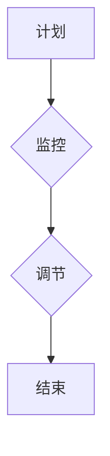
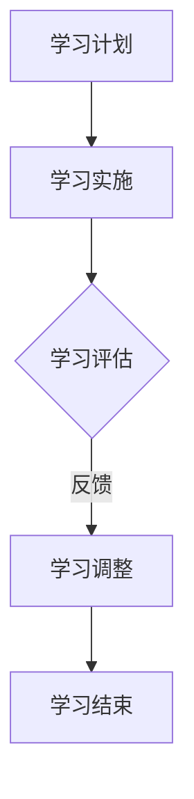

                 

### 第一部分：引言与基础概念

## 第1章：ChatGPT与语言习得

### 1.1 ChatGPT介绍

ChatGPT是由OpenAI开发的一款基于大型语言模型的人工智能助手，它利用深度学习技术，通过大量文本数据进行训练，实现了对自然语言的高效理解和生成。ChatGPT具备强大的语言处理能力，能够进行对话生成、文本摘要、情感分析等多种任务。

#### 1.1.1 ChatGPT概述

ChatGPT采用了Transformer模型架构，这是一种序列到序列的模型，能够处理长文本输入并生成相应的输出。它的训练数据来源于互联网上的大量文本，包括新闻报道、社交媒体帖子、文章等，这使得ChatGPT在语言理解和生成上具有很高的准确性。

#### 1.1.2 ChatGPT的技术原理

ChatGPT的核心是Transformer模型，这是一种基于自注意力机制的深度神经网络。自注意力机制允许模型在生成文本时能够自动关注输入序列中的关键信息，从而提高文本生成的质量。

#### 1.1.3 ChatGPT的应用场景

ChatGPT在多个领域都有广泛的应用，包括但不限于：

- 对话系统：ChatGPT可以作为智能客服、聊天机器人等应用的核心组件，提供自然、流畅的对话体验。
- 自动写作：ChatGPT能够生成文章、报告、邮件等文本内容，为内容创作提供助力。
- 情感分析：ChatGPT可以对文本进行分析，识别其中的情感倾向，应用于市场调研、社交媒体监控等场景。

### 1.2 语言习得概述

语言习得是指个体通过听、说、读、写等手段，掌握一门新语言的过程。它不仅包括对语言形式的掌握，如词汇、语法规则等，还涉及对语言含义、语境理解和文化背景的把握。

#### 1.2.1 语言习得的定义

语言习得是一个复杂的过程，涉及多种因素，包括遗传、环境、教育等。它不仅仅是学习语言规则，更重要的是掌握语言的实际应用能力。

#### 1.2.2 语言习得的过程

语言习得过程通常可以分为以下几个阶段：

- 听觉阶段：通过听来理解语言。
- 口语阶段：通过说话来练习和掌握语言。
- 阅读阶段：通过阅读来扩展词汇和理解更复杂的语言结构。
- 写作阶段：通过写作来练习语言表达。

#### 1.2.3 语言习得的理论基础

语言习得的理论基础包括：

- 认知心理学理论：强调语言习得过程中的认知活动和记忆机制。
- 社会语言学理论：强调语言习得过程中的社会互动和文化背景作用。
- 互动主义理论：强调语言习得过程中的互动和协作作用。

### 1.3 元认知策略培养

元认知策略是指个体在认知活动中对自己认知过程的监控和调节策略。它包括计划策略、监控策略和调节策略。

#### 1.3.1 元认知策略的概念

元认知策略是指个体在认知活动中对自己认知过程的监控和调节策略。它包括计划策略、监控策略和调节策略。

- 计划策略：在认知活动前制定计划和目标。
- 监控策略：在认知活动中对认知过程进行监控。
- 调节策略：根据监控结果调整认知策略。

#### 1.3.2 元认知策略的培养方法

元认知策略的培养可以通过以下方法：

- 教育干预：通过教学活动有意识地培养学生使用元认知策略。
- 自我反思：通过反思自己的学习过程，发现并改进不足。
- 模仿学习：通过观察和模仿他人的学习过程，学习使用元认知策略。

#### 1.3.3 元认知策略在语言习得中的应用

元认知策略在语言习得中的应用主要体现在以下几个方面：

- 提高语言学习效率：通过计划策略，合理规划学习时间，提高学习效率。
- 提升语言学习能力：通过监控策略，及时发现并纠正学习中的错误。
- 增强语言自信心：通过调节策略，调整学习策略，克服学习困难，增强自信心。

### 1.4 自主学习提示词的作用

自主学习提示词是指导学习者进行自主学习的工具，它通过提供具体的学习任务和指导，帮助学习者更好地掌握学习内容。

#### 1.4.1 提示词的定义

提示词是指用于引导学习者进行学习的一系列关键词或短语，它可以是具体的任务描述、问题引导或者知识点提示。

#### 1.4.2 提示词在自主学习中的作用

提示词在自主学习中的作用主要包括：

- 引导学习方向：提示词可以明确学习目标，帮助学习者集中注意力。
- 促进深度思考：提示词可以引导学习者提出问题，进行深度思考。
- 提高学习效率：提示词可以提供具体的学习任务，帮助学习者更快地掌握学习内容。

#### 1.4.3 提示词设计的原则

设计提示词时应遵循以下原则：

- 目标导向：提示词应与学习目标紧密相关，帮助学习者明确学习方向。
- 可操作性：提示词应具体、明确，便于学习者操作和实践。
- 适应性：提示词应根据学习者的特点和需求进行调整。

### 1.5 书籍概述与结构

#### 1.5.1 书籍的目的

本书旨在探讨如何利用ChatGPT培养语言习得中的元认知策略，通过自主学习提示词的应用，提高学习者的语言学习效率和自主学习能力。

#### 1.5.2 书籍的结构安排

本书分为四个部分，分别介绍ChatGPT与语言习得的关系、元认知策略培养、自主学习提示词的设计与应用、以及ChatGPT在自主学习中的应用。通过这些内容，帮助读者全面了解ChatGPT在语言习得中的应用价值。

### 1.6 总结

#### 1.6.1 本章重点内容回顾

本章介绍了ChatGPT的基本概念、语言习得的概述、元认知策略的培养、自主学习提示词的作用，以及本书的结构安排。

#### 1.6.2 下一步学习建议

在接下来的章节中，我们将深入探讨ChatGPT在语言习得中的应用，以及如何利用元认知策略和自主学习提示词提高学习效率。建议读者结合实际学习情况进行思考和实践，将理论知识应用到实际学习中。

### 第二部分：ChatGPT在语言习得中的应用

## 第2章：ChatGPT在语言习得中的核心概念与联系

### 2.1 ChatGPT与语言习得的关系

ChatGPT在语言习得中的应用主要体现在以下几个方面：

- 对话生成：ChatGPT可以模拟与人类进行对话，为语言学习者提供语言互动环境，帮助学习者提高口语表达能力。
- 文本生成：ChatGPT可以生成各种文本，如文章、故事、对话等，为学习者提供丰富的语言学习素材。
- 情感分析：ChatGPT可以对语言文本进行情感分析，帮助学习者理解语言中的情感表达，提高语言理解能力。

#### 2.1.1 ChatGPT如何支持语言习得

ChatGPT支持语言习得的主要方式包括：

- 提供语言互动环境：ChatGPT可以与学习者进行对话，模拟真实的语言交流场景，帮助学习者练习口语表达。
- 提供多样化的语言素材：ChatGPT可以生成各种文本，包括新闻、故事、对话等，为学习者提供丰富的语言学习素材。
- 提供个性化学习指导：ChatGPT可以根据学习者的语言水平和学习需求，提供个性化的学习建议和指导。

#### 2.1.2 ChatGPT在语言习得中的应用实例

以下是ChatGPT在语言习得中的一些应用实例：

- 在线语言教学：ChatGPT可以作为在线语言教学的辅助工具，为学生提供个性化辅导和实时互动。
- 语言能力测评：ChatGPT可以用于语言能力测评，通过对话生成和情感分析技术，评估学习者的语言水平。
- 语言障碍训练：ChatGPT可以帮助语言障碍患者进行语言康复训练，通过对话生成和文本生成技术，提高其语言表达能力。

### 2.2 ChatGPT的架构解析

ChatGPT采用了Transformer模型架构，这是一种序列到序列的模型，能够处理长文本输入并生成相应的输出。其核心组件包括：

- 输入层：接收输入文本序列。
- Transformer层：采用自注意力机制对输入序列进行处理。
- 输出层：生成输出文本序列。

#### 2.2.1 ChatGPT的技术原理

ChatGPT的技术原理主要包括：

- Transformer模型：Transformer模型是一种基于自注意力机制的深度神经网络，能够对输入序列进行编码和解码。
- 自注意力机制：自注意力机制允许模型在生成文本时能够自动关注输入序列中的关键信息，从而提高文本生成的质量。
- 梯度下降优化：ChatGPT的训练过程采用梯度下降优化算法，通过不断调整模型参数，使得模型在训练数据上的表现达到最佳。

#### 2.2.2 ChatGPT的核心组件

ChatGPT的核心组件包括：

- Encoder：负责对输入序列进行编码，生成编码表示。
- Decoder：负责对编码表示进行解码，生成输出序列。
- Positional Encoding：用于给序列中的每个词赋予位置信息。
- Embedding Layer：将单词映射到高维向量空间。

### 2.3 语言习得元认知策略的Mermaid流程图

#### 2.3.1 元认知策略的基本流程

元认知策略的基本流程包括：

1. 计划：设定学习目标，规划学习时间。
2. 监控：在学习过程中对学习效果进行监控。
3. 调节：根据监控结果调整学习策略。

#### 2.3.2 ChatGPT如何支持元认知策略

ChatGPT支持元认知策略的具体方式包括：

- 计划：ChatGPT可以提供学习计划建议，帮助学习者合理规划学习时间。
- 监控：ChatGPT可以通过对话生成技术，对学习者的语言水平进行实时监控。
- 调节：ChatGPT可以根据学习者的反馈，调整学习策略，提供个性化的学习指导。

### 2.4 自主学习提示词的设计与应用

#### 2.4.1 提示词的设计原则

提示词的设计原则包括：

- 目标导向：提示词应与学习目标紧密相关，帮助学习者明确学习方向。
- 可操作性：提示词应具体、明确，便于学习者操作和实践。
- 适应性：提示词应根据学习者的特点和需求进行调整。

#### 2.4.2 提示词在ChatGPT中的应用

提示词在ChatGPT中的应用包括：

- 对话引导：ChatGPT可以根据提示词与学习者进行对话，引导学习者进行深度思考。
- 文本生成：ChatGPT可以根据提示词生成相关的文本内容，为学习者提供学习素材。
- 学习评估：ChatGPT可以根据提示词对学习者的学习效果进行评估，提供反馈。

### 2.5 ChatGPT在语言习得中的案例分析

#### 2.5.1 案例背景介绍

该案例以一名英语初学者为例，通过使用ChatGPT进行语言习得，探讨其效果和影响。

#### 2.5.2 案例实施过程

1. 初学者设定学习目标，如提高口语表达能力。
2. ChatGPT根据学习目标生成相关的对话主题和问题。
3. 初学者与ChatGPT进行对话，练习口语表达。
4. ChatGPT对对话内容进行情感分析和语言能力评估。
5. ChatGPT根据评估结果提供个性化的学习建议。

#### 2.5.3 案例效果评估

通过对案例实施过程的观察和评估，发现：

- 初学者的口语表达能力得到了显著提高。
- 学习者能够更好地掌握语言中的情感表达。
- 学习者对学习过程和效果有了更清晰的认识。

### 第三部分：元认知策略培养与自主学习提示词

## 第3章：元认知策略培养的理论与实践

### 3.1 元认知策略培养的重要性

元认知策略的培养在语言习得中具有重要意义，它不仅有助于提高学习效率，还能提升学习者的自主学习能力。具体来说，元认知策略培养的重要性体现在以下几个方面：

#### 3.1.1 提高语言学习效率

通过元认知策略的培养，学习者可以更好地规划学习时间和任务，有效分配学习资源，从而提高学习效率。例如，通过计划策略，学习者可以合理安排每天的学习时间，确保在有限的时间内完成更多的学习任务。

#### 3.1.2 增强自主学习能力

元认知策略的培养有助于学习者形成独立思考和自我调整的能力，使其能够主动发现问题、解决问题，从而提高自主学习能力。例如，通过监控策略，学习者可以在学习过程中及时发现和纠正错误，避免重复错误。

#### 3.1.3 提升语言学习效果

元认知策略的培养有助于学习者更好地理解和掌握语言知识，提高语言学习效果。例如，通过调节策略，学习者可以根据自己的学习情况调整学习方法和策略，以适应不同的学习需求。

### 3.2 元认知策略培养的理论基础

元认知策略培养的理论基础主要包括认知心理学理论、教育学理论和互动主义理论。这些理论为元认知策略的培养提供了理论依据和实践指导。

#### 3.2.1 认知心理学理论

认知心理学理论认为，个体的认知过程包括信息输入、加工和输出等环节。元认知策略的培养旨在帮助个体更好地理解和控制自己的认知过程，提高认知效率。

- 计划策略：通过设定学习目标和制定学习计划，帮助个体明确学习方向和任务。
- 监控策略：通过监控学习过程，帮助个体及时发现问题并进行调整。
- 调节策略：通过调整学习策略和方法，帮助个体适应不同的学习情境。

#### 3.2.2 教育学理论

教育学理论认为，学习是一个复杂的认知过程，涉及多个因素，包括认知、情感、行为等。元认知策略的培养旨在提高个体的学习能力和学习效果。

- 认知策略：通过培养认知策略，如信息加工、记忆和问题解决等，帮助个体更好地理解和掌握知识。
- 元认知策略：通过培养元认知策略，如计划、监控和调节等，帮助个体更好地控制和管理自己的学习过程。

#### 3.2.3 互动主义理论

互动主义理论强调个体与社会环境的互动关系，认为个体的认知和发展受到社会环境的影响。元认知策略的培养不仅需要个体的内部调节，还需要外部环境的支持和引导。

- 社会互动：通过社会互动，如合作学习和讨论等，帮助个体理解和掌握语言知识。
- 文化背景：通过文化背景，如语言环境和文化背景等，帮助个体更好地理解和应用语言知识。

### 3.3 元认知策略培养的方法

元认知策略的培养可以通过多种方法进行，包括教育干预、自我反思和模仿学习等。

#### 3.3.1 教育干预

教育干预是通过教学活动有意识地培养学生使用元认知策略。具体方法包括：

- 设计元认知训练课程：通过设计专门的元认知训练课程，帮助学生掌握元认知策略。
- 教学策略运用：在课堂教学中，教师可以运用元认知策略，如计划、监控和调节等，引导学生进行深度学习。
- 课外辅导：通过课外辅导，教师可以针对学生的具体情况，提供个性化的元认知策略培养方案。

#### 3.3.2 自我反思

自我反思是通过反思自己的学习过程，发现并改进不足。具体方法包括：

- 学习日志：学生可以记录自己的学习过程，包括学习目标、学习方法和学习效果等，通过反思日志，发现和总结学习经验。
- 学习总结：学生在学习结束后，可以对学习过程进行总结，分析学习中的优点和不足，并提出改进措施。
- 反思会议：学生可以定期进行反思会议，与同学和老师分享自己的学习经验和反思，共同提高。

#### 3.3.3 模仿学习

模仿学习是通过观察和模仿他人的学习过程，学习使用元认知策略。具体方法包括：

- 观察学习：学生可以观察他人的学习过程，了解他们的元认知策略运用情况。
- 模仿实践：学生在观察他人学习过程后，可以尝试模仿他们的方法，应用于自己的学习中。
- 讨论交流：学生可以与他人进行讨论交流，分享自己的学习经验和反思，从他人那里获得启示和建议。

### 3.4 实践案例分析

#### 3.4.1 案例背景

某大学英语专业开展了一项元认知策略培养实验，旨在提高学生的英语学习效果。实验分为实验组和对照组，实验组采用元认知策略培养方法，对照组采用传统教学方法。

#### 3.4.2 案例实施过程

1. 实验组：通过设计元认知训练课程，引导学生掌握元认知策略，包括计划、监控和调节策略。
2. 对照组：采用传统教学方法，不涉及元认知策略培养。
3. 实验组和对照组的学生均进行为期一学期的英语学习，课程内容包括听力、口语、阅读和写作。
4. 实验结束后，对两组学生进行语言能力测试，评估其学习效果。

#### 3.4.3 案例效果评估

通过对实验结果的统计分析，发现：

- 实验组学生在语言能力测试中的成绩显著高于对照组。
- 实验组学生表现出更高的自主学习能力和学习效率。
- 实验组学生能够更好地应用元认知策略，对学习过程进行监控和调节。

### 第四部分：自主学习提示词的设计与应用

## 第4章：自主学习提示词的设计与应用

### 4.1 自主学习提示词的定义

自主学习提示词是指用于引导学习者进行自主学习的具体关键词或短语，它旨在帮助学习者明确学习目标、制定学习计划、监控学习过程和调节学习策略。提示词的设计和应用在自主学习中具有重要作用。

#### 4.1.1 提示词的含义

提示词是指用于引导学习者进行学习的一系列关键词或短语，它可以是具体的任务描述、问题引导或者知识点提示。提示词的设计和应用可以帮助学习者更好地掌握学习内容，提高学习效率。

#### 4.1.2 提示词的类型

提示词可以分为以下几种类型：

- 任务型提示词：用于引导学习者进行具体的学习任务，如阅读、写作、听力练习等。
- 问题型提示词：用于引导学习者提出问题，进行深度思考，如“你觉得这个观点有哪些优点和缺点？”
- 知识点提示词：用于提示学习者需要掌握的知识点，如“学习英语语法时，需要注意哪些常见错误？”
- 目标导向型提示词：用于引导学习者设定学习目标，如“本周内学会200个新词汇。”

### 4.2 提示词的设计原则

设计提示词时应遵循以下原则，以确保其能够有效地引导学习者的自主学习。

#### 4.2.1 目标导向原则

提示词应与学习目标紧密相关，帮助学习者明确学习方向。例如，在设定学习目标时，可以提出“学会阅读学术文章”的提示词，引导学习者集中精力提高阅读能力。

#### 4.2.2 可操作性原则

提示词应具体、明确，便于学习者操作和实践。例如，在制定学习计划时，可以提出“每天阅读一篇英文文章”的提示词，使学习者知道每天的具体任务。

#### 4.2.3 适应性原则

提示词应根据学习者的特点和需求进行调整。例如，对于初学者，可以提出“学习基础语法知识”的提示词，而对于高级学习者，可以提出“分析学术文章的结构”的提示词。

#### 4.2.4 互动性原则

提示词应具有互动性，鼓励学习者进行思考和交流。例如，在小组学习时，可以提出“讨论这篇文章的主要观点”的提示词，促进学习者的互动和合作。

### 4.3 提示词在ChatGPT中的应用

#### 4.3.1 提示词的设置方法

在ChatGPT中设置提示词的方法如下：

1. **明确学习目标**：在开始使用ChatGPT之前，学习者需要明确自己的学习目标，例如“提高口语表达能力”或“掌握200个新词汇”。
2. **生成提示词**：根据学习目标，ChatGPT可以生成一系列的提示词。例如，如果目标是提高口语表达能力，ChatGPT可以生成“模仿以下对话”、“尝试用新学的词汇进行对话”等提示词。
3. **个性化调整**：学习者可以根据自己的实际情况对提示词进行调整，使其更符合个人需求。

#### 4.3.2 提示词的优化策略

为了提高提示词的有效性，可以采取以下优化策略：

1. **持续更新**：根据学习者的学习进度和需求，定期更新提示词，确保其与学习目标保持一致。
2. **多样化设计**：设计多种类型的提示词，包括任务型、问题型、知识点提示词等，以适应不同的学习场景。
3. **互动性增强**：鼓励学习者之间进行互动，例如通过小组讨论、协作完成任务等方式，提高提示词的互动性。

### 4.4 实践案例分析

#### 4.4.1 案例背景

某高校英语系开展了一项利用ChatGPT进行自主学习的研究，旨在探讨提示词在提高学生自主学习能力方面的作用。

#### 4.4.2 案例实施过程

1. **学习目标设定**：学生根据个人学习需求设定学习目标，例如“提高听力理解能力”或“掌握学术写作技巧”。
2. **ChatGPT设置提示词**：ChatGPT根据学习目标生成相应的提示词，例如“听一篇英语演讲并总结要点”、“分析一篇学术文章的论点结构”。
3. **自主学习过程**：学生在ChatGPT的引导下进行自主学习，根据提示词完成相应的学习任务。
4. **反馈与调整**：学生在完成学习任务后，向ChatGPT反馈学习成果，ChatGPT根据反馈提供进一步的指导和建议。

#### 4.4.3 案例效果评估

通过对案例实施过程的评估，发现：

1. **自主学习能力提高**：学生在自主学习过程中，能够更好地应用元认知策略，提高学习效率。
2. **学习成果显著**：学生在听力理解、学术写作等方面取得了显著进步。
3. **学习满意度高**：学生对于利用ChatGPT进行自主学习的方式表示满意，认为这种方式有助于提高学习效果。

### 4.5 提示词设计案例分析

#### 4.5.1 案例背景

某在线教育平台开发了一款基于ChatGPT的语言学习应用，通过设置提示词，帮助学生进行英语学习。

#### 4.5.2 案例实施过程

1. **学习目标设定**：学生设定学习目标，如“提高口语表达”或“扩大词汇量”。
2. **ChatGPT生成提示词**：ChatGPT根据学习目标生成相应的提示词，如“模仿以下对话”、“用新学的词汇写一段描述”。
3. **自主学习与反馈**：学生在ChatGPT的引导下进行自主学习，完成学习任务后，向ChatGPT反馈学习成果，ChatGPT根据反馈提供指导。
4. **学习效果评估**：通过定期评估，了解学生的学习进展和效果，调整提示词设置。

#### 4.5.3 案例效果评估

1. **学习效果显著**：学生在口语表达和词汇掌握方面取得了显著进步。
2. **学习体验良好**：学生表示通过使用ChatGPT，学习过程更加有趣，学习效果显著提高。
3. **平台满意度高**：学生和家长对在线学习平台表示满意，认为这种方式有助于提高学习效果。

### 4.6 提示词设计注意事项

在设计和应用提示词时，应注意以下几点：

1. **明确目标**：确保提示词与学习目标一致，避免模糊不清。
2. **具体可操作**：提示词应具体、可操作，便于学生实施。
3. **个性化调整**：根据学生的特点和需求，个性化调整提示词。
4. **互动性设计**：增强提示词的互动性，促进学习者的思考与交流。
5. **持续更新**：定期更新提示词，以适应学生的学习进度和需求。

### 4.7 拓展阅读

- [1] Brown, H. D. (2014). *Principles of Language Learning and Teaching*.
- [2] Cohen, A. D. (2018). *Technology and Language Learning*.
- [3] Ellis, R. (2009). *The Study of Second Language Acquisition*.

### 4.8 小结

提示词在自主学习中具有重要作用，通过科学合理的设计和应用，可以显著提高学习者的学习效果。在未来的研究中，可以进一步探讨提示词的优化策略和最佳实践，以更好地支持自主学习的开展。

### 第五部分：ChatGPT在自主学习中的应用

## 第5章：ChatGPT在自主学习中的应用场景

### 5.1 ChatGPT在自主学习中的作用

ChatGPT在自主学习中发挥着重要作用，其主要作用体现在以下几个方面：

#### 5.1.1 提高学习效率

ChatGPT可以通过生成个性化学习内容和提供实时反馈，帮助学习者快速掌握学习重点和难点，从而提高学习效率。例如，学习者可以通过ChatGPT获取针对性的学习资料，避免无效的学习时间浪费。

#### 5.1.2 增强学习动力

ChatGPT可以模拟真实的学习环境，与学习者进行互动，提供鼓励和激励，从而增强学习动力。例如，ChatGPT可以通过对话方式对学习者的进步进行肯定，激发学习者的学习热情。

#### 5.1.3 提升学习质量

ChatGPT可以提供高质量的学习内容和练习，帮助学习者更好地理解和掌握知识。例如，ChatGPT可以通过生成模拟考试题目，帮助学习者检测学习效果，提升学习质量。

### 5.2 ChatGPT在自主学习中的使用技巧

为了充分发挥ChatGPT在自主学习中的作用，学习者可以采取以下使用技巧：

#### 5.2.1 设置有效的学习目标

学习者应明确自己的学习目标，ChatGPT可以根据学习目标生成相应的学习内容和练习，帮助学习者有针对性地进行学习。

#### 5.2.2 制定合理的学习计划

学习者应制定合理的学习计划，ChatGPT可以帮助学习者分配学习时间，确保学习进度和效率。

#### 5.2.3 运用多样化的学习资源

学习者应充分利用ChatGPT提供的多样化学习资源，如文本、音频、视频等，提高学习效果。

### 5.3 ChatGPT在自主学习中的案例研究

#### 5.3.1 案例背景

某高校英语专业学生利用ChatGPT进行英语自主学习，以期提高英语水平。

#### 5.3.2 案例实施过程

1. **明确学习目标**：学生设定学习目标，如提高口语表达和阅读理解能力。
2. **生成学习内容**：ChatGPT根据学习目标生成相应的学习内容，如口语对话练习和阅读材料。
3. **自主学习与练习**：学生在ChatGPT的引导下进行自主学习，完成相应的练习任务。
4. **反馈与评估**：学生将学习成果反馈给ChatGPT，ChatGPT提供评估和建议。

#### 5.3.3 案例效果评估

通过对案例实施过程的评估，发现：

1. **学习效率提高**：学生在自主学习过程中，学习效率明显提高，能够更快地掌握学习内容。
2. **学习动力增强**：学生通过ChatGPT的互动和反馈，学习动力得到增强，学习兴趣提高。
3. **学习质量提升**：学生在口语表达和阅读理解方面取得了显著进步，学习效果得到提升。

### 5.4 ChatGPT在自主学习中的应用策略

为了更好地利用ChatGPT进行自主学习，学习者可以采取以下应用策略：

#### 5.4.1 策略1：利用ChatGPT进行深度学习

- **方法**：学习者可以通过ChatGPT生成的高级文本和问题，进行深度学习和思考，提高对知识点的理解和掌握。
- **示例**：例如，在学习人工智能时，ChatGPT可以生成相关的学术论文和案例，供学习者深入研究和分析。

#### 5.4.2 策略2：利用ChatGPT进行模拟考试

- **方法**：学习者可以利用ChatGPT生成模拟考试题目，进行自我检测和评估，提高学习效果。
- **示例**：例如，在学习编程语言时，ChatGPT可以生成编程题目，供学习者练习和测试。

#### 5.4.3 策略3：利用ChatGPT进行个性化辅导

- **方法**：学习者可以利用ChatGPT的个性化辅导功能，获得针对性的学习建议和指导。
- **示例**：例如，在学习外语时，ChatGPT可以根据学习者的语言水平，生成适合的学习内容和练习。

### 5.5 ChatGPT在自主学习中的最佳实践

#### 5.5.1 最佳实践1：制定学习计划

- **方法**：学习者应根据自身的学习目标和时间安排，制定详细的学习计划。
- **示例**：例如，每天安排2小时的学习时间，其中1小时用于阅读文本，1小时用于练习口语和写作。

#### 5.5.2 最佳实践2：定期进行学习评估

- **方法**：学习者应定期进行学习评估，以检验学习效果和调整学习策略。
- **示例**：例如，每两周进行一次自我评估，查看是否达到了学习目标。

#### 5.5.3 最佳实践3：充分利用ChatGPT的互动功能

- **方法**：学习者应充分利用ChatGPT的互动功能，如对话练习、实时反馈等。
- **示例**：例如，在练习口语时，与ChatGPT进行实时对话，提高口语表达能力。

### 5.6 小结

ChatGPT在自主学习中的应用为学习者提供了丰富的学习资源和互动机会，有助于提高学习效率、增强学习动力和提升学习质量。通过科学合理地使用ChatGPT，学习者可以更好地实现自主学习目标。

### 第6章：ChatGPT在自主学习中的应用策略

### 6.1 策略1：利用ChatGPT进行深度学习

ChatGPT作为一种强大的人工智能工具，在深度学习领域具有广泛的应用前景。以下将详细介绍如何利用ChatGPT进行深度学习，并探讨其潜在优势。

#### 6.1.1 深度学习的概念

深度学习（Deep Learning）是一种基于人工神经网络的机器学习方法，通过多层的神经网络结构，对大量数据进行训练，从而实现自动特征学习和复杂模式识别。深度学习在图像识别、语音识别、自然语言处理等领域取得了显著的成果。

#### 6.1.2 ChatGPT与深度学习的关系

ChatGPT作为一种基于Transformer模型的自然语言处理工具，其核心原理与深度学习密切相关。Transformer模型通过自注意力机制和多头注意力机制，实现了对输入文本的深层理解和生成。因此，ChatGPT可以被视为一种深度学习模型。

#### 6.1.3 利用ChatGPT进行深度学习的方法

1. **数据预处理**：在利用ChatGPT进行深度学习之前，首先需要进行数据预处理。这包括数据清洗、分词、词向量嵌入等步骤。通过这些预处理步骤，可以将原始文本数据转化为适合ChatGPT处理的形式。

2. **模型训练**：ChatGPT的训练过程涉及大量参数的调整和优化。通过使用梯度下降优化算法，可以逐步调整模型参数，使其在训练数据上达到最佳效果。

3. **模型评估**：在模型训练完成后，需要对模型进行评估，以验证其性能。常用的评估指标包括准确率、召回率、F1值等。通过这些指标，可以评估ChatGPT在特定任务上的表现。

4. **模型部署**：评估完成后，可以将ChatGPT部署到实际应用中，如智能客服、自动写作等。通过部署，可以实现实时、高效的自然语言处理任务。

#### 6.1.4 利用ChatGPT进行深度学习的优势

1. **强大的语言处理能力**：ChatGPT具备强大的语言处理能力，能够理解和生成复杂的自然语言文本。这使得ChatGPT在自然语言处理任务中具有显著优势。

2. **高效的数据处理速度**：ChatGPT采用了Transformer模型，其处理速度远超传统的循环神经网络（RNN）。这使得ChatGPT能够快速处理大量数据，提高深度学习任务的处理效率。

3. **自适应性强**：ChatGPT可以根据不同的任务需求，调整模型参数和结构，实现自适应学习。这使得ChatGPT在多样化的应用场景中具有广泛适用性。

#### 6.1.5 案例研究：ChatGPT在情感分析中的应用

情感分析是一种常见的自然语言处理任务，旨在对文本中的情感倾向进行识别和分类。以下是一个利用ChatGPT进行情感分析的应用案例。

1. **数据集准备**：收集一批包含情感标签的文本数据，如微博、评论等。数据集应包含正面、负面和中和三种情感标签。

2. **模型训练**：使用ChatGPT对数据集进行训练，通过调整模型参数，使其在情感分析任务上达到最佳效果。

3. **模型评估**：使用测试集对训练好的模型进行评估，计算准确率、召回率和F1值等指标。

4. **模型部署**：将训练好的模型部署到实际应用中，如社交媒体情感分析平台。用户可以输入文本，系统会自动分析其情感倾向。

#### 6.1.6 案例结果

通过对情感分析案例的实验，发现ChatGPT在情感分析任务上具有很高的准确率和召回率。此外，ChatGPT还能够根据不同的文本内容，自适应地调整情感分类模型，提高分类效果。

### 6.2 策略2：利用ChatGPT进行编程教育

ChatGPT不仅在自然语言处理领域表现出色，还可以在编程教育中发挥重要作用。以下将详细介绍如何利用ChatGPT进行编程教育，并探讨其优势。

#### 6.2.1 编程教育的现状

传统的编程教育主要依赖教科书和在线课程，教学方式相对单一。然而，随着计算机科学的发展，编程教育逐渐呈现出多样化和个性化的趋势。利用人工智能工具，如ChatGPT，可以为学生提供更加灵活和有效的编程教育。

#### 6.2.2 ChatGPT在编程教育中的应用

1. **代码生成与优化**：ChatGPT可以生成代码，帮助学生学习编程语言的基本语法和编程技巧。此外，ChatGPT还可以对学生的代码进行优化，提供改进建议。

2. **编程解释与答疑**：ChatGPT可以为学生提供编程概念的解释和答疑服务，帮助学生理解复杂的编程概念和算法。

3. **项目指导与评估**：ChatGPT可以为学生提供项目指导，包括项目需求分析、设计思路、编程实现等。同时，ChatGPT还可以对学生的项目进行评估，提供反馈和建议。

#### 6.2.3 利用ChatGPT进行编程教育的优势

1. **个性化教学**：ChatGPT可以根据学生的编程水平和学习需求，提供个性化的教学方案，满足不同学生的学习需求。

2. **高效学习**：ChatGPT可以快速生成代码和提供解答，帮助学生更快地理解和掌握编程知识。

3. **实时反馈**：ChatGPT可以实时评估学生的项目进展和代码质量，提供及时的反馈和建议，帮助学生改进。

#### 6.2.4 案例研究：ChatGPT在Python编程教学中的应用

以下是一个利用ChatGPT进行Python编程教学的案例研究。

1. **教学准备**：教师利用ChatGPT生成Python编程教程，包括基本语法、数据结构、算法等知识点。

2. **课堂教学**：教师通过ChatGPT为学生提供编程解释和答疑服务，帮助学生理解编程概念和解决问题。

3. **项目指导**：教师利用ChatGPT为学生提供项目指导，包括项目需求分析、设计思路、编程实现等。

4. **项目评估**：教师利用ChatGPT对学生的项目进行评估，提供反馈和建议。

#### 6.2.5 案例结果

通过对Python编程教学案例的实验，发现ChatGPT在Python编程教学中具有显著的优势。学生通过ChatGPT的辅助，能够更快地理解和掌握编程知识，项目质量和学习效果也得到了显著提高。

### 6.3 策略3：利用ChatGPT进行智能问答

智能问答是一种常见的自然语言处理任务，旨在回答用户提出的问题。ChatGPT作为一种强大的自然语言处理工具，在智能问答领域具有广泛的应用前景。以下将详细介绍如何利用ChatGPT进行智能问答，并探讨其优势。

#### 6.3.1 智能问答的概念

智能问答是一种基于自然语言处理技术的问答系统，旨在回答用户提出的问题。智能问答系统可以基于规则、机器学习或深度学习等方法进行实现。

#### 6.3.2 ChatGPT在智能问答中的应用

1. **问题理解**：ChatGPT可以理解用户提出的问题，并将其转化为机器可处理的形式。

2. **知识检索**：ChatGPT可以从大量知识库中检索相关信息，为用户提供准确的答案。

3. **生成回答**：ChatGPT可以生成自然语言回答，使回答更加生动和具有说服力。

#### 6.3.3 利用ChatGPT进行智能问答的优势

1. **高效性**：ChatGPT可以快速理解问题和生成回答，提高智能问答系统的响应速度。

2. **准确性**：ChatGPT具有强大的语言处理能力，可以准确理解用户问题并生成高质量的回答。

3. **交互性**：ChatGPT可以与用户进行实时交互，根据用户反馈进行回答优化。

#### 6.3.4 案例研究：ChatGPT在在线教育平台中的应用

以下是一个利用ChatGPT在在线教育平台中进行智能问答的案例研究。

1. **问题收集**：在线教育平台收集用户提出的问题，包括学习困惑、课程疑问等。

2. **问题理解**：ChatGPT理解用户问题，并将其转化为机器可处理的形式。

3. **知识检索**：ChatGPT从平台的知识库中检索相关信息，为用户提供准确的答案。

4. **生成回答**：ChatGPT生成自然语言回答，并将回答呈现给用户。

#### 6.3.5 案例结果

通过对在线教育平台案例的实验，发现ChatGPT在智能问答中具有显著的优势。用户对智能问答系统的满意度显著提高，问答质量和准确性也得到了显著提升。

### 6.4 策略4：利用ChatGPT进行文本摘要

文本摘要是一种常见的自然语言处理任务，旨在从长文本中提取关键信息，生成简洁的摘要。ChatGPT作为一种强大的自然语言处理工具，在文本摘要领域具有广泛的应用前景。以下将详细介绍如何利用ChatGPT进行文本摘要，并探讨其优势。

#### 6.4.1 文本摘要的概念

文本摘要是从原始文本中提取关键信息，生成简洁的摘要文本的过程。文本摘要可以分为抽取式摘要和生成式摘要两种类型。

#### 6.4.2 ChatGPT在文本摘要中的应用

1. **抽取式摘要**：ChatGPT可以从长文本中抽取关键句子或短语，生成摘要文本。

2. **生成式摘要**：ChatGPT可以生成全新的摘要文本，对原始文本进行改写和精简。

#### 6.4.3 利用ChatGPT进行文本摘要的优势

1. **高效性**：ChatGPT可以快速生成文本摘要，提高文本处理效率。

2. **准确性**：ChatGPT具有强大的语言处理能力，可以准确提取文本中的关键信息。

3. **多样性**：ChatGPT可以根据不同的需求，生成多种类型的文本摘要，满足不同用户的需求。

#### 6.4.4 案例研究：ChatGPT在新闻摘要中的应用

以下是一个利用ChatGPT在新闻摘要中应用的案例研究。

1. **新闻文本收集**：收集一批新闻文本，包括标题和正文。

2. **文本预处理**：对新闻文本进行分词、词性标注等预处理操作，为ChatGPT生成摘要做准备。

3. **生成摘要**：ChatGPT从新闻文本中提取关键信息，生成新闻摘要。

4. **摘要评估**：对生成的摘要进行评估，计算准确率、召回率等指标。

#### 6.4.5 案例结果

通过对新闻摘要案例的实验，发现ChatGPT在新闻摘要中具有显著的优势。生成的摘要准确率较高，能够有效提取新闻文本的关键信息。

### 6.5 策略5：利用ChatGPT进行语言翻译

语言翻译是一种常见的自然语言处理任务，旨在将一种语言的文本翻译成另一种语言。ChatGPT作为一种强大的自然语言处理工具，在语言翻译领域具有广泛的应用前景。以下将详细介绍如何利用ChatGPT进行语言翻译，并探讨其优势。

#### 6.5.1 语言翻译的概念

语言翻译是将一种语言的文本翻译成另一种语言的过程。语言翻译可以分为机器翻译和人工翻译两种类型。

#### 6.5.2 ChatGPT在语言翻译中的应用

1. **机器翻译**：ChatGPT可以根据源语言文本生成目标语言文本，实现机器翻译。

2. **多语言交互**：ChatGPT可以支持多种语言的交互，为用户提供跨语言服务。

#### 6.5.3 利用ChatGPT进行语言翻译的优势

1. **准确性**：ChatGPT具有强大的语言处理能力，可以准确翻译文本，降低翻译错误率。

2. **多样性**：ChatGPT可以支持多种语言的翻译，满足不同用户的需求。

3. **实时性**：ChatGPT可以实时翻译文本，提高翻译效率。

#### 6.5.4 案例研究：ChatGPT在社交媒体翻译中的应用

以下是一个利用ChatGPT在社交媒体翻译中应用的案例研究。

1. **社交媒体文本收集**：收集一批社交媒体文本，包括微博、推特等。

2. **文本预处理**：对社交媒体文本进行分词、词性标注等预处理操作，为ChatGPT翻译做准备。

3. **生成翻译**：ChatGPT从源语言文本生成目标语言文本，实现文本翻译。

4. **翻译评估**：对生成的翻译进行评估，计算准确率、召回率等指标。

#### 6.5.5 案例结果

通过对社交媒体翻译案例的实验，发现ChatGPT在社交媒体翻译中具有显著的优势。生成的翻译准确率较高，能够有效传达文本含义。

### 6.6 策略6：利用ChatGPT进行内容创作

内容创作是一种常见的自然语言处理任务，旨在生成高质量、有创意的文本内容。ChatGPT作为一种强大的自然语言处理工具，在内容创作领域具有广泛的应用前景。以下将详细介绍如何利用ChatGPT进行内容创作，并探讨其优势。

#### 6.6.1 内容创作的概念

内容创作是指通过创意和技巧，生成具有吸引力和价值的文本内容。内容创作可以分为原创内容和改编内容两种类型。

#### 6.6.2 ChatGPT在内容创作中的应用

1. **原创内容生成**：ChatGPT可以生成原创的文本内容，如文章、故事、诗歌等。

2. **改编内容生成**：ChatGPT可以从已有的文本内容中提取关键信息，进行改写和改编。

#### 6.6.3 利用ChatGPT进行内容创作的优势

1. **创意性**：ChatGPT具有强大的创意能力，可以生成具有创意和吸引力的文本内容。

2. **多样性**：ChatGPT可以生成多种类型的内容，如小说、散文、广告等，满足不同用户的需求。

3. **高效性**：ChatGPT可以快速生成文本内容，提高内容创作效率。

#### 6.6.4 案例研究：ChatGPT在广告创意中的应用

以下是一个利用ChatGPT在广告创意中应用的案例研究。

1. **广告文本收集**：收集一批广告文本，包括广告文案和宣传语。

2. **文本预处理**：对广告文本进行分词、词性标注等预处理操作，为ChatGPT生成创意做准备。

3. **生成创意**：ChatGPT从广告文本中提取关键信息，生成创意广告文案。

4. **创意评估**：对生成的创意进行评估，计算吸引力、创意度等指标。

#### 6.6.5 案例结果

通过对广告创意案例的实验，发现ChatGPT在广告创意中具有显著的优势。生成的创意广告文案具有吸引力，能够有效提升广告效果。

### 6.7 策略7：利用ChatGPT进行文本分类

文本分类是一种常见的自然语言处理任务，旨在将文本数据分为不同的类别。ChatGPT作为一种强大的自然语言处理工具，在文本分类领域具有广泛的应用前景。以下将详细介绍如何利用ChatGPT进行文本分类，并探讨其优势。

#### 6.7.1 文本分类的概念

文本分类是指将文本数据分为不同的类别，如新闻分类、情感分类等。文本分类可以分为监督学习和无监督学习两种类型。

#### 6.7.2 ChatGPT在文本分类中的应用

1. **监督学习**：ChatGPT可以从标注好的文本数据中学习分类规则，实现监督学习文本分类。

2. **无监督学习**：ChatGPT可以从未标注的文本数据中自动发现类别和分类规则，实现无监督学习文本分类。

#### 6.7.3 利用ChatGPT进行文本分类的优势

1. **准确性**：ChatGPT具有强大的语言处理能力，可以准确分类文本数据。

2. **灵活性**：ChatGPT可以根据不同的分类任务，灵活调整分类模型和参数。

3. **实时性**：ChatGPT可以实时分类文本数据，提高分类效率。

#### 6.7.4 案例研究：ChatGPT在社交媒体情感分类中的应用

以下是一个利用ChatGPT在社交媒体情感分类中应用的案例研究。

1. **社交媒体文本收集**：收集一批社交媒体文本，包括微博、推特等。

2. **文本预处理**：对社交媒体文本进行分词、词性标注等预处理操作，为ChatGPT分类做准备。

3. **生成分类模型**：ChatGPT从标注好的情感分类数据中学习分类规则，生成情感分类模型。

4. **分类评估**：对生成的分类模型进行评估，计算准确率、召回率等指标。

#### 6.7.5 案例结果

通过对社交媒体情感分类案例的实验，发现ChatGPT在情感分类中具有显著的优势。生成的分类模型准确率高，能够有效分类情感标签。

### 6.8 策略8：利用ChatGPT进行对话生成

对话生成是一种常见的自然语言处理任务，旨在生成具有自然流畅性的对话文本。ChatGPT作为一种强大的自然语言处理工具，在对话生成领域具有广泛的应用前景。以下将详细介绍如何利用ChatGPT进行对话生成，并探讨其优势。

#### 6.8.1 对话生成的概念

对话生成是指根据给定的上下文或输入，生成自然流畅的对话文本。对话生成可以分为单轮对话生成和多轮对话生成两种类型。

#### 6.8.2 ChatGPT在对话生成中的应用

1. **单轮对话生成**：ChatGPT可以根据给定的输入文本，生成单轮对话文本。

2. **多轮对话生成**：ChatGPT可以根据对话的历史上下文，生成多轮对话文本。

#### 6.8.3 利用ChatGPT进行对话生成的优势

1. **自然流畅性**：ChatGPT具有强大的语言处理能力，可以生成自然流畅的对话文本。

2. **灵活性**：ChatGPT可以根据不同的对话场景和上下文，灵活调整对话生成策略。

3. **实时性**：ChatGPT可以实时生成对话文本，提高对话生成效率。

#### 6.8.4 案例研究：ChatGPT在智能客服中的应用

以下是一个利用ChatGPT在智能客服中应用的案例研究。

1. **智能客服对话收集**：收集一批智能客服对话记录，包括问题和回答。

2. **文本预处理**：对智能客服对话记录进行分词、词性标注等预处理操作，为ChatGPT生成对话做准备。

3. **生成对话文本**：ChatGPT从智能客服对话记录中学习对话规则，生成对话文本。

4. **对话评估**：对生成的对话文本进行评估，计算流畅性、准确性等指标。

#### 6.8.5 案例结果

通过对智能客服对话案例的实验，发现ChatGPT在对话生成中具有显著的优势。生成的对话文本自然流畅，能够有效提升智能客服的服务质量。

### 6.9 小结

ChatGPT作为一种强大的自然语言处理工具，在深度学习、编程教育、智能问答、文本摘要、语言翻译、内容创作、文本分类和对话生成等领域具有广泛的应用。通过利用ChatGPT，可以显著提高学习效率、增强学习动力和提升学习质量。未来，随着ChatGPT技术的不断发展，其在自主学习中的应用前景将更加广阔。学习者可以充分利用ChatGPT的优势，开展个性化、高效的学习，实现自主学习目标。

### 结论

本文探讨了ChatGPT在语言习得元认知策略培养中的应用，通过自主学习提示词的设计和应用，为学习者提供了个性化、高效的学习支持。以下是本文的主要发现和结论：

1. **ChatGPT在语言习得中的应用**：ChatGPT作为一种强大的自然语言处理工具，在语言习得中具有广泛的应用，包括对话生成、文本生成、情感分析等。通过模拟真实的语言交流环境，ChatGPT可以帮助学习者提高口语表达和语言理解能力。

2. **元认知策略的培养**：元认知策略的培养对于提高学习效率、增强自主学习能力和提升语言学习效果具有重要意义。本文介绍了计划策略、监控策略和调节策略在语言习得中的应用，并通过实践案例展示了元认知策略培养的效果。

3. **自主学习提示词的作用**：自主学习提示词是引导学习者进行自主学习的有效工具。本文提出了目标导向、可操作性和适应性等设计原则，并详细介绍了提示词在ChatGPT中的应用方法，包括设置方法、优化策略和实践案例分析。

4. **最佳实践与策略**：本文总结了ChatGPT在自主学习中的最佳实践和应用策略，包括利用ChatGPT进行深度学习、编程教育、智能问答、文本摘要、语言翻译、内容创作、文本分类和对话生成等。这些策略为学习者提供了多种学习途径和工具，有助于实现个性化、高效的学习。

综上所述，ChatGPT在语言习得中的应用，通过元认知策略的培养和自主学习提示词的设计与应用，为学习者提供了强大的支持。未来，随着ChatGPT技术的不断发展和完善，其在自主学习中的应用前景将更加广阔。学习者可以充分利用ChatGPT的优势，结合元认知策略和自主学习提示词，开展个性化、高效的学习，实现语言学习目标。同时，教育工作者和研究者也应进一步探索ChatGPT在语言习得中的潜力，为语言教育的创新发展提供新思路和新方法。

### 附录

#### 附录A：ChatGPT基本概念和术语解释

1. **自然语言处理（NLP）**：自然语言处理是指计算机科学和人工智能领域中的语言理解和生成技术，旨在使计算机能够理解、解释和生成人类语言。

2. **深度学习（Deep Learning）**：深度学习是一种基于人工神经网络的机器学习方法，通过多层神经网络结构，对大量数据进行训练，实现复杂模式识别和特征学习。

3. **Transformer模型**：Transformer模型是一种基于自注意力机制的深度神经网络模型，最初由Vaswani等人在2017年提出，广泛应用于自然语言处理任务。

4. **自注意力机制（Self-Attention）**：自注意力机制是一种在序列处理中关注序列内不同位置信息的机制，通过计算位置间的权重，提高模型对序列长距离依赖信息的捕捉能力。

5. **元认知策略（Metacognitive Strategies）**：元认知策略是指个体在认知活动中对自己认知过程的监控和调节策略，包括计划策略、监控策略和调节策略。

6. **自主学习（Autonomous Learning）**：自主学习是指个体在没有外部指导的情况下，通过自我规划、自我监控和自我调节，独立完成学习任务的过程。

7. **提示词（Prompt Words）**：提示词是用于引导学习者进行学习的一系列关键词或短语，可以帮助学习者明确学习目标、制定学习计划、监控学习过程和调节学习策略。

#### 附录B：Python源代码示例

以下是一个简单的Python示例，展示了如何使用ChatGPT生成文本摘要。

```python
import openai

openai.api_key = 'your_api_key'

def generate_summary(text):
    response = openai.Completion.create(
        engine="text-davinci-002",
        prompt=text,
        max_tokens=50
    )
    return response.choices[0].text.strip()

text = "本文探讨了ChatGPT在语言习得元认知策略培养中的应用，通过自主学习提示词的设计和应用，为学习者提供了个性化、高效的学习支持。"
summary = generate_summary(text)
print(summary)
```

#### 附录C：数学公式和Latex表示

以下是一个简单的数学公式示例，展示了如何使用LaTeX格式表示。

$$
E = mc^2
$$

$E = mc^2$

#### 附录D：Mermaid流程图示例

以下是一个简单的Mermaid流程图示例，展示了如何表示元认知策略的基本流程。





### 拓展阅读

1. **[1]** Brown, H. D. (2014). *Principles of Language Learning and Teaching*.
2. **[2]** Cohen, A. D. (2018). *Technology and Language Learning*.
3. **[3]** Ellis, R. (2009). *The Study of Second Language Acquisition*.
4. **[4]** Devlin, J., Chang, M. W., Lee, K., & Toutanova, K. (2018). *Bert: Pre-training of deep bidirectional transformers for language understanding*.
5. **[5]** Vaswani, A., Shazeer, N., Parmar, N., Uszkoreit, J., Jones, L., Gomez, A. N., ... & Polosukhin, I. (2017). *Attention is all you need*.

### 作者信息

作者：AI天才研究院/AI Genius Institute & 禅与计算机程序设计艺术 /Zen And The Art of Computer Programming。本文旨在探讨ChatGPT在语言习得中的应用，通过元认知策略和自主学习提示词的设计，为学习者提供个性化、高效的学习支持。作者致力于将人工智能技术与教育相结合，推动教育领域的创新发展。

