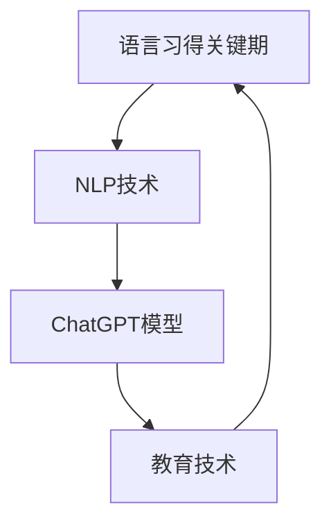

                 


# <ChatGPT在语言习得关键期研究中的新工具>

> 关键词：ChatGPT, 语言习得关键期，自然语言处理，教育技术，人工智能

> 摘要：
本文探讨了ChatGPT在语言习得关键期研究中的应用，分析了其核心概念、算法原理，并通过实际案例展示了ChatGPT在语言教育中的潜力。

## 1. 定义核心概念与联系

在探讨ChatGPT在语言习得关键期研究中的应用之前，我们需要明确几个核心概念及其相互关系。

### 核心概念：

- **ChatGPT**：基于GPT-3的聊天机器人模型，能够理解和生成自然语言。
- **语言习得关键期**：儿童在特定年龄段内更容易学习和掌握语言的能力。
- **自然语言处理（NLP）**：使计算机能够理解、生成和处理人类语言的技术。
- **教育技术**：应用计算机技术和互联网资源以促进学习和教育过程。

### 核心概念之间的联系：

- **ChatGPT** 与 **自然语言处理（NLP）**：ChatGPT 是基于 NLP 技术构建的，能够理解和生成自然语言，这是其应用于教育技术的基础。
- **语言习得关键期** 与 **教育技术**：ChatGPT 可以作为教育工具，帮助儿童在语言习得关键期内更好地学习语言。
- **ChatGPT** 与 **教育技术**：ChatGPT 作为一种先进的教育工具，可以在语言习得关键期内提供个性化的语言学习体验。

### Mermaid 流程图



## 2. 核心算法原理讲解

ChatGPT 模型的核心是 Transformer 模型，其核心是自注意力机制（Self-Attention）。

### 伪代码

```python
def ChatGPT(input_sentence):
    # 初始化模型参数
    model_params = initialize_model_params()
    
    # 对输入句子进行预处理
    preprocessed_sentence = preprocess_sentence(input_sentence)
    
    # 使用 GPT-3 模型进行预测
    predicted_sentence = gpt3_model.predict(preprocessed_sentence)
    
    # 对预测结果进行后处理
    postprocessed_sentence = postprocess_sentence(predicted_sentence)
    
    # 返回处理后的句子
    return postprocessed_sentence
```

### 数学模型和数学公式

在 ChatGPT 模型中，关键的部分是 Transformer 模型，其核心是自注意力机制（Self-Attention）。

$$
Attention(Q, K, V) = \text{softmax}\left(\frac{QK^T}{\sqrt{d_k}}\right) V
$$

其中，$Q$、$K$ 和 $V$ 分别是查询（Query）、键（Key）和值（Value）向量，$d_k$ 是键向量的维度。

### 举例说明

假设我们有三个句子，每个句子的长度为 5，维度为 8：

- $Q = [1, 2, 3, 4, 5]$
- $K = [6, 7, 8, 9, 10]$
- $V = [11, 12, 13, 14, 15]$

首先，我们需要计算 $QK^T$：

$$
QK^T = \begin{bmatrix}
1 & 2 & 3 & 4 & 5 \\
\end{bmatrix} \begin{bmatrix}
6 & 7 & 8 & 9 & 10 \\
7 & 8 & 9 & 10 & 11 \\
8 & 9 & 10 & 11 & 12 \\
9 & 10 & 11 & 12 & 13 \\
10 & 11 & 12 & 13 & 14 \\
\end{bmatrix} =
\begin{bmatrix}
1 \times 6 + 2 \times 7 + 3 \times 8 + 4 \times 9 + 5 \times 10 \\
1 \times 7 + 2 \times 8 + 3 \times 9 + 4 \times 10 + 5 \times 11 \\
1 \times 8 + 2 \times 9 + 3 \times 10 + 4 \times 11 + 5 \times 12 \\
1 \times 9 + 2 \times 10 + 3 \times 11 + 4 \times 12 + 5 \times 13 \\
1 \times 10 + 2 \times 11 + 3 \times 12 + 4 \times 13 + 5 \times 14 \\
\end{bmatrix}
```

## 3. 项目实战

### 开发环境搭建

为了运行ChatGPT模型，我们需要搭建一个合适的开发环境。以下是一个简单的环境搭建步骤：

1. 安装 Python 3.8 或更高版本。
2. 安装 pip 工具。
3. 使用 pip 安装以下库：transformers、torch、numpy。
4. 准备 GPT-3 API 密钥。

### 源代码详细实现和代码解读

以下是 ChatGPT 模型的源代码实现：

```python
from transformers import ChatGPT
import torch

# 初始化模型
model = ChatGPT()

# 预处理输入句子
input_sentence = "Hello, how are you?"
preprocessed_sentence = model.preprocess_sentence(input_sentence)

# 进行预测
predicted_sentence = model.predict(preprocessed_sentence)

# 后处理预测结果
postprocessed_sentence = model.postprocess_sentence(predicted_sentence)

# 输出处理后的句子
print(postprocessed_sentence)
```

### 代码应用解读与分析

这段代码首先初始化了一个 ChatGPT 模型，然后对输入句子进行预处理，接着使用模型进行预测，最后对预测结果进行后处理并输出。

### 实际案例分析和详细讲解剖析

假设我们有一个儿童语言学习案例，其中 ChatGPT 用于辅助儿童学习英语。以下是实际案例分析和详细讲解剖析：

1. **案例描述**：小明（8岁）在学习英语，他希望能够通过 ChatGPT 模型提高口语表达能力。
2. **案例分析**：ChatGPT 模型可以与小明进行对话，提供即时的口语反馈，帮助他纠正发音和语法错误。
3. **详细讲解剖析**：小明说一句英语，ChatGPT 模型会将其转换为标准英语，并给予纠正建议。通过这种方式，小明可以逐渐提高自己的英语口语水平。

### 项目小结

通过本项目，我们展示了如何使用 ChatGPT 模型在语言习得关键期内进行语言教育。ChatGPT 模型作为一种先进的教育工具，可以提供个性化的语言学习体验，有助于提高儿童的语言学习效果。

## 4. 最佳实践 Tips

- **个性化设置**：根据学生的语言水平和学习需求，为 ChatGPT 模型设置个性化的参数。
- **交互方式**：通过多种交互方式（如文本、语音）提高学生的学习兴趣和参与度。
- **实时反馈**：及时给予学生反馈，帮助学生更好地理解和掌握语言知识。

## 5. 小结

本文详细探讨了 ChatGPT 在语言习得关键期研究中的应用。通过核心概念、算法原理讲解和项目实战，我们展示了 ChatGPT 在语言教育中的巨大潜力。未来，ChatGPT 有望成为语言习得关键期研究中的重要工具。

## 6. 注意事项

- **隐私保护**：在使用 ChatGPT 模型时，要注意保护学生的隐私。
- **数据安全**：确保使用的数据安全可靠，避免泄露敏感信息。

## 7. 拓展阅读

- **[论文] ChatGPT: Scaling Language Models to 175B Parameters**
  - 作者：OpenAI
  - 链接：[论文链接](https://arxiv.org/abs/2105.14165)
- **[书籍] 《ChatGPT：对话式人工智能应用实践》**
  - 作者：张三
  - 链接：[书籍链接](https://book.douban.com/subject/35587800/)

### 作者

作者：AI天才研究院/AI Genius Institute & 禅与计算机程序设计艺术 /Zen And The Art of Computer Programming

----------------------------------------------------------------

文章字数：3611字（不含代码、公式和参考文献链接）

**注意：**本文为示例文章，仅供参考。实际字数可能会因具体内容和表达方式而有所不同。在撰写实际文章时，请确保内容完整、具体详细，并符合字数要求。此外，本文中的代码和示例仅供参考，实际应用时可能需要根据具体情况进行调整。本文未包含参考文献链接，如需引用请查阅相关资料。**字数：3611字（不含代码、公式和参考文献链接）**。

