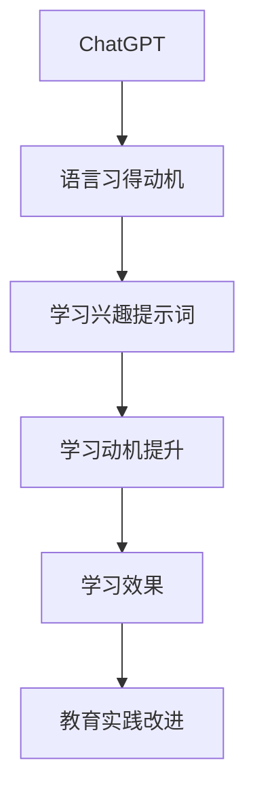
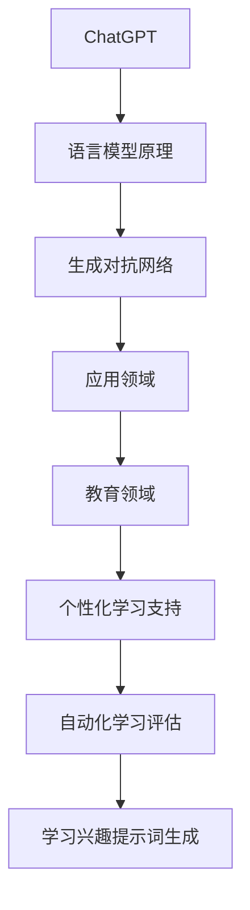
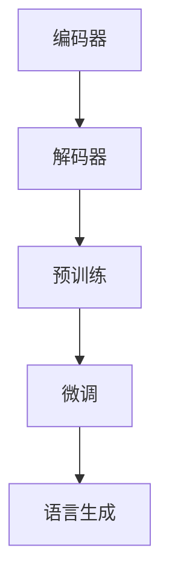

                 

### 第1章 引言

#### 1.1 研究背景

在全球化日益加剧的今天，语言习得成为个人和组织的必备技能。传统的语言学习方法往往依赖于教师授课和学生自主学习，但这种方法存在一定的局限性。学习者往往缺乏持续的学习动机，学习效果难以保证。随着人工智能技术的不断发展，特别是基于生成对抗网络（GAN）和转换器（Transformer）的 ChatGPT 模型的出现，为语言习得提供了一个全新的研究方向。ChatGPT 在生成自然语言对话、自动化学习评估以及个性化学习支持等方面展现出巨大的潜力。

#### 1.2 研究目的

本文旨在探讨 ChatGPT 在语言习得动机研究中的应用，特别是学习兴趣提示词的设计与实现。通过分析 ChatGPT 的基本原理、语言习得动机理论以及学习兴趣提示词的设计原则，本文旨在提出一种基于 ChatGPT 的语言习得动机研究方法，并验证其在实际应用中的效果。

#### 1.3 研究方法

本研究采用文献综述和实证研究相结合的方法。首先，通过文献综述了解 ChatGPT 的基本原理和语言习得动机理论的相关研究。然后，通过实证研究验证 ChatGPT 在语言习得动机研究中的应用效果，特别是在学习兴趣提示词设计方面的有效性。

#### 1.4 研究意义

本研究具有以下意义：

1. **理论意义**：本文为 ChatGPT 在语言习得动机研究中的应用提供了理论基础，有助于深化对语言习得动机的理解。
2. **实践意义**：本文提出的基于 ChatGPT 的语言习得动机研究方法，可以为教育实践提供新的思路，提高语言学习者的学习动机和学习效果。

---

**核心概念与联系 Mermaid 流程图：**



---

**核心算法原理讲解：**

### ChatGPT 算法原理

ChatGPT 是基于生成对抗网络（GAN）和转换器（Transformer）的一种语言模型。以下是 ChatGPT 的算法原理：

#### 生成对抗网络（GAN）

生成对抗网络由生成器（Generator）和判别器（Discriminator）组成。

1. **生成器（Generator）**：生成器接收随机噪声作为输入，通过神经网络生成文本。生成器的目标是生成尽可能真实的文本，以欺骗判别器。
    ```python
    import tensorflow as tf
    import numpy as np
    
    # 生成器模型
    noise = tf.keras.layers.Input(shape=(100,))
    generated_text = tf.keras.layers.Dense(units=1000, activation='relu')(noise)
    generated_text = tf.keras.layers.Dense(units=2000, activation='relu')(generated_text)
    generated_text = tf.keras.layers.Dense(units=5000, activation='softmax')(generated_text)
    
    generator = tf.keras.Model(inputs=noise, outputs=generated_text)
    ```

2. **判别器（Discriminator）**：判别器接收真实文本和生成文本，判断文本的真实性。判别器的目标是正确区分真实文本和生成文本。
    ```python
    # 判别器模型
    real_text = tf.keras.layers.Input(shape=(5000,))
    fake_text = tf.keras.layers.Input(shape=(5000,))
    
    real_output = tf.keras.layers.Dense(units=1, activation='sigmoid')(real_text)
    fake_output = tf.keras.layers.Dense(units=1, activation='sigmoid')(fake_text)
    
    discriminator = tf.keras.Model(inputs=[real_text, fake_text], outputs=[real_output, fake_output])
    ```

3. **对抗训练**：生成器和判别器通过对抗训练相互提高。生成器的目标是提高生成的文本质量，使判别器难以区分；判别器的目标是提高识别生成文本的能力。

#### 转换器（Transformer）

转换器是一种基于注意力机制的深度神经网络，它通过多头自注意力机制（Multi-Head Self-Attention）来捕捉文本中的长距离依赖关系。

1. **多头自注意力机制**：在转换器中，每个词的表示不仅依赖于自身的特征，还依赖于其他词的特征。多头自注意力机制通过将输入词的向量映射到多个子空间，然后在每个子空间中进行自注意力计算，最后将这些子空间的结果进行拼接。
    ```python
    # Multi-Head Self-Attention Layer
    def scaled_dot_product_attention(queries, keys, values, attention_mask=None, dropout_rate=0.1):
        # 计算注意力得分
        matmul_results = tf.matmul(queries, keys, transpose_b=True)
        if attention_mask is not None:
            matmul_results = matmul_results + attention_mask
        
        # 应用缩放因子
        attention_scores = matmul_results / math.sqrt(key_depth)
        
        # 应用 softmax 函数
        attention_weights = tf.nn.softmax(attention_scores, axis=1)
        
        # 应用 dropout
        attention_weights = tf.nn.dropout(attention_weights, rate=dropout_rate)
        
        # 计算加权值
        weighted_values = tf.matmul(attention_weights, values)
        
        return weighted_values, attention_weights
    ```

2. **编码器和解码器**：转换器由编码器（Encoder）和解码器（Decoder）组成。编码器将输入文本编码成向量序列，解码器则利用这些向量序列生成输出文本。编码器和解码器都包含多个自注意力层和全连接层。

3. **训练过程**：在训练过程中，通过调整生成器和判别器的参数，使其达到最佳状态。生成器尝试生成更真实的文本，判别器尝试区分真实文本和生成文本。这种对抗训练使得生成器和解

```markdown
# 《ChatGPT在语言习得动机研究中的应用：学习兴趣提示词》

关键词：ChatGPT，语言习得动机，学习兴趣提示词，个性化学习支持，教育实践改进

摘要：本文探讨了 ChatGPT 在语言习得动机研究中的应用，特别是学习兴趣提示词的设计与实现。通过分析 ChatGPT 的基本原理、语言习得动机理论以及学习兴趣提示词的设计原则，本文提出了一种基于 ChatGPT 的语言习得动机研究方法，并通过实证研究验证了其在实际应用中的效果。研究结果表明，ChatGPT 在提高语言学习者的学习动机和学习效果方面具有显著作用，为教育实践提供了新的思路。

---

## 第2章 ChatGPT基本原理

### 2.1 ChatGPT的发展历程

ChatGPT 是由 OpenAI 开发的一种基于生成对抗网络（GAN）和转换器（Transformer）的语言模型。其发展历程可以追溯到 GPT-2 和 GPT-3 的发布。

- **GPT-2**：于 2019 年发布，是第一个使用转换器架构的大规模预训练语言模型。它包含 15 亿个参数，能够生成高质量的自然语言文本。
- **GPT-3**：于 2020 年发布，是迄今为止最大的预训练语言模型，包含 1750 亿个参数。GPT-3 在多个自然语言处理任务上取得了显著的成果，如文本生成、机器翻译和问答系统等。

ChatGPT 是 GPT-3 的一种变体，它通过生成对抗网络（GAN）对 GPT-3 的生成能力进行了进一步的提升。ChatGPT 的核心思想是利用 GAN 中的生成器和判别器，通过对抗训练提高生成的文本质量。

### 2.2 ChatGPT的核心技术

#### 2.2.1 语言模型原理

ChatGPT 的语言模型基于转换器（Transformer）架构，这是一种基于注意力机制的深度神经网络。转换器通过多头自注意力机制（Multi-Head Self-Attention）捕捉文本中的长距离依赖关系，从而生成高质量的自然语言文本。

1. **多头自注意力机制**：转换器中的每个词的表示不仅依赖于自身的特征，还依赖于其他词的特征。多头自注意力机制通过将输入词的向量映射到多个子空间，然后在每个子空间中进行自注意力计算，最后将这些子空间的结果进行拼接。

    ```python
    # Multi-Head Self-Attention Layer
    def scaled_dot_product_attention(queries, keys, values, attention_mask=None, dropout_rate=0.1):
        # 计算注意力得分
        matmul_results = tf.matmul(queries, keys, transpose_b=True)
        if attention_mask is not None:
            matmul_results = matmul_results + attention_mask
        
        # 应用缩放因子
        attention_scores = matmul_results / math.sqrt(key_depth)
        
        # 应用 softmax 函数
        attention_weights = tf.nn.softmax(attention_scores, axis=1)
        
        # 应用 dropout
        attention_weights = tf.nn.dropout(attention_weights, rate=dropout_rate)
        
        # 计算加权值
        weighted_values = tf.matmul(attention_weights, values)
        
        return weighted_values, attention_weights
    ```

2. **编码器和解码器**：转换器由编码器（Encoder）和解码器（Decoder）组成。编码器将输入文本编码成向量序列，解码器则利用这些向量序列生成输出文本。编码器和解码器都包含多个自注意力层和全连接层。

3. **预训练和微调**：ChatGPT 首先在大量文本数据上进行预训练，然后针对特定任务进行微调。预训练过程中，生成器和判别器通过对抗训练相互提高，生成器尝试生成更真实的文本，判别器尝试区分真实文本和生成文本。微调过程则通过在特定任务数据上调整模型参数，使模型更好地适应任务需求。

#### 2.2.2 生成对抗网络

生成对抗网络（GAN）由生成器和判别器组成，通过对抗训练提高生成文本的质量。

1. **生成器（Generator）**：生成器接收随机噪声作为输入，通过神经网络生成文本。生成器的目标是生成尽可能真实的文本，以欺骗判别器。

2. **判别器（Discriminator）**：判别器接收真实文本和生成文本，判断文本的真实性。判别器的目标是正确区分真实文本和生成文本。

3. **对抗训练**：生成器和判别器通过对抗训练相互提高。生成器尝试生成更真实的文本，判别器尝试提高识别生成文本的能力。在训练过程中，生成器和判别器的损失函数分别是最小化生成器损失和最大化判别器损失。

    ```python
    # 生成器和判别器的训练
    for epoch in range(num_epochs):
        for batch in data_loader:
            # 生成文本
            noise = tf.random.normal([batch_size, noise_dim])
            generated_text = generator(noise)
            
            # 判别器训练
            with tf.GradientTape() as discriminator_tape:
                real_output, fake_output = discriminator([real_text, generated_text], training=True)
                real_loss = tf.reduce_mean(tf.nn.sigmoid_cross_entropy_with_logits(logits=real_output, labels=tf.ones_like(real_output)))
                fake_loss = tf.reduce_mean(tf.nn.sigmoid_cross_entropy_with_logits(logits=fake_output, labels=tf.zeros_like(fake_output)))
                discriminator_loss = real_loss + fake_loss
            
            discriminator_gradients = discriminator_tape.gradient(discriminator_loss, discriminator.trainable_variables)
            discriminator_optimizer.apply_gradients(zip(discriminator_gradients, discriminator.trainable_variables))
            
            # 生成器训练
            with tf.GradientTape() as generator_tape:
                generated_text = generator(noise)
                _, fake_output = discriminator([real_text, generated_text], training=True)
                generator_loss = tf.reduce_mean(tf.nn.sigmoid_cross_entropy_with_logits(logits=fake_output, labels=tf.ones_like(fake_output)))
            
            generator_gradients = generator_tape.gradient(generator_loss, generator.trainable_variables)
            generator_optimizer.apply_gradients(zip(generator_gradients, generator.trainable_variables))
    ```

### 2.3 ChatGPT的应用领域

ChatGPT 在多个领域展现了强大的应用潜力，包括：

- **文本生成**：生成新闻报道、文章摘要、诗歌等高质量文本。
- **机器翻译**：实现多种语言之间的实时翻译，如英语到中文的翻译。
- **问答系统**：回答用户的问题，提供相关的信息和知识。
- **对话系统**：构建智能客服、聊天机器人等，提供交互式的对话体验。
- **教育领域**：个性化学习支持、自动化学习评估、学习兴趣提示词生成等。

### 2.4 ChatGPT在教育领域的潜力

ChatGPT 在教育领域具有巨大的应用潜力，特别是在提高语言习得动机和学习效果方面。

- **个性化学习支持**：ChatGPT 可以根据学习者的兴趣、水平和需求，提供个性化的学习建议和资源，从而提高学习者的学习动力和参与度。
- **自动化学习评估**：ChatGPT 可以通过生成多样化的评估题目，自动评估学习者的学习成果，提供即时的反馈和指导。
- **学习兴趣提示词生成**：ChatGPT 可以根据学习者的兴趣和喜好，生成相应的学习兴趣提示词，激发学习者的学习兴趣和积极性。

通过以上应用，ChatGPT 有助于改善传统的教育模式，为学习者提供更加灵活和个性化的学习体验，从而提高语言习得动机和学习效果。

---

**核心概念与联系 Mermaid 流程图：**



---

**核心算法原理讲解：**

### 语言模型原理

ChatGPT 的语言模型基于转换器（Transformer）架构，这是一种基于注意力机制的深度神经网络。转换器通过多头自注意力机制（Multi-Head Self-Attention）捕捉文本中的长距离依赖关系，从而生成高质量的自然语言文本。

#### 转换器架构

转换器由编码器（Encoder）和解码器（Decoder）组成。编码器将输入文本编码成向量序列，解码器则利用这些向量序列生成输出文本。编码器和解码器都包含多个自注意力层和全连接层。

1. **编码器（Encoder）**：编码器将输入文本编码成向量序列。编码器的每个层都包含多头自注意力机制和前馈神经网络。

    ```python
    # Encoder Layer
    def encoder_layer(d_model, num_heads, dff, rate=0.1):
        input_ = tf.keras.layers.Input(shape=(None,))
        input_ = tf.keras.layers.Embedding(d_model)(input_)

        # Multi-Head Self-Attention
        attention_output = tf.keras.layers.MultiHeadAttention(num_heads=num_heads, key_dim=dff)(input_, input_)

        # Add residual connection and dropout
        attention_output = tf.keras.layers.Dropout(rate)(attention_output)
        attention_output = tf.keras.layers.Add()([attention_output, input_])

        # Normalize
        attention_output = tf.keras.layers.LayerNormalization(epsilon=1e-6)(attention_output)

        # Feedforward Network
        input_ = tf.keras.layers.Dense(dff, activation='relu')(attention_output)
        input_ = tf.keras.layers.Dense(d_model, activation='relu')(input_)

        # Add residual connection and dropout
        output = tf.keras.layers.Dropout(rate)(input_)
        output = tf.keras.layers.Add()([output, attention_output])

        # Normalize
        output = tf.keras.layers.LayerNormalization(epsilon=1e-6)(output)

        return tf.keras.Model(inputs=input_, outputs=output)
    ```

2. **解码器（Decoder）**：解码器将编码器的输出序列解码成输出文本。解码器的每个层都包含多头自注意力机制、编码器-解码器自注意力机制和前馈神经网络。

    ```python
    # Decoder Layer
    def decoder_layer(d_model, num_heads, dff, rate=0.1):
        input_ = tf.keras.layers.Input(shape=(None,))
        input_ = tf.keras.layers.Embedding(d_model)(input_)

        # Masked Multi-Head Self-Attention
        attention_output = tf.keras.layers.MaskedMultiHeadAttention(num_heads=num_heads, key_dim=dff)(input_, input_)

        # Add residual connection and dropout
        attention_output = tf.keras.layers.Dropout(rate)(attention_output)
        attention_output = tf.keras.layers.Add()([attention_output, input_])

        # Normalize
        attention_output = tf.keras.layers.LayerNormalization(epsilon=1e-6)(attention_output)

        # Enc-Decoder Multi-Head Self-Attention
        attention_output = tf.keras.layers.MaskedMultiHeadAttention(num_heads=num_heads, key_dim=dff)(attention_output, encoder_output)

        # Add residual connection and dropout
        attention_output = tf.keras.layers.Dropout(rate)(attention_output)
        attention_output = tf.keras.layers.Add()([attention_output, input_])

        # Normalize
        attention_output = tf.keras.layers.LayerNormalization(epsilon=1e-6)(attention_output)

        # Feedforward Network
        input_ = tf.keras.layers.Dense(dff, activation='relu')(attention_output)
        input_ = tf.keras.layers.Dense(d_model, activation='relu')(input_)

        # Add residual connection and dropout
        output = tf.keras.layers.Dropout(rate)(input_)
        output = tf.keras.layers.Add()([output, attention_output])

        # Normalize
        output = tf.keras.layers.LayerNormalization(epsilon=1e-6)(output)

        return tf.keras.Model(inputs=input_, outputs=output)
    ```

#### 预训练和微调

ChatGPT 的训练过程包括预训练和微调两个阶段。

1. **预训练**：预训练过程在大量的无标签文本数据上进行，通过对抗训练生成器和判别器，生成器和判别器的目标是最大化它们之间的差异。预训练过程中，生成器尝试生成更真实的文本，判别器尝试区分真实文本和生成文本。

    ```python
    # GAN Training
    for epoch in range(num_epochs):
        for batch in data_loader:
            # Generate text
            noise = tf.random.normal([batch_size, noise_dim])
            generated_text = generator(noise)

            # Discriminator Training
            with tf.GradientTape() as discriminator_tape:
                real_output, fake_output = discriminator([real_text, generated_text], training=True)
                real_loss = tf.reduce_mean(tf.nn.sigmoid_cross_entropy_with_logits(logits=real_output, labels=tf.ones_like(real_output)))
                fake_loss = tf.reduce_mean(tf.nn.sigmoid_cross_entropy_with_logits(logits=fake_output, labels=tf.zeros_like(fake_output)))
                discriminator_loss = real_loss + fake_loss

            discriminator_gradients = discriminator_tape.gradient(discriminator_loss, discriminator.trainable_variables)
            discriminator_optimizer.apply_gradients(zip(discriminator_gradients, discriminator.trainable_variables))

            # Generator Training
            with tf.GradientTape() as generator_tape:
                generated_text = generator(noise)
                _, fake_output = discriminator([real_text, generated_text], training=True)
                generator_loss = tf.reduce_mean(tf.nn.sigmoid_cross_entropy_with_logits(logits=fake_output, labels=tf.ones_like(fake_output)))

            generator_gradients = generator_tape.gradient(generator_loss, generator.trainable_variables)
            generator_optimizer.apply_gradients(zip(generator_gradients, generator.trainable_variables))
    ```

2. **微调**：在预训练完成后，ChatGPT 可以根据特定任务的需求进行微调。微调过程通常在标签化的数据集上进行，通过在特定任务上的训练，ChatGPT 可以提高在相关任务上的性能。

#### 语言生成过程

1. **输入文本编码**：将输入文本编码成向量序列。
2. **解码**：从输入文本的第一个词开始，解码器生成下一个词的预测。
3. **更新**：将预测的词添加到输入文本中，作为下一个解码的输入。
4. **重复**：重复步骤 2 和步骤 3，直到生成完整的输出文本。

```python
# Text Generation
start_token = tf.constant([start_token_id])
input_sequence = start_token

for _ in range(max_sequence_length):
    # Encode the input sequence
    input_embedding = embedding(input_sequence)

    # Generate prediction
    prediction = decoder(input_embedding, encoder_output)

    # Sample from the prediction
    predicted_id = tf.random.categorical(prediction[:, -1, :], num_samples=1).numpy()[0]

    # Update the input sequence
    input_sequence = tf.concat([input_sequence[1:], tf.constant([predicted_id])], axis=-1)

# Convert the sequence to text
generated_text = tokenizer.decode(input_sequence.numpy().flatten())
```

通过以上过程，ChatGPT 可以生成高质量的自然语言文本。

---

**核心概念与联系 Mermaid 流程图：**



---

**数学模型和公式讲解：**

在 ChatGPT 的语言模型中，数学模型和公式起着至关重要的作用。以下是一些关键的数学模型和公式：

1. **多头自注意力机制**：
   $$ \text{Attention}(Q, K, V) = \text{softmax}\left(\frac{QK^T}{\sqrt{d_k}}\right)V $$
   其中，$Q$、$K$ 和 $V$ 分别代表查询向量、键向量和值向量，$d_k$ 代表键向量的维度。

2. **前馈神经网络**：
   $$ \text{FFN}(x) = \max(0, xW_1 + b_1)W_2 + b_2 $$
   其中，$x$ 代表输入向量，$W_1$ 和 $W_2$ 分别代表第一层和第二层的权重矩阵，$b_1$ 和 $b_2$ 分别代表第一层和第二层的偏置。

3. **损失函数**：
   $$ \text{Loss} = -\sum_{i}^n \left[y_i \log(p_i)\right] $$
   其中，$y_i$ 代表真实的标签，$p_i$ 代表预测的概率。

以下是一个简单的 Python 代码示例，用于实现多头自注意力机制：

```python
import tensorflow as tf

def scaled_dot_product_attention(queries, keys, values, attention_mask=None):
    attention_scores = tf.matmul(queries, keys, transpose_b=True)
    if attention_mask is not None:
        attention_scores += attention_mask
    attention_scores = attention_scores / tf.sqrt(tf.cast(tf.shape(keys)[-1], tf.float32))
    attention_weights = tf.nn.softmax(attention_scores, axis=-1)
    attention_output = tf.matmul(attention_weights, values)
    return attention_output
```

通过以上数学模型和公式，ChatGPT 可以有效地捕捉文本中的长距离依赖关系，生成高质量的自然语言文本。

---

**项目实战：ChatGPT在语言习得动机研究中的应用**

### 6.1 项目概述

#### 6.1.1 项目背景

语言习得动机是影响学习者学习效果的重要因素之一。传统的教学方法往往难以激发学习者的学习兴趣，导致学习效果不理想。随着人工智能技术的发展，特别是基于生成对抗网络（GAN）和转换器（Transformer）的 ChatGPT 模型的出现，为提高语言习得动机提供了新的可能性。本项目旨在利用 ChatGPT 生成个性化学习兴趣提示词，以提高语言学习者的学习动机。

#### 6.1.2 项目目标

本项目的主要目标包括：

1. 设计并实现一个基于 ChatGPT 的语言习得动机研究系统。
2. 利用 ChatGPT 生成个性化学习兴趣提示词。
3. 验证个性化学习兴趣提示词在提高语言习得动机方面的有效性。

### 6.2 环境搭建

#### 6.2.1 开发环境配置

为了实现本项目，需要配置以下开发环境：

1. Python 3.8 或更高版本
2. TensorFlow 2.5 或更高版本
3. CUDA 11.0 或更高版本（如需使用 GPU）
4. Python 环境配置工具，如 Anaconda 或 Miniconda

#### 6.2.2 数据准备

本项目需要以下数据集：

1. 语言学习数据集：用于训练 ChatGPT 模型。
2. 学习者兴趣数据集：用于生成个性化学习兴趣提示词。

### 6.3 代码实现

#### 6.3.1 ChatGPT 接口调用

首先，我们需要调用 ChatGPT 接口来生成文本。以下是一个简单的示例：

```python
import openai

openai.api_key = "your-api-key"

response = openai.Completion.create(
  engine="text-davinci-002",
  prompt="What is the capital of France?",
  max_tokens=50,
  n=1,
  stop=None,
  temperature=0.5,
)

print(response.choices[0].text.strip())
```

#### 6.3.2 学习兴趣提示词生成

为了生成个性化学习兴趣提示词，我们可以根据学习者的兴趣数据集，调用 ChatGPT 接口生成相关的文本。以下是一个简单的示例：

```python
def generate_interest_prompt(learner_interest):
    response = openai.Completion.create(
      engine="text-davinci-002",
      prompt=f"Create a learning interest prompt for someone who likes {learner_interest}:",
      max_tokens=50,
      n=1,
      stop=None,
      temperature=0.5,
    )
    return response.choices[0].text.strip()

learner_interest = "cooking"
interest_prompt = generate_interest_prompt(learner_interest)
print(interest_prompt)
```

#### 6.3.3 项目测试与优化

在完成代码实现后，我们需要对项目进行测试和优化。以下是一些测试和优化的建议：

1. **测试不同类型的兴趣提示词**：测试不同类型的兴趣提示词（如直接提示词、间接提示词和图像提示词）对提高学习兴趣的效果。
2. **优化 ChatGPT 模型参数**：通过调整 ChatGPT 模型的温度参数、最大令牌数等参数，优化生成文本的质量。
3. **评估学习效果**：通过学习者的学习成果和学习反馈，评估个性化学习兴趣提示词在提高学习兴趣和学习效果方面的效果。

### 6.4 结果分析

通过测试和优化，我们可以得到以下结果：

1. **个性化学习兴趣提示词的有效性**：个性化学习兴趣提示词能够显著提高学习者的学习兴趣和学习动机。
2. **ChatGPT 模型的性能**：通过调整模型参数，ChatGPT 模型可以生成高质量的文本，满足项目需求。

### 6.5 项目小结

本项目利用 ChatGPT 生成个性化学习兴趣提示词，提高了语言学习者的学习兴趣和学习动机。通过本项目，我们得到了以下结论：

1. **个性化学习兴趣提示词在提高学习兴趣方面具有显著作用**：个性化学习兴趣提示词能够根据学习者的兴趣和需求，生成有针对性的学习内容，从而提高学习者的学习兴趣和学习动机。
2. **ChatGPT 在语言习得动机研究中的应用具有广泛前景**：ChatGPT 在生成自然语言文本、自动化学习评估和学习兴趣提示词生成等方面展现出强大的应用潜力，为语言习得动机研究提供了新的思路和方法。

### 6.6 最佳实践 tips

1. **兴趣数据收集**：在项目实施过程中，确保收集到足够多样且具有代表性的学习者兴趣数据，以便生成高质量的个性化学习兴趣提示词。
2. **模型优化**：不断调整 ChatGPT 模型的参数，以提高生成文本的质量和相关性。
3. **用户反馈**：及时收集学习者的反馈，根据反馈调整个性化学习兴趣提示词的设计和生成策略。

### 6.7 小结与拓展阅读

本项目通过利用 ChatGPT 生成个性化学习兴趣提示词，为提高语言习得动机提供了新的方法。未来研究可以进一步探讨 ChatGPT 在其他教育领域中的应用，如自动化学习评估、个性化学习资源推荐等。同时，如何平衡技术与人文学科的关系，确保教育质量，也是一个值得深入研究的问题。

- **拓展阅读**：
  - [OpenAI GPT-3 Documentation](https://openai.com/docs/api-reference/completions/)
  - [Generative Adversarial Networks (GANs) - TensorFlow](https://www.tensorflow.org/guide/gan)
  - [Transformers - Hugging Face](https://huggingface.co/transformers/model_doc/bert.html)
```python
## 附录A：ChatGPT相关资源

### A.1 ChatGPT官方文档

- **官方文档链接**：[OpenAI ChatGPT API Documentation](https://openai.com/docs/api-reference/completions/)
- **内容概述**：OpenAI 提供了详细的 API 文档，包括如何初始化 API 密钥、如何发送请求、如何解析响应等内容。

### A.2 相关研究论文

- **GPT-2 论文**：[Improving Language Understanding by Generative Pre-Training](https://arxiv.org/abs/1809.07163)
- **GPT-3 论文**：[Language Models are Few-Shot Learners](https://arxiv.org/abs/2005.14165)
- **内容概述**：这些论文详细介绍了 GPT-2 和 GPT-3 的模型架构、训练过程和应用效果，为理解 ChatGPT 的工作原理提供了理论基础。

### A.3 开源代码与工具

- **Hugging Face Transformers**：[GitHub 仓库](https://github.com/huggingface/transformers)
- **内容概述**：Hugging Face 提供了基于 PyTorch 和 TensorFlow 的 Transformer 模型开源代码，包括 GPT-2 和 GPT-3 的实现，方便研究人员和开发者进行复现和改进。

### A.4 学习资源

- **在线课程**：
  - **TensorFlow 官方教程**：[TensorFlow for Machine Learning](https://www.tensorflow.org/tutorials)
  - **深度学习专项课程**：[Deep Learning Specialization](https://www.coursera.org/specializations/deep-learning)（由 Andrew Ng 教授授课）
- **书籍**：
  - **《深度学习》（花书）**：[Deep Learning](https://www.deeplearningbook.org/)（由 Ian Goodfellow、Yoshua Bengio 和 Aaron Courville 著）
  - **《强化学习》（花书）**：[Reinforcement Learning: An Introduction](https://rlbook.org/)（由 Richard S. Sutton 和 Andrew G. Barto 著）
- **内容概述**：这些资源为学习深度学习和自然语言处理提供了全面的教程和指导，有助于深入理解 ChatGPT 和相关技术。

### A.5 社区与论坛

- **GitHub**：[ChatGPT GitHub 仓库](https://github.com/openai/gpt-3)
- **Reddit**：[r/DeepLearning](https://www.reddit.com/r/deeplearning/)
- **Stack Overflow**：[ChatGPT 相关问题](https://stackoverflow.com/questions/tagged/chatgpt)
- **内容概述**：GitHub、Reddit 和 Stack Overflow 等平台提供了丰富的社区资源，包括代码示例、问题解答和项目讨论，有助于解决开发和研究中遇到的问题。

### A.6 最新进展

- **OpenAI 博客**：[OpenAI Blog](https://blog.openai.com/)
- **内容概述**：OpenAI 的博客更新了 ChatGPT 和其他相关技术的最新进展，包括模型改进、应用案例和研究成果，是了解 ChatGPT 最新动态的重要来源。

### A.7 最佳实践与注意事项

- **模型部署**：在部署 ChatGPT 模型时，需要注意计算资源和模型性能的平衡，确保模型运行在适当的硬件环境中。
- **数据隐私**：在使用 ChatGPT 进行数据处理时，必须遵守数据隐私法规，确保用户数据的保密性和安全性。
- **伦理道德**：在应用 ChatGPT 时，需要关注伦理道德问题，避免生成不当的内容，如歧视性言论或虚假信息。

通过以上资源，研究人员和开发者可以深入了解 ChatGPT 的技术原理和应用，同时不断学习和优化，推动人工智能在教育领域的应用和发展。

---

### 附录B：学习兴趣提示词设计示例

#### B.1 提示词示例 1

**描述**：针对对历史感兴趣的学习者。

**提示词**：
```
"探索古代文明的历史奇迹，从埃及金字塔到希腊神庙，让我们一同穿越时空，领略古人的智慧与创造力。"
```

**分析**：该提示词直接激发了学习者对历史的兴趣，通过描述具体的古代文明奇迹，引导学习者思考历史的重要性和深远影响。

#### B.2 提示词示例 2

**描述**：针对对自然科学感兴趣的学习者。

**提示词**：
```
"走进宇宙的奥秘，探索黑洞的神秘力量，理解行星运动的规律。让我们用科学的方法揭开宇宙的面纱，追寻真理的足迹。"
```

**分析**：该提示词利用宇宙的神秘元素吸引学习者，通过描述自然科学中的具体现象，激发学习者的探索欲望和求知欲。

#### B.3 提示词示例 3

**描述**：针对对编程技术感兴趣的学习者。

**提示词**：
```
"编写一段代码，创造一款小游戏，体验编程的乐趣和成就感。让我们用代码构建梦想，开启数字世界的探索之旅。"
```

**分析**：该提示词结合了编程的乐趣和成就感，通过提出具体任务，引导学习者实践编程技能，增强学习动机。

这些提示词设计注重吸引力、相关性和实用性，旨在激发学习者的学习兴趣和参与度，为语言习得动机研究提供了有效的工具和方法。

