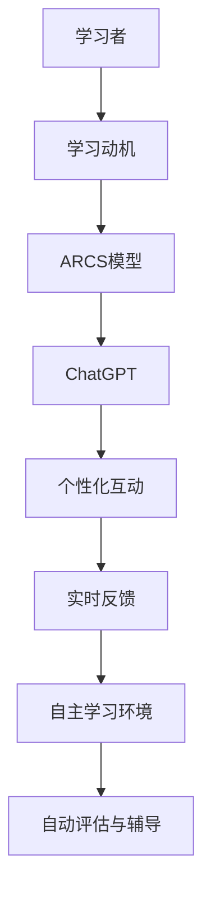
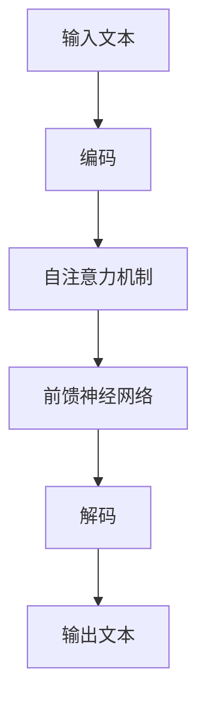

                 

### 第1章 引言与核心概念

**1.1 书籍背景与目的**

在当今全球化的时代，语言习得的重要性日益凸显。然而，语言学习过程中面临的最大挑战之一是学习动机的维持。学习动机的减弱常常导致学习效果的下降，甚至导致学习的中断。因此，如何有效地维持学习动机成为语言教育领域的一个重要研究课题。

《ChatGPT在语言习得动机维持中的应用：长期学习激励提示词》旨在探讨如何利用ChatGPT这一先进的人工智能技术来增强语言学习者的动机，从而提高学习效果。本书的核心目的是提供一套基于ChatGPT的长期学习激励提示词设计原则和开发方法，帮助语言教育工作者和实践者更好地应用这一技术，实现个性化、互动性和高效性的语言学习体验。

**1.2 语言习得动机概述**

语言习得动机是指个体在学习过程中所激发的心理状态，它直接影响学习行为的持续性和效果。动机理论为我们理解动机的维持和激发提供了重要的理论基础。其中，著名的动机维持理论包括：

- **ARCS模型**：由Keller（1983）提出的ARCS模型，将动机维持分为四个方面：Attention（关注）、Relevance（相关性）、Confidence（信心）和Satisfaction（满足感）。这个模型提供了对学习动机维持的全面理解。

- **自我决定理论**：由Deci和Ryan（1975, 1985）提出的自我决定理论，强调个体内在动机的重要性，认为自主性、能力感和关联感是维持动机的关键因素。

在语言习得过程中，动机的维持不仅与学习者的内在心理状态有关，还与外部环境，如学习资源、教师支持和学习同伴的互动密切相关。

**1.3 ChatGPT与教育技术的关系**

ChatGPT是由OpenAI开发的一种基于变换器架构的预训练语言模型，其卓越的自然语言处理能力使其在教育技术领域具有广泛的应用潜力。ChatGPT在语言习得动机维持中的应用主要体现在以下几个方面：

- **个性化互动**：ChatGPT可以根据学习者的兴趣、学习进度和需求，提供个性化的学习建议和反馈，从而提高学习者的关注度和相关性。

- **实时反馈**：ChatGPT可以实时监测学习者的学习行为，提供即时的反馈和鼓励，增强学习者的信心和满足感。

- **自主学习环境**：ChatGPT能够模拟真实语言环境，为学习者提供沉浸式的学习体验，从而激发学习者的内在动机。

- **自动评估与辅导**：ChatGPT可以自动评估学习成果，并提供个性化的辅导建议，帮助学习者更好地掌握语言技能。

**核心概念与联系**

为了更好地理解ChatGPT在语言习得动机维持中的应用，我们使用Mermaid绘制了一个流程图，展示了关键概念之间的关系：



通过这个流程图，我们可以清晰地看到学习者、学习动机、ARCS模型、ChatGPT以及个性化互动、实时反馈、自主学习环境和自动评估与辅导之间的逻辑关系。

**核心算法原理讲解**

ChatGPT的核心算法基于变换器架构（Transformer），这是一种用于处理序列数据（如文本）的深度学习模型。以下是一个简化的Python伪代码，用于解释ChatGPT生成文本回复的基本流程：

```python
import tensorflow as tf
from tensorflow import keras

# 加载预训练模型
model = keras.models.load_model('path_to_pretrained_model')

# 对输入文本进行编码
encoded_input = model.encode(input_text)

# 使用模型生成回复
output_ids = model.generate(encoded_input, max_length=50, num_return_sequences=1)

# 解码生成的内容
generated_text = model.decode(output_ids)
```

在生成文本的过程中，模型首先对输入文本进行编码，然后通过自注意力机制（Self-Attention Mechanism）和前馈神经网络（Feedforward Neural Network）生成潜在文本表示。最后，模型通过解码器将这些潜在表示转换为可读的文本输出。

**数学模型和数学公式**

在ChatGPT的文本生成过程中，一个关键的数学模型是损失函数，特别是交叉熵（Cross-Entropy）损失函数。交叉熵损失函数用于衡量预测分布和真实分布之间的差异，其公式如下：

$$
L(\theta) = -\sum_{i=1}^n \sum_{j=1}^V y_{ij} \log p(x_j | \theta)
$$

其中，$L(\theta)$ 是损失函数，$\theta$ 是模型的参数，$y_{ij}$ 是真实分布，$p(x_j | \theta)$ 是模型对每个单词的概率预测。

**Mermaid 流程图**

为了直观地展示ChatGPT的文本生成流程，我们使用Mermaid绘制了一个流程图：



**小结**

本章介绍了《ChatGPT在语言习得动机维持中的应用：长期学习激励提示词》的背景和目的，概述了语言习得动机的重要性，并探讨了ChatGPT在教育技术中的应用潜力。通过核心概念流程图和数学模型解释，我们为后续章节的内容奠定了基础。

作者：AI天才研究院/AI Genius Institute & 禅与计算机程序设计艺术 /Zen And The Art of Computer Programming

