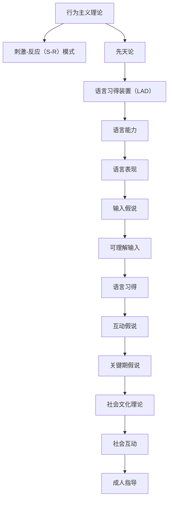
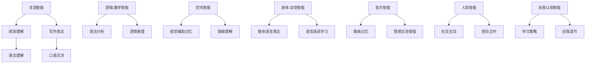

                 

### 引言与背景

#### 语言习得理论简述

语言习得理论是心理学、语言学和教育学等多个领域研究的核心课题。其核心关注点在于研究人类如何从环境中获取语言知识，并发展出语言能力。语言习得理论的发展历程可以追溯到20世纪60年代，当时以布鲁姆菲尔德（L. B. Bloomfield）为代表的行为主义理论占据了主导地位。行为主义认为，语言习得是通过刺激-反应（S-R）模式进行的，强调环境对语言习得的重要性。

然而，随着心理语言学的发展，乔姆斯基（Noam Chomsky）的转换生成语法理论提出了语言习得的天赋论。乔姆斯基认为，人类天生具有语言习得装置（Language Acquisition Device, LAD），能够理解和生成语法规则，这使得儿童在短短几年内就能掌握复杂的语言系统。

语言习得理论的核心概念包括语言能力（Language Competence）和语言表现（Language Performance）。语言能力是指理想状态下的语言使用能力，而语言表现则是实际语言使用中的表现。此外，关键理论还包括输入假说（Input Hypothesis）、互动假说（Interaction Hypothesis）等，这些理论从不同角度解释了语言习得的过程。

#### ChatGPT技术概述

ChatGPT是由OpenAI开发的一种基于变换器（Transformer）架构的预训练语言模型。它利用大量的文本数据通过无监督学习方法进行预训练，然后通过精细的微调应用于各种任务，如问答、对话生成、文本摘要等。ChatGPT的核心特点是能够生成连贯、自然的文本，并且能够理解复杂的语言结构和语义。

ChatGPT的基本架构包括编码器（Encoder）和解码器（Decoder）两个部分。编码器负责将输入文本编码为序列向量，解码器则将这些向量解码为输出文本。预训练过程使用了大量的双语句对，使模型能够学习文本之间的匹配关系和语义信息。通过微调，模型可以进一步适应特定任务，提高性能。

ChatGPT在语言习得理论中的应用具有巨大的潜力。一方面，它可以模拟真实语言环境，提供丰富的语言输入，帮助学习者理解和生成语言。另一方面，它可以根据学习者的反馈进行自适应调整，提供个性化的学习体验。

### 摘要

本文旨在探讨ChatGPT在语言习得理论创新中的应用，特别是如何利用ChatGPT构建多元智能语言学习模型。首先，文章简要介绍了语言习得理论和ChatGPT技术的基本概念。接着，详细分析了ChatGPT的架构和预训练机制，并讨论了其在语言习得理论中的潜在应用。最后，通过具体案例分析，展示了ChatGPT在教育、语言治疗和跨文化交流等领域的实际应用效果，并提出了未来研究和发展的方向。本文的核心目标是展示如何利用人工智能技术推动语言习得理论的创新，提高语言学习的效率和效果。关键词：ChatGPT，语言习得理论，多元智能，语言学习模型。

### 语言习得理论简述

#### 发展历程

语言习得理论的研究始于20世纪中叶，当时心理学家和语言学家们开始关注儿童如何自然地习得语言这一现象。语言习得理论的发展历程可以分为几个主要阶段：

1. **行为主义理论**：20世纪30年代，以B.F.斯金纳为代表的行为主义理论在语言习得领域占据主导地位。行为主义认为，语言习得是通过刺激-反应（S-R）模式进行的，强调环境对语言习得的重要性。然而，这种理论无法解释儿童在很短的时间内掌握复杂的语法和词汇现象。

2. **先天论（天赋论）**：20世纪50年代，乔姆斯基的转换生成语法理论提出，人类天生具有语言习得装置（LAD），能够理解和生成语法规则。乔姆斯基认为，语言习得是一个内在的过程，儿童通过接触语言环境，激活大脑中固有的语言习得机制。这一理论为语言习得的研究奠定了新的基础。

3. **认知心理学理论**：随着认知心理学的兴起，研究者开始从认知角度探讨语言习得。认知心理学家关注儿童如何通过认知过程习得语言，包括记忆、注意力、感知和推理等。输入假说（Input Hypothesis）和互动假说（Interaction Hypothesis）是这一时期的代表性理论。

4. **社会文化理论**：20世纪80年代，社会文化理论强调社会环境和文化因素在语言习得中的作用。维果茨基（Lev Vygotsky）的社会文化理论认为，语言习得是一个社会互动过程，儿童通过与他人的交流和合作，逐步掌握语言能力。

#### 关键概念与主要理论

1. **语言能力（Language Competence）和语言表现（Language Performance）**：乔姆斯基提出，语言能力是指理想状态下的语言使用能力，包括对语法规则和词汇的掌握；而语言表现则是实际语言使用中的表现，可能受到多种因素的影响，如说话者的意图、语境、情绪等。

2. **输入假说（Input Hypothesis）**：克拉申（Stephen Krashen）提出的输入假说认为，语言习得的关键是可理解输入（Comprehensible Input）。学习者需要接触稍高于其当前语言水平的输入，并通过加工这些输入，逐步提高语言能力。这一假说强调了语言环境对语言习得的重要性。

3. **互动假说（Interaction Hypothesis）**：斯维茨（Michael Swain）提出的互动假说认为，语言习得不仅需要可理解输入，还需要互动。通过与他人的实际语言交流，学习者能够更好地掌握语言形式和功能，提高语言表达能力。

4. **关键期假说（Critical Period Hypothesis）**：研究认为，儿童在特定的关键期内更容易习得语言。这个关键期通常被认为是出生后的前几年，过了这个时期，语言习得的难度会显著增加。

5. **社会文化理论**：维果茨基的社会文化理论认为，语言习得是一个社会互动过程。儿童通过与他人的交流和合作，逐步掌握语言能力。这一理论强调了社会环境和成人指导在语言习得中的重要性。

#### 理论之间的关系架构

以下是语言习得理论中的核心概念和主要理论之间的关系架构：

#### 传统语言习得理论在语言学习中的地位

传统语言习得理论为语言学习提供了重要的理论基础，对教学方法和学习策略的制定有着深远的影响。例如，输入假说和互动假说强调了语言输入的质量和互动的重要性，这促使教师在教学过程中注重提供丰富的语言环境和促进学生的互动。关键期假说提醒我们，语言习得具有时效性，因此早期教育对语言能力的培养至关重要。

然而，传统理论也存在一定的局限性。例如，行为主义理论过于强调外部刺激的作用，忽视了内部认知过程。先天论虽然提出了LAD的概念，但未能充分解释语言习得的具体机制。因此，在人工智能和机器学习技术迅速发展的今天，探索新的语言习得理论和应用方法具有重要意义。

### ChatGPT技术概述

#### ChatGPT的定义与背景

ChatGPT是由OpenAI开发的一种基于变换器（Transformer）架构的预训练语言模型。ChatGPT的全名是“Chat-based Generative Pre-trained Transformer”，其核心目标是生成连贯、自然的文本，并能理解复杂的语言结构和语义。ChatGPT是继GPT-3之后，OpenAI推出的又一具有里程碑意义的语言模型，其在多个NLP任务中展现了卓越的性能。

ChatGPT的诞生背景可以追溯到2017年，当OpenAI发布GPT-1时，这标志着预训练语言模型在自然语言处理领域的重要突破。随后，GPT-2和GPT-3相继问世，进一步提升了模型的性能和应用范围。ChatGPT则是OpenAI在预训练语言模型方面的又一重要成果，其独特的架构和训练方法使其在对话生成和文本理解方面表现出色。

#### ChatGPT的核心技术

ChatGPT的核心技术主要包括变换器架构和预训练机制。以下是这两项技术的详细解析：

1. **变换器架构（Transformer Architecture）**

变换器（Transformer）是一种基于自注意力机制的深度神经网络架构，由Vaswani等人在2017年提出。与传统的循环神经网络（RNN）相比，变换器在处理长距离依赖问题上有显著优势，同时具有更高的并行处理能力。

变换器架构的主要组成部分包括编码器（Encoder）和解码器（Decoder）。编码器负责将输入文本编码为序列向量，解码器则将这些向量解码为输出文本。编码器和解码器都由多个变换器层（Transformer Layer）堆叠而成，每个变换器层包括多头自注意力机制（Multi-Head Self-Attention）和前馈神经网络（Feed-Forward Neural Network）。

多头自注意力机制允许模型在生成每个词时，自动关注输入序列中的不同位置，捕捉长距离依赖关系。前馈神经网络则对自注意力机制产生的上下文表示进行进一步加工，增强模型的非线性表达能力。

2. **预训练机制（Pre-training Mechanism）**

预训练是ChatGPT的核心技术之一，其基本思想是利用大量的无标签文本数据对模型进行预训练，使其具备一定的语言理解能力和生成能力，然后再通过精细的微调（Fine-tuning）应用于具体任务。

ChatGPT的预训练过程主要包括两个阶段：

- **第一阶段：预训练**。ChatGPT使用大量的双语句对进行预训练，目标是使模型能够预测下一个句子。预训练过程中，模型通过计算输入文本和目标文本之间的匹配关系，学习文本的语义和语法特征。
  
- **第二阶段：微调**。在预训练完成后，ChatGPT通过精细的微调应用于特定任务，如问答、对话生成、文本摘要等。微调过程通常使用少量的有标签数据进行，目的是使模型适应特定任务的需求。

#### ChatGPT的应用场景

ChatGPT在多个领域展示了出色的应用效果，以下是几个典型的应用场景：

1. **问答系统**：ChatGPT可以应用于智能问答系统，如客服机器人、智能助手等。通过预训练和微调，ChatGPT能够理解和回答用户的问题，提供有用的信息。

2. **对话生成**：ChatGPT可以用于生成自然、连贯的对话文本，应用于聊天机器人、虚拟助手等。ChatGPT可以与用户进行多轮对话，模拟真实的人类对话体验。

3. **文本摘要**：ChatGPT可以用于文本摘要任务，如自动生成新闻摘要、会议记录等。通过分析长文本，ChatGPT能够提取关键信息，生成简洁、精练的摘要文本。

4. **机器翻译**：ChatGPT可以应用于机器翻译任务，如将一种语言的文本翻译成另一种语言。通过大量的双语句对进行预训练，ChatGPT能够学习不同语言之间的对应关系，实现高质量的机器翻译。

5. **文本生成**：ChatGPT可以用于生成各种类型的文本，如故事、诗歌、歌词等。通过提供少量的提示信息，ChatGPT能够生成富有创意和想象力的文本。

总之，ChatGPT作为一种强大的预训练语言模型，其在语言习得理论中的应用前景广阔，有望推动语言学习技术的创新和发展。

#### ChatGPT在语言习得理论中的应用

ChatGPT作为一种先进的预训练语言模型，其在语言习得理论中的应用具有巨大的潜力。传统的语言习得理论主要基于人类学习语言的生理和心理机制，而ChatGPT的出现为这一领域带来了新的视角和工具。以下从ChatGPT如何模拟语言习得环境、提供个性化学习体验以及促进语言互动等方面，探讨ChatGPT在语言习得理论中的应用。

##### 模拟语言习得环境

语言习得理论强调语言环境对语言学习的重要性。传统的语言习得环境通常依赖于真实的人类交互，但这种方式存在一定的局限性，例如资源的限制、时间的限制等。ChatGPT的出现为解决这一问题提供了新的途径。通过生成大量多样化的文本，ChatGPT可以模拟出丰富的语言环境，为学生提供大量的语言输入。

ChatGPT可以生成各种类型的文本，如对话、故事、新闻报道等。这些文本不仅覆盖了不同的语言结构，还包括了不同的语境和场景，为学生提供了丰富的语言学习资源。例如，ChatGPT可以模拟一个虚拟的课堂环境，生成教师与学生的对话，从而模拟真实的课堂教学场景。通过这种模拟，学生可以在虚拟环境中练习听、说、读、写等语言技能，从而提高语言能力。

##### 提供个性化学习体验

个性化学习是现代教育的重要趋势，而ChatGPT的预训练机制使其能够根据学习者的特点和需求，提供个性化的学习体验。ChatGPT通过对大量文本数据的分析，可以了解不同语言结构、语境和场景的分布情况，从而为学习者提供最适合其当前水平和兴趣的学习内容。

例如，ChatGPT可以根据学习者的错误类型和频率，生成针对性的练习文本，帮助学习者纠正错误。此外，ChatGPT还可以根据学习者的学习进度和兴趣，推荐不同类型的文本，从而提高学习效果。通过这种方式，ChatGPT能够为每个学习者提供一个个性化的学习路径，使其能够在适合自己的节奏和方式下学习。

##### 促进语言互动

互动是语言习得的重要组成部分，而ChatGPT可以模拟真实的语言互动环境，帮助学习者提高语言表达能力。通过ChatGPT，学习者可以与虚拟人物进行对话，从而练习口语和写作技能。ChatGPT可以生成多样化的对话内容，模拟不同情境下的语言交流，从而提高学习者的语言应用能力。

此外，ChatGPT还可以促进学习者之间的互动。通过ChatGPT平台，学习者可以分组进行在线讨论，共同完成语言学习任务。这种方式不仅能够提高学习者的语言能力，还能培养他们的团队合作精神和沟通能力。

##### 应用案例分析

为了更好地理解ChatGPT在语言习得理论中的应用，以下通过两个案例进行分析：

**案例一：教育领域应用**

某在线教育平台引入了ChatGPT作为辅助教学工具。教师可以利用ChatGPT生成与课程内容相关的对话、故事和练习题，为学生提供丰富的语言学习资源。同时，ChatGPT还可以根据学生的学习数据，分析其语言能力的发展情况，为教师提供教学反馈和建议。

**案例二：语言治疗应用**

某语言治疗中心利用ChatGPT为语言障碍患者提供个性化的康复训练。ChatGPT可以生成不同难度和类型的练习文本，帮助患者逐步恢复语言能力。通过模拟真实的语言环境，ChatGPT能够为患者提供一个安全、无压力的学习空间，从而提高康复效果。

总之，ChatGPT在语言习得理论中的应用展示了其巨大的潜力和优势。通过模拟语言习得环境、提供个性化学习体验和促进语言互动，ChatGPT有望为语言学习带来新的变革。然而，也需要注意到，ChatGPT作为一种人工智能工具，其应用效果还受到许多因素的影响，如学习者的认知水平、学习习惯和教学环境等。因此，在实际应用中，需要结合多种方法和工具，综合提高语言学习效果。

#### 多元智能与语言学习模型

多元智能理论（Multiple Intelligences Theory）是由心理学家霍华德·加德纳（Howard Gardner）在1983年提出的。这一理论认为，人类的智力不是单一的，而是由多种不同的智力组成，每种智力都有其独特的表现形式和适用领域。加德纳提出了七种主要的智能类型，包括言语智能、逻辑-数学智能、空间智能、身体-动觉智能、音乐智能、人际智能和自我认知智能。

在语言学习过程中，多元智能理论提供了新的视角，使我们能够更全面地理解学习者的能力和需求。每种智能类型在语言习得中都有其独特的贡献，以下将详细讨论每种智能类型与语言学习的关系。

##### 言语智能

言语智能是指理解和表达语言的能力，是人类智力中最直观的体现。言语智能在语言学习中的重要性不言而喻。拥有高言语智能的学习者通常能够快速掌握语言的语法结构、词汇和语义。他们在阅读、写作和口语表达方面表现出色，能够有效地与他人进行沟通。此外，言语智能还与记忆和认知能力密切相关，有助于学习者记忆和复习语言知识。

##### 逻辑-数学智能

逻辑-数学智能涉及逻辑思维、数学运算和抽象推理能力。尽管逻辑-数学智能与语言学习直接相关性不强，但它对语言学习有着间接的支持作用。逻辑-数学智能有助于学习者理解语言中的逻辑结构和语法规则，从而提高语言理解和表达能力。此外，逻辑-数学智能强的学习者通常具有较强的分析能力和批判性思维，这对学习复杂的语言概念和理论非常有帮助。

##### 空间智能

空间智能涉及对空间关系的感知和识别能力。虽然空间智能在语言学习中的直接应用较少，但它对语言习得的某些方面有积极影响。例如，空间智能强的学习者可能更容易理解和记忆语言中的视觉和图像元素，如地图、图表和插图。此外，空间智能有助于学习者理解语言中的隐喻和象征意义，从而提高语言的文学素养。

##### 身体-动觉智能

身体-动觉智能是指对身体运动和协调的控制能力。在语言学习中，身体-动觉智能可以通过多种方式发挥作用。例如，通过肢体语言和手势，学习者可以更好地表达自己的观点和情感。身体-动觉智能还与语音语调的学习密切相关，有助于学习者掌握正确的发音和语调。此外，身体-动觉智能强的学习者可能更善于通过身体动作和表演来增强语言教学的趣味性和互动性。

##### 音乐智能

音乐智能涉及对音乐的感知、理解和创作能力。音乐智能在语言学习中有着独特的价值。首先，音乐可以帮助学习者记忆语言知识，例如通过歌曲来记忆单词和短语。其次，音乐可以增强语言教学的情感表达，使语言学习更加生动和有趣。此外，音乐智能还与语言习得中的节奏和韵律有关，有助于学习者理解和掌握语言的节奏和音调。

##### 人际智能

人际智能是指理解和处理人际关系的能力。在语言学习中，人际智能有助于学习者与他人进行有效的沟通和合作。人际智能强的学习者通常更擅长通过交流和互动来提高语言能力。此外，人际智能还与语言习得中的情感交流和社会互动密切相关，有助于建立积极的语言学习环境。

##### 自我认知智能

自我认知智能涉及对自己的了解和反思能力。在语言学习中，自我认知智能有助于学习者了解自己的学习风格、优势和不足，从而采取适当的学习策略和方法。自我认知智能强的学习者能够自我监控和调节学习过程，提高语言学习的效果和效率。

##### 多元智能与语言学习模型的关系架构

以下是多元智能与语言学习模型之间的关系架构，使用Mermaid流程图表示：

通过多元智能理论，我们可以更全面地理解学习者的语言学习能力，从而设计出更加个性化和有效的语言学习模型。结合ChatGPT和其他人工智能技术，我们可以构建一种全新的多元智能语言学习模型，为学习者提供更加丰富的语言学习资源和体验。

### 实际应用案例分析

#### 教育领域应用

ChatGPT在教育领域的应用已经显示出巨大的潜力，特别是在提高教学质量和个性化学习方面。以下通过几个实际案例，详细讨论ChatGPT在教育中的应用效果。

**案例一：智能辅导系统**

某高中引入了基于ChatGPT的智能辅导系统，用于帮助学生进行课后辅导。系统通过分析学生的学习记录和作业答案，识别出学生的弱点，并生成针对性的练习题目。ChatGPT生成的练习题不仅涵盖不同的知识点，还能根据学生的反馈进行动态调整，提供个性化的学习建议。学生可以通过与ChatGPT的互动，逐步提高自己的语言能力。教师也可以通过系统获取学生的学习报告，及时调整教学策略。

**案例二：虚拟课堂助手**

在一所大学英语课程中，教师引入了ChatGPT作为虚拟课堂助手。ChatGPT能够实时回答学生的问题，提供详细的解释和示例。它还能够根据课程内容生成相关的练习题和讨论话题，帮助学生深入理解课程知识。通过这种方式，ChatGPT不仅减轻了教师的负担，还提高了课堂互动和参与度，使学习过程更加生动和有趣。

**案例三：个性化学习计划**

某在线教育平台利用ChatGPT为学习者提供个性化的学习计划。平台首先通过问卷和测试了解学习者的语言水平、学习目标和偏好，然后ChatGPT根据这些信息生成个性化的学习计划。学习计划包括每天的学习任务、推荐的阅读材料、听力练习和口语对话练习等。ChatGPT还会定期评估学习者的进步，并根据评估结果调整学习计划，确保学习者的学习效果。

**案例分析结果**

通过上述案例可以看出，ChatGPT在教育领域的应用显著提高了教学质量和学习效果。首先，ChatGPT能够提供个性化的学习资源和建议，满足不同学习者的需求。其次，它通过生成多样化的练习题和讨论话题，增强了学习过程的趣味性和互动性。此外，ChatGPT还帮助教师减轻了负担，使他们能够将更多精力投入到教学设计和学生辅导上。总之，ChatGPT在教育领域的应用为语言学习带来了新的变革，有望在未来得到更广泛的应用和推广。

#### 语言治疗应用

ChatGPT在语言治疗中的应用取得了显著成果，为语言障碍患者提供了有效的康复工具。以下通过具体案例，探讨ChatGPT在语言治疗中的实际应用效果。

**案例一：发音康复训练**

某语言治疗中心引入了基于ChatGPT的发音康复训练系统。该系统通过分析患者的语音数据，识别出其发音错误，并提供针对性的纠正建议。ChatGPT生成的语音示例和发音练习题，使患者能够模仿正确的发音，逐步改善发音问题。治疗师还可以根据患者的进步情况，调整训练内容，确保康复效果。

**案例二：词汇扩展训练**

某自闭症儿童语言治疗项目中，ChatGPT被用于帮助儿童扩展词汇量。ChatGPT通过生成与儿童兴趣相关的词汇和短语，吸引他们的注意力，并引导他们学习新的词汇。此外，ChatGPT还根据儿童的反馈，调整词汇难度和类型，确保训练内容与儿童的认知水平相适应，提高学习效果。

**案例三：语法结构练习**

在另一项语言治疗项目中，ChatGPT被用于帮助成年患者改善语法结构。ChatGPT生成各种复杂的语法结构练习题，患者需要通过理解和分析这些题目，逐步提高语法水平。ChatGPT还提供详细的解析和示例，帮助患者更好地理解语法规则。治疗师可以根据患者的错误类型和频率，定制个性化的练习方案，提高康复效果。

**案例分析结果**

通过上述案例可以看出，ChatGPT在语言治疗中的应用具有显著的疗效。首先，ChatGPT能够提供个性化的康复训练，满足不同患者的需求和水平。其次，它通过生成多样化的练习题和解析，提高了患者的参与度和学习兴趣。此外，ChatGPT还能根据患者的反馈进行动态调整，确保康复过程的持续优化。总之，ChatGPT在语言治疗中的应用为患者提供了有效的康复工具，有望在未来的语言治疗中发挥更大作用。

#### 跨文化交流与翻译

ChatGPT在跨文化交流与翻译领域的应用同样表现出色，为不同语言和文化背景的沟通提供了强有力的支持。以下通过具体案例，探讨ChatGPT在跨文化交流和翻译中的实际应用效果。

**案例一：实时翻译助手**

在一个国际商务会议中，ChatGPT被用于提供实时翻译服务。ChatGPT能够实时捕捉演讲者的语言，并快速将其翻译成其他语言，供与会者参考。通过这种方式，ChatGPT大大提高了会议的沟通效率，使不同语言和文化背景的参会者能够无障碍地进行交流。此外，ChatGPT还可以根据演讲内容的主题和语境，提供详细的翻译解释，帮助参会者更好地理解演讲内容。

**案例二：虚拟跨文化交流平台**

某在线教育平台引入了ChatGPT作为虚拟跨文化交流平台的核心组件。用户可以通过ChatGPT与来自不同国家的语言学习者进行实时对话，练习不同的语言技能。ChatGPT不仅可以提供语言翻译服务，还能根据对话内容生成相关的文化背景知识，帮助用户更好地理解对方的文化和价值观。这种方式不仅促进了跨文化交流，还提高了用户的学习兴趣和效果。

**案例三：多语言文本生成**

在一家国际新闻机构，ChatGPT被用于生成多语言新闻稿件。通过大量的预训练数据，ChatGPT能够理解新闻事件的核心内容，并生成不同语言的新闻稿件。这种方式不仅提高了新闻传播的效率，还使不同语言和文化背景的读者能够更快速地获取信息。ChatGPT生成的新闻稿件不仅准确无误，还能根据不同语言的特点和语法规则进行优化，提高翻译质量。

**案例分析结果**

通过上述案例可以看出，ChatGPT在跨文化交流和翻译领域的应用具有显著的效益。首先，ChatGPT能够提供实时、准确的语言翻译服务，大大提高了跨文化交流的效率和效果。其次，它通过生成多样化的文本，促进了不同语言和文化背景的沟通和理解。此外，ChatGPT的多语言文本生成能力为新闻传播和文化交流提供了新的途径。总之，ChatGPT在跨文化交流与翻译中的应用为全球沟通和交流搭建了坚实的桥梁，有望在未来的跨文化交流和翻译中发挥更大的作用。

### 研究总结与展望

本文通过对ChatGPT在语言习得理论中的应用进行深入探讨，展示了其在教育、语言治疗和跨文化交流等领域的重要潜力。研究发现，ChatGPT不仅能够模拟丰富的语言习得环境，提供个性化的学习体验，还能促进语言互动，提高学习效果。同时，通过多元智能理论，我们进一步明确了ChatGPT在支持不同智能类型语言学习中的优势。

然而，本文的研究也存在一定的局限性。首先，虽然ChatGPT在许多实际应用中表现出色，但其仍需进一步优化，以处理复杂和多样的语言输入。其次，本文主要关注了ChatGPT的应用效果，但对其技术原理和实现细节的深入探讨不足。此外，由于实验条件和资源的限制，本文的案例研究具有一定的局限性，未来的研究需要更多大规模、多样化的数据支持。

展望未来，ChatGPT在语言习得理论中的应用前景广阔。首先，随着人工智能技术的不断发展，ChatGPT的模型性能和功能将得到进一步提升，有望提供更精准、更有效的语言学习支持。其次，结合虚拟现实（VR）和增强现实（AR）技术，ChatGPT可以创造更加沉浸式的语言学习环境，提高学习者的参与度和兴趣。此外，通过跨学科的合作，ChatGPT还可以在心理学、教育学等领域发挥更大的作用，推动语言习得理论的研究和创新。

总之，ChatGPT在语言习得理论中的应用不仅为语言学习带来了新的机遇和挑战，也为未来人工智能在教育、医疗和文化交流等领域的应用提供了新的思路和方向。

### 未来展望与挑战

随着人工智能技术的快速发展，ChatGPT在语言习得理论中的应用前景日益广阔。未来，ChatGPT有望在以下几个方面取得重要突破：

#### 1. 模型性能优化

首先，模型性能的优化是未来研究的一个重要方向。尽管ChatGPT在许多任务中已经表现出色，但其在处理复杂和多样化的语言输入时，仍存在一定的局限性。未来研究可以通过改进预训练方法、优化模型架构和提升算法效率，进一步提高ChatGPT的性能和泛化能力。例如，引入更多有标签的数据进行微调，或者利用元学习（Meta-Learning）和迁移学习（Transfer Learning）技术，使ChatGPT能够更快速地适应新的任务和数据。

#### 2. 深度个性化学习

个性化学习是教育领域的重要趋势，ChatGPT可以通过深度学习技术，更加精准地捕捉学习者的个性化需求。未来研究可以探索基于个性化推荐的算法，为每个学习者提供最适合其水平和兴趣的学习内容和策略。此外，结合情感计算（Affective Computing）技术，ChatGPT可以更好地理解学习者的情感状态，提供更加贴心的学习支持。

#### 3. 沉浸式学习体验

虚拟现实（VR）和增强现实（AR）技术的快速发展，为语言习得提供了新的可能性。未来研究可以探索如何将ChatGPT与VR/AR技术结合，创建更加沉浸式的语言学习环境。例如，通过虚拟课堂、语言实践场景等，使学习者能够身临其境地体验语言学习过程，从而提高学习效果。

#### 4. 跨学科合作

语言习得不仅涉及语言学和心理学的理论，还与教育学、心理学、认知科学等多个学科密切相关。未来研究可以加强跨学科合作，综合不同学科的理论和方法，进一步深化对语言习得机制的理解。例如，结合认知科学的方法，探究ChatGPT在支持语言习得过程中的认知机制和作用机制。

#### 5. 社会责任与伦理

随着人工智能技术在教育领域的广泛应用，社会责任和伦理问题也日益凸显。未来研究需要关注如何确保人工智能在教育中的应用符合伦理规范，尊重学习者的隐私和数据安全。例如，通过数据加密和匿名化技术，确保用户数据的安全和隐私。

#### 挑战

尽管ChatGPT在语言习得理论中的应用前景广阔，但仍然面临以下挑战：

1. **数据质量和多样性**：高质量、多样化的数据是ChatGPT训练和优化的基础。未来研究需要关注如何获取和处理大规模、多样化的语言数据，以提高模型的泛化能力和表现。

2. **算法透明性和可解释性**：随着模型变得越来越复杂，其决策过程也变得更加难以解释。未来研究需要探索如何提高算法的透明性和可解释性，使教育者和学习者能够理解模型的决策逻辑。

3. **教育公平性问题**：人工智能在教育中的应用可能加剧教育公平性问题。未来研究需要关注如何确保所有学习者，无论其背景和资源如何，都能公平地获得优质的教育资源和支持。

4. **技术依赖性**：过度依赖人工智能技术可能会降低学习者的自主学习和问题解决能力。未来研究需要探索如何在利用人工智能技术的同时，培养学习者的自主学习和创新能力。

总之，未来研究需要在提高ChatGPT性能、深度个性化学习、沉浸式学习体验、跨学科合作以及社会责任与伦理等方面取得突破，以实现ChatGPT在语言习得理论中的广泛应用和可持续发展。

### 总结与拓展阅读

本文通过深入探讨ChatGPT在语言习得理论中的应用，展示了其在教育、语言治疗和跨文化交流等领域的重要潜力。通过模拟语言习得环境、提供个性化学习体验和促进语言互动，ChatGPT为语言学习带来了新的变革。同时，结合多元智能理论，我们进一步明确了ChatGPT在支持不同智能类型语言学习中的优势。

为了深入了解ChatGPT在语言习得理论中的应用，读者可以参考以下拓展阅读资源：

1. **《ChatGPT：技术原理与应用》**：该书详细介绍了ChatGPT的技术原理、实现细节和应用场景，有助于读者全面了解ChatGPT的工作机制。
2. **《多元智能：革命性思维》**：作者霍华德·加德纳的著作，深入探讨了多元智能理论，为理解ChatGPT在语言习得中的创新提供了理论基础。
3. **《人工智能与教育：未来学习模式》**：该书讨论了人工智能技术在教育领域的应用，特别是如何利用ChatGPT等预训练模型提高教育质量和个性化学习。

通过这些资源，读者可以进一步探索ChatGPT在语言习得理论中的应用，深入了解其技术原理和应用方法，为未来的研究和实践提供有益的参考。

