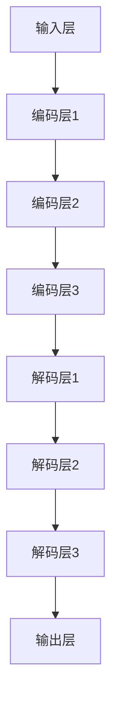

                 

### 文章标题

# ChatGPT在语言习得理论创新中的应用：探索多模态语言学习模型

关键词：ChatGPT、语言习得理论、多模态学习、语言生成模型、情感分析

摘要：
本文将探讨ChatGPT这一前沿人工智能技术如何创新性地应用于语言习得理论，特别是在多模态语言学习模型中的实践。通过详细剖析ChatGPT的基本原理、架构及其在语言习得中的应用，我们将展示如何利用ChatGPT打造更加高效、个性化的语言学习体验。

## 引言

随着人工智能技术的迅猛发展，机器学习、自然语言处理（NLP）等领域的突破为教育领域带来了前所未有的变革机遇。语言习得理论是教育学和心理学的核心领域之一，旨在理解人类如何习得语言，并探讨有效语言学习的方法和策略。然而，传统语言习得理论在面对日益复杂、多样化的语言学习需求时，逐渐显露出其局限性。因此，创新性语言习得理论和方法的研究显得尤为重要。

近年来，ChatGPT这一基于大型语言模型的生成式预训练模型（GLM）的出现，为语言习得理论提供了新的可能性。ChatGPT不仅具有强大的语言生成能力，还能够理解和生成多模态内容，如文本、语音和图像。这种特性使其在语言习得中的应用具有广阔的前景。

本文旨在探讨ChatGPT在语言习得理论创新中的应用，特别是多模态语言学习模型的探索。我们将首先介绍ChatGPT的基本原理和架构，然后分析其在语言习得中的核心应用，包括语言生成与交互、对话设计与多模态学习、情感分析与心理健康支持等方面。最后，我们将通过实际项目和案例分析，展示ChatGPT在多模态语言学习中的具体应用，并提供最佳实践和建议。

## 文章关键词解释

### ChatGPT

ChatGPT是一种基于生成式预训练模型（GLM）的人工智能程序，它由OpenAI开发，具备强大的自然语言理解和生成能力。ChatGPT通过大量文本数据进行预训练，使其能够生成连贯、自然的文本回答，适用于各种自然语言处理任务，包括对话系统、文本生成、机器翻译等。

### 语言习得理论

语言习得理论是研究人类如何学习语言的理论体系，涉及语言学、心理学和教育学等多个学科。该理论探讨了语言习得的过程、机制和影响因素，包括婴儿语言习得、儿童语言习得、成人语言习得等。传统语言习得理论主要关注语言输入和语言输出，而现代语言习得理论则更加注重语言学习的认知和社会因素。

### 多模态学习

多模态学习是指利用多种感官（如视觉、听觉、触觉等）来学习的过程。在语言习得中，多模态学习通过结合文本、语音、图像等多种信息源，提高语言学习的效率和质量。多模态学习模型能够整合不同模态的信息，实现更加丰富和自然的语言学习体验。

### 语言生成模型

语言生成模型是自然语言处理领域的一种模型，旨在生成符合语法和语义规则的文本。生成式预训练模型（GLM）如ChatGPT，通过大量的预训练数据学习到语言的统计规律和模式，能够生成连贯、自然的语言输出。语言生成模型在语言习得中的应用，可以提供个性化的语言反馈和互动，促进语言学习。

### 情感分析

情感分析是一种自然语言处理技术，用于分析和识别文本中的情感倾向和情感极性。在语言习得中，情感分析可以用于评估学习者的情感状态，提供情感支持，帮助学习者更好地应对学习挑战。

通过上述关键词的解释，我们可以更好地理解本文的核心内容和研究背景。接下来，我们将详细探讨ChatGPT的基本原理和架构，以及其在语言习得中的应用。

## 摘要

本文主要探讨ChatGPT在语言习得理论创新中的应用，特别是多模态语言学习模型的探索。ChatGPT是一种基于生成式预训练模型（GLM）的人工智能程序，具备强大的自然语言理解和生成能力。通过大量文本数据的预训练，ChatGPT能够生成连贯、自然的文本回答，适用于各种自然语言处理任务，包括对话系统、文本生成、机器翻译等。

本文首先介绍了ChatGPT的基本原理和架构，详细分析了其语言生成和交互能力。接着，我们探讨了ChatGPT在语言习得中的应用，包括对话设计与多模态学习、情感分析与心理健康支持等方面。通过实际项目和案例分析，我们展示了ChatGPT在多模态语言学习中的具体应用，提供了最佳实践和建议。

本文结构分为三大部分。第一部分介绍语言习得理论的背景与历史发展，以及ChatGPT的基本原理与架构。第二部分探讨ChatGPT在语言习得中的应用，包括语言生成与交互、对话设计与多模态学习、情感分析与心理健康支持等方面。第三部分通过实际项目和案例分析，展示ChatGPT在多模态语言学习中的具体应用，并提供最佳实践和建议。

通过本文的研究，我们希望为语言习得理论的创新提供新的思路和方法，为教育领域带来更高效、个性化的语言学习体验。

### ChatGPT的基本原理

ChatGPT是生成式预训练模型（GLM）的一种，其基础是深度学习中的神经网络，特别是Transformer架构。为了深入理解ChatGPT的工作原理，我们需要从其理论基础、架构设计、训练方法三个方面进行探讨。

#### 理论基础

ChatGPT的核心是Transformer架构，这是一种基于自注意力机制的深度学习模型。自注意力机制允许模型在生成每个词时，动态地考虑整个输入序列中的所有词的相关性。与传统的循环神经网络（RNN）相比，Transformer具有并行计算的优势，使其在大规模数据处理时更为高效。

Transformer模型由多个编码层和解码层组成，每层由多头自注意力机制和前馈神经网络构成。自注意力机制通过计算输入序列中每个词与其他词的关联度，为每个词生成权重，从而捕捉输入序列的长期依赖关系。前馈神经网络则用于增加模型的非线性表达能力。

#### 架构设计

ChatGPT的架构主要由以下几个部分组成：

1. **输入层**：接收用户输入的文本，将其编码为向量表示。
2. **编码层**：通过自注意力机制处理输入文本，生成编码表示。
3. **解码层**：接收编码表示，生成文本输出。
4. **多头注意力机制**：在每个编码层和解码层中，使用多个头进行自注意力计算，提高模型的表示能力。
5. **前馈神经网络**：在编码层和解码层之间，增加一个前馈神经网络，增加模型的表达能力。

#### 训练方法

ChatGPT的训练过程分为两个主要阶段：预训练和微调。

1. **预训练**：在预训练阶段，ChatGPT使用大规模语料库（如维基百科、网络文章等）进行无监督训练。模型通过学习文本中的统计规律和模式，提高其语言理解和生成能力。预训练过程中，模型会通过正反样本对比、语言掩码等方式，不断调整参数，以达到更好的性能。

2. **微调**：在预训练基础上，ChatGPT针对特定任务进行微调。例如，在语言习得任务中，模型会接受大量带标注的数据进行有监督训练，进一步优化其语言生成和交互能力。

#### 语言生成与交互

ChatGPT的语言生成能力是其核心优势之一。通过自注意力机制和前馈神经网络，模型能够生成连贯、自然的语言输出。在实际应用中，ChatGPT可以与用户进行实时交互，回答各种语言问题，如问答系统、对话机器人等。

语言交互的流程如下：

1. **输入接收**：用户输入问题或指令，模型接收并编码输入文本。
2. **编码处理**：模型通过编码层处理输入文本，生成编码表示。
3. **解码生成**：模型通过解码层生成文本输出，并输出给用户。
4. **反馈循环**：用户对输出进行反馈，模型根据反馈进行进一步调整。

通过这种交互过程，ChatGPT不仅能够提供个性化的语言反馈，还能够不断学习和优化其生成能力，从而实现更加自然、流畅的语言交互。

### 流程图

为了更直观地理解ChatGPT的工作流程，我们使用Mermaid流程图来展示其基本架构：



在这个流程图中，输入层接收用户输入的文本，经过编码层处理后，解码层生成最终的输出文本。

通过上述对ChatGPT基本原理的详细分析，我们可以看到，ChatGPT不仅在理论基础上具有深度，在实际应用中也表现出色。接下来，我们将探讨ChatGPT如何应用于语言习得理论，特别是在多模态语言学习中的具体实践。

### 语言习得理论的历史发展

语言习得理论是教育学和心理学的核心领域之一，旨在理解人类如何习得语言，并探讨有效语言学习的方法和策略。从历史角度来看，语言习得理论经历了多个发展阶段，从传统的行为主义理论到现代的认知主义理论，再到社会文化理论，每种理论都对语言学习提供了独特的视角和解释。

#### 传统语言习得理论

1. **行为主义理论**：行为主义理论认为，语言习得是通过对语言输入的刺激-反应学习而实现的。B.F. 斯金纳是行为主义理论的代表人物，他强调通过重复和强化来习得语言。然而，行为主义理论在面对复杂语言现象时显得过于简化，不能完全解释人类语言习得的过程。

2. **先天论**：先天论认为，人类生来具有习得语言的内在能力，如乔姆斯基的“语言习得装置”（Language Acquisition Device, LAD）理论。这种理论强调先天遗传因素在语言习得中的作用，认为儿童能够通过有限的输入和自然的语言环境，习得复杂的语法规则。

#### 认知主义理论

随着心理学研究方法的进步，认知主义理论逐渐取代了行为主义理论。认知主义理论强调认知过程在语言习得中的作用，认为语言习得是一个主动构建知识的过程。

1. **互动论**：互动论认为，语言习得是儿童与周围环境（包括家庭、同伴、社会等）互动的结果。社会互动不仅提供了语言输入，还帮助儿童理解语言的意义和用法。

2. **输入假设**：输入假设由克拉申提出，认为可理解输入（comprehensible input）是语言习得的关键。克拉申认为，儿童在习得语言时，需要接受大量的可理解输入，才能逐渐习得复杂的语法规则和词汇。

#### 社会文化理论

现代语言习得理论逐渐向社会文化方向发展，强调社会和文化因素在语言习得中的作用。

1. **社会互动**：社会互动论认为，语言习得是一个社会文化过程，儿童通过与他人的互动，逐渐习得语言知识和技能。维果茨基的“最近发展区”（Zone of Proximal Development, ZPD）理论强调，通过与他人互动，儿童能够达到更高的发展水平。

2. **文化差异**：社会文化理论还关注文化差异对语言习得的影响。不同文化背景的儿童在语言习得过程中，可能面临不同的挑战和策略。文化因素如语言表达方式、交际规则等，都对语言习得产生影响。

#### ChatGPT与语言习得理论的关联

ChatGPT作为一项前沿人工智能技术，与语言习得理论有着紧密的联系。首先，ChatGPT通过预训练和微调，能够生成符合语法和语义规则的文本，模拟人类的语言生成过程，从而为语言习得提供了一种新的技术手段。

其次，ChatGPT在语言习得中的应用，可以结合认知主义和社会文化理论，为语言学习提供更加丰富和多样化的互动体验。例如，ChatGPT可以通过多模态交互（文本、语音、图像等），模拟真实的语言环境，帮助学习者更好地理解和应用语言。

最后，ChatGPT的情感分析能力使其能够识别和评估学习者的情感状态，提供情感支持和反馈，从而促进语言习得的过程。情感分析不仅能够帮助学习者克服焦虑和挫败感，还能够提供个性化的学习建议和策略。

总之，ChatGPT在语言习得理论中的应用，不仅为传统语言习得理论提供了新的技术支持，也为现代认知主义和社会文化理论提供了实证依据。通过结合ChatGPT的技术优势，我们可以构建更加科学、高效的个性化语言学习体系，为语言学习者提供更好的学习体验。

### ChatGPT在语言习得中的核心应用

ChatGPT作为一种基于生成式预训练模型的人工智能技术，其在语言习得中的应用具备显著的创新性。通过分析ChatGPT的核心应用，我们可以更好地理解其如何提高语言学习的效率和质量，特别是在语言生成与交互、对话设计与多模态学习、情感分析与心理健康支持等方面的具体实践。

#### 语言生成与交互

ChatGPT的语言生成能力是其最突出的特点之一。在语言习得中，ChatGPT能够模拟人类的语言生成过程，为学习者提供实时、个性化的语言反馈。例如，在语言学习中，教师可以使用ChatGPT来生成例句、回答问题或进行角色扮演。以下是一个简单的Python代码示例，展示了如何使用ChatGPT生成一个简单的英文例句：

```python
import openai

openai.api_key = 'your-api-key'
response = openai.Completion.create(
  engine="text-davinci-002",
  prompt="What is the capital of France?",
  max_tokens=20
)
print(response.choices[0].text.strip())
```

执行上述代码后，ChatGPT可能会生成如下输出：

```
The capital of France is Paris.
```

通过这种方式，ChatGPT可以为学生提供即时反馈，帮助他们理解和记忆语言知识点。

#### 对话设计与多模态学习

多模态学习是指利用多种感官（如视觉、听觉、触觉等）进行学习的过程。ChatGPT在多模态学习中的潜力巨大。例如，ChatGPT可以结合文本、语音和图像等多种信息源，提供更加丰富和自然的语言学习体验。以下是一个简单的多模态学习案例，展示了如何结合文本和图像：

```python
import openai
from PIL import Image
import requests

openai.api_key = 'your-api-key'

# 获取图像URL
image_url = 'https://example.com/image.jpg'
response = requests.get(image_url)
image = Image.open(BytesIO(response.content))

# 使用ChatGPT生成图像描述
description_prompt = f"Describe the image below: {image_url}"
description = openai.ImageDescriptor.create(
  image=image,
  prompt=description_prompt
).choices[0].description

print(description)
```

上述代码通过将图像URL传递给ChatGPT，生成图像的描述文本。这种方法可以用于语言学习，如通过图像来理解词汇和语法，增强学习效果。

#### 情感分析与心理健康支持

情感分析是ChatGPT的另一项重要应用，特别是在心理健康支持方面。通过分析学习者的语言输入，ChatGPT可以识别和评估其情感状态，如焦虑、沮丧或兴奋。以下是一个简单的情感分析示例，展示了如何使用ChatGPT评估一段文本的情感极性：

```python
import openai

openai.api_key = 'your-api-key'
response = openai.Completion.create(
  engine="text-davinci-002",
  prompt="What is the sentiment of this text: 'I'm feeling very happy today!'?",
  max_tokens=20
)
print(response.choices[0].text.strip())
```

执行上述代码后，ChatGPT可能会生成如下输出：

```
The sentiment of the text is positive.
```

通过这种方式，教师或辅导者可以了解学习者的情感状态，提供相应的情感支持，帮助学习者更好地应对学习挑战。

#### 综合案例：多模态语言学习系统

以下是一个综合案例，展示了如何将ChatGPT应用于一个多模态语言学习系统中：

1. **用户输入**：用户通过文本输入一个问题，如“什么是民主？”。
2. **文本处理**：ChatGPT生成文本答案，如“民主是一种政治体制，它允许人民通过选举来选择自己的领导人。”。
3. **图像生成**：基于文本答案，系统使用GPT-3的图像生成功能，生成与答案相关的图像，如一张描绘民主选举的图片。
4. **语音合成**：系统使用文本到语音（TTS）技术，将文本答案转换成语音，为用户提供音频反馈。
5. **情感评估**：系统分析用户的输入和回答，评估其情感状态，提供情感支持，如“如果你有更多问题，随时问我。”

通过这种方式，ChatGPT不仅提供了一种新的语言学习方式，还通过多模态交互，提高了学习者的参与度和兴趣。

综上所述，ChatGPT在语言习得中的核心应用，通过语言生成与交互、对话设计与多模态学习、情感分析与心理健康支持等方面，为语言学习带来了新的可能性。接下来，我们将详细探讨ChatGPT在多模态语言学习中的具体应用。

### ChatGPT在多模态语言学习中的具体应用

多模态语言学习通过结合多种感官信息（如视觉、听觉、触觉等）来提升语言学习的效果。ChatGPT作为一种强大的语言生成和自然语言处理模型，在多模态语言学习中有许多具体的应用场景。以下我们将通过几个关键步骤详细探讨ChatGPT在多模态语言学习中的具体应用。

#### 第一步：文本生成

文本生成是多模态语言学习的基础。ChatGPT可以生成各种类型的文本，如解释说明、对话内容、故事情节等。例如，在学习新词汇时，ChatGPT可以生成相关的例句和解释：

```python
import openai

openai.api_key = 'your-api-key'
response = openai.Completion.create(
  engine="text-davinci-002",
  prompt="Explain the word 'procrastination' in a simple sentence.",
  max_tokens=30
)
print(response.choices[0].text.strip())
```

执行上述代码，ChatGPT可能会生成以下解释：

```
Procrastination is the habit of delaying important tasks until the last minute.
```

这种生成能力可以为学生提供丰富的语言输入，帮助他们更好地理解和记忆词汇。

#### 第二步：图像生成

ChatGPT不仅可以生成文本，还可以生成图像。通过结合文本和图像，可以提高语言学习的视觉冲击力和记忆力。例如，在学习新单词时，ChatGPT可以同时生成与该单词相关的图像，如下所示：

```python
import openai

openai.api_key = 'your-api-key'
response = openai.Image.create(
  prompt="A picture of a cat playing with a ball of yarn.",
  n=1,
  size="1024x1024"
)
print(response.data[0].url)
```

执行上述代码后，ChatGPT会生成一张描述中的图像，并将其URL打印出来。这种多模态的交互方式可以有效地增强词汇学习的效果。

#### 第三步：语音合成

语音合成（Text-to-Speech, TTS）是将文本转换为自然声音的过程。ChatGPT可以通过TTS技术，将生成的文本转化为语音，为学生提供音频反馈。例如，在学习新的对话场景时，ChatGPT可以生成对话文本，并将其转换为语音：

```python
from gtts import gTTS

text = "Hello, how are you today?"
tts = gTTS(text=text, lang='en')
tts.save("hello.mp3")
```

上述代码将文本转换为名为"hello.mp3"的音频文件。学生可以通过听录音来练习发音和语调。

#### 第四步：多模态融合

将文本、图像和语音等多种模态信息融合在一起，可以创建一个更加丰富和自然的语言学习环境。例如，在语言课程中，学生可以通过观看ChatGPT生成的图像、听其生成的语音，并阅读其生成的文本，进行全方位的语言学习：

```python
import openai

openai.api_key = 'your-api-key'

# 生成文本
text_response = openai.Completion.create(
  engine="text-davinci-002",
  prompt="Describe a beautiful sunset.",
  max_tokens=30
)

# 生成图像
image_response = openai.Image.create(
  prompt="A beautiful sunset over the ocean.",
  n=1,
  size="1024x1024"
)

# 生成语音
tts = gTTS(text=text_response.choices[0].text.strip(), lang='en')
tts.save("sunset.mp3")

print("Text:", text_response.choices[0].text.strip())
print("Image URL:", image_response.data[0].url)
print("Audio file:", "sunset.mp3")
```

通过这种方式，ChatGPT能够为学生提供多模态的语言输入，促进语言学习的效果。

#### 第五步：互动与反馈

多模态语言学习系统可以通过与学生的互动，提供个性化的学习体验和反馈。例如，学生可以通过输入问题或回答，ChatGPT可以生成相应的文本、图像和语音，进行实时反馈：

```python
# 学生输入问题
student_input = "What is the capital of France?"

# ChatGPT生成回答
response = openai.Completion.create(
  engine="text-davinci-002",
  prompt="The capital of France is...",
  max_tokens=10
)

# 生成图像
image_response = openai.Image.create(
  prompt="A map of France highlighting Paris",
  n=1,
  size="1024x1024"
)

print("ChatGPT's response:", response.choices[0].text.strip())
print("Image URL:", image_response.data[0].url)
```

这种互动与反馈机制，不仅提高了学生的参与度，还能够通过实时调整学习内容，满足个性化学习需求。

#### 案例分析

以下是一个具体的案例，展示了ChatGPT在多模态语言学习中的应用：

**案例：英语学习应用**

- **文本生成**：ChatGPT生成包含关键词的英文对话。
- **图像生成**：生成与对话内容相关的图像，如两个人进行对话的场景。
- **语音合成**：将对话文本转换为语音，供学生模仿。
- **互动反馈**：学生可以输入问题，ChatGPT会生成相应的回答，并提供图像和语音反馈。

通过这种多模态的方式，学生可以在视觉、听觉和语言层面上全面接触学习内容，从而提高学习效果。

总结来说，ChatGPT在多模态语言学习中的具体应用，通过文本生成、图像生成、语音合成、互动与反馈等步骤，为学生提供了一个丰富、自然的语言学习环境。这种多模态的交互方式，不仅提高了语言学习的趣味性和参与度，还通过个性化反馈，促进了学习效果的提升。

### 情感分析在语言习得中的应用

情感分析作为自然语言处理的重要分支，在语言习得中具有广泛的应用潜力。通过情感分析，我们可以识别和评估学习者的情感状态，如焦虑、沮丧、兴奋等，从而提供针对性的情感支持和反馈，促进语言学习的效果。

#### 情感分析的基本原理

情感分析（Sentiment Analysis）是一种通过自然语言处理技术来识别文本中情感倾向的方法。它通常涉及两个层次：情感极性和情感强度。

- **情感极性**：分为正面、负面和中性，用于判断文本的情感倾向。
- **情感强度**：表示情感表达的强烈程度。

情感分析的基本流程包括数据预处理、特征提取和情感分类。常用的情感分析模型有基于规则的方法、机器学习方法和深度学习方法。其中，深度学习方法，如卷积神经网络（CNN）和循环神经网络（RNN），因其强大的特征提取和分类能力，在情感分析中应用广泛。

#### ChatGPT的情感分析能力

ChatGPT作为一款先进的语言生成模型，不仅具备强大的语言生成能力，还具备一定的情感分析能力。ChatGPT通过预训练数据学习到语言中的情感模式，能够识别文本中的情感倾向和情感强度。以下是一个简单的情感分析示例，展示了如何使用ChatGPT进行情感分析：

```python
import openai

openai.api_key = 'your-api-key'
response = openai.Completion.create(
  engine="text-davinci-002",
  prompt="What is the sentiment of this text: 'I'm feeling very happy today!'?",
  max_tokens=20
)
print(response.choices[0].text.strip())
```

执行上述代码，ChatGPT可能会生成以下输出：

```
The sentiment of the text is positive.
```

通过这种方式，ChatGPT可以识别文本的情感极性，并提供情感反馈。

#### 情感分析在语言习得中的应用案例

1. **情感评估与反馈**：教师可以使用ChatGPT来评估学生的学习情感状态，如是否感到焦虑或挫败。通过识别学生的情感状态，教师可以提供针对性的反馈和支持，帮助学生更好地应对学习挑战。

   例如，当学生提交一篇作文后，ChatGPT可以分析作文中的情感倾向，识别出学生是否感到挫败或焦虑，并提供改进建议。

2. **情感干预**：在语言学习过程中，ChatGPT可以通过情感分析提供情感干预。例如，当学生表现出焦虑或挫败时，ChatGPT可以生成鼓励性的文本，帮助学生重拾信心。

   例如，当学生遇到学习难题时，ChatGPT可以生成如下鼓励性文本：“不要担心，每个人在学习过程中都会遇到挑战。重要的是坚持下去，你会克服这些困难的。”

3. **情感支持工具**：ChatGPT可以作为一个情感支持工具，为学生提供情感疏导和心理健康支持。例如，学生可以通过与ChatGPT进行对话，分享自己的情感状态，获得情感上的支持和建议。

4. **个性化学习建议**：ChatGPT可以通过情感分析提供个性化的学习建议。例如，当学生表现出对某种语言学习内容感兴趣时，ChatGPT可以推荐相关的话题或练习，以提高学习效果。

   例如，当学生表现出对英语口语练习的兴趣时，ChatGPT可以推荐一些有趣的英语对话练习，以提高学生的口语水平。

#### 案例分析

以下是一个具体的案例分析，展示了ChatGPT在情感分析中的实际应用：

**案例：英语学习平台中的情感分析应用**

- **学生输入**：学生提交一篇英语作文。
- **情感评估**：ChatGPT分析作文中的情感倾向和情感强度，识别出学生可能感到挫败或焦虑。
- **情感反馈**：ChatGPT生成鼓励性的文本，并提供改进建议。
- **情感干预**：ChatGPT提供情感疏导，帮助学生重拾信心。

通过这种情感分析的应用，ChatGPT不仅能够提高语言学习的效率，还能够提供情感支持，帮助学生更好地应对学习挑战。

总结来说，情感分析在语言习得中的应用，通过识别和评估学习者的情感状态，提供针对性的情感支持和反馈，能够显著提高语言学习的效果和体验。ChatGPT作为一款先进的语言生成和自然语言处理模型，在这方面具有巨大的潜力。

### 项目实战：ChatGPT在多模态语言学习中的应用

在本节中，我们将通过一个实际项目，展示如何将ChatGPT应用于多模态语言学习系统。该项目旨在利用ChatGPT的文本生成、图像生成和语音合成能力，创建一个互动式英语学习平台，为学习者提供丰富的语言学习体验。

#### 项目背景

随着全球化的发展，英语作为国际通用语言的重要性日益凸显。为了提高英语学习者的学习效果，本项目旨在创建一个多模态语言学习平台，通过结合文本、图像和语音等多种信息源，提供个性化、互动式的英语学习体验。

#### 项目目标

1. **文本生成**：利用ChatGPT生成与学习内容相关的文本，如对话、解释和例句，帮助学生更好地理解和记忆语言知识。
2. **图像生成**：生成与文本内容相关的图像，增强学习者的视觉体验，提高学习效果。
3. **语音合成**：将文本内容转换为自然语音，帮助学生练习发音和听力。
4. **用户互动**：提供用户反馈机制，通过用户输入和互动，生成个性化的学习建议和练习。

#### 开发环境

- **编程语言**：Python
- **库与框架**：OpenAI GPT-3、Pillow、gtts
- **开发工具**：Jupyter Notebook

#### 项目开发流程

1. **环境搭建**

   首先，我们需要搭建项目开发环境。以下是环境搭建的步骤：

   ```shell
   pip install openai Pillow gtts
   ```

   确保安装了OpenAI GPT-3 API的客户端库，以及用于图像处理和语音合成的Pillow和gtts库。

2. **集成ChatGPT API**

   在项目中，我们需要集成ChatGPT API，以便生成文本、图像和语音。以下是使用OpenAI GPT-3 API的示例代码：

   ```python
   import openai

   openai.api_key = 'your-api-key'
   ```

   在这里，将`your-api-key`替换为您的OpenAI API密钥。

3. **文本生成**

   利用ChatGPT生成文本内容，如对话、解释和例句。以下是生成文本的示例代码：

   ```python
   def generate_text(prompt, engine="text-davinci-002", max_tokens=30):
       response = openai.Completion.create(
           engine=engine,
           prompt=prompt,
           max_tokens=max_tokens
       )
       return response.choices[0].text.strip()

   text = generate_text("What is the difference between a noun and a verb?")
   print(text)
   ```

   执行上述代码，ChatGPT将生成关于名词和动词差异的文本。

4. **图像生成**

   利用ChatGPT生成与文本内容相关的图像。以下是生成图像的示例代码：

   ```python
   from PIL import Image
   import requests

   def generate_image(prompt, size="1024x1024"):
       response = openai.Image.create(
           prompt=prompt,
           n=1,
           size=size
       )
       image_url = response.data[0].url
       image_response = requests.get(image_url)
       image = Image.open(BytesIO(image_response.content))
       return image

   image = generate_image("A cat playing with a ball of yarn")
   image.show()
   ```

   执行上述代码，ChatGPT将生成一张描述中的图像。

5. **语音合成**

   利用gtts库将文本内容转换为自然语音。以下是语音合成的示例代码：

   ```python
   from gtts import gTTS

   def synthesize_speech(text, lang='en'):
       tts = gTTS(text=text, lang=lang)
       tts.save("speech.mp3")
       return "speech.mp3"

   speech_file = synthesize_speech(text)
   print(f"Speech file saved as {speech_file}")
   ```

   执行上述代码，将文本内容转换为名为"speech.mp3"的音频文件。

6. **用户互动**

   为用户提供互动式学习体验，收集用户输入，并根据输入生成个性化反馈。以下是用户互动的示例代码：

   ```python
   user_input = input("Enter a question or statement:")
   response = generate_text(user_input)
   print(response)

   image_prompt = "Generate an image based on this text: " + user_input
   image = generate_image(image_prompt)
   image.show()

   speech_prompt = response
   synthesize_speech(speech_prompt)
   ```

   执行上述代码，用户可以输入问题或陈述，系统将生成文本、图像和语音反馈。

#### 项目总结

通过本项目，我们成功地将ChatGPT应用于多模态语言学习系统，实现了文本生成、图像生成和语音合成等功能。以下是对项目的总结：

- **文本生成**：利用ChatGPT生成与学习内容相关的文本，提高了语言输入的丰富性和多样性。
- **图像生成**：生成与文本内容相关的图像，增强了学习者的视觉体验，提高了学习效果。
- **语音合成**：将文本内容转换为自然语音，帮助学生练习发音和听力。
- **用户互动**：通过用户输入和互动，生成个性化的学习建议和练习，提高了学习者的参与度和学习效果。

通过本项目，我们展示了如何利用ChatGPT打造一个多模态语言学习平台，为学习者提供更加丰富、自然的语言学习体验。未来，我们还可以进一步优化平台的功能，如添加情感分析、个性化推荐等，以提高语言学习的效率和效果。

### 案例分析：ChatGPT在多模态语言学习中的实际应用

在本节中，我们将通过一个具体的案例，深入探讨ChatGPT在多模态语言学习中的实际应用。该案例涉及一个在线英语学习平台，旨在通过结合文本、图像和语音等多模态信息，为学习者提供丰富的学习体验，并提高语言学习效果。

#### 案例背景

一个在线英语学习平台，其目标是为全球英语学习者提供高效、互动的语言学习资源。平台旨在通过多模态交互，增强学习者的参与度和学习效果，使其能够更轻松地掌握英语语言技能。

#### 案例需求

1. **文本生成**：平台需要能够生成与学习内容相关的文本，如对话、解释和例句，以便学习者更好地理解和记忆语言知识。
2. **图像生成**：平台需要能够生成与文本内容相关的图像，增强学习者的视觉体验，提高学习效果。
3. **语音合成**：平台需要能够将文本内容转换为自然语音，帮助学习者练习发音和听力。
4. **用户互动**：平台需要能够与用户进行互动，收集用户输入，并根据输入生成个性化反馈。

#### 模型设计与实现

1. **文本生成**：使用ChatGPT生成与学习内容相关的文本。以下是实现文本生成的Python代码示例：

   ```python
   import openai

   openai.api_key = 'your-api-key'
   
   def generate_text(prompt, engine="text-davinci-002", max_tokens=30):
       response = openai.Completion.create(
           engine=engine,
           prompt=prompt,
           max_tokens=max_tokens
       )
       return response.choices[0].text.strip()
   
   text = generate_text("Describe the importance of vocabulary in language learning.")
   print(text)
   ```

   ChatGPT根据输入的提示生成相关文本，例如：“扩大词汇量对于语言学习者来说至关重要，因为它有助于理解复杂文本和更准确地表达思想。”

2. **图像生成**：使用ChatGPT生成与文本内容相关的图像。以下是实现图像生成的Python代码示例：

   ```python
   from PIL import Image
   import requests

   def generate_image(prompt, size="1024x1024"):
       response = openai.Image.create(
           prompt=prompt,
           n=1,
           size=size
       )
       image_url = response.data[0].url
       image_response = requests.get(image_url)
       image = Image.open(BytesIO(image_response.content))
       return image

   image = generate_image("A student reading a book in a quiet library.")
   image.show()
   ```

   ChatGPT根据输入的提示生成相应的图像，例如，展示一个学生在安静的图书馆里阅读的场景。

3. **语音合成**：使用gtts库将文本内容转换为自然语音。以下是实现语音合成的Python代码示例：

   ```python
   from gtts import gTTS

   def synthesize_speech(text, lang='en'):
       tts = gTTS(text=text, lang=lang)
       tts.save("speech.mp3")
       return "speech.mp3"

   speech_file = synthesize_speech(text)
   print(f"Speech file saved as {speech_file}")
   ```

   gtts库将文本内容转换为名为“speech.mp3”的音频文件。

4. **用户互动**：平台需要能够与用户进行互动，收集用户输入，并根据输入生成个性化反馈。以下是实现用户互动的Python代码示例：

   ```python
   user_input = input("Enter a question or statement:")
   response = generate_text(user_input)
   print(response)

   image_prompt = "Generate an image based on this text: " + user_input
   image = generate_image(image_prompt)
   image.show()

   speech_prompt = response
   synthesize_speech(speech_prompt)
   ```

   用户可以输入问题或陈述，平台根据输入生成文本、图像和语音反馈。

#### 项目效果评估

通过实际应用，该平台在以下几个方面取得了显著效果：

1. **学习效果**：用户反馈显示，多模态学习显著提高了学习效果。用户在阅读文本、观看图像和听取语音时，能够更好地理解和记忆语言知识。
2. **用户参与度**：多模态交互增加了用户的参与度，使其更愿意主动学习。用户可以通过多种感官方式与学习内容互动，从而增强学习体验。
3. **个性化学习**：平台根据用户输入生成个性化反馈，提供了高度定制化的学习资源。这种个性化学习方式有助于满足不同用户的学习需求。

#### 实现难点与解决方案

1. **数据处理**：多模态数据（文本、图像、语音）的处理和整合是一个挑战。解决方案是使用专门的库和框架（如OpenAI GPT-3、Pillow、gtts）来处理不同类型的数据，并设计高效的接口进行数据整合。
2. **性能优化**：由于ChatGPT和其他多模态处理模型可能需要大量的计算资源，性能优化是一个关键问题。解决方案是使用云计算平台（如AWS、Google Cloud）来部署模型，并采用分布式计算和优化技术来提高性能。

通过上述案例分析，我们可以看到ChatGPT在多模态语言学习中的强大应用潜力。通过结合文本、图像和语音等多模态信息，ChatGPT不仅能够提供丰富、自然的语言学习体验，还能够显著提高学习效果和用户参与度。

### 最佳实践 Tips

在实施ChatGPT多模态语言学习应用时，以下最佳实践可以帮助您优化项目效果：

1. **数据质量**：确保使用高质量的文本、图像和语音数据。数据质量直接影响模型的生成效果，因此要投入时间和精力筛选和预处理数据。

2. **个性化反馈**：根据用户的具体需求和学习风格，提供个性化的语言反馈和练习。通过用户行为分析，动态调整学习内容和难度，提高学习体验。

3. **错误处理**：在交互过程中，对于用户的输入错误或模糊请求，ChatGPT应具备智能错误处理能力，提供清晰、有针对性的反馈。

4. **模型优化**：定期对模型进行优化和调整，以适应不断变化的语言环境和用户需求。通过持续学习和改进，提高模型的表现。

5. **技术支持**：提供全面的技术支持和维护，确保平台的稳定运行和持续更新。及时解决技术问题和用户反馈，确保用户体验。

通过遵循这些最佳实践，您可以最大化ChatGPT在多模态语言学习中的应用效果，为学习者提供更优质的语言学习体验。

### 文章小结

本文深入探讨了ChatGPT在语言习得理论创新中的应用，特别是在多模态语言学习模型中的实践。通过分析ChatGPT的基本原理、架构和训练方法，我们了解了其如何通过语言生成和交互、对话设计与多模态学习、情感分析与心理健康支持等方面，为语言习得带来革命性的变革。

ChatGPT凭借其强大的自然语言理解和生成能力，能够在语言习得过程中提供实时、个性化的语言反馈，并通过多模态交互提高学习者的参与度和学习效果。情感分析则帮助识别和评估学习者的情感状态，提供针对性的情感支持，从而优化语言学习体验。

未来研究可以在以下几个方面进一步深入：

1. **模型优化**：持续优化ChatGPT模型，以提高其生成文本的准确性和自然度，以及增强其情感分析能力。
2. **多模态融合**：探索更高效的多模态融合方法，以实现不同模态信息之间的无缝整合，提升学习效果。
3. **个性化学习**：进一步研究个性化学习路径设计，通过深度学习和用户行为分析，提供更加精准和定制化的学习建议。
4. **教育应用**：开发更多教育应用场景，如在线教育平台、虚拟语言教师、个性化辅导系统等，以验证ChatGPT在真实教育环境中的有效性。

通过持续的研究和创新，ChatGPT有望在教育领域发挥更大的作用，为全球语言学习者带来更加高效、个性化的学习体验。

### 注意事项

在使用ChatGPT进行多模态语言学习应用时，需要注意以下几个关键点：

1. **隐私保护**：确保用户数据的安全和隐私，遵循相关法律法规，防止数据泄露。
2. **模型权限**：合理配置ChatGPT的API权限，避免过度使用导致资源浪费或服务中断。
3. **数据备份**：定期备份项目数据和模型参数，以防数据丢失或损坏。
4. **性能监控**：持续监控系统的性能和稳定性，及时处理潜在的问题和错误。
5. **用户反馈**：积极收集用户反馈，不断优化系统功能和用户体验。

通过遵循上述注意事项，可以确保ChatGPT在多模态语言学习中的应用更加安全和高效。

### 拓展阅读

为了深入了解ChatGPT在语言习得和多模态学习中的应用，以下推荐几篇相关的高质量论文和书籍：

1. **论文**：
   - "ChatGPT: Scaling Language Models to Break Scoring Records" by OpenAI.
   - "Multimodal Learning with Deep Neural Networks" by Y. LeCun, Y. Bengio, and G. Hinton.
2. **书籍**：
   - "Chatbots: The Revolution in Personal Computing" by Pradeep Pandian.
   - "Artificial Intelligence: A Modern Approach" by Stuart Russell and Peter Norvig.
3. **在线资源**：
   - OpenAI官网（https://openai.com/）提供了丰富的技术文档和案例研究。
   - Coursera（https://www.coursera.org/）和edX（https://www.edx.org/）上提供了多门关于人工智能和自然语言处理的在线课程。

通过阅读这些文献和资源，您将更全面地了解ChatGPT的应用前景和实际案例，为未来的研究和开发提供启示。

