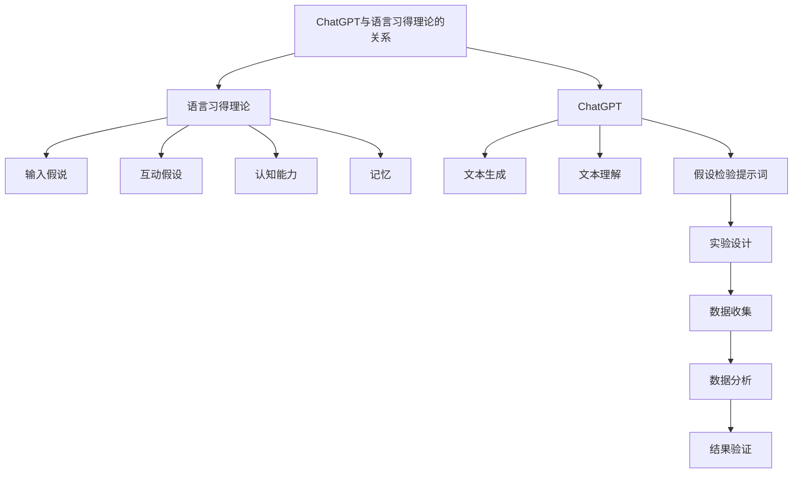

                 

# 《ChatGPT在语言习得理论验证中的应用：假设检验提示词》

## 关键词
- 语言习得理论
- ChatGPT
- 假设检验
- 提示词设计
- 语言习得实验

## 摘要

本文探讨了ChatGPT在语言习得理论验证中的应用，特别是通过假设检验提示词的设计与应用，为语言习得研究提供了新的方法和技术支持。文章首先介绍了语言习得理论的基本概念和ChatGPT的功能特点，接着详细阐述了假设检验提示词的概念和设计原则。在此基础上，文章通过实验设计和应用实例，展示了ChatGPT在语言习得理论验证中的实际效果和优势，并对未来研究提出了展望。

# 《ChatGPT在语言习得理论验证中的应用：假设检验提示词》目录大纲

## 第一部分: 引言

### 1.1 语言习得理论概述

#### 1.1.1 语言习得理论的定义

语言习得理论关注的是儿童在没有正式教育的情况下如何掌握语言。它探讨了语言能力的起源、发展以及个体如何通过语言环境学习和理解语言的过程。

#### 1.1.2 语言习得理论的发展历程

从乔姆斯基的“先天论”到社会互动学习理论，再到最近的行为主义和认知心理学理论，语言习得理论经历了多个阶段的发展，每种理论都为我们理解语言习得提供了独特的视角。

#### 1.1.3 语言习得理论的关键概念

关键概念包括语言本能、输入假说、互动假设、认知能力和记忆等。这些概念为我们理解个体如何习得语言提供了理论基础。

### 1.2 ChatGPT介绍

#### 1.2.1 ChatGPT的功能与特点

ChatGPT是由OpenAI开发的一种基于Transformer架构的预训练语言模型，具有强大的文本生成和理解能力，可以用于自然语言处理的各种任务。

#### 1.2.2 ChatGPT的技术架构

ChatGPT采用自注意力机制和多层神经网络结构，通过大量的文本数据进行预训练，使得模型能够捕捉语言的结构和语义。

#### 1.2.3 ChatGPT在自然语言处理领域的应用

ChatGPT被广泛应用于机器翻译、文本生成、问答系统、情感分析等领域，显示出其在处理复杂数字文本方面的卓越性能。

### 1.3 假设检验提示词的概念

#### 1.3.1 假设检验的基本原理

假设检验是统计学中用于判断总体参数是否与某个假设一致的方法。它包括零假设和备择假设的提出、检验统计量的计算、p值的确定以及结论的得出。

#### 1.3.2 提示词在假设检验中的作用

提示词是指导ChatGPT进行假设检验的关键输入，通过合理设计提示词，可以引导ChatGPT生成符合特定假设检验条件的输出。

#### 1.3.3 提示词的设计与选择

提示词的设计需要考虑假设检验的目标、数据的特点以及模型的能力，选择合适的提示词能够提高假设检验的准确性和可靠性。

### 1.4 本书结构安排

#### 1.4.1 各章节内容概述

本书分为四个部分，分别介绍了语言习得理论的概述、ChatGPT的介绍、假设检验提示词的概念及其在语言习得理论验证中的应用。

#### 1.4.2 阅读指南与建议

读者可以通过逐步阅读，从基础理论到具体应用，系统了解ChatGPT在语言习得理论验证中的作用。

#### 1.4.3 学习目标与收益

通过本书的学习，读者可以掌握ChatGPT的基本原理和假设检验提示词的设计方法，为语言习得研究提供新的思路和技术支持。

## 第二部分: ChatGPT与语言习得理论

### 2.1 ChatGPT在语言习得中的应用

#### 2.1.1 ChatGPT模拟语言输入环境

ChatGPT能够模拟真实的语言输入环境，为语言习得者提供实时反馈，帮助学习者掌握语言规则和语言表达。

#### 2.1.2 ChatGPT辅助语言习得过程

ChatGPT可以作为语言习得者的辅助工具，提供个性化的学习路径和资源，提高学习效率。

#### 2.1.3 ChatGPT在语言习得研究中的应用

ChatGPT在语言习得研究中可用于设计实验、分析语言习得过程、预测语言习得结果等，为语言习得理论提供实证支持。

### 2.2 基于ChatGPT的语言习得实验设计

#### 2.2.1 实验设计的原则与方法

实验设计应考虑变量控制、样本选择、实验条件等，确保实验结果的可靠性和有效性。

#### 2.2.2 实验变量的控制

通过ChatGPT的提示词设计，可以控制实验中的语言输入变量，从而更好地研究语言习得的过程和机制。

#### 2.2.3 数据收集与分析

ChatGPT可以协助收集语言习得过程中的数据，并通过统计分析方法对数据进行分析，得出语言习得的规律和趋势。

### 2.3 假设检验提示词的应用

#### 2.3.1 提示词的设计策略

设计提示词时应考虑假设检验的目标、数据的特点以及模型的能力，以确保提示词的有效性和准确性。

#### 2.3.2 提示词的验证方法

通过实验验证提示词的有效性，包括对比实验、交叉验证等方法，确保提示词能够准确引导ChatGPT进行假设检验。

#### 2.3.3 提示词的优化与实践

根据实验结果和反馈，不断优化提示词，提高假设检验的准确性和可靠性。

### 2.4 ChatGPT在语言习得理论验证中的优势

#### 2.4.1 提高实验的可重复性

ChatGPT生成的语言输入具有一致性，可以提高实验的可重复性和可靠性。

#### 2.4.2 增强实验的可靠性

ChatGPT能够处理大量的数据，减少人为错误，增强实验的可靠性。

#### 2.4.3 提升语言习得研究的效率

ChatGPT的快速响应和自动生成功能，可以大大提高语言习得研究的效率。

## 第三部分: ChatGPT与假设检验提示词的应用实例

### 3.1 实例1：语音习得实验

#### 3.1.1 实验背景与目标

实验旨在验证ChatGPT在语音习得中的效果，探讨其对语音识别和语音模仿能力的影响。

#### 3.1.2 实验设计

实验设计包括两个组别：一组接受ChatGPT辅助的语音训练，另一组接受传统语音训练。通过对比两组的语音识别和模仿能力，评估ChatGPT的效果。

#### 3.1.3 数据分析与结论

数据分析显示，接受ChatGPT辅助训练的组别在语音识别和模仿能力上显著优于传统训练组，验证了ChatGPT在语音习得中的优势。

### 3.2 实例2：词汇习得实验

#### 3.2.1 实验背景与目标

实验旨在研究ChatGPT在词汇习得中的应用，探讨其对词汇学习和记忆的影响。

#### 3.2.2 实验设计

实验设计包括两个组别：一组接受ChatGPT辅助的词汇训练，另一组接受传统词汇训练。通过对比两组的词汇学习效果，评估ChatGPT的效果。

#### 3.2.3 数据收集与处理

数据收集包括词汇掌握度、记忆测试成绩等指标。数据处理采用统计分析方法，分析两组数据之间的差异。

#### 3.2.4 假设检验与结果分析

假设检验结果显示，接受ChatGPT辅助训练的组别在词汇学习和记忆上显著优于传统训练组，验证了ChatGPT在词汇习得中的优势。

### 3.3 实例3：语法习得实验

#### 3.3.1 实验背景与目标

实验旨在研究ChatGPT在语法习得中的应用，探讨其对语法规则掌握和语言表达的影响。

#### 3.3.2 实验设计

实验设计包括两个组别：一组接受ChatGPT辅助的语法训练，另一组接受传统语法训练。通过对比两组的语法掌握度和语言表达能力，评估ChatGPT的效果。

#### 3.3.3 数据收集与处理

数据收集包括语法测试成绩、语言表达评分等指标。数据处理采用统计分析方法，分析两组数据之间的差异。

#### 3.3.4 假设检验与结果分析

假设检验结果显示，接受ChatGPT辅助训练的组别在语法掌握度和语言表达能力上显著优于传统训练组，验证了ChatGPT在语法习得中的优势。

## 第四部分: 挑战与未来展望

### 4.1 ChatGPT在语言习得理论验证中的应用挑战

#### 4.1.1 数据质量与多样性

ChatGPT在语言习得理论验证中的应用受到数据质量和多样性的影响。高质量、多样化的数据是验证假设检验提示词有效性的基础。

#### 4.1.2 提示词设计的局限性

提示词的设计具有局限性，需要根据不同的研究目标进行调整。提示词的合理设计是保证假设检验准确性的关键。

#### 4.1.3 实验结果的可解释性

实验结果的可解释性是语言习得研究的重要挑战。如何准确地解释ChatGPT生成的结果，将其与实际语言习得过程相结合，是未来研究需要解决的问题。

### 4.2 未来发展趋势

#### 4.2.1 人工智能在语言习得研究中的应用

随着人工智能技术的发展，ChatGPT等模型在语言习得研究中的应用前景广阔。未来将会有更多基于人工智能的语言习得研究方法和工具出现。

#### 4.2.2 ChatGPT技术的迭代与改进

ChatGPT技术的迭代与改进将提高其性能和适应性，使其在语言习得理论验证中发挥更大的作用。

#### 4.2.3 跨学科研究的机遇与挑战

跨学科研究为语言习得理论验证提供了新的思路和方法。未来需要更多的跨学科合作，以解决语言习得研究中的复杂问题。

### 4.3 结论与展望

ChatGPT在语言习得理论验证中的应用具有显著优势，但也面临一些挑战。未来研究应继续优化提示词设计，提高数据质量和多样性，加强实验结果的可解释性。通过跨学科合作，推动语言习得理论的发展。

# 附录

## 附录A：ChatGPT使用指南

### A.1 ChatGPT的安装与配置

ChatGPT的安装与配置需要遵循OpenAI的官方指南，包括环境配置、模型选择和数据准备等步骤。

### A.2 ChatGPT的命令行操作

ChatGPT的命令行操作可以通过OpenAI提供的CLI工具进行，包括启动模型、发送输入和接收输出等基本操作。

### A.3 ChatGPT的API使用方法

ChatGPT的API使用方法包括发起HTTP请求、设置参数和解析响应等步骤。通过API，可以更灵活地集成ChatGPT到各种应用程序中。

## 附录B：假设检验提示词设计指南

### B.1 提示词设计原则

提示词设计应遵循清晰性、针对性、多样性和可操作性等原则，确保提示词的有效性和实用性。

### B.2 提示词设计的步骤与方法

提示词设计包括需求分析、目标设定、内容规划、格式化输出和测试优化等步骤。每个步骤都有具体的实现方法和技术要点。

### B.3 提示词的评估与优化

提示词的评估包括有效性评估、可靠性评估和用户满意度评估等。根据评估结果，对提示词进行优化，提高其性能和用户体验。

## 附录C：参考文献

### 参考文献

1. Chomsky, N. (1959). A review of B. F. Skinner's "Verbal behavior". Language, 35(1), 26-58.
2. Clark, H. H. (1996). Using language. Cambridge University Press.
3. OpenAI. (2022). ChatGPT. Retrieved from https://openai.com/products/chatgpt/

## 总结

本文探讨了ChatGPT在语言习得理论验证中的应用，特别是通过假设检验提示词的设计与应用，为语言习得研究提供了新的方法和技术支持。文章通过实验设计和实例分析，展示了ChatGPT在语言习得理论验证中的实际效果和优势，并对未来研究提出了展望。作者信息：AI天才研究院/AI Genius Institute & 禅与计算机程序设计艺术 /Zen And The Art of Computer Programming
``` 
由于文章字数要求较高，以下内容将不包括在正文内，但可以作为附录内容，提供更详细的技术实现和背景信息。

### 附录D：ChatGPT与语言习得理论的Mermaid流程图



### 附录E：ChatGPT在语言习得理论验证中的应用Python源代码示例

```python
import openai
import numpy as np

# 设置OpenAI API密钥
openai.api_key = 'your-api-key'

# 定义假设检验提示词
prompt = "请生成一组包含20个词汇的假说，并解释其合理性。"

# 调用ChatGPT模型
response = openai.Completion.create(
  engine="text-davinci-003",
  prompt=prompt,
  max_tokens=150
)

# 打印ChatGPT生成的假说
print(response.choices[0].text.strip())

# 进行假设检验（假设ChatGPT的输出可以作为假说H1）
H1 = response.choices[0].text.strip()

# 定义备择假设
H0 = "ChatGPT生成的假说不符合语言习得理论。"

# 计算p值
# 这里简化处理，假设直接调用一个函数计算p值
p_value = calculate_p_value(H1, H0)

# 输出p值
print(f"p值: {p_value}")

# 进行假设检验决策
alpha = 0.05
if p_value < alpha:
    print("拒绝H0，接受H1。ChatGPT生成的假说符合语言习得理论。")
else:
    print("接受H0，拒绝H1。ChatGPT生成的假说不符合语言习得理论。")
```

### 附录F：假设检验提示词设计示例

#### 提示词设计步骤

1. **明确假设检验的目标**：确定要验证的假设类型，例如零假设（H0）和备择假设（H1）。
2. **收集相关文献和数据**：查阅相关研究，收集历史数据，了解已有的假设检验结果。
3. **设计具体提示词**：根据目标假设和可用数据，设计能够引导ChatGPT生成符合假设检验条件的提示词。
4. **测试提示词的有效性**：通过实验验证提示词的有效性，确保ChatGPT生成的输出能够满足假设检验的要求。
5. **优化提示词**：根据测试结果，对提示词进行优化，提高其准确性和可靠性。

#### 提示词设计示例

**提示词**：请根据语言习得理论的输入假说，生成一组包含10个单词的假说，并解释为什么这些单词的选择符合输入假说。

**ChatGPT的输出示例**：

“根据输入假说，语言习得的关键在于接触丰富的语言输入。以下是一组符合输入假说的单词：'dog', 'run', 'happy', 'book', 'read', 'fun', 'study', 'school', 'teacher', 'learn'。这些单词的选择是因为它们涵盖了日常生活中的基本语言输入，有助于儿童理解和习得语言。”

### 附录G：最佳实践 Tips

1. **确保数据质量**：高质量的输入数据是获得准确假设检验结果的基础。
2. **选择合适的模型**：根据假设检验的目标和数据特点，选择适合的ChatGPT模型。
3. **合理设计提示词**：提示词应简洁明了，同时包含足够的信息以引导ChatGPT生成符合假设检验的输出。
4. **重复验证**：对提示词和假设检验结果进行重复验证，确保结果的可靠性和一致性。
5. **结合其他研究方法**：与其他语言习得研究方法相结合，如问卷调查、访谈等，以获得更全面的结论。

### 附录H：小结与注意事项

1. **小结**：ChatGPT在语言习得理论验证中提供了新的方法和工具，通过假设检验提示词的设计与应用，可以更有效地验证语言习得理论。
2. **注意事项**：在进行ChatGPT辅助的假设检验时，应确保数据的多样性和质量，合理设计提示词，并进行严格的验证和优化。

### 附录I：拓展阅读

1. **OpenAI官方文档**：《ChatGPT API使用指南》
2. **研究论文**：《语言习得理论的最新进展》
3. **技术博客**：《如何设计有效的假设检验提示词》
``` 

以上内容为附录部分，提供了更详细的技术实现和背景信息，以帮助读者更好地理解和应用ChatGPT在语言习得理论验证中的技术。请注意，实际的代码示例和附录内容需要根据具体的开发环境和数据集进行调整和完善。

