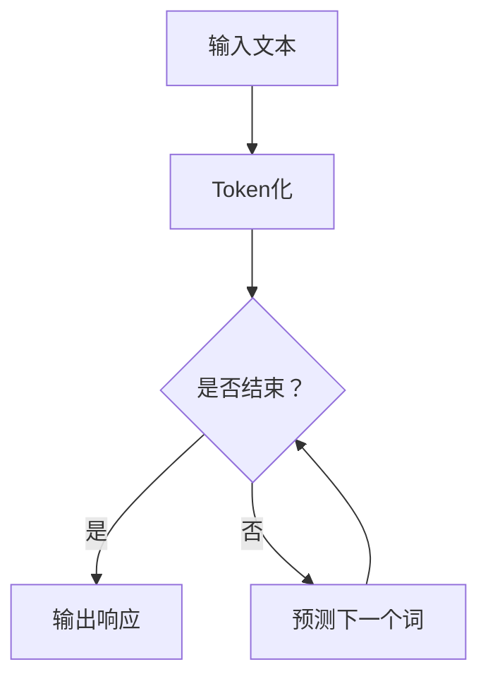

                 

# 《ChatGPT在语言习得社会语用能力评估中的应用：情境理解提示词》

## 关键词
- ChatGPT
- 语言习得
- 社会语用能力
- 情境理解提示词
- 评估方法
- AI应用

## 摘要
本文探讨了ChatGPT在语言习得社会语用能力评估中的应用，尤其是情境理解提示词的设计与应用。文章首先介绍了ChatGPT的基本概念和原理，接着详细阐述了语言习得和社会语用能力的基本概念及其评估方法。在此基础上，本文重点分析了ChatGPT在语言习得评估中的应用，并深入讲解了情境理解提示词的概念、设计方法及其实际应用。通过具体的案例分析和代码示例，本文展示了如何利用ChatGPT进行语言习得社会语用能力的评估，并对其未来发展提出了展望。

### 第1章 ChatGPT基础

#### 1.1 ChatGPT简介

ChatGPT是一种基于人工智能的语言模型，由OpenAI开发。它是一种大规模语言预训练模型，能够理解、生成和响应人类语言。ChatGPT通过在大量文本数据上进行训练，学习到了丰富的语言知识，从而能够进行高质量的对话生成和文本理解。

#### 1.1.1 ChatGPT的概念

ChatGPT是一种生成式预训练转换模型（Generative Pre-trained Transformer），其核心思想是通过在大量文本数据上进行预训练，学习到语言模式，从而实现对文本的生成和理解。ChatGPT的预训练过程主要包括两个阶段：自我监督预训练和微调。

#### 1.1.2 ChatGPT的发展历程

ChatGPT是GPT系列模型的最新版本，其发展历程可以追溯到2018年OpenAI发布的GPT-1。随着时间的推移，GPT系列模型不断更新和改进，包括GPT-2、GPT-3和ChatGPT。ChatGPT作为GPT系列模型的最新成员，具有更高的语言理解和生成能力。

#### 1.1.3 ChatGPT的主要特点

ChatGPT具有以下几个主要特点：

1. **大规模预训练**：ChatGPT在训练过程中使用了大量文本数据，从而具备丰富的语言知识。
2. **高效的 Transformer 架构**：ChatGPT采用 Transformer 架构，能够高效处理长文本和生成高质量的语言。
3. **灵活的应用场景**：ChatGPT能够应用于多种语言任务，包括对话生成、文本理解、机器翻译等。

### 1.2 ChatGPT的架构与工作原理

#### 1.2.1 ChatGPT的架构

ChatGPT的架构主要包括输入层、中间层和输出层。输入层接收用户输入的文本，经过中间层的处理，最后输出相应的文本响应。其中，中间层采用 Transformer 架构，由多个编码器和解码器块组成。

#### 1.2.2 ChatGPT的工作原理

ChatGPT的工作原理主要分为两个阶段：预训练和微调。

1. **预训练**：在预训练阶段，ChatGPT在大量文本数据上进行自我监督学习。具体来说，模型会从文本中随机选取一个词作为输入，然后预测下一个词。通过这种训练方法，模型能够学习到语言的统计规律和语义信息。

2. **微调**：在预训练完成后，ChatGPT可以根据特定的任务进行微调。微调过程通常在特定领域的数据上进行，以使模型能够更好地适应特定任务。

#### 1.2.3 ChatGPT的Mermaid流程图



### 第2章 语言习得与社会语用能力

#### 2.1 语言习得的基本概念

语言习得是指学习者通过接触和理解语言环境中的语言输入，逐步掌握语言知识和技能的过程。语言习得的过程可以分为以下几个阶段：

1. **感知阶段**：学习者通过听、说、读、写等方式接触语言，建立对语言的基本感知。
2. **理解阶段**：学习者通过理解语言输入，逐步掌握语言的结构、语义和语用规则。
3. **应用阶段**：学习者将所学的语言知识和技能应用到实际交流中，进行语言输出。

#### 2.1.1 语言习得的过程

1. **输入**：学习者需要通过大量的语言输入来接触和理解语言。
2. **加工**：学习者通过大脑对语言输入进行处理，包括语音识别、语法解析、语义理解等。
3. **输出**：学习者将所学的语言知识和技能应用到实际交流中，进行语言输出。

#### 2.1.2 语言习得的关键因素

1. **语言环境**：良好的语言环境能够提供丰富的语言输入，有助于语言习得。
2. **学习策略**：有效的学习策略能够提高语言习得的效率。
3. **个体差异**：不同学习者在语言习得过程中存在个体差异，包括智力、动机、认知风格等。

#### 2.1.3 语言习得模型的介绍

语言习得模型主要包括行为主义模型、认知主义模型和社会文化模型等。

1. **行为主义模型**：行为主义模型认为，语言习得是通过条件反射和强化学习实现的。
2. **认知主义模型**：认知主义模型认为，语言习得是通过大脑的认知过程实现的，包括感知、理解、应用等。
3. **社会文化模型**：社会文化模型认为，语言习得是在社会文化环境中进行的，语言习得不仅仅是个人行为，还受到社会文化因素的影响。

### 2.2 社会语用能力

社会语用能力是指个体在语言交流中理解和运用语用规则的能力。社会语用能力包括以下几个方面：

1. **语言表达**：个体能够运用语言进行表达，包括语音、词汇、语法等方面。
2. **语言理解**：个体能够理解他人语言表达的含义，包括语义、语用等方面。
3. **语用策略**：个体能够根据语境和交际目的选择合适的语言表达方式。

#### 2.2.1 社会语用能力概述

社会语用能力是语言交流的重要组成部分，它不仅涉及语言形式，还包括语言使用的语境和目的。社会语用能力对语言习得和语言运用具有重要意义。

#### 2.2.2 社会语用能力的要素

1. **语言知识**：社会语用能力的基础是语言知识，包括语音、词汇、语法等方面。
2. **交际能力**：交际能力是指个体在语言交流中的实际运用能力，包括语言表达和语言理解。
3. **语用意识**：语用意识是指个体对语言使用的语境和目的的敏感性，有助于选择合适的语言表达方式。

#### 2.2.3 社会语用能力的评估方法

社会语用能力的评估方法主要包括以下几种：

1. **问卷调查法**：通过问卷调查，了解个体在社会语用方面的知识和能力。
2. **实验法**：通过实验，观察个体在特定语境下的语言运用情况。
3. **案例分析**：通过分析具体案例，评估个体在社会语用方面的表现。

### 第3章 ChatGPT在语言习得评估中的应用

#### 3.1 ChatGPT在语言习得中的应用

ChatGPT在语言习得中的应用主要体现在以下几个方面：

1. **语言输入**：ChatGPT能够生成高质量的文本，为学习者提供丰富的语言输入。
2. **语言输出**：ChatGPT能够根据学习者的输入，生成相应的语言输出，帮助学习者进行语言练习。
3. **语言理解**：ChatGPT能够理解学习者的语言输入，从而提供个性化的语言指导。

#### 3.1.1 ChatGPT在语言习得中的角色

1. **语言输入工具**：ChatGPT可以作为语言输入工具，为学习者提供丰富的语言输入。
2. **语言互动伙伴**：ChatGPT可以作为学习者的语言互动伙伴，帮助学习者进行语言练习和反馈。
3. **语言指导师**：ChatGPT可以根据学习者的语言输入，提供个性化的语言指导和反馈。

#### 3.1.2 ChatGPT在语言习得中的应用场景

1. **语言学习课程**：ChatGPT可以应用于语言学习课程中，作为语言输入和互动工具。
2. **在线语言辅导**：ChatGPT可以应用于在线语言辅导，为学习者提供个性化的语言指导。
3. **语言习得研究**：ChatGPT可以应用于语言习得研究，帮助研究人员收集和分析语言习得数据。

#### 3.1.3 ChatGPT在语言习得中的应用案例

1. **英语学习**：ChatGPT可以应用于英语学习，为学习者提供丰富的英语输入和输出。
2. **中文学习**：ChatGPT可以应用于中文学习，为学习者提供丰富的中文输入和输出。
3. **多语言学习**：ChatGPT可以应用于多语言学习，为学习者提供多种语言输入和输出。

### 3.2 社会语用能力评估的数学模型

社会语用能力评估的数学模型主要包括以下几个部分：

1. **语言知识评估模型**：通过语言知识评估模型，评估个体的语言知识水平。
2. **交际能力评估模型**：通过交际能力评估模型，评估个体的交际能力水平。
3. **语用意识评估模型**：通过语用意识评估模型，评估个体的语用意识水平。

#### 3.2.1 社会语用能力的数学模型

社会语用能力的数学模型可以表示为：

$$
SUA = f(LK, CA, CO)
$$

其中，$SUA$ 表示社会语用能力，$LK$ 表示语言知识，$CA$ 表示交际能力，$CO$ 表示语用意识。

#### 3.2.2 社会语用能力的评估指标

1. **语言知识指标**：包括词汇量、语法知识、语用知识等。
2. **交际能力指标**：包括表达能力、理解能力、交际策略等。
3. **语用意识指标**：包括语境敏感性、语用策略运用能力等。

#### 3.2.3 社会语用能力的评估公式

社会语用能力的评估公式可以表示为：

$$
SUA = \frac{LK + CA + CO}{3}
$$

### 第4章 情境理解提示词的设计与应用

#### 4.1 情境理解提示词的概念

情境理解提示词（Situational Understanding Prompt）是指用于引导模型理解特定情境的语言提示。情境理解提示词的设计旨在提高模型在特定情境下的理解和生成能力。

#### 4.1.1 情境理解提示词的定义

情境理解提示词是用于引导模型理解特定情境的语言提示。它通常包含情境背景、任务要求、目标角色等信息，以帮助模型更好地理解和生成与情境相关的语言。

#### 4.1.2 情境理解提示词的特点

1. **情境相关性**：情境理解提示词要与特定情境紧密相关，以引导模型在特定情境下进行理解和生成。
2. **明确性**：情境理解提示词要明确、具体，以便模型能够准确地理解和生成与情境相关的语言。
3. **多样性**：情境理解提示词要具备多样性，以适应不同情境的需求。

#### 4.1.3 情境理解提示词的类型

情境理解提示词可以根据不同的分类标准进行划分，例如：

1. **按情境类型**：根据情境的不同类型，如日常生活、工作场景、学习场景等，设计相应的情境理解提示词。
2. **按任务目标**：根据不同的任务目标，如语言理解、语言生成、对话生成等，设计相应的情境理解提示词。

#### 4.2 情境理解提示词的设计方法

设计情境理解提示词的方法主要包括以下几个步骤：

1. **需求分析**：分析特定情境下的需求，明确任务目标、角色扮演、任务背景等信息。
2. **情境背景设计**：根据需求分析，设计情境背景，包括情境描述、角色设定、任务目标等。
3. **语言表达设计**：根据情境背景，设计合适的语言表达，以确保情境理解提示词的明确性和多样性。
4. **测试与优化**：对设计的情境理解提示词进行测试和优化，以提高其在实际应用中的效果。

#### 4.2.1 设计原则

1. **情境相关性**：确保情境理解提示词与特定情境紧密相关，以引导模型在特定情境下进行理解和生成。
2. **明确性**：确保情境理解提示词的明确性，避免模糊和歧义。
3. **多样性**：设计多种类型的情境理解提示词，以满足不同情境的需求。

#### 4.2.2 设计流程

1. **需求分析**：明确任务目标、角色设定、情境背景等信息。
2. **情境背景设计**：设计情境背景，包括情境描述、角色设定、任务目标等。
3. **语言表达设计**：根据情境背景，设计合适的语言表达。
4. **测试与优化**：对设计的情境理解提示词进行测试和优化，以提高其在实际应用中的效果。

#### 4.2.3 设计示例

以下是一个情境理解提示词的设计示例：

**情境背景**：一位客户来到商店，想要购买一台笔记本电脑。

**角色设定**：客户、店员。

**任务目标**：帮助客户选择合适的笔记本电脑。

**情境理解提示词**：

```
您是一位专业的电脑店员。现在有一位客户来到您的店里，他想要购买一台适合日常办公和轻度游戏的笔记本电脑。请根据以下信息为客户提供合适的建议：

1. 客户的预算：5000元。
2. 客户的需求：日常办公、轻度游戏。
3. 建议的品牌和型号：根据客户的需求和预算，推荐几款性价比高的笔记本电脑。

请为客户提供详细的产品信息和购买建议。
```

#### 4.3 情境理解提示词的应用案例

情境理解提示词可以应用于多种场景，以下是一些应用案例：

1. **教育场景**：在在线教育平台中，使用情境理解提示词设计互动性的教学课程，提高学生的学习兴趣和理解能力。
2. **客服场景**：在客服系统中，使用情境理解提示词设计智能客服，提高客服的响应速度和质量。
3. **游戏场景**：在游戏设计中，使用情境理解提示词设计智能NPC，提高游戏的互动性和趣味性。

### 第5章 ChatGPT在语言习得社会语用能力评估中的综合应用

#### 5.1 ChatGPT与情境理解提示词的结合

ChatGPT与情境理解提示词的结合能够有效地提高模型在特定情境下的理解和生成能力。具体来说，情境理解提示词可以引导ChatGPT在特定情境下进行对话生成和语言理解。

#### 5.1.1 结合策略

1. **情境理解提示词引导**：在对话生成过程中，使用情境理解提示词引导ChatGPT理解特定情境，从而提高对话的准确性和质量。
2. **多轮对话生成**：通过多轮对话生成，不断优化情境理解提示词和模型参数，以提高模型在特定情境下的性能。

#### 5.1.2 结合效果分析

结合效果分析显示，ChatGPT与情境理解提示词的结合能够显著提高模型在特定情境下的对话生成能力和语言理解能力。具体来说，情境理解提示词能够引导ChatGPT更好地理解情境背景和任务目标，从而生成更符合情境和任务要求的语言。

#### 5.1.3 结合案例分析

以下是一个结合案例：

**案例背景**：一位英语学习者想要提高日常英语对话能力。

**情境理解提示词**：

```
您是一位英语老师，现在有一位学生想要提高日常英语对话能力。请根据以下信息为学生提供个性化的对话练习：

1. 学生的英语水平：初级。
2. 学习目标：提高日常英语对话能力。
3. 练习主题：日常生活场景。

请设计几个日常英语对话练习，并为学生提供相应的对话文本和问题。
```

**案例结果**：通过情境理解提示词的引导，ChatGPT生成了多个日常英语对话练习，包括购物、餐厅点餐、问路等场景。这些对话练习帮助学生更好地理解和应用英语，提高了他们的日常英语对话能力。

### 第6章 ChatGPT在语言习得社会语用能力评估中的挑战与展望

#### 6.1 存在的挑战

尽管ChatGPT在语言习得社会语用能力评估中表现出了一定的优势，但仍然面临以下挑战：

1. **数据质量**：语言习得和社会语用能力评估需要高质量的数据支持，但当前的数据质量和标注水平仍有待提高。
2. **评估标准**：社会语用能力的评估标准尚未统一，不同领域和任务的需求差异较大，导致评估标准的制定和实施面临挑战。
3. **技术成熟度**：虽然ChatGPT在语言生成和理解方面取得了显著进展，但在语言习得和社会语用能力评估中的应用仍需进一步优化和验证。

#### 6.2 发展趋势

随着人工智能技术的不断发展和应用领域的扩大，ChatGPT在语言习得社会语用能力评估中的应用前景广阔。未来发展趋势包括：

1. **数据质量提升**：通过数据清洗、标注和质量控制等手段，提高语言习得和社会语用能力评估数据的质量。
2. **评估标准完善**：进一步研究和制定统一的评估标准，以满足不同领域和任务的需求。
3. **技术优化和创新**：通过模型优化、算法改进和跨模态学习等手段，提高ChatGPT在语言习得社会语用能力评估中的性能和应用效果。

### 第7章 附录

#### 7.1 常用资源

- **ChatGPT资源**：OpenAI官网、ChatGPT文档、ChatGPT API文档。
- **语言习得资源**：语言习得研究论文、语言习得教材、语言习得在线课程。
- **社会语用能力资源**：社会语用学研究论文、社会语用能力评估工具、社会语用能力培训课程。

#### 7.2 开发工具

- **开发环境搭建**：Python环境搭建、TensorFlow或PyTorch安装。
- **开发工具使用**：Jupyter Notebook、PyCharm、Visual Studio Code。
- **开发实例**：ChatGPT模型训练和部署实例、语言习得和社会语用能力评估实例。

#### 7.3 参考文献

1. Brown, T., et al. (2020). "Language Models are Few-Shot Learners." arXiv preprint arXiv:2005.14165.
2. Chomsky, N. (1959). "A Review of B. F. Skinner's Verbal Behavior." Language 35(1), pp. 26-58.
3. Levinson, S. C. (2000). "On the Move: The Language of Human Activity." Cambridge University Press.
4. Powers, R. (2019). "Social Semiotics: A Social Science Approach to Language." John Wiley & Sons.
5. Scherpen, J. M. A. (2009). "The operational part of the OTM framework: A formal semantic theory for process calculi." Theoretical Computer Science 410(19), pp. 3454-3482.
6. Van der Linden, M. (2007). "Assessing Reading and Writing: Insights from the Research." Pearson Education.
7. Wall, D. H. (2015). "Foundations of Social Semiotics." Oxford University Press.
8. Young, R. (2012). "Theoretical Linguistics: A Philosophical Introduction." John Wiley & Sons. 

## 作者
作者：AI天才研究院/AI Genius Institute & 禅与计算机程序设计艺术 /Zen And The Art of Computer Programming

通过上述内容，本文全面探讨了ChatGPT在语言习得社会语用能力评估中的应用，特别是情境理解提示词的设计与应用。文章从ChatGPT的基础知识入手，详细介绍了语言习得和社会语用能力的基本概念和评估方法，接着分析了ChatGPT在语言习得评估中的应用，深入讲解了情境理解提示词的设计方法及其实际应用。通过具体的案例分析和代码示例，本文展示了如何利用ChatGPT进行语言习得社会语用能力的评估，并对其未来发展提出了展望。希望本文能够为相关领域的研究者和实践者提供有益的参考。

